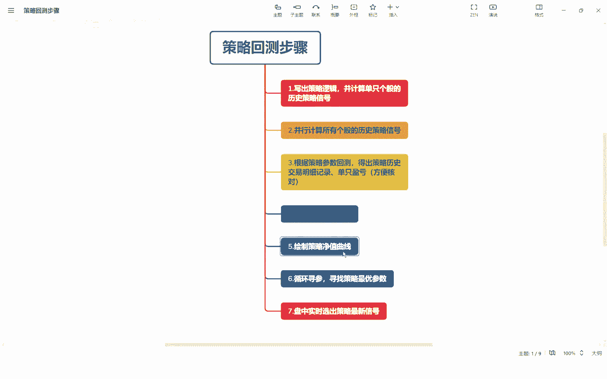
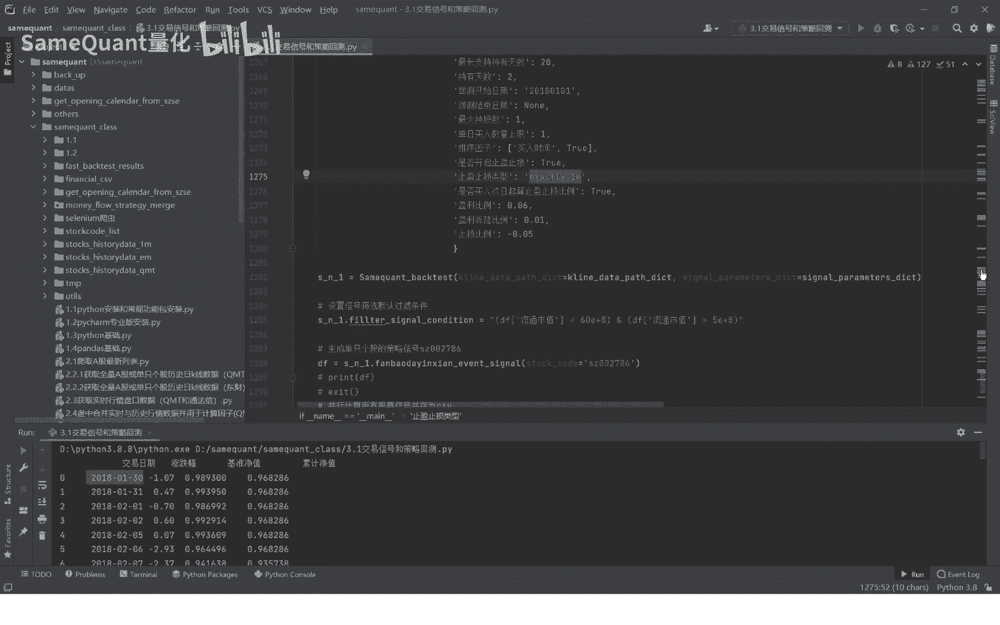

# 3.6 策略评价指标、绘制策略收益率曲线 - P1 - SameQuant量化 - BV13r421E7rc

各位学员大家好，这节课呢继续分享我们的重点课程，是策略回测阶段的非常重要的一步，就是绘制策略的净值曲线啊，这个净值曲线是与这个基准指数，沪深300指数的一个对比。

好我们直接回到代码，因为绘制这个策略净值曲线图呢，需要这个也就是DF这个列车，就是它的一个历史的一个定值的一个表，我们先打印一下这个表哈，先运行一下，这就是策略的一个禁止曲线图。

下面的黄色是基准指数上面的，这个是我们的侧面的镜子是有翻了100多倍吧，需要的一个原数据，就是我们上一期课程里面的啊，涉及到这个表，df light也是净值净值这个表，这净值的表呢。

这个表它是有一个首先有一个交易日期这一列，这一列是必须的，涨跌幅，这个涨跌幅是基准指数，也就是沪深300的一个每日的一个涨跌幅，基准净值是沪深300的，它的一个净值是根据这个涨跌幅加一之后，连成出来的。

这个累计净值呢就是我们策略的累计净值，大家可以看一下后慢慢的拉，这样长期积累下来的话，最后策略的一个净值是我们看到策略的净值是，最后是来到了100多倍啊，128倍啊，只需要这样的一个表格。

我们就可以绘制策略，一个净值学绘制出啊连图了，接下来我们将代码读好了，解读一下这个代码，我们点进去啊，这个还有呢后面会生成除了净值曲线呢，还会生成这样的一个对比的一个图，就是说按年度的基准收益率啊。

就是策略沪深300的指数的收益率，与这个策略收益率的一个对比，然后策略计算出来超额收益率，按年度的，我们可以看到在2022年，这个年度是大幅跑赢指数，2020年也是大幅跑赢。

2019年也是2014年的话，今年前几个月表现不佳的啊，那因为我们反包大阴线这个策略啊，因为我评估了一下，不太适合牛市行情的哈，如果是牛市行情，那么这个策略表现可能会相对来说比较一般，可能现在在14年。

这个当进入火灾之后见底之后，其目前应该是阶段性进入了一个，流失的一个状态，所以说策略收益率不是很好啊，这里呢我们这是年度的一个对比，当然你还可以是月度的对比，月度的，你把这个参数都改成就是阅读的。

我们就运行一下好，可以看到这改成阅读之后，他逐渐的进行一个，我们次面收益与基准指数进行一个对比了，我们点击进入来代码的一个讲解环节，首先呢这个就是我们的最开始的策略的一个，净值的一个表哈。

首先呢我们第一这一句，是判断他这个表是否是为空啊，如果为空的话，我们就运运算这个方法，去计计算策略的一个净值好，如果这一句的货币，我们策略净值用这个df pk这个命名，这个接下来我们将这个交易日期列。

转成由字符串格式转为正，转为这个日期格式，潘大师的一个初对日期格式哈，接下来呢这里呢是有一个分组，是一个按这个resimple and resimple，这个方法进行一个分组，我们看一下。

分组完之后打印一下，因为我们原来的话净值的曲线是按日的，那这个return呢从进行一个周期的一个从从类，叫什么来着，反正重新按照周期来进行计算收益啊，你比如说这个啊jr real type。

因为前面传的是M，所以说这里就是阅读了，阅读就是这个你看他会按每日的基准净值，累计净值就转为月度的每月统计一下哈，一个月统计一下，真跑一下哈，就获得了这样的一个新的一个表啊，按照这个新的表呢之后呢。

我们进行策略一个收益率，策略收益首先策略的一个收益率，它是累计净值，用这个甚至change这个方法去运算它，甚至change第二类的等于一，他的代表的意思是，计算与前一个元素的百分比变化，什么意思。

这第一行啊与前一个去变化，因为前一个没有嘛，所以这个可能是计算都是一个控制，这个与前面这个对比，这个也与前面的进行一个对比哈，我们打印看一下，也就是这里了，策略的收益率就是这里了啊，我们可以看一下啊。

我们上面刚有点有点啊，讲的不是很准确哈，与这个对比啊，这个以这个对比就会获得了，这个那个与这个对比，就获得了这个应该是与这个对比，就获得了这个累计净值嘛，这策略收益率用累计净值这一列哈。

也就是这一行与前一行去对比啊，就获得这个百分比发生在亲姐哈，因为第一行是空值，那稍后面呢我们控制会进行一个填充的啊，同样的这个这个好，这里呢就是填充空值，如果策略收益，因为第一行的话。

因为我们初始的净值，策略净值是一，所以你填充如果是空子，第一行的空子，那么就是这个这种机器净值减去一，就获得了第一行的成本收益率，基准收益率也是一样，用这个person的契机去计算一下，再填充空值好。

超额收益率就是策略的收益率减去基准收益率，这个是按月度分类的哈，按月度这个重构之后啊，我们再打印一下，你看第一个啊，我们把第一行的这些控制度填充之后，是变成这样了啊，这个就是按月来进行一个统计了。

就这样，其实基础的数据计算完了，下面这个就是把这些数据转换成百分比，显示出来好啊，这个就是重置一下索引，那么接下来列名，列名其实是要生成的我们结果的一个列名啊，这需要增加一个，这个是我们这个类里面啊。

回测框架类里面的一堆的参数之后生成的，相对来说有这个前面也讲过，我们这里就不再重复讲了，好吧，同时呢如果是PLA等于M的话，我们将这个英文转换成中文的阅读哈，Q的是代表季度，Y是年度的哈。

好接下来就是一个绘制策略的收益曲线了，绘制测量数据曲线，进入这个方法，首先呢这里呢设置字体，还有啊新建一个窗口，窗口的大小，这个宽度我们这里设的是16，高度为九哈九英寸，然后曲线的标题也是一样。

首先首先是这个名字，这个time的一个太火，这个交易时间类型是隔日买入啊，还是嘴牌买卖，给你加进来，让让大家能直观的看出我们是一个什么策略，是持有期持股数，然后这个是它是否是假如次日起计算。

只因执行比例，这个还是这个哈，一个商场超多少比例回收多少比例，止盈也就止损的规则，我们写加进来啊，猜错就是这个策略的一个名字了，我们把这个恰type啊，这个策略的名字定义为我们这个曲线图的这个。

图表的这个名字，也就是这里哈，也就是这个就是title了哈，这就上面那一行文字，Title，也就是我们把这个char title的文字，复制给DLTPIT啊，就这个BITY啊。

有时候画曲线图要导入这个包啊，matplotlib py plot就是要先导入这个包啊，如果你没有安装的话，你要先happy in store一下哈，比一十多A啊，这这个包用的是这个画曲线图。

用的是这个数据，按日的一个数据，然后这个交易日期，首先你要把这个交易日，先转化成大师的一个时间格式哈，还是要转移，因为这个是字符串的转换时间格式，然后X轴X轴的数据就复制。

就用这个就是这个交易日期这一列，然后Y轴数据，Y轴数据我们就用策略净值，然后还有这个买一个是剩余的N300的对策，然后我们接下来画吧，画曲线图，首先呢画两个图，一个是这个是我们策略的，再画一个图。

然后再画一个什么这个沪深300的两个图，然后这两个图会叠加，然后这个Y坐标轴，这个lab就是就左侧的这个左侧的这个名字，就在这就在这设置哈，增加这个图例图形上添加网格线啊，这个这个网格线。

这里面的网格线就是哈添加网格线，就是这句话，代码的意思说这个都在里面，因为X轴如果是按日的话，你看我们表里面按日的话，这个日期会密密麻麻的会排在这里，你就看不清楚，所以代码的意思是呢。

这样的话就不会说这挤在一块看不清楚了啊，就按年显是自适应的就可以了，好这些呢后一句就是PLT点秀，然后它就显示出来，然后我们这样的一个最后的这个图就看出来了，比较简单，卸下运行一下代码，基本上就能看懂。

然后再自己再尝试一下就OK了，下期我们就要最最一个关键的一个环节，就是循环循参，我们课程里面讲的这些参数，这个策略的参数这些对吧，都是一个填死的，就是我们策略，那么接下来我们就是要改变这些参数。

改变这些参数涨幅的值，然后最大持有天数的还有这个盈利比例，回落比例，止损比例，还有这个这个止盈止损类型这些，然后进行一些循环的形参，然后获得一个最佳的一个参数。

