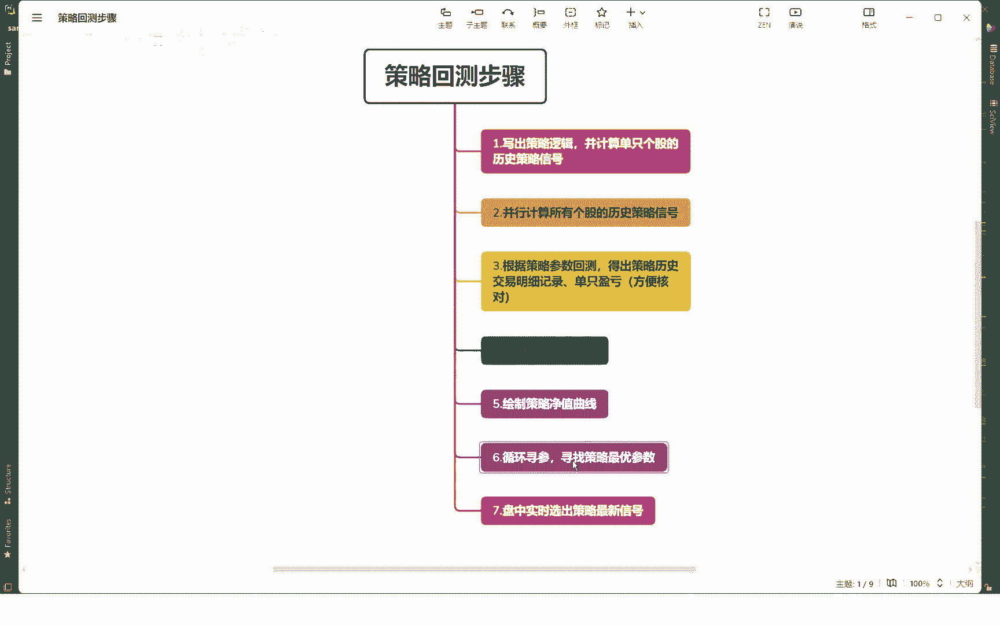
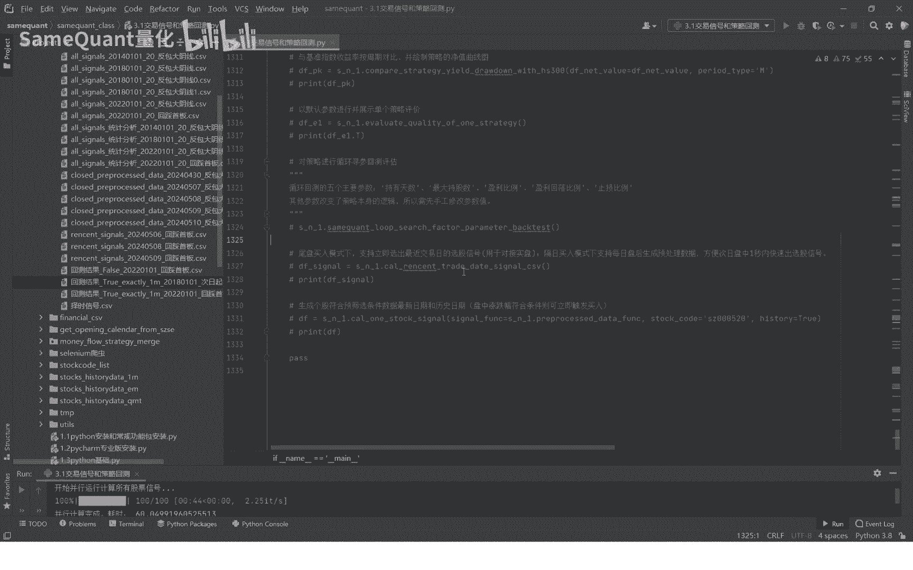
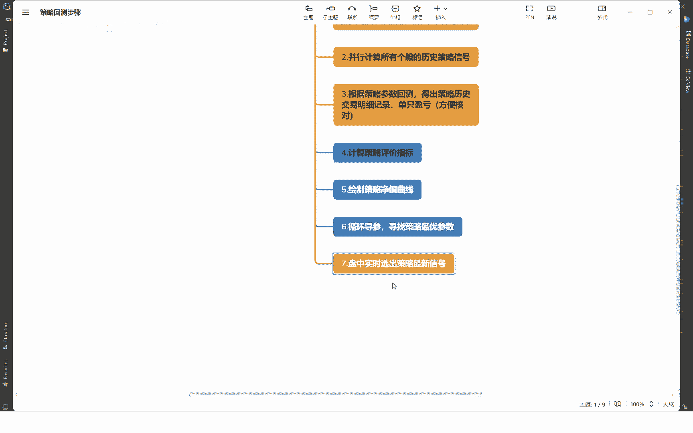

# 3.7 循环回测寻参找最优策略参数 - P1 - SameQuant量化 - BV14T421D7uN

各位学员大家好，这里是sim矿车量化，我是打板哥，这期课程呢是这个重中之重，属于点睛之笔了，也就是循环循参寻找策略的一个最优参数，因为这个过程的话是决定说，你能不能找到一个top的策略，收益率很高。

而且的话就是说可用于实盘的一个策略，这是非常关键的一点啊。

大家已经认真的听，认真的思考，而我们回到代码这个策略的循环群参呢，这个方法用这个方法，这个代码里面都有的，其他的前面的啊，之前演示的这些你都可以先注释掉啊，只用这个我们先来讲一下群参的一个逻辑。

他这个逻辑呢它其实就是循环遍历啊，我们这样的设置的一些参数列表，你比如说这个持股期，持股期啊，这些都是我自己设置的，你可以直接在里面改，比如说29这里面都可以自己设置，自己改啊，这不是我设置的。

就是每天的持股数1233种啊，你可以选的，当然你也可以增加啊，取决于你这个持股数的，你这个参数的设置，取决于就是说你的这个策略，它每天信号产生的多少，如果一个策略每天产生的信号。

可能最多的时候也就是三五个，少的时候就是一个甚至没有了，那么这个时候这里的词就建议不要设大了，就再小一点就可以了，如果你的室内信号每天都产生的信号很多啊，几十个，你这里就可以设置成十啊五啊，15啊。

这种更大一点，因为这个度数越多，它整个策略的收益曲线它会越平滑，这个用通常是这样的，设置策略的一个止盈止损的一个参数，属于止盈比例，止盈比例从500%分之六，一直到40%啊，这些是我自己设置的。

你可以直接改啊，这个回落比例从最高点回落的比例，触发止盈的回落比例有1%，二百三十五十%啊，这些你都可以自己设，这个是止损比例，当烹饪这个列表顺3%，负5%至60%，负10%是止损。

均参主要是寻的是这五个参数哈，那这五个参数对应的是我们策略参数里面，哪几个呢，一个是质数天数，只有天数，就是你改变持有天数这个词去循环回撤，还有就是最大持股数这个参数，另外这三个参数总共五个参数。

主要是改的循环回撤的，寻参的时候，主要是修改的是这五个参数生成的一个，比如说我们现在默认的就是这五个参数，就有差不多有4000多个策略，会组成4000多个策略啊，是这样的，其他的参数你要想修改啊。

也是可以的，但是需要手工的修改，因为你其他的一些参数啊，你改了之后，他整个策略的一个性质都变了，所以说呢它就不是原来的策略，就变了一个策略，所以说你去手动修改哈，修改完之后。

同样也是可以对这五个参数进行一个，循环的回撤，好比如说我们来给大家梳理一下啊，手工改一下，改成fix的啊，只是改成固定的止损比例之后，我们来看一下这个三个策略的一个收益情况啊，这个是翻了89倍。

年化收益106%，这个是固定止盈支付比例，也就是它只要上涨到6%户就无，无论接下来涨跌就立即卖掉啊，亏损5%就立即卖出，是这样的啊，固定的不是说冲高回落才止盈的这种方式啊，这种好我们改回原来的啊。

还是按实力，因为这种啊回落止盈加固定止损，这种通常来说策略的收益率会更好一点啊，所以选择这种方式，接下来我们进入代码啊，这个就可以先注释掉了，除了这个是循环回撤寻参的，这是主函数，其他的我们前面讲过了。

其他的这些都你都可以先注释掉，然后我们进入进入了，首先这个是设置一个路径策略，云单回撤结束之后，你的存储路径啊，回撤结果的一个路径，最后的一个回撤结果大概就是这样的啊，存储进来啊。

你有哪些策略不同的参数，你看这是19天，这三次不数三，这次不数二，这一这个就是循环啊，这个词天数在变啊，这个就循环这种啊，这个也这个有4000多个，4000多个是吧。

这样的就最后生成类似这样的一个CSV表格，方便大家去查看，这句的意思是如果这个回撤结果已经回撤过了，就不再重复了啊，这句话意思，这个呢就是循环遍历，这个我们刚刚说的那五个参数啊，循环变量而形成新的。

再回撤的一个战略的一个列表，那我们这里可以先打印一下，看一下我们这次循环维持它总共有多少个策略，我们看一下，总共是有4200次反包大阴线的一个循环，总共有4200个策略啊，其实他每个策略你看。

比如说最后一个策略给他传的是这一组参数，你看这每一个，这里面的这五个字都代表一组参数，一组参数就是一个成员啊，一个策略大概需要一秒，而我们今天就先取前100个策略啊，进行一个循环的回撤。

下面就是一个回撤的一个方法了，运行回测结束之后，把这个所有的这个策略啊合并起来，成为SV表，好我们就直接运行一下啊，运行前100个，前100个大概应该耗时一分钟哈，你就这样等，耐心等待一下，结束了。

耗时60秒，是100个60秒，结果是这里显示的，他的是参数哈，我来给大家讲一下它不同的参数是什么意思，比如说那个这个true哈，最开始的回测结果正面的一个处，这个处是代表啥呢，处代表是否开启止盈止损啊。

第一个处的意思就是四开启止盈止损哈，开启止盈止损那个exactly就是这个了，止盈止损类型，止损类型我们选择的是这种回落止盈，固定止损就好，这个2018010120180101，就是回车开始日期。

这个参数就记得啊，显示在这个里哈，他的是否买入次起算止盈止损比例啊，在这个出的时候，这里显示次日起计，这个表示表示这个参数是true啊，大家要了解一下最后的发音线，反包大阴线就是策略的信号名啊。

然后我们打开看一下，这是前100，我们可以看一下，是按照策略的一个静止，一个倒序进行一个排列，我们看到最好的策略啊，收益率最高的一个策略，第一个是持股期两天，持股数移植买入次日起即止盈止损。

但是上涨超过60%，同时从最高点回到1%就止盈卖出，亏损在没有止盈的一个情况下，亏损5%，这个止损哈，回测区间啊，这一列是回撤区间，这一列是累计净值是128倍，翻的年化收益率，最大回撤开始结束时间。

年化收益回撤比等等，这些指标全部给你列出来哈，胜率比如说正率全部给你列出来啊，我们来大概看一下，从前100里面看到这个最好的策略是这个，它的参数大概是什么样，首先是持长期两天比较短哈，持股数一上涨6%。

回落1%，止损那个负5%，这个止损跟上涨差不多都是一个相近的哈，我们来看看这个归零策略啊，最后策略净值就只变成0。01了，就变成原来的0。1 1%了啊，净值就变成这个百分亏了99%了。

这个月的参数是啥啊，是这个还是持仓期也是两天吃不出，也是一买入次日起上涨超过15%回落，10%止盈，然后亏3%止损，那么它就是一个归零策略，这个我们大概可以看出来。

这个策略就是说如果说你设置的是小幅止损，大幅止盈，大幅回落止盈的话，那你这个策略大概率就是一个归零策略是吧，所以说我们在设置止盈止损的时候啊，是非常关键的，因为我们的这个回撤框架是支持止盈止损的。

你在市场见到的很多，你比如说什么QMD啊，PC的这个东西说实话还有还有什么的，反正很多吧，在线的那些他们有几个支持止盈止损，回落止盈在几乎是没有支持的啊，它其实是支持了止盈止损，他这个逻辑是非常不严谨。

他是以收盘价来算的，我们的金智顺是盘中的价格来算的，它是按收盘价来算的，这实际是相差万里，是非常不符合的，咱们不得不有自信一点，把这个讲出来，咱们的回测框架那绝对是顶流的一个存在哈。

通过前100次的一个循环回测寻参，你就大概知道哦，我这个策略如果想表现的比较好，他大概率对吧，我的止盈止损该怎么设，我的持仓期该怎么设，我的持股数该怎么设，你心里就有一个有一个比较啊。

相对来说比较客观的了解好，大家呢我们每位学员收到两码之后啊，如果是真管呃，回撤寻参，当你要调试的话，你其他的这我们回车的代码你可以先注释掉，你就只运行这个就可以了，其他的不用管的哈。

我把这个取前100个的我注释掉啊，因为大家收到源码之后，你去循环回撤询参数，那就是进行4000次，这4000次可能要40多分钟，所以我这里就不再，大家收到源码之后就自己去测巡山，那巡回测结束之后。

概率这个结果应该会超过128，大概率可能会达到150倍那个样子啊，最最好的啊，所以大家去回车试一试哈，好了，这期的一个循环回车巡参我们就分享结束了，下一期呢也是这个很关键的一一步了。

下期就是这一步了，因为我们的一个巡查结束之后，如果我们找到了一个策略，觉得还比较靠谱的，历史的结果又很好，我们认为是可以实盘的，接下来就是对接实盘，对接实盘我们有一个要求，时间上的要求。

就是说比如说我这个反包大阴线，这个策略盘中出现信号了之后，我能不能一秒钟就捕捉到，只要他达到涨幅达到8%，触发了我的一个条件，满足了，我能不能一秒钟就捕捉到，一秒钟捕捉到。

然后立即去对接QMT和PC的去交易，当然对接PC的可能有难度啊，对接QMT是可以的哈，或者对接东财啊，这些也都是没有问题的，你能不能一秒钟就对接到师范交易，这就很核心了，所以我们下节课就讲这部分内容。

这部分内容啊也是很关键的啊，也就第七这个很关键啊。

