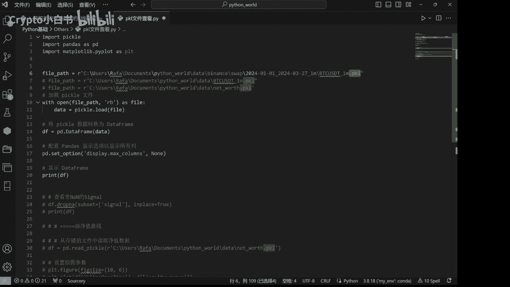
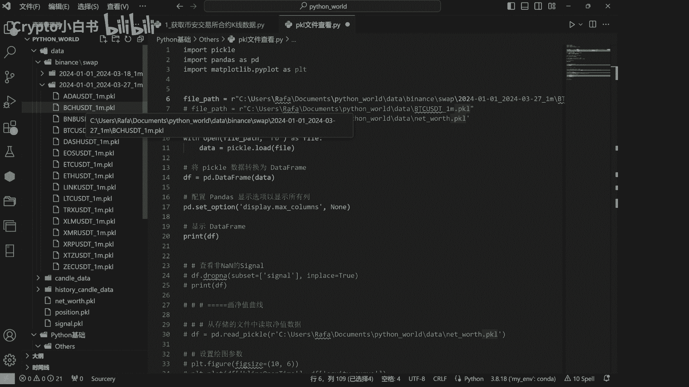
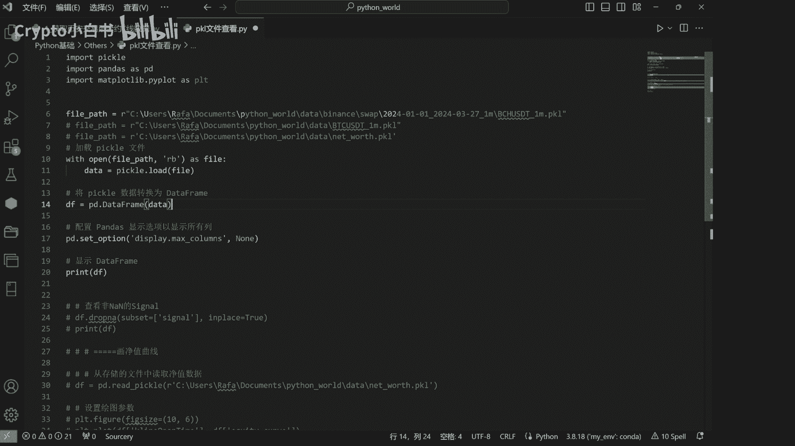
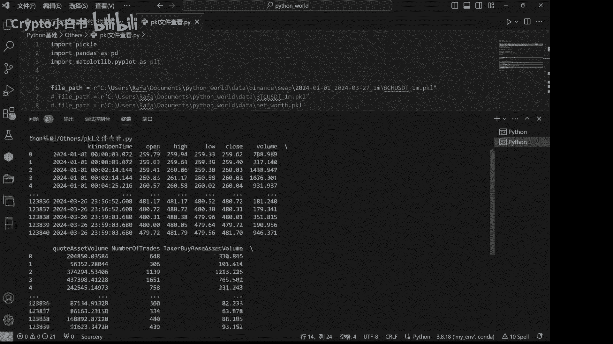

# 3-如何查看下载的k线数据 - P1 - Crypto小白书 - BV1Jw4m1U7Vq

大家好，这里是小米小白书，现在呢我们来讲一讲，如何查看我们下载好的pk l历史K线文件，PCL结尾的历史K线文件，首先呢我们去去到刚才下载的文件夹中。

我们复制一个路径。

然后将其复制到这个文件中，然后运行就可以查看我们下载的pk文件，到底是长什么样子的，那其中的原理也很简单，我们使用open data加载pk文件。

然后将pk文件呢转化为我们可以阅读的data frame，再进行一个print。

运行一下，可以看到我们获取的K线数据是这样子的，它一共有九列，那第一列呢是k line operator，也就是OK现在开始时间open开盘价最高价，最低价收盘价成交额等等等等，那么后面的这三列呢。

