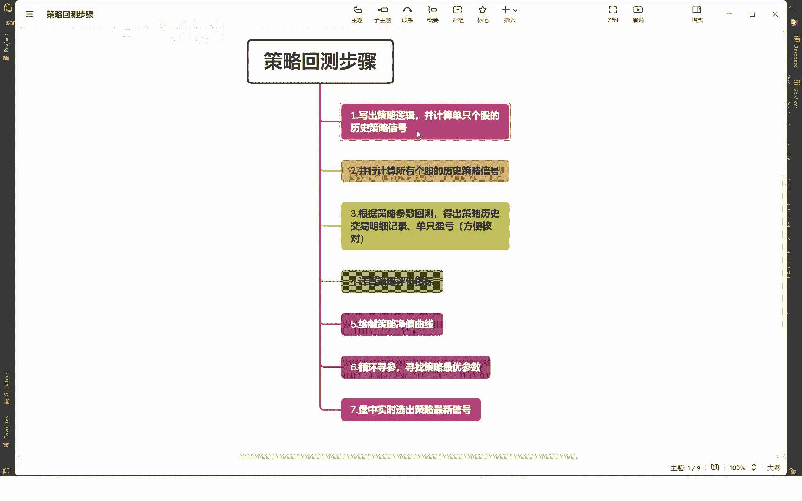
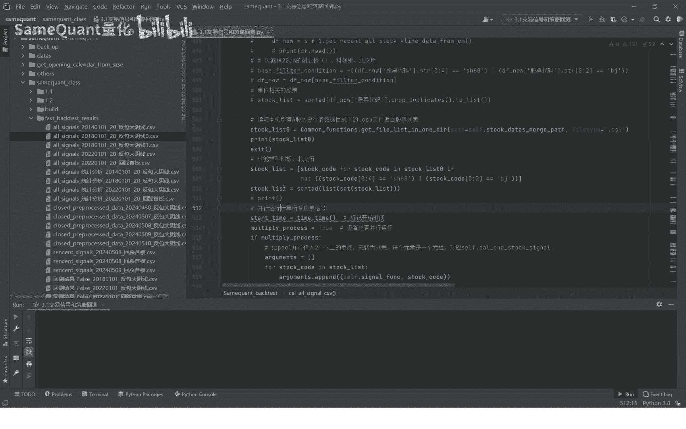
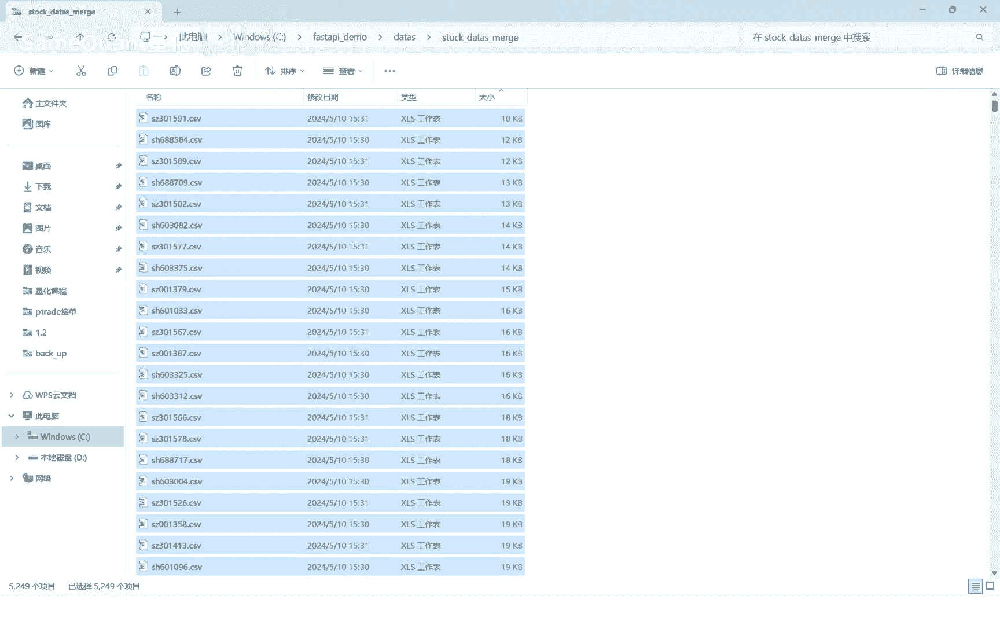
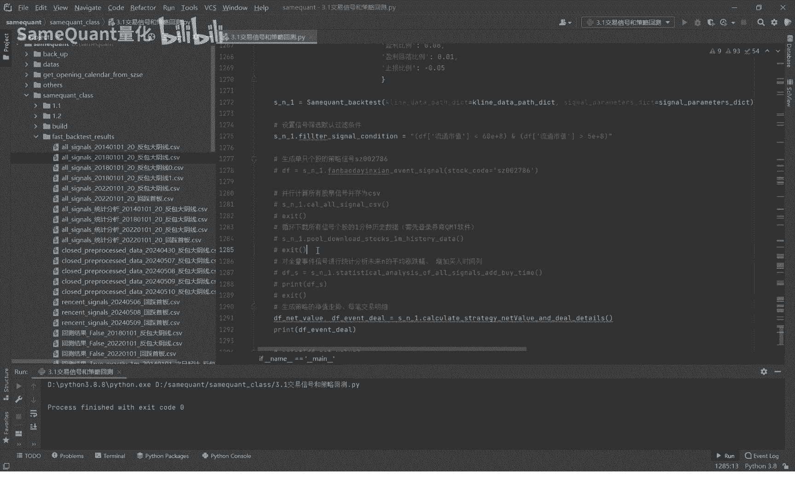

# 3.3 计算策略所有个股历史策略信号 - P1 - SameQuant量化 - BV17b421B7Bc

各位学员大家好，这期课程呢我们继续分享咱们的count back test，这个策略回撤的重要的第二步，并行计算所有个股的一个历史策略信号，因为前期上一期的课程，我们讲了计算单只个股的这些计算。

所有个股的计算，所有个股的主要用的是这个方法啊，啊我们直接点进进去，首先呢这个呢是自己代码的意思，你要设置一个，就说我们策略记号计算完成之后，设置一个存储目录，这个目录是由由于我们的一个类里面的一些啊。

默认的一个参数组成的，建大建议大家这些不要不要轻易随便改哈，改了之后，可能其他的一个策略的其他环节会遇到问题，策略计算完成之后呢，会生成这样的一个文件，CSV文件存储到本机。

这一句的意思就是说先判断你所有的信号，这个文件，cs文件这个是否这个路径是否已经存在，如果存在了，就不需要重复计算，如果不存在，那我们就开始计算啊，这句话是很重要的，接下来呢我们要读取所有个股的啊列表。

所有个股包含目前正在正常上市交易的，还要包含目前已经退市的，或者是终止上市，这些都要通通都要包含进来，因为我们的一个策略，它在历史回溯过程中，它在有些信号，它可能在历史过程中产生的信号。

但是它目前退市了，所以呢我们也要把它包含进去，这样才是国际上才是比较严谨的，获取到之后呢，这句的意思是过滤掉科创板，北交所，因为咱们这里啊只针对10cm的股票尺，所以要股票过滤掉这个北交所科创板的。

这个北交所科创板就是这个，当然有的人说啊，还要说这个现在创业板也是20cm的，当然我们这里是是不能过滤，先先不能过滤创业板啊，这创业板啥时候过滤，我们再说啊，才改为20cm，它之前的话是10cm。

所以说我们我们回车的话，我们肯定要把所有的信号里面，要包含10cm的创业板，那肯定是要包含进去，不能把所有的创业板都忽略掉啊，这是不可以的哈，我们直接打印看一下，先先打印。

也就是我们本机的这个目录下，所有的这是所有的一个个股的历史行情数据，K线数据它总共有5249个，但这里面不包含在交所上。

当然包含对视和终止上市的哈，总共有5249个，我们读取一下，看一下，再打一下它的长度啊，5249没有问题哈，接下来让我们过滤之后再打印一下，然后要打印这个名字要改一下，这是过滤之后是4675个。

这个股好，过滤完成之后，接下来就是一个并行计算的一个函数了哈，这是B型计算，这这并行计算就是用的这个power这个包哈，这个啊这个power这个包你要引入这个包。

这个包呢我们来看到最上面就是这个power power，这个就是用于music processing import power，这个就是一个并行计算的一个包，你要先引入啊，如果说提示你没有安装的话。

你提前还要进行安装一下哈，安装了我们之前也分享过，就pb in10多对应的包就可以了啊，这个就不来细讲哈，就接着就开始并行计算啊，我们在这前面要补充一点这个方法，因为我们获取这个股票的列表。

是读取这个本机文件夹的，所有个股的一个历历史，那其实之前呢我们还用过另外一种方法，另外一种方法就是获取当前啊A股的，在交易的A股的列表列表里面呢，再过滤掉北交所和科创板。

这个呢肯定毫无疑问是不是特别严谨嘛，因为你这里面没有包含历史上，退市或者终止伤势的，所以这个方法我们就注销掉了哈，当然大家可以拿来参考，我们只是注销掉了，接着我们就是并行运算。

运算完之后就会形成一个DF1data frame，一个表格，这里面包含了所有的这股的历史的反包，大阴线的一个信号，好接下来呢要过滤了新规的创业板，因为新规的创业板是20cm吧。

因为我们的策略只是针对10cm的股票是吧，所以20cm的我们要过滤掉，那过20cm的创业板要过滤掉哈，因为我们前面没有过滤掉创业板，那20cm的创业板过滤这个代码，第一呢，它上市交易日期是要大于。

2020年8月23，它的股票代码呢是这个包含深圳三零，深圳三菱创业板开头的号就行，接下来呢我们还要过滤掉一个什么呢，我们要把包含信号单日包含退市的st的，新上市的这些也过滤掉这所有信号，棉花过滤掉之后。

当然你还可以设置一些这些条件哈，其他的条件，比如说我们这个车里面还用到另外一个条件，这个条件啊还增加了这个条件，这个条件是流通市值大于5亿，小于60亿，这个条件你也可以把它注销掉。

注销掉就没有加这个条件好，如果你取消注释，它就是增加了这个条件，55亿到60亿流通市值也就是小小事实哈，这个条件在这加，当然这个条件你也可以改哈，这个也是可以改的啊，你自己想做其他的条件你都是可以改的。

这个这个给各位，你们自己根据你们想要设置的一个条件，你进进行一个筛选的哈，作为一个排序，排序完之后就就存储哈，并且这个会打印并行计算的时候，会打印机耗时了多长时间，好我们接下来呢我们就这样。

我们就那个并行计算一下哈，直接运行看一下，看一下5000多只股票要花多长时间，大家可以耐心等待一下，这个时间大概是30秒左右啊，半分钟左右再耐心等待一下哈，很快就好了，现在是感觉时间过得有点慢。

等耐心等待一下，等会我们会不会出来，过了多少秒，他这会生成一个信号的一个文件的啊，现在整个电脑在运行运算当中，所以你会发现现在ZPU风扇转了，转速会明显加快了，花了71秒啊，一分多钟吧。

这个一分多钟为什么一分多钟了，一分多钟之后生成了这个文件哈，这个文件其实一分多钟非常正常啊，因为你自己想想，这个信号是首先是4760多只股票，你计算的是从2018年1月1日到现在的，也就是6年多的时间。

也就是将近5000只股票，6年多的时间，一分钟41秒，这个时间不算久吧，其实是非常快的，就生成了这样的一个文件哈，我们可以看到啊这样的一个文件，当然最后这个它是从1月30号开始的。

因为我们前期课程也讲过，如果你是设置向前取60天的啊，其实是不足的，其实是要改成90天的啊，当然我们目前这个课程里还是按60天啊，向前取60天算的，所以大家也不用不用那个到不用纠结哈，你到时候收到之后。

你把那个60改成90就可以了，你不改也没有关系啊，就这个我们看一下有哪些字段啊，这些字段是我们后面几乎是必须要用到的，字段啊，也就是说你所有信号的JS文件，你必须要保证你后面的啊。

你的策略中字段你必须都有这些字段，你比如说这个是代码名称的流通市值，流通市值是我们有可能是排序字段要用的，所以这个是必须的，另外涨跌幅是吧，这个信号当日的一个涨跌幅，这个是必须要的。

我们策略框架必须要用的一个字段，所以你必须要有开盘价，收盘价复权啊，这个你带上都没有问题，另外是这个未来20日的收开地高价，这个20这个参数你是可以自己设的啊，二十三十六十都行，你自己设好不容易。

这一列是必须要的哈，这一列是大家要注意，这个是必须要的啊，这一列没有，那就那我们整个回车框架就不支持了，这一列就是反包大阴线，它也代表他这一天出现了反包大阴线，这个信号列肯定也是必须的哈，好。

这样就说我们这个计算，所有的策略信号就完成了哈，因为我们刚刚已经讲过，他完成之后，我们有一句有一句就这一句哈，意思就是先判断这个策略信号的文件存不存在，如果存在就直接退出，不存在才计算啊。

因为我们已经已经计算了一次，所以说它已经存在了，我们再运行一下，你看再运行一下，他就是他就直接就跳过去了哈，就没有再用了，因为已经存在了嘛，所以就直接跳过去了，好了，我们这节课的一个分享就到这里了。

下一节课呢依然是核心的一个课程，核心的课程是什么呢，因为我们战略的一个回撤，我们讲过啊，是需要用到什么，需要把买入的时间，卖出的时间精确到分钟，那精确到分钟就涉及到一个问题。

你需要有分钟级别的一个历史数据啊，因为分钟级别历史数据数据量是比较大的，所以说我们并没有提前全部下载到本机，所以说啊，下节课就介绍，如何让我们策略需要的分钟数据给下，下载到本机好了。

这期我们先到这里。