# 3.4 下载1分钟历史行情数据和计算全量信号N日平均涨幅 - P1 - SameQuant量化 - BV1Hr421j73Z

各位学员你们好，这里是新媒矿车量化，我是打板哥，这期呢我们分享从任意券商的qt软件啊，循环下载我们前期计算的所有策略信号，个股的一分钟历史推线数据，因为低分钟数据是非常重要的，为什么呢。

因为我们的这个策略回撤，真诚的战略的交易明细的过程中，要用到一个是买入时间和，卖出时间是具体到分钟数的，你要计算出具体的分钟数，所以你必须要有意思的，一分钟级别的行情K线数据。

但是呢我们之前是没有下载的，因为历史一分钟历史行情数据是非常大的啊，所以我们现在要提前下载，那下载之前呢，你找任意一家券商，你去开通你的q mt软件啊，这个一定要开通，不开通是不行的啊。

最好是要开通开通mini q m t哈。

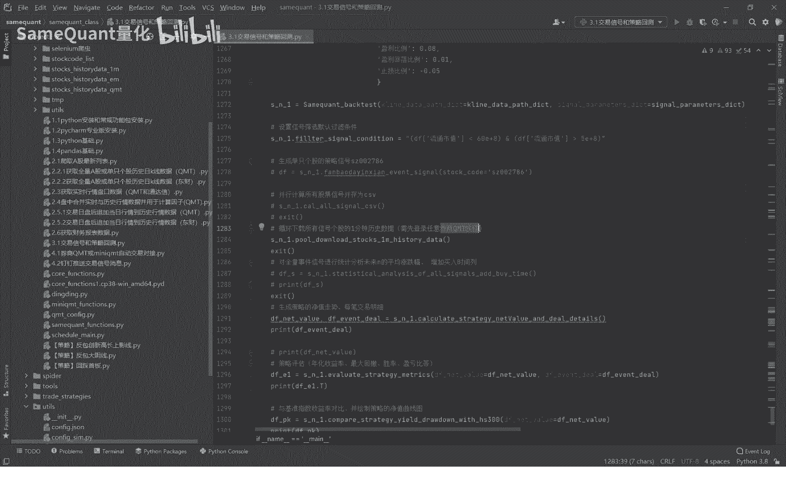

也就是小QMT这个软件开通之后呢，我们就直接运行，直接运行一下。

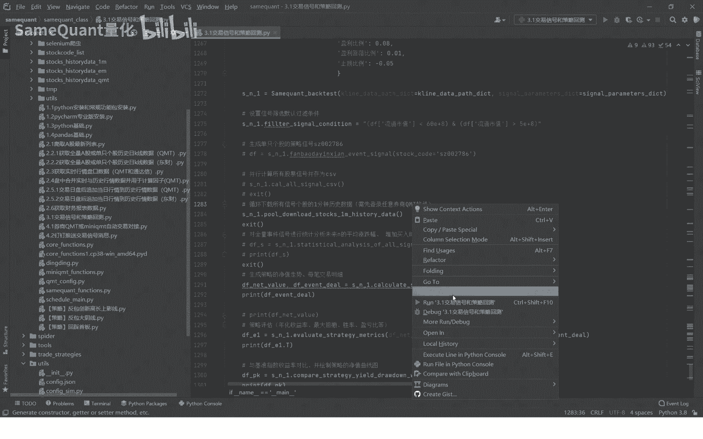

运行之后呢，他就会开始下载，很快就会下载完了，下载完之后一分钟级别的行情数据就准备好了，那我们就耐心等待吧，看这个样子应该就很快就下载结束了，好已经下载完了，大概时间也就30秒吧，就全部下载完了。

下载完之后呢。

那么接下来也是要进行一个特别重要的一个，我们因为我们策略是根据数，是涨幅达到8%的时候触发买入的嘛，所以说我们需要把买入的时间那一列给追加到。

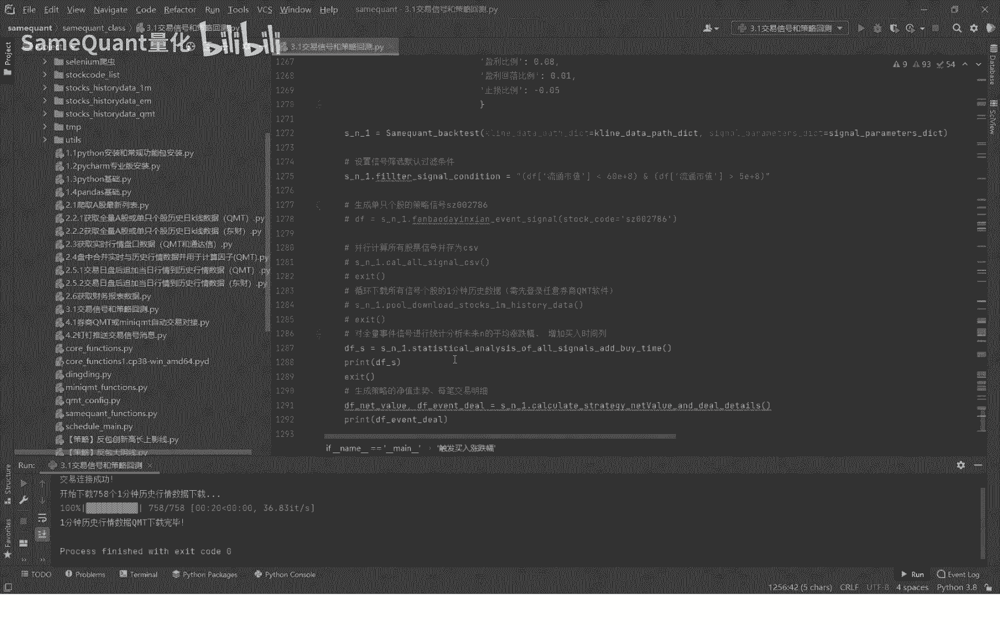

追加到我们上一期讲的这SUV里面，大家看一下这一期我们获得的这个策略。

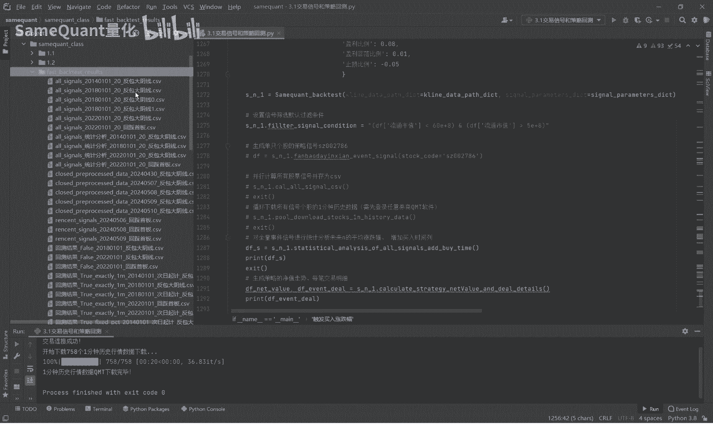

所有的信号的这SUV文件啊，我们可以看到这里面是有交易日期，交易日期其实就是买入日可以买入的日期哈，这还不是真正的买入期，就是说当日有哪些信号的一个交易日期啊，你比如说第一天有一个啊，这一天有三个信号。

把这一天有两个信号我们要增加，就说你发的时间，我们出发时涨跌幅8%嘛，我们要啊，这是符合条件的，那我们要把这个触发具体触发涨幅8%的，首次触发了一个时间，给追加到这个CSV里面来啊。

追加完之后大家再可以看一下哈，你这要追加直很简单，直接运行这个方法就行了。

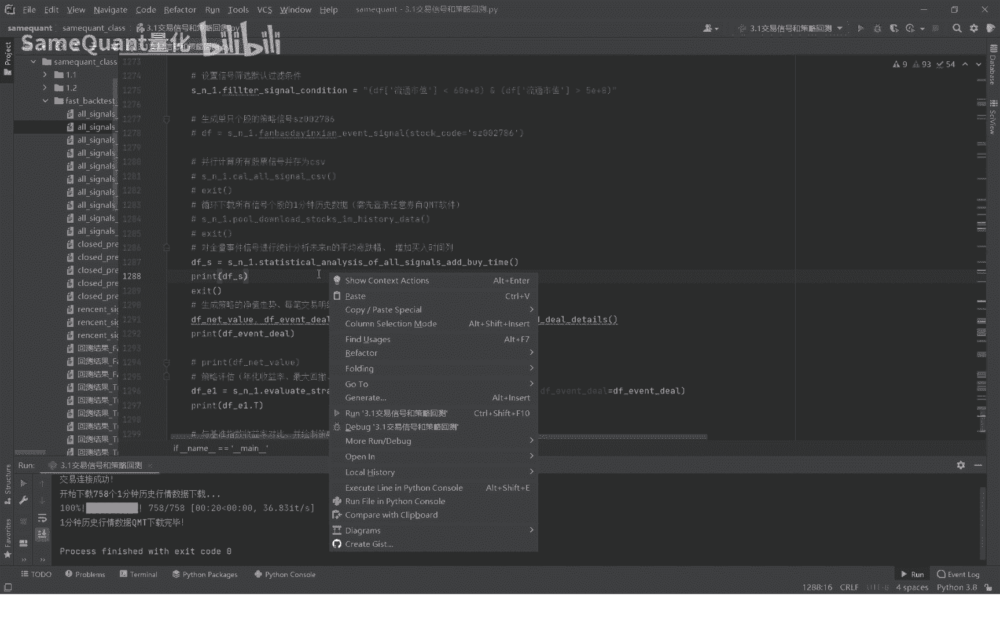

直接运行好，运行完之后，这个也就追加完成了，我们大家再次打开看一下，载入时间就有了，那这个买入时间呢啊，你可以自己对照这个行情的K线图看一下，是这支，比如说这支票，它是不是这这一天的10：

13分触发了涨幅，8%啊，在每一个时间都是很精准的，你可以不是去核对一下啊，当然我们都核对过了，没有任何问题啊，所以你也可以再核对一下，好，就是这样，另外呢我们还生成了一个做了一个计算。

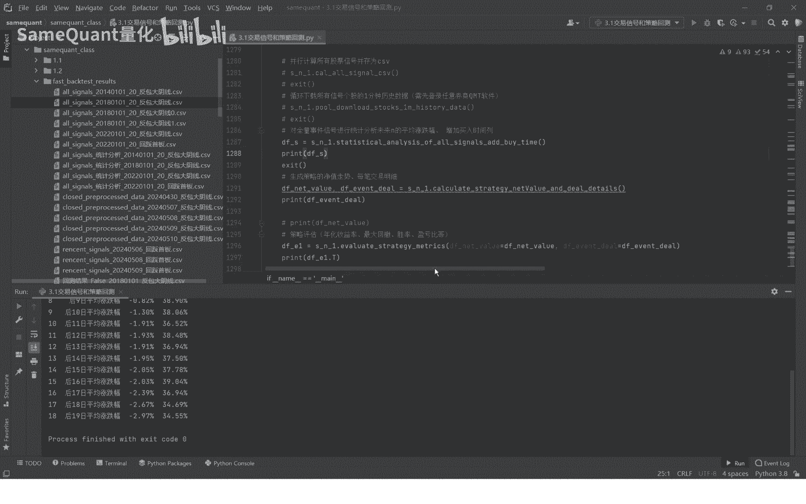

做了一个什么样的一个计算呢，我们将这个所有的，这也就是这个表里面的所有的信号，他次日也就后一日的平均涨跌幅给他统计出来，你看这个平均涨跌幅是1。08%，这个呢它收涨的概率，次日收涨的概率是53。93%。

互联二是平均涨跌幅是1。01%，收藏概率是49。16%啊，我们可以看到越往后概率越来越低的哈，所以说这肯定是一个短线策略，毫无疑问好。

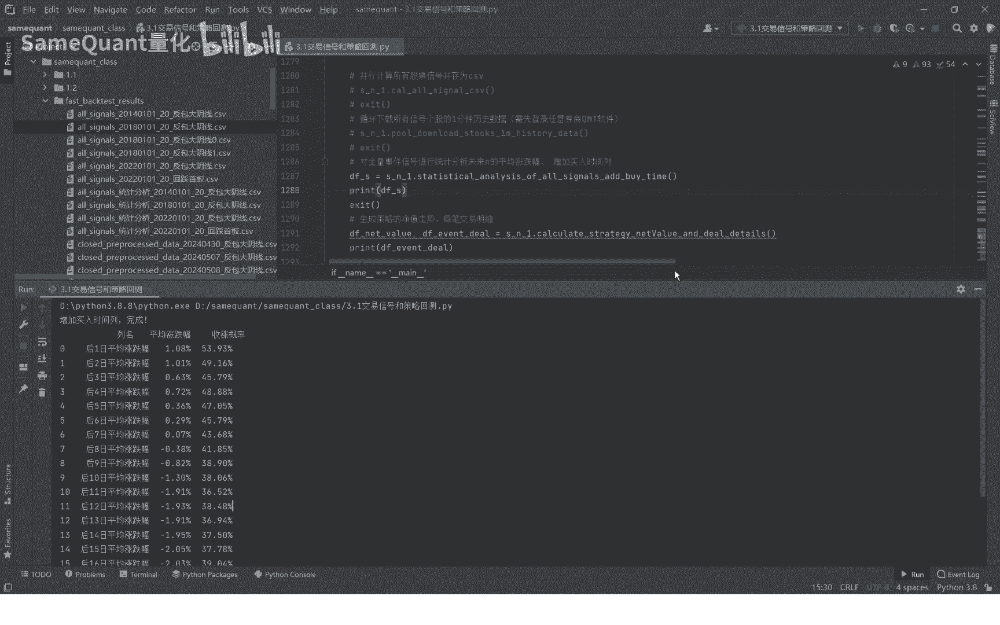

就这样，接下来再进入这里面，再给大家讲一下考试，如何把这个具体的买入的一个时间。

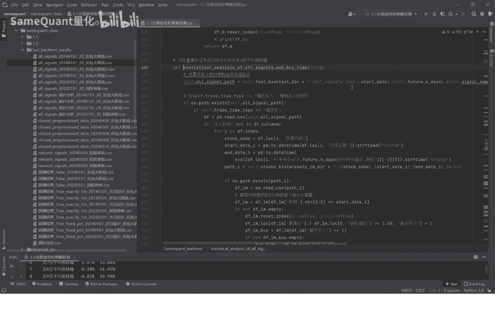

给追加到这里面了，这里你是呃，首先呢你是要读取这个CSV文件，去便利找到它的一分钟行情数据，当日的一分钟行情数据给他追加到，把涨跌幅触发到8%的时候，这个8%是你自己设置的，你改成其他的都是OK的。

不是说一定要8%啊，其他的你只要在这个我们说在这里面参数里面。

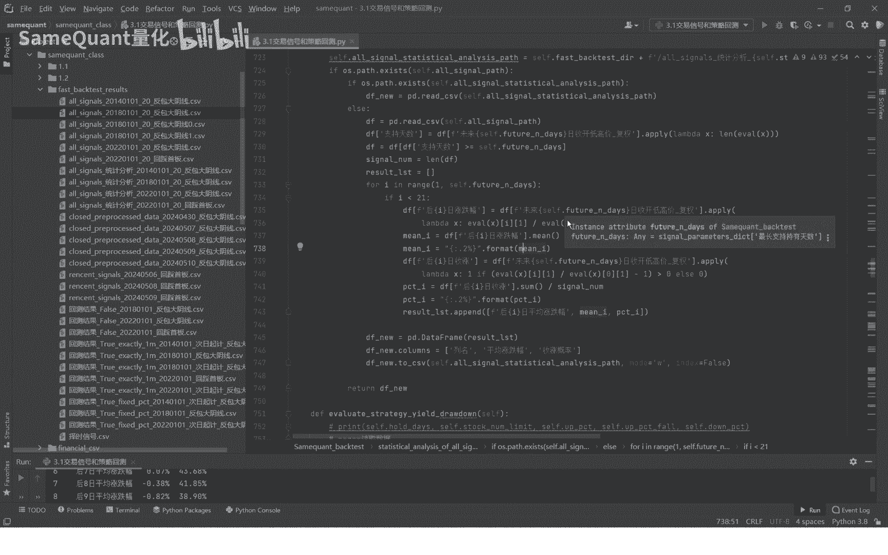

就在这里你改一下哈，就可以，它就会就可以了啊，好改完之后，他就这个方法里面就会把时间给准确的买入。

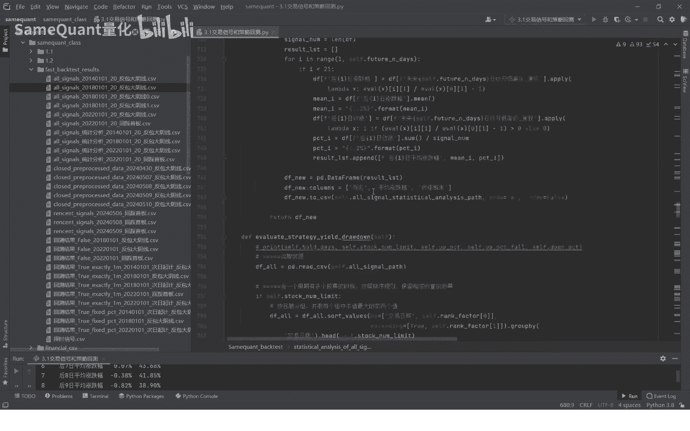

时间给计算出来啊，同时呢会计算这个过未来20天以内的哈，平均涨跌幅和收涨概率。

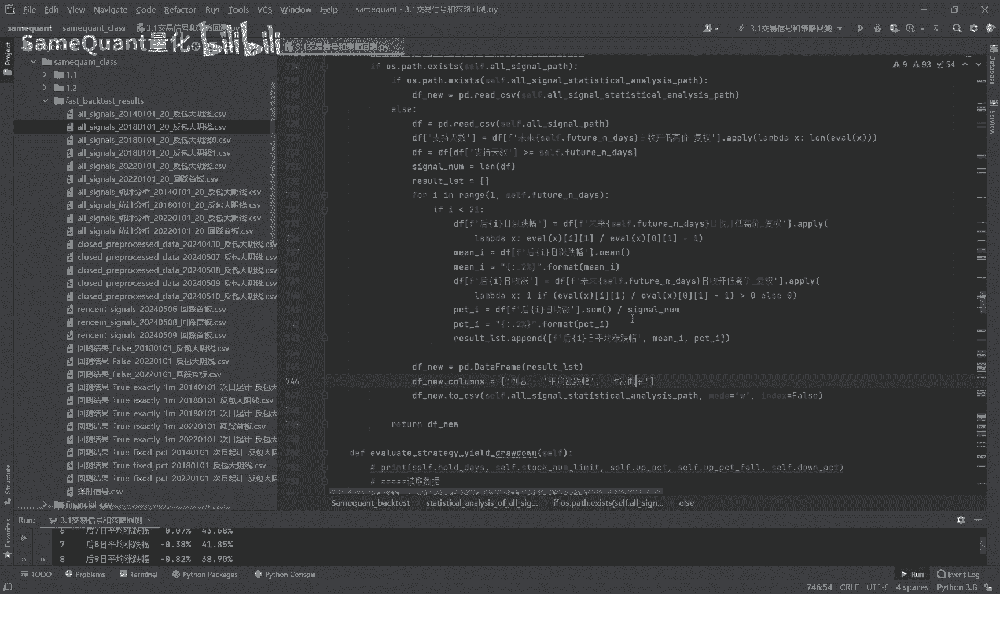

也就是我们看到的这样的一个表，好这样呢这个就是这样，我们本期的啊这节课程就到这里了，半节呢我们会讲这个真诚策略的一个净值走势。

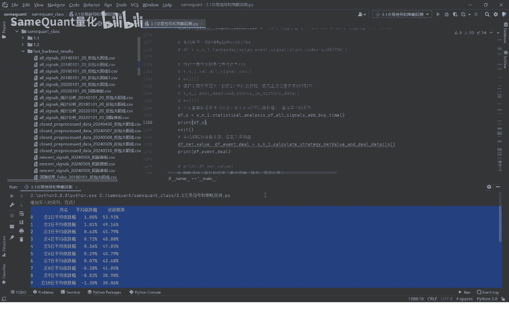

以及每笔交易明细啊，这节课也是重中之重了啊。

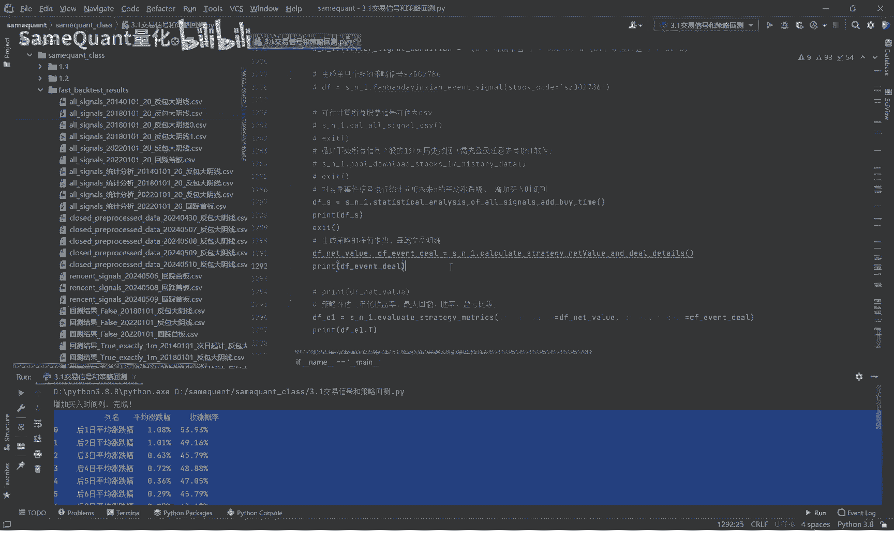