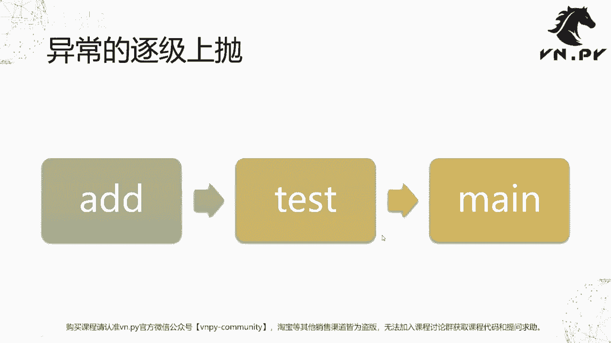
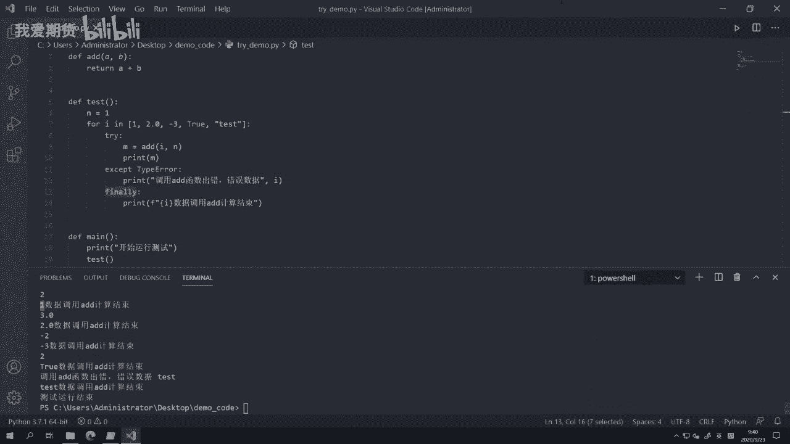

# 30.异常的处理 - P1 - 我爱期货 - BV1u72gYNEyX

OK欢迎来到量化交易零基础入门系列，30天解锁Python量化开发课程，那么今天呢是我们的第30节课哈，在上一节课里面，我们初步接触了异常这个概念，那在这节课里面呢。

我们要来学一学怎么样去捕捉住这个异常，去正确的处理它，也就是Python里面这个叫做try except的语法，那么我们先来看一下异常会带来什么问题啊，在执行的过程中，其实我们上节课也都看到了。

如如果我们某一行代码写错了，他触发了一个错误，那么此时呢，这个我们的解释器会自动立即去抛出异常，哪行出错，哪行立即就抛，但是抛完之后它会造成我们这个程序就停止，是执行了啊，相当于我如果这个写的时候啊。

有什么这个代码那一行的没能运行下去，那行只要出错了，那我这个程序不好意思，就只有退出了，这种情况呢，在做一些唉这种快速的脚本开发的时候，可能非常方便啊，他这个停下来，你随时就知道错在哪了嘛。

你就紧接着去解决它就好了，但是在一些更加啊实用的情景里面，或者更加实践化的这个应用里面，那如果立即就停下来的话，那这个反而会带来更多的问题，我们来看几个需要我们能去处理这个异常。

然后呢我们去正常的再继续运行下去的情形，那么第一个情形叫做预期操作，那可能啊，一上来我在这个我们的交易接口里面啊，那这个接收到的一些合约的数据信息，然后在这个数据信息里面，我要我们要把它的这个口味代码。

和这个交易所的关系给保存下来啊，就像我们上节课做的那个demo一样，那这样呢后面我们上层的交易程序，在下单的时候，如果他没有传这个叫做额交易所的那个代码，我只要通过合约代码，我去那个字典里面查。

我能查到的话，就我也知道他是哪个交易所，我同样可以成功发单出去，那在这里呢我们有可能在这个比如说你在发单，或者说你在调用的时候，有可能啊这个你调的时候，合约的那个对应的信息还没回来。

所以你的字典里面还不存在，这个合约代码对应的那个交易所的值，那这个时候呢，往往啊这个只是因为数据还没到嘛，没必要就在这个地方去停止运行啊，我们可能在就这次没查到，那就算了，这次我可能这个单就不发了。

我等到下一轮再发就好了，只要我发单，我告诉上面这次发单失败了，那下一轮我再发，那这个就是一个比较正常的逻辑，而不应该说哎我只是那个合约代码没找到，我就把它给停下来了，好。

或者有的时候我可能要去缓存一些这个，tick数据或者查询tick数据的时候，那一上来我可能去访问字典里面啊，看看有没有之前创建的那个对象，如果有的话，我就直接取那个对象出来，把新的价格更新上去。

如果没有的话，那我需要创建一个全新的对象，用来存放对应的数据，这里也是一个啊，就是访问字典里面就不存在的那个值，你有可能你知道你访问那个值，是有可能它现在还不存在的，但是如果没有的话。

你也没必要就是停止运行，你没有，你就直接在字典里面创建一个全新的值，然后把那些数据更新上去就好，所以这个就叫做所谓的预期操作啊，有的时候它这个我们的代码里面触发异异常呃，不好意思。

触发异常是我们写程序的人，我们预期之中的行为的时候，那这个就需要正常处理，第二个啊，有的时候你可能在啊这个处理啊，这个我们的比如说交易接口，推送过来的一些数据的时候啊，因为这个数据是来源于外部的。

举个例子，在我们数字货币交易的这个世界里面，那我们经常要通过啊我们底层socket啊，这个socket这个词呢，是我们操作系统提供的，一个叫做网络通讯的套接字工具啊，如果对这个感兴趣。

可以百度搜一下这个词，然后可以去看一下，那么啊啊不感兴趣的，反正你就记住它，就有点像叫做我们一般讲的网络通讯的端口啊，你既然连上了外面一个数字货币交易所，你就要从你要获取行情嘛。

肯定要从那个所谓的端口去接收行情，数据的推送，然后呢这个推送管数据我们知道啊，这个电脑里面的数据最原始的，最底层的东西都是所谓的010101，在至少二进制的数据。

然后我们把它在操作系统里面再解析成对应的，不管是英文，中文数字也好，然后这样，我们人或者我们的程序才能正确的去处理，但是呢因为网络传输的各种问题，它有可能传过来的数据就是错的，举个例子。

你可能是希望通过这个底层接收到001，把它解析成一个字符串，但是呢因为服务端出了什么异常，他传过来不是字符串，他直接传了个整数，或者传了一个空的数据包过来都有可能，那在这样一个情况下。

因为我们socket去收到什么，其实不我们没办法完全控制，这个东西是来源于外部的，如果为外部给我们发了正确的东西哦，那OK我们的这个解析啊，把它变成一个字符串，变成一个JSON。

转成一个Python里面的字典结构去做处理，那都没问题，但是如果他那边传了个错的数据过来，他比如说直接传了一个啊这个空的整数啊等等，那这样呢我们如果还去解析就会出错，但是这种出错没关系，因为出错的时候。

我知道这是服务端的出错，他可能只是临时性的这个数据包，它发错了，或者说在网络传递的时候啊，因为什么原因这个数据包被破坏了，那我只要丢掉这个数据包，我不管它，我再继续处理下一个数据包就行了。

所以此时呢也如果解析的时候触发了异常，我们也应该能正确的处理，当然这个正确处理可能就是啊不做任何处理，就这个数据包我就把它扔掉啊，继续去做下一个，那这个呢也是一种需要我们正常处理的情形。

最后啊一个叫做主动处理，什么意思呢，有些时候我们可能想要在我们这个Python里面去，打开一个本地的文件，往里面写一些信息，在这里，这个操作呢有可能会出现一个无权限的情况，什么意思啊。

我们知道在windows上，每个文件只能有一个进程打开可写啊，比如说我们打开一个word文档，此时如果你再去双击这个word文档，再去打开它啊，那就会有一个对应的提示，报错告诉你这个已经被锁定了。

你要么以只读模式打开，要么你就不能打开啊，在Python里面也一样，有的时候我们可能想要打开一个文件，但是如果这个文件被其他程序占用了，那我也不至于把我的程序退出，我可能就抛出一个对话框，提示你一下诶。

这个文件现在正在被别的占用着，但是我们要用它，所以你应该把其他那些程序给关掉，你关了之后再来点确定，我重新再去打开一次啊，这个是我们正常的一种行为，那么以上这个反正就是三个例子啊。

其他的需要正常去处理的情形还有很多很多，所以在几乎啊这个所有的编程语言里面，都提供了这种叫做对于异常行为的处理功能啊，不管是C加加也好，java也好，CSHB也好，Python也好，都有啊。

那么大体上呢是这么所谓的三步操作啊，当然每个编程语言用的语法不一样啊，在Python里面的话，我们的这个解决方案就是叫做try，except和finally这么三个关键字，首先我们来看try啊。

尝试去执行某些操作，这个try下面代码可能是单行的，或者也有可能是多行的，这个都有可能执行的过程中，就try的这部分代码里面，如果抛出了这个异常，会通过except对应的那个异常类型来进行捕捉。

如果触发特定类型的异常，或者啊如果你这个没有写出对应的异常类型，它会捕捉所有的异常，那捕捉之后则进行相应的逻辑处理啊，最后呢在这个处理完之后，还有一个叫finally，finally就必定会执行的部分。

这个不管有没有触发什么意呃，有没有触发异常，都要执行它啊，这也是一个比较啊，这个这个特殊的点吧，有一些代码我们希望可能到程序啊，或者这个踹完了之后一定要去执行它，所以呢这里我们就要放一个finally。

那我们接下来就来看一个我们代码里面例子啊，我们今天的这个代码比较简单，叫try demo哈，就是这么三个函数，第一个函数ADD啊，就是直接把A和B给加起来，第二个函数test。

这个test函数呢我们做了一件事情啊，我们先把N定义为一，然后呢我for i in，后面这是个列表对吧，列表里面我放了几个不同类型的这个变量啊，或者说变不同类型数据，第一个是个整数一啊，然后是个2。

0浮点数，然后是个三，这个也是个整数，但他是个负数，第四个啊就是一个true b值了，最后是个叫test字符串，我们知道啊，首先Python里面的列表并不像其他的那些啊，静态类型的语言一样。

一定要放同样类型的数据，我们可以放不同类型的啊，这个是你看我们放了整数，放了浮点数，放了波纸，放了字符串，这都OK，然后呢我们这个for循环稍微复习一下，我们是直接对这个列表进行了一个循环遍历啊。

然后所以每次I是逐个的取这个列表里的，每个内容啊，然后呢我们把I取出来之后，我们调用ADD函数去把这个I和N传进去，然后呢把结果M打印出来好，然后第三个函数就是一个main函数主函数。

然后我们就啊这个主函数很简单，没有什么其他事情，我就直接去调用一下test啊，或者说呢我额外那个开始运行测试，测试运行结束啊，我就输出一个字符串嗯，告诉我们一下他正在干什么，然后我们这边啊打开啊。

这个我们是这个这个呃我们的terminal，然后呢我们正好已经在这个文件夹下，直接啊，因为我main函数的这个主函数的调用，我写在了try demo里面。

所以我可以直接Python try demo去运行它啊，然后这个时候就报错了，报错是报在哪呢，Type error。

can only can这个什么constantate string to string啊，什么意思，其实还是类似的，你只能把字符串跟字符串加，你不能拿着字符串去跟整数加啊。

因为我们这些上面有一个就是字符串跟整数，就我们A和B是加起来的嘛，那如果运行到这个啊test这个字符串的时候，它自然就会跑去加，加的话就会出错，我们可以看一下前面几次运行结果，你看一和一加等于二，2。

0和1+2=3。0，三和一加等于二，这都OK，第四个true，这个比较神奇啊，true在我们Python里面，其实它是可以转化成整数的，它直接就1false转换成整数就是零，所以它们正好是这个零。

10101的这么一个关系啊，然后我们可以看到1+1就等于二，到这都是正常的，但是到最后一个test的时候，不好意思，字符串是无论如何都没有办法跟整数加，所以这就抛异常了，就是一个type error。

然后我们可以看到这个TAIPO是啊，等会我们还有张PP专，专门要讲是一个逐级上泡的过程，包括上一节课里面，我们多多少少也可以看过，也已经看过了，首先这个异常本身它出现在哪，它输出现在A加B的时候啊。

因为在这里我们才做了那个整数和字，符串的相加操作，所以最里面出在这，但是又是什么地方来调用这行代码呢，是在外面啊，在test函数里面，当我们去调ADD函数的时候，出现的那test函数又在哪调的呢。

是在我们这个main函数里面调的啊，main函数在这个第14行，最后main函数才拿掉的啊，又在我们出来demo这个18行，所以在Python里面某个函数内部触发异常之后，它会把完整的这个啊。

当然在专业里面叫做调用站啊，就是哪个函数调的哪个函数，哪个函数再调哪个函数，1。1点掉下去，掉到那个最底层，掉到那个出错的地方啊，出错时候把完整调用站全部给你显示出来。

那这样呢你就可以很方便的去跟踪我说诶，我到底这个是怎么个出错了啊，然后很快的去修复它，那整体上呢就起这么一个功能，我们可以看到啊，在main函数里面，一开始的时候我写了个开始运行测试对吧。

但是我运行test之后，诶，不好意思，在test里面，因为啊其实是在这个循环的时候，在最后这抛了个异常，所以我程序终止了退出了，所以呢测试运行结束，这行代码没能打出来啊，这个我们可以看到啊，他就没能打。

所以接下来我们要怎么做，我们知道啊，出错有可能出在这M等于这这个操作，那如果我们知道了之后，就可以在这里加一个try except啊，然后呢，啊这个调就输出一个字符串，调用最简单就输出字符串。

调用ADD函数出错出错啊，错误数据，那就直接把这个，我们这个这个对应的I给打印出来啊，那这个我们就可以看到一下，然后啊，因为M它的计算成功是在调用ADD之后才能成功，如果ADD调用失败了，是不会有M的。

所以这个print m不能放在下面，他要放到里面去，把它放在这儿啊，我们这样再来运行一次，我们看结果会是怎么样的啊，这我们首先可以看到最终测试运行结束了啊，我们这个main函数成功的从头运行到尾了。

然后在这个出错的地方啊，我们打印出一个信息，叫调用A函数出错错误数据test啊，就是我们把错误的那个数据给打出来了，然后啊Python在这这里他其实是抛出异常了，但是这个异常呢。

被我们通过try except语句给捕捉住了，捕捉住之后啊，Python的解释器就知道，OK你捕捉住了，那我就照着你捕捉那个逻辑去处理，我就不去终止整个程序的运行了，所以呢在这个地方就print这个。

打印了这么一个日志信息，然后你可以注意到这在except上面，底下有个红色下划线，现在我们应该养成习惯，看到是红色下划线，我就要紧张啊，是不是什么地方这个啊写错了，然后这有个提示。

Do not use spare except，什么意思，在except后面，你其实最好要跟一下这个出错的这个类型啊，因为你在呃捕捉异常的时候，你可能要想好，你到底要捕捉哪种类型的这个异常啊。

比如说我们这里我能想到的就是它会出错，一个点，就是类型异常，但是如果预运行过程中出现其他一些因素，比如说内存异常啊，比如说程序异常，语法异常，我并不是希望通过这个东西去捕捉，我希望他能提示我。

让我把它给修复掉，所以这种情况呢我们在捕捉异常的时候，最好告诉解释器，你到底要捕捉哪种异常，不要跟他说说，所有异常你都给我捕捉了啊，所以这里最好加一个except，具体的异常类型，你看我把它加上去之后。

这个啊这个底下的就没有了，所以当然了，运行时候的效果是一样的，就是它不会有任何区别，他都能成功捕捉啊，然后我们还可以在下面加一个叫finally啊，最终我们都来print一个哎，写个函数调用。

怎么我们就来这个，结束啊，我们就不管你成功与否，我在这都打一行，额外再打一行字符串，叫就用这个数据调用I的计算结束了啊，就是反正不管成功失败，总归是调过了，这样呢我们可以诶告诉自己一下。

所以这个时候我们来看一下这个结果，Python你可以看到运行到任每一个变量的时候，都会有一个首先一点I的函数结束，2。0调研结束，三调研结束去掉按结束test调用结束啊，等于即使触发了异常。

在这里的代码也会去执行到啊，所以呢这个就算是一个比较嗯方便的吧，保证说最后有些啊这个最终处理吧，能成功执行的，比如说当你要打开一个文件的时候，你可能打开文件过程中，读取数据的过程中遇到什么异常。

但是不管遇到什么异常，你最终这个文件你得把它关了呀，你不能不能开这个，就这个文件你打开之后后面就不关，如果不关的话，那自然就是你只有等到把京城给杀掉，那啊操作系统才能回收这个文文件权限。

你才能可能再用word什么的，打开这个就很不方便，所以有的时候如果你打开文件的时候，最后这行final应该写一句，我要把那个文件给关掉啊，就调用，比如那个F点close，把它给关掉啊。

就不管我这个读数据读成功啊，读失败了，反正最后别一直开着这个文件啊，所以finally就主要用来去实现这一块的功能。

啊然后刚刚这个异常的主机上跑，我们也已经看过了，他这个异常本身是发生在ADD这个函数里面，但是呢ADD函数是谁调的，是test函数调的，test函数又是谁调的，是main函数调的。

然后main函数就是啊怎么着去被调用的呢，是在我们这个最高级别，我在这个P呃，在在刚刚的这个CMD里面，我直接输入Python啊，这个呃Python文件名去运行它的时候啊。

正因为你运行它才会去掉main啊，这个函数main函数才掉test函数，test函数才叫I的函数，它有这么一个关系，所以Python的解释器在抛一条的时候，会给你把完整的这个逐级细节都给抛出来。

那这样呢你后面就可以很方便去查错了。

OK那么啊我们这节课的内容呢就先到这啊，这个异常概念我们学了怎么样去捕捉它，我们也学了，下节课呢，我们就来来看一看，怎么样在啊这个写代码的时候去查错了啊，这个啊就是所谓的debug，那更多精华内容呢。

还是请扫码关注我们的社区公众号。