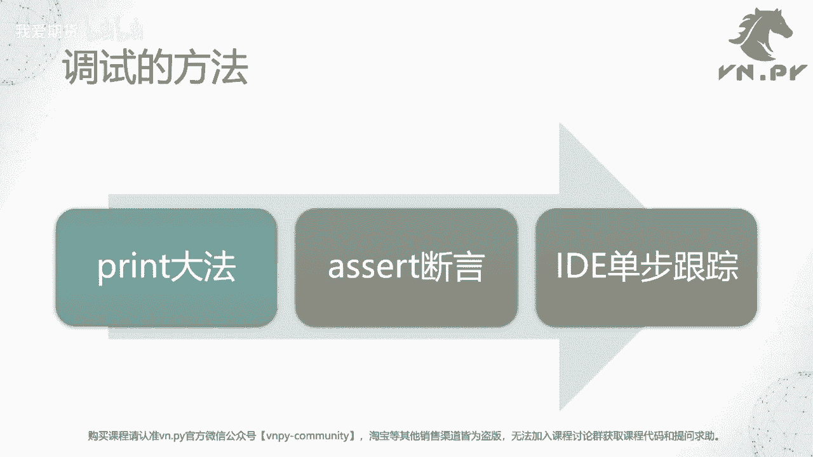
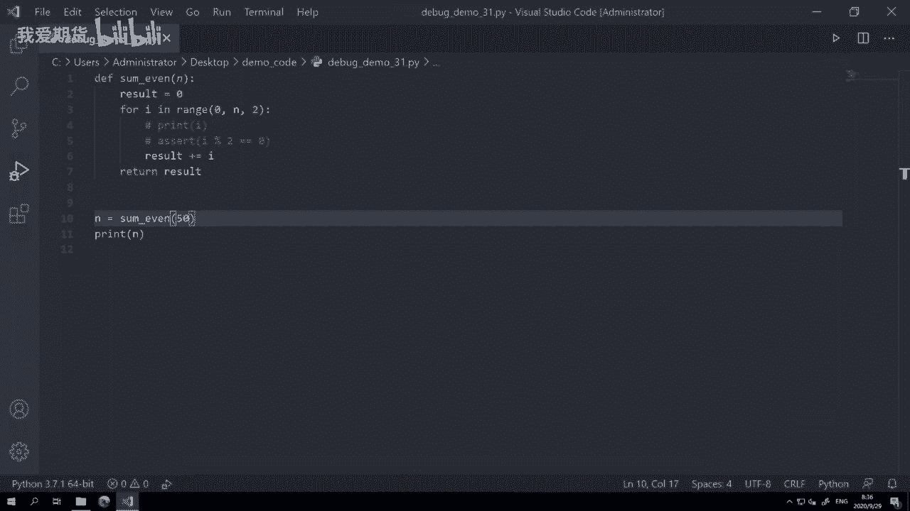
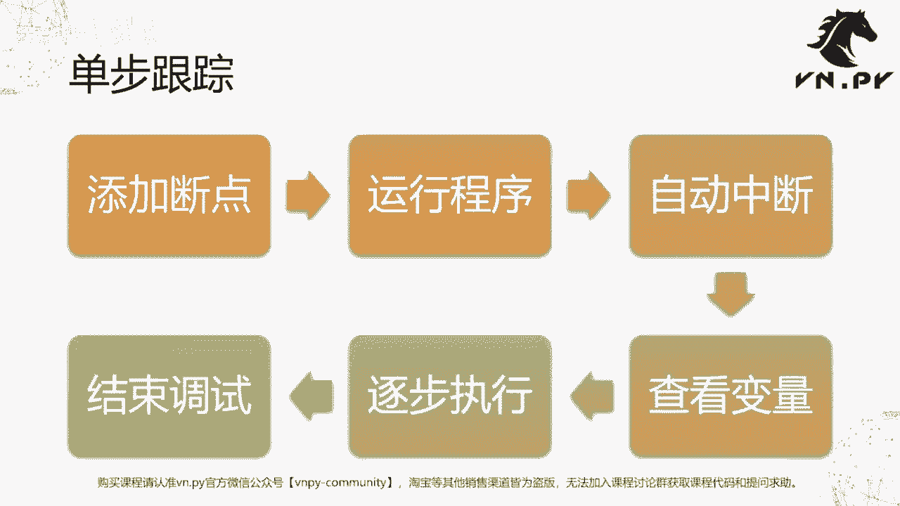

# 31.调试代码 - P1 - 我爱期货 - BV1u72gYNECz

欢迎来到量化交易零基础入门系列，30天解锁Python量化开发课程，那么今天呢是我们的第31节课了，在上一节课里面，我们学习了如何通过try except来捕捉，我们预期之中会出现的这些运行时异常。

那么对于我们预期之外出现的这些部分呢，就要用到这节课的内容来处理啊，也就是我们的代码调试，首先第一个问题，什么是调试啊，它的英文是debug，那bug我们知道就是这个写程序的时候。

出的各种错误就叫bug，所以debug的意思呢就是怎么样把它给找出来，把他们给处理掉，那整体上啊，到现在为止我们已经30多节课了啊，大家也写了30节课的代码了，那我们大体上写代码去运行程序。

都是这么一个四步的流程，第一步叫做编写代码，在编的时候呢，我们尽可能的去遵循规范啊，对于我们这个Python来说，对于我们这个课程来说，我们遵循循的就是官方的P1P8的规则啊，该空格的地方空格。

该换行的地方换行，该写注释的地方写注释啊，最后呢还可以用flak8进行对应的检查，这个是在编写的阶段，尽自己最大的可能来啊，把东西写对，但是呢这是无法保证100%是对的，因为你写代码的时候。

总有可能不小心打错一个字啊，不小心某个地方的函数用错了，所以接下来就要到第二步上，就叫做尝试运行啊，直接把你写出来这个代码试着去跑它一下，那这个时候能不能跑起来，真的很多时候是纯粹看运气的啊。

因为我们刚刚讲了，有各种各样的可能性，你不小心会写错代码，所以在这一步上真正能跑起来的概率并不高，但没关系，跑不起来，那Python会很友好的抛出异常信息，告诉我们你哪一行写错了对吧。

所以此时我们就可以来排查错误了，我们可以去判断具体的问题所在啊，然后把这一行的问题给修复掉，那么这个过程可能会重复多次啊，尝试运行排查错误，尝试运行排查错误，直到最后错误都排查完了。

我们最后一次成功运行，达成我们的目标，所有写代码的过程就是这么一个四步，过程的不断重复，那么今天我们讲要讲的内容呢，就是所谓的调试的方法了啊，接下来呢我们会讲这么三个方法。

第一种方法呢叫做print大法啊，这个方法可能在很多地方会说诶，他是简单粗暴的，但确实他就是效率最高最好用的，所以对于绝大部分常规我们要查错的情景，用print大法是最快的啊。

第二种方法叫做assert断言啊，这种方法呢相对在实践里面用的不是特别多，在一些大型的集成化团队开发的项目里面，用的会比较多一点，但如果是哎，你可能更多时候是一个比较个人的团队。

或者甚至于啊就这种很小的团队啊，就是两三个人的，这个时候呢可能对于assert断言这种啊，这个用法用的不会很多，但我们今天也会讲一下，最后一个方法呢叫做IDE单步跟踪啊，这个可能是啊在很多其他的地方。

大家看到怎么样对Python代码进行debug的时候，主要讲的一种方法，那这种方法呢确实也很方便啊，这个我们整体上这三个方法都来看一看。

所以这边呢我们就打开啊，还是我们的这个啊，今天的代码我们今天在vs code里面来运行，那在这呢我们创建了一个新的函数啊，它的名字叫做some even some，我们知道就求和的意思对吧。

那么even在英文里面是偶数的意思啊，所以这个函数的核心目标呢，是把从零到N中间的所有偶数给加起来求和啊，所以这个逻辑啊说起来并不是很复杂，result啊等于一上来等于零对吧。

这是一个我们用来缓存求和数值的变量，然后for i in range，这个range函数应该很熟了，我们也用过多次从零到N啊，这么一个范围的这个不断生成的，这么一个迭代器或者一个列表。

反正就是一个循环用的东西，那么我们这里有一个区别，是传了第三个参数二啊，二在这里是我们range的第三个可选参数，如果不传的情况下，或者你传一的情况下，那它起到的作用呢就是从零开始，一步一步的循环。

0123456，直到N结束啊，如果你传了一个整数之后，那它的作用呢就是从0~2到4~6啊，就是一步一步的这个加的值，就是你最后传的这个值，所以这个值的中文一般叫步进啊。

或者你也可以管它叫英文叫step啊，然后那整体上这样就实现了一个，单纯在偶数里面的循环啊，所以然后在下面我们把这个偶数的结果相加，可以加起来，result加等于I自增操作嘛。

然后最后返回result就可以了，那么在这呢我们可以来啊，这个很快的把它跑一下，N等于sum1even，那我们就把0~50的求个和，然后把结果给打印出来，好结果我们可以看到就是这个600的数值。

那但是这个时候会有一个问题啊，呃对于1~100的求和，因为这是一个非常有名的等差数列求和，我都不要算，因为我上小学上初中的时候就学过，我知道结果是5050对吧，5050啊，所以这个这个我不用去验算。

我就知道是对的，但是对于这么一个偶数的任意范围的啊，序列求和，那额我可能现在已经忘了，等差数序列求和的公式了，我确实也已经不记得了，那我怎么知道600这个结果是对的呢。

啊我现我现在其实说白了就没有正确答案，我不能直接判断600这个结果是对的啊，然后那一个简单的排查方法，就是，我们把它循环过程中的，所有的I都给打印出来啊，也就我们这边第一个注释啊，我之前把它注释掉。

我把它给取消注释，然后呢，我们把这个循环过程中所有的I给打印出来，那我看一看这些数值是多少，我知道这个循环我不太可能写错，写错吗，我也知道这个自增操作不太可能写错啊，唯一我比较有可能写错的地方。

就是我对于range啊，这个传三个参数的情形的用法，我是第一次用，那我有可能在这个地方会犯错，所以我看到I的数值之后，我就能判断哎我这个函数写的是不是对对对的，所以呢此时我取消注释之后，再来运行一次。

好大家可以看到一旦运行的话，他会把中间的所有的I的结果打印出来，02468十啊，哒哒哒，一直到这个48，那含头不含尾，所以50是不包含在里面的，因为我们是啊循环到50嘛。

所以一直是0~48的这个数字求和，那么这么看呢，它是符合我们预期的结果的，所以我认为600是一个正确的结果，这是第一种debug的方法啊，就是你直接把你要看的那个值，在对应的位置把它给打印出来。

然后呢再去啊，就是加一个print，然后再去运行程序啊，这个是最简单的方法，第二种方法叫做assert断言，什么叫断言呢，就是判断后面这个语句是否为true，如果为true，OK那就正常运行。

如果为false的话，它会抛出异常信息啊，就会告诉我们这个地方你运行出错了，那呃我们要assert的话，我们要去判断什么呢，其实最简单的就是判断诶，每一个循环的数字I啊，我们这里用了百分号。

这是什么操作，求余I对这个除二求余之后，如果这个除价值有这个余数啊，有一的话，那说明他是奇数对吧，如果是零的话，那说明它是偶数，所以如果是偶数的话，它会跑异常啊，就现在来说啊，如果是奇数的话呢。

他不会抛啊，我们先来运行一下，看看它的结果是怎么样的，那当然第一步你先把上面的这个print给啊，注释给取消掉，不然会比较麻烦，好运行的过程中，你看到他就抛异常了。

assert i2%等于等于这assertion error，为什么啊，就是因为I是一个偶数，所以偶数去除二，它的余数必然不为一，所以他这抛异常了，那我怎么判断就所有的值都是对的呢，我把它改成啊这个零。

那这样的话如果偶数除下来，那所有的都应该是零，所以这个地方不应该跑assert异常，我再运行一次，它可以正常出结果，就说明这个结果，中间循环的所有的I都是一个偶数啊，这也符合我的预期。

最后一种方法就单步调试了，怎么做呢，我们在这个地方先找到你要去调试的内行哎，我可能现在主要要看的就是每一轮I的数值，以及它相加之后result的数值就在这一行，所以我在这一行代码在这啊，我把鼠标移过来。

大家看到有个小红点起来了，手也变成了鼠标，也变成了手的标志，点一下会亮起来啊，这个地方就是叫做在我们IDEE里面，打了一个代码运行过程中的断点，然后呢这个时候我们按键盘上的F键。

来通过vs code的debug模式来运行我们的程序，注意这个和刚刚我们直接在这个terminal里面，运行不是一回事了，直接在terminal里面运行，跟你直接开个CMD运行，本质上是一样的。

所以呢并不会进入调用IDE本身提供的，任何debug的功能，所以你如果在这打个断点，在这运行，我们可以运行看一下是没有任何效果的啊，一定要通过IDE来运行，我们打了断点的这个程序，它才能被断下来。

这个也是很多初学者容易犯的错误，说我怎么打了断点了，我在外面运行还是没用，本质上你都没有启动调试模式肯定没用嘛，按到F5之后啊，这个时候vs code会问我们说诶我知道你要调试。

但是你要选什么模式调试呢，你是要调试一个Python文件呢，还是一个Python模块呢，还是什么远程把它连到某个服务器上去等等啊，我们绝大部分情况下都是用第一个Python file就行了。

剩下还有什么jango flask pyramid，这个是Python的，我这个web应用啊，这个专门的比较复杂的调试模式，我们用不着他们啊，我们就用第一个就好了，选一下，这时候你会发现啊。

这上面出现一个这样的东西啊，这是调制调试步进器，然后底下呢他刚刚其实开了一个新的console，大家可以看到我之前那个还在，然后这又有一个新的，它叫Python debug console啊。

就专门用来做Python调试的这么一个啊命令行环境，然后你看可以看到它运行了很长的一段代码啊，很长的一段，这个就是启动Python调试器的命令啊，这个我们不管它，我们可以看到第一个这个代码。

这一行现在亮起来了，然后左侧显示出了一些信息，什么意思呢，首先代码现在运行到这行之后停在这了，然后现在这一行的就当前在这一行里面，我们some even，函数内部的三个主要变量的值也都显示出来。

分别是I现在因为运行的第一个值是零，N是你传进来那个要循环的参数，它是是50，result是求和的，结果，当前也是零啊，我们可以看到第一轮它是符合我们预期的，然后按一下这个按钮叫continue。

好continue就继续啊，继续运行的那个意思，我们先来看单步的模式啊，叫step over或这个还有step into，还有什么step out，好，我们先来点这个step over，什么意思。

跳过它进入下一行，你要运行的命令，那就到了这个地方，到了for循环，因为这是一个for循环吗，循环这个result加等于I1次之后，再回来再继续循环，直到循环50次才会结束嘛。

所以这个啊每次step over就是一步一步的在运行，一行一行代码在运行，所以它叫单步调试，在这我们可以看到，首先到这I变了，I变成二了好，然后我再来step一次，result变成二了啊。

因为这一行已经运行完了，到这了，result已经二了，再点一下I变成四了，那下下一个我预期是造2+4嘛，应该等于六了，点一下哎，果然变成六了，所以他就这个这叫一行一行的运行单步模式。

还有这个continue是什么意思，运行到下一个你在打了断点的这个点啊，因为我们这一个是一个运行，而不是是一个循环，然后打断点的这一行呢，又是循环里面唯一的一行代码，所以你可以预期。

它其实就是直接就循环到下一次，再再循环到这个地方好，所以你看点一下它同时会变啊，它就没有，就这他不会走到这一行再让你摁一下的，而是直接循环就进到下一轮，这样啊，所以按一下变一下，摁一下变一下。

直到当然你摁狗了之后按到啊，这个50的话，最终求和就完毕啊，然后啊结果就会啊显示出来，当然我们在这并不想继续调试下去了，因为50有点多，所以我可能就直接按这个stop按钮，把它给停下来啊。

我可以直接按这个stop按钮停下来，或者你如果确实发现了有什么bug的话，因为整个运行过程中嘛，每一行代码运行后，当前整个程序内部的变量你都可以看到，所以此时你就很容易去找到具体的问题所在啊。

我们刚刚看的是locals，这个是当前函数内的本地的这些变量，还有global，这个是当前在整个啊Python完整的环境里面，所有的全局变量你可以点开啊，special有这么多。

这个是Python虚拟机本身运行时的状态变量，然后呢有你的这些函数啊，变量等等，一个个都可以打开来看啊，可以看到所有的细节，所以非常非常方便啊，当然了，如果你确实发现有什么问题，你可以随时在这。

比如说AI加额，举个例子吧，那我这边呢可能啊不希望单纯是对这个啊，奇数求和啊，我想对哦，不好意思，不想不想对偶数求和了，我想对奇数求和啊，怎么改呢，把这个改成I加等于一啊，I加一，因为I本身是偶数。

加一肯定就是对应的下一个奇数嘛，这样弄完之后出来的结果，是不是就应该是50以内的，所以奇数求和结果啊，所以这个时候我因为改完了，我可以很方便，直接点这个绿色按钮。

它会帮我直接立即重启这个debug就重新运行，我不用先停下来再去启动了啊，直接按它，它会立即帮我重新运行，所以此时诶这个你可以看啊，我们再再来一行，行调的话就是一啊。

四九你可以看到这个就变成奇数在求和了啊，所以这个是在这个debug里面很方便对吧，改完了点一下这个重启，立即就重新运行啊，最后呢就停下来啊，你想退出的时候，正常应该按这个stop按钮把它给停下来。

停下来之后，那这里我们vs code就会终止调试模式，它就正常退出了啊，然后要注意啊，呃在运行的时候，vs code正常是每运行你NF5运行一次，他会给你开一个debug console。

如果你按的F次数特别多了之后，这边会有很多的debug console在这，但每一个里面内容其实都已经运行完了，特别多了之后呢，它会占用比较多的内存资源，所以有可能会卡。

所以这个时候呢你最好按这个按钮kill terminal，把你不用的这些给关掉啊，每按一下就关一个，或者你想要手动开个新的时候，按加号就可以，new terminal直接开个新的啊，这个也很方便啊。

所以嗯那整体上啊，我们的这个单步调试的方法就讲完了啊，你可以看到这这个这个位置叫BREAKPOINT，意思就是断点啊，英文的断点的意思，那么啊当然了，我们能演示的代码还是比较简单的。

所以嗯可能更多大家回头在自己实践里面嘛，多多去用一用啊，打个断点看看状态是怎么样的啊，这边我们最后也要再进一步提一个内容啊。

好我们尽管今天讲了三种调试方法，print大码大法，Assert，断语言和IDE单步跟踪，需要注意的一点是，IDE单步跟踪他的可以应用的情景，相对来说是比较有限的，在Python层面一定要注意。

它只能对于我们Python中的啊，这个发起主要的这些运行环境去打断点，什么意思呢，比如VN点派内部有许多封装了这个C加加的，这些啊，底层交易API的接口，在这些接口的回调函数里面打断点啊。

你在vs code里面即使用调试模式运行，也是无法断下来的，主要原因是因为这些回调函数，它们是由C加加里面发起的啊，C加加回调，然后来调用Python里面的函数，那么这么一个情况。

对于我们vs code这样的编辑器来说，它是抓不住这些断点的，他根本就不知道这地方发生这个事情，因为这个调用的发起方在C加加那边啊，所以此时你debug可能会遇到一些问题，那对应的也还有一个情景。

就是我们用PYQT开发的图形界面，因为它底层呢是一个叫qt的，也是C加加的这个图形库，所以你在那些PYQT的一些啊，内部去打断点的话，也有可能会出现断不下来的情况，这个不一定啊。

因为他的线程模型更复杂一些，有的时候断的下来，有的时候断不下来啊，所以IDE的demo跟踪它在Python里面应用的时候，会存在这么一个问题，但如果你是自己写的策略，比如说你跑一个回测。

你比如说跑一个像我们的嗯，在课程最后我们会看到什么导入数据的脚本啊，或者说呃这个其他一些常规的一些，用Python做的这种脚本操作，那都可以放心的去打断点啊，全部都可以断下来的，但是对于像这个C加加琴。

如果你要调试的时候，最好的方法就是用print大法了，因为print大法是无论如何，都能把这个运行过程中的那些数据给打出来的，打出来之后我们人眼去看啊，这个是最简单通用度最高的这么一个调试方法。

当然有的时候他可能不是那么的方便，因为打出来的时候你还要人眼去看，但它是普适性最好的一个，OK额，那么最后总结一下，我们这边单步跟踪的六步流程啊，第一步添加断点啊，打上那个红点，第二步运行程序。

第三步程序会自动中断，然后你在左侧vs code窗口里面，查看当前的中断的变量，然后按那个上面按钮逐步执行也好，还是逐行执行也好，你可以选最后确定你解决问题了，那这个时候可以在代码里面直接修改好了。

重启再跑一遍，或者说直接按那个方框结束调试啊。

退出来啊都可以，OK那么这节课的内容呢就到这啊，然后更多精华内容，还是请扫码关注我们的社区公众号。