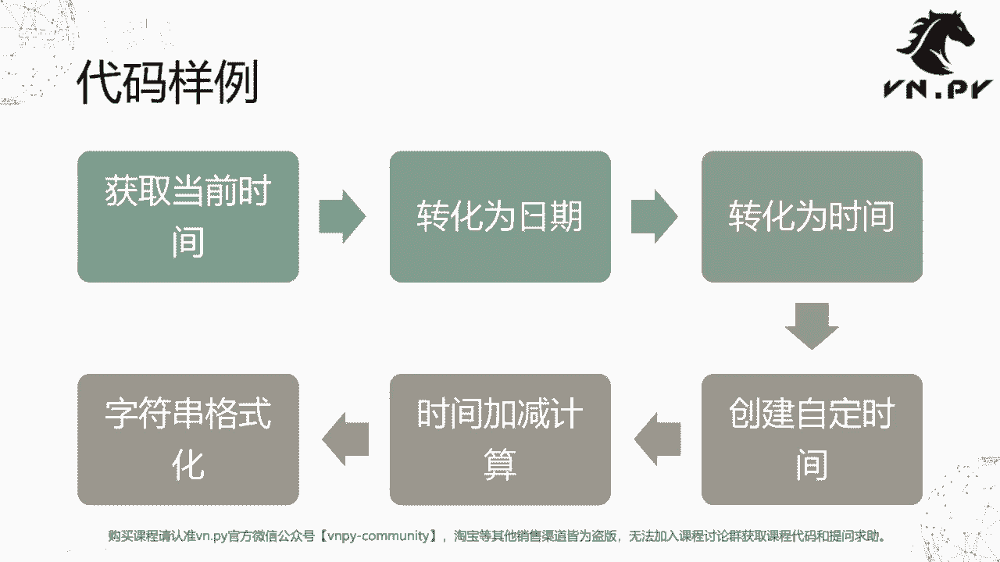
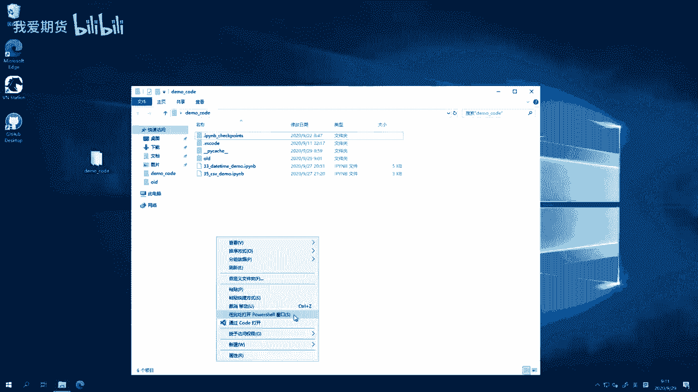
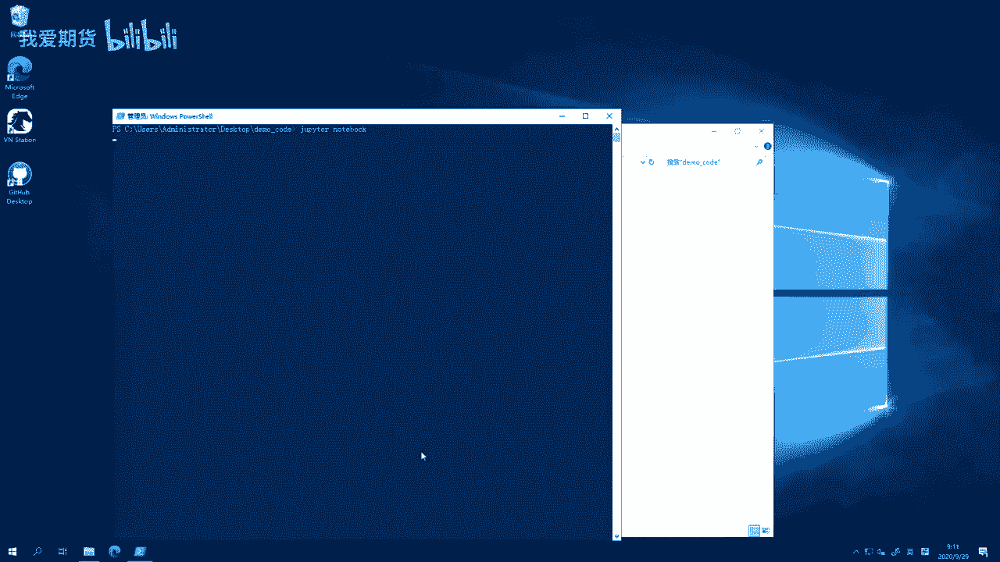
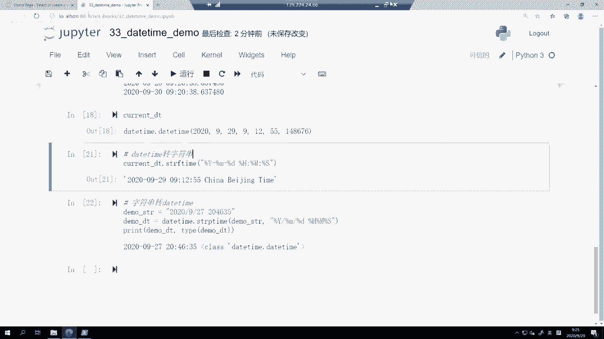

# 33.datetime模块 - P1 - 我爱期货 - BV1u72gYNEQ6

OK欢迎来到量化交易零基础入门系列，30天解锁Python量化开发课程，那么今天呢是我们的第33节课啊，从这节课开始，我们要来一个一个的看看Python，里面常用的这些模块以及它们的用法了。

那今天呢是我们的第一个模块，就是date time模块，那么对这个模块来说，其实它的功能和它的作用，首先我们上一节课也简单提了一下，这节课呢啊，甚至都不需要我去提，你看到这个名字，你很容易就能猜出来啊。

它就是用来提供各种围绕着日期，时间相关的计算功能的，那么在这个模块内部，最主要的是这么三个类啊，这个模块主要提供的是类级别的啊，这些功能，那么首先第一个类啊是这个date类，它就是日期。

time类就是时间啊，日期我们知道年月日嘛，时间就是时分秒啊，当然可能还能包含这个毫秒微秒的部分，然后是一个把它们整合起来用的叫date timely，这个类是最最常用的。

因为很多时候我们要去判断时间的时候，并不是说单纯的给个日期就行了，或者是单纯给个时间就行，而是要精确到啊某一年某月某日，某一时某一分某一秒啊，所以他们两个整合起来用的这么一个daytime类。

是最常用的啊，最后还有一个叫time delta类，这个类是干嘛的呢，叫做时间的变动，或者说你也可以认为它是啊，这个时间加减出来的这么一个差值的结果，那简单举例来说吧，就是今天是当前时间点啊。

下个月这个50TF期权到期日可能是10月，我随便说啊，10月25号，那从10月25号呃，从今天到10月25号，中间还有多少个这个自然日，那如果你把两个daytime对象都相这个生成出来。

然后直接一个相减，就可以得到中间这个time delta的结果，就他是一个啊围绕着时间的，专门用来做计算的这么一个特殊的额数据结构，那么接下来我们就来看我们代码样例哈，这就后面我们的讲模块的课程里面。

大部分都会围绕这个模式，先讲这个模块的构成组件，然后我们就直接看代码，看它怎么用的哈，不需要去掌握啊，特别多的什么概念啊，讲太多的理论了，就是因为纯粹就是代码哈，学会怎么用就行了，代码样例。

我们接下来就是六步，获取当前时间，然后把它转化成日期，再转化成时间，然后创建一个我们自定义的时间，然后对它进行一些加减计算，最后呢，我们把这个结果进行一个字符串格式化啊。

就这么六步，那么这边呢我我先来启动我们的jupitter notebook。

然后点开这个daytime de，点一下restart and clear output啊，因为之前你可能运行过，所以我这边先把清空一下，那第一个单元格，我们做的事情就是import。

我们从daytime模块里面加载的date time，daytime和time delta这么一共四个类，然后当然date和time这两类，我们没有直接用到它们啊，然后呢我们来先来获取一下当前时间。

就是current d t啊，这个就是当前这个时间点，然后呢我们就调用date time，点now，注意这里date time本身是一个类类，下面也有一些方法啊，有的时候会有一些方法是可以直接调用。

而不用先去创建一个对象出来再来调用的啊，这是一个区别，那么这个now在这里就是一个所谓的静态方法啊，这个所以所谓静态方法，就是你不用去创建对象出来，你直接对类调用就行，就可以返回结果的方法啊。

就叫静态方法，那么在这呢我们就调用DTIME点now，获取下当前的这个时间，那current dt我们看一下它的类型是什么啊，它是一个date time，点，date time类型。

前面的date time是模块的名字，后面的daytime是这个类啊，他是名字什么，我们可以看到这重名的嘛，然后打印出来结果诶这个很清楚，2020年9月29号9：12：55，后面跟的这个是微秒数。

大家可以数一下，一共六位啊，这个一秒等于1000ms，所以小数点后的三位就八，这位是毫秒，然后一毫秒又等于1000微秒，所以小数点后的这个第六位啊，就知道的这个六是微秒啊。

所以他是这个合起来就是一个微秒数啊，然后第二步我们可能有的时候哎，我不需要时间部分，我只要日期的部分，那怎么做就把它转化成日期啊，current date等于current dt点date。

注意这里current dt当前不是类了啊，他是我们用daytime点now生成出来的一个啊对象了，或者说一个实例了，这时候呢我们对实例调用date，我们可以把它转化成一个啊。

另外一个数据类型就是它变成daytime模块下的date，这么一个类，这个呃就这么一个类的对象啊，这么一个对象，那么这个对象我们可以看到，就不包含后面时间部分，只剩下前面日期的部分了啊。

所以这个也容易理解嘛，他就相当于呃date这个date time类或者daytime对象，是既有时间，而既有日期又有时间，那把拆分开一部分，那自然就是date就只有日期，所以剩下一部分。

这自然就只有时间对吧，我们对current dt取个time，然后得到current time打印出来，哎我们可以看到他的daytime下的timely，然后呢他就只包含这个上面的时间部分。

不包含日期的部分，那么这两个啊有什么应用的情景，举个例子，我在这个我的策略代码里面可能会写说，如果我是一个日内交易策略，每天下午到了02：55分，我就把我的仓位平掉啊，不管多头仓位还是空头仓位。

我都要把我的仓位给平掉，因为我不想留隔夜仓，那么这个时候一个非常常用的判断，就是诶我在下面创建一个这个and time，等于这个啊time145，然后我去通过啊，因为推过来每个tick。

每个行情或者每根K线都会带有时间戳的，那看我这边就用current这个time来代替啊，这个if current time啊，这个大于等于end time，就是当前的这个时间。

已经超过我的收盘平仓时间了，然后呢我就去做一些平仓操作，我这边就打印一个字符串啊，反过来如果还没到这个时间的话，那这个时候就是正常交易时段啊，我就你就该开仓开仓啊，该该怎么移动止损。

就移动止损执行正常交易操作啊，那么我这里我们可以比一下，因为现在才09：12分啊，所以这个对应的时间还远远没到嘛，所以他是在正正常交易的，这么一个时间段里面啊，就打印这么一个结果就好了。

嗯这个是一个很常用的操作啊，因为呃你不能拿直接拿date time去比，为什么不能拿date time去比呢，因为它是带日期的，我要平仓的话，这个每天收盘名单我只看时间嘛，我我又不管你日期的。

只要每天到下午02：55都要评，所以你这个时候就应该用到time类，而不是daytime类啊，你要把那个转化成time对象来进行对应的操作，下面呢一个操作就是创建一个自定义时间了，我这边随便写了一个啊。

这个option expire啊，期权到期日就是2020年10月28号啊，这个随便写的，我也不知道这天是不是到期日啊，就把它打印出来，你可以看到诶，他是这么一个数据结构，我创建这个daytime的时候。

我只传了前面三个参数，年月日啊，同样你也可以把其他参数传进来后，就后面啊十分秒15啊，这个呃零分零秒啊，这样也行，你看就变成这种十五零分零秒，当然你可以选择传你想传的啊，但是呢年月日是一定要传的。

时分秒可以不传，不传，就认为都是零，那都帮你填零，但传了就是对应的数字啊，所以年月日还是要传的，否则这个呃呃我们我们可以试一下，看看不传他会怎么样啊，这个如果我就直接一个DTIME，他会报错的。

你起码要有个年啊，我年如果输个零也会报错，还少月，啊这样还还会报错，还要还是要日，就年月日这三个数字是一定要给的啊，然后因为我乱填的填的零，所以他会再告诉我啊，夜0is out of range。

就是没没这个没有0年啊，这个额计算机里面数值应该是最早，从1970年1月1号开始的啊，这个是第一天嗯，对但正常的话你就还是传你该传的数字就行了，不用不用去纠结这些啊，这个这个细节吧，就是正常你传嗯。

这些就正常日期的数字肯定都是可以运行的啊，年月日都传进去就好，下一个操作呢叫求时间差了，这个时候呢我们就用我自己创建的期权，到期日10月28号减掉当前的日期，Currendt，我看一下它们之间差多少啊。

就是所谓的time left剩余时间把它打印出来，然后看看它的类型，在这儿我们可以看到啊，time left首先打印出来是28days，28天，然后14个小时，47分04秒，还有851324ms啊。

呃微秒你看可以看到就time delta这个剩余的时间，它可以精确到微秒的啊，然后这个数据的类型是一个daytime下的time delta，这么一个啊这个这个呃对象啊，然后呢我们这个时候啊。

对于time delta这个对象，我们还可以检查它的一些啊偏移量，以及一些对应的字段，比如说我我现在对剩多少个小时不感兴趣，我就想知道凑到整数的天还剩多少天。

我就直接打印time left the days哈，检查这个就多少天的这么一个偏移量，然后当然了，我有的时候可能我也也不想知道多少天，你都给我转换成秒，还剩多少秒啊，一天等于24×60乘以60秒嘛。

就是就挺大的一个数字，但我不管怎么样，对计算机来说这个很方便啊，所以你给我转化成秒，对应的这么一个操作之后啊，剩余天数整数的部分还有28天，剩余的秒数，那就是把整数部分28乘以。

刚刚说的乘以24×3600，再加上后面小数的部分啊，结果就这么长的这么一个时间啊，就剩余这么多秒，最后呢这个是围绕减法相关的操作啊，然后我们再来看一个加法的操作，我们取个当前的时间。

就today today等于day time点now，然后呢我们用today减掉time delta括号days等于一，什么意思，用当前的时间减掉一天，看是什么时候。

tomorrow就等于today加上time delta，this等于加上一天是什么时间，然后把它对应打出来，可以看到结果就是这样啊，这个today是9月29号啊，09：20：38。

然后昨天的这个时间就是9月28号，这个时间最后还有个明天，这个时间就是9月30号的这个时间啊，所以我们可以看到delta，他们delta既可以作为两个时间点相减出来的，那个差的结果，就中间差多少时间。

然后你也可以用这个一个呃，就是daytime对象加上time delta之后，得到对应的，和他相差这么长时间的一个新的daytime的对象啊，所以这个时候围绕着日期的计算，就变得非常容易啊。

你可以很容易的去做一些加减操作啊，最后呢要讲的一个内容就是，把date time对象转成字符串啊，因为我们尽管之前我们可以先在下面看一下啊，current d t好，如果我打印直接访问它的话。

你可以看到它是一个daytime对象啊，所以呢呃有些时候我们可能，尤其是在Python内部直接用的时候呢，我们用这个对象直接对它进行操作很方便，但有的时候，比如说我要把这个数据写到一个TXT文件里面。

写到一个CSV文件里面去的时候，因为我只能写字符串，我不能写Python里面的对象，所以这个时候我需要把把数据转换成字符串，那么最简单的操作就是调用kn d t这个daytime，对象的string啊。

S t r f time format time，转化，就是嗯这个把当前的DETIME对象，转化成一个字符串啊，转换成字符串的格式是什么，就你后面这边定义的百分号，加上后面一个英文字母标识的。

是就你这个字段定义的部分，其他的这些比如这里用的减号，或者说横线这里的空格，这里的冒号都是字符串里面，我们希望他写的部分啊，这样回车完了之后，它会变成这个格式啊，就是反正按照我的格式啊给显示出来。

我还可以加上后面的百分号F，这个就标包含毫秒的部分哦，不好意思，微秒的部分是，然后或者说呢我想要啊加一些其他字段，这个china beijing time都可以，你就直接加在后面好了，反正不带百分号的。

他这个就会当做常规的字符去处理，带百分号的，那么这个daytime模块会自动帮你解析啊，把他们转成对应的日期啊，时间里面的这些数据啊，所以这个呢就很方便了啊，有从对象转字符串的操作。

必然也就有反过来的从字符串转对象的操作啊，所以下面这个呢我们就创建一个demo string啊，就2020年这次我们不用减号分隔了，我们用这个斜杠分隔，然后空格204635。

最后这三个十分秒数字里面甚至连冒号都没有，我就创建这么一个字符串啊，那么然后呢我们就要daytime点STRPTIM，这个一个是FTM，一个是PTIME啊，反正就是相反操作，这个操作作用呢。

就是把一个第一个参数，是你要转化的那个字符串本身，第二个参数实际这个字符串对应的数据格式，我们在这里呢是啊，哪年哪月哪一天啊，然后十分秒都有了，然后把它转化出来，我们看结果怎么样。

可以看到成功可以生成出一个daytime来，然后呢他是这么一个daytime的数据结构，2020年9月27号啊，08：46：35，那么这样就完成了一个啊成功的转化，那很多时候啊。

如果你要把Python里面数据写到文件里去的时候，你可能需要做这么一个转化，把对象转字符串，然后呢你要把一些文件里面，或者啊，比如说可能你去啊做这种数字货币交易的时候，那底层交易接口传过来的啊。

这些时间的数据，它其实大部分时候都是字符串啊，当然也有一些会用整数来表示那个啊，各种模式都有吧，但不管怎么样，你都可以把他们通过这个d time函数啊，or daytime这个模块。

转化成我们Python里面可以直接操作的数据结构啊，然后围绕它去提供各种功能，那么嗯下节课里面呢我们也会来看啊，在van der pan内部，daytime这个模块有具体啊。

有怎么样在一些在接口层用一些呢，在上面模块层去使用啊，这个是个非常非常常用的模块。

OK额那么这节课的内容呢就先到这啊，我们更多精华内容，还是请扫码关注我们的社区公众号。