# 34.底层接口的时间处理 - P1 - 我爱期货 - BV1u72gYNEme

OK欢迎来到量化交易零基础入门系列，30天解锁Python量化开发课程，那么今天呢是我们的第34节课了，在上一节课里面啊，我们学习了DTIME这个模块，具体怎么去用啊，那这节课里面呢。

我们来看一看他的这么一个啊，真实的应用场景了，就是在V点派，我们底层交易接口里面的时间处理，那么首先啊我们先来看一下CCTP，他这个传过来的行情，就所谓的TIK行情里面的数据结构，长什么样子的。

这个时间信息里面呢会包含三部分，第一部分是日期啊，就所谓的交易日啊，它的名字呢叫做action day，然后第二部分呢就叫做时间啊，这个传过来的部分它叫update time，最后还有个微秒啊。

就当前传过来这个时间是多少微秒，就是update millisecond，我们先来进到我们的VN点派的源代码里面啊，然后呢我们登录一个模拟账户。

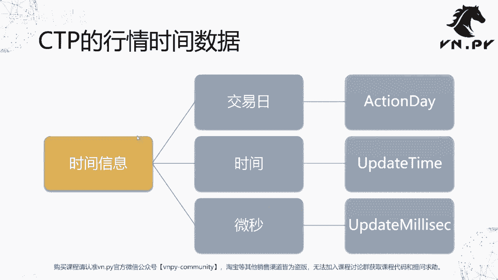

来把这个几个字段都给打出来，我们看看他长什么样子。

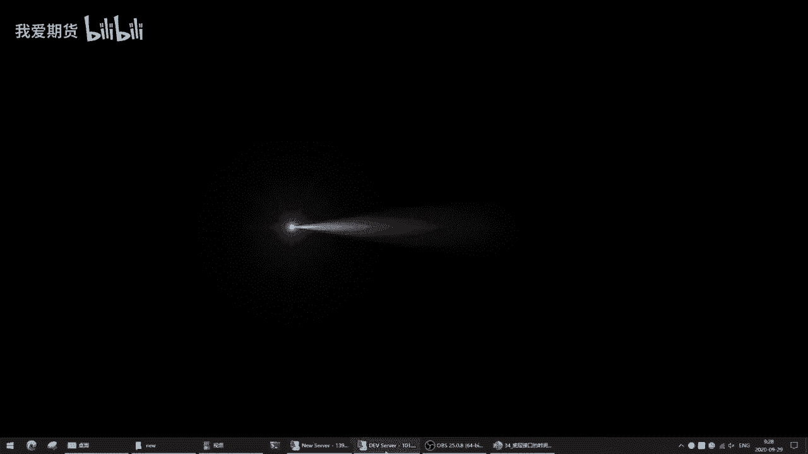

在这啊我们这个首先呢先启动vs code，因为这次啊我们要在啊这个我们底层接口，或者说呢用C加加封装的啊，部分里面去做一些操作，那这里我们就要用到之前讲的，那个那个那个那个啊debug。

那节课的一个操作方法，因为要在C加加结构里面去做一些调试，所以没有办法去打断点，我们就只有用print大法了啊，在这我们就先来修改一下编点派的源代码，我们在那个啊源代码回调函数里面。

去加上这个print的内容啊，C盘语言studio，in py啊，这个我都是在键盘上打的，所以他可以很快的去跳转，然后找到gateway cctp啊，然后诶不好意思，不用进到那么里面啊。

在VNPM目录就好，好然后把这些折叠找到gateway，找到其中的CDP，找到cctp gateway，然后呢在这CTRLF搜索tick data啊，就是生成tick data的那个回调函数啊。

在这它的名字叫on return depth market data，好，我们就print一下print啊，具体有哪几个字段呢，刚刚我们讲了有action day。

Da up date time update，update mely啊，这么三个字段啊。

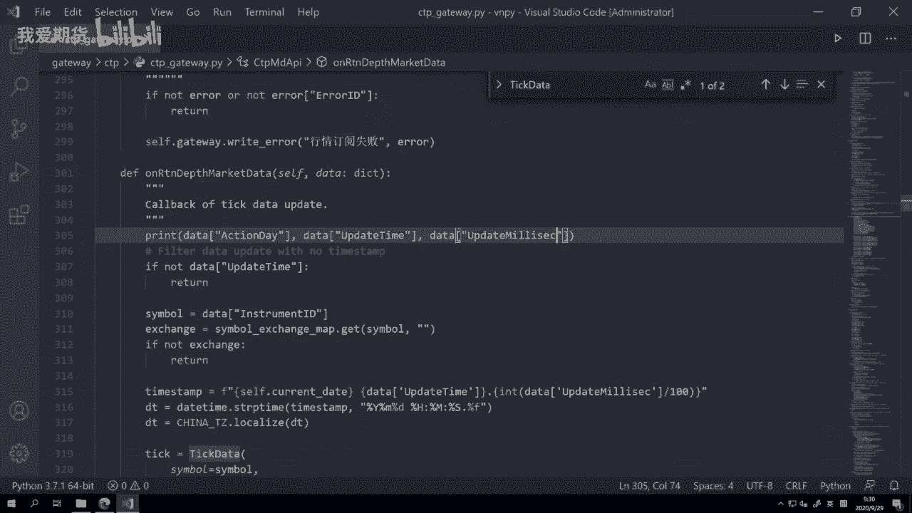

我应该没打错，那不管有没有打错，这个时候我们就来运行了，启动VN station，好在这呢我们需要先去登录一下，大家第一次用的时候呢，可以这个点微信登录，然后扫描二维码之后先来注册。

那我这边因为我自己已经注册过了，所以呢我就直接登录了，那么大家在注册的时候要记住啊，用户名是你自己的这个注册时候的微信昵称，注意是昵称，不是你的那个微信用户号，密码是你自己填的。

那么注意填的时候不要随手填一个，回头就给忘了啊，然后这样输好之后点保存按钮，这时候呢就可以直接登录，后面几个信息就保存在这，省得你每次都要呃呃如果你不想输的话，你也可以点我微信登录，每次都扫码登啊。

但那个就麻烦一点，这样保存一下才方便一些，点登录，然后点开VN trade pro啊，我们要加载两个东西，一个是CCTB接口，还有呢是一个我们的data manager这个模块啊。

等会儿我们用它来演示一下，就是啊在读取数据的时候的一个时间格式啊，点启动按钮，那这里弹出来就是V点派的主界面了，此时我们点系统连接CCTP，当然这里需要一些账户密码的信息，如果啊你是刚接触量化。

这里还不熟悉的话，我推荐可以去看一看VIENNA派的这个，大家可以看到微信公众号里面有个入门教程啊，那个大概八级的一个入门教程，其中有一集很详细的讲解了，怎么去注册一个中国啊。

这个期货CDP的仿真环境啊，就所谓的sem now环境怎么样去注册一个啊，那个里面有详细的讲，就这些啊，什么用户名密码，经济上的代码怎么样去获取啊，其实就注册一个访问的账号。

在那个网上网站上去找到这些信息对应的，填进来就行了啊，我这儿因为已经有了，我就直接点连接按钮，大家可以看到这有一堆信息啊，输出出来，然后这时候很快就登上去了，我账户上目前有些持仓，然后我订阅一个行情啊。

我因为现在9。32，我就订阅一个RB2101，选了个交易所SHFE啊，就这个商机所RB210。

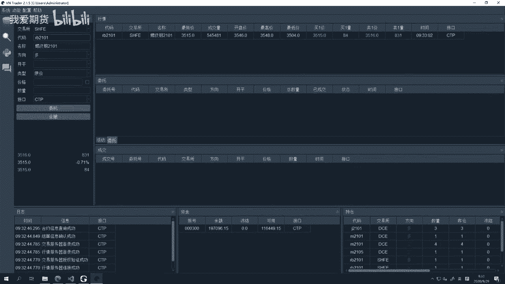

然后大家可以看到这行情已经有了在跳了，然后呢，呃，那因为我刚刚是在这个这个里面打的print对吧。

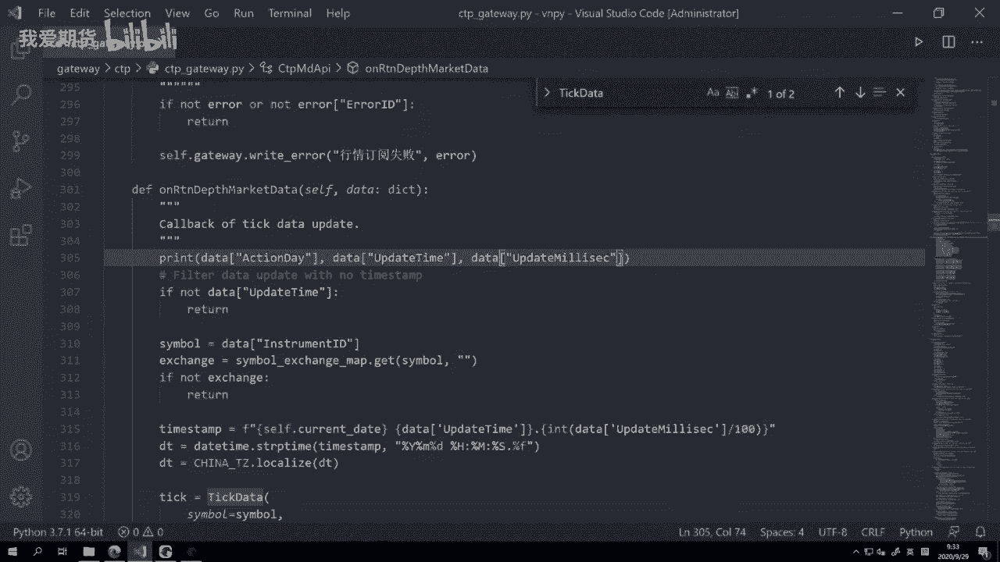

但是因为我是用啊，就是纯纯的这个这个窗口模式启动的。

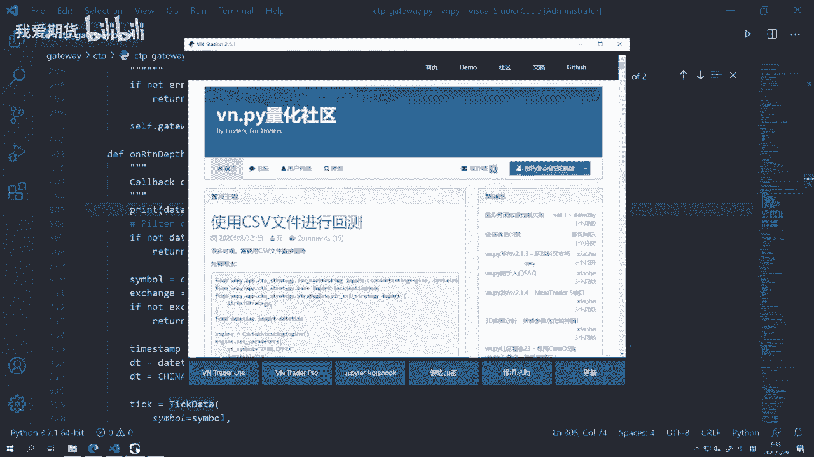

所以它打印出来的信息，现在虽然在后台打印，但是我看不到啊，那这个时候我要我我我要重新启动一下，我要用命令行来启动啊，在vs code里面随便开个terminal。

然后呢输入Python杠m VN station，这个是命令行启动，你也可以开个CMD或者开一个power shell，输入这个命令来启动，效果都一样的啊，那么这样启动了之后。

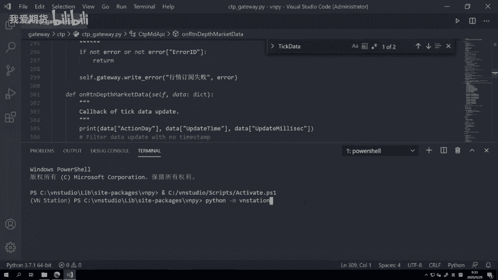

所有的这种后台打印的信息，你在terminal呃，或者这个命令行里面就都可以看到的。

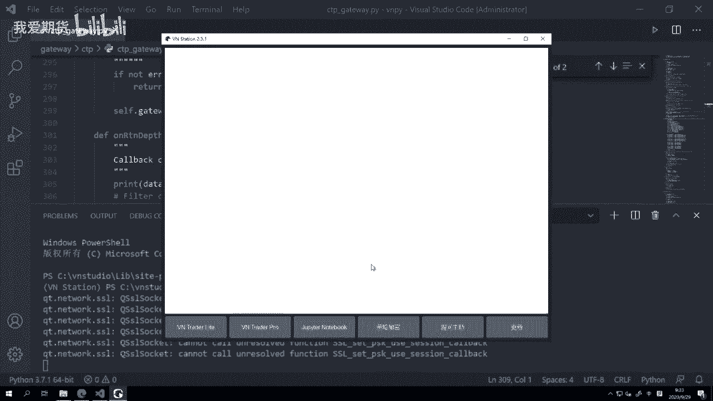

然后很容易你会看到有个信息啊，就是一进去会看到这么一个信息啊，什么SSL socket cannot hunresol，这个是一个就是提示他不是报错，它跟Python没关系啊。

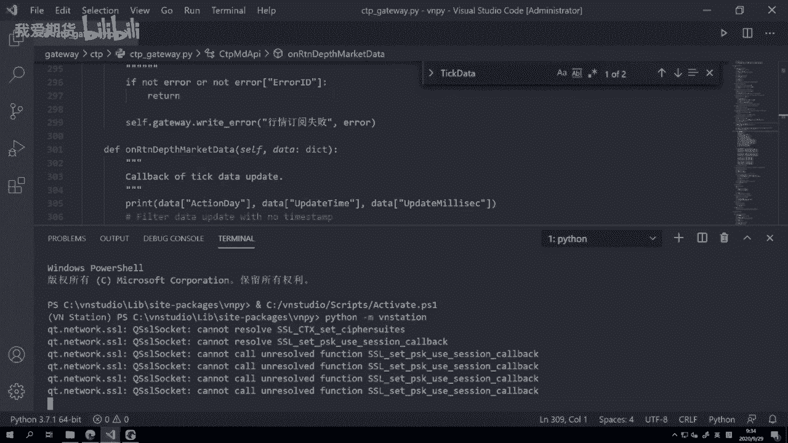

他是这个我们我们这个内嵌的浏览器啊，因为这个是内嵌的一个chrome呃，chrome的那个开源版chromium，然后它的开源版就会有这么一个提示啊，他这个这个跟我们任何错误没关系啊，不用去担心它啊。

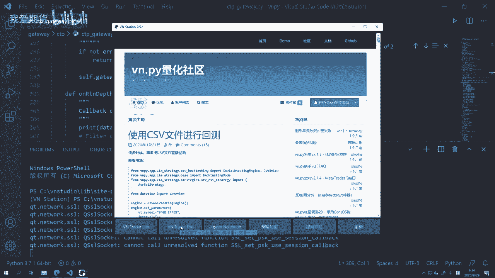

还跟刚刚一样的操作，就点启动就好，连接CCTP，然后订阅一个RB21101，然后呢我们回到这个里面，我们可以看到他已经在打这个啊，一条没有一条数据它就打一条，然后你看他是因为我们这是print嘛。

它分成三部分啊，每个部分中间有个空格分隔的，我们可以看到action day就是个日期年月日啊，四位的这个年啊，2020，然后呢0929中间没有任何分隔符，就年月日啊。

update time时分秒中间有冒号作为分隔符，然后还有这个update millisecond，这个是啊，它虽然叫啊millisecond，但实际上的话，额就是它就是一个这个所谓的毫秒数。

但是在这呢啊，我们可以看到它有的它只有两种情况，因为我们国内的tick1秒只会推两次啊，哪怕他有更多次的成交，但是我们国内期货tick1秒只会推两次，所以要么就是零，要么就是500啊。

当然取决于日日子不同啊，有的时候可能要么就是100，要么就是600，反正他就是两个数字，中间间隔是500ms啊，但额主要是这么一个区别吧，那接下来我们要把这个字符串去生成。

我们在Python里面的数据结构啊，生成我们daytime数据结构怎么操作的呢，在这首先我们把它给拼起来，拼成一个啊，我们要的这么一个完整的字符串，就time stem啊，我们下面就在这打。

把time stem再给打出来，然后最后我们在这把DT给打出来好，当然这个每个打的时候，因为回调函数里面要打这么多东西，可能容易混淆啊，我上面加一个这个东西啊，这么多个横杠，或者你打什么星号。

什么碎片啊，就是为了看的时候清楚一点，那我再把它推出来啊，再重启一下，这个时候啊你是没有必要重启VN station的，直接重启VN trader就行了，好连接CDP接口。

我们再到vs code里面来看啊，你可以看到他在打印出对应的信息了，首先第一个，我们这里time stem的主要作用，就是把它给拼起来了啊，大家可以看到我们这边做了一个拼接的操作。

在拼接的这个操作里面啊，前面的年月日和后面时分秒，这都容易理解，但是对于这个部分啊，millisecond这个部分的话，我们对它额外做了一个除100，然后呢取整拼接的这么一个处理。

那主要原因是在不同的一些，尽管都是CDP风格的柜台上，这个字段的数值是有可能有一些不常规呃，不常规的变化，所以除了100之后，他就我可以把它准确地转化成对应的这个好，就只保留啊，这个后面要么是零。

要么是500，就是小数点后唯一一位啊，因为我不要那么多位嘛，我只要小数点后一位啊，然后把它拼上去就得到这么一个字符串，然后呢我们就要调用date time的这个啊转化啊，把字符串转化成为对象，年月日啊。

时分秒，然后后面跟着点百分之FF，那就是我们的叫做这个嗯我们的微秒的部分啊，但尽管它是微秒部分，但实际上它只是小数点后的，它都能处理啊，因为毫秒就是小数点后的三位嘛，微秒就是小数点后的六位嘛。

所以对于小数点后的部分，它只要统一用这个格式都能处理，但注意date time最多处理到六位的微秒，它是处理不到后面九位的纳秒的，有一些啊，比如有些这个其他交易接口，它可能推时间说会有纳秒级别。

那这个纳秒级别后面的最后的那个三位，要你要把它给这个给给减掉才行，否则这边their time的生成会出错，那大家可能已经注意到一个点啊，就是我们这里日期没有用action date去生成。

而是用了一个本地我自己的current date啊，就当前我本地的这么一个日期。

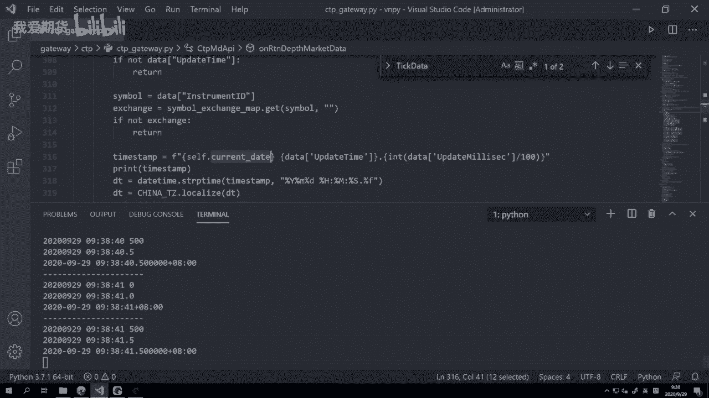

那之所以用它的原因呢，是因为在啊，这个我们CTP或者国内期货在交易的时候，因为我们知道现在分日盘和夜盘两个部分啊，然后这两个部分是分别归属到这个，一个交易日里面的啊，尽管它们在自然之上是一个概念。

但是他们另外还有一个叫做交易日的概念，就是我们刚刚看的action类啊，自然日是指我们实际发生行情的日期，那不管日夜盘日盘它是哪天的，就是哪天嘛，这个是我们现实世界里面的天数啊，这个容易理解。

另外一个是叫交易日，交易日归属是这个结算日期啊，日盘没什么好说的，今天的日盘就白天的这部分就是今天白天的，但是今天晚上的夜盘是归属到第二天的啊，就今天比如说今天是29号啊，29号晚上从九点到12点。

这个交易的这么一个夜盘的时间段，它不属于这个9月29号的时间段，而属于9月30号时间段，四家这个国内的期货交易所，每家的那个action day的定义规则是不一样的啊，有三家是正常的，有一家是不正常的。

所以这样一个情况就会使得你在CCTP接口里面，如果用一个规则去处理，它就会出错啊，所以我们采用了一个更简单的方案，反正我要的是我季度行情也好，我策略去判断也好，我只关心自然日。

我对你交易日这个没什么兴趣啊，你你在哪天结算啊，这是归你交易所的事情，跟我这个自己做交易的没关系啊，所以我就用本地的这个自然日的日期就好了啊，我我没有必要用那个交易日的日期。

所以下面呢我们就来看这个解决方案，等会我们在代码里面里面看，整体上这么三步，获取一个本地的时间戳，这个本地时间戳是我本地的自然日，然后呢拼接完这个完整字符串，最后呢生成对象后面两步。

其实我们都已经啊这个讲过了啊。

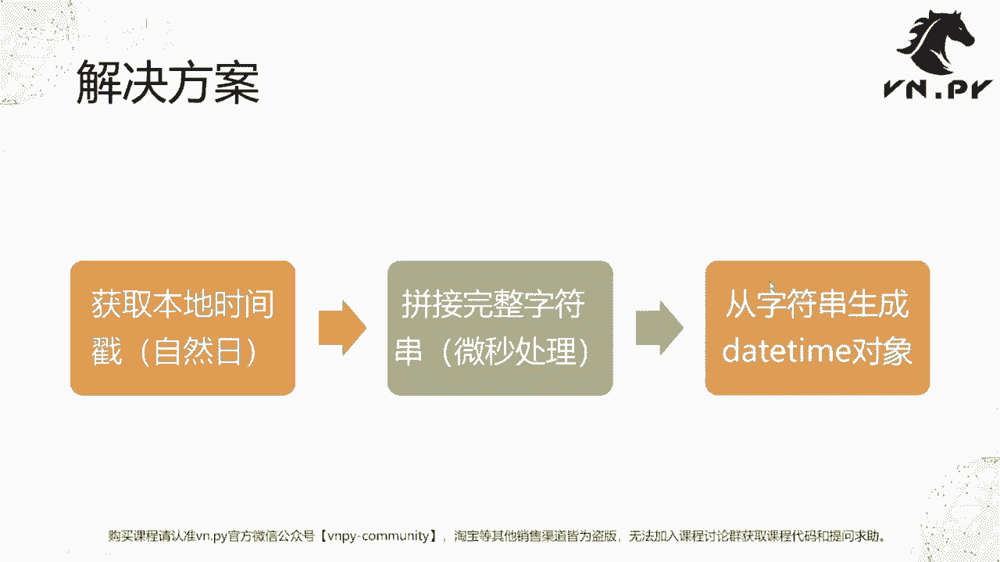

这个微秒处理我们刚刚也讲了，然后呢就来看一下这个哎我们自然日的处理。

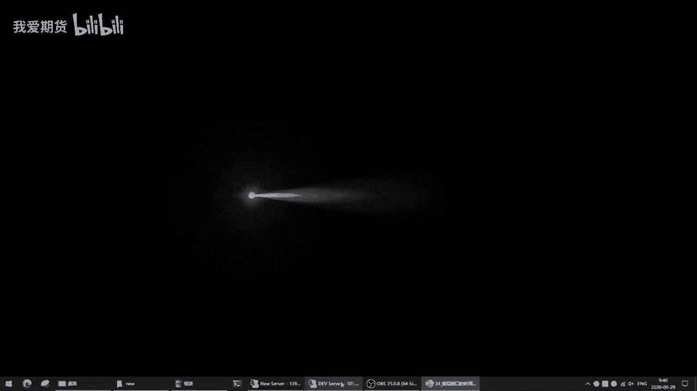

那这里啊我摁了一下这个CTRL加退格键。

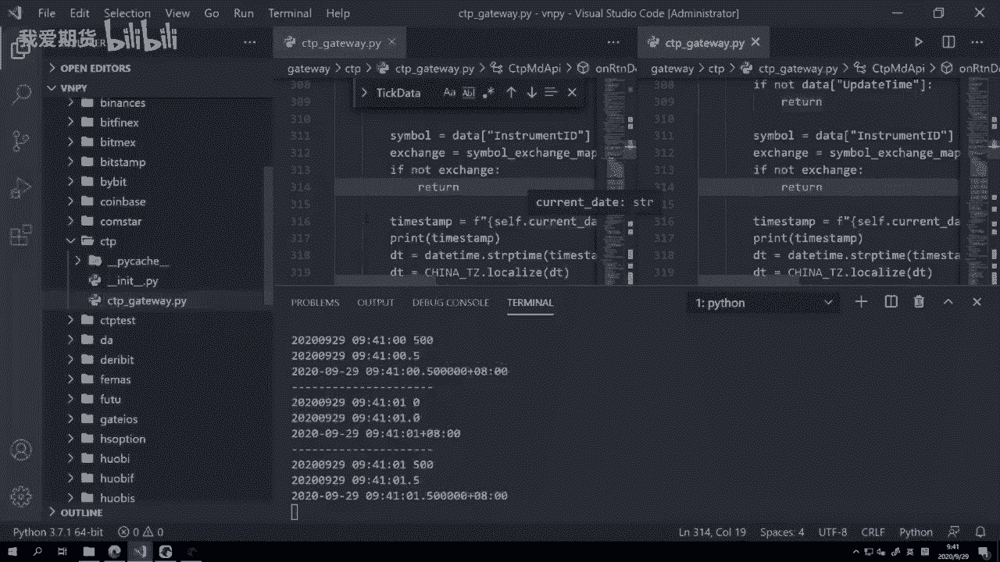

下面的这个反斜杠啊，是左右拉开两个窗口，或者你直接点右键啊，这个叫做啊split right，往右面再开一个窗口也可以啊，然后我们在这主要为了找这个self点current date，把它选中。

然后在这边CTRLF开始搜索，把这个CTRLV啊这个粘进来，然后我们可以看到啊，这个current date是在这里改的，怎么计算的呢。

就self点current date等于day time点now啊，然后把它转换化成一个字符串啊，就是年月日没有没有那个时分秒的部分，就是不断的取当前的日期啊。

这个update date呢是每一秒钟我会看一次，当前日期是什么时候啊，每一秒钟我会看一次，呃，呃呃呃呃不好意思，说错了，不是每一秒钟啊，这边是一个啊叫定时器的这个写法，这是每两秒钟看一次啊。

这个小于二这块内容我们到后面再讲这块内容，还有现在不涉及到，反正你就记住呃，van der pad这个接口，这里啊，因为涉及到我们刚刚讲的这个交易日，自然日不同的问题，所以我们对于策略来说。

或者对于我们做交易的人来说，我只关心这个交易在现实世界里面，这笔行情发生在哪个时间点，所以我们统一都用自然日就行了啊，我不用去用交易日的概念啊，因为四个交易交易所里面三个用的是正确的，自然日。

有一个是用的奇怪的比较奇葩的规则，他就是归属到下一天的啊，所以呢我们只能统一的都不用，那么我就用我本地的几个日期啊，我两秒钟看一下今天是哪一天，哪怕夜盘这个啊，因为现在夜盘不涉及到那个隔日的部分了。

就就就就就没有那个越过12点了啊，所以这个这这么一个处理都还是比较安全的啊，没什么问题，所以在这哈我们就啊，因为这个current date是在那个update time里面生成的啊。

按住CTRL可以快速跳转过去，然后呢我们再在收到tick行情推送的时候啊，做这么一个字符串，第一步生成time stem字符串，把它拼起来，第二步呢把它转化成我们要的daytime的数据结构。

最后大家可能还看到这还有一个操作，叫做DT等于china t z点localize，这句操作什么意思，这是一个叫做时区的处理问题啊，我们举一个例子，如果你做黄金期货的内外盘套利。

那国内你做上期所的SHFE的黄金，它是它推广行情都是这个北京时间啊，就是我们中国的时间错，然后你做同时在做啊，这个CME芝加哥商品交易所的黄金，那他那边过来时间是芝加哥时间，两者虽然都是时间戳。

但中间是有时区差的啊，但是对于我们用户来说，我们有一个比较强的一致性需求，比如说我看行情的时候，我希望看到两者的时间都转战北京时间对吧，因为我我自己在中国啊，我希望看都看北京时间。

我不希望你那个CME那边推过来，给我显示个芝加哥时间的，我还要在脑子里面去转，这个特别麻烦，所以第一个图形界面显示，我们要希望它一直，第二个在数据库里面记录时间戳数据的时候啊。

我们也是希望把它转化成一致的，来做这么一个啊这个这个记录，否则的话呢就有可能出现诶，你你这个是一个北京时间戳，那个是一个啊，芝加哥时间做也一样，我后面跑回测的时候，我还要自己另外做转化，特别麻烦。

最后还有一个需需求，就这个叫做回测时间戳对齐对吧，因为我要去跑套利的策略回测，我既要加载这个国内黄金的行情，又要加载CME黄金的行情，然后我把他们两个要时间戳对齐啊，某一分钟的K线。

就是我我只有把它们对齐之后嘛，我才能用国内的剪啊，这个芝加哥的那去计算黄金套利价差，然后去做对应的回撤，所所以这里有这么三个需求，显示数据的记录，还有这个时间戳对齐。

那也是为什么我们VENDER派从这个大概三呃，这个这个2。1。2版本开始好，我们对所有的时间戳都加入了时区的概念，用到的是Python的这个叫PYTZ点time zone啊，这么一个PRTZ。

是一个专门Python里面的时区的这么一个库啊，time zone呢，就是他的这个用来标识时区的这么一个类啊，它的作用是定于时区，还要做一个自动转换。

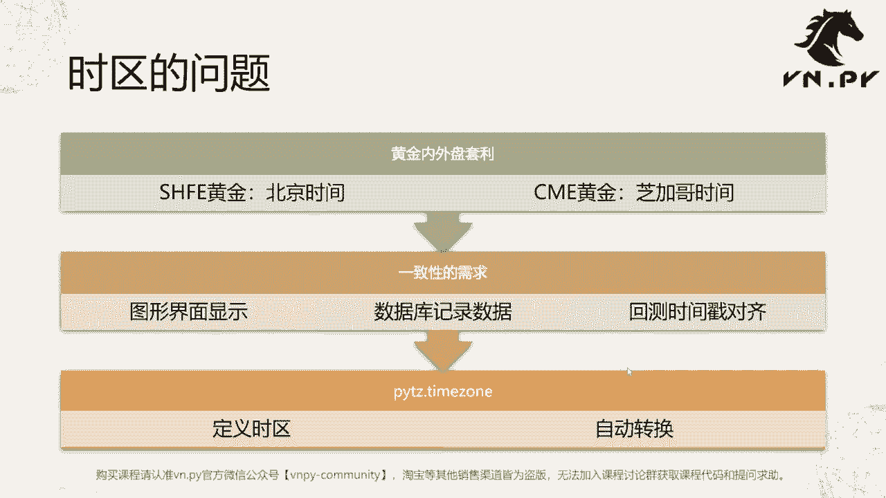

说起来这么多话啊，但其实代码里面还是挺简单的，首先我们到顶部我们可以看到加载了，我们加载一个类叫PYTZ这个类啊，time zone这个类，然后呢在下面我们定义了一个常量叫china t z啊。

它等于PYTZ点time zone，然后里面是A社上海这么一个字符串啊，传了这个字符串之后，反正你就理解他创建出来这个china t z啊，他就是一个中国的时区东八区了。

下面我们这里有一个daytime的对象，创建出来之后，它是不带有时区信息的，此时我们调调用这个china t z啊，点localize方法，把这个不带时区的daytime传进去之后。

返回出来的结果就是一个带上了时区的这个啊，我们的这个daytime啊，然后有了这么一个daytime之后呢，我们后面就可以把它添加，绑定到我们的这个tick data，好，就行情。

tick数据的时间戳上，然后呢，再推送给上面的策略模块，去做对应的各种处理啊，那么到这儿呢我们是围绕时间相关的逻辑，就啊就是接口层时间相关逻辑就已经讲完了，那呃我刚刚的这些修改哈。

因为是在VD派源代码里面改的，它会影响到你后面所有的行为啊，所以我建议大家这节课的内容，因为是一个啊实用性内容，你可以选择只看不去操作，没关系啊，如果你操作了这边记着把改的部分给改回去啊。

你可以手动把一行行print给删掉，或者直接按住键盘CTRLZ就是所谓的回退操作嘛，在word里面什么都一样的啊，那就很快的把这些操作都给去掉啊，去掉完了之后呢，这个时候记住这里啊。

你看是一个圆圈的符号，什么意思，你有修改的内容还没保存，这时候按CTRLS保存一下啊，让这个圆圈消失，那就把我们CCTP接口退回到之前啊。

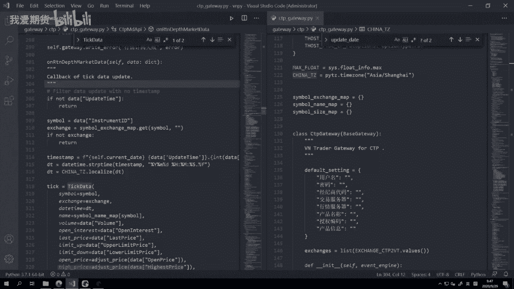

原始的没修改的版本了，那这个时候呢我们再来点开这个data manager模块啊，数据管理模块，然后呢有一个叫导入数据功能啊，这块功能是从CSV文件里面去导数据啊，具体怎么用。

其实你看这个啊界面就很容易理解啊，和我们今天内容相关的，就最底部这个格式信息，这个时间格式里面，其实你现在看它应该就比较熟了，它对应的就是我们在拿到的那个CSV文件啊，时间内列长什么样子。

你在这里呢就要把它做这个字符串格式，转化的时候啊，你要去把它写成对应的格式，比如如果用反斜杠分隔的话，你这边就要加上反斜杠，反过来，如果没有分隔的话，你就要把这个分隔去掉，后面也是一样啊。

这个年月日如果没有分隔的话，不不好意思，十分秒，如果没有分隔的话，也要把这个冒号给去掉啊，反正就做对应的处理之后才能正确去加载，否则你这里的时间格式和那个CSV文件里面，本身数据的格式不一致的话。

那么加载就会出错啊，那么就会所谓的抛异常了啊。

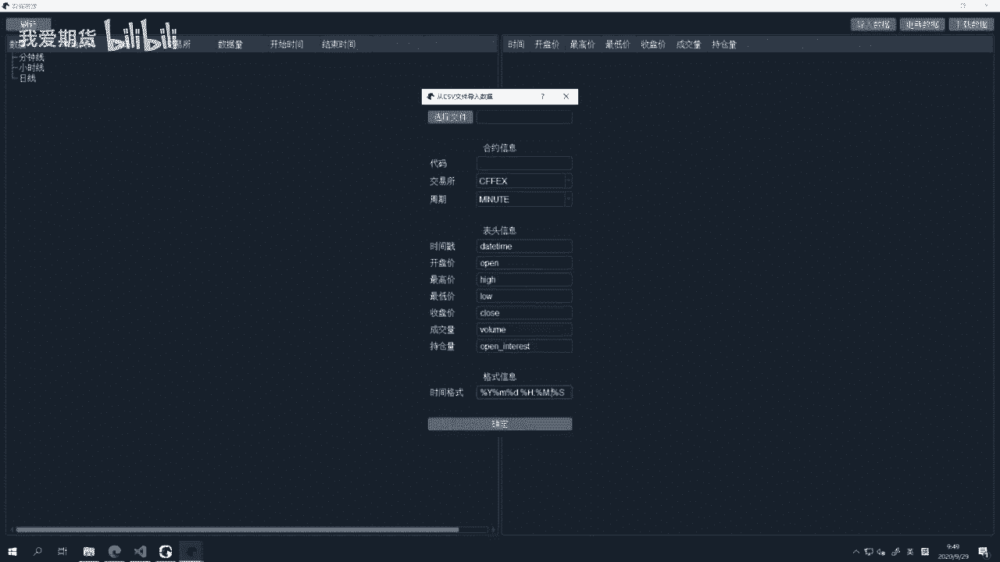

OK额还最后呢，那么我们这节课的内容就到这啊，还是再给大家强调一下啊，我们接下来的课程里面就讲模块这一块的时候，我们会先讲模块，然后对于这种啊部分在VENDER派内部，非常常用的模块。

我们会来讲一讲它在V点派内的代码的位置啊，以及这一块的啊上下文的这些逻辑，如果这些内容你现在还感觉听不懂，你觉得诶一下跨度特别大，怎么一下子就从这个基础跨到了这个，就是实践的应用啊，你听不懂啊，没关系。

这些课时它是需要一定的就围绕着交易，甚至于围绕着边界派的使用经验啊，才能听懂的，所以呢如果暂时性听不懂，没关系，记住这个内容啊，你继续往后面学，因为后面还有比如CCTA的课程啊。

还有其他齐全的课程啊等等，那么学到那里再看到一个东西，没看懂的时候，你记着这地方啊，我们在这个啊，这个这个啊30天解锁里面有讲到这块的知识，到时候再回来看啊，就就就能够比较有效的去消化吸收了。

所以呢也呃这个暂时听不懂，不用太紧张啊，更多精华内容，还是请扫码关注我们的社区公众号。