# 35.csv模块 - P1 - 我爱期货 - BV1gL2gYiEB7

OK欢迎来到量化交易零基础入门系列，30天解锁Python量化开发课程，那么今天呢是我们的第35节课了，之前两节课呢我们把它花在了时间，日期模块的讲解上，这节课呢我们要来讲一讲CSV这个模块。

那么cc模块呢，大家其实看名字就应该能知道，它主要作用就是来处理这个CSV文件啊，CSV文件的全名叫做逗号分隔符文件，那么它其实主要是一个呃，绝大部分时候我们可能是用excel去处理，去生成的文件。

但因为它的数据格式比较简单，很多时候呢，在我们整个金融行业非常常见的一个应用，就是用它来保存各种历史数据啊，呃呃这个可能是行情的，可能是你比如当天的成交记录啊，你自己的委托记录啊等等。

都可以通过它来保额这个保存，那么所以围绕着它的读写啊，在我们量化交易里面，也是一个非常非常常用的情景，那这个CSV模块就是为了解决Python，来读写CSV文件专门设计的，整体上它的功能分两大块。

当然一块就是写，一块就是读了这个跟所有文件字操作都一样啊，写这块有writer这么一个类，也有dictor writer字典，这个就写入者这么一个类啊，读呢有reader这么一个读取器的类。

也有DICTREADER字典读取器的这么一个类，整体啊你就记着他分读写两个方向，然后每个方向里面呢又有一个常规的类，以及一个用字典来操作的类，那么接下来我们就直接来看啊，怎么样去写入一个CSV文件。

怎么样，我把Python里面一些数据写到CSV文件里面去，那我们会用到三个四个啊，怎么样的操作吧，第一个知识点叫with操作符，第二个叫做open函数啊，打开一个文件，然后呢对应不同的模式。

第三个叫创建一个writer对象啊，创建一个写入器对象，最后呢好我们来逐行的把数据写进去，那这边我们这次又要用jupiter notebook，然后我们开了一个35csc demo，这么一个文件啊。

首先第一行我们要做的就是import csv，就是非常常见的操作，那么嗯然后在第二个单元格里面，我们叫做with open，得得得后面这个东西as f什么意思呢。

我们打开这么一个叫test一点CSV的文件，然后啊这个打开的时候，我们用W就是write写入模式，以这个模式打开的话，你才能往这个文件里面写内容，与之对应的还有一个R只读模式。

如果你只读模式打开一个文件，你可以读它里面的内容，但是你不能往里面写任何东西啊，这个是我们的操作系统，给我们提供了一个保护吧，那么有的时候可能我们只是希望看一看，文件里面内容，我不希望破。

万一不小心破坏它，所以你就不要用什么写入模式去打开，你就用只读模式去打开，会安全一点，反过来你要写一些东西到一个文件里面，或者你要创建一个新文件的时候，都要用这个W模式来打开啊。

当然我们的Python还提供了很多其他的模式，比如往后添加等等，这块呢你可以啊，自己在百度或者说在google里面去搜索一下，oppython open啊，这个啊函数。

然后你呢去看一看它的详细的具体的用法，最后还有个选择叫new line等于什么什么，这句的意思呢，就是啊每一行的这个分隔符按你用什么来标识，那在windows上我们就用空的分行符就行了。

然后呢打开这么一个文件，那把这个文件的对象标成一个F，所以叫with open这么长一个形式as f，所以这个时候我们就有一个叫F的啊，这么一个啊可以操作的文件对象，那么然后呢我们再来调用writer。

等于CSV点writer啊，把这个F传进去，那么创建一个写入器，然后我们往里面写一行一行的写，注意写入器每一行写的时候呢都是一个列表，都是一个列表，列表里面每一个元素是一个字符串啊，一定要是字符串。

因为对于啊这个文件那些操作而言，它只认你往里面写的这个字符的内容，它是不会认识啊，这个整数啊，浮点数或者布尔值这些类型的，如果你有这些类型的数据，请把它们强行用string转化成字符串之后再去写啊。

首先我们第一行写了一个表头信息嘛，symbol date和close price就哪几个合约代码，哪一天的收盘价多少啊，RB2101simple都一样的日期呢，分别是9月7号到9月8号到9月9号啊。

close就是这几天的日收盘价好，我们就调用writer点write roll方法哈，去把这一行写进去，那说起来说，说了半天，其实运行很快的，这个运行一下瞬间就写好了，此时呢我们打开当前文件夹。

就可以看到已经有test1这个文件，点CSV这个文件了，那我这台机器因为没有装啊excel。

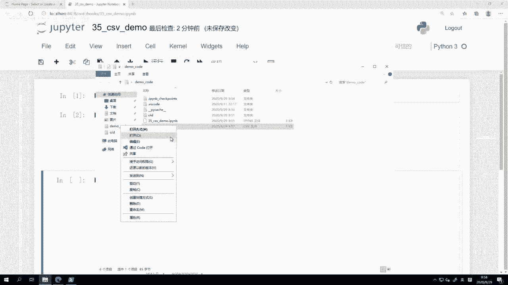

所以我们无法通过excel打开，我就这样通过code来打开啊，通过vs code来打开好，我们可以看到它的内容就是这个symbol啊，date哎对了，这个我们vs code是可以装一个excel的啊。

这个这个查看器的，然后就可以装一个叫excel viewer，它正好刚刚提示我了，我就直接装上，装上之后，应该就直接能够用一个比较方便的方式来看，四，Open preview eight，啊这样就行。

我们可以看到这个就是啊，用excel表格的方式来看这个CSV文件，它就长这个样子，你看第一行就写的那个第一行表头，然后下面每一行都是对应的我写进去的啊，这个数据。

那么每每一行是一个我在这边写进去的列表啊。

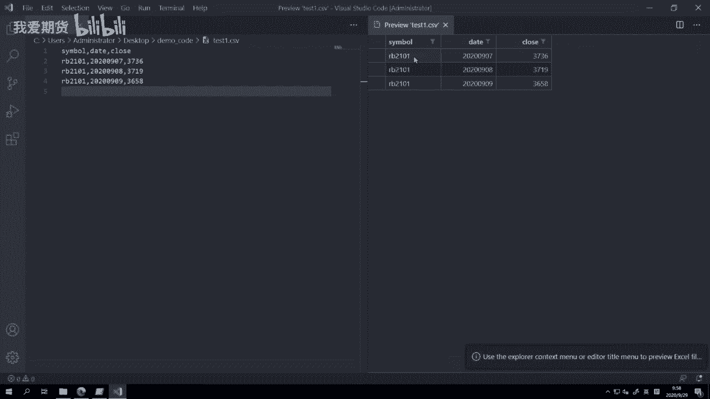

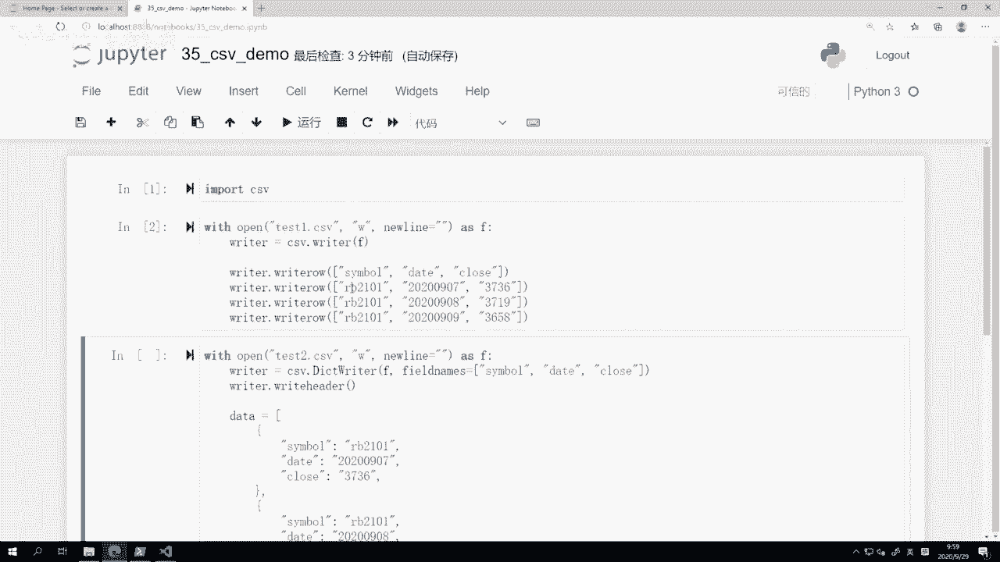

一个列表是一行，同时列表里面每个元素是这一行的一个单元格，所以操作起来还是很简单的，就基本上你只要看着这么一个例子吧。

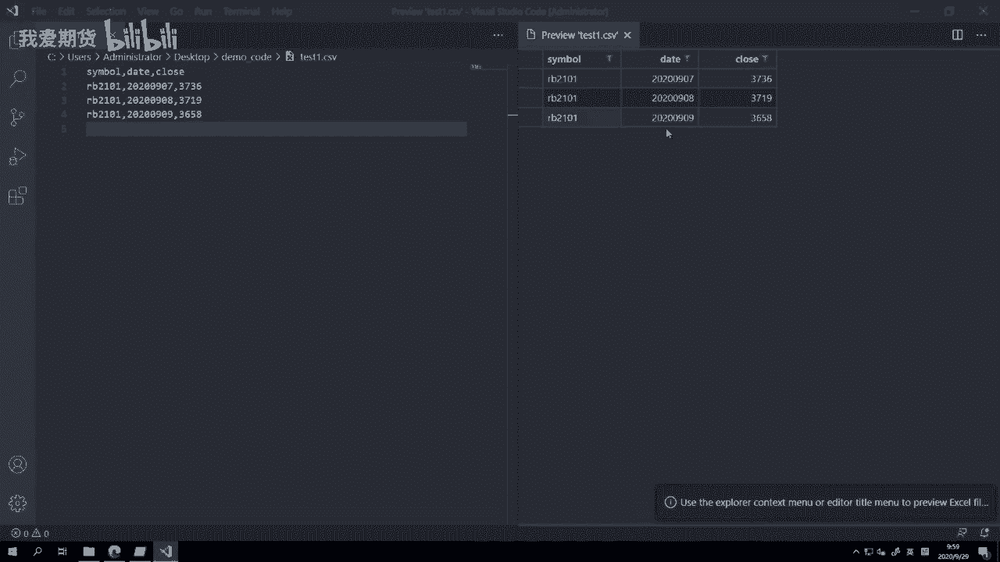

后面很紧接着就可以用了，那在这里我们主要还要再讲一下，就with这个操作符，它的作用啊，如果我们不用with操作符，我们正常用这个写法应该怎么写呢，就是F等于open，首先打开一个文件对吧。

然后创建一个writer，好这里空一行，最后在你写了那么多东西之后啊，一定要记住要有个F点close，把这个文件给关掉啊，否则的话它就会啊就是一直被当前的进程锁定。

然后我们的windows就你就没有办法再去，比如用excel打开这个文件做任何操作，所以我在这啊就再写一个文件啊，test0我们也看一下，如果哎我光记着开它，我漏了最后一行会怎么样。

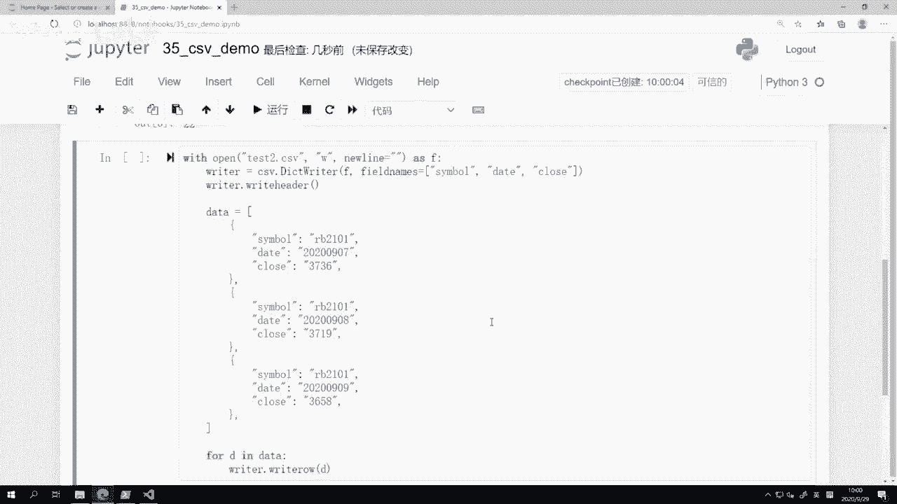

我们可以看到这个文件也有，但是打开来呢啥数据都没有，它是空的，主要原因就是因为这一堆数据。

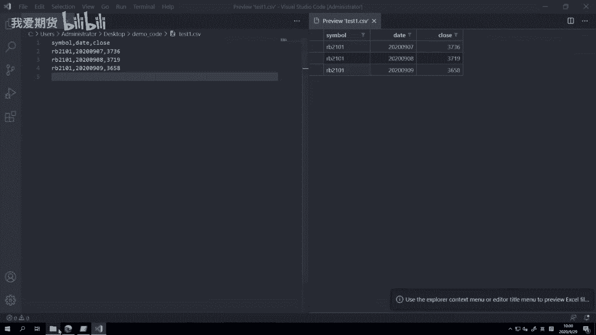

我们只是把它往这个文件里面写了，但是我们忘记最后的这个操作，close close的作用呢，就是把啊这个当前位于我们内存内啊，这个文件的这些缓冲区的信息，真正写到硬盘上的文件里面。

因为我们漏的那个close操作，所以现在是没有的。

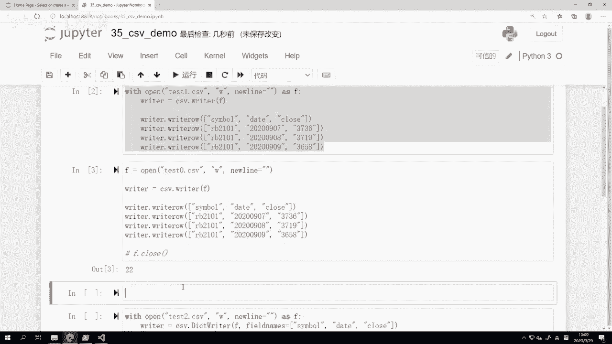

我调用一下F点close啊，我自己记着调用一下，然后我们再回来看啊，我们再打开这个test0，我们就可以看到这个时候数据就已经在这。

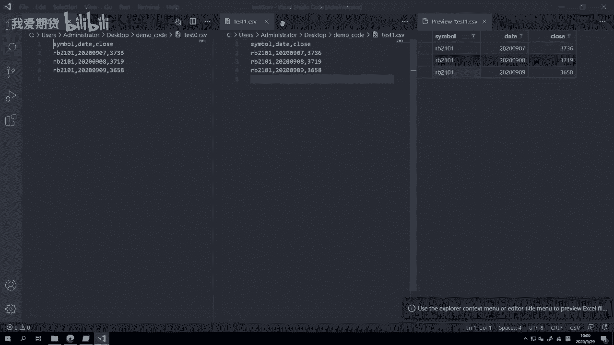

所以如果你用常规的这种写法啊，就在上面用F再打开，然后呢后面再close的话，可以起到和上面这个写法完全一样的功能，但是啊对应的一个容易犯错的点，就是你容易忘记去close，一旦你忘记close的话。

那等于这个文件写入就失败了，因为他其实数据还在内存里面，你如果关了当前进程的话，或者你把这个Python关了，那这个数据就丢失了，为了尽可能最小化这种这个没必要的bug的出现，可能。

所以Python里面呢就专门说设计了，这么一个叫with的语法堂，它的作用啊，就是在啊你这个with什么open as f的时候，那么他就同样操作帮你打开这个啊文件，然后呢放到F这个变量上。

同时当with语句最终结束的时候，Python解释器会自动帮你运行F点close，你不用自己去写了，Python会帮你自动去执行啊，所以这就是为什么，我们更推荐在啊。

这个Python里面做常规文件操作的时候，用这个with的写法会啊这个更好一些，因为它可以避免你写错代码好，然后嗯刚刚讲的是比较简单的，就直接write rose，但是呢这一种啊。

这个writer有的时候可能不是那么的方便啊，因为我们知道在Python里面我们的这个数据啊，很多时候会用字典的法这个形式来保存对吧，它可以比较有效，通过键值对的关系去绑定这么一个啊，两者之间的关系。

所以接下来呢我们对应还有一个叫做DICTOR，writer哈，字典写入器的这么一个类好，我们也来看一下，那主要作用呢，就是用这个字典来直接把对象，写入到CSV文件里面，那么整体上有三步啊。

第一步定义表头，定义field names，第二步写入表头write呃，这不好意思，这多了一个r a right header，然后呢最后逐行把数据写入write roll好。

我们这边来看一下这个怎么具体怎么操作，我们还是用with语句啊，只不过这次我用test2点CSV这个文件打开它sf，然后呢，我们创建一个writer，这个writer是什么叫dict writer啊。

Cf video dict writer，然后我们传入文件名哦，不不好意思，文件对象，同时我们有第二个参数叫field names，就是你要写的那些列的表头名字，你可以看到啊。

上面我是直接在就写某一列呃，就开始往这个CSV里面写数据的时候，我先自己手动的写了这一列write roll进去，但在这儿我就先把这啊，不好意思，不是一列，先这这这一行啊，就是每列的头啊。

这一行我先给写进去，所以在这我就直接通过field names给传进去了，symbol date close直接给传进去，就告诉他哎我就这么三个啊，这个列。

然后呢我们就要用writer点write header，就是先把这三列的名字啊，这一行在头部先给写上，在这个CSV文件头部写上，后面我们的data，大家可以看到这个data是一个列表啊。

但里面每一个元素都是一个字典啊，大家可以看到都是一个字典，然后字典的每个键和上面的这个啊，这个CSV文件的表头正好是一对应的，symbol对symbol date，对date close对close啊。

里面的数据还是一样，都是字符串，同样不要放什么整数，不要放这个浮点数什么的，只能放字符串，那此时呢我们就用一个循环了，for d in data writer点write roll d啊。

这个操作就和上面这个一样的啊，只不过我这样呢，因为把数据放到一个列表里面，我用一个for循环去写了，此时来运行一下之后呢。

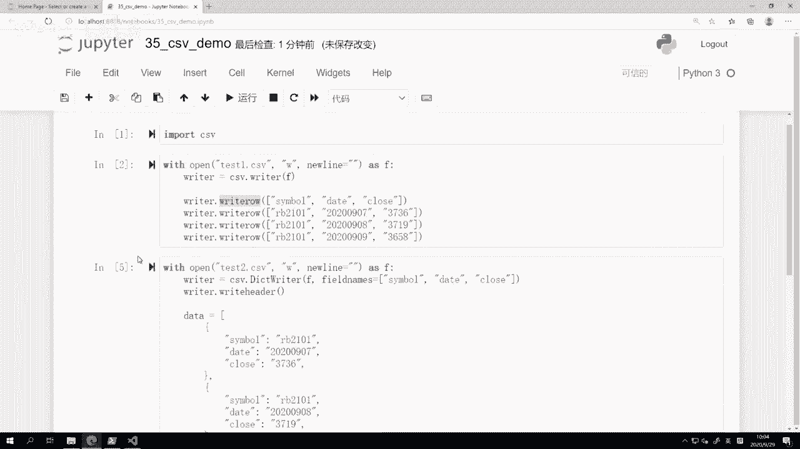

我们可以直接来这啊，我们再打开test，这个不需要我们打开这个test2啊。

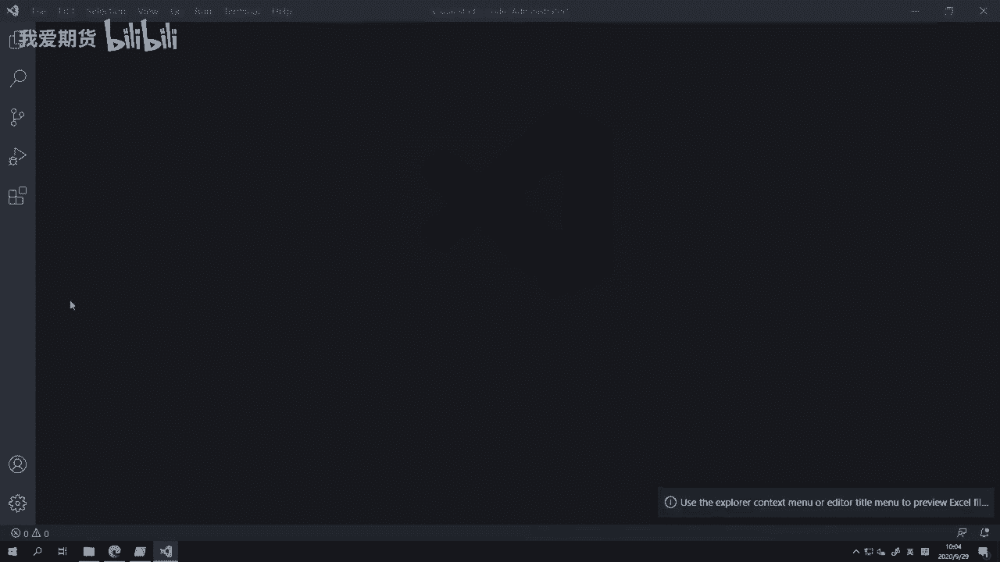

我们可以看到他数据也是和我们刚刚写进去的，数据一样的啊，但是这时候我们写进来的，就是以字典的方式写进来的啊。

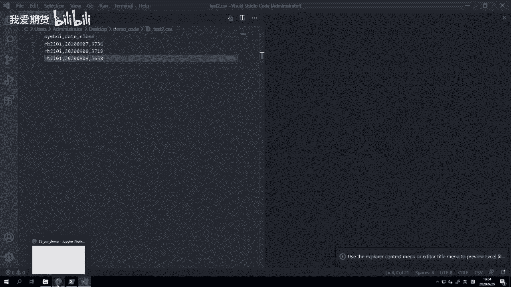

那么我们在最开始讲数据结构的时候，我们也多次提到，字典在Python内部是一个非常非常常用的啊，数据结构，就你很多时候会用它来表示那个具体的数据啊，列表呢更多是用来把呃一个又一个字典。

或者一个又一个比较简单的数据放在，就呈现一个这种啊顺序绑定的关系，放在一起的啊，所以这个是他们的应用情景，那最后我们再做一个演示，就是CSV模块，除了啊用来写数据到CSV文件里面以外。

也可以用来把数据给读出来，那么这里的操作呢就也一样啊，With open，但是open的时候大家注意到这个参数，我不再传是W而是R，因为我是要read，我是要读，所以我只要R就行了，as是AFF。

然后我们创建一个DICTREADER啊，cs video dict reader f传进去，这个你不用传表头的，它会自动去读啊，这是一个reader，然后for row in header。

print row啊，就把一行行打印出来，我们可以看一下结果是怎么样，每一行都是一个啊，当然这这个我们现在还没讲，就是Python数据结构里面一个叫排序字典order的dict。

你就把它当字典去理解就行了，然后每一行都是一个symbol啊，都都都是一个就是这么一个键值对吧，一个是symbol啊，这个就是RB2101date就是每天日期close，就是每天的几个收盘价。

或者呢如果这里啊你不用DICTREADER，你用reader也可以啊，我们把它换成普通的reader，我们看看效果怎么样，这是读出来的，每一行都是一个列表了，然后列表里面的每一个元素。

就是这一行对应单元格的那个数值啊，当然这个也可以读出来，但是这个读出来，有的时候可能处理上不是那么方便，我还要自己去记得啊，他每一个哪一列啊，是哪个数据，然后再把它处理出来，所以呢在实践里面。

我们在读数据的时候还是DICTOR呃，这个reader用的更多一些啊，确实它更加方便，这个直接就可以当字典操作，比如说我不要print roll。

然后直接print roll symbol rodate，Road rose，这样打印啊就可以很方便给打印出来，甚至后面啊我如果跑回测啊什么的，有，因为这三个数据，我可以直接把绑定到对应的变量上啊。

所以跑回测呢等等啊，相关操作就非常方便啊，OK啊那么操作反正就这么一个三三步操作，读文件的时候，with打开文件，然后创建dict reader，然后呢逐行遍历来读取数据啊，到这儿的话。

其实已经一定程度上，我们再把之前我们讲的那些Python基础的语法，Python的这个数据结构，Python的那个变量类型，还有一些这种像for循环啊，什么if啊，判断啊等等啊。

以及我们现在每节课都还在讲的这个模块，内容开始结合起来用了啊，你会发现就Python其实嗯当你习惯它的语法之后，再去诶写一些东西，真的嗯有一个说法吧，就是写其他编程语言，你经常要先写伪代码啊。

就是这种就他主要是只是呈现的一个逻辑，并不符合实际那个编程语言语法的代码，在Python里面很多时候你是不用写伪代码的，你直接写Python就写Python代码的时候，就感觉就是在写伪代码啊。

然后你不知不觉就你你把整个逻辑想清楚，伪代码写好，你就Python的程序也已经写好了，直接就能运行了啊，所以呢这个也是啊，可能在我们这个课程结束之后啊，希望大家能够啊达到的一个水平吧。

当然为了打这个视频还是要多练啊，我们虽然目前每节课的内容，因为讲模块的话，我们都会提供啊这个JUPITER的这些呃，或者或者就是直接Python文件，但我推荐大家还是自己手敲一遍啊。

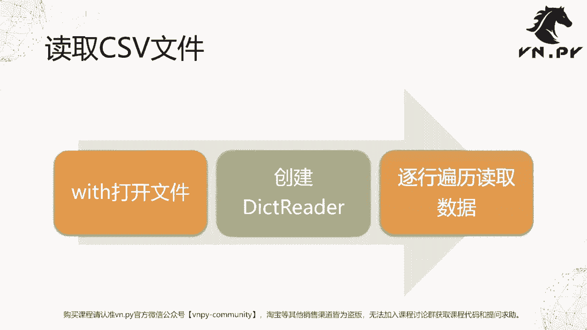

这样效果呢会好很多，OK啊，那么更多精华内容，还是请扫码关注我们的社区公众号啊，另外也在最后这里给大家提一句啊，就是如果啊在学习的过程中遇到任何问题的话。

是可以通过我们V点派网站，就是VN p y docom forum啊，这是VN点派的网站，然后呢我们论坛专门有个专区叫做量化交易，零基础入门，在这个专区里面提问的啊。

那么呃反正每天都会有我们的同事专人上来看，然后有任何问题的话会及时解答，所以大家在学习过程中，不要说遇到什么问题就闷头在那网上，当然当然我推荐大家先找资料啊，先先自己看一看，然后如果看不懂就找资料。

如果还是搞不定的话，那一定要记着来问啊，不要说就让他这样过去了，让他这样过去的话呢，那这块知识等于你就没学到啊，所以这这肯定起不到学习的效果啊，遇到任何问题呢，记得啊，这个可以来论坛提问好。

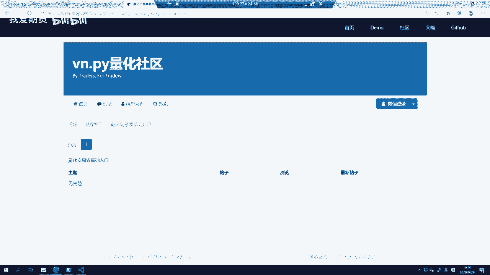

那么OK今天这节课的内容呢就先到这。

