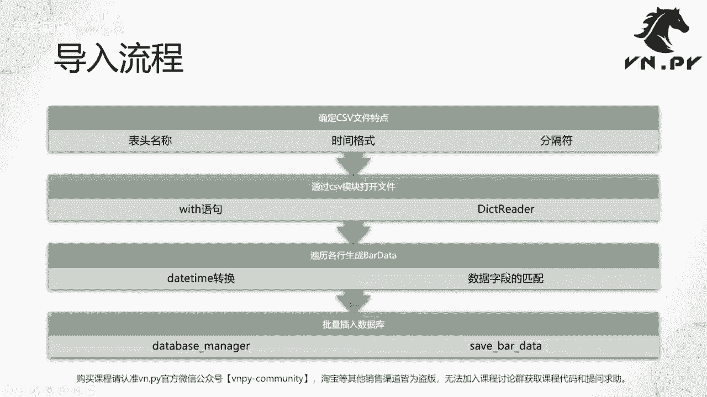
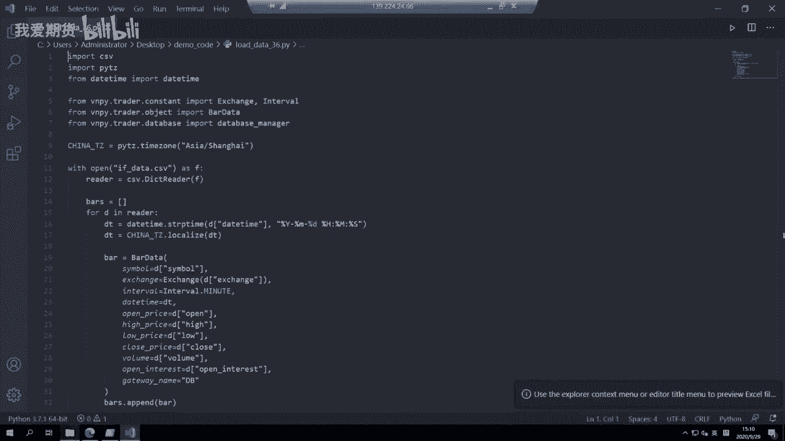
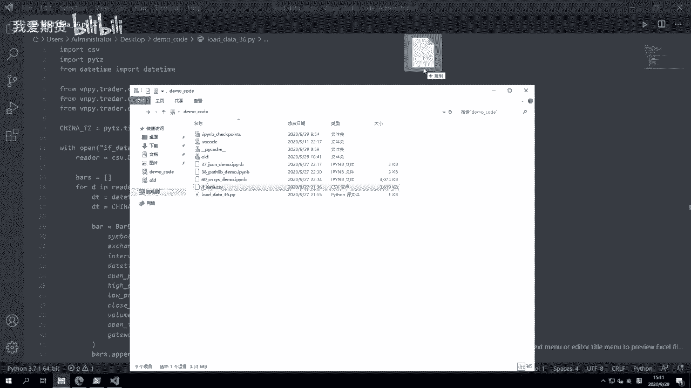
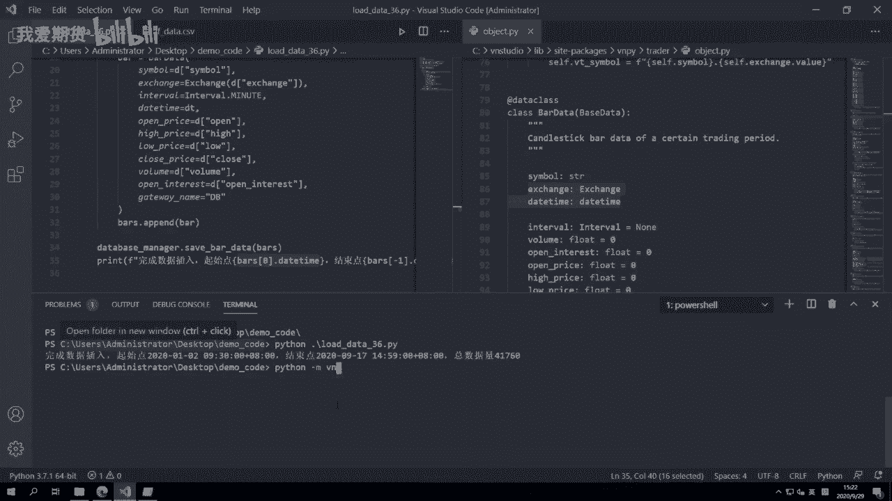
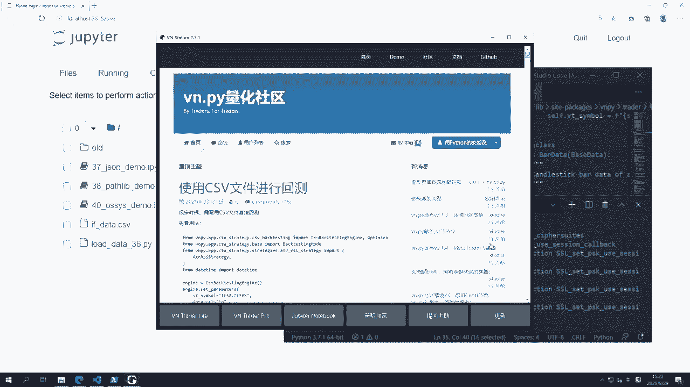
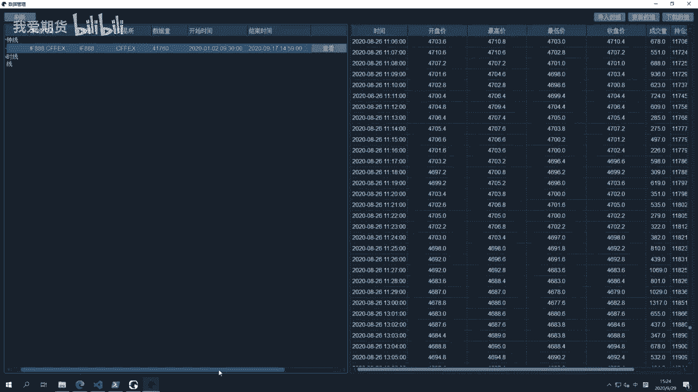
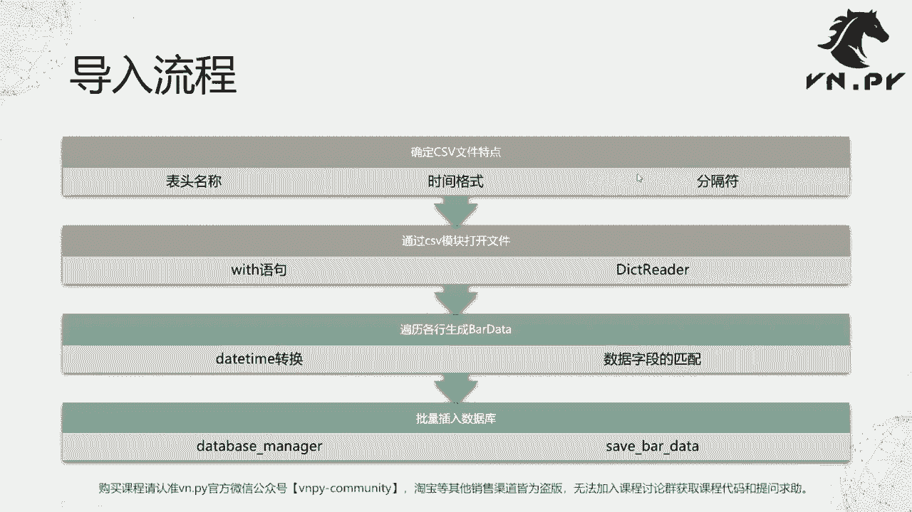

# 36.载入CSV历史数据 - P1 - 我爱期货 - BV18L2gYiEfK

OK欢迎来到量化交易零基础入门系列，30天解锁Python量化开发课程，那么今天呢是我们的第36节课，在上一节课里面啊，我们学习了CSV模块的基本用法，这节课呢我们来看一看它的实践应用。

导入CSV的历史数据，到我们VN点派的数据库里面，那么这节课等会我们整体上是要来看代码的啊，我们先在开始的时候，在脑子里面记一下，我们今天要做的这个导入操作的整体流程啊，整体上是这么一个四步的操作。

首先第一步，我们要先打开这个CSV文件来看一看啊，确定一些它的特点，比如说它有哪些表头啊，表头一列一列它的名称是什么，然后它对应的时间格式长什么样子，对应的这个CSV文件里面的分隔符。

是用的逗号还是用的空格，还是用的呃制表符等等，然后第二步我们就要用CSV1模块，来打开这个文件了啊，用要用到我们之前已经学过的with语句，还要用到DICTREADER啊。

我们通过字典的方式来把一行一行读出来，第三步呢叫遍历各行来生成bar data，这个bar data是VN点派呃，内部一个最底层的，用来标识K线的数据结构，那么在生成的过程中呢。

我们需要做这个data time的转换，以及各个数据字段的匹配啊，最后已经把数据生成好了之后呢，我们就可以批量的把它，插入到VA派的数据库里面，在这里我们要用到一个叫database manager啊。

这么一个特殊的对象啊，以及它对应的save8data这么一个方法。

那么接下来呢我们就来看哈我们这节课的代码，那么这节课的代码一共包含两个文件啊。

第一个是load data哈，这个我后面加了三六，这个就课时的这么一个名字，另外呢还有一个i f data点CSV，这个CSV是啊，我们的这个F股指期货啊，这个888连续合约的数据。

那么我们现在第一步啊，就先把这个CSV给打开来，看看它长什么样子啊，我把直接在拖到这个vs code里面打开。

那在这呢我们我们可以看到啊，它整体上是涨的这么样的一个数据，首先表头是symbol exchange date time，Open high low close volume。

open interest啊，这个呢比较常见的啊，我们可能很多时候看到一个CSV文件，不管从淘宝买的，还是从别的系统里面导出来的啊，可能一般就是这一类的表头，然后数据里面这个日期的字段。

也比较容易接受啊，就是年月日中间用减号分隔啊，或者说用横杠分隔，然后呢十分秒中间用冒号分隔好，那么整体上就这样，没什么太特别的地方，每个字段之间的分隔符呢用的是逗号啊，这个是最常见的分隔符。

也不用去做什么特殊处理啊，所以在我们这个load data里面，我们就可以很方便的去做这么一个啊，加载的操作，那么下一步呢我们就哎打开了这个load data，36点派啊这么一个文件。

首先我们要来看顶部区域，我们import的模块相对来说会稍微多一点啊，首先我们要加载CSV模块，然后我们要加载PITZ模块，这是time zone啊，就这个在我们更前面讲那个对time的课的时候。

有用到，然后我们还要加载date time模块，下载date time类啊，我们要一共就是这个Python的内置模块，我们要用到这么三个，然后第二步你看这儿空了一行啊，下面这块区域写的是我们要加载的。

VN点pd模块，那么VN点P作为一个三方模块，一般呢是对于它的加载，和这个上面内置模块加载，我们在写啊Python文件的时候，最好中间空上一行，这样呢更加清楚一点。

我们加载了V点派内部的exchange啊，这个是交易所的枚举类型，还有interval k线周期类型，我们还加载了bar data啊，这个K线对象，我们加载了这个data me manager啊。

这个是用来啊，这个管理和数据库连接的这么一个管理器啊，整体要这么一堆的组件，当然对于这些组件，你现在如果不熟的话，也没关系啊，因为呃同样这节课的内容，和我们之前讲接口那个课一样。

是对于VUE派内部代码一些应用的扩展课程，所以你如果刚开始学Python的话，这块你肯定会有一点啊不太懂的地方，没关系啊，这个啊和之前一样，等到未来你用到这块知识的时候，再回来看这节课就好。

然后在下面我们第一步同样定义了一个time zone啊，我们上海时间ASIA上海其实就北京时区的时间，定义好这个china t z之后，下面啊，我们开始用CSV模块来打开我们的文件了。

那么这里呢我们用with语句open f data，点csv as f，注意这里第一个我是只要读，我并不需要写，所以那个打开模式mode我可以不传啊，就第二个参数，这个R我可以不传，不传的话。

它默认就是r read，只读模式，打开之后呢，创建一个reader，Cs videdict reader，括号F这个非常大家熟门熟路了，然后我们创建一个空的列表，叫bars，它用来存放。

我们接下来在一行一行的遍历，CSV文件的时候啊，因为每一行就是一条K线记录嘛，所以我们每一行会生成一个K线对象，每一个K线对象，我们再把它插入到这个bars的列表里面去啊，整体啊这么一个操作。

那么我们在这边呢就for d in reader哈，这个一行一行便利嘛，首先第一个我要处理的就是这个date time啊，他是比较特殊的，要做额外的一个转化的。

第一步我要把这个d date time的字符串给取出来，然后我要把这个对应的年月日，转化这个格式传进去，把它转化成date time的对象啊，再下一步呢我要把它这个稍微localize一下。

转化成当前中国的时区，记住所有边点派内部的数据，他的这个时间戳是要带上时区的啊，你不带市区，在很多大部分情景下可能不会有问题，但是涉及到一些数据，写不到数据库啊等等相关操作的时候，可能就会报错了。

所以记好养成习惯，VENDER派内部操作时间的时候都把时区给带上啊，嗯然后这个DT转化好了，下面我们就可以创建bar data这个对象了啊，如果你在这就第一步，你不知道BARDA这个对象怎么创建呢。

把鼠标移上来，你可以看到他有这么多参数需要传，然后后面带了等于号，举个例子，比如看第一行最后的这个interval in interval，这个它是一个interpret类型，等于none。

那么如果后面跟了默认参数的，这些参数是可以不传的啊，但是其他没跟的话都是要传的，比如前面这些gateway name啊，symbol啊，exchange啊啊，因为这个我要让它提示数，所以鼠标不能动啊。

这些都是要传的，那如果我们想要方便一点，可能写的时候我就按住CTRL键，然后亮起来，点一下BARTHETA好，它会自动跳转到巴蒂塔的这个定义，这边，我们把这个文件呢拖到右边来。

然后我就看了右边的这个数据结构，我可以看到啊，上面的symbol exchange，DTIME这个三个字段是必传的，同时呢因为他继承了一个叫做base data的类啊。

base data类里面我看到有个叫gateway的啊，get to your name的字段啊，这个也是必传的，就来自于哪个交易接口，那么剩下的这些interval什么的。

我们可以根据自己的需要来传啊，高开低收啊，啊时间周期啊等等啊，当然因为我们要把这个数据写到数据库里去啊，所以这些字段都是要传的啊，所以我们接下来就要做这么一个操作，symbol好简单一点。

把它读出来就是d symbol exchange，这个操作我们要在后面一点的课里面讲到，他是一个Python内部的枚举类型啊，这个exchange是一个枚举类型啊，它不是一个单纯的字符串。

所以我们要创建这么1exchange的对象，然后呢把这个exchange字符串给传进去啊，这个exchange字符串呢在这啊，他是这个第二列，就CFEX啊，中金所的缩写。

然后interval因为这是分中线啊，我这个提前去右边看了一下对吧，他是呃这个9。3103101的，得得往下了这一分钟线哈，我知道他是minute，然后daytime就等于DT本身好。

我们上面这跟这个每个循环一开始，我就把第一题先给转化好，后面的open hello，clothes就对应的取啊，我们这个CSV里面的字段就好了，那注意bar data里面的，比如开盘价。

open是open price，但是在我们字典里面它就是叫open，我们可以看这个表头就叫open，或者他也可能比如中文的话就叫开盘价啊，或者最高价等等，反正你用那个这边表头里面。

你看到的这些字段来取就行了，好一个个取完，最后gateway name这一个呢是可以随便填的啊，一般我们要写到数据库里面的这个数据啊，我们就填一个dB好了，就是它是往数据库里面这个要插入的啊。

然后最后我们一个操作是，把这根K线添加到我们的啊这个bus列表里面去，那这个循环执行结束之后，我们也就了有了bus这么一个列表啊，其中的每一个对象都是我们这个bar data。

就是这个啊用来代表一分钟K线的，这么一个数据结构，那此时呢我们可以就可以调database manager，点save bar data啊，就就这么一个非常简单的操作。

那这里这个database manager你可能注意到它是小写的啊，VN点派内部所有的这个类，都是采用所谓的首字母大写，然后呢这种所谓的驼峰式命名法，而而且首字母大写，所有的对象函数。

都是采用这种小写字母的命名方式，同时中间用下划线来区分，所以当你看到database manager啊，中间有个下划线，也有都是小写的时候，你应该知道这是一个对象。

这个对象呢是我们在database模块里面，已经初始化好的，全一个特殊的啊，这个模块级别对象，你不需要再把它给实例化一遍了，它本身就是一个对象，一个实例啊，你不要再去来一个database man。

就是比如说这个D啊，D等于data base manager，括号好，这个是错的一个对象，不能再次被实例化啊，所以直接用它就好，然后这个时候调用database manager，点save8data好。

把我们的K线的这么一个列表传进去，它就会自动的把数据，一条一条的插入到我们编队派的底层的，数据库里，好，那讲起来这么多啊，当然写的过程中你可能也要稍微花点时间，但是运行呢还是非常简单的。

直接启动terminal，然后呢切到当前目录desktop demo code啊，然后呢我们就输入啊，当然这个最后运行完吧，我们就输入个日志啊，啊完成数据去插入起始，8S啊。

我们取第一根K线点time啊，结束点，bars一点，date time好，最后我们打一个打一个这么一个一个print吧，让我们知道哎这个数据确实是完全插入啊，再加一个总数据量啊，总数据量。

啊然后这边其实我们还用到一个操作，就嗯呃大家可能还记得，我们最早讲字符串格式化的时候，这个f string字符串，那么这里我们做了一个操作，是在f string的这个大括号里面。

我们嵌入了一个Python语法的操作啊，我们先把这个代码给运行着啊，让他去加载，因为这个呃这文件说实话记录还是挺多的，我们看一下大概4万多行，这个加载解析，再把数据插入到数据库里面。

大体上刚刚感觉可能过去了十秒左右啊，这个是要耗时间的，不像我们之前那些操作，基本按完鼠标瞬间就出来，所以现在哎这个最终print的日志打出来，说明这个数据已经插入成功了，完成了数据插入。

起始点是2020年一月二号9。30分，然后呢东八时区结束点是9月17号啊，下午02：59分啊，动画数据总数据量44万1000啊，这个760条，此时我怎么来判断说哎，我这个数据已经在数据库里了呢。

我可以启动啊这个VN station啊，我这就直接用命令行启动了，如果你不喜欢的话，你也可以在这个桌面上啊，双击VN station启动，反正效果都一样的，那我这边呢就先启动它，然后登录我们的系统啊。

进入VN trade pro，那么我确保你加载的data manager模块。

点开左上角的这个数据管理组件的按钮，然后呢点一下刷新啊，我们可以看到这个记录已经在我们的啊，本地的数据库里面，当然在默认安装的情况下，那个VORPLE会直接使用本地的一个叫circle。

light文件的数据库啊，所以你不需要额外去装什么MYSQL啊，这MONGODVD之类的这个数据库服务器了哈，这是我们老版本的时候，就你一定要装的，那么在新版本的里面呢，你直接啊用这个默认情况下。

你用circle lize就够了啊，当然你可以根据需求再去啊，自己调整，那这里首先我们可以看到数据已经在里面，44万1000多条啊，这个开始结束时间都跟我们预期一样，点一下查看按钮啊，选一个数据范围。

我们可以稍等一下，他正在读，读完的数据呢，我们可以在右侧的这个里面看到这个，就我们插入进来的数据啊，就都已经在这了，那么从上到下哎，这个，所有的数据都已经可以看到，那这个时候我们就可以啊，放心的说。

我已经完成了数据的插入，他们已经在数据库里面了，那下面呢我如果你要用V点拍跑，什么策略回测啊等等相关的操作，你本地就已经有数据可以用来跑了。

OK额那么这节课是一个还是我们的实操课啊。

内容就到这，那更多啊，精华内容还是请扫码关注我们的社区公众号。