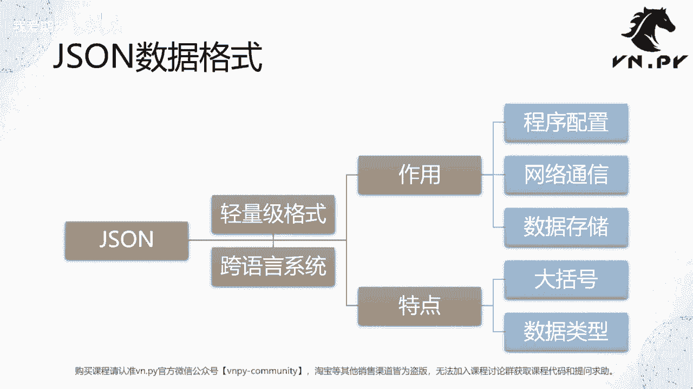
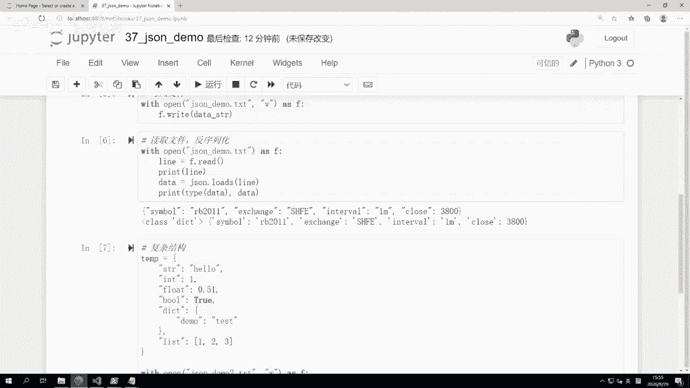
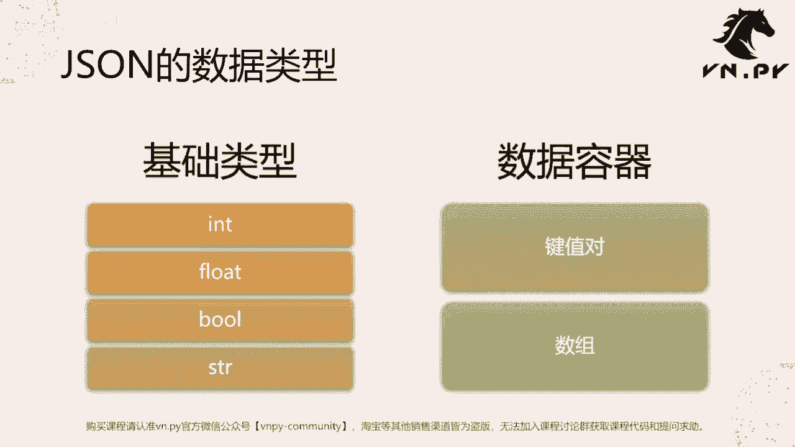

# 37.json模块 - P1 - 我爱期货 - BV1gL2gYiEqB

OK欢迎来到量化交易零基础入门系列，30天解锁Python量化开发课程，那么今天呢是我们的第37节课了，前面我们花了两节课去学习CSV1模块，以及它的一些具体的功能应用，那么这节课开始呢。

我们要来学学这个JSON模块，那么在学习JASON之前啊，首先我们要掌握的一个概念叫做序列化啊，截止到目前为止，大家接触了很多Python内部的这个程序内的对象，包括最基本的Python内的数据结构啊。

这个字符串，string整数int啊，布尔值波，这个浮点数float，以及这些数据容器啊，dict list等等，那么它们都是Python程序内的对象，他们是生活在这个Python啊。

可以说是内存内的啊，如果你把Python的解释器给关了，或者你把JUPITER给退出了，那这个时候他们就会立即从啊内存里面消失啊，所以有没有什么办法可以把它们保存下来啊，有两种方案。

第一种你可以把它写在硬盘上面，写入到一个文件，写入到硬盘里面，第二种方案呢，你可以把它通过网络的方式给发送出去，比如说发到另外一个服务器上去，让他那个服务器去保存，为了实现这个功能呢。

我们就要把这个程序内的对象，转化成一个叫做二进制的数据，这二进制数据呢才可以在啊，不管文件系统里面保存，还是在这个网络上进行发送，那么由对象程序那个对象，转到二进制数据的这个操作就叫做序列化。

Serialize，反过来，由二进制数据转回程序内对象的这么一个操作，就叫做反序列化DIUREALIZE啊，那么这里的二进制数据啊，它是一个比较宽泛的概念，那么呃展意义上讲的二进制。

一般就是那个010101，拼起来的这么一个数据啊，它全都是010101，就是当然可能顺序不一样啊，构成的这么一个纯粹二进制的数据结构，那么在这个网上结合上不同的编码格式之后呢。

二进制数据还可以通过一些诶，可能我们人直接就能可读的这种，字符串的形式来表示，尽管给我们看到的是字符串，但是其实操作系统知道每一个字对应的就是啊，这个系统内的一段0101的组合啊。

所以这个字符串也可以认为是一种，广义上的二进制的数据。

那么JASON啊这个数据格式啊，我们现在就可以讲到它了，首先它是一种轻量级的格式，其次因为他是在我们互联网被这个发明以来，主要为了在互联网上传递数据而，发明了这么一个特殊的数据结构。

所以它有个非常好的特征叫做跨语言，跨系统，你可以很方便的在windows上用Python写一个JASON的文件，然后把这个文件直接诶复制，就是比如通过U盘给这个发到呃一个LINUX系统上。

然后呢通过C加加语言写的一个程序，把它给读出来啊，既跨了编程语言，从Python到C加加，也跨了操作系统，从windows到LINUX啊，都可以，或者你不用文件呃，不用U盘拷，这么麻烦。

你直接用这个哈socket端口或者ZMQ，这这个工具网络通讯给发过去啊，也可以，那么所以正因为这么方便啊，JASON的应用领域很广泛，包括程序的配置，包括网络的通讯，包括数据在硬盘上的储存，它都可以啊。

拿来用，然后在特点上，主要第一点是用大括号来把数据整合在一起，一起，第二点，他的数据类型和我们Python里面的这些基本类型的。

数据呢是高度接近的啊，那么接下来我们就还是通过例子来讲，更快一点啊，即便我们尝试操作呢，还是一个五步的流程，首先在Python里面创建一个字典，然后我们把它序列化成一个JASON。

然后我们把它写入到一个文件里面去啊，第四步呢是把这个文件点数据再给读出来，反序列化为我们的字典，最后我们把结果给打印出来。

整体这么一个五步的操作啊，那这个时候呢我们就来打开这节课，我们要用到JUBEAT，就37jason demo啊，第一行第一个这个这个这个单元格非常简单，操作加载JASON啊。

然后第二个单元格我创建一个字典D，那么这里D里面包含内容呢，其实长得就有点像只有收盘价的这么一个，一分钟的数据点，你可以看到有symbol exchange in interval clothes啊。

除一简单我就没有写open，还漏了哈，就把省了，那么这样创建完之后，可以先把它打印一下，我们可以看到首先D是一个字典类型啊，其次地理这个数据呢打出来长这个样子啊，我们知道这个打出来的结果是个字符串对吧。

但他是一个这个数据结构，在我们Python内部的表达，下面一步呢我们就可以来做序列化了，非常简单，就一行代码，data string等于JASON点dumps。

括号D首先dumped意思是把内存里的对象给啊，这个序列化转换成一个二进制的数据，dump是这个意思，然后这个S的意思呢代表的是一个string啊，就他的操作对象是把这个数据啊，转化成一个字符串。

然后呢这个字符串不管你要自己写到文件里面，还是你要通过网上发出去都可以啊，我们这边就来看一下，转化完之后把它打出来的结果长什么样子好，我们可以看到首先类型不一样，一个dict，一个string。

但是后面的表示的东西啊，和上面看起来哎，好像唯一的区别就是字符串前面的分隔符呃，这个这个把它括起来了，那在直接打印的时候，字典的时候是一个单引号，在这个转成字符串之后啊，因为JASON只支持双引号。

所以他都是双引号，没有单引号了啊，那下一步操作呢我可以把它写到文件里面，还是一个with啊，With open jason demo，点TXTWSF，然后F点right data string。

非常简单，两行就可以把我们这个刚刚已经转化好的，由字典转成了一个JASON的这么一个字符串的，二进制数据，然后呢我们就把它写到文件里面，那此时我们打开当前目录。

可以看到已经有jason demo点TXT这么一个文件啊，这个内容都在这，所以非常简单，就能把我们Python里面啊，这个生成的一些数据也好啊，还是你运行策略的过程中的一些状态也好啊。

写到一个文件里面啊，这样后面系统链接派在重启的时候，我们可以把这些数据再给读出来，恢复策略的运行状态好，那么下一步呢，就是怎么样读文件来做反序列化了，我们这里操作叫做with open啊。

jason demo点tx t sf，首先第一个只读，所以我后面这个第二个参数不传了，不传就是他就是r re的模式啊，然后我们调用F点read读一行出来，然后我们把它打印出来，看看这个读出来的数据内容。

然后我们调用的是JASON点loads函数，Loads load，我们知道加载，或者说呢叫做把二进制的数据给还原成Python，内部的对象，那么load s的时候，这个S代表的同样是string。

就是说你这边传进这个line的参数啊，应该是一个啊这个字符串啊，然后我们把这个结果给打印出来，那么这样呢我们看一下它的结果，加载完了之后，首先读出进来，这行数据长这个样子。

是不是和我们之前序列化的结果是完全一样的，因为本来就是把它给写入进去，然后呢调用了data等于JASON点loads操作之后，我们又把这个啊这个这个结果给还原了出来啊，重新还原成一个字典，我们可以看到。

就跟之前我们定义的这个结果是完全一样的啊，那么这样呢我们就已经完成了一个啊，从内存里面的对象到二进制数据，再从二进制数据回到内存对象的这么一个，来回的转化，下面我们稍微扩展一下，看一看。

叫做一个复杂的结构，这边呢我们定义了一个叫temp的结构，这个temp我就随便往里面塞数据了，我塞了一堆数据，String int float bo，什么dict list都有啊，我塞了一堆数据进去。

纯粹就是出于演示的，也没什么意思啊，然后with open这个我另外开一个叫demo2啊，这个2sf，然后我这边操作是叫JASON点dump，注意这里不是dumps，没有那个S，然后一共传了三个参数。

第一个参数呢是我要这个啊把它序列化进去，数据结构，第二个参数是我要把它写到哪个文件里面去，最后一个叫indent，这个是写进去时候的一个逐行数据的缩进啊，我们可以再看一下这个JASON点TXT。

我们看到这个数据是长在一行里面的，就它都在一行里面，虽然呢我这个因为行数不是很多，我人眼看还能看的过来，但反正看着也不舒服，因为不清爽，还是像这里啊，我在定义这个字典的时候，诶，每个键值放一行。

这个看着比较舒服，所以在这里哈我们用indent的时候，它就可以起到这么一个叫字，把这个数据写进去的时候，自动进行输进缩进的效果啊，运行完了之后也很容易就会有demo2，这个文件打开一看诶。

这个看着就很舒服了对吧，String int flow，每个在一行里面，然后在dict里面啊，他的这个啊键和值又有一个对应的缩进，然后呢，这个列表list里面的每一个值也是一个独立的，一行。

也有对应的缩进啊，这样呢这个数据啊我们肉眼人来看就非常舒服，所以啊到这儿呢我们这个既然可以dump，那自然也就可以load，这个直接load进来啊，所以我们同样做这么一个操作。

好然后我们print那可能不叫data吧，我们给他另外起个名字，Result type，好这样呢我们也可以直接把它读进来，load直接给读进来啊，所以现在我们一共讲了两对函数，一对呢是带S的。

带S的意思是把这个对象转成字符串，转成字符串之后，你可以自己打开一个文件，把这个文件，把这个把这个字符串给写到文件里面，或者你要读的时候呢，就自己打开这个文件，然后先把文件内容读出来，读成个字符串。

然后再把字符串转换成数据啊，那么另外一个呢就不带S，不带S的，其实就直接哎你要把这个数据写到哪个文件里，我就给你写进去啊，反过来你要把它从哪个文件里面读出来，我就给你读出来，那么这个呢。

如果你是围绕着文件进行操作的时候，那推荐确实可以直接用啊，这个带S的啊，不不不好意思，不带S的哈，就是dump和load，如果你这个生成出来的数据，你需要它是个字符串，你可能要比如写到数据库里面。

你可能要通过网络，通过RPC发到别的机器上去啊，那此时呢就要用这个上面带S的这些函数了。

OK额，那么接下来呢就是我们也复习一下，JSON里面的数据类型啊，其实就是我们最后那个展示的，一共JASON支持的数据类型是比Python要更少的，它只支持这么啊，一共左右加起来六个类型。

首先基础类型这边包括int float ball和string，就这么四个类型，数据容器里面支持键值对，就dict支持数组，就是我们的list列表，一共就这么六个。

不支持我们在Python里面自己定义的一些对象，也不支持其他一些Python里面更复杂的对象啊，比如什么，那你自己可能定义一个，像我们上节课直接定义的那个bar data那个对象。

你是不能直接把他给啊转成JASON的，你要把它里面对应的每个字段的值给读出来，形成一个字典之后才能转成JASON啊，所以这个是一个需要注意的点。

OK那么这节课的内容呢就先到这啊，更多精华内容，还是请扫码关注我们的社区公众号。