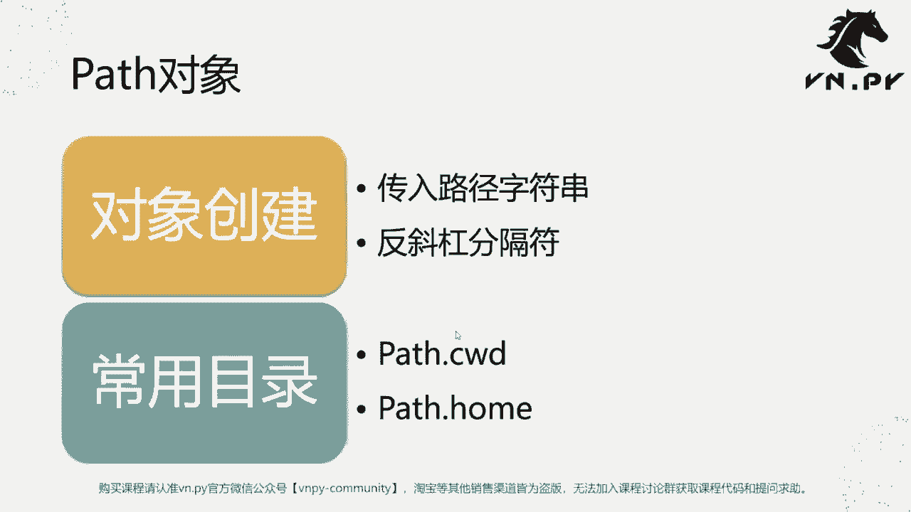
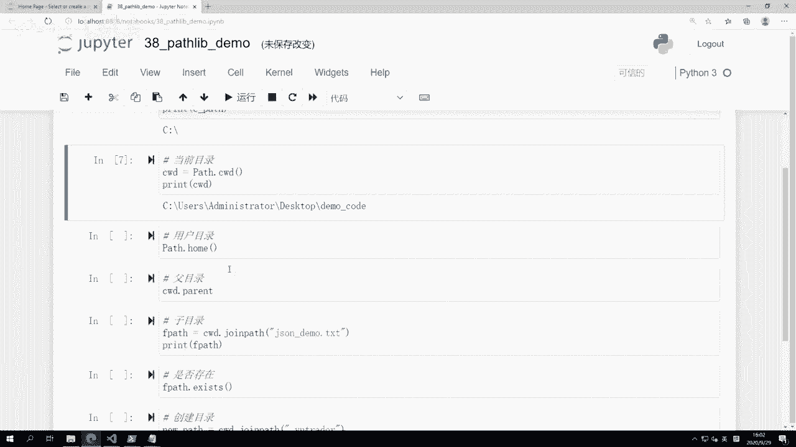
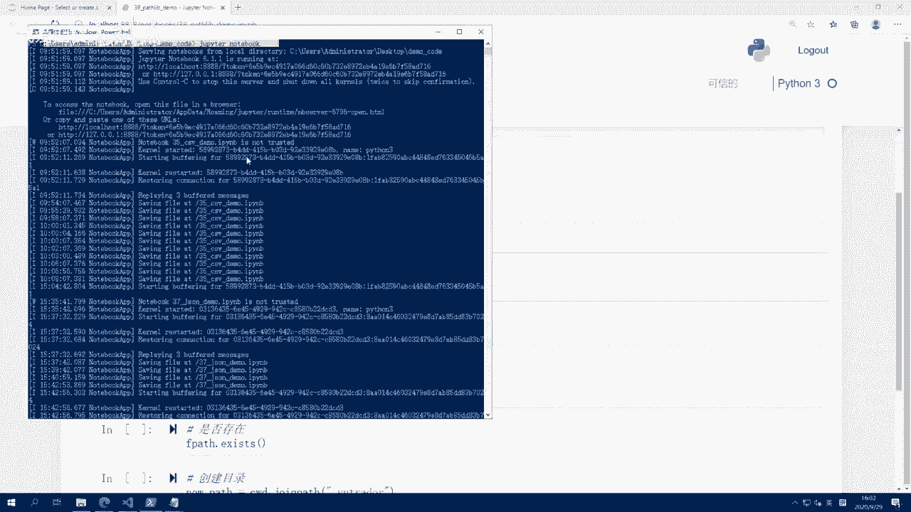
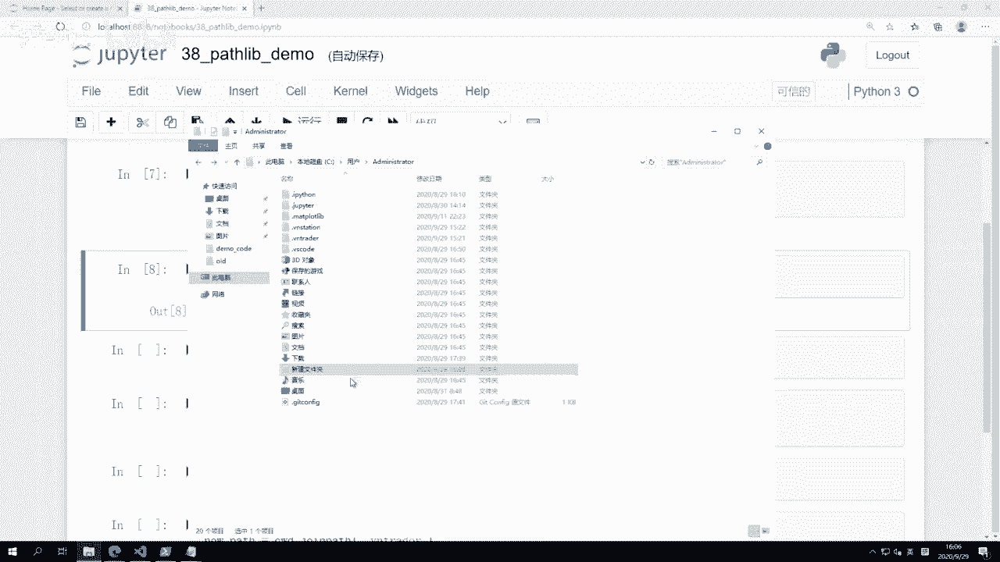
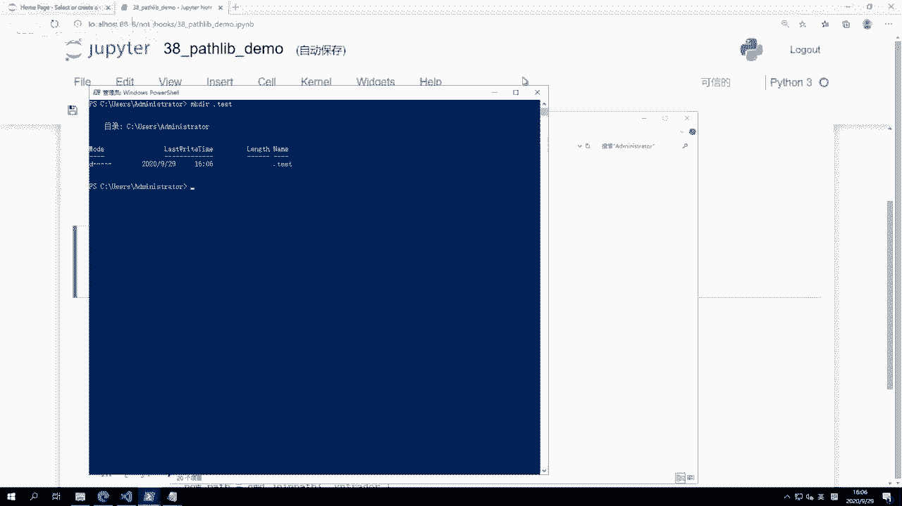
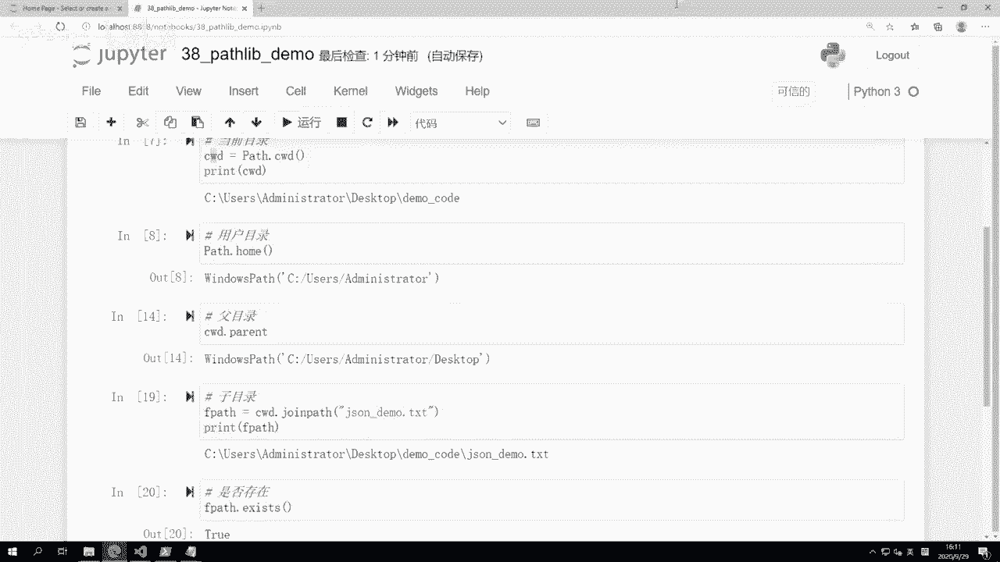

# 38.pathlib模块 - P1 - 我爱期货 - BV1hL2gYiEc6

OK欢迎来到量化交易零基础入门系列，30天解锁Python量化开发课程，那么今天呢是我们的第38节课啊，上节课我们讲了JASON模块啊，以及对应的JASON的数据格式。

那么这节课里面呢我们要来讲一个新的模块，叫做PASSLIP啊，pass这个英文的意思是路径的意思啊，那么路径在我们操作系统里面，其实大家也都比较熟，就是那种文件夹啊，你要跳转到什么地方去的时候。

或者我们在CMD里面有的时候切换目录的时候，每个目录他所在的这个位置啊，就是所谓的我们的这个pass le啊，就是我们的pass哈，然后对它相关的操作，就是我们这个pass lip的功能。

那么接下来呢我们会先来看啊，主要我们要用到的就是一个叫做pass的对象啊，就是这个路径对象啊，他首字母是大写的，然后下面呢我们来看就对象创建，怎么样去创建一个pass对象啊，传入路径的字符串。

那么有的时候要注意反斜杠分隔符的概念，第二个呢是我们常用的目录啊，包括pass点cw，包括这个pass点home，那么我们现在就直接来看我们的这个代码啊。

这节课呢叫38pass step demo啊，首先我们还是先来一个加载，因为我们只要用到啊这个pass这么一个类就行了，正常情况下，pass类别里面其他的类你都用不到的啊，所以我们就直接针对性加载。

只加载它，然后在这里我们可以先在这里创建一个啊，这个路径，怎么创建呢，c pass啊，我创建一个C盘的路径，因为这个最简单嘛，大家都会的C冒号杠啊，这样回车呢，我看会怎么样，他会有个报错。

叫做EOL while scanning string intro啊，这个是Python里面一个非常啊，也是在你操作字符串的时候，非常这个尤其初学者非常容易犯的问题。

就是单斜杠在Python的字符串里面，它是有特殊意思的，它叫做一个转义符，所以你要代表啊，真正就是说比如我们看这个啊，我们在操作系统里面C冒号杠啊，那一般我就这么输入就行了嘛。

但是你如果把这个东西的字符串转到Python里面，是要有两个杠啊，他一个杠呢是转一符啊，这样就可以正常创建了，或者还有个办法啊，在windows系统上这种路径分隔符都是通过这个。

就是如果从我们Python的角度看啊，它都是两个斜杠来表示的，但在LINUX系统里面呢，它是通过反斜杠来表示的，它可能是比如说杠什么root杠home之类的啊写法，那么为了这个兼容啊。

那么在这个pass模块里面也支持，就你直接C冒号杠反斜杠，这样也行，这个创建同样也是我们可以打印一下啊，同样也是这个我们到C盘目标的这么一个目录，你看打出来就是正常的，只不过你创建的时候传进去的钥匙啊。

就这个两个反斜杠啊，这个是就简单的创建pass对象，那么下面一个操作呢，就是非常常见的去获取一下，当前我这个程序是在哪，每个目录下运行的，叫做POS点CWD，那么这里我在获取当前运行目录的时候。

首先你看pass前面这个pass是个类啊，我直接调类的一个方法，所以这个CWD啊，它的英文是current working directory，当前工作目录的缩写啊，首字母缩写。

那么这个方法对于pass来说是一个静态方法，我不需要去创建pass类，我就能来调用它好，那么直接调用我们可以看到当前这个JUPITER，我是在users目录administrator。

desktop demo code啊，这个目录下去启动的，那么再往下的我们可以来看这个。

就是，我等于程序当前就在这个目录里面启动的啊，我可以给大家看一下我这边的这个JUPITER，你可以看到我是切到这个目录之后启动的，Jupiter notebook。

下面一个这个概念呢则是啊，这个叫用户目录的概念，先回车直接看用户目录在哪，位于C盘啊，users administrator什么地方呢，电脑C盘用户administrator在这个地方啊。

你看着这尽管它叫中文嘛，是个用户在你把鼠标移上去之后点一下啊，你可以看到C冒号杠users杠administrator啊，这个是他真实的名字，刚刚那是一个就是windows维的。

我们看着方便的这么一个显示啊，那么这个目录每个当然每每个人自己的电脑啊，你的这个操作系统用户名可能不一样，像我这个是一台啊，阿里云的这个，专门我们为了这个课程去弄的一个，全新的阿里云服务器。

所以它的用户名呢默认就叫admin street管理员啊，如果你用的是额自己的电脑，你可能你的用户名，比如说就是你的名字，比如ABC等等啊，那这个地方可能就对应的ABC。

所以啊在administrator这个目录，就是一般意义上我们讲的比较特殊一点的，操作系统里面，你的用户目录或者在LINUX上，它又叫home目录啊，就这个home的意思啊，这什么意思呢。

就是很多时候操作系统会给不同的用户，设置不同的权限啊，一般管理员可能就是整个操作系统里面啊，不管C盘，D盘windows目录，他想要删什么文件，删什么文件，想要创建什么文件，创建什么文件，但除此以外。

很多时候为了安全起见啊，我们可能平时用的这个用户呢，他权限是有限的，就是他不能去乱操作这些操作系统级别的目录，为了防止被啊这个错误的破坏，所以我们就有了这个常规用户的概念，像如果你是一个常规用户的话。

一般在操作系统里面，你在自己的用户目录下是有完全的操作权限，你在这里可以随便创建东西，随便删东西，随便怎么搞，破坏都行啊，这里破坏的任何东西，不会对操作系统级别造成任何的影响。

其他每一个用户他都会有自己的用户目录啊，所以每个用户自己的用户目录，是和操作系统本身隔离的啊，那这样呢就可以保证单系统啊，多用户的这么一个应用情景了，所以这个是用户目录它存在的意义。

那么正因为他这么方便，所以对于我们VUE派在运行时，甚至绝大部分Python在运行，这就绝大部分Python的程序啊模块在运行的时候，都会把自己的一些啊，这个啊运行过程中的一些要缓存的数值也好啊。

缓存的配置也好哈，都给写到当前目录下一个文件夹里面，我们在这其实可以看到一堆啊，前面有个点开头的，注意这个文件是点开头的啊，点IPAD点JUPITER，点MAD proje，那么这些就是非常常用的。

就Python内部的几个库啊，JUPITER我们知道很熟了嘛，就是这个JUPITERNOBOOK，它也有一些配置文件，这些配置文件就写在这个目录里面啊，下面vs code也有一堆配置文件。

就在这个点vs code目录里面，包括VN点派相关的，我们有VN点VN trader和点VN station两个啊，这个目录都是位于啊这个啊，就当前的用户目录下，那么对于这种点开头的目录。

如果你要手动创建的话，要记住他是没有办法直接右键新建的啊，我们可以试一下，点test投稿，你必须输入文件名啊，这种目录是没有办法在这里新建的。

你只能在这里打开一个power shell窗口，make d i r点test，这个是可以的啊，make d i r是呃。

这个这个我们在啊，windows的这个CMD里面的一个命令啊，它的作用呢就是创建一个目录啊，这个时候你输入什么东西，他都会给你创建出来，你看可以用点来创建好，当然有啊。

这个点可能是唯一一个可用的特殊字符吧，其他有很多字符是不能用的好，我这边手动把它删除掉，回到我们这个代码里面，下面我们要看一些围绕着路径相关的操作啊，我们有了路径之后，有了pass对象之后。

可以围绕它做一些特殊操作，比如第一个最常用的操作，我要去获取它的父目录或者上一层目录，就调用parent啊，退或者获取内部的某个子目录，某个子文件啊，就调用join pass。

然后检查某个文件或者某个目录是否存在啊，有exist函数，最后呢还可以在Python里面直接来创建目录啊，我们可以make dr，那整体啊我们就一个个都看一下，首先啊刚刚这个我们的CWD啊。

这个CWD我已经绑定了对吧，就这个目录啊，就是我的demo code目录，这时候我看一下它的父目录是什么，调用CW点D点parrot，注意这里的parent直接是一个对象，就CWD的一个这个成员啊。

CWD对象下面的成员数据我并没有调用它，括号啊，不要加括号，这个是一个对象，它不是用来给你调用的函数啊，然后你直接调查，我们可以看到他父目录就是哎user desktop，其实对parent啊。

这parent又是一个对象，你还可以再对它来一个parent啊，你可以就连续多层啊，这个就就到C盘users目录很方便，然后子目录怎么样去创建子目录呢，CWD减点join pass啊。

jason demo点TXT，这是上节课我们啊用到的那个啊这个这个，缓存文件啊，我看下还有没有没有啦，没错，我手动创建一个jason demo啊，随便往里面写点数据，123好了，反正也不用解析它啊。

然后这时候呢我们用CW点join pass啊，然后我们把它打印出来，看看长什么样子，我们可以看到它就是诶demo code，下面跟着这个文件的路径，jason demo点TXT。

那这个就有了这个文件路径之后，我们就可以很方便的对它进行操作了，因为有的时候你想打开的一个文件，并不一定位于当前的目录下，它可能位于比如D盘啊，E盘啊什么的，就不位于你当前用户运行时的目录。

如果你想要打开一个文件，那你只传jason demo点TXT的话，此时我们的操作系统只会在当前目录帮你去找，这个文件，找不到它就会报错，刚刚你打不开好，但如果你传一个完整的路径进去，那不管它在哪。

只要这个文件存在的话，就能打开了啊，那这个时候我们可以做一个操作路径，有了我可以先让操作系统帮我看一下哎，这个文件是否存在f pass点exists是否存在，如果是true，就是exist。

反过来我这加个一啊，这个东西它没有，所以就是false啊，这个所以很方便，你可以判断一个东西有没有，那如果对于文件夹来说，有的时候啊我们因为要用到这个文件夹，如果没有的话，那我们可能要创建它这个怎么做。

我们可以调用这个啊，CWD点join pass，那么我们这边用到一个例子，就是在当前目录啊，这个目录我们可以看到没有点VN吹的目录啊，我们就在点VN吹的目录，首先我们cw d一点join pass啊。

print这个new pass，然后呢再print一下这个new pass，点exists啊，看看它存不存在，我们可以看到这个打印出来的结果是false啊，不存在，下面我们做了一个操作。

就叫new pass，点make dr啊，那这个什么意思呢，我们可以看到这里诶，就跟刚刚我在CMD里面直接midi r的效果一样，也已经创建了一个对应的目录出来，所以这个有了pass live之后。

我们就可以很方便的在Python里面调用诶，就不管是CMD也好，还是我可能直接在这个啊，资源管理器里面去新建文件夹，新建文件等等相关的操作啊，我都可以很方便的通过pass lip来实现。

那有了上节课我们讲的JASON。

有了这节课我们讲的PARSLEEP之后呢。

那下面我们就可以很方便的去管理，我们在运行Python程序时候啊，我可能要把一些文件写到一个固定的目录里面，去保存后面我程序不管在哪启动的时候，我都去那个目录里面去，把一些我想要缓存的结果给读出来啊。

那么这块的功能呢我们将在下一节课里面讲，结合上JASON，结合上path sleep之后，我们可以看他怎么可以实现一个非常方便，非常易用的这种啊，文件配置，还有这个缓存数据的这么一个读写功能。

好OK那么这节课的内容呢就到这，更多精华内容，还是请扫码关注我们的社区公众号。