# 39. vnpy配置存储 - P1 - 我爱期货 - BV1gL2gYiEYp

OK欢迎来到量化交易零基础入门系列，30天解锁Python量化开发课程，那么今天呢是我们的第39节课了，之前我们花了两节课的时间，分别学习了用来做序列化的JSON模块。

以及用来做路径管理的past lib模块，那么在这节课里面呢，我们要来看一看怎么把两者结合起来，来实现VN点派内部的配置存储功能，那首先我们的VN trader啊，也就是前面几节课我们已经看过的。

在启动VN station之后，你加载好你要用的交易接口，要用的上层应用之后啊，启动的那个量化交易平台，那么van trader它的两个相关目录，或者说比较关键的两个目录，第一个呢叫做运行时目录。

那么这个目录VN trader会自动去扫描，并且加载其中的策略代码，以及其他你要用到的一些啊，相关的你自己开发的代码文件，另外一个目录呢则是和他其相关的，叫临时文件目录。

我们VT的会通过这个临时文件目录，来读取和保存系统内的配置啊，以及有的时候你可能要缓存一些，运行状态的数据等等，都是在临时文件目录里面实现的，那么这两个目录是怎么确定的。

或者说他们两个在你启动VN trader的时候，是怎么样定下来的，就涉及到我们这章叫做确定运行时目录，的这么一个逻辑，首先怎么确定核心，通过一个叫做点VN trader的文件夹啊，也是我们上节课里面。

已经试着通过MCDRR去创建过的，那么如果当前目录下啊，就你启动那个van trader的目录下，有这么一个点van trader的文件夹，那么就会直接使用当前目录来作为，我们的运行时目录。

如果没有的话，那就会使用home目录来使，这个home目录我们上节课讲过了，就是所谓操作系统上，属于当前这个用户的用户目录啊，我们会用它来作为。

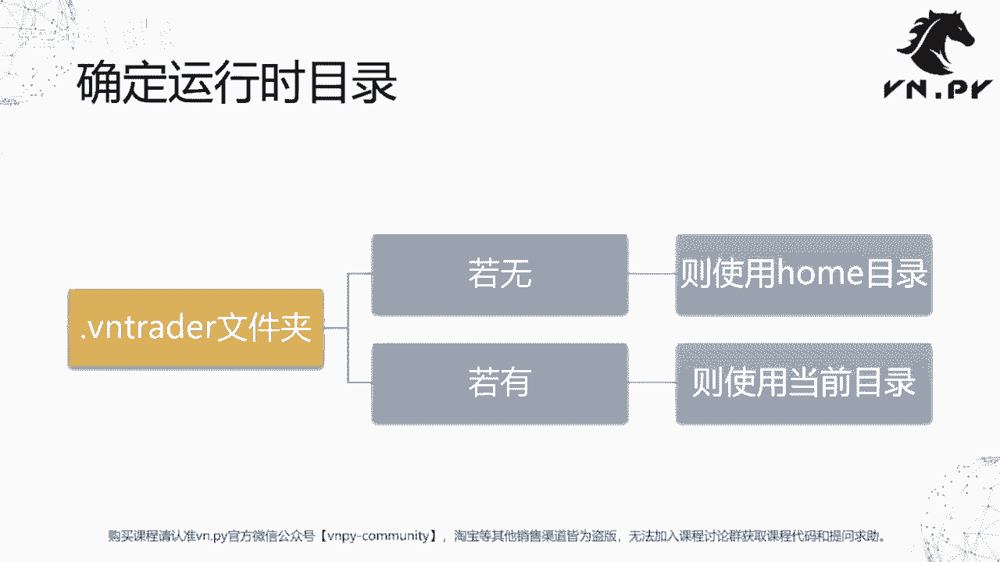

我们van trader的默认运行时目录，那么接下来呢我们就来看一下哈。

这个代码层面，这里我已经打开了编点派的源代码，然后点开trader找到启动中的utility点P，那么这个utility点派里面呢，保存了或者放了所有我们VN点派内部，围绕着这个通用管理功能相关的函数。

以及相关的一些类，那么和我们路径相关的，主要就是这个get trader dir这么一个函数，我们先不看它的逻辑，往下翻啊，往下翻，我们看到有两个纯大写的这么两个变量，一个叫trader d i r。

一个叫temp d i r，那么这两者就是我们刚刚提到的，一个是我们的运行时目录，一个呢是我们用来保存临时文件的，这个临时目录，好trader tr是运行时目录，tempt r r是这个临时文件的目录。

那么他们两个是通过get trader dii r这个函数，就上面这个函数，然后我们传入了我们要去查询的这个文件夹，的名字叫做点van trader来去搜索出来的，那么搜索的规则是什么呢。

我们就看到这个函数内部的实现啊，首先第一步我会用pass这个啊，类下面的CWD函数来检查，当前我启动VN ta这个主目录在哪啊，如果这个主目录里面，下面我们来看啊。

就是这个CWJ先获得这个当前运行时目录，然后这个主目录啊，我们会用join pass加上这个taname tm name，是刚刚我们从上面传递的参数，也就是这个点VN追的。

我们会找到就是这个所谓临时文件的路径，先把它创建出来，然后我们来检查这个临时文件路径是否存在，如果临时文件路径存在的话，那么我们就直接return这个，一个是CWD。

就当前的运行时目录以及对应的这个ten pass，就是我们的啊这个临时目录啊，我们就相当于使用你启动VN trader的，这个目录来作为我们van trader的运行时目录，如果找到了啊，就这么做。

如果没找到怎么办呢，我们会另外有一个操作，就是home pass，我们先后会取这个你当前登录的操作系统啊，用户名，它的用户目录我们会把它取出来，然后我们会用这个你的用户目录在join pass啊。

在下面去找到这个TE呃name的这个啊，就点VN trader的文件夹，如果这个时候我们看到ten pass是不存在的话，那我们会主动的去创建它啊，ten pass点midi r。

然后return home pass和ten pass，所以在这个情景下使用的运行时目录，就是我们的用户目录了，然后在这里大家还可以看到这个trader dr，被创建出来之后。

后面还有个操作叫cs点pass，点IPAD啊，String treat d r r，那么这个操作的目的呢，就是为了把我们这个所谓的运行时目录，添加到啊当前启动的这个Python解释器，它的环境变量里去。

那后面呢我们就可以加载这个目录里面对应的，我们自己开发的一些策略代码了，那这个功能啊说起来额这个其实代码很短，就在大概20行不到的样子，但说起来有点绕，怎么去看呢，我们在这里啊。

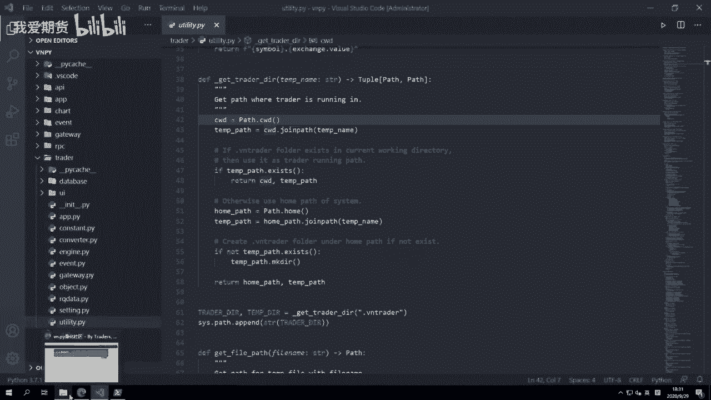

就随便先在桌面上，我们到桌面上来，然后找到VN station，登录啊。

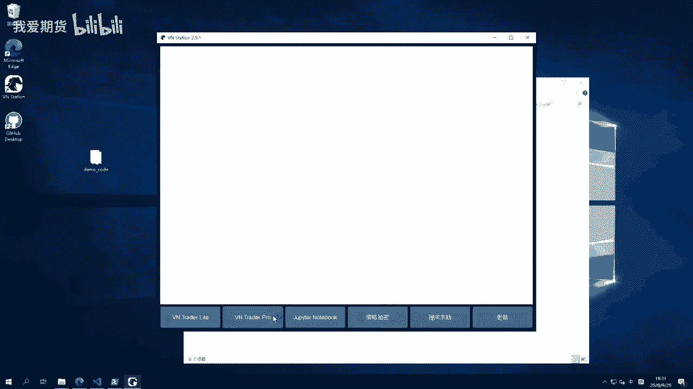

我们就先来启动这个VN trader pro啊，VN吹的pro呢，就是我们刚刚讲到VN吹的这么一个啊，这个整体化量化平台，那我们可以看到启动之后，顶部那边trader2。1。5，这是它的版本号。

然后对应有一个C冒号杠，Users gun administrator，那么在这个方括号里面的，就是当前这个VN trader，我们的进程所启动的时候，用到的这么一个目录啊。

所以这个时候我们的启动目录就在这里。

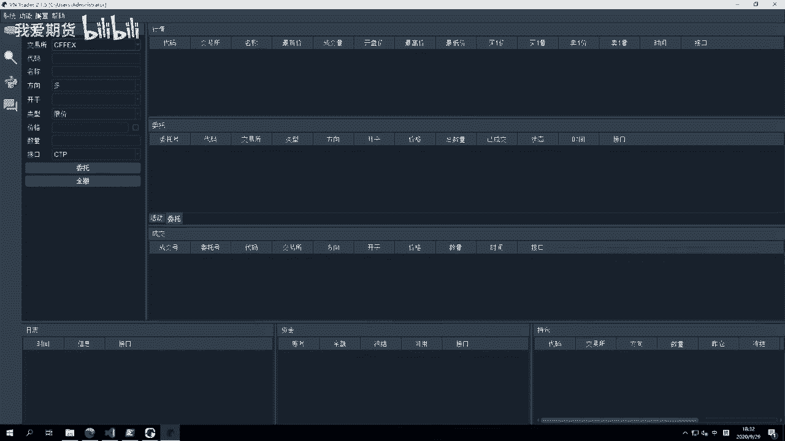

反过来，如果我们在啊找一个别的文件夹，那么我们可能随便找一个C盘好，我创建一个test文件夹，然后呢这个时候啊，我们现在我想用test文件夹，作为我们的主启动文件夹啊，就用test作为我们的运行时目录。

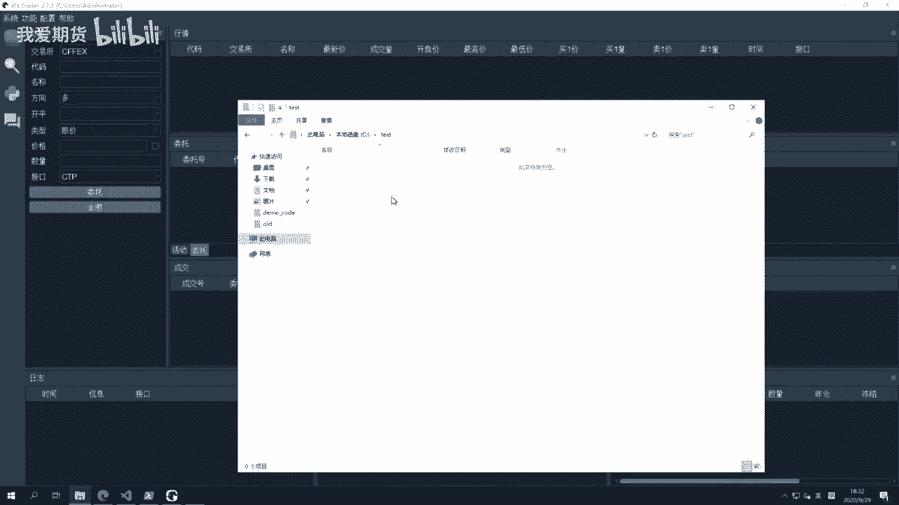

而不用我们的用户目录了，那我要实现这点要怎么做呢，先去啊这个编点pad github官网，找到其中有个examples啊，就这个使用案例，然后VN trader，其中有一个叫run掉派这个文件啊。

这个文件的作用是直接在命令行呃，也不是命令行啊，直接以脚本的方式来启动我们的van点派，而不要通过那个图形界面了啊，所以我把其中代码先复制好，然后在这里创建一个新的文件，就起起名叫做main啊。

这这当然面可能不太好，run掉拍好了。

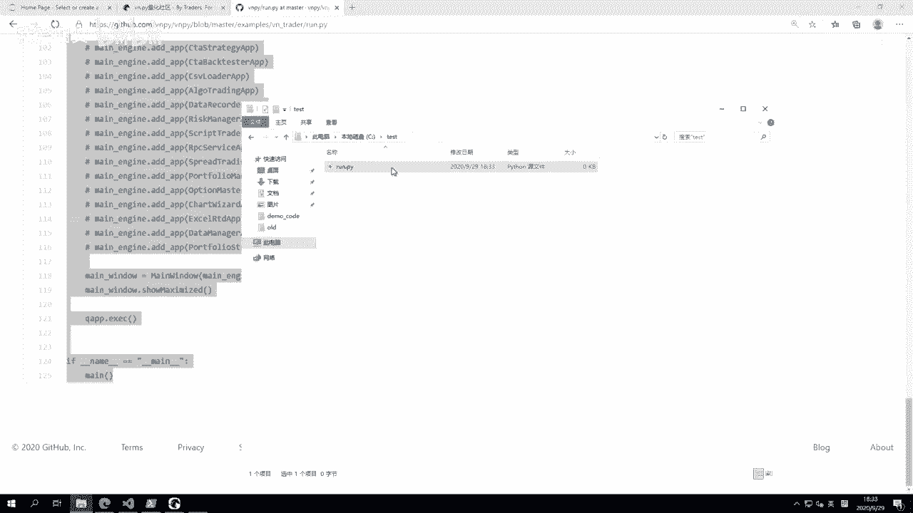

右键打开之后把我们的代码复制进去啊，当然这个里面有很多不相干的内容，我们就把它尽可能都给去掉，只保留最简单的就是和CCTP相关的啊，这个接口的代码就行了，其他所有应用模块等等，我们都把它给去掉啊。

因为和我们今天的这个演示没关系，好这样删除完了之后呢，就是一个最简单的这个啊启动脚本了，那么在这个时候啊，如果，我们先把这个用VN station启动VN trader给关掉。

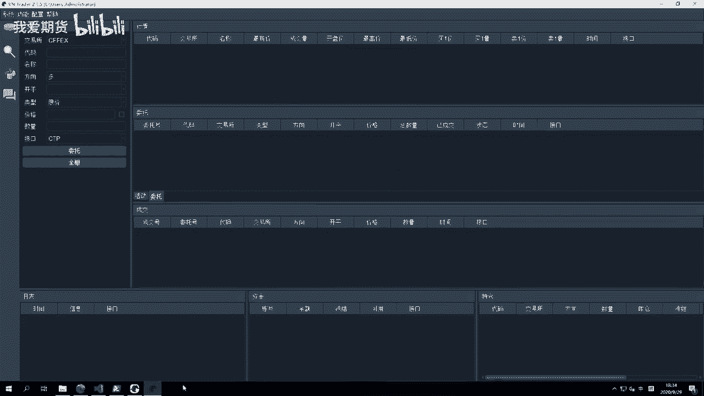

我们把边station也给退出掉，然后呢进入到当前这个test目录啊，我们第一步先在这里右键在此处打开power shell窗口。

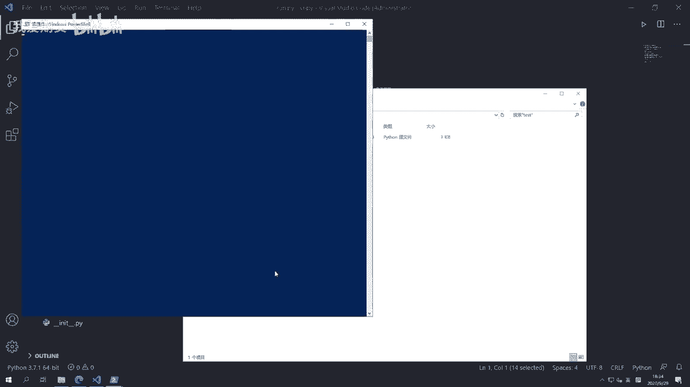

然后输入Python run点派，我们来启动一下，那么此时你可以看到用户目录还是我们呃，运行时目录还是我们操作系统，用户目录位于C盘的users目录下的MINISTRATOR啊。

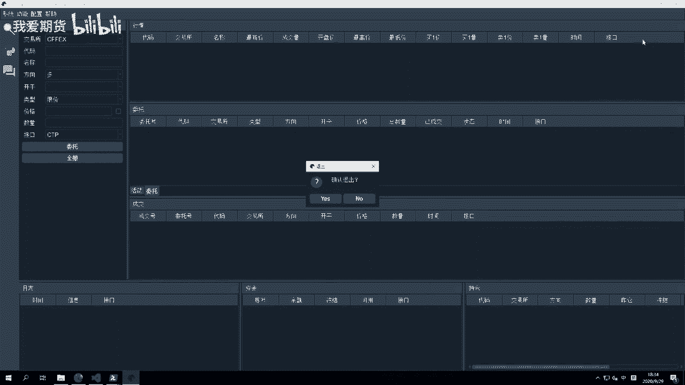

然后这个时候呢我们退出来做一个额外的操作，叫make dir r点VN trader啊，创建这个点VN trader文件夹，那么此时我们可以看到他这里已经有了啊。

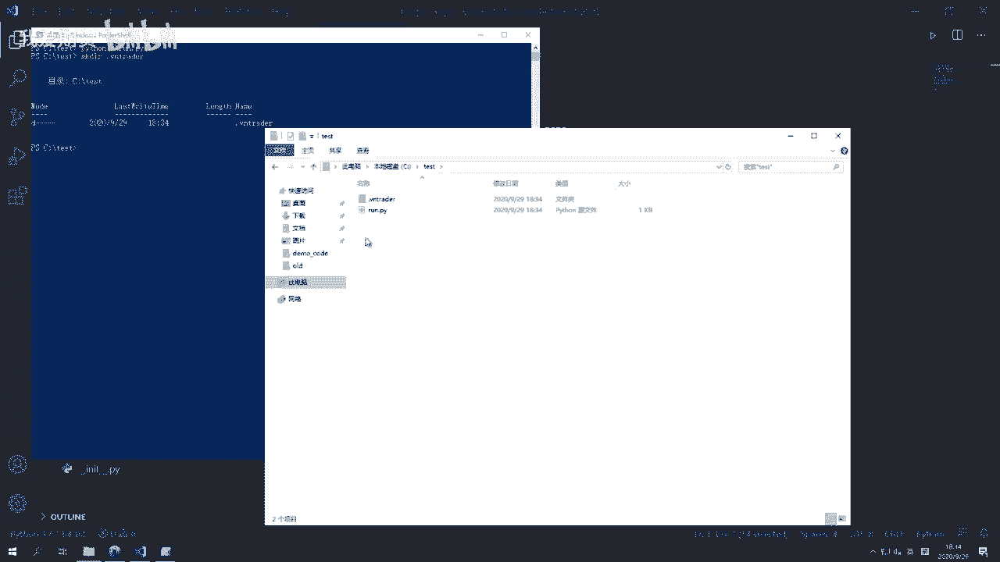

我们再次来运行run点派，那么这次运行的时候，我们就可以看到他用的目录，就不再是我们之前的VN trader的呃，呃我们的那个用户目录，而变成我们自己在这里创建的这么一个test目录。

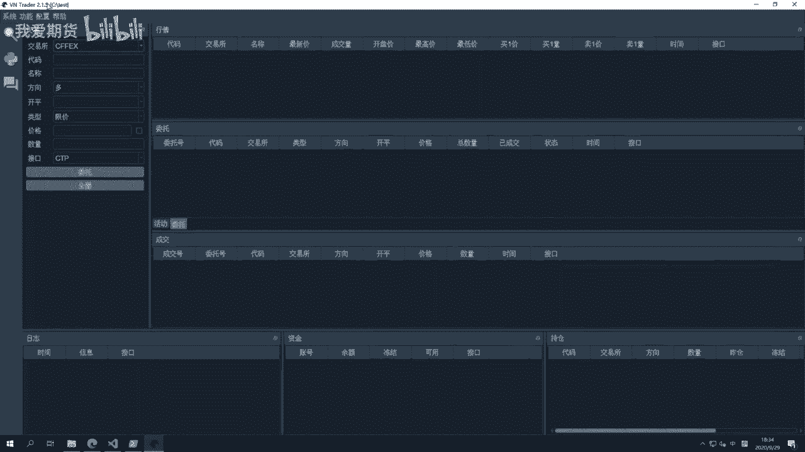

那通过这个方式呢，通过test和解这个脚本的方式，比如说我再复制一个啊，直接来个test1。

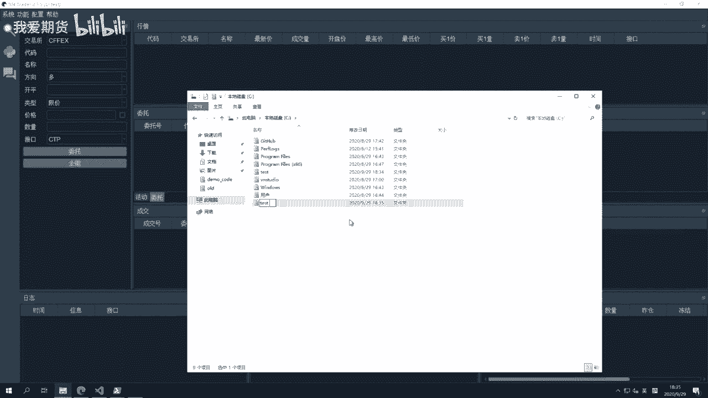

再在这里打开一个窗口，然后Python ru点拍，你就可以很方便的在一台机器上同时运个，运行多个VN trader啊，而不用受限于VN station，你可能只能启动一个啊，那个呢是相对比较简单。

比较傻瓜的情况。

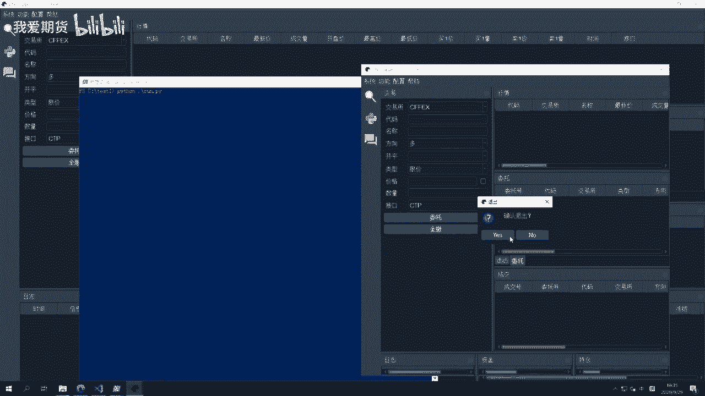

那额有了我们的运行时目录。

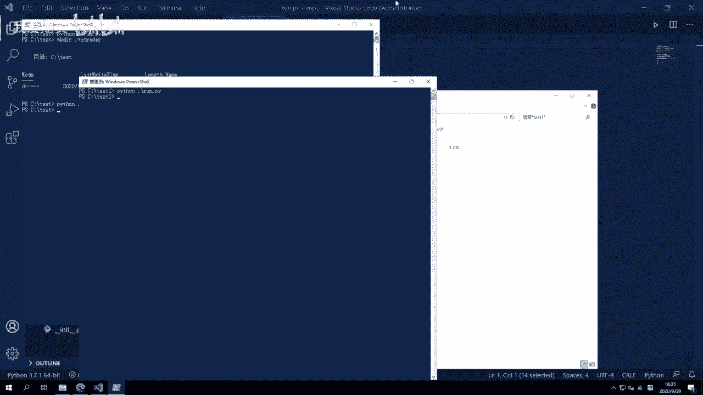

有了我们的临时变量目录之后，我们就可以去围绕它们，去提供一些和我们路径相关的函数啊，比如说我们这边的四个，第一个功能叫做获取目录的路径，有的时候呢我可能想要去打开某个文件啊，去读取一些其中信息。

或者去写入一些内容，这个时候这个文件，我是希望把它放在我的临时那个，文件目录里面的啊，因为这个是我用来保存VN点派内部，运行过程中所有文件的，所以我可能诶这个是用来获取。

就是VN点派内部一个文件的这个目录路径，第二个功能呢啊这写反了啊。

这里是获取文件路径，这个功能是叫做获取目录路径啊，我把它稍微改一下。

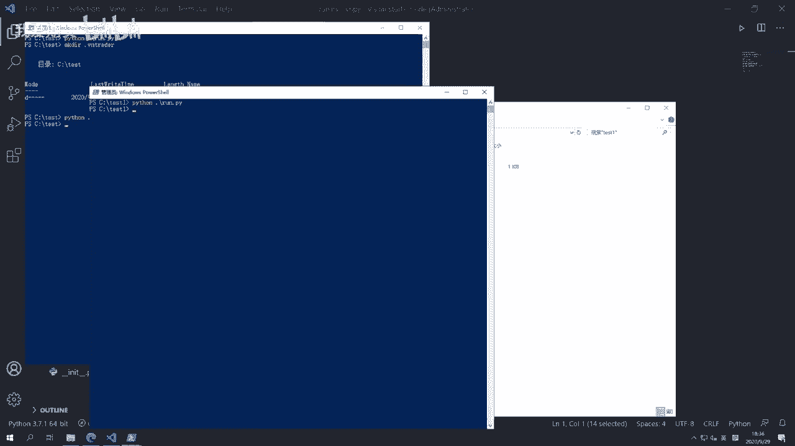

那么这里呢获取目录路径，这个对应的函数是get folder pass啊，然后他还有个额外作用，就是如果这个目录当前不存在的话。

它会自动啊，这个啊若无则这个自动去创建诶，这刚刚也打错了，创建。

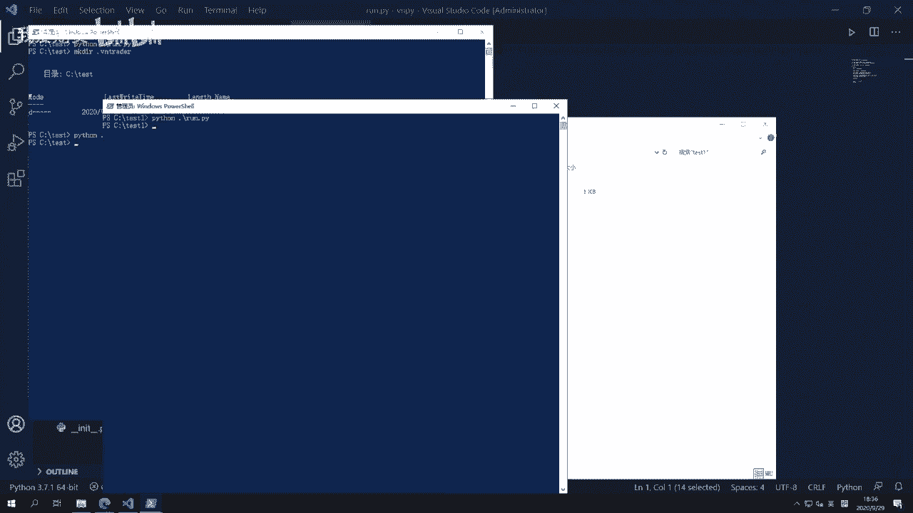

好然后还有一个叫get ui pass，它的作用是获取图标的路径，因为在我们那个编曲的界面里面，有很多这样那样的图标啊，它是用来获取图标路径的，最后还有一个直接围绕着JASON，文件操作的两个函数。

一个叫save jason，一个叫load jason，好。

那么接下来呢我们就到代码里面去，分别看一看他们，同样utility的派啊，紧接着就在trade di r，这两个生成下面的四个函数啊，就是那第一个get fire pass，去搜索一个临时文件的路径啊。

他的逻辑是什么呢，就直接return tedi r，点join pass file name就行了，非常方便，因为TEDR我们已经知道，它是我们的保存临时文件的目录，然后用它加上后面的这个文件名的部分。

得到的就是这个临时文件所要存放的目录的，这个完整的这么一个路径啊，非常方便就可以实现出来，同理下面的get photo pass找到某个文件夹的路径啊，也一样。

photo pass很容易也是一个jin pass就可以得出来了，然后这个时候因为是一个文件夹，后面我我们围绕这个文件夹做任何操作的时候，比如往其中去放一个文件，或者去读。

尝试去扫描这个文件夹里面内容的时候，如果这个文件夹不存在的话，就会报错啊，所以既然有这么一个情况，既然我已经尝试去获取这个目录的路径了，如果它不存在，我自然就应该自己去创建一个，所以我们这里有一个判断。

就if not for the past点exists，如果不存在的话，我就调用for the past点make dr r，把这个路径给创建出来，然后呢我们return for the past啊。

这也是一个非常方便的操作，get icon pass就是查找图标的路径，那么icon pass呢一般是属于应用模块的这个I呃，这个这个所谓的图标啊，他的逻辑会比较特殊一点。

那么一般是要通过啊这个fire pass的PAPARENT，去找到诶当前UI所位于的整个路径，然后在其中呢通过ui pass点join pass啊，找到下面所属的这个icon啊，在哪里啊。

这个操作会比较特殊一点，就一般情况下呢大家也不需要用到它，所以我们就啊不去细究啊，然后往下两个比较关键的load JSON和save JSON，分别是保存JSON文件和加载JSON文件里面的数据啊。

我们先来看save js，先来看怎么写，这个函数一共有两个参数，第一个是你要写入数据的那个文件名，就file name，第二个是这个你要写进去的这么一个数据，字典啊，就data and。

我们可以看到它是一个dict类型，那在这里我们操作呢，首先找到这么一个文件的路径，file pass等于get file pass，File name，就上面的get file pass这么一个函数。

然后我们就用with语句来打开它啊，打开的时候我们的模式叫W加，这个模式呢是往里面写入数据，同时如果有其他需求的话，也能满足，然后编码格式啊，因为有可能我们要写中文，所以我们要用UTF8。

这么一个支持中文编码的格式，这样打开完作为一个F的售后呢，我们就直接调用JSON库的dump操作，dump操作，这里第一个是这个你要写进去的，这个数据的字典data，第二个是F，然后是INDE缩进多少。

最后还有个叫做INSUAIC啊，这个的意思就是我们如果啊不传的话，它默认为true，那此时呢你是不能往里面写，就是在这个26个英文字母和嗯，常规的这种阿拉伯数字，以及家庭成熟。

一些常规的英文符号以外的内容的，我们知道中文的，它的字符集是属于我们中国的这么一个字符集，那啊正因为还这个AIC，字符集是不只包含英语部分的啊，所以我们不能用ICEC字符集。

否则的话就会导致于哎我们写进去，中文变成乱码啊，所以这里要额外传一个参数叫INTRACEC等于false，那这样呢就可以很方便的把我们啊，你随便传一个file name，随便一个数据的名称。

然后呢对应的把字典哎，就可以很方便的把字典里的数据给写进去了，然后再往上还有一个叫load jason的啊，这么一个函数，那这个函数的作用呢，其实也就正好跟save jason反过来啊。

你传一个文件名进来，你只要传名字就好了，你不用传路径，我会自动去上面的规则去帮你找那个点，van trader对应的临时文呃，临时目录的路径，然后此时我们同样get fire pass。

来找到这个文件的路径，如果这个fire pass是存在的话，那我们就用只读模式来打开，同样我们用UTUTF编码来打开，然后呢，用JASON库的load函数把其中的数据给加载出来。

同时呢进行一个return就返回数据，反过来如果它不存在的话，我们会去调用SAIJASON函数去创建这个文件，同时往里面写一个空的字典啊，然后我们也会返回空字点，之所以要做这么一步操作。

主要的原因就是你要去加载这个JSON文件的时候，一般呢就是上层有什么应用模块，要去访问这个JSON文件了，即使这一次我读不到数据，后面我也是要往里面写新的东西的，所以为了统一，为了后面用起来方便。

我就索性先把这个空的JSON文件给创建出来啊，里面数据是空的吗，是只是一个空字典而已，没关系，我们就先把它给创建出来，同时因为在这里它本身是不存在的，我们其实没有其他的数据可以返回。

所以呢我们就选择去return一个空的字典啊，return一个空的目录去哎这个给上层模块，他就知道哦，现在没有任何的啊，这个已经保存的数据或者已经保存的配置，那我可能呢就直接哎。

根据我自己的这个当前的需求去初始化就好了，OK啊，那么这集呢我们花了额这么快20分钟的样子，就把VOR派内部怎么样，用JASON和pass step这两个非常基本的模块。

实现了一个完整的运行时目录的管理功能啊，就就这么多代码，差不多100多行啊，其实你自己看的话，那可能会稍微有点懵，不知道他是干嘛的，但这样讲一讲呢，可能会对啊理解这两个模块的用途啊，会有更深的理解。

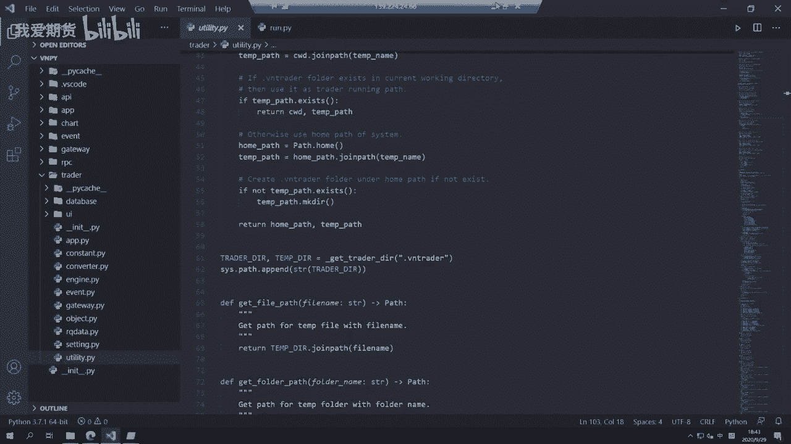

OK啊，那么我们这节课的内容呢就先到这里，然后更多精华内容，还是请扫码关注我们的社区公众号。