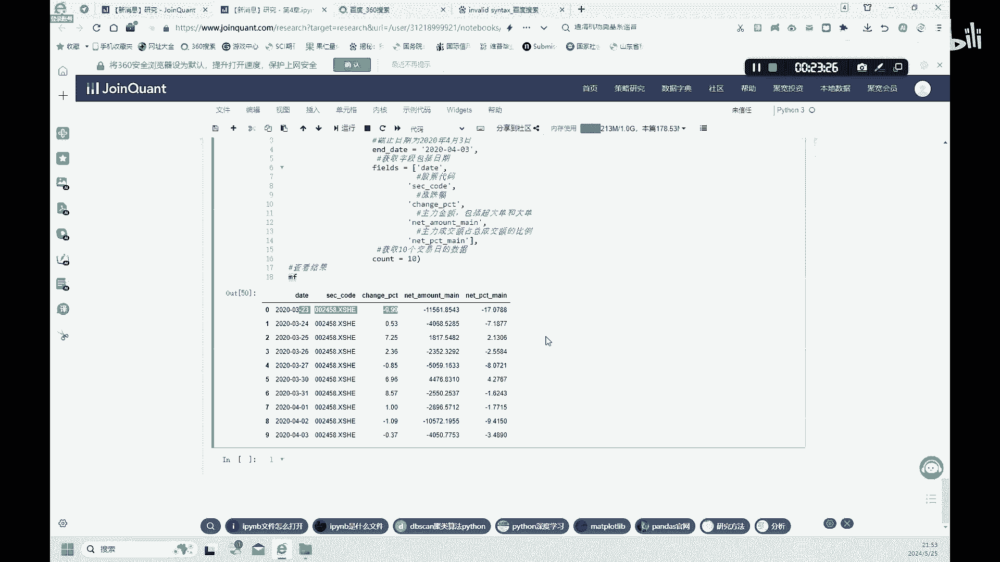

# 4.【金融科技】聚宽交易平台使用方法 - P1 - 隋UP主 - BV14usaeWEgM

我们都知道市面上的量化交易平台非常多，像我们这节课会选用的巨宽嗯，还有一些米矿啊，big矿等等的一些交易平台啊，这些都是一些编程类的，这个叫交易平台，主要代码呢就可以用Python来做。

还有一些像非编程的这种量化交易平台，像果仁网啊，在我的一些视频里面也给大家介绍了，怎么样用果仁网来做一些量化交易，好我们这节课呢首先来介绍一下这种距宽，有了距宽这种基础之后呢。

大家在做其他的这种编程的交易平台的时候啊，都会得心应手，我们首先来注册一个巨宽的这种平台好吧，然后注册完之后呢，我们这里到这种策略研究里面，策略研究里面有这种研究环境啊，到了研究环境之后呢。

我们呢就和我们啊之前用的这个Python的这个notebook，是非常的类似的一个界面，这里呢我们也可以来上传一些东西，上传了之后呢，我们就可以来使用像我们这节课呢使用的教材。

就是这个深入浅出Python量化交易实战，这里呢第四章呢就是我们这一章所学的内容，就是介绍这个巨宽的量化交易平台，之后的课程呢，大家可以再继续上传一下我们的这个课件，第四章第五章啊。

往后这些章节都可以上传，然后我们可以在这里面进行一个操作，好我们点开第四章，好大家可以看一下，这就是我们第四章的种代码，好我们看一下代码，首先呢是导入pandas s p d。

这个呢和我们之前都是一样的，导入这个pandas库，然后呢大家可以看一下，我们下面呢就可以来，直接用这个距宽的那种平台来获取数据，他获取数据的啊，这个函数呢和我们之前的to share是不太一样。

但是大家知道每一个平台呢，它可能这种获取数据的这种啊，基础的这种函数可能有变化，但是意思都是一样的，好吧，我们呢生成一个新的数据DF啊，data frame这种格式的数据。

然后使用函数get price，Get price，就是，这个距宽里面获取数据的这个函数，然后呢获取什么函数呢，获取601318，这个平安的这支股票只获取一只股票，然后呢这后面的后缀也是不一样的。

S这个XSHG，这个呢是上海证券交易所的这个简称啊，当然呢深证交易所的用XSHE这个来表示，这个深圳交易所，这个和这个图STL数据库也是不一样的啊，这个这个to share里面只用SH和SZ来表。

分别表示上海和深圳好，这里呢再有这种start date就是开始日期截止日期啊，这个我们选取的这个数据的起止时间，可以可以设置一下，然后frequency呀，我们可以是daily呀。

quarterly啊，啊weekly啊，monthly啊是吧，不同的这种呃这种frequency啊都是可以的，好我们看一下，首先来检查一下这个数据，DF这个数据的前几行啊，大家可以看一下。

这里就会生成这种open收开盘价，收盘价最高价最低价啊，成交量，还有这个money，就是这种交易额啊，这种数量好，这个money这个东西在这个to share之前呢，我们啊不是用这个词啊。

但是这里大家知道啊，这这有这样的一个东西，好我们继续来看第二个函数获取股票的概况，我们使用的是这种另一个函数啊，Get security in inform information，好。

这个information这个数据呢是获取的什么数据啊，是这个平安的这支股票的相关信息啊，然后我们打印出来，这个只提取打印出来这些信息啊，股票的中文名是吧，中国平安，然后股票的简称是啊，Z g p a。

然后他的上市日期和退市日期啊，这里啊这里啊退市日期啊，这只是一个假定的一个值吧，然后产品的类型啊，这里产品的类型这里是stock，然后产品的这个母基金啊，这里显示的是none，没有啊，好这种产品的类型。

这个type嗯，这里有股票，还有ETF基金呐，还有指数基金呐，啊指数都有啊，不同的啊，就是到时候呢你可以来搜索不同的这种啊，大家都知道这种stock就是股票就好了，好我们还可以利用利用另外的一个函数。

Get all all securities，去获得全部的一个证券信息啊，全部的in information or全部的信息是什么，大家可以看是吧，这里就会显示所有的好这个上证指数的股票啊。

001002004005006是吧，这些呢都可以都列在这，他的起止时间，他的这种type都都可以显示出来，当然呢我们呢也可以就是来怎么说呢，去提取一些特定的类型的啊，这种。

这种securities这种这个证券是吧，Get all securities，我们指定types啊，是ETF，不是这个stock，大家可以看一下，我们提取之来提取出来的，所有的这这些证券呢都是ETF。

我们不要stock，也不要啊，这个index是吧，好，好获取完股票数据之后呢，我们还可以来获取财务数据，好获取财务数据呢，我们会用到一个函数啊，Get fundamentals。

这个fundamental啊，就是啊基本面的这种数据就是财务数据，好，我们看一下它是如何获得这个新的，这种财务数据的，首先呢我们定义一个Q呢，是这个Q呢就等于一个获取平台valuation中啊。

代码为601318这种平安的这支股票啊，我们从这个valuation平台中，variation这个数据库数中呢提取这一个数据，就把它命名为Q，然后呢，这支股票有了之后呢，我们的这个把这个这个Q对象。

传入到get ental函数是吧，并取得2020年4月1号的一个数据，我们新生成的这个DF数据呢等于get fundamentals，就是获取这个Q是吧，这个Q这个平安这支股票，这个Q的2020年到啊。

2020年4月1号愚人节这天的这种数据啊，然后我们查看一下DF，大家可以看一下，我们可以看到他的这种股票代码，还有它的一些这种财务数据，包括一些PEE啊啊，还有一些这个换手率啊，turn over啊。

PB啊，市净率啊，PS市销率啊等等啊，这些财务数据，我们获取到从valuation这个平台中呢是吧，他的这个从这个估值，估值的这个系列中获取这个fundamental啊。

这些fundamental数据是吧，好当然呢，你也可以从这个其他的这个这个，这不是从valuation的，可以可以从这种financial statement里面是吧，从这个资产负债表啊。

什么什么现金流量表啊等等，再获取其他的这种财务数据啊，这个是从valuation这个股票估值，估值这个比率，这个系统里面找出了这些fundamentals，好我们再往下看，我们继续来看一个更具体的案例。

通过这种财务指标啊进行选股啊，这个呢我们在其他的这种财务估值的课上，我已经给大家讲过啊，但是和这种平台的这种代码不太一样啊，大家呢呃也学习一下这个巨宽的平台上，怎么样来获用这种财务数据来进行选股啊。

好首先呢我们还是定义一个Q啊，这个Q是什么呢，这个Q呢就是它包括了这种valuation啊，这个库中的这种股票的代码啊，variation中的这种p e ratio，P c f ratio。

还有turn over ratio这三个ratio是吧，动态的市盈率，市现率，还有这换手率这三个啊，有了这三个之后呢，我们对这三个条件进行啊一个过滤，进行一个筛选设置筛选，对这三个条件进行这个设置。

筛选条件好，我们可以看一下，第一个筛选条件就是这个PE它小于20，但是大于零啊，这是第一个筛选条件，第二个筛选条件是市现率，这个PCF呢它是大于零，小于20啊，然后这个换手率呢是大于四。

好这是我们筛选条件，筛选完了以后在干嘛，在排序，我们排序按照什么排序呢，是按照这个换手率啊，这个降序来进行排序，从大到小进行一个排序啊，好然后这些做完了之后，我们就定义了一个Q是吧。

然后呢我们新生成一个portfolio，一个资产组合，它等于一个get fundamentals，然后Q啊，这些筛选条件就是这个Q，我们设定好了这个筛选条件Q，然后我们呢再设计一个时间啊，4月3号。

2020年4月3号好，我们根据啊，我们现在呢就可以啊，提取出这个PFOO它里面的这些信息了是吧，这个portfolio里面就包括了这些信息，这些信息是吧，包括了这三个这个财务的比率啊。

同时呢大家可以看一下，我们呢是按这个turn over的一个降序排列，大家可以看一下是不是，然后大家可以看一下这个PE和pcf ratio，是不是都在满足这个区间是吧，就是都是我们挑选出来的。

这些这些股票呢都是满，同时满足了这些筛选条件和，这个排序的条件是吧，这就是我们筛选出来，最终筛选出来的这个股票啊，好总结一下，我们刚才用这三个财务指标啊，来选出的这些股票是吧。

这三只这三个比率选出来的这种股票呢，它的市盈率还有市现率呢，市盈率还是市现率，相对来说呢都是比较合适的啊，然后呢我们呢也选取了这个换手率啊，大于四的这支股票，也就是说到股票交易呢比较活跃的这些。

我们选出了交易比较活跃的这些股票啊，好这这三个指标呢啊可能是有效的选股策略啊，但是也不一定是吧，我们可以看一下这种换手率它比较高呢，说明什么，这种交易呢是比较活跃的，但是呢交易活跃不代表股价一定会涨啊。

就是有的时候呢会出现一种情况，就是大股东啊再减持套利啊，这时候呢也会变得比较活跃，这种股市呢大股东呢在那捣乱是吧，大股东出货是吧，这种情况下股票呢其实也很活跃，但是呢它可能会跌啊。

所以说呢我们呢就进一步啊，用下面的这种例子来检视，看一下这种谁是幕后的大佬，谁这谁在这里就是主力啊，谁在这里出货或者是买货是吧，看一下主力的一个走势情况，好我们这里呢就是导入一个从这个距宽呐。

导入了一个finance这个这个库啊，啊这个库啊啊就是来获取啊，这个前十大股东的这个数据，用这个用从finance这个数据库里面是吧，用到了一个函数啊。

这个stock shareholder top ten，这个前十大股东的这样的数据啊，形成一个Q这个数据我们可以看一下呃，这个前十大啊，这种股东，我们可以看一下他的这个他的这种代码呀。

前十大股东的这种排行榜啊，前十大股东的名字啊是吧，前十大啊股东的一些股东的类型啊，class就是他的类型啊，还有前十大股东的持股比例啊，在这里啊，share ratios啊，好我们呢这里也过滤一下。

我们过滤呢是只选取一只股票哦，我们就一支股票，刚才选取了这么多只股票，第一支呢就是002458是吧，我们呢就首先呢看一下这支股票，它的这个大股东的情况，然后呢我们就可以啊。

就是shareholders去去跑这个这个获取，这个shareholder这个数据，用这个这个命令finance点啊，run啊，curry这个获取啊这个Q里面的这种信息好。

我们得到了这个shareholders好，大家可以看一下这所有的，这他是列出了不止前十啊，他把这个所有的这种股东都能列出来啊是吧，股东的姓名啊，股东的啊这个类型啊，他的这种持股比例啊，大家可以看一下。

姓曹草鸡生了啊，他41 41%的这种股份啊，都列出来了，好这里呢我们找出了大股东是谁，然后呢我们再继续来看，到底呢这些股东里面哪些人，这些股东呢在减持，哪些股东呢在增持，正常的来说呢。

如果大股东增持股票，说明什么，他对这种股票是比较有信心的，这种股票呢有可能就会涨啊，但是呢如果有大股东呢在急着出手这支股票啊，可能他是他急缺急急急着缺钱了用了，但是也有可能呢他只判断呢他是大股东嘛。

他可以判断这个股票可能最近有一些风险，所以他可能会卖掉这种股票，我们按照这种逻辑呢，我们呢来继续来做一下啊，然后我们看一下我们用到的这个stock，shareholders change这个函数。

用这个函数获取它的code哦，还有获取什么他的一个上市的，就是他的一个公开的一个日期，还有他的股东的这种姓名，还有他的一个变动的类型，就是这个type呢很重要，就是它的增持了还是减持了，如果是增持的话。

我们用一来表示，如果是减持的话，我们用零来表示，然后在，在change numbers这个增浅池的这种数量减持了多少，增持了多少，他的具体数量在这里，还有这个增持减持的比例，我们在这里先这个找出来。

然后呢还有这种变动后的持股比例是多少，好我们呢再用一个筛选条件，这个筛选条件呢就是这个这个扣呢，它等于我们还是只选这一只，002458这一只股票啊，只看这一只股票，然后呢我们选择这样的一个日期啊。

大家可以看一下，在9月这个9月之后啊，大于9月2 019年九月一号一号之后是吧，有谁做了这种大股东呢，有谁做了这种增持或者减持的行为，大家可以看一下前面2019年啊，到到9月25号啊。

9月25号这些都是增持的，9月25号哎，这个梁培梁呢这个人啊，他既增持了又减持了是吧，然后大家可以看咳咳咳，这个耿培梁这个人呢大家可以看一下，他属于他属于23位股东啊，他的持股比例呢只有一点，这个1。

35啊啊也是自然人啊，不是机构，不是机构者，机构投资者是吧，好，只是自然人进行了一个中减持的增持的活动啊，这可能有他自己的一个考量吧，不知道为什么，但是他并不是最大的前十大股东啊。

所以说呢丹药清楚是不是啊，我们筛选出来的股票，我们要分析一下做股东的一些具体的情况啊，好我们查了这种大股东的一些情况，然后看了一下大股东的这个，是否有增持或减持的这样的变化，然后呢我们还可以啊。

进一步的来看一下重资金的流向，主力的资金的流向，我们呢可以就是用这个get money flow这个函数呢啊，获取这支股票它的一个这个资金的一个变化啊，好我们这里也可以设置它的日期啊。

还有我们想要这个获得的一些值啊，有涨跌幅，主力的这种金额啊，大额超大单的一个交易是吧，主力的一个成交完成成交额占比的一个情况，好我们可以生成这个MF啊，我们看一下这个MF这个数据里面是吧。

大家可以看一下啊，第一单呢2020年3月23号啊，这明显有一个这个主力的一个大的一个卖出，啊啊啊，我们呢可以后面呢自己做一个验证，我们可以把这个资金的主力资金的这种流向，和它这种股票的这种价格是吧。

做成一张表，看一下是否有这种大额的这种流出的时候啊，我们我们第二天股价是不是会下跌，如果真的有这种情况是吧，真的有主主力流出的话是吧，第二天有明显的这种股票价格的这种下跌的话。

我们呢就可以把这种主主力的，这种资金的流动啊，做成一个因子，我们后面的章节呢就会进一步的来学习一下，检测一下这个因子是否有效是吧，我们可以把如果这个我们呢看了，觉得这个因子是有效的。

主力资金的流入流出呢，这个因子是有效的。

