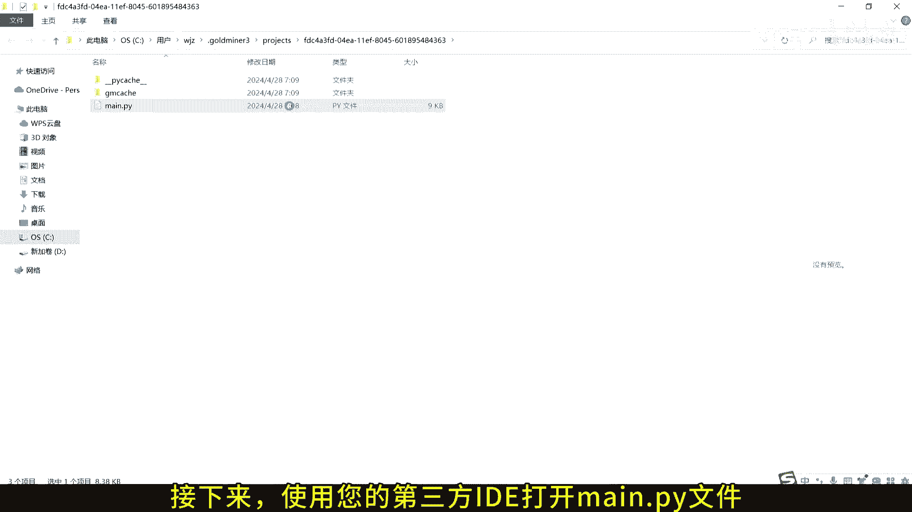
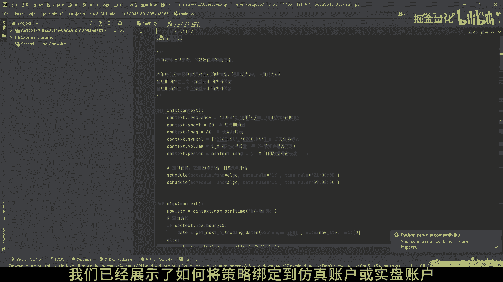
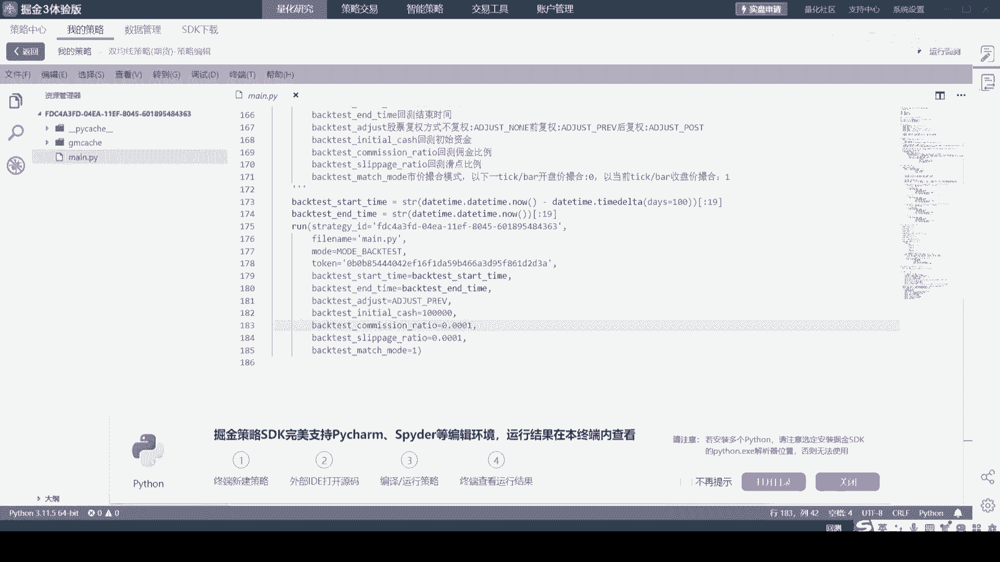
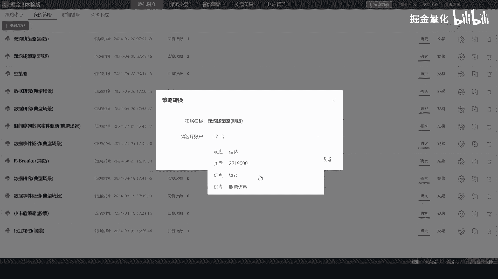
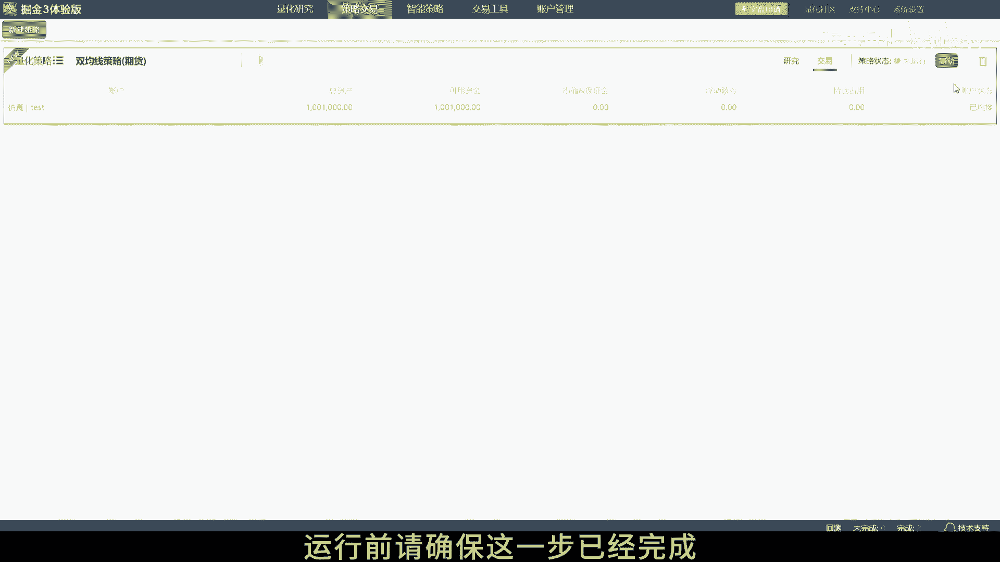

# 4.2 在第三方IDE中调试和运行掘金量化策略 - P1 - 掘金量化 - BV1Kb421H7ii

欢迎来到掘金量化策略开发的教程，今天我们将展示如何在第三方IDE，如PATTERM中编辑调试并运行您的仿真策略，首先您需要打开包含掘金量化策略的目录，这是策略文件main派所在的文件夹。

在这个目录中找到名为main p y的策略文件，这是您将要在IDE中编辑的文件，接下来使用您的第三方IDE打开main p y文件。

在IDE中配置Python解释器，确保它已经安装了GMSSDK，这是运行掘金量化策略所必需的，在之前的视频中，我们已经展示了，如何将策略绑定到仿真账户或实盘账户。

这里我们将重新操作一次策略绑定到仿真账户。

运行前请确保这一步已经完成。

现在在IDE中设置run函数的参数，mod等于motor live，这将允许您的策略在仿真或实盘环境中运行，运行main i文件，您的策略将在IDE中启动，并连接到您之前绑定的仿真或实盘账户。

在IDE中您可以像往常一样设置断点，单步执行和查看变量，以便对策略进行详细的调试，这就是在第三方IDE中编辑调试和运行，掘金量化策略的全部步骤，现在您可以利用IDE的强大功能，来优化您的交易策略。

感谢您观看本教程，如果您在使用过程中遇到任何问题，欢迎随时联系我们的技术支持团队，掘金量化。

