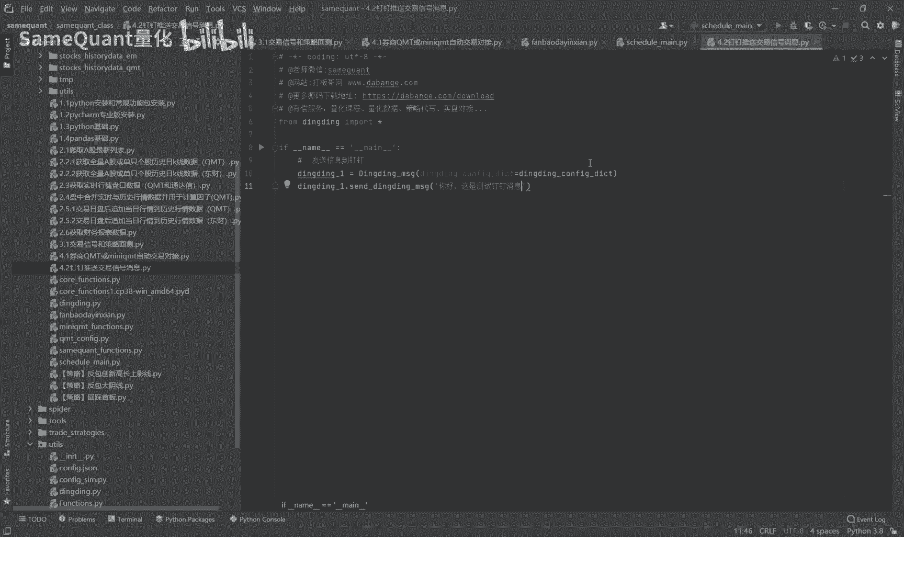
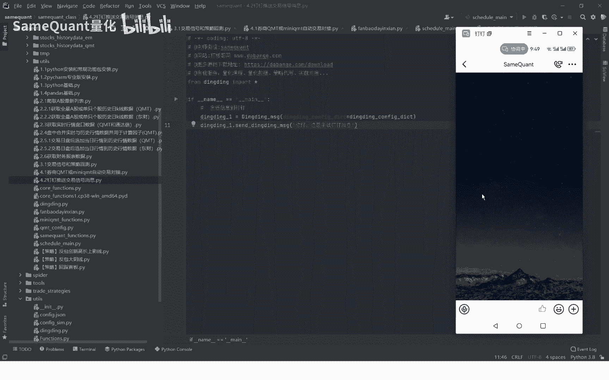
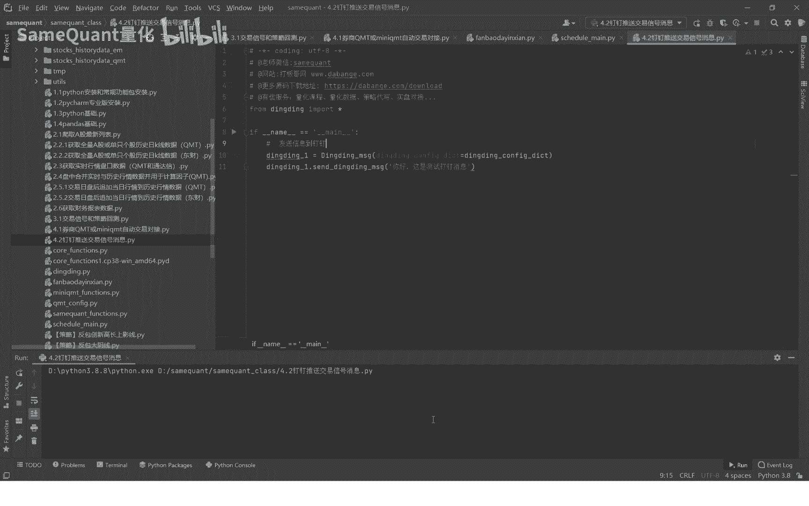
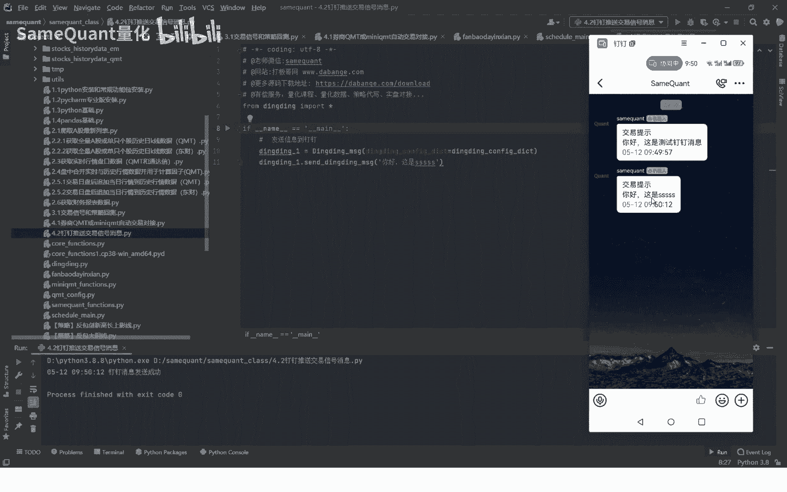
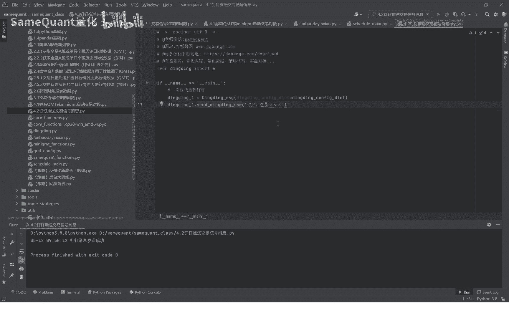

# 4.2 钉钉推送策略交易提醒 - P1 - SameQuant量化 - BV1MD421P7Mc

各位学员大家好，这期我们分享，如何利用钉钉推送一个交易信号信息。

首先呢我们大家可以看一下，这个是我们手机的一个钉钉。

我们现在直接运行一下这个钉钉消息，我们看一下啊，直接运行好。

这里已经显示这个消息发送成功了，这里消息发送成功之后，你看我这里就会获得这个钉钉消息啊，我们再改一下，这是好运行，那你就立即有了。

那么在磁盘的时候也是一样，我们策略交易的时候一样，如果你有任何需要的一个消息哈，比如说我们希望将上节课一个交易下，盘中交易下单的一个消息给推送到我们钉钉，这个时候呢你就把这两行代码。

今天消息两行代码给取消注释掉哈，注释掉之后，如果说我们盘中触发了这个下单的话，那么首先他会立即KMT先下单，下载完之后呢，就会推送一个钉钉消息啊，就比如说就会推送一个触发了，买入你具体的股票代码。

他会告诉你，那是非常的简单啊，大家呢也就是说达到我们的课程源码之后，你直接导入听消息的包，输入你要想发送的一个消息的一个内容，就可以了，当然前提是，你需要先看一下钉钉配置的一个教程啊。

你需要钉钉消息推送，这个都是免费的，一直免费的，你自己去手机点一点设置一下就可以了。

好了。