# 4-API账户准备 - P1 - Crypto小白书 - BV1Hp421X7nq

三大家好，这里是加密小白书，专注于web3AI及个人提升，这节课我们来讲一讲API账户的准备，这是非常重要的一个环节，我们先来讲一讲API的基本概念。

Api application programming interface，全称是应用程序编程接口，对于没有编程基础的学生来说，可以把API想象成一个魔法盒子，你只需要按照一定的方式。

也就是根据API的规则，将这个盒子里放入一些东西，就是请求，然后这个盒子就会按照你的请求给出回应，你不需要知道这个魔法盒子里面是怎样工作的。

你只需要知道怎么用它就可以了，这里我们给大家展示的页面是OKX的API文档。

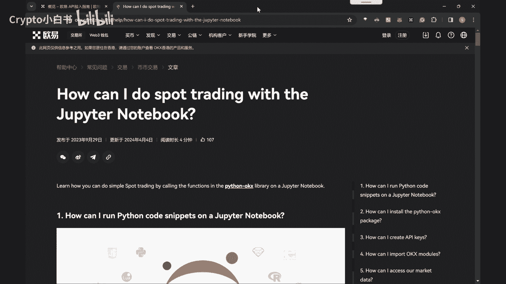

未来课程中会使用到OKX的API。

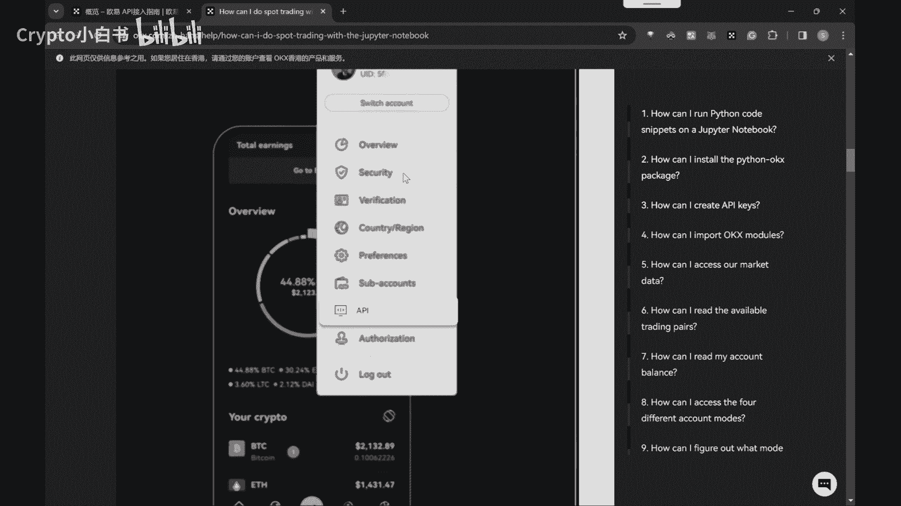

KX是一个提供加密货币交易的平台，它的API允许人们获取市场数据进行交易的。

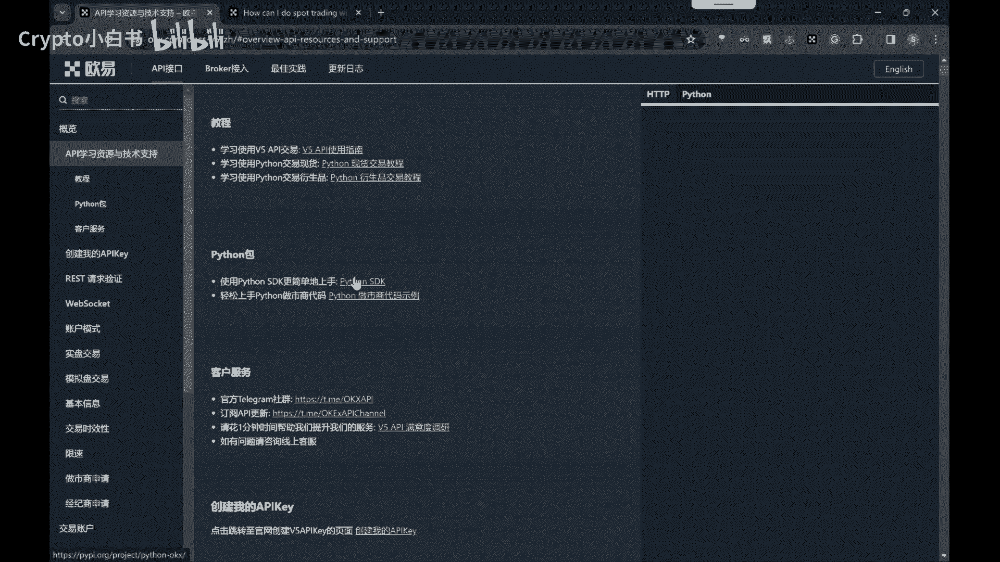

例如你想知道当前的比特币价格。

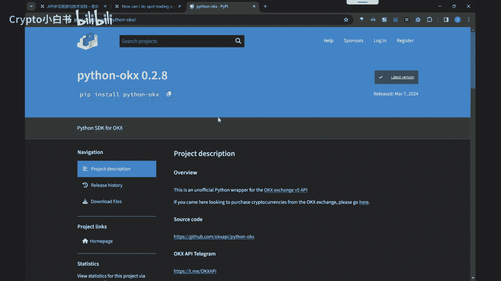

你可以通过KXAPI发送一个请求，这个请求就相当于你对魔法盒子说。

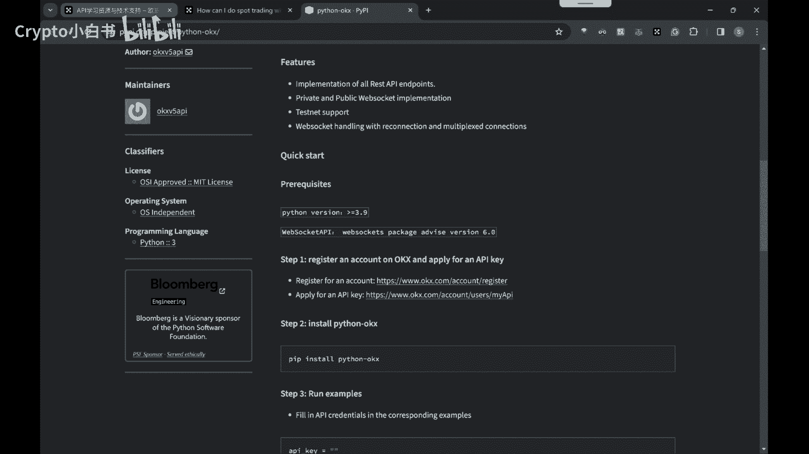

请问现在的比特币价格是多少，然后OKXAPI就会回应你，告诉你当前的比特币价格，接下来我们介绍如何准备API账户。

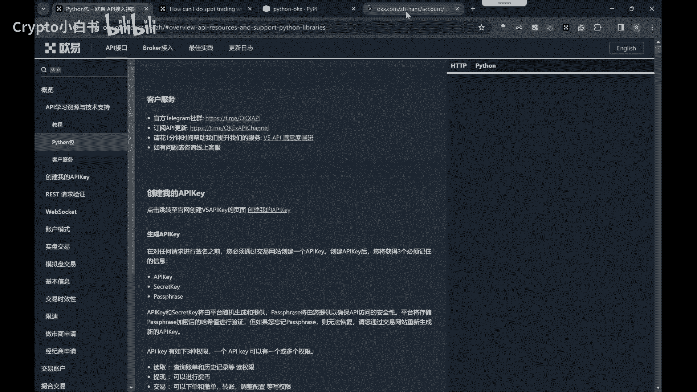

首先需要注册一下KX，对于没有魔法环境的同学，可以微信添加或邮箱联系管理员，得到最新的注册链接，课程中如果遇到任何其他问题，也欢迎添加管理员解决。

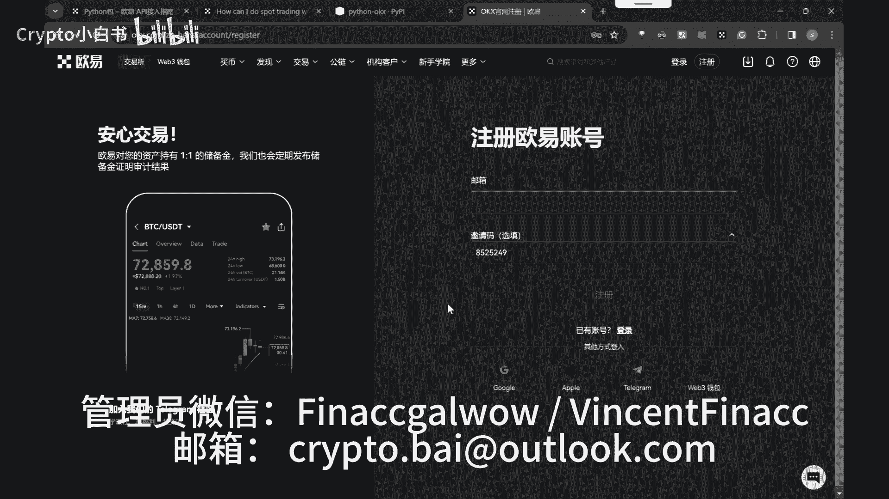

对于有魔法条件的同学，可以直接去KX官网或者使用我们的邀请链接，填写我的邀请码，可以获取免费新人福利，和参加后续各种新人活动。

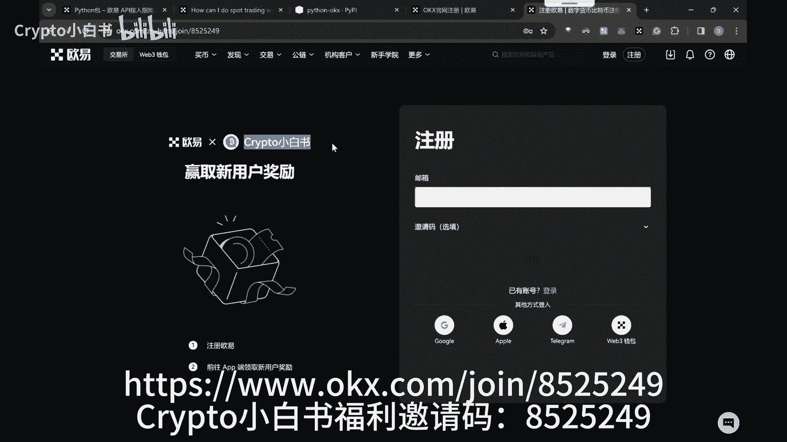

注册完后登录网页版。

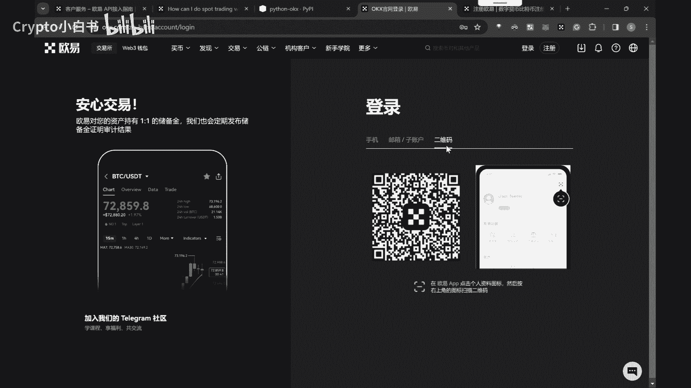

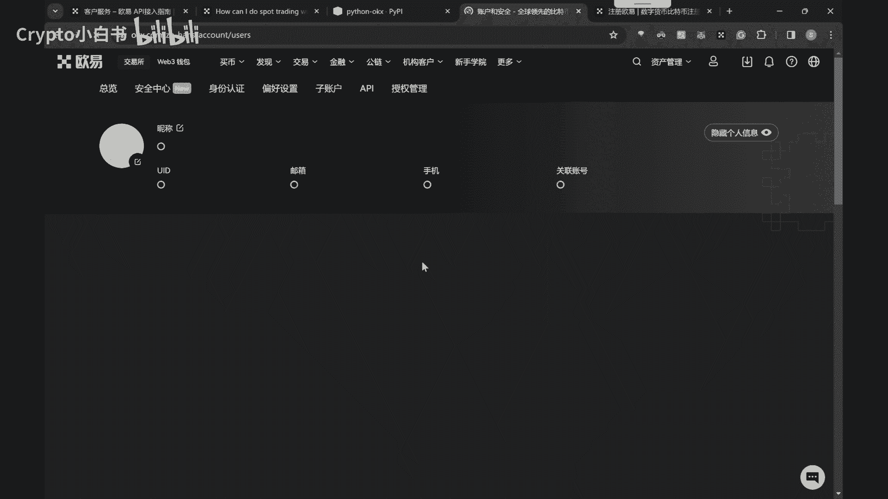

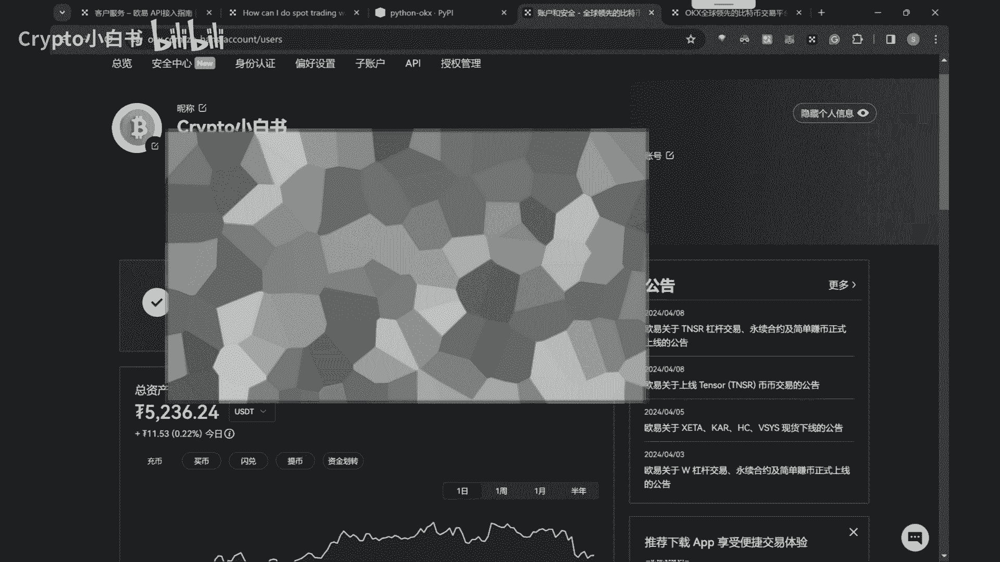

点击API创建API。

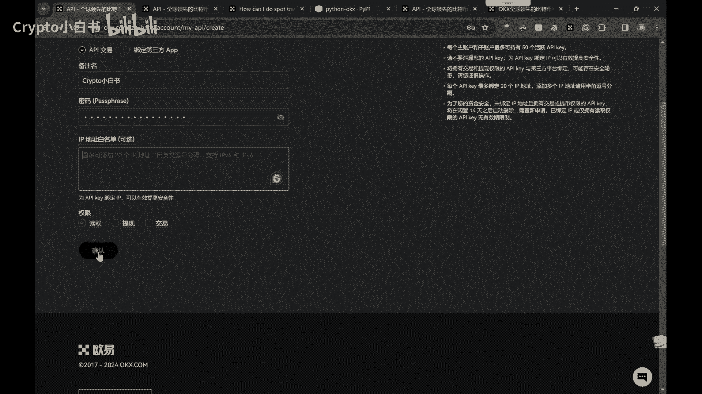

根据提示创建API，然后得到API key和secret记录保存起来。

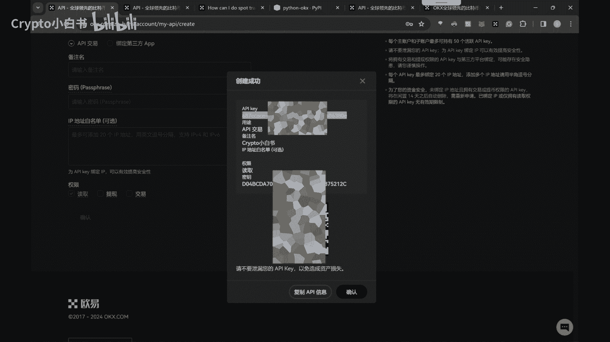

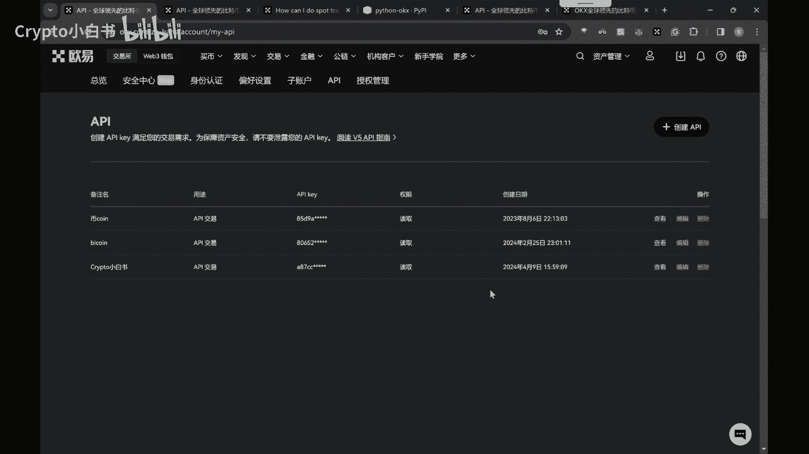