# 4-生成交易信号 - P1 - Crypto小白书 - BV1BF4m1A7dK

三绿大家好，这里是加密小白书，今天我们继续讲策略回测中，第二部分，如何生成交易策略，首先我们需要导入所需的库pandas，那同时呢我们对其进行一些设置，以确保数据在显示时不会换行，接下来读取数据。

在这个例子中呢，我们使用上一节课下载的BTCUSDT，一分钟的交易对数据，我们将数据所在文件的绝对地址，复制到这个位置，将数据从文件中读取，并储存在一个名为DF的数据框中，为了确保数据的一致性。

我们对数据进行了排序和驱虫的操作，并删除了一些不需要的列。

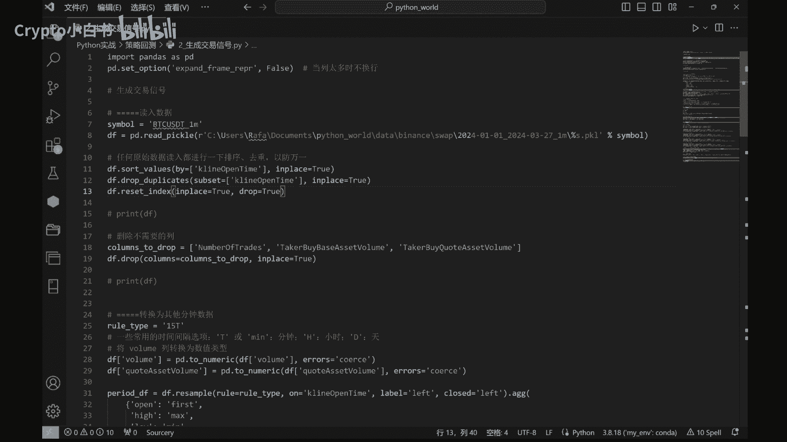

接下来我们将数据转化为其他的时间间隔数据。

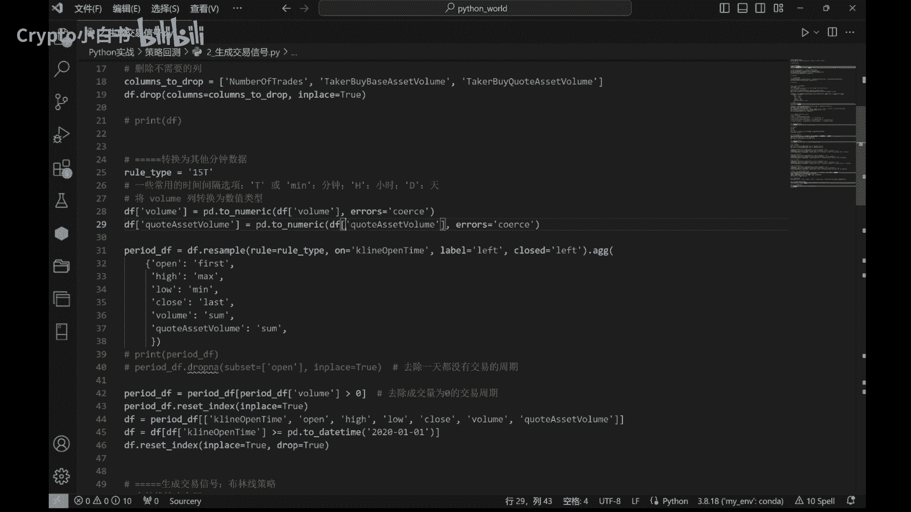

在这个例子中，我们将原本一分钟的比特币K线数据。

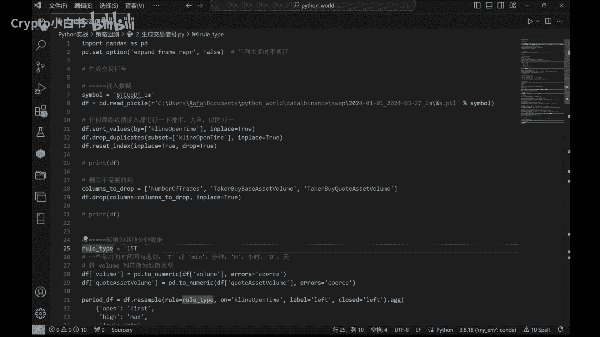

转化为15分钟的K线数据。

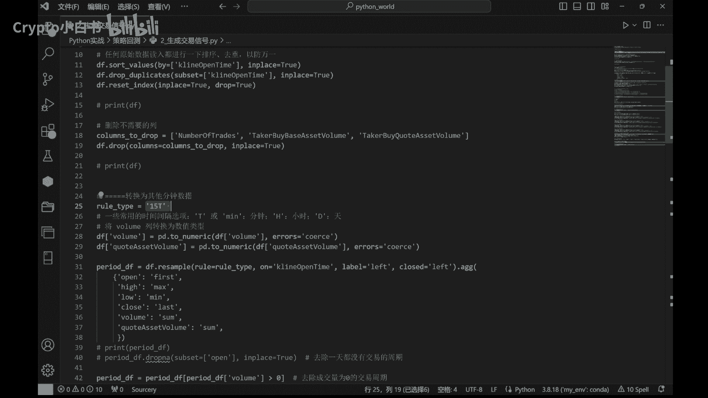

我们还将一些列的数据类型转化为数值类型，以方便后面的计算。

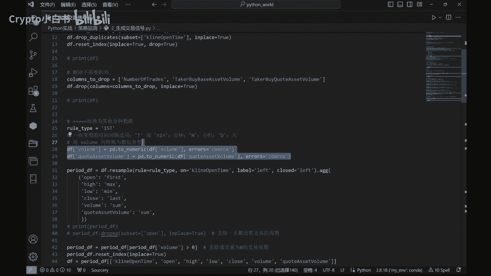

接下来我们将使用布林线策略生成交易信号。

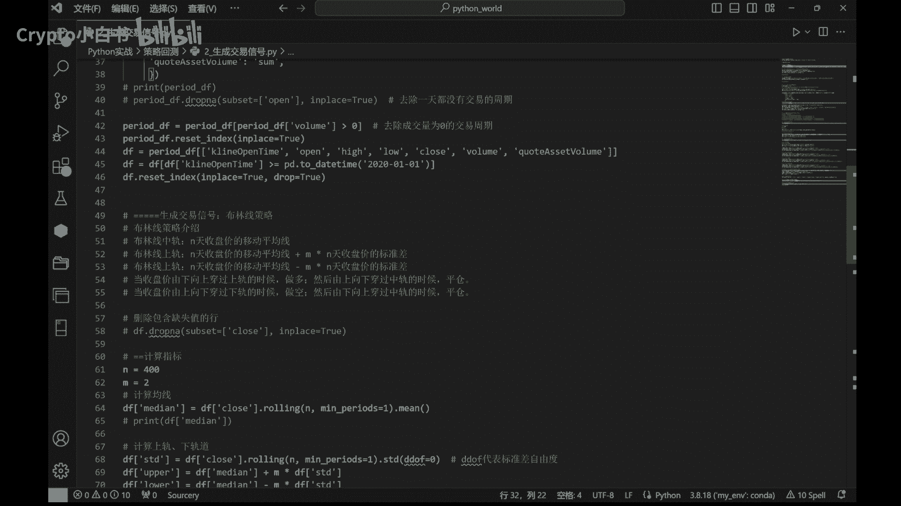

布林线策略是一种常见的技术分析方法。

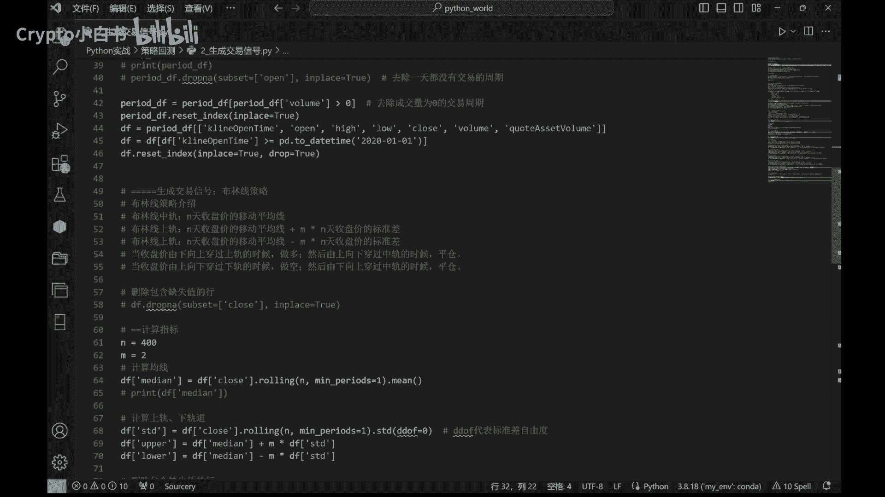

可以帮助我们判断价格的走势并生成交易信号，布林线策略原理。

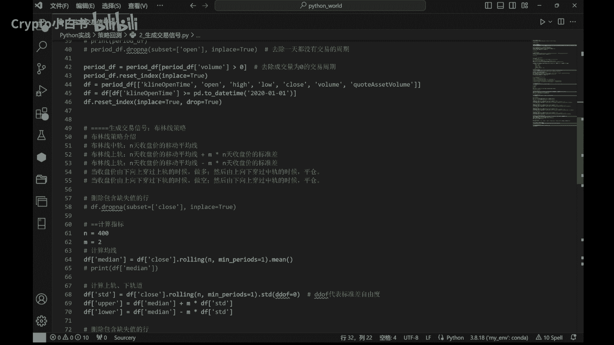

就是基于移动平均线的标准差计算，我们首先计算收盘价的移动平均线，然后根据移动平均线和标准差的值，计算布林线的上轨和下轨，这个策略的交易逻辑是，当收盘价由下向上穿过上轨时做多，然后由上向下穿过中尾时平仓。

当初玩家由上向下穿过下轨时做空，然后由下向上穿过中轨时平仓。

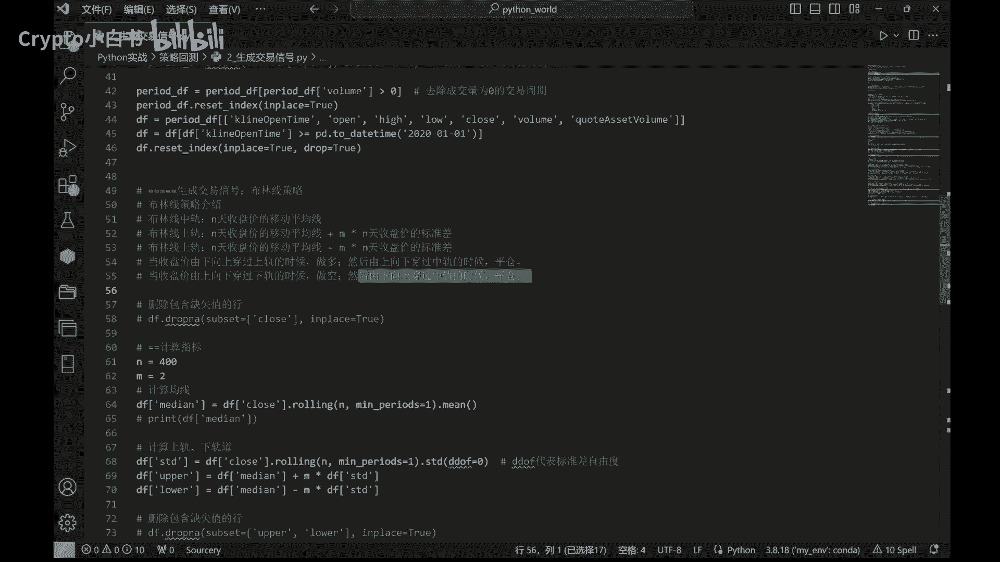

我们通过代码找到做多信号，找到做多平仓信号。

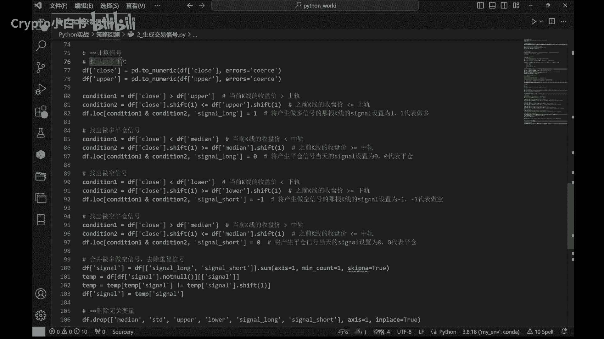

做空信号，做空平仓信号，最后合并做多做空信号。

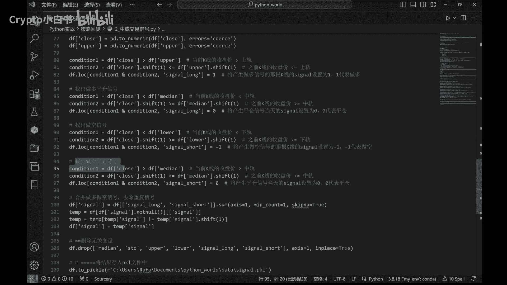

去除重复信号，在最后呢我们将结果存入pk文件中，以上就是整个交易信号生成的过程，通过这种方法，我们可以根据市场的走势生成相应的交易信号。

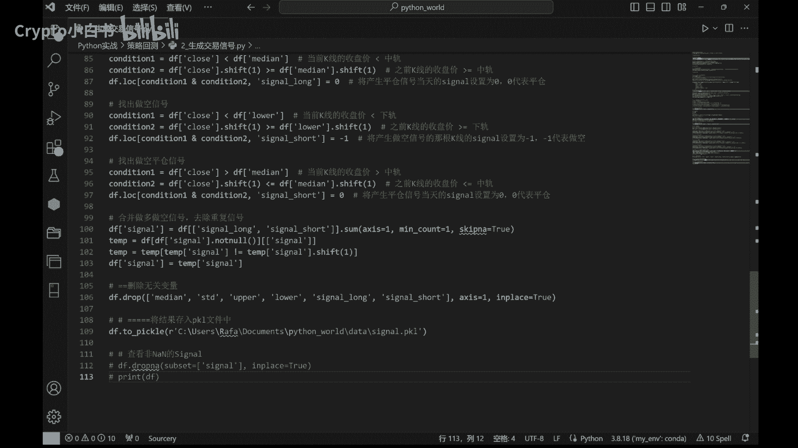