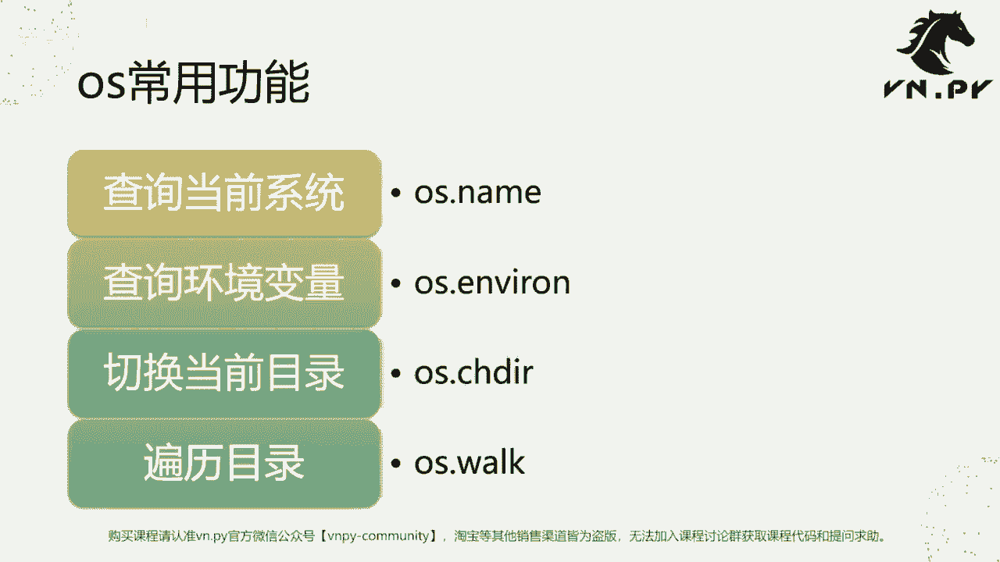
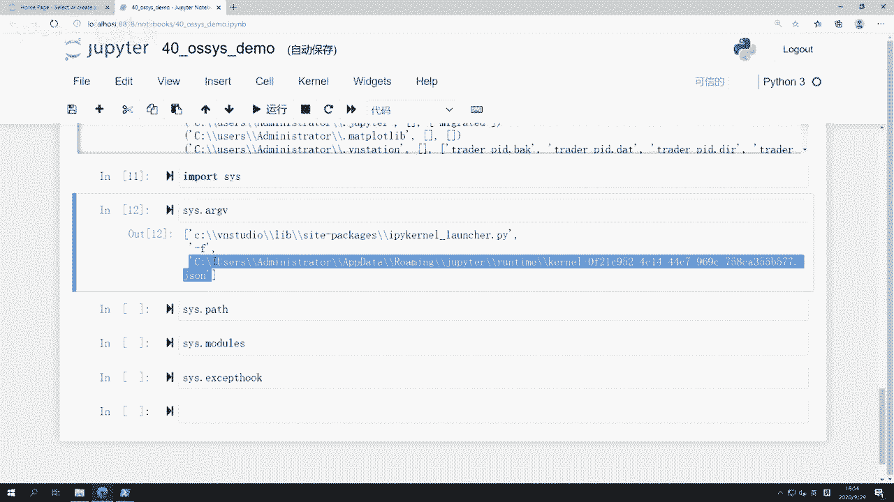
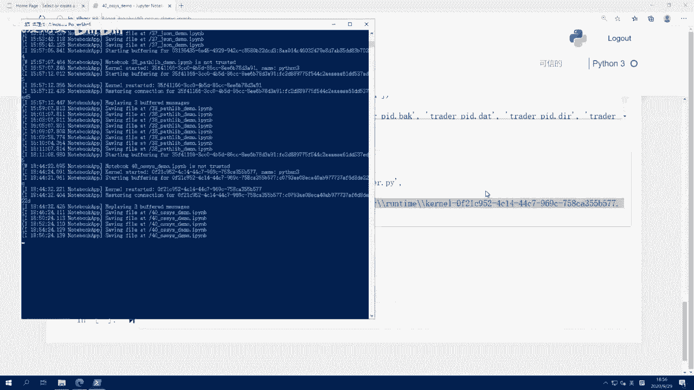
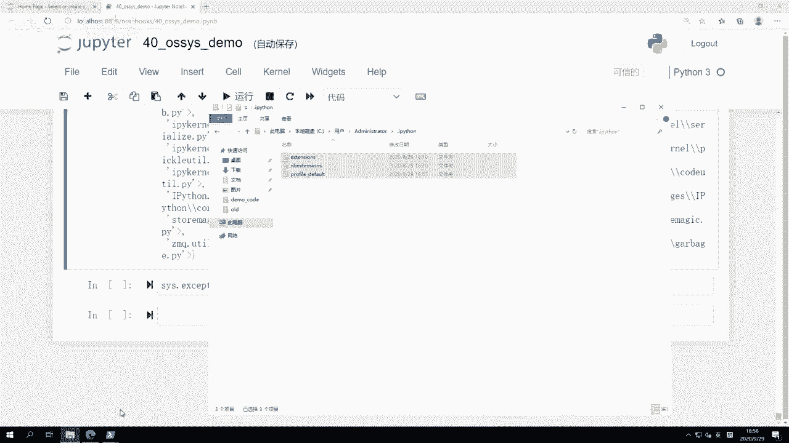
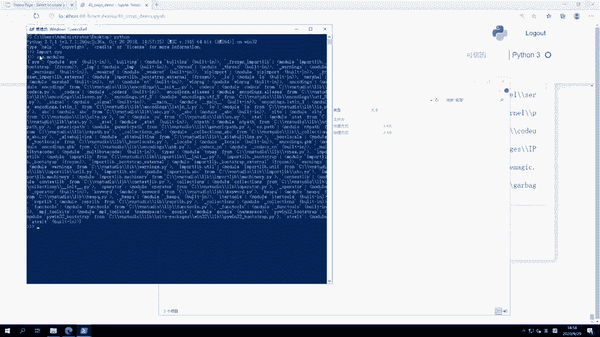
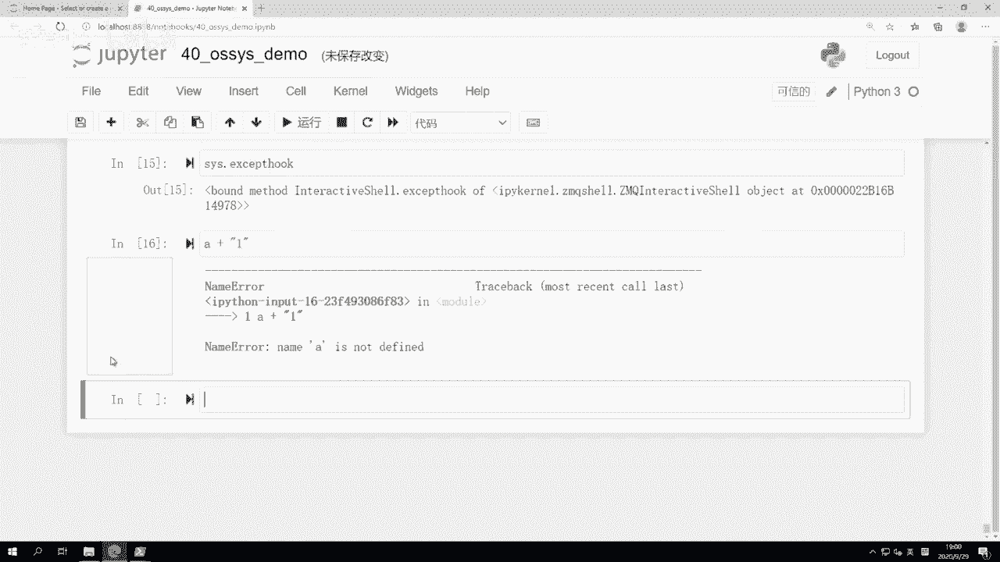
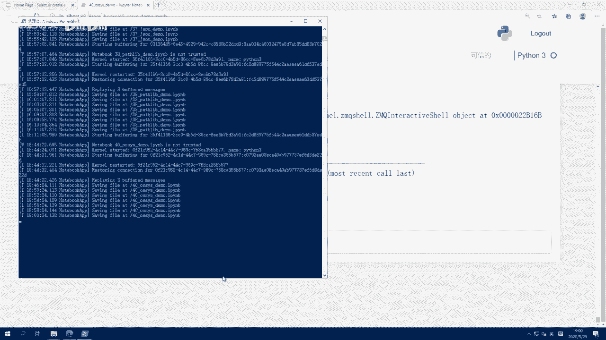
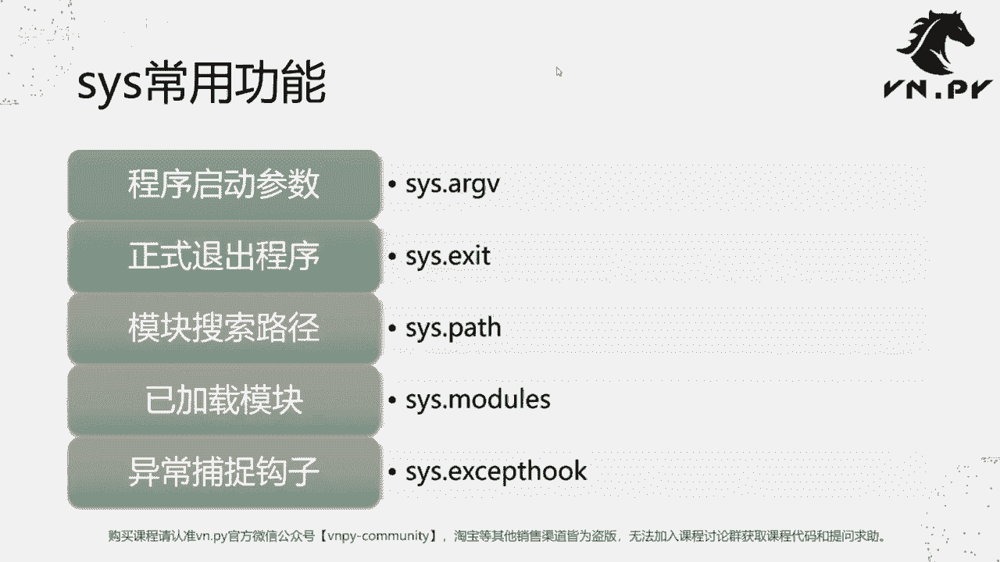

# 40.os和sys模块 - P1 - 我爱期货 - BV1gL2gYiEi5

OK欢迎来到量化交易零基础入门系列，30天解锁Python量化开发课程，那么今天呢是我们的第40节课了啊，上节课里面我们讲了这个，怎么样结合JASON和past live，来实现VN点派内部的这个配置。

文件的存储功能，那么这节课里面呢，我们要来讲一讲两个，围绕着这个Python和操作系统相关的这两个模块，第一个呢叫OS模块，第二个呢叫做cs模块啊，那么这两个模块被誉为Python这个内置库呃。

模块里面最主要的两大系统级的模块，那么OS呢主要是用于调用操作系统本身提供的，一些函数功能啊，说白了在windows上就是windows啊，这个操作系统提供的功能。

在LINUX上就是LINUX操作系统提供的一些功能啊，然后另外一个是cs模块，那么cs模块呢尽管啊它听起来叫系统，但是更多它适用于管理，当前我们这个Python解释器的运行时状态，所以这个有一点区别。

OS可以认为是对外的，他是负责和操作系统交互的，你要做一些事情的时候呢，都是让操作系统帮你去做，cs是对内的，它是用来管理当前我们这个运行着的Python解释器。

或者这个Python进程内部的一些系统功能的啊，所以两者一个对外，一个对内，尽管啊有些地方他们啊存在这个功能上，相重合的点，但是呢在实现方式上还是不太一样的，好接下来呢我们就先来看OS模块的主要功能啊。

这个主要这么四个，最常用的，第一个查询当前什么系统啊，我们看一下这有的时候我们有些啊策略也好，还是某些功能也好，还是某些界面也好，我们在不同的操作系统上，一个是windows，一个是LINUX啊。

我们的运行可能逻辑有点不一样，所以呢很多时候我们就需要来查询一下，当前的系统，最简单的就是调用OS点name，第二个，有时候我们要来看一下，当前整个windows系统内的环境变量是长什么样子啊。

我们可能要去访问一些啊其他的外部的程序，它所在的目录，那这些呢就要通过这个系统的环境变量来访问，第三个呢是叫做切换当前的运行时目录啊，因为有的时候你可能启动程序的时候，在一个目录。

但是呢跑着你就想要把它换到别的目录去了，那就需要用到OS点CHDRR这个功能，最后呢是一个遍历目录啊，有的时候我们可能想要便利这个目录下，所有的Python文件从里面扫描，是不是哪个文件里面写了策略的。

如果写了策略，我就把它加载进来，如果没有写策略的话，那我就忽略它，那么这个便利的功能是通过OS点work来实现的。

那么接下来呢我们就也来看今天的代码。

今天代码同样是用jupa notebook来跑的，第一行很简单，Import os，然后呢我们可以很方便的调用OS点name，那么注意OS点name，这里的name同样他直接就是一个啊。

这个变量它不是一个函数啊，后面不用加括号的啊，调完之后呢，它会返回一个NT，NT是什么，就是我们windows的服务器系统的缩写，因为我这个运行的嗯。

给大家做展示的环境是一个阿里云的windows server，2019啊，所以他自然就属于NT类的系统，那如果在LINUX上或者在Mac上，或者在其他操作系统上。

那他的这这里的AUSTNAME会有对应的区别，第二个呢是OS点environment，这个environment同样啊，它也是一个变量，你也不用加括号的，那么此时呢我们可以来这个先看一下它的类型。

我们可以看到它是一个叫做OS点啊，environment这么一个类型，那么下面呢我们把它给打印出来，看看长什么样子，哎非常像一个字典，对不对，外面是一个environment。

然后里面其实就是啊嗯一个个的键对吧，每个键对应的有个值，我可以尝试一下去用for循环哎，看看能不能打印东西出来啊，那当然我这里我并没有打印过，所以我先试一下，点items pr，好可以很方便打印出来。

所以实际上这个environment，那他可能是一个Python内部字典的派生类型，那这样打印出来看着就舒服很多了，我们可以看到这些都是我们操作系统内部的啊，这个环境变量，比如什么app data啊。

这个是我们呃这个这个嗯windows的，用来存放这个操作系统级别的，一些应用软件的啊，这个临时文件的目录好，app date杠rooming，然后当前我这台机器的名称名称叫desktop杠。

opp t t50M等等啊，就所有操作系统的环境变量，都可以通过这个方式来看啊，有的时候你就可以查看到，比如说诶当前我这个系统的运行时目录是呃，不好意思，不是运行什么了，当前我这个系统内。

可能它对应的一些操呃处理器的数量，以及我用来存放一些log文件的路径啊，当或者说这个本地文件的路径等等啊，都可以通过这个方式来获取，然后第三个函数叫这个CHDRR，它的作用是。

把我们程序当前运行的路径给换掉啊，怎么体现出来，需要通过结合一下下面这个函数，叫OS点get c w d，这个函数的作用，和我们之前讲的PASSLIP里面的，CWD函数的作用几乎一模一样。

他们都是来获取当前的运行时目录啊，我们可以看到这个运行完了之后，他直接现在我运行时目录，因为我在desktop下，demo code这个文件夹里面启动的JUPITER啊，所以这就是我当前的运行目录。

然后做一个修改叫OS点c h d i r change directory，改变我当前的这个运行时目录，我把它改到C盘根目录去，运行完之后我再次运行这个，我们可以看到当前的这个CWD。

就已经变到了C盘的根目录了啊，所以等于我们这个程序虽然它还运行着，但他现在在运行的那个目录的路径就已经变了，已经变到C盘根目录去了，然后最后一个演示呢就是啊这个work c盘users啊。

这个这是我当前这台机器的用户名啊，所谓work的意思就是遍历整个文件夹里面，所有的这个文件啊，然后呢把他们我这边用了一个for TP in os work啊，因为这个每轮循环的时候。

他这个里面的啊这个元素，它其实都是一个TP啊，一个元组，然后呢我们把TP给打印出来，那当然内容比较多啊，我先运行一下，给大家看一下，哦因为因为我这台机器用户名不是这个。

我把它改成这个的MINISTRATOR，好大家可以看到他会就开始打印了，它会扫描当前我这个administrator目录下，所有的内容，他现在应该还在往下打印，这个内容非常多啊，会一点点扫描，打印完诶。

到到这是不是打印完了啊，对这个就所有打印完，他会把这个目录里面所有的内容全部打印啊，然后我们找一个短一点的看一下，哎我们找这一个来看一下啊，这个第二行，这个，那么我们首先可以看到。

打印出来的这一行是一个元组啊，大家可以看到它是一个元组，然后在元组里面一共有三个元素，第一个元素是一个路径啊，这个就是IPYTHON这个路径，然后第二个元素是一个列表，这个列表里面的内容是在这个路径下。

对应的子目录啊，等于这个点IPAD目录下有extensions as什么NB，Nenotebook，Extensions of profile default，好，我们就点过去看一眼。

找到点这个这个是点IPATHON啊，点IPON，那么我们可以看到在点IPAON目录下，只有三个文件夹，是没有其他文件的啊，只有三个文件夹，所以第二个列表保存的是三个文件夹的内容。

然后最后一个列表呢是保存的，下面是文件的内容，那么在当文件目录下是没有任何文件的啊，所以就什么都没有，所以后面每一个也都一样啊，每一个啊tap第一个值都是当前这个路径。

第二个值是这个路径下的文件夹有哪些，第三个值就是这个路径下有哪些诶，这种哦文件的存在啊，那么这个呢就是我们在用OS点work，去便利一个路径下所有的文件夹，或者说便利这个目录的时候。

它会去显示出来的信息，讲完了OS模块呢，我们来看一看这个叫叫做cs的模块啊，cs模块比较啊可能更加所谓的常用一点啊，它在其中提供了的是围绕着我们当前Python虚拟机。

或者Python解释器进程本身的各种交互功能啊，我们这边一共列了五个最常用的，第一个最常用的，查看我们这个程序的启动参数是什么，叫cs a r g v啊。

这个ARGV其实是这个arguments的缩写啊，就是所谓的参数的缩写，那么第二个我们要看的呢是这个sister点exit啊，就正式退出一个程序，第三我们要看的是模块搜索路径，C4点pass啊。

第四个呢是已加载模块system modules，最后还有个异常捕捉钩子叫做system except hook啊，那么我们这边呢就来进到，同样回到我们的JUPITER里面啊，这个单元格因为内容太多了。

我把它点一下，那第一步我们先在这里import se，然后print一下呃，或者也不是print，直接直接调用cs点ARGV里面内容，我们可以看到其中有这么几个这个值。

那么每一个他这首先ARGV本身是一个列表，其中每一个只是列表里的一个元素，或者你可以把它理解为一个字符串啊，然后你你可以看到现在这里一共有三个啊，这么样的元素，第一个元素呢就是诶。

我们在启动时候调用一个叫做ipad kernel launcher，点派这么一个脚本，然后呢我们还启动一个叫杠F啊，就是基于什么配置文件，这个配置文件呢，又是后面这个这个这个所谓的。

JASON的这么一个配置文件。

那尽管我们在这个启动JUPITER的时候，可能只是随手打了一个jupiter notebook，但是这个jupiter notebook，其实是把我们的这个命令在后台转化成了一个。

还是Python叉叉叉的这么一个启动啊，只不过这个启动的那些参数呢，我们就可以通过这个方式来看到，第二个我们要看的就是啊就是six点pass啊，C4点pass的作用呢，是可以看到当前我们这个呃。

Python解释器会去加载我们Python模块的路径啊，那在这里呢比如说VN studio下的python37点zip，什么d l l slip，还set packages等等一系列内容。

这些都是我们当前啊这个Python呃，我们当前这个Python进程会去搜索模块的地方啊，举个例子，我们这儿有个这个demo code目录，就当前我们启动的这个目录啊，所以他可以在当前目录下加载。

或者你如果把那个Python文件丢到了，比如说set packages这个目录下的话，它也会去其中进行搜索加载，如果不在这些文件夹里的Python文件，那当前我们这个Python进程是加载不到的。

所以这也是为什么在好我们上一节课里面，这个生成了这么一个trader dr，就是我们的运行时目录之后，我们会把那个运行时目录添加到C4点pass里面，从而实现一个Python解释器。

可以加载当时运行时目录下，策略文件的这么一个功能啊，然后这边这个cs点modules，它的作用是用来打印A，当前在我们这个呃已经启动Python解释器内，我们加载的所有模块，你可以看到。

尽管我其实没有做太多的事情，我只是启动了一个九比特，然后import的OS和cs，但其实后台它加载了非常多的模块，你可以看到这这边每一个都是一个Python内部的，这个啊模块都给加载上了。

所以JUPITER应该算是一个相对比较啊，重型的应用，它会启动很多这样那样的东西，那我可以在这啊给大家就到桌面上来。

随手启动一个咆哮，然后我们进入Python import cs cs，点modules啊，这个时候内容就要少很多了，大家可以看到呃，尽管也还是有挺多的。

但是比起这里就少了非常非常多了啊，这个所以是个区别，那这个就是啊叫做裸的啊这么一个Python呃，顶级路径，或者说裸的这个Python的这个全局环境下，已有的我们直接就可用的模块。

那你每当加载一个新的模块的时候，他都会在这个modules里面出现啊，举个例子，我们可以看一下VN py in this点好，我们看一下VNPY在不在里面，Modules，我们可以看一下他是false。

因为我还没有加载这个边界派，那这个时候我们先来import fmp i，然后再来看一下啊，就变成true了，所以说说明这个啊，当前我们的这个Python解释器已经知道哦，我加载过一遍vue pd啊。

然后最后一个我们要讲的呢是cs点except hook，这是一个非常特殊的一个叫做钩子函数啊，我们回车运行它之后呢，你可以看到它是一个叫做bond method。

In constructive shells，except hook等等这么一个作用，那是什么意思，比如说我试着去做一件事，A加一会报错，报错是什么，Name error。

Name a is not defined，对吧，这是一个标准的Python里面的异常。

但是你有没有发现一件事情，就是这个异常正常，不是应该在CMD里面打印出来的吗，应该在这个从命令行里面打印出来的，但是在我启动JUPITT之后。

他没有在命令行里面打印出来，而是在网页里面打印出来的，那为了实现这个功能，就是通过这个叫做except hook啊，这个叫做啊异常抛出时候的捕捉钩子，这么一个特殊的函数绑定来实现的，那默认情况下。

当我们启动哎，比如说在这里啊，我们在这个里面，同样我们去访问C4点except hook，你可以看到它是一个默认的bet function，内置Python内置的这么一个函数啊。

它就是这个叫做异常捕捉的这么钩子函数，然后它和我们JUPITER里面就不一样，JUPITER里面呢是一个非常特殊的，通过这个ZMQ跨进程通讯实现的这么一个，消息传递用的钩子啊，这个非常特殊。

我们细节概念就不用讲了，但是更多你就知道呃，通过CAS模块，你去绑定一些这个cs上面的这个except hook啊，或者这个叫做STD啊，alt s t d in等等这些特殊函数。

你甚至可以去影响Python这个解释器本身在运行时，它输出的内容往什么地方走啊，你甚至可以把这些所有输出内容，都自动导向一个文件里面，或者自动通过一个网络端口可以发出去，那么在技术上呢都是可以实现的。

这块功能就是这个啊，cs模块所提供的和解释器本身来进行交互的，这块的系统操作的功能。

OK额哦对，还有最后一个函数sister exit，那这个我们需要在解释器里面来演示，直接调用C4点exit0啊，他看到我们可以看到，他直接就其实起到作一个作用，就把当前的这个Python给退出了啊。

这个C4点X的作用是调用操作系统的，关闭当前竞争的这么一个函数，或者说这么一个功能，把就当前进程给关了，然后你传进去的这个数字呢，就是当前这个进程的退出码，那么一般在操作系统里面。

我们的这个大家约定俗成的定义是，如果为零的话，就说明这是正常的一个运行退出，如果为这个其他的一些非零数字化，就说明当前运行异遇到的各种各样的问题啊，然后他这个异常退出了，然后你可以通过这个错误码结合上。

可能你提供的一个文档，你就可以去进行排查好，到底什么原因造成这样的一个退出，OK啊，那么我们这节课的内容呢就到这啊，然后还是和之前一样。

那呃更多的这个进化内容呢，请扫码关注我们的社区公众号，同时这节课里面我们讲到两个模块，大家如果哎一上来觉得功能都看得懂，但是就想不出来什么地方能用，很正常，不用去焦虑，因为这种系统级别功能。

在你可能平时写一些简单Python脚本的时候，不太会用得到它，更多的是当你需要做一种模块级别或者，系统级别开发，像van der派这样一个完整平台的时候，需要用到的和操作系统之间的各种各样的交互。

所以现在如果呃这个，你就更多把它当做一个知识学习基础就好了，未来有用，到时候呢再回来看好。