# 41.环境变量和模块加载 - P1 - 我爱期货 - BV1gL2gYiE8R

零基础入门系列30天解锁Python量化开发课程，那么今天呢是我们的第41节课了，在上节课里面，我们学习了Python name的和CAS这两个模块啊，主要是关于我们操作系统相关功能的。

当时我们提到了一个比较重要的概念，叫做环境变量，这节课呢我们就花点时间来看一看，环境变量和我们Python内部的模块加载之间的关系，那么首先环境变量啊。

它的英文是environment variables，也就是环境变量这个词的直译啊，对应的，它主要用来保存的是我们操作系统的一个配置，你可以把它视作有点像Python内部啊。

我们一个大字典这样的一个键值对的数据结构，但是呢它可能不是单纯生存在这个内存里面的，而是一个会把数据保存到我们硬盘上的，这么一个键值对的数据库，那么在其中呢，既保存了一个叫做系统级别的变量。

这个变量对于所有用户啊，就当前你这个windows机器如果不止你一个人用，可能有你啊，你的这个同事，或者说这个服务器上，可能会有更多的人同时用的话，那么这种系统级别的变量，是所有用户都能访问到。

都是通用的，第二个是那就叫做这个用户级别的变量啊，或者叫简称就是用户变量，那么用户变量是只有当前用户独有的，也就是你自己的这个当前windows账号，对应的用户变量，就只有你能看到。

同时也只有你能用另外一个人啊，如果这时候登录上操作系统，他在看到对应的自己账号里面的，用户变量的时候，和你这边看到的是完全隔离的啊，当然有些这个软件啊，在安装的时候会把所有的用户啊。

级别的这种用户变量都设置成一样一样的，但本质上他们还是隔离的。

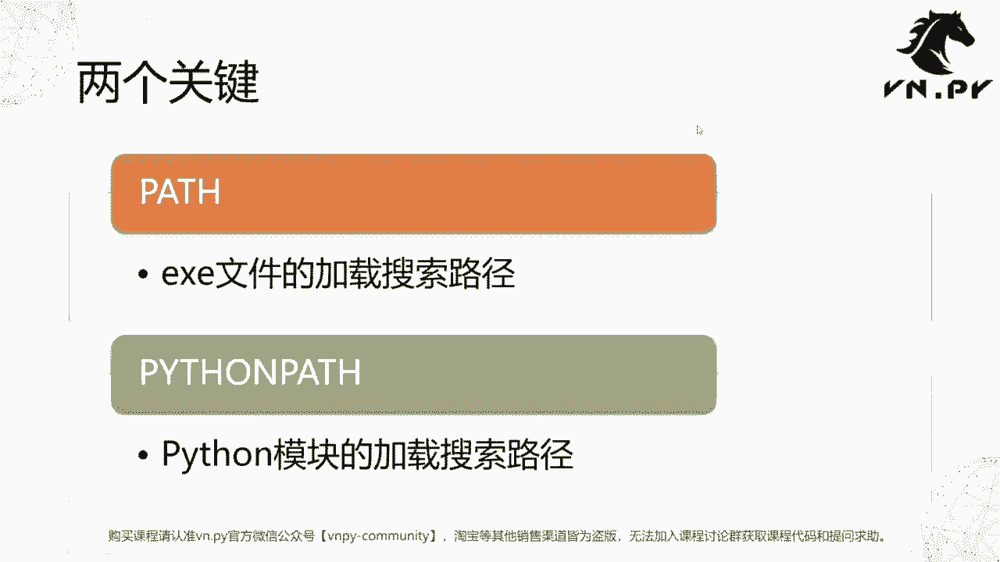

那么接下来我们就来看一下在我们windows里面啊，怎么样去看区额，看到和区分这两个变量，随便点开一个啊，我们的这个浏览器，然后呢在这个此电脑这里，那么点击属性啊，这个不叫浏览器啊。

这个叫做资源管理器啊，点击属性，那么打开我们当前操作系统的这个配置啊，在这里你可以看到很多围绕操作系统信息，比如说我的windows这台机器是windows server2019。

然后处理器是啊什么版本的，然后内存有多大等等啊，相关信息都可以在这里看到，那么下一步呢，我们就点到这里的高级系统设置啊，然后最底部有个环境变量，点开之后我们可以看到有两块区域。

底下这块区域我们先来看它叫做系统变量啊，其中包含的就是我们刚刚说的，操作系统级别的啊，这种变量对于所有用户都是可以直接访问到，可以直接去诶这个使用其中信息的，但不是所有人都能修改啊，这个要注意。

只有管理员可以修改，上面这个叫做administrator用的用户变量啊，这个就是我们刚刚说的用户变量，administrator是我在这台机器上的这个用户名，所以此时呢你可以看到啊。

这个第一个用户变量比较少，他一共在当前情况下就只有三个啊，分别是pass temp和这个TMP，那么他们可能是提供给不同的程序去用的啊，有的时候一个程序你装上来之后，他会帮你诶。

在当前用户的变量空间里面写入一个新的值啊，因为我这个纯粹只是用来给我们这节课，做演示的这么一个环境啊，所以这是上面的啊，用户变量会比较少一些，那么。

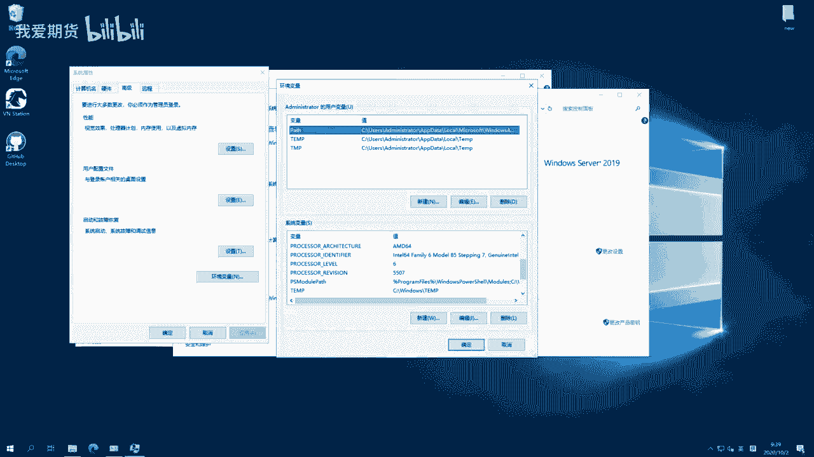

接下来呢我们就在这个用户变量里面来看两个，比较关键的一个呢叫做pass啊，它是保存我们EXE文件的加载搜索路径的，第二个呢叫做Python pass啊，它是用来保存我们Python模块的加载搜索路径的。

那么这两个变量我们先在这个啊编辑器里面看。

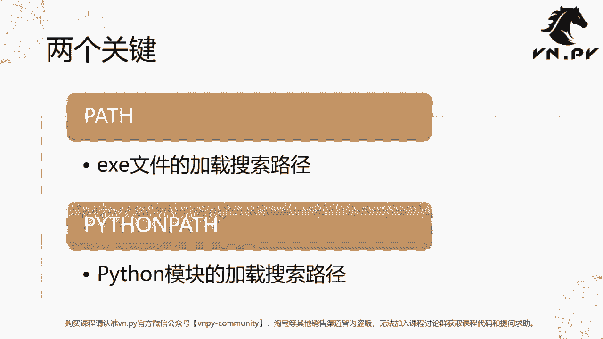

可以看一下啊，首先pass在用户变量里面是存在的，我们点开它之后，可以看到哎里面有这么多个信息，然后pass同时在这个啊，我们的操作系统的变量级别里面也是存在的，我们可以看到它相应的有这些信息。

然后在这里啊，你可能注意到有两个比较熟悉的内容，就是啊C冒号杠，VN studio scripts以及C冒号杠啊，Vn studio，那么这两个啊对应的这个地址。

指向的就是我们啊VN studio的运行时目录啊，那么啊或者说叫做他们的EXE所在的，EXE文件或者可执行文件所在的目录，那在这里呢我们先做一个尝试，我们先做一个操作，我把这两个变量的名字随便改一下。

我就在后面加上一个123和123诶，因为额实际情况下这个123目录是不存在的，所以我一旦加123之后，那自然这两个环境变量就没有办法找到，对应的那个VN studio的目录了啊。

所以我们来看一下做完这个修改之后，会造成一个怎么样的结果。

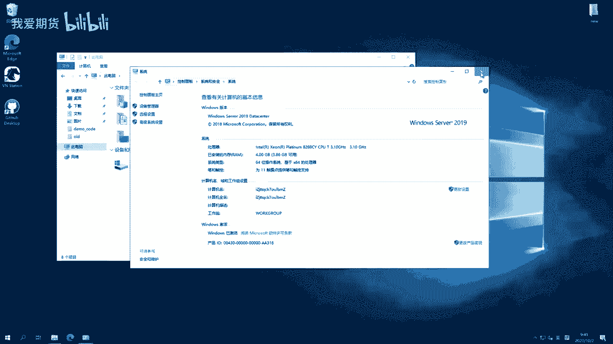

一路全部要点确定啊，然后退出关闭，那此时呢我再打开一个power shell，在这里我再输入Python运行啊，他会告诉你说，我们无法把Python实际识别为任何一个啊。

sim delete函数或者脚本文件啊，就说白了就是找不到Python了，那这个时候呢如果我输入jupiter notebook，他也会同样的有这么一个报错啊，就说白了找不到这个可执行文件了。

那此时我再选择另外一个模式，打开一个CMD啊，然后输入Python jubeat啊，都是同样提示，意思就是告诉你，虽然你输入这个命令，但不好意思，我在windows系统里面。

我不知道你要让我执行的这俩文件，位于什么位置，所以呢我就没有办法找到他们，我没有没有办法来帮你实现，那此时我们可以诶做一个简单的操作，我可以换到C盘的VN studio的目录下去啊，我现在已经切换过来。

用的CD命令切换过来，那我打开当前这个目录给大家看一下，就直接在这个目录启动资源浏览器的话呢，可以用start点啊这么一个函数啊，它会立即在当前目录打开我们的浏览器啊，这是一个CMD里面的快速操作。

你当然也可以在power shell里面用啊，那么我们在这个目录打开之后呢，就可以看到，这是我们这个VN studio安装完了之后的文件目录，其中有Python点EXE，也有Python w点EXE啊。

还有其他的一系列DLL等等相关的文件，那么我们已经切换到这个目录之后，我们再输入Python运行的话，我们看看会怎么样啊，这个时候就可以启动起来了，因为我在当前目录运行的windows。

会自动帮我搜索当前目录的这么一个啊，可执行文件的信息，如果有的话，他就会帮我运行啊，甚至我你看我刚输入Python的时候，我当然输入Python也可以直接运行啊，但是我输Python只我只输PYTHO。

我漏了最后的N，我也没输EXE的时候，如果我按tab键，因为这个文件名在当前目录是存在的，所以CMD能自动帮我们把它给补全起来，此时呢你直接回车就可以运行了，但是在当前目录啊，如果我输入运行JIT特。

它还是会报错的，因为JUIT特这个东西不在当前目录下，它就位于我们刚刚看到那个scripts目录下啊，CD scripts我同样按了下tab键做了个自动补全啊。

然后呢啊我们这边就不再style直接点进去，在scripts目录下我们可以看到哦，有好多各种各样的执行文件，其中我们可以看到一个重点JUPITER，JUPITER这个EXE是在这一个目录存在的。

所以我就试着在这里运行jupiter notebook啊。

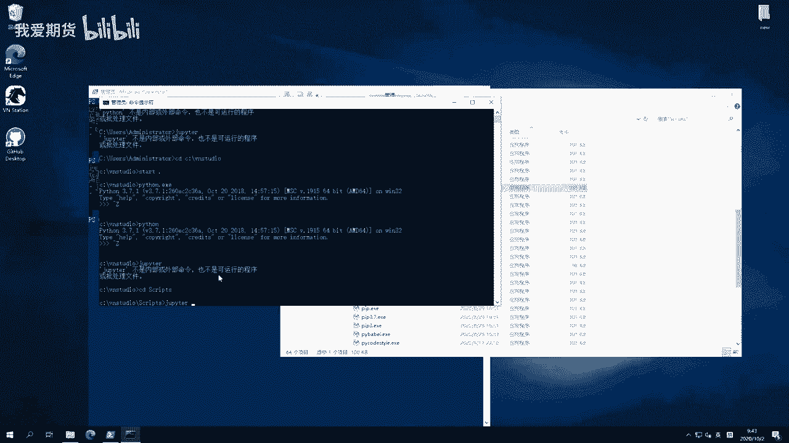

此时我们就可以看到熟悉的，JUPITER的启动界面了，就说明这种模式下它运行是可以启动的啊。

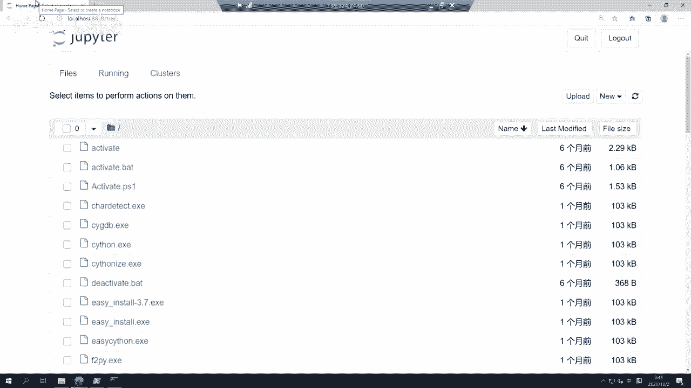

所以第一种你要去运行一个EXE文件的方式，就是去切换到准确的它的所在的那个目录啊，然后呢去运行，但无疑这种方式非常不方便对吧，所以windows给我们提供了一种更呃，这个简单一点的方式啊。

我切换到C盘根目录，那么就是我输入完整的可执行文件，所在的路径诶，比如我输入C冒号杠，VN studio杠这个Python点EXE啊，我把前面这个他所在的完整路径都给输进来。

那此时呢我再回车也是可以自动启动的啊，同样如果我输入VN studio杠，Scripts juicer，诶，不好意思，这个数错了，补全错了啊。

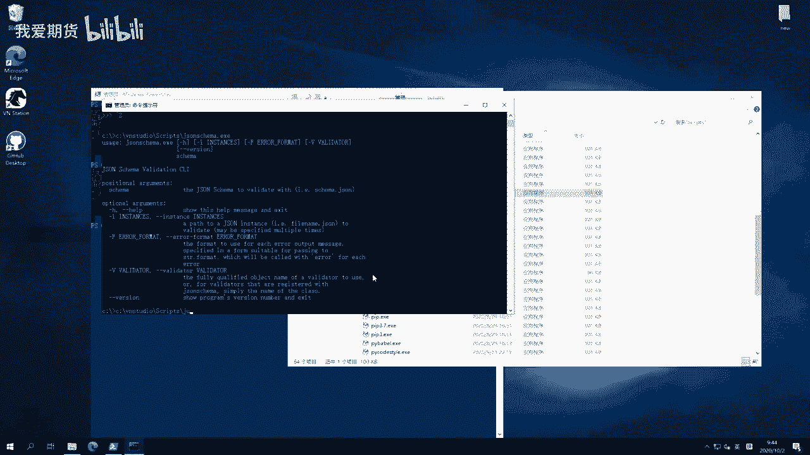

JU比特啊，notebook它也同样可以启动，你可以发发现就是这是第二种方式，就是你输入完整的路径啊。

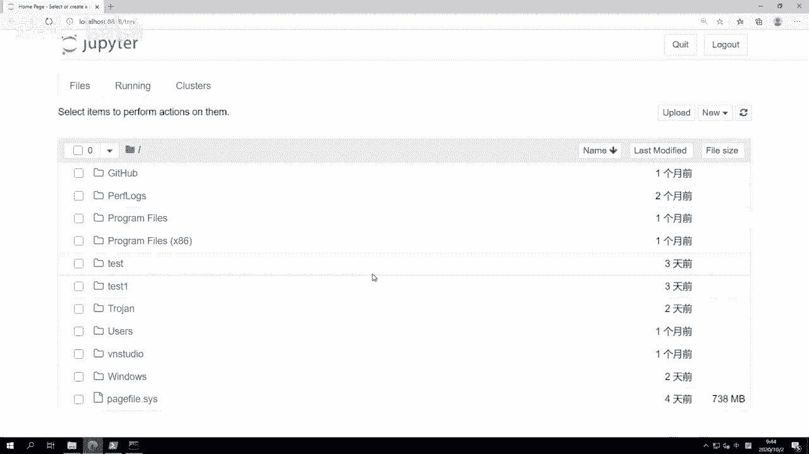

那此时你就不用切换到那个目录去了，他直接就会给你启动，但是这种方式有的时候也很不方便，因为我这里还好，VN studio啊，整个路径不是很长，你打一下也就两秒钟的事情就打出来了。

但是万一是那种啊嵌安装比较复杂，或者嵌套很多层的那种目录的话，你每次运行都要切过去，那就无疑让啊这个使用的时候有点太辛苦了，所以windows呢对应的就推出了这么一个叫做，pass的环境变量啊。

我们再回回到这个资源管理器，在此电脑上点右键属性，高级系统设置啊，点这个环境变量，我们重新回到这个系统变量级别的pass里面啊，当然你也可以改这个里面的，但是要注意改pass里面的，它会影响所有的用户。

改上面你的这个用户级别的，你只会影响用户的，那么对于windows系统还是来说的话，只有有管理员权限的这个用户，才能改系统级别的变量，如果你当前这个用户，他可能你在公司内部的话，很有可能这台机器使用呃。

公司内部的运营团队或者叫网管来管的，所以此时呢你可以用机器啊，但是你没有这个管理员权限，所以此时的话，你就不能去修改这个系统级别的环境变量，这是一个要注意的区别啊，那我这样把它改回去啊。

我把两样123都给删掉，改回去之后点确定，然后一定注意要把所有的这些对话框全部关闭，然后要把啊我们这里的CMD也好，power shell也好，还是运行着的程序也好，全部关掉，重启之后。

那此时你修改的这么一个新的环境变量，才会生效啊，因为我已经把路径添加进去了，所以我在再次输入Python的时候，windows会自动帮我去那些路径下面去找，有没有Python这个可执行文件。

有的话就会自动帮我启动了啊，所以这个时候就非常方便，不管是输Python还是输入JUPITER，都可以自动启动啊，所以我这边就不进一步演示了，那pass这个环境变量的作用。

是让操作系统来帮我们找可执行文件。

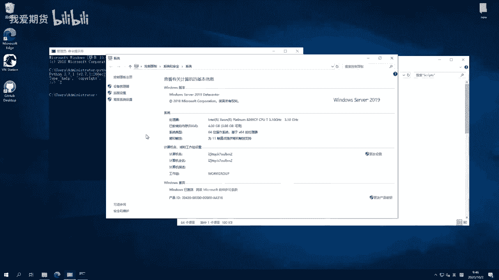

所在的位置啊，所以与之相对应的还有一个环境变量。

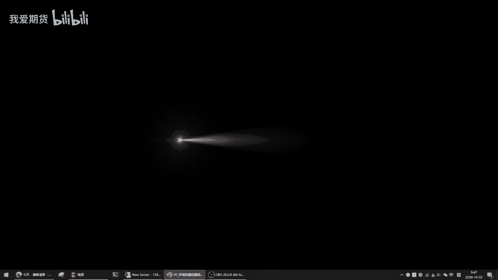

也就是我们这边下面要讲的Python pass，它的作用呢，就是帮我们去找Python模块的加载和搜索路径啊，如果这个时候，你你可能已经有一种自然而然的想法，那么pass是这么用的，对应的。

那如果把某个这个目录的路径添加到Python，Python pass里面，它也会自动的去啊，在Python里面你加载某个模块的时候，他会去import那个呃这个路径上对应的模块啊，如果他不在里面的话。

那自然就找不到了，所以接下来我们就围绕着Python pass再来做一次操作，我们啊这个第一步保存环境变量啊，你像我们刚刚操作的时候，我比较偷懒，我是直接把那个字符串前呃，就前后加了一个123。

如果你想把它们删掉的话，我们这边一定建议你先把那个环境变量信息，保存到一个TXT文件里面去。

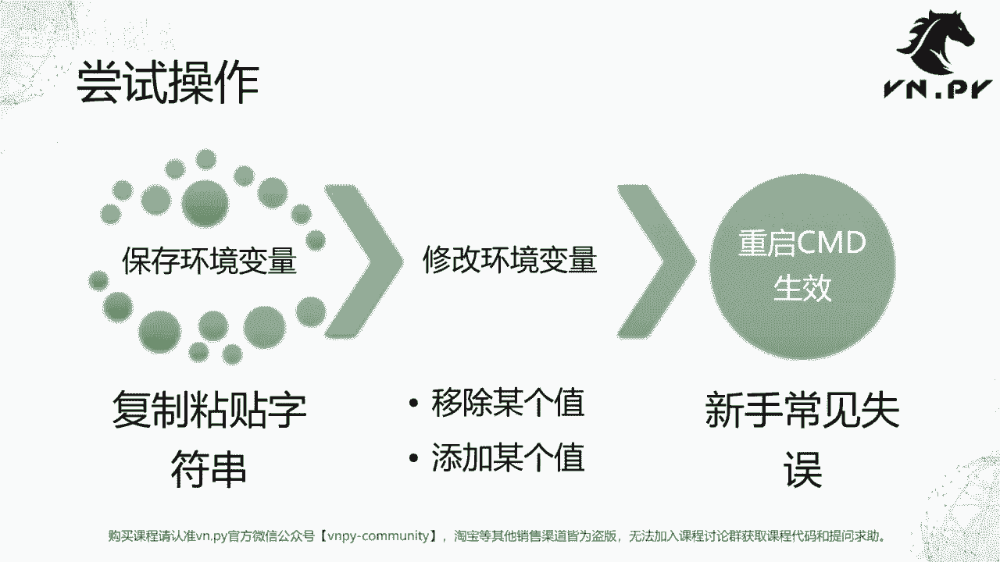

怎么做呢，啊比如说我现在想要在这个pass里面，我想要把这俩环境变量直接给删掉，那在删之前，千万记住你新先新建一个随便文本文档，还是什么都可以啊，我们就直接用文本文档，然后啊双击每个环境变量。

CTRLC直接把这个信息复制过来，复制完了之后，你再去扇他啊，这个时候删了它，我不怕，因为删了之后，即使后面我发现程序运行出错了，我还可以从重新点击新建，然后把这个路径粘贴过来啊，直接就有了。

直接点击确定，我就可以把它恢复到之前正常的状态，而不用去担心说啊，我不小心把环境破坏了，我也没保存一个，那这时候你就只能把整个程序啊，甚至有的时候要把你的windows系统啊卸载重装了啊。

因为去手动检查环境变量到底什么地方，不小心删了，是件非常复杂的事情，所以一定记住修改之前啊，最好先把它保存一个，要不就像我刚刚做的那种123什么相关，非常简单的修改，我人一定能记住的啊，这个也没关系。

那么下面呢我们就来启动我们的Python啊，然后我们找一个之前我们课上用过的这么一个。

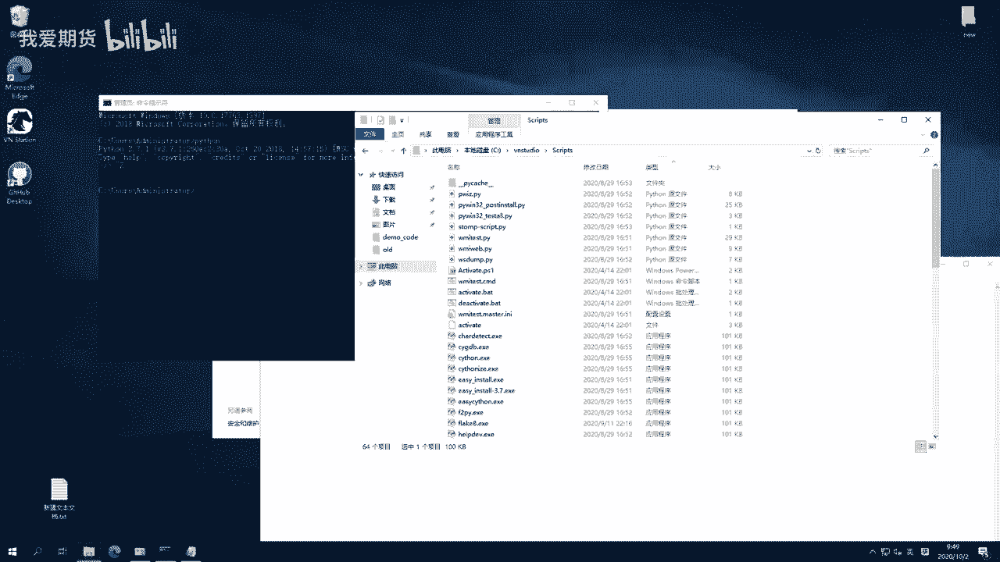

稍等我们找一个之前课上用过的啊程序。

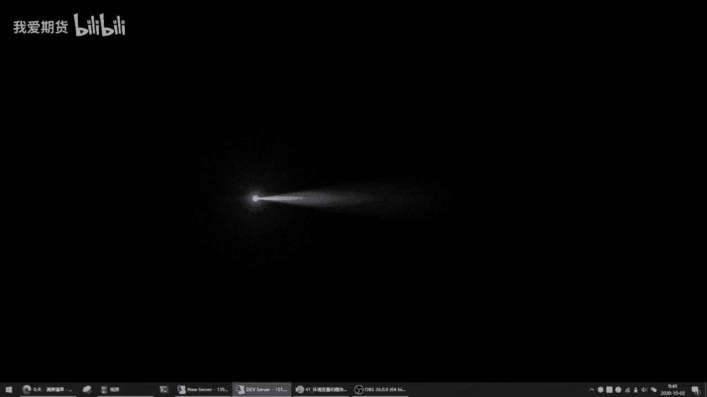

然后呢我们来看一看，当我们尝试着啊，你比如说这个demo好好，我们随便找一个。

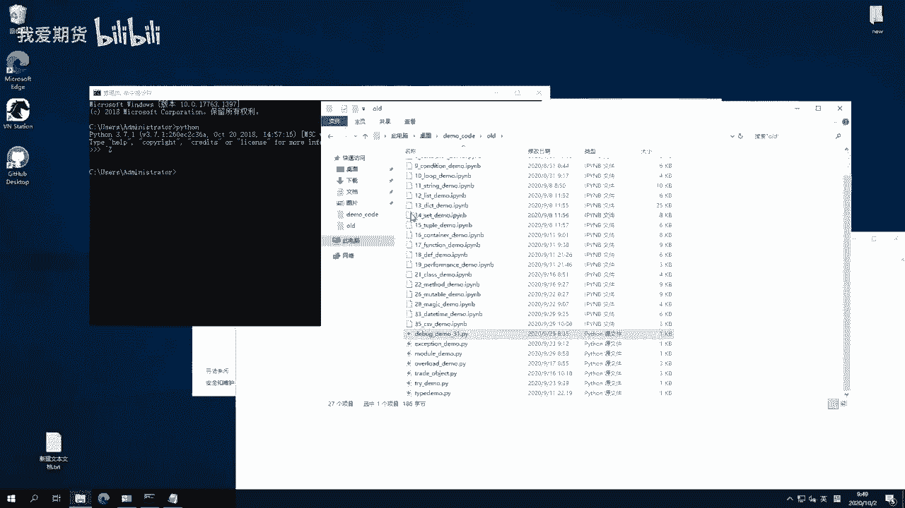

啊这就是一个我们当时用的debug demo啊。

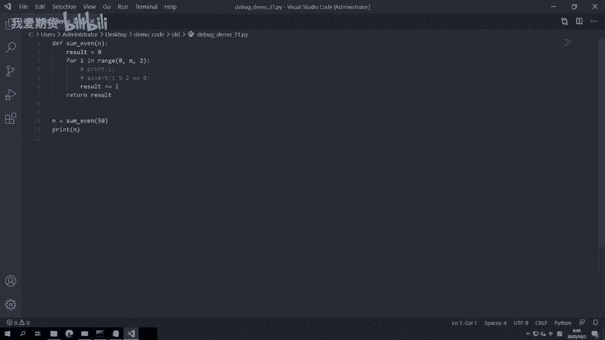

我们把它给复制过来，复制dio code目录下，额这个叫某，我们给它起个名字叫load demo好了，load demo点P，这些老的我先把它放到别的老的文件，我先放到哎这个另外一个old文件夹下。

那load demo点派里面。

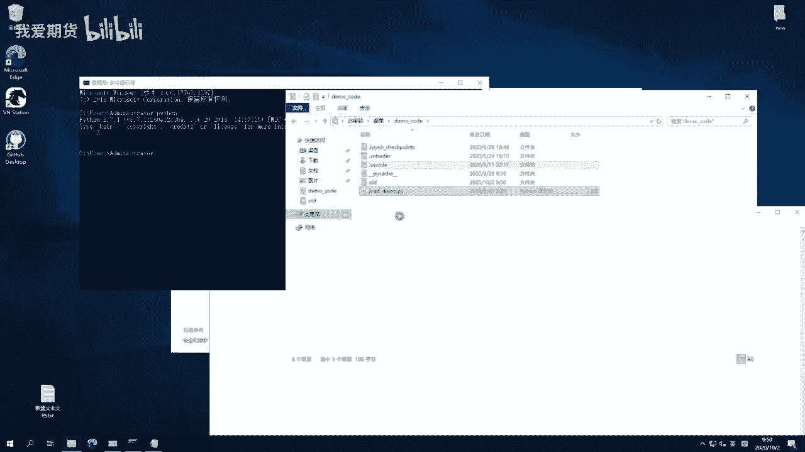

我们知道有这么一个叫做some even的函数，这是我们之前定义的。

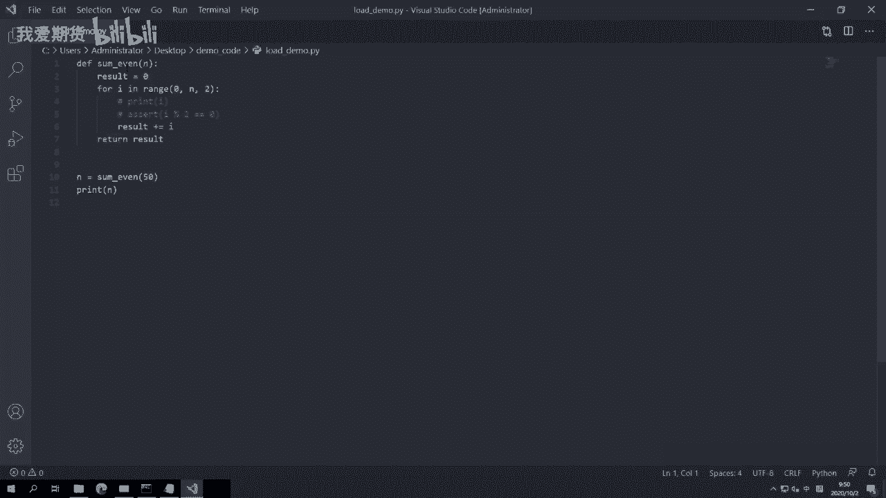

所以我现在就想要在Python里面加载，并且用到它，那么如果啊我现在就在桌面上启动一个呃，这个power shell。

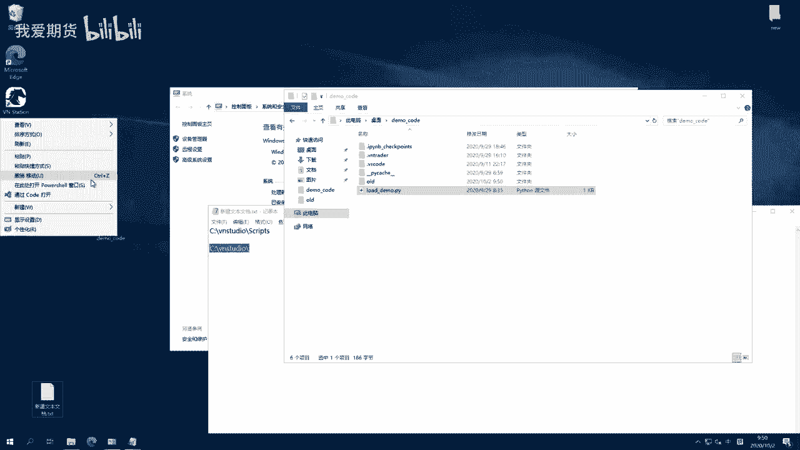

然后呢运行Python，我去import这个load demo，五一他会报错，他找不到的叫module，Not found error，No module named load demo。

意思就是不好意思，我现在找不到这个模块啊，你没有办法在当前目录用它，最简单的一个方案是，我把load demo这个文件诶给复制到桌面上来，那就在当前目录了，所以我再去import的时候。

它就可以加载了啊，此时我同时可以去运行这个叫some event函数，啊他是我这看是模块级别加载啊，应该是load demo，点SU1分20，然后就就直接可以运行了。

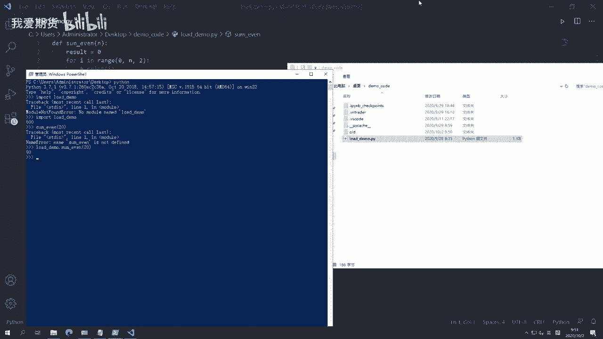

但是这个方案可能有的时候是不怎么方便的啊，因为你不能说我每次要运行一个程序，我就要把这个我要用的模块，所有的文件全部复制到对应的路径下，那如果我有大量的那些文件的话，那整个这个文件夹会变得非常膨胀。

就没有办法维护了，所以更啊这个方便的一个方案呢，Python也给我们提供了，就是和刚刚操作系统去扫描EXE文件。

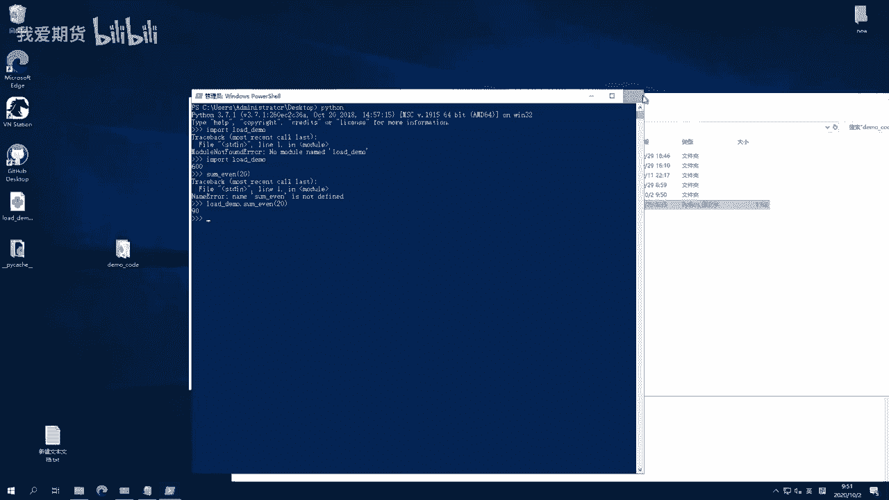

对应的这么一个逻辑，就是它对应的这个扫描Python文件的逻辑啊，怎么做呢，先把这个给删掉，然后同样找到啊，我们的这个高级系统设置环境变量，在这里你可以选择在用户变量里面去新建啊，有保留。

因为这个你肯定是有权限去操作的，不像这个下面系统级别变量，这个我们刚刚提到，你不是管理员，可能没法操作，我们新建一个变量就叫做Python pass。

然后Python pass这个值我们来点这个浏览目录啊，选到我们桌面的demo code所在的目录，或者选到你的那个Python文件所放的目录，因为我这个文件放在桌面上。

这个administrator desktop demo code文目录下，所以我就选到这个文目录，然后点确定这里再点确定，再点确定关闭啊，这时候我再次在桌面上打开一个power shell。

进入Python import load demo，我们发现就可以正常的去加载，因为这个时候Python已经知道了，OK你要加载模块的时候，我会帮你多去搜索一个目录。

这个目录呢就是所谓的这个demo code所在目录，那么我们去看一下，有的时候你可能想看一下，说诶现在Python在启动程序的时候，它会取哪些目录帮我搜搜索模块。

那么这些目录呢就都在CAS那个点pass变量里面，我们写一个循环啊，因为pass是个列表，for这个p insist点pass print p这么一个循环，你可以看到。

那么这些目录就是当前我们这个Python的进程，在你随便要加载任何一个啊，你去写一个import语句的时候，他会去帮你搜索文件对应的地方，我们可以看到啊，下面的这一堆C冒号杠。

VN studio其实都是我们VN studio自身的一个啊，这个自带的模块，它所处于的对应的目录啊，我们可以看到它因为模块性质的不同，它有的处于lib目录下，有的处于set packages下啊。

有的处于它下面的win32，下面，还有Python win里面都有，那么这个是啊，我们VN studio自带的那些模块所在运行环境，然所在运行路径，那对于用户来说，我们关心的就是这个。

第一条是我刚刚写在环境变量里面的那一条啊，或者我也可以去import os os点environment，上节课我们有学过，然后呢，Python，我们可以看到这里你添加去的，进去的只有这一条而已。

剩下的这对VN studio开头的，它是我们当前的这个VN studio的Python环境，所自带的啊，它并不是需要你手动去添加的这么一个啊，这个这个模块所在的路径，所以后面啊。

如果你在有的时候去写一些自己的程序，自己的代码，你希望把这些代码统一的，放在一个文件夹下管理，然后呢你希望在你自己这台电脑上，其他的地方去能加载，能访问到他们的时候。

最简单的方案就是那个把存放模块的文件夹，像我们刚刚的操作一样，添加到这个高级系统设置，对应的环境变量里面啊，添加到这个里面就行了，那么我们这边呢还有另外一个操作，我们再来演示一下。

是一个叫做动态路径啊的操作，我们把Python pass这个变量给删掉啊，然后点确定点确定啊，然后我们那现在的话，我们先演示一下不退出的情况，如果我不退出power shell。

那我想要去import load demo，它还是可以加载的，因为环境变量只有在一个啊，这种像power shell也好，CMD也好，它本身也是一个程序，只有在程序启动的时候。

它才会从操作系统里面读取一次，而启动完了之后是不会变的，所以我们刚刚没有退出这个咆哮，所以它的环境变量没变，我们把它关了，再去打开，再去启动啊，Python这个import load demo的时候好。

我们可以看到它已经加载不到了，因为此时重启的时候它就生效了，所以找不到这个环境变量，如果你不想啊，有的时候你可能是临时性的，想要在啊，这个当前的Python环境里面能加载到这个模块啊，不想要说诶。

我去修改环境变量，另外一种方案呢就是直接去修改CAS这个列呃，cs点pass这个列表，Import cas，然后呢这个我们写一个pass啊，等于C冒号杠这个users admin strator。

Gu desk top，然后是我们的这个demo co，然后我们往C4点pass，因为他是一个列表，所以我直接可以做append操作啊，把它添加进去，然后呢这个再打印一下P，我们打印一下。

我们可以看到哦，这次我已经把这个对应的路径给添加进去了，添加进去之后，那我再来试一下能不能加载，我们可以看到同样可以加载成功了，那么此时呢，我们就通过了一个启动Python的运行环境之后。

动态修改CSS模块下的这个pass列表，来实现一个啊，让Python解释器额外去在更多的位置搜索，我们这个Python模块代码的这么一个逻辑，那它呢又是比起我们之前的啊，那个那个那个修改环境变量的方案。

更进一步的啊，当然更灵活一点啊，因为这是一个动态修改的，但很多时候呢对于初学者来说，这个方案比较容易误操作，所以我们目前现阶段，建议大家不要用这个方案啊，更多你就去直接修改对应的环。

这个环境变量就行了啊，因为确实也比较方便，修改一次后面，那这个环境变量就永远位于那个位置，你都永远直接去用就好。

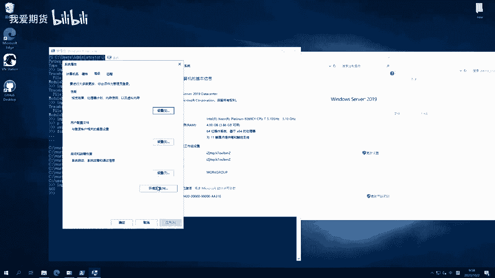

OK那么我们再回到PPT。

刚刚我们哎这个第一步保存环境变量的操作，给大家演示过了啊，一定要记着去啊，这个修改前要保存一下，不然防止回头啊，想改回来都没有办法改回来，然后第二个修改环境变量怎么操作，我们可以移除某个值。

我们可以修改某个值，我们也可以添加某个值啊，这个在我们那个刚刚啊，windows环境变量修改那个对话框里面都很很简单，就可以实现，最后一定记住修改完环境变量之后，要重启那个程序才能生效啊。

然后这是一个新手非常常见的事物，他可能经常会说哎我怎么改完了，死活改来改去，那我那个程序就是不生效，主要原因其实就是你没有去做这个重启，重启不只是要去重启啊，JUPITER或者重启Python。

你需要把整个CMD都给关掉，或者抛弃给关掉。

再去做这个重启，一定要记住这一点，OK那么我们这节课的内容呢就到这啊，更多精华内容，还是请扫码关注我们的社区公众号。

