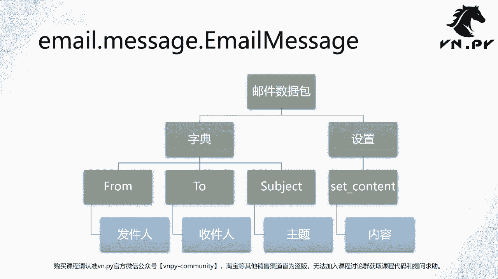
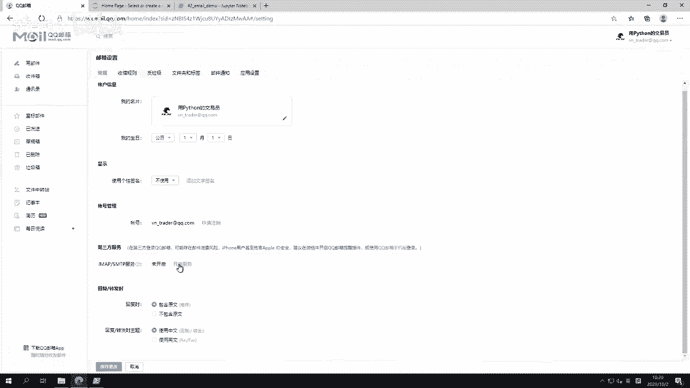
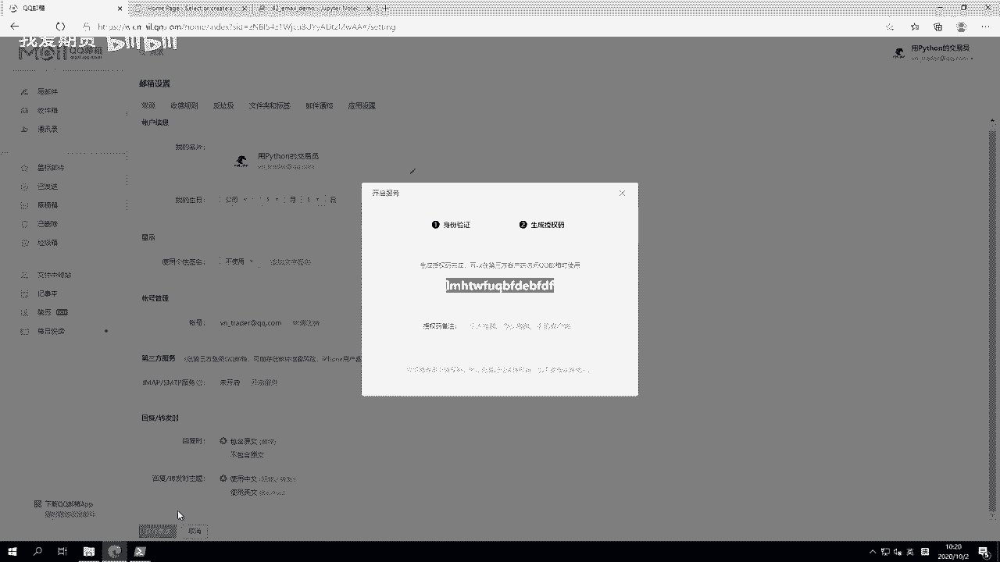
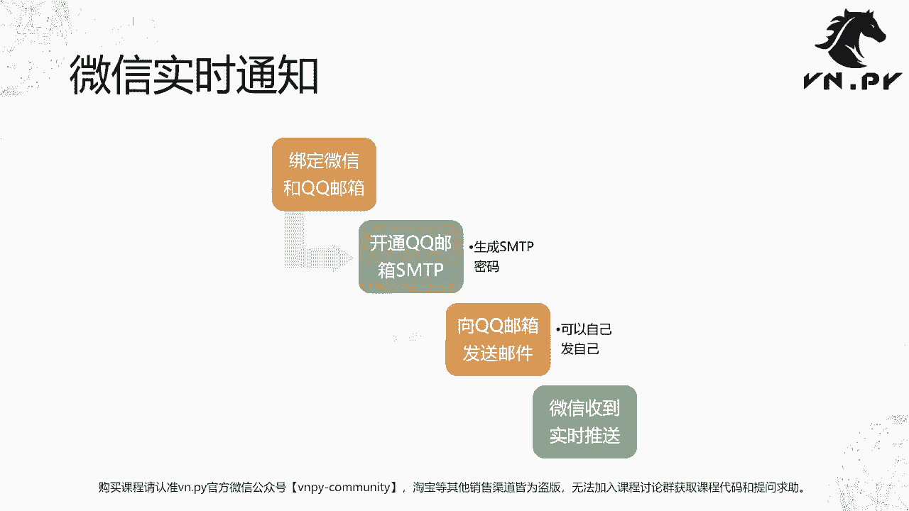

# 42.smtplib和email模块 - P1 - 我爱期货 - BV1G32gYuEBs

OK欢迎来到量化交易零基础入门系列，30天解锁Python量化开发课程，那么今天呢是我们的第42节课，上节课啊，我们讲了这个环境变量，以及怎么样通过修改环境变量。

来实现比较自定义化的我们Python模块的加载，那么这节课呢我们要来讲一讲，围绕着这个邮件收发相关的内容啊，怎么样用Python去发邮件去，主要要用到的呢就是这里的这个SMTP lip。

以及一个叫email的这么两个模块，那么这两个模块啊，整体上在我们收发邮件的过程中呢，起到了两个哎，第一个叫做打包，第二个呢叫做传输的作用，email模块提供的是一个叫做构建邮件数据包。

这么样的一个功能，你可以想象你现在要去寄一个顺丰的快递，那一般情况下你要先找一个顺丰的信封，把你要的信息啊，把你要寄的那个东西，比如一张纸，一个文件给放进去啊，然后把它封口，然后呢。

可能打印一下你的这个要快递的那个地址信息，收件人发件人的信息啊，一般是一张那个小纸嘛，贴在上面，那么此时这个邮件就打包好了啊，那你可以找一个快递员过来，然后让他把你寄出去，那么寄出去这件事情。

就是下面这个叫做SMTP lip去负责的，他负责呢，把邮件发送到对应的SMTP服务器上去，那这个SMTP的邮件服务器呢，会在对应的帮我们把这个邮件信息给投递到啊，我们要记得那我们要发邮件的那个地方去。

所以整体上是这么两步，第一步打包邮件，第二步传输邮件，那么我们这边呢接下来要看到一个叫email点message，点email message这么一个类啊，就是我们要用来打这个邮件，数据包的这么一个类。

等会我们打包的时候呢，有三块信息是通过字典的方式写进去的，一块from发件人，一块to收件人，最后subject邮件的主题，这三块信息呢是哎，直接通过字典复制就给传进去了，然后有一个比较复杂。

或者说内容比较多样的内容，就是我们这个邮件下面主体的正文的部分，或者说叫内容的部分，那这里呢因为它要传入的信息比较多，所以此时我们这个email message，提供的是额外一个独立的方法啊。

叫set content这么一个方法，然后通过这个方法，把我们邮件主体的内容给传进去啊，那最后就完成了我们邮件数据的打包了。

那这样呢我们就先来看一下代码哈，此时我们打开一个JUPITER，点开今天的这个42email demo，好，我们来重启一下，首先第一个单元格里面我做了三，加载了三个模块，S m t p lab。

然后email点message下的email message类以及date time下的date time类啊，我一共加载了这么三个模块，先shift回车把它运行了，第二个单元格。

我就直接来创建这个email数据包了啊，email message直接括号，然后我要输入这么三个内容，From to subject，from是我的发件人，to是我的收件人，发件人就是你自己的邮箱啊。

to是我们收件人的邮箱，那在这里呢我为了演示啊，用的是一个QQ邮箱，那我们第一步要先来确定一下，自己QQ邮箱地址是多少啊，那你可以直接打开这个妙点QQ点com，来打开这个QQ邮箱的这么一个页面。

然后呢你可以选择用QQ登录，也可以选择用微信登录啊，我这边呢就用微信来登录，需要注意的是啊，你用QQ登录的这个邮箱，和你用微信登录的留邮箱，两者是独立，而不是互通的啊，就是它是两个不是一个。

所以你要注意一下，这个是不一样的啊，用微信的情况下，很多时候你要解决第一个问题，就我邮箱地址是多少，那啊一般呢是你的微信用户名at qq点com，像我这里就VN trader at qq点com啊。

那么我点进呃，我登录进来之后，我就可以看到这个地址了，此时呢我就可以回到我的JUPITER里面，哎，写my from给写进去，这是我的发件人信息吗，肯定是我自己to，是你要发到的那个地址的信息啊。

你可以填你自己，像我这边就填我自己，因为为了演示方便一点嘛，我就自己邮箱给自己发一个邮件，这个是完全可以的，你也可以填别人的邮箱或者另一个邮箱啊，你自己的另一个邮箱也可以，就是都可以。

反正根据需求来我这边呢就直接自己发给自己，然后subject就是我们邮件的主题对吧，我这边简单一点就是一个测试邮件，content是我要发送的这个邮箱，邮件的这个正文部分的内容啊。

我就一句话发送邮件的本地时间为多少，用f string做的，然后在大括号里面，我们调用了date time点now，方法去生成一下当前的时间戳啊，这样我回车完成之后呢。

啊我们再print一下这个message，那我们可以看一下创建好的email message，内部的内容大概就长这么一个样子啊，然后我们可以看到这里的正文信息，是用了base64模块做了一个转码的。

所以他不是我们人直接可读的这么一个信息，那下一步我们就要来发邮件了，发邮件之前对于QQ邮箱来说，你要先去确定一下你QQ邮箱的，用这个SMTP登录时候的密码是多少，注意这个密码不是你的微信密码。

你用QQ登录的话，也不是你的QQ密码，而是要在这里啊，点右上角这个你的这个图标点设置往下拖，找到第三方服务啊，要在这里开启SMTP服务之后，生成的一个密码点。

这个开启服务啊，他会弹个二维码出来，我们再扫一下，此时会生成一个这样的，他叫授权码啊，这个授权码就是我们在SMTP啊。

这个模块里面用来登录邮箱，要用到的密码也是如果你用outlook，你用fox mail之类的邮件客户端在本地啊，在你当前电脑上去连这个QQ邮箱拉邮件的时候，要用到的这个密码都是这个授权码。

不是我们的微信或者QQ的密码啊，这点一定要注意，当然用户名就跟我们上面发件人一样，都是你的邮箱名字，就别人去掉QQ点com就行了，然后第二步我们需要知道信息，是我这个QQ的SMTP邮件服务器。

它的地址和端口啊，我这里已经给大家写上了，但是我们先要讲一下怎么去找回到，还是这个界面点到这里帮助中心，然后搜索opp o这个SMTP啊，搜索之后呢，我们往下翻一下。

QQ邮箱的POP3与SMTP服务器是什么，点开之后呢，你可以看到诶，他是这么一个，我们就看右边的SMTP服务器，top3是用来收邮件的，SMTP是用来发邮件的啊，我们看SMTP点QQ点com。

然后他的端口可能是465，也可能是587，那之所以有这两个端口，主要是因为有一个端口是提供SSL加密，有一个是不提供的啊，我们不用去记这个细节，你就记着用465就好了啊，用465的同时。

我们在这边发邮件的时候，我们用的是SMTPSSL这个类啊，就加了SSL签名的，这里的这个with写法哎，又看到with写法了，和我们开一个文件类似，打开文件的时候，我们使用with open对吧。

这里with呃这个创建同样的一个操作，就是你创建一个用来发SMTP呃，用来往SMTP服务器发这个邮件的客户端啊，发完之后你要记得把客户端给给关掉，不然的话他这个连接一直在底层维持着，它会有开销的啊。

所以用with写法呢会更加方便，vs m TP a SMTP lip点SMTPSSL，这是一个类啊，其中创建类的时候就俩参数，第一个参数地址，第二个参数端口465，注意465是整数。

不要在外面加字符串的那个引号啊，创建它SSMTP，这个是我们创建出来实例对象，然后首先调用登录函数SMTP点login啊，账号密码传进去，然后就调用SMTP点send message message啊。

就这边email message把它发出去，所以还是很简单的，那么我这边调用完之后，大家有没有注意到右上角紧接这里，那就变了，收到一条一封邮件，点过去点到收件箱，唉然后我们点这个测试邮件。

可以看到已经收到了，发送邮件，本地时间为十点呃，10月2号10：19：50啊，包括后一秒部分都有啊，所以几乎是瞬间的事情啊，当然嗯我们再来试一下，因为这个我刚刚创建邮件的时候。

已经是比较啊几分钟之前了啊，创建完了之后，我又讲了半天，我们才发送，所以这边呢我就仅迅速的四个一起运行，我们看一下他的这个速度是多少啊，现在我本地时间是10：24分的样子，很快三个单元格运行完。

这边紧接着就已经收到了，几乎是瞬间啊，当然当然中间可能有这么一秒不到的，这么一个时间差吧，可以看到就是24分17秒啊，几乎瞬间一秒钟左右就已经收到了，那么嗯所以通过这个Python去发一个邮件给我们。

QQ邮箱是一件非常迅速的事情啊，然后为什么今天我们重点讲QQ邮箱呢，就是他还有一个额外的优势，因为很多人会觉得诶发个邮件，发个邮件不那么方便，谁没事老开这个这个邮件客户端嘛，现在对吧。

可能我我自己可能每天也就一天嗯，嗯每天可能也就是早上固定刚到办公室，我会看一次，除此以外日内我都不会看的，那更方便的一个方案呢，肯定是发送通知到我的微信上对吧，但是微信怎么样来发呢。

这就有QQ的好处了啊，你不用去管那个在Python里面去登录微信，然后给自己微信账号发这个信息，这么一个方式啊，因为这个操作虽然有一些库，有些模块可以实现，但挺麻烦的。

你每次登录的时候还要扫那个二维码才能登录，然后呢才能去发，这个很麻烦，不如说QQ邮箱本身就提供，和微信的这么一个绑定功能啊，我们就搜一下，哎没有，我们在百度里面搜哈微信QQ邮箱。

啊这个我们可以直接在微信里面打开，和关闭QQ邮箱提醒，反正这个我就不演示了，因为要用手机操作，我就直接给大家看一下图，第一步打开微信主页面，点我点到设置，点到通用，找到辅助功能，再找到QQ邮箱提醒。

然后把它给打开就OK了啊，所以我们可以看到这个一旦你打开之后，你可以再试着回来运行一下，我们的jupiter notebook，你在发这个邮件的时候，手机的QQ里面立即就会收到一个对应的通知。

你点了那个啊邮件进去之后，你还可以看到邮件正文的信息，所以这样呢就实现了一个啊，这个通过嗯，邮件往我们微信发送信息的这么一个功能啊，在我们VN点派内部也对这个功能做了继承啊，就是cn email。

不像这边你还要手动啊去创建email message等等，我们把这个都封装啊，到达我们的这这个这个底层的一个email engine里面，那写策略的时候，你就直接去调一个SN的email函数就行了啊。

这相当于就进一步封装吧，让你用起来更方便一些，OK啊，那么我们再来回顾一下这节课的一个，我们的一个啊内容的流程吧，那通过SMTP去发邮件的时候，首先我们经历了这么的四步啊，二三步。

第一步呢创建SMTP的连接对象，那啊包括这个服务器，包括这个端口啊，然后创建完了之后，我们要去登录SMTP的账号啊，你需要去输入用户名，去输入密码，此时呢最后就可以发送邮件数据了，尽管说起来怎么长。

也就三行代码的样子，最后这个微信实时通知功能要注意，第一步你要去绑定微信和QQ邮箱，然后开通QQ邮箱的SMTP服务，还要生成一下SMTP的密码，之后呢，你可以就可以往QQ邮箱发送邮件了。

你可以自己发一篇给自己啊，同时呢我们的微信就能实时收到这个推送啊，当然你如果用其他邮箱的话，也可以对应去实现这样的功能。

OK啊那么我们这节课的内容呢就先到这，更多精华内容，还是请扫码关注我们的社区公众号。