# 43.logging模块 - P1 - 我爱期货 - BV1G32gYuEz7

OK欢迎来到量化交易零基础入门系列，30天解锁Python量化开发课程，那么今天呢是我们的第43节课了，在上一节课里面我们学习了如何用Python来发邮件，这节课里面呢。

我们要如学一下如何用Python来记日志啊，也就是我们要用到的这个login模块，那么这个模块主要的功能，就是做各种各样的日志输出，但是呢在输出方式上它会比较丰富一些，你可以选择在一个日志文件里面。

把你要输出的内容给记录下来啊，最后就有一个这个程序运行完的日志文件在哪，你仍可以非常方便的随时回去看，也可以选择把对应的这个日志信息，输出在屏幕上。

就有点类似于我们在这个Python里面直接去print，它会打印在这个CMD或者我们的power shell，或者去比特里面，最后安装一些，我们这个啊这个GITHUB上等等之类的地方，提供的扩展模块。

login呢还可以提供，比如说通过网络输出等等相关的功能啊，你可以有一个日志输出的时候，直接通过我们的这个socket端口，发送到局域网内的其他的一台机器上，让他专门去负责记录这个信息。

这块功能呢login都可以去啊提供，那么我们今天啊因为只是啊基础的一个学习，我们就主要要来学习的就是文件和屏幕，这两个输出方式，另外在输出的这个信息或者叫日志的内容上啊，logo模块包含了很多。

我们举几个最常用的，第一个就是时间戳啊，这条日志什么时候输出的，第二个程序名，我们运行的这个程序，它的这个啊这个主入口的名字是什么模块名，这条日志是哪个模块输出的啊，因为我们在一个程序里面。

有可能加载了许多的模块啊，那么如果说出错的话，我可能不只想知道是程序出错的，我想知道它具体是在哪个模块里面出错，最后就是文本信息了，这个是啊真实的这个日志的主体内容啊，就到底发生了什么。

你就通过文本信息来记录。

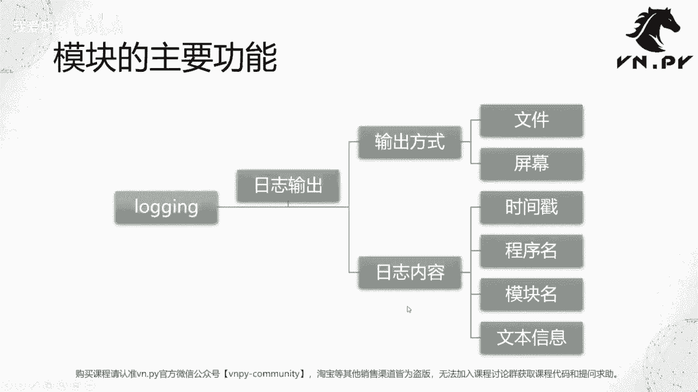

然后第二个要掌握的概念呢，是这个日志的级别啊，也是让我们login模块和单纯的print之间，功能大幅区分开来的，点日志是分级别的，不同级别的日志有不同的重要性啊，它们分别用来描述我们程序在运行过程中。

遇到的一些不同的状况，最低能呢是debug级别，这个叫做调试用的详细信息，这些信息正常情况下我是不看的啊，我也不在乎它，但是如果我比如说我在测呃，再调用一个这个发单委托下单的函数啊。

那么这个debug输出的日志可能一般就是，比如说我在计算我这个委托价格的时候，我在计算我的委托数量啊，以及用什么类型的委托的时候，那么这个计算过程中用到一些临时变量的信息，它呢可能属于debug级别。

然后计算完了，我们自然就调用这个函数对吧，真正把一个单子给发出去了，发完单之后，我们可能要记录一下啊，我这么一个发单的操作，就是相当于我做了这么一个事情，这个级别的日志呢一般属于这边的info级别。

就是我们正常运行过程中的信息，再往上是warning级别，warning级别就是叫做警告提示了，是有风险会出错的，哪些情况呢，第一个你用了一个这个，比如说Python的一些比较老的模块。

这个模块呢可能啊已经很多个版本没有维护了，可能未来会被废弃掉了啊，那你用这个模块有可能会有出错的风险，那对应的就会有一个把提示的信息出来，再往上一级的呢叫error级别，error级别就已经报错了啊。

已经在运行的过程中报错了，那么当然这个错误有可能你通过try except啊，你把它给捕捉住了，对做了一些容错的这种逻辑处理，让程序还能运行，但是即使处理了部分，这个逻辑也是已经出现了异常。

也意味着我们的程序，很有可能是处于一个不正常的状态，你再让它跑下去，风险是很大的，最后是这个叫做critical级别啊，critical就是严重的错误了，这个错误已经严重到什么程度。

就是一个未捕捉的异常抛出来，或者说这个呃，这个这个啊程序直接没法再启动啊，直接退出了，这种呢就叫做严重错误，程序直接终止，没有办法再跑了啊，那整体上日志会分为这么五个级别。

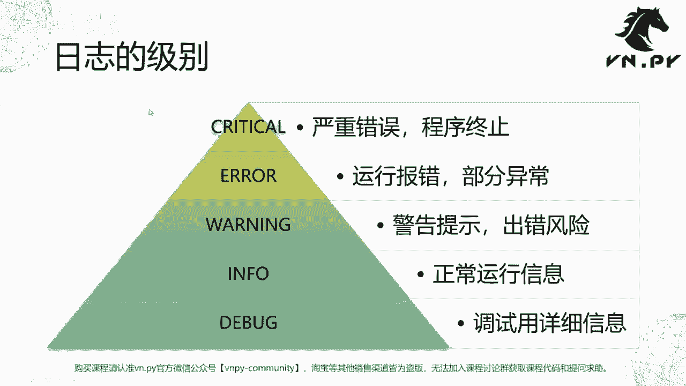

那接下来呢我们就啊讲完了两张PPT的概念，我们就还是来通过JUPITER来这个啊，具体在操作流程里面，我们来看一看啊，每一块它的概念，它的作用啊，我们整体要分成五步，第一步创建记录器，Get log。

第二步添加格式化啊，Format，第三步创建处理器，这处理处理器呢我们要设置级别，设置它的格式，第四步添加处理器到我们的logo上，让它呢能在对应的日志信息过来的时候，做一些处理。

最后一个log点log啊。

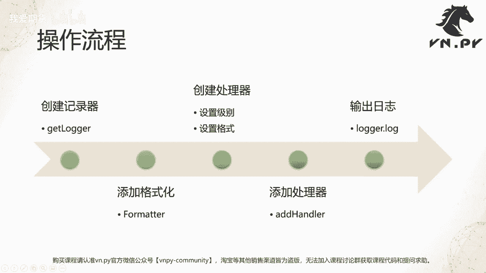

我们去输出一下不同的日志信息，那这边呢我已经打开了，今天我们要用的JUPITER啊，叫43login demo，那么第一步啊，在第一个单元格里面import login啊，然后我们先做个特别简单的操作。

就直接调用login的critical函数来输出一条日志，这个日志呢就是一个测试信息，我们可以看下它长什么样子好，我在JUPITER里面输出的它叫做critical RT，测试测试清晰。

我们在对应的我打印一个print，打印信息，我们可以看一下输出的内容，稍微呢更有格式一点，这样让我们人会更容易去去注意到啊，这地方有一个比较重要，因为刚刚我们提到critical是严重错误嘛。

啊看到红的我本能反应啊，这特别重要，所以我可能会做一些快速的对应处理，打印了就没什么，它就只是一个常规打印而已，你也不会特别注意它，好，下一个单元格，我们就开始正式的进入日志的这个正规化，用法的操作。

第一步我们要准备一个日志记录工具好，我们要创建一个logo对象，调用login点get log括号里面传入一个字符串，就是你当前的这个log日志记录器，他的这么一个名字，我们在一个程序内部。

我们可能有多个地方啊，可能多个函数，多个模块里面，多个文件里面都要记录日志，这些日志信息有可能它属于同一个功能的，它比如都属于test这个功能，我们就get同一个logo，如果属于不同功能的。

那这个可能要给他们不同的名字，在这里，当你每次调用get login，点get log的时候，传入的名字如果是一样的，那他们拿到的这个log都是同一个对象啊，名字是不同的，那是不同的对象。

下面呢我们把logo设置一个默认的级别啊，因为我这边要演示嘛，我希望把所有信息都打印出来，那我就直接设置debug级别，那在debug级别之上的信息，那就全部都会打印了。

然后我们来看一下这一些不同的日志级别，对应的整数啊，我们这边做一个打印叫print啊debug，然后逗号login点debug，就把这些整数常量啊，因为不同的级别，在login里面。

都是通过这样的一个大写字母的常量来表示的，而这些大写字母常量，背后对应的那个真实的数值，其实就是一个整数数字啊，我们把它打印出来，可以看一下debug，其实就等于十这个数字info就是20。

warning是30等等，以此类推啊，一共到50，下面一步我们创建一个格式器了，这个格式器就用来去对我们要输出的日志信息，不管是输出在文件里面的，还是输出在啊界面上的去做格式化的，我们叫locking。

点FORMATTER啊，format就是一个格式器的意思，然后里面输的这个信息啊，你乍一看有点像什么，有点像daytime的这个STRFTI密，传入的这种啊，日期格式的这个这么一个字符串定义啊。

本身它确实也是一种叫做格式定义，用百分号的方式啊，后面括号里面的，括号里面的呢是你要输出的信息，像这个ASCTIME啊，这个就是个时间，就当前啊这个日志是什么时间发生的，然后我这里的这个大括号啊。

大括号啊，不是不好意思，这个方括号方括号你要注意，它跟我们这个啊本身的日志级别信息没关系，他是我想放在这的方括号，方括号里面呢放的则是一个啊，我们当前日志的级别信息，它是debug级别。

info级别还是warning级别，最后是我们真实的日志的主题的文本内容啊，那么我们先创建一个这么样一个格式的格式器，下面有了格式器之后啊，我就可以创建啊，叫做输出处理器的啊，就是或者就叫它处理器就行。

它的英文叫handle，我们第一个要创建的是在我们终端上，或者我们图这个这个console啊，或者就是你管它叫CMD里面，或者JUPITER这个打印输出的信息啊。

它呢叫做stream handler流处理器啊，反正他为什么这么命名，我们先不管它，我们就创建一个string handle，设置它的级别为debug级别啊，只要高于debug级别的，我们都会输出。

然后设置它的格式化工具format，用这边我们这个format啊，然后我们把它添加到logo上去，logo点ADHANDLER啊，把这个stream handler给添加上去。

添加完之后我们再来做一次debug的输出测试啊，我们看一下这个，注意我这里是调用log点debug，不像前面是调用login点critical，直接调用login。

输出的时候是一个全局最高级别的日志记录，输出他没有走特别的logo，你可以认为他是走的这个root这么一个logo啊，这种方式不太常用，因为很多时候我不知道我到底是输的，这是哪个模块输出的。

这种方法不太常用，纯粹我为了演示，在这给他调用，下面这个方法是比较常用，直接创建好logo之后，设置好调用log点debug来做输出啊，回收完了之后呢，我们可以看到这里有个logo，点debug。

测试debug级别的日志啊，我们测试输出这么一个debug日志啊，我们可以看到上面这个啊是我是我这里输出的，然后下面这个内容呢，你可以认为是这里啊全局的log输出的啊，全局login这个输出的。

那我不想让他内容怎么办，我restart一下这两行我不运行好，我直接运行下面，只有我这个log级别的输出，这个就看的很舒服了，什么时间发生的啊，精确到毫秒，什么级别的debug级别的测试。

debug级别的日志啊，你也可以对应的试一试，把其他级别都输出啊，我们下面呢再进一步，我创建一个文件数据叫file handle啊，这文件处理，然后他创建的时候需要这么几个参数。

第一个参数呢文件名我们这边取取名叫test log，第二个参数什么模式打开这个文件，你可以用W模式，用W模式是会造成一个什么点呢，就是每次你在运打开一个系，就就再次运行这个语句的时候。

他会把那个文件打开，然后把里面老的内容给删掉啊，这样你每次写进去的日志都是最新的内容，这个在很多时候是不符合我们的预期的，我们希望的日志是，每次我把新的内容写到这个文件里面，老的内容你不要去动它。

它还得留在那的啊，因为我后面可能要看的，所以我们用AIPAD这么一个模式啊，就往后面加这么一个方式encoding啊，这是用什么格式啊，什么什么什么那个编码模式来输出啊，我们用ETF8。

因为我有可能要输出中文，然后在这呢我们发handle也设置对应的级别，设置对应的format啊，我设置info这个级别，所以debug级别的我们可以预期下debug级别，他就不应该输出了。

因为info是20嘛，它比debug高，它就不应该输出，然后也ADD handle了，把它添加上去，下一个单元格，我们一共输出这么多条信息啊，我们五个级别，每个输出一条，我们看一下结果是怎么样。

首先我们可以看到在啊。

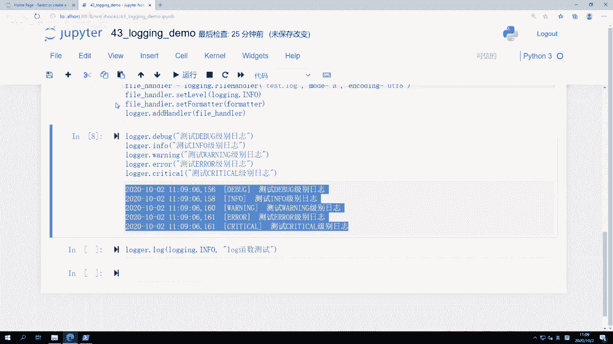

就我们当前这个JUPITER里面，五个级别全部输出了，为什么呢。

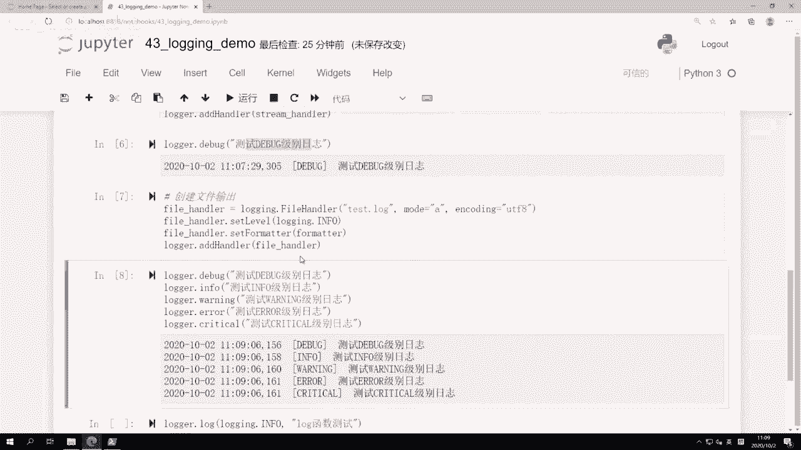

因为我的stream handler是debug级别的，是最低级别的，所以等于在我的这个啊，就是这个这个终端里面输出信息，他会全部输出，debug比他高的都会输出啊。

然后我们去看一下我们当前目录下文件test点log。

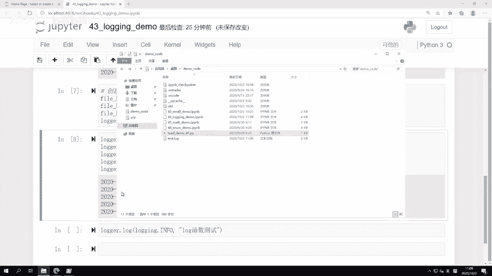

双击打开它之后，我们会发现这个地方只有info级别之上，Info warning error critical，那个啊我们之前用的啊debug就没有了。

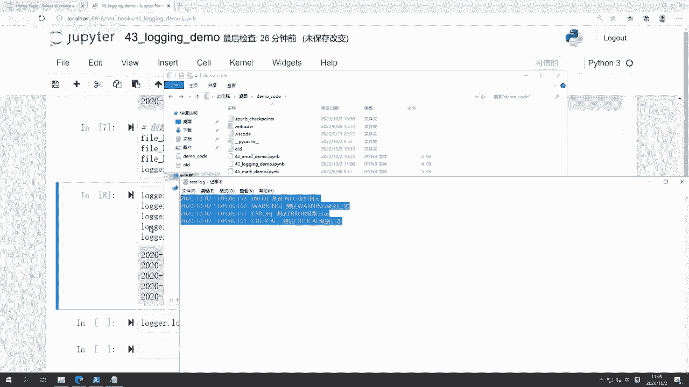

然后呢在但但我们注意到他们俩格式都是一样，都是这个format格式，你可以创建不同的FORMATTER，然后添加给不同的这个handle了啊，这样他们就能实现不同的格式处理。

最后呢还有一个叫log点log啊，我们之前输出debug info warning error critical的时候，大家可能注意到我为了输出不同级别的日志，我输出的调用的是不同的函数啊。

这些函数直接就不同了，但有的时候我可能就想输出我调用同一个函数，但是呢我想输出不同级别信息怎么办，我就调用这个log函数，然后第一个参数呢是login点对应的级别啊，我这输入info级别。

然后呢后面是那个主体信息，你可以认为啊，log括号login点info就等于这里的这个info函数，info这个函数呢就把前面把这个参数给省了啊，它默认通过这个对应的函数去啊，提供了这样回车。

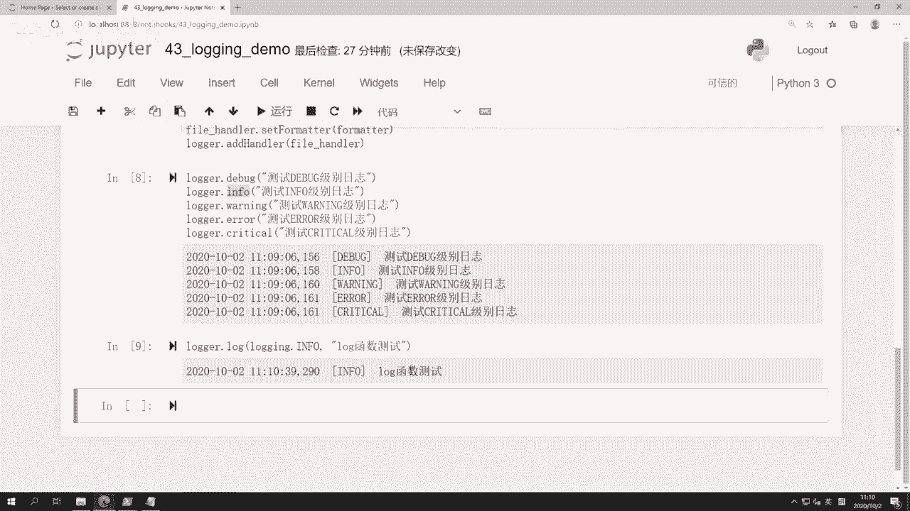

我们也可以看到log函数测试啊，这个info也会输出，那这里呢我把它关掉，再打开的话，我们可以看到底下有一个log函数。

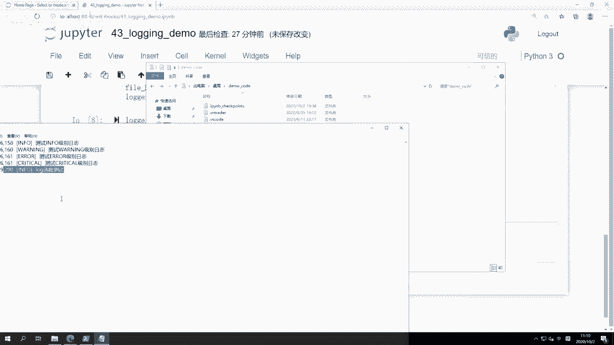

测试的这么一条信息啊，整体上整个logo模块还是比较简单。

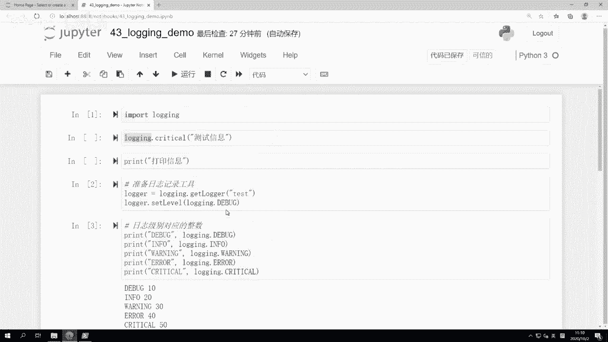

比较容易理解的啊，更多的重点呢在于在实践里面要怎么去用它啊。

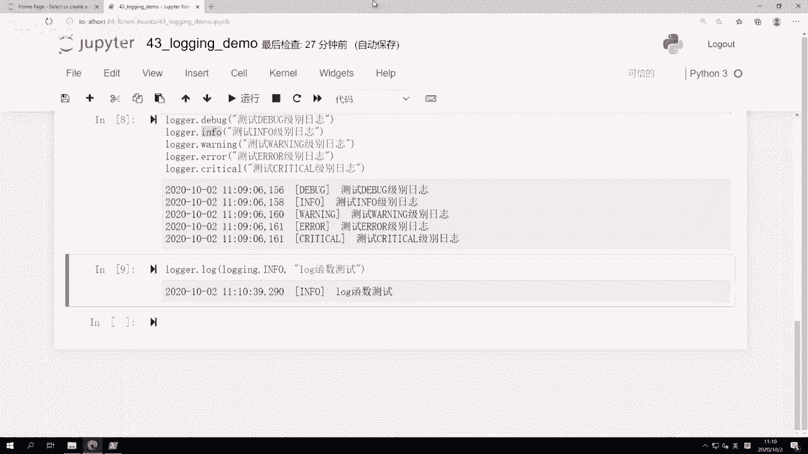

所以呢这个内容我们会后面再来看。

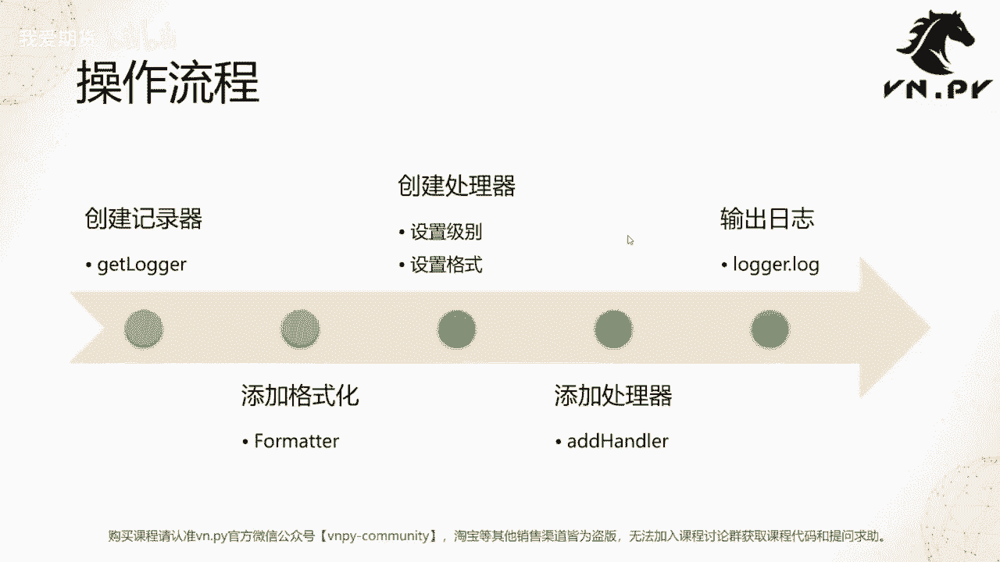

OK那么这节课的内容呢就先到这啊，更多精华内容，还是请扫码关注我们的社区公众号。