# 44.日志记录引擎 - P1 - 我爱期货 - BV1G32gYuE2Y

OK欢迎来到量化交易零基础入门系列，30天解锁Python量化开发课程，那么今天呢是我们的第44节课了啊，上一节课里面我们学习了，怎么样通过Python的login模块来记录日志。

这集呢我们要来看一看V点派内部，基于login模块开发的这么一个日志记录引擎，那么整体上这个日志引擎的工作流程，我们先来看一下三步流程，首先第一步叫做初始化，基于VUE派内部的全局配置。

来实现这么一个初始化的操作，那么在初始化的时候呢，我们主要要用到的第一个就是记录级别，什么级别之上的日志，我们才记录，第二个我们要用到的是这个叫做输出方式啊，就是你要去在这个CMD里面输出。

在在这个终端里面输出，还是要在文件里面输出，还是你都不要啊，这个是我们主要要用到初始化时候的参数，第二个我们可以来订阅日志的事件，你可以默认情况下，我们这个啊，VENDER派的日志引擎。

是指去处理系统级别的日志啊，也就是我们这个最底层的核心模块的日志，同样你也可以手动去添加，对于模块级别日志的这样的一个处理，然后最后呢这个就可以查看输出的信息了，你可以在这个屏幕上啊。

看到日志打印出来的信息，也可以看到这个日志文件对应的输出信息，那么接下来呢我们就啊PPT就这么简单。

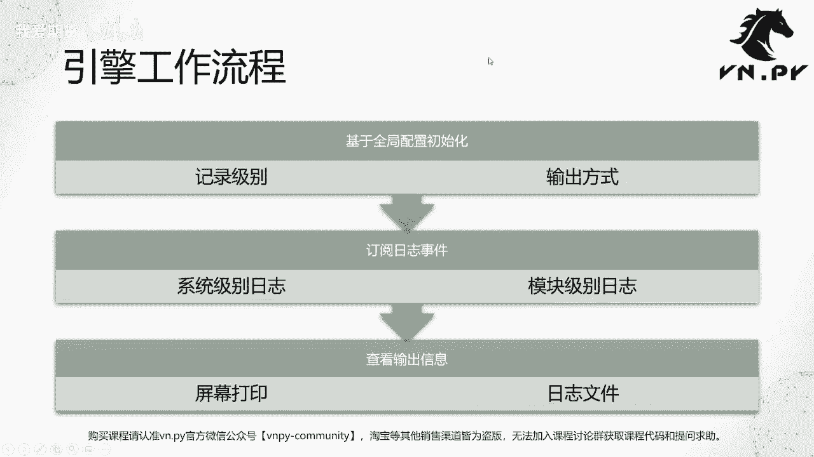

接下来我们就还是到啊，我们的代码里面来看实际的内容，第一步我们先来启动一下van点派，我们来看看它到底这个日志模块是长什么样子，双击VN station，好然后登录。

点击VN trade pro点启动按钮啊，注意这边你其实只要加载一个接口就行了，上层模块加载不加载没什么特别大的区别，因为login它是一个全局的功能，那此时呢我们可以点开这个配置按钮啊。

找到和我们哎这个log相关的这么几个操作，在这里呢我们可以看到log点active，就是要不要启动日志功能，我们现在是TRU的，就是启动状态，log点level当前记录的日志级别50啊。

这个数字我们上一节课学过了50，是什么critical级别，所以只有critical这个级别的日志才会记录，相当于只有最高级别的日志才会有对应的输出，而有的时候呢。

我我可能现在我不止想要看这个critical级别的，我现在想要把最低级别的啊，debug级别的我也要看到，那我就把它改到十这个级别啊，呃你反而可以十二十，三十四十五十这么几个整数啊去改。

那么我这边呢就把它改成十啊，这个第八个级别，然后log点console，要不要在这个终端里面输出信息，默认是TRU的，log点file要不要记录日志信息啊，默认也是TRU的，就也也是这个啊要的。

然后这样呢我们点击确定按钮先保存一下啊，他会告诉你诶，这个全局配置要修，重启VNTRIDER之后才会生效，那此时呢我们就要啊这个配合一点，去做这个重启了，等会我们要来连接CD呃。

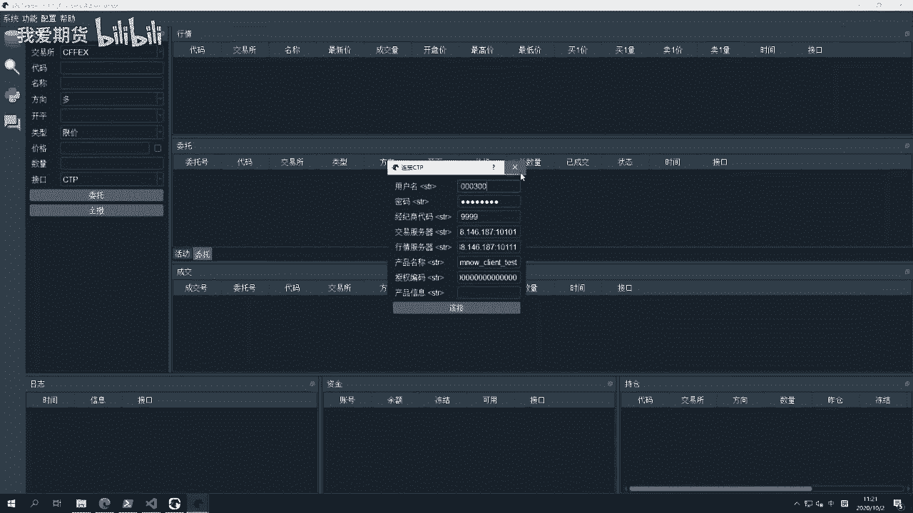

这个CDP的接口哈，我们看一看它这个运行过程中，会有什么样的状态，那为了看到我们的日志，在额这个console就是终端里面打印，但这个时候我不能在纯图形界面去启动。

我把那个啊我们的console也给打开，就打开一个P呃，这个power shell，然后Python杠VN station，点击登录按钮，vta pro啊进去，那大家可能还记得啊。

就之前我们其实也有提到过。

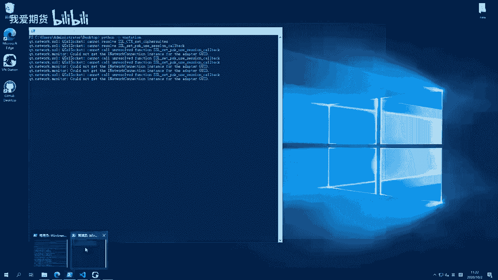

这里输出的这堆以qt开头的信息，那么都是和啊这个底层的chrome，那个叫chromium的这个浏览器模块相关的，和我们van点派完全没关系，他是VN station进程里面发生的那些事情。

和我们V点派没关系啊，所以你你可以不用关注他，他就是个纯粹的记录而已，哎但这个记录啊对应的就是用qt的，他自己的日志模块记录的，你可以看这个也是和我们有点像啊，哪个模块，哪个组件发生了什么。

他就这样记录的，当然了，我我们用的是Python里面的日志模块啊，这个时候我们点系统连接CDP啊，我们要稍微改一下，在这个啊，因为在国庆期间啊，他是没有那个实盘行情的，我们就要换一套服务器。

30231点连接按钮诶，这个时候连接上去，我们可以看到左下角这块区域的也是日志，这个就登录成功的日志信息，那我们可以看一下，在这个里面已经有相应的日志输出了，当然这些日志是属于info级别的。

如果我们刚刚没有做那个调整的话，我们应该知道就这个日志信息是不会输出的，但是因为我做了这么一个调整之后。

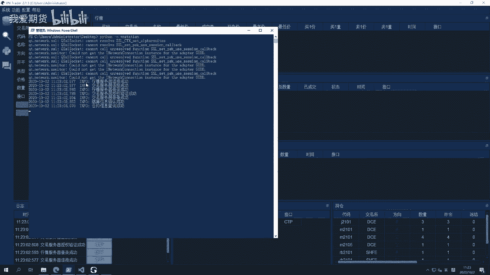

它在屏幕上就会有对应的打印机出来，同时呢我这边再进到啊，我们用我们这个一个叫做比较关键的操作系统，级别诶，这个C盘用户目录下，administrator里面的点van trader目录。

所有van der pd在运行时候的目录都哦，不不好意思，在运行时候的日志都会放到点VN吹的啊，文件夹下，它都在这个log文件夹里面，然后不止这个日志啊，其实整个VN点派的程序在运行的时候。

如果要生成什么啊，缓存用的这个临时文件也好，还是有一些配置文件信息也好，都会放在DVN区的目录下，我们可以看到这里有个database点dB啊，我们之前学过用CSV导入啊。

这个历史数据到我们VN点派的数据库里面，那个数据库就是这个database的dB啊，它是一个circle light的数据库单一文件的，然后我们的一些全局配置，比如上节的这个。

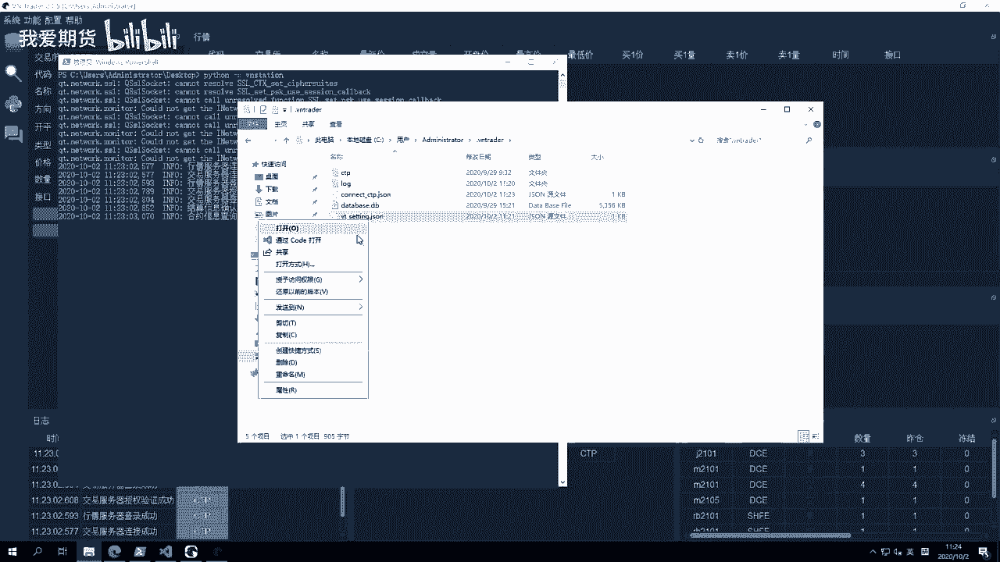

刚刚我们修改的那个login的配置，那他就在这个vt setting点JSON文件里面，我们可以看到对应的这个，刚刚我把logo点level改为十了啊，所以这些配置信息是通过它来缓存的。

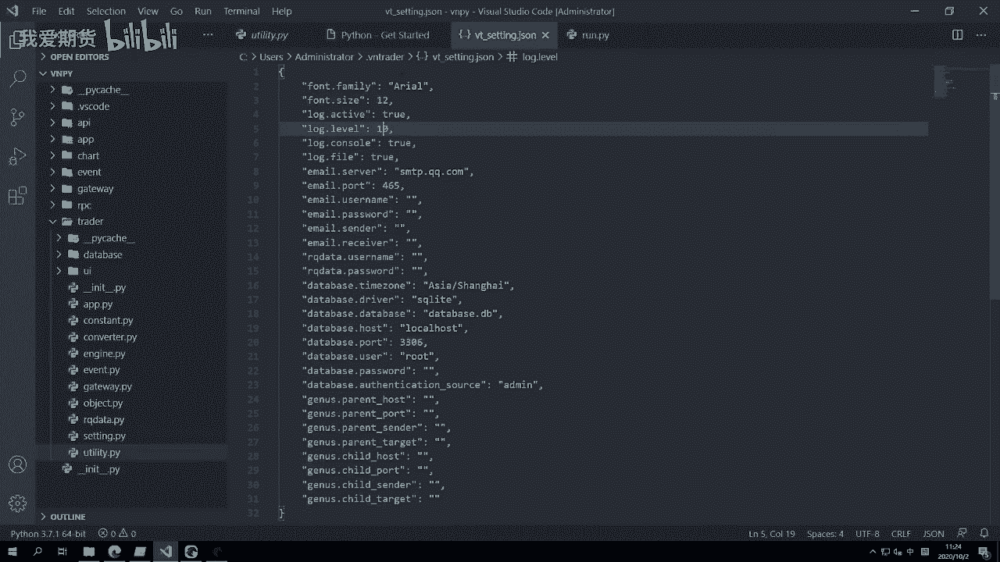

那这个CCTP的目录，这个是用来保存的这个CCTP本身的啊，通讯的时候他要用到一些流文件啊，就这点CON结尾的，留文件的这么一个缓存信息在这个目录下啊，其他的如果你用到更多的模块。

更多的van der pad功能，对应的这个点，VNTRI的目录也会变得更大一些，它会保存存更多的信息，那这个时候我们点开这个log啊，点开VLOG目录，今天是10月2号找到，你，可以看到这个日志。

是按照你运行的日期来记录的啊，9月29号日志就在这个VT杠，20200929点log这么一个文件里面，今天呢就在1002这么一个文件里，点开之后，我们可以看到A对应的info相关的日志信息。

这里都有了啊，所以通过这个方式呢，我们就能很方便的去啊，把对应的这个程序。

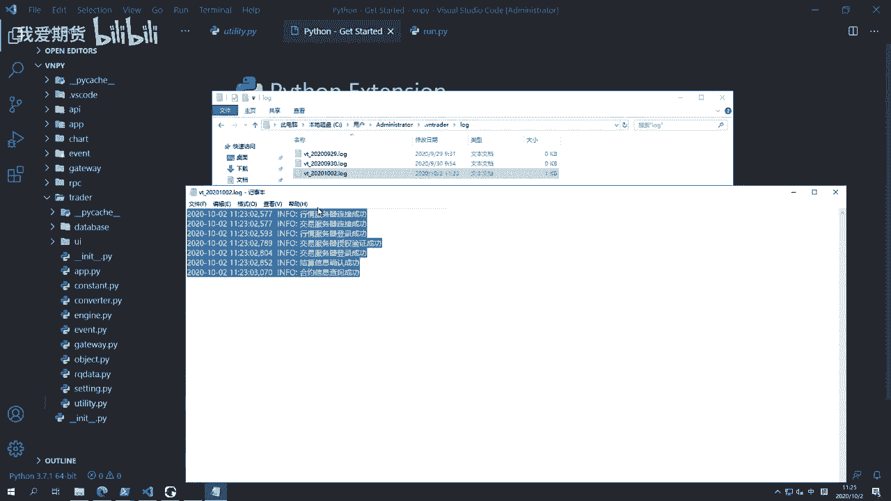

运行过程中的日志信息记录下来，但现在啊注意现在会记录的日志信息，只有我们这个模块的，只有就这这这这里这个窗口里面会显示的，我们会记录它是属于VINDEPD，叫系统级别的日志信息。

那对应的模块级别的日志信息，这里是不会记录的，怎么样去管理这个功能呢，就进到我们van点派的这个engine点派里面啊，找到一个模块叫做log engine，那么呃log engine啊。

在它里面涉及到一些和线程，和这个这个队列相关的信息，这块的内容我们还没讲，所以呃我们先看它和login相关的逻辑啊，这个lock engine是我创建一个类，一个log engine类。

然后这里super操作啊，这个大家都知道，反正就是把一些父类的参数传进去，那么然后我们会做这么一个检检查，if not settings log点active，这个settings是我们的全局配置字典。

就写在刚刚我们看到v t setting，那个JSJSON文件里面内容，如果我看到这个时候你没有启动日志框，log点active这个字段是false的话，我就不去执行下面的逻辑。

因为反正你没有启动日志功能，我没有必要去初始化这个日志组件了啊，如果你设为true的话，我才去做下面初始化，然后把它对应的级别给读出来啊，这个对应的到底是呃。

这个这个这个critical的50还是debug的十，把它读出来logo啊，这个logo我们在这里就创建一个它，我们全局V点派，整个VN trade里面。

全局都叫这个VNLOTRADER这么一个logo啊，然后logo的啊级别设置好，就用我们设的那个级别format格式器设置好，然后我们要先做一件事情，叫ADD now handle。

就一定你要添加一个处理器的，你创建一个这个logo之后，一定要添加一个处理器，不然的话在运行过程中有出，可能出现一些奇怪的错误，但是我是否到底要在CMD里面输出，还是我要在这个啊文件里面输出是不一定的。

如果我这两个一个都不输出的话，那虽然我这个logo被创建了，但其实就没有处理器嘛，这时候就会出一些问题，所以这里啊为了啊通用，我们先来ADD一个NHHANDLER啊。

login创建一个null hand handler，什么都不做啊，嗯这个你可以看到他这里提示有个，It's intended to be used to avoid the。

No handlers could be found for logg，叉叉叉啊，这个提示说白了就是你在用login模块的时候，一定要有一个handler，如果一个handle的都没。

就处理器都没创建的话，就会有这个NO handle scbe found的这么一个呃，报错信息，所以呢这就为什么我们先来把它创建一个，他本身什么都不做，所以你创建它也没有额外开销。

现在调用这个ADHANDLENHANDLER方法啊，把这么一个NHANDLER创建出来，然后ADD上去，下面下面呢如果settings的log点console设为true的话。

那我就会创建这个console handler啊，就是我的这个终端里面的这个处理器啊，那console handle就其实就stream handle了，那这个逻辑我们刚刚在上节课的那个JUPITER。

里面我们都讲过了，就完全一样不重复了，file handle文件处理器，这里有个就要注意的，为了去实现啊，每天的日志我写到每天的文件里面，所以这边啊我这个today date，然后我取了一下当前日期。

把它格式化到年月日，然后呢我创找到这个文件，file name等于VT下划线，跟上日期，再点log这么一个file name，然后这个我这个这个日志文件的pass，我就要用到之前我们那节课讲的那个啊。

Python呃，就是van der pon内部怎么样去记past live，去构建我们APASSLAVE和JASON，构建我们这个全局路径的这么一个函数，就get for to pass。

找到log文件夹，位于我们点VN trader下的这个完整路径啊，把它给出来，然后再在log文件夹下去，加上今天这条日志的这么一个日志日呃，这这么一个呃这个文件名啊，把join pass上去。

得到我们file，就是今天我要创建的这个日志文件的名字，那此时日志文件名有了，我就可以去创建file handle了，这下面的逻辑跟我们上节课都一样啊，注意要用A模式，要用于TF8编码。

这样我们就啊完成了所有和日志相关的操作，第三步呢叫register event，注册事件监听怎么注册呢，我们VOR派内部所有的不管是行情也好，日志也好，所有的其他包括策略运行过程中，一些状态变化也好。

这些信息的异步的传递都是通过事件来实现的，事件这个概念，因为它是涉及到一个Python比较复杂运用，所以在我们这个啊，这个这个30天解锁的课程里面，并不会提到，我们更多就讲一个它的用法。

你可以看到我们这边REGISTEVENT的时候呢，做了一个这么样的操作，叫sele event engine，点register event log啊，Safety process log，Event。

我做了这么一个操作，什么意思，event log就是全局啊，就是做这个VENTRY的系统级别事件的类型，它叫event log，所以此时没有一个event log的时候。

就会来调用我们这个process log event函数去做处理啊，在这个函数下，我们可以看到，我们把这个log从event data数据里面取出来，然后我们就调用log点log函数。

把这个对应的级别对应的啊，这个这个字符串信息给记录下来啊，就这么简单，所以你为了去处理其他的啊，这个事件类型的时候，你可以做一个比较简单的啊操作啊。

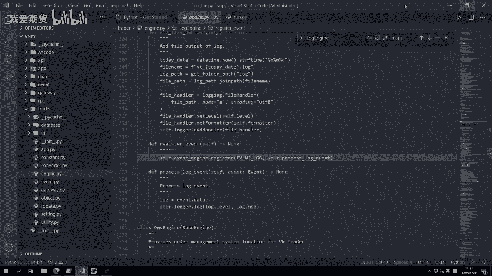

其实只要加一行代码就能实现了，我们这边也给大家演示一下demo code里面啊，我们来创建一个。

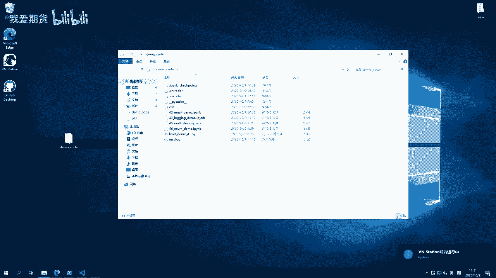

我们同样啊打开VD派的官网给他呃，不是官网，我们的这个GITHUB的网站，找到examples，VN trader好把run点派的内容给复制出来，是啊，我给大家一个后缀吧，44啊，这节课是44。

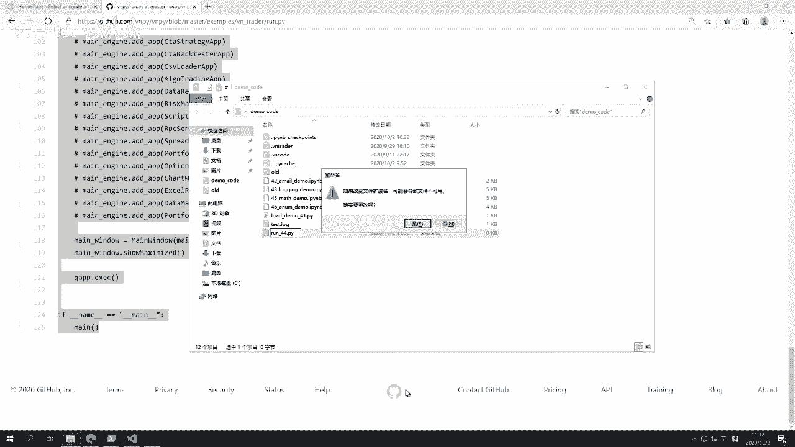

然后来修改它，好这里我们把内容连接进来之后，还是跟上次一样啊，把不需要的内容给删掉，只保留我要的部分，啊，但是在这呢我希望额外加一个加载一个模块啊，gateway一点这个哎，不好意思。

app点ccta strategy import，我加载这个CCTA模块啊，然后在main engine里面我除了去添加，这个CCTP给TV以外，我还要去添加这个我们的app啊。

就上层的这个模块c t a strategy app啊，然后剩下面这些内容都都就可以去掉啊，没关系啊，最后是创建这个主窗口啊，这反正整体上启动脚本很短，但是它对应的每个背后都有一些逻辑啊。

因为不是我们这个课程的核心内容，所以我们先不管它啊，在这个里面呢，我我想要去监听，等会儿我们看到啊，strap这个CTA策略模块的日志，那我还要加载一下CCTA策略模块日志的，这么一个事件类型。

对于他的这个base诶，base文件的里面有个叫event ccta log，你可以看到这个啊，他event ccta log，然后在这啊，我们添加完了之后。

我们来获取下log engine等于main tg点，get pg locked啊，什么意思，我们可以看到这里log engine在创建的时候，他有一个第三个参数命名，就这个这个引擎啊。

在我们整个VOR派的主引擎里面，它名字是什么，它就是一个小小的log啊，它可能有很多，我VENDER派的主引擎里面有多个引擎啊，分别针对不同功能，有log引擎，有email邮件引擎。

有那个OMS引擎用来做缓存的，也可以根据你的需求加很多其他引擎，什么data引擎啊等等都可以啊，那么呃不同的引擎当你要用它的时候，你就需要去调main engine的那个get engine啊。

就是通过某个名字来获取，那这边我们获取完了之后呢，就拿到啊，这个关了啊，拿到这个log引擎的句柄，然后调用这个event in，Engine，点REID注册一个事件，监听什么事件的呢。

Event city log，然后这个事件我要用什么函数去处理呢，Log engine，点process log event，什么意思，啊我们把这个拉到右边来，其他的部分其实我都不用过去，不用去看啊。

我们现在不关注它，我只要知道在这里有这么一句操作，Register event，这个函数是核心的，让日志引擎能去收到我们全局日志，并进行对应处理的这么一个函数，就register event。

它的作用呢就是往事件驱动引擎里面去注册的，一条告诉事件驱动引擎，OK你只要收到这么一个event log了，就日志事件全局的日志事件，你就来帮我，你就来通知我。

调用我的process log event函数做对应的处理，这个是一个叫做异步啊，调用的这么一个逻辑，反正什么时候发生，我login不知道，但是呢只要发生了，你event engine。

你这个事件引擎会知道，那你就来告诉我就行，我们在这里操作就类似的，我们获取日志引擎之后，调用event engine register啊，跟这一样的，然后注册这个event ccta log。

然后呢log engine点process log event，你看跟这类似，只不过少了一个self，为什么少了self，因为这里的register event是在一个类下面的方法。

而我们这里写的这行代码是在一个主函数，就main这个我们一个函数里面的操作，event engine是我们在上面已经创建了，所以你不需要任何的self啊，这个也和我们在这个课程最早的时候讲过。

就什么时候用self，什么时候不要用，其实就看你是在是不是在一个类里面，类是不是在一个类的方法里面去写一个逻辑，你就可以知道了啊，如果你的这个要访问的对象，它是属于这个类下面的，那你肯定要加self。

反之则不用啊，这样处理完了之后。

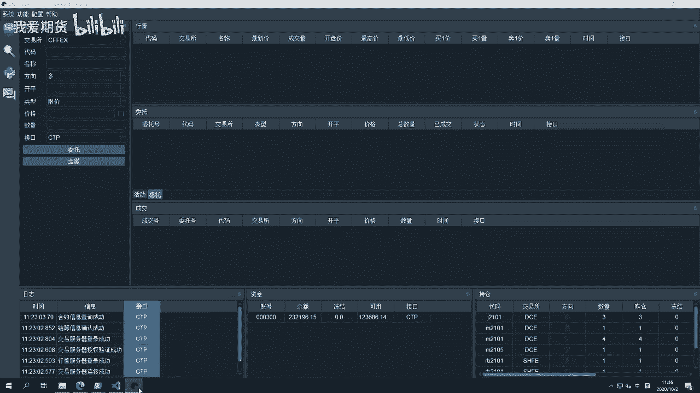

那我们把这边吹的给关了，我们在当前目录啊，Python打开power shell。

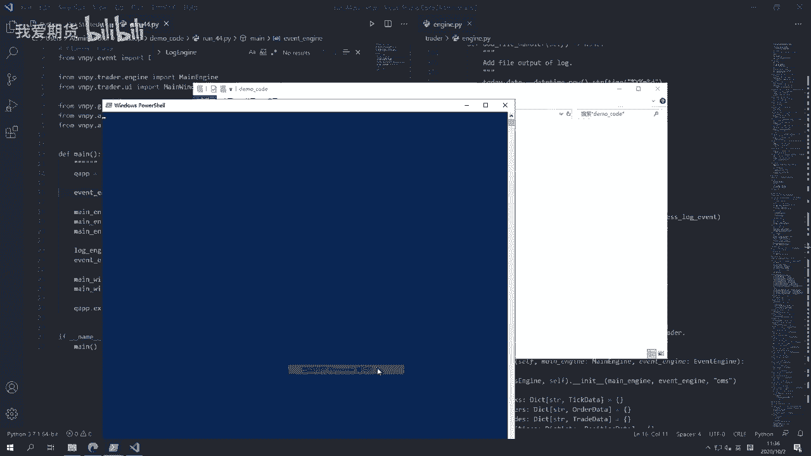

直接Python run点拍啊来启动，那此时呢我们可以看到啊，我们还是诶呃呃当然这个配置信息就没了啊。

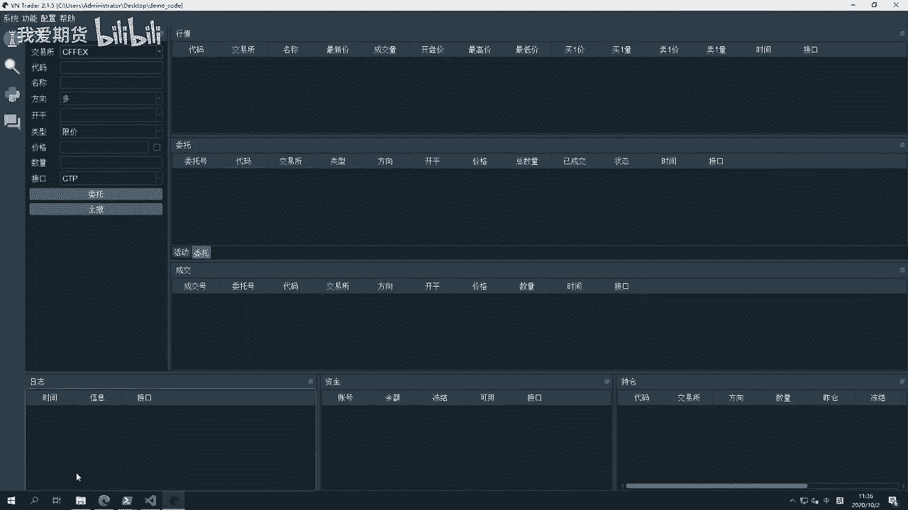

没关系，我来把这个，因为此时启动时候是用我这个点VENTRY的啊，我们之前一节课里面创建的临时目录，而这个点VENTRY的目录下。

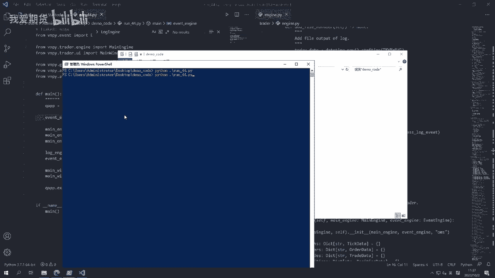

是没有我账号信息的啊，所以我们刚刚看连CDP就看不到，我把删了之后再启动呢，他就会去用我用户目录下的那个点V吹导，我就可以看到信息，现在连它啊，然后这边我来创建一个CCTA策略，怎么创建不重要啊。

怎么创建，你现在可能还就是，因为我们这个不是讲VA派本身怎么用的课啊，所以啊你可能不熟，但是你可以去看后面的，我们有个CCTA策略课程的课里面有详细讲解，我们现在主要还是关注日志，点添加策略。

随便添加一个策略名字test test啊，点完之后，然后点初始化，这里呢会有一些日志输出，你看到啊，尽管他有个报错，因为找不到那个就是我的合约代码错了啊，因为它不是v t symbol。

我们就提到v t symbol一定要交易所后缀，我这边输入个test没有点啊，它后缀，所以他这报错了，但没关系，我要的是是质，我们可以看到这日志已经有了，那我再回到power shell里面。

可以看到第一个啊。

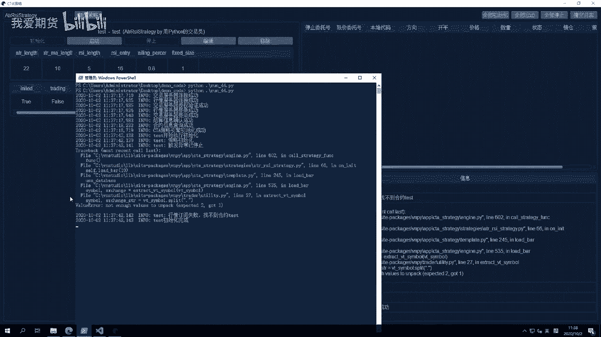

第二个我再去看之前哎，我用户目下，里面的这个日志啊也都有了，所以此时我就不只是记录了我的啊，这个系统级别的日志，我还记得我CCTA模块的日志啊，当然可以根据你的需求进一步去扩展啊。

进一步去啊包含更多的信息，那啊包括这就VOR派内部吧，绝大部分模块的这个日志，我们统一用的都是同一个数据结构，就VOR派最底层那个log data的数据结构，所以你都可以很方便的。

把这个对应事件类型的监听添加到log呃，这个event engine里面去啊，把它，然后就这个只要有这个事件也会来调用，我们这个啊log engine process log event。

这样呢对应的日志就全部能记录输出出来啊，这是一个比较啊，可能比较方便的点吧，OK啊。

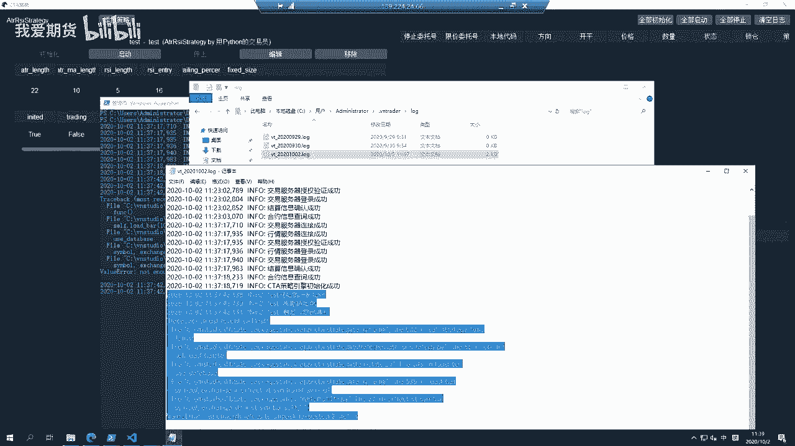

那么这节课我们这个关于log engine的逻辑讲解，到这里呢也告一段落啊。

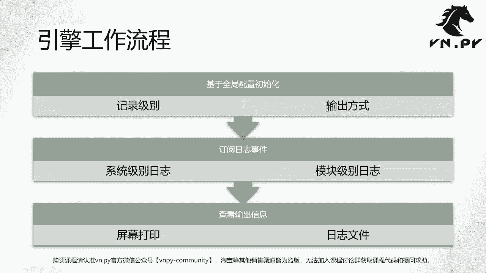

那么大家如果有任何问题的话，还是推荐去我们官网呃，尤尤其是最近几节课越来越多，我们在讲到这个嗯VN点派内部的代码逻辑的。

所以会对比之前啊，我们单纯讲Python的代码的时候，会有难度会有一个提升，所以大家如果真的遇到什么问题，不会的话，还是请来这个啊，我们论坛VPY点com杠for啊，或者你直接点这个社区导航栏社区也行。

然后这有量化交易，零基础入门来这个专区里面提问就好啊，有任何问题的话，我们反正都有同事会及时来看。

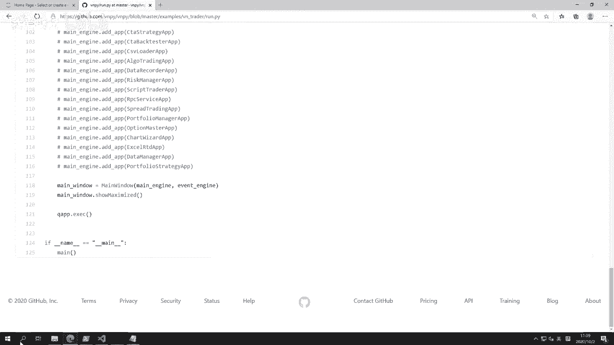

OK啊，那么这节课的内容呢就先到这里。

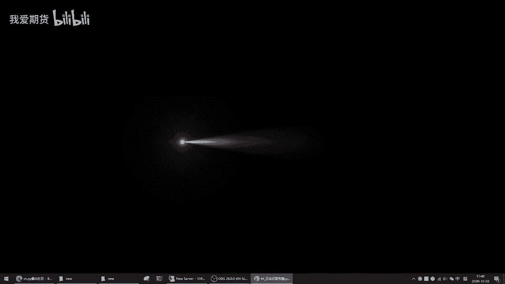