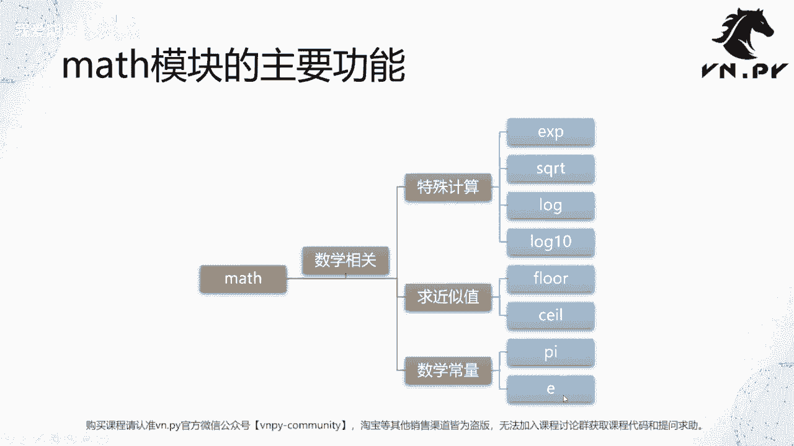
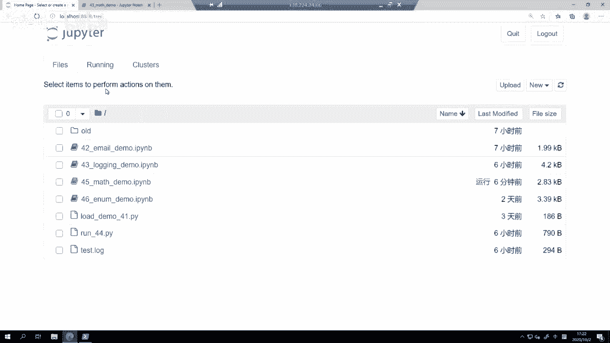
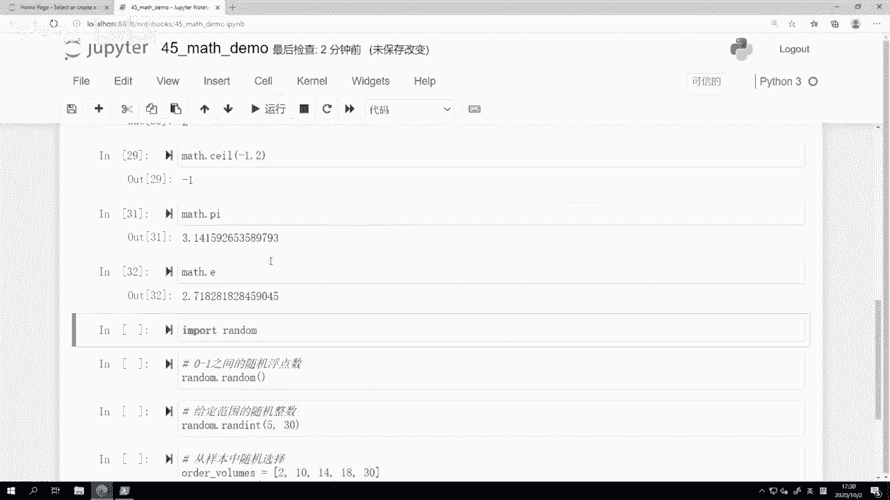
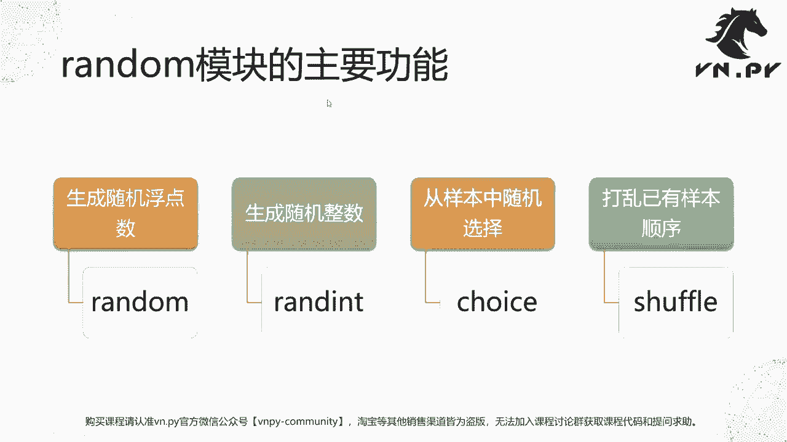
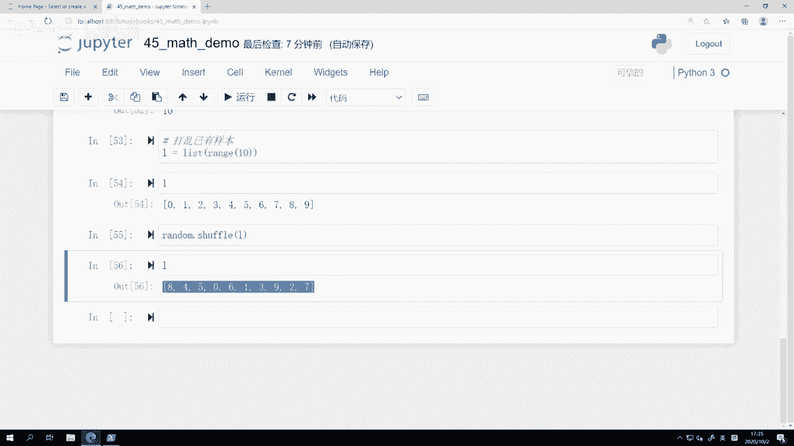

# 45.math模块 - P1 - 我爱期货 - BV1G32gYuE2E

零基础入门系列30天解锁Python量化开发课程，那么今天呢是我们的第45节课了，在上一节课里面，我们学习了，怎么样基于login模块来实现，VN点派内的日志引擎，那么这节课呢我们要学习两个新的模块。

分别是max和random啊，主要是两个跟我们数学计算相关的模块，那我们先来看max模块的主要功能，那从这个名字上，其实顾名思义就应该能猜到，它主要就是跟数学相关的，整体上max模块下提供的都是函数。

这个函数呢大体可以分为三类，第一类叫做特殊计算，或者呢就叫做一些啊，这个数学里面的函数计算的这么一些功能，比如说求指数的EXP啊，比如说求平方根的XQRT啊，比如求这个对数额不同底的对数的这个log啊。

log单纯的log就是以这个自然对数为底的log，十呢则是以这个十为底的啊，然后是求这个近视值啊，近似值的话呢包括floor和CEO两个，那么我们之前已经学过run的这么一个啊。

这个这个求四舍五入的floor和seal呢，则是分别往上和往下求取整啊，最后还有我们数学里面常用的两个常量，一个是派啊，圆周率，还有一个是一自然对数。

那么接下来呢我们就到JUPITER里面，来看一下这个模块具体怎么用的好。

我们这节课是叫四数mass demo啊，那么这节课的其实代码就很简单啊，整体上就是每个函数我们把它调用一下，然后看它输出结果长什么样子，第一步import math啊。

第二个单元格就是max点EXPE啊，这里我们先来看一下它出来的结果是什么，2。71828的的的这么长的一个数字，那这是什么，这是自然对数的那个E本身啊，所以这个EXP呢。

其实是你在求自然对数的多少次方啊，就他的这个指数运算一的话，那我们知道任何数字的一次方就是它自身，所以呢出来就自然对数，如果是零的话呢，那自然就是一啊，如果是二的话，那就是自然对数的平方等等，以此类推。

第二个函数呢是max点SQRT啊，这个就是求平方根了，那四的平方根我们知道简单2。0，注意出来的这个平方根的数字既是四的，平方根是二，它是一个整数，但是出来的结果也是一个2。0，就是它变成浮点数了啊。

这是一个要注意的点，如果你确定你一定要整数的话，那要在前面加一个int转化啊，这样才能把它确保转化成一个整数啊，当然很多时候可能在Python里面数值计算，浮点数和整数都可以直接算了，所以影响不大啊。

我们也可以对九求一个，或者我们对一个八求一个啊，他因为没有这个整数的平方根，所以呢就会出来一个就是浮点数的结果，然后下面我们要看的是一个max点log啊，这个log是求一个自然对数的log啊，举个例子。

我们呢先在上面啊，我这边的这个直接就先看这个例子吧，max点E我们在上面一个单元格来看一下啊，它是这个一个常量，就是我们刚刚在这max呃，max等于EXP等于一出来的这个结果啊，就是这个自然对数本身。

然后我们对自然对数本身求它为底的，这么一个log的话，也就是常用的那个LN啊，就是在我们数学写公式的时候，手写公式的时候，它一般写成LNLN这么一个模式，那出来结果呢以自然对数求自然对数自身的底。

那结果自然就应该是一啊，如果你在这求自然对数的平方的话，那自然就应该是二啊，所以这个也容易理解，就log它虽然叫log啊，但他的底数是自然对数，那就这个E然后如果有的时候啊。

我们可能要求一些围绕着十的底的对数的话，那就要用log10这个函数了，这是不一样的啊，log10就是以十为底的，那么如果是100的话啊，我们来个1000好了，自然就是三。

所以这个是用来求以十为底的这种对数，那么上面函数的计算主要就这么几个，其实也挺简单的，快速的过一遍，掌握了就好了，下面是两个在我们VN点派里面啊计算，尤其是经常在计算委托数量的时候。

非常常用的函数就是floor和seal，这两个函数的作用呢，分别是往下求整和往上求整，怎么来算，我们来看max点floor，4。5往4。5，我们知道它往下取整的那个，最近的整数应该是四。

所以这边出来的结果就是四啊，你如果是比不管是什么4。1还是4。9，反正只要是四点几的数，往下取整的结果都一定是四啊，这个就是叫做呃这个向下取整，对于正数的向下取整。

是取到它最就最近的那个比他小一点的正整数，但是对一个负数的取整呢则是取还是往下取啊，注意flow一定是往下取，那么这里的往下去不是在绝对值层面的，而是在这个带正负号的数值本身的，所以4。5往下取的话。

它不是四，而应该是五啊，这是一个要很很重要的点，一定要注意在做floor，或者下面seal这个往上往下取整的时候，他是不是按照绝对值去考虑的，它是按照数字本身去考虑的，在这里不管是-4。1也好啊。

还是-4。9也好，往下取整的结果都是取到五，它不会取到那个四上面去啊，所以这是第一个要注意的点，seal是往下取整，floor我们知道地板的意思，seal就是天花板的意思，往上取整1。2的往上取整。

取到多少，应该是二啊，然后反正只要这个二以下的一点几的往上举阵，都是二反Y1。0，如果我们把它取整呢，就应该是一本身，而这里floor如果是4。0取整的话，它也会取到个四区啊。

所以注意对于一个本身就是整数的啊，后就后面是点零的这样的一个浮点数取整，它会取到这个整数本身来啊，他不会再有往上往下的这么一个操作，这也是一个要注意的点，最后我们也来看一下。

对于一个啊负数的往上取整会怎么样，-1。2往上取整就应该会取到这个啊一取，而不像我们这对1。2区间取到二去了，所以这是一个要掌握的概念，那max和floor函数，我们这边也提一下它的一些应用场景。

比如说有的时候我们可能在计算啊，我可能做那种价差交易，这个我分多条合约腿啊，同时去做，我可能一边做股指期货的啊，这个当月的合约，一个是做股指期货，下个月的合约那两条腿啊，我有的时候对冲比例可能是一比一。

但有的些特殊的情况下，比如说你可能一边做F1边做IC的情况下，它对冲比例可能不是一比一，所以你可能基于市值对冲法等等相关的对冲，所以有可能会导致说OK1条腿成交了，五手算下来，另外一条腿这边应该去成交。

比如说3。8首啊，3。8首，尽管他是一个啊，就是这个就是一个非整数，它是一个浮点数部分，但我们知道我们在下单的时候只能下整数，此时你有几种不同的方案，你可以说我把四舍五入啊，3。8，四舍五入到四。

我去下四手，但这样呢有可能导致你的对冲部分会超过去，所以另外一个更常用的方法是3。8手，我先往下取，整取到三首，然后先把三首对冲掉，那如果被动腿这边后面再有一定的数量呃，呃不好意思。

主动腿这边再有一定数量对冲的时候，它可能呢又会多出一些量，那个多数的量啊，到我右边来了之后，有可能就把我这个数量配齐了，所以此时呢我又可以对冲啊，所以这是一个很重要的啊。

这个啊啊这个这个交易的时候用到技术吧，就floor和CEO啊往上往下取整，因为我们大部分的交易接口，发单的数量都必须是整数啊，你除了四舍五入以外，另外一块更常用的操作，可能就这样往上往下去走啊。

最后两个要讲的是max点派啊，这就是圆周率很简单，3。14U92啊，得得得这么长，一个还有max点E刚刚其实已经看过了，就自然对数的这么一个数字，那么这两个呢也在很多时候可以作为一个常量。

直接在我们Python的啊代码内部，用，它会带来更快的计算速度。

OK那这样的max就讲完了，我们下面看random模块，random模块主要的功能啊，他的这个random词的意思就是随机对吧，随机数或者随机做一些操作，所以对应啊。

这个模块主要功能就是生成各种各样的一些，随机操作，第一个我们直接生成一个随机浮点数，就是random函数，第二个我们来看生成一个范围内的随机整数，叫做render int。

然后第三个这个很多时候也挺常用的，从一个给定的样本里面随机选一个啊，我们有的时候可能不止想要说一个随机整数，我可能我定好样板，你随机给我选一个，最后还有个shuffle。

它的作用是把已有的这么一个列表给打乱，它的排序啊，我们来看一下这四个函数的功能。

那么同样在JUPITER里面，第一步import render啊，然后我们来求一下0~1之间的随机浮点数，非常简单，就调用random点，random函数，这个函数和模块是重名的啊。

或者你也可以from random prandom，那直接调就这个，那他每次你看我这边，每次运行的结果都会不一样的啊，每次都不一样，那当然了，这个所谓的随机啊，在我们计算机层面。

它其实是有个叫随机数种子，基于一定的算法给计算出来的，这么一个随机结果，它跟时间相关，跟什么很多很多各种各样的东西都相关啊，尽可能他会保证一个就比较随机的，这样的一个数据分布，但其实啊在最底层讲的话。

他也不完全是随机的，因为有那个种子的存在啊，它是基于那个种子，按照一定的随机算法给算出来的，近似于现实世界里面我们数学上的随机概念，但啊刚刚那个是题外话，但我们这边反正你调random点。

random几乎不太可能生成出两个相同的数字来，应该每次掉的这个结果，因为小数位非常多，但这个出来结果都是会变的，就是0~1之间的一个随机浮点数，然后第二个我们要看的呢，是叫做给定范围的随机整数啊。

Render int，这个也是一个非常常见的操作，尤其在我们交易的时候，执行算法下单的时候非常常见，比如说我可能啊，这个我一共要执行1000首的委托啊，我一定一共要买1000手的量。

但是呢我每次下单的话，我可能希望它不超过这个50丑，但我也不想每次都下个50丑，因为这样很容易让别人看出来，这个地方有个人一直在买，因为他老是五十五十五十买，那肯定很容易被人看出来。

更聪明的方法是在一个范围内，每次选一个随机量下，像我刚刚第一次运行是30对吧，我再运行一下，他就取到21去了，再运行一下，取到24去啊，因为是取整数，所以比较容易出现重复的情况，但是这里的重复没关系。

他都是按照比较一个啊平均的概率取的，所以此时呢这么一个结果的话，我们在下的时候，第一个都是整数，所以我们底层交易接口下整数量没问题，第二个因为是这个随机会变的，所以就不太容易在盘口上被人看出来。

说哎这里固定有一个人在哪，我知道他的意图，所以这个是一个render int的应用场景，第三个呢是从样本中随机选择了，我可能不只是希望哎，在5~30这个里面随机选一个整数，我希望给定一个范围啊。

我要么是两手，要么十首，要么14首，要么18首，要么30首，五个值，你就在其中给我选一个，你不要给我去选什么345这种啊，我不要那些数值，我就要我这边定好的，那random choice的作用。

就是从这个列表里面随机给你选一个出来啊，我们这样运行完了之后，看第一次选的二，第二次选的14，第三次18啊，这个每次他选的是随机的啊，所以有可能出现重复，也有可能呢这个就是按照顺序啊等等都有可能。

但其实大部分时都是乱序的，他只是随机选，我们这里有五个样本嘛，所以每个选到概率都有20%，重复的概率挺高的，最后一个呢是叫做打乱已有的样本，我们这边先生成一个列表啊。

这个L等于啊list range10，我们生成这么一个列表好，我们看一下L里面的内容，然后我们点random点是FL好，这个就已经打乱了，我们再弹一下L0的内容，看啊他的排序就已经完全被打乱了。

而且这个打乱顺序也是一个随机的打乱，这样有的时候呢我们可能呃在做，比如说啊这个交易系统的遗传算法优化的时候，像我们遗传算法底层的那个啊算法，在生成每一组优化参数的时候，他用的就是一个随机算法。

去不断的在每一代的结构里面去打乱啊，然后去啊选其中一些好的结果啊，那就去选其中样本来优化，然后把好的结果留下来，把坏的给丢掉。

所以这个shuffle呢也是非常常用的一个操作，OK呃，那么呃围绕着max和random两个模块的讲解呢，今天就到这儿啊，整体上其实也都挺简单的啊，你看我们的演示，每个都是单一行的函数啊。

这么一个数学函数的调用，max模块本身就是啊用来当做这样的一个，有点类似于计算工具，或者说呢像Python内置的，比如说取max去mean，去round等等这种函数，快速的去实现某种常用的计算功能。

所以嗯讲的话很简单，但是带到实际的应用场景里面怎么样用呢，其实他还是有挺多啊，可以去去去去扩展或者去看的实例吧，那这块也推荐大家可以在van der派内部，你去搜一下这些关键词啊，比如说seal。

比如说floor，比如说random等等啊，你都可以去搜看看他们具体的应用场景是什么，OK那么更多精华内容，还是请扫码关注我们的社区公众号。

