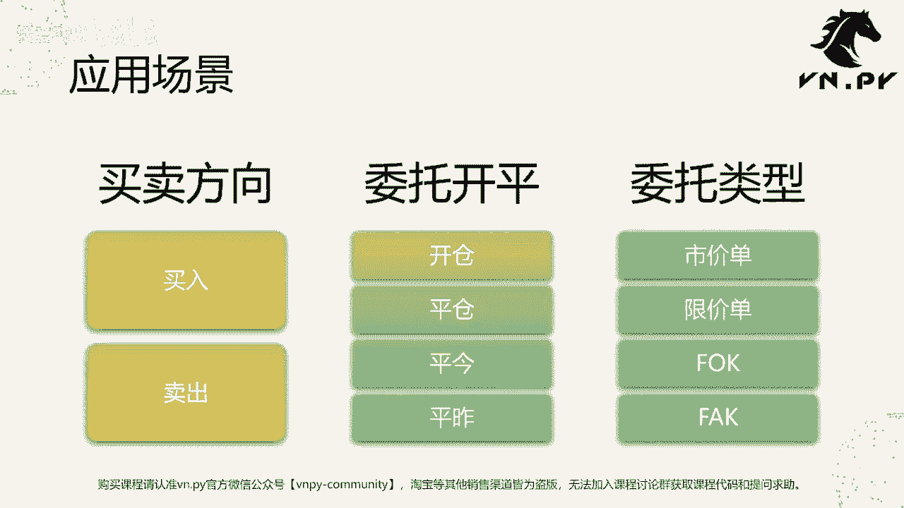
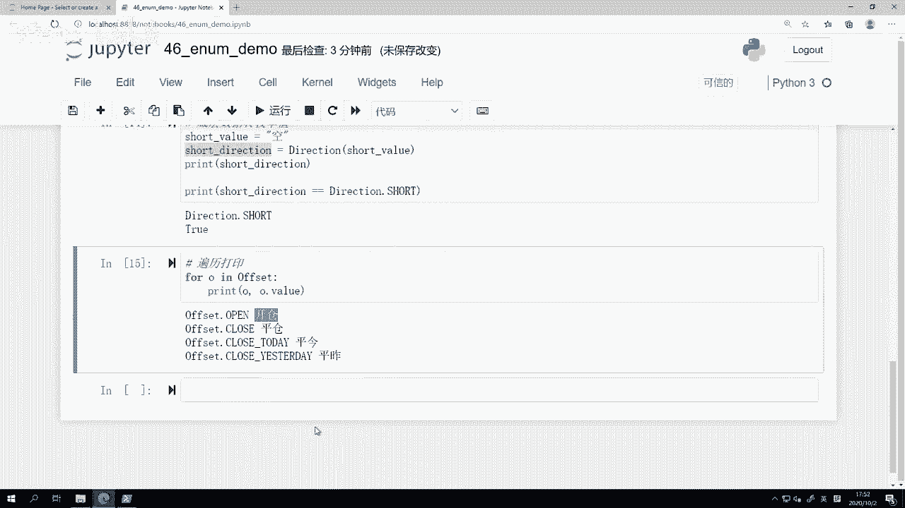

# 46.enum和数据常量 - P1 - 我爱期货 - BV1G32gYuEkB

OK欢迎来到量化交易零基础入门系列，30天解锁Python量化开发课程，那么今天呢是我们的第46节课了，上一节课里面我们讲了两个围绕着数学计算的，max和random模块，这节课里面呢我们要来看一看。

很多时候用来表示这种数据常量的，叫做1NUM枚举值模块，那么首先第一个问题啊，对于绝大部分人来说，肯定是叫什么是枚举值啊，枚举值它的英文叫做enumerator啊，或者你也可以写成ENNM这样一个缩写。

整体上啊，这个枚举值我们在Python里面去定义的时候，它是用来呃就必须继承1NM类啊，这个是在我们那个1NM模块下，然后呢在用的时候更多是用这个啊，一那么继承出来的类，来表示各种各样的常量数据。

什么叫常量数据呢，就这个数据字段，它啊在整个我们Python程序运行的过程中，他这个数据可能是不变的，为什么不变呢，因为它通常是某种业务功能的代表，比如说我们一个委托的时候，他的买卖方向一个是买。

一个是卖这种业务代表，在整个程序跑的过程中，几乎就是不会变的，它只是一个我们把现实世界中客观存在的，两个东西给在程序里面表达出来的，这么一种数据形式，另外一种呢可能是像这个啊。

叫做我们的这种委托时候的开平啊，开仓平仓，平津平昨，这个这个开屏的操作，那么在海外的期货市场，曾经很久以前80年代的时候，或者之前可能有过这样的数据啊，但是在啊2000年之后几乎都没了。

大家都采用进仓交易的方法，但我们中国现在还有啊，所以我们还有开屏的字段，还有委托类型，限价答案，停止单FAKFOK啊，这个试驾单等等啊，这个又是委托类型的啊，这么一个枚举值。

反正说白了就是所有的这些枚举值，都是用来用数据去表达，某种哎我们交易实例里面的一种业务啊，它就是所谓的枚举值，最后啊这个为什么要用枚举值呢，另另外一方面也是因为有性能优势啊。

对于我们很多时候在做各种比较的时候啊，你用枚举值继承一，那么类比起你单纯的用一个整数，用一个浮点数呢，可能在速度上能够更快一些，那么接下来我们就来看，我们刚刚讲到这么三个应用场景的使用方法。

第一个呢叫做买卖方向啊，第二个呢叫做委托开屏，最后一个叫做委托类型。

不好意思，刚刚按错了，然后啊我们接下来要看的整个过程中啊，大体上是这么六步额五步的基本操作，第一步我们要把枚举值给定义出来啊，我们先定义好枚举值，第二步呢，我们看怎么样用枚举值来实现这么一个类型。

提示声明的作用，好，就type hinting，那我们这学到现在是多节课了，大家应该已经对在Python里面写代码的时候啊，尤其是你在这种vs code里面，写点派文件的脚本代码的时候。

加上这个类型声明应该已经非常熟悉了，虽然它会让我们多打一点代码，但它可以给我们带来的帮助要多得多啊，所以推荐大家这个啊，一般写一些可能你要用到两三次代码时候，都把类型声明给加上啊。

如果有个代码你可能跑一次，你知道回头就把它给扔掉了，那你不写没关系啊，然后我们在这里看到这个枚举值类型，怎么帮助我们来实现类型提示的功能，第三块呢则是这个枚举值啊，怎么把它来转成底层的数据。

因为底层我们可能用的是整数，也有可能用的呢是字符串等等，我们有的时候要把那个底层数据给取出来，最后第四步来看一下，怎么样再把底层数据转换回我们的枚举值啊，这个更多操作呢。

是在我们把一个数据存到JSON文件里之后啊，可能在程序重启的时候，我们要把JASON里的数据给读出来，再转化回枚举值啊，那么这么一个操作我们要学一下怎么做，最后一个呢是便利，所有的枚举是数据啊。

有的时候可能想要用一个循环啊，想在图形界面上啊，在一个下拉框里面，把一个枚举之下，所有的字段都给添加进去的时候，就需要用到这么一个便利的技术好，那接下来还是一样，来看我们今天的代码。

怎么今天代码名字呢就叫做inne demo啊，我们看第一个单元格很简单，就从INNM模块下加载的这么一个INNM类，当然在这个模块下还有一些其他的类啊，但整体上最有用的。

或者说大部分情节我们要用到的就是它啊，所以我们现在先哎把它加载进来，然后我们就很快的来定义一个direction，买卖方向的这么一个枚举值，那在定义的时候，我们是定义了一个类。

这个类呢就叫direction，然后对应的它继承自1NM这个父类啊，或者是这个叫parent class，英文里面在这样定义完之后，我们在类下面定义了啊，两个全都用大写字母表示的常量。

注意在Python里面，虽然到现在我们呃，这个多多少少已经接触过几次常量的概念了，但是在Python里面，一般情况下，我们对于常量这个东西的定义，都是用大写字母来表示的啊，包括在这里。

如果我不用1NM定义，我可能就单纯写一个啊这个a trader pass啊，等于比如C冒号卡号v trader啊，我随便写一个，这个不一定有什么意思，那我写了这么一个字符串之后。

那trader pass就等于我是下面这个字符串啊，我按照这个写法时候，首先trade bus你会知道在Python里面它是一个变量啊，这个就就等于赋值好了，那下面我可以很方便的。

比如说我要print trade pass，我可以把它结果给打出来，或者为就纯粹把它当做一个字符串变量去用，那用纯大写字母来表示的，目的是在这里为了告诉我们写代码的人，这个量是一个变量。

当你在第一次初始化它完了之后，后面你不应该再去重复的修改它，就你后面用的时候，你可以说比如说啊这个去用这个变量，比如print trade pass，或者说哎这个啊这个hello啊。

然后呢加上就一个字符串，加上这个trader pass，而不应该啊，就所有为用trade pass去做计算都可以，而不应该对他再做一个重复的赋值，比如trade pass等于D冒号杠什么东西啊。

这个重复赋值的话，尽管在Python语言里面是可以的，就trade pass这个东西，尽管我们用了纯大写字母来表示，但它还是一个Python里的变量，所以理论上它是可以修改的。

但我们用纯大写来表示的时候，就是为了防止我们不小心去写出，再次对它赋值，或者修改它数值的这样的一些代码，核心目的呢就是让我们知道哦，我们是把它当做一个常量来用的，我们不应该去修改它啊。

所以一般我们在Python里面的常量都是用这样的啊，纯大写字母，然后呢中间接下划线连接的形式来表示啊，这个不是强求的，但是也是P1P8里面大家推荐的一个规范，那么啊所以在下面啊direction下面。

我们定义这个枚举值，下面对应的一个又一个常量的时候，我们也全都用纯大写的字母来写啊，不要用小写的，尽管那不会报错，但我不推荐这样写long，那么就是对应的这个方向就做多，Short，对应的方向就做空啊。

非常容易理解，然后下一步我可能创建一个变量，就order direction，它应该是多少呢，就等于direction点long，然后我们把它复制到这个啊direction点line上去。

然后把它打印一下，我看结果是长怎么样的，打印出来的结果，你会发现他这里打印出来的结果，就是一个direction点long这么一个枚举值，而不是底层的多这个字符串的数据，尽管我这里在定义的时候。

我把它定义成了这么一个啊long的类型，如果我不继承NE，那么的话你看一下定义的结果是怎么样，这里打印出来结果直接就是多了啊，而不是像我们打印出来那样，它就是一个一那么的枚举值。

然后下面呢我们来定义一个更复杂一点，没举值啊，就是开平仓叫offset，英文里面叫offset啊，这个就就是在我们中国，它它它英文本身的意思叫偏移量啊，但是在我们中国的交易接口里面。

它统一指的都是啊开平仓这么一个呃，意思啊也是继承自一，那么类下面呢我们四个常量，Open close，Close day，Close yesterday，分别对应开平仓，平静平足。

然后我们看怎么做类型声明呢，我这里定义了一个函数叫send order，发单，这个函数我们有以下几个参数，第一个v t symbol，你要对哪个合约发单，这个是一个字符串，容易理解。

第二个参数price委托的价格是多少，那么这个呢也容易理解对吧，他就是一个浮点数，第三个是volume，就是我们的委托的数量，那多少首啊，对应的也就是一个整数，下面有两个这个啊参数。

一个是direction，就是我们的委托的啊方向，你到底是要买还是要卖，第二个呢是offset，因为对我们国内所有期货的交易来说，都要传这个开屏的，你到底是要开还是要平，那么我们在这里可以注意到。

对于direction和offset这两个啊字段的提示，我们就直接用了上面的枚举值，这个一那么的类继承1NM定义出来的，这个枚举值的类啊，分别是这个大写代入式和大写offset，那这样呢对于我们啊。

可能在JUPITER里面还不明显，如果在vs code里面做一各种智能提示的时候，他直接你后面去调用这个direction的时候，他会知道OK就这是一个direction类。

然后呃对这是一个direction的枚举值的对象，所以你可以围绕它做各种啊，这个智能提示的操作，那在这里哈，因为我们纯粹只是为了演示一下，怎么用它来做声明，所以在函数内部我们并没有做任何事情。

我就直接写了一个pass，第二步呢我们也可以再定义一个类啊，就是trade data，这是一个成交啊，数据记录，那它的字段的时候我们也可以用erosion啊，同样非常简单，那当然这这一般不要这样写。

首先vt symbol是个字符串啊，price是个浮点数，一般把它定义为0。0啊，那我们这里在啊，是就是vt symbol是一个字符串，我们定义为空字符串，price是一个浮点数，我们把它定义为0。0。

volume是个整数，我们把它定义为零啊，direction是一个这种围绕direction的这样的，一个常量，或者这么一个枚举值，那此时呢我们在定义的时候，一般对于枚举值的默认值。

我们把它定义为none啊，对应为空值，不要定义为字符串，也不要定义为数字，定义为none，这样呢比较符合习惯一些，然后下面我们也可以看一下，就枚举值转原始数据啊，我们创建一个direction。

然后它就等于代入深点long，然后我们把打结果打印下，其实上面我们已经打印过了，结果可以预期，然后第二个操作，我们去取出它对应的这个direction点value，这个值我们把值给取出来。

我们打打印一下，看结果是什么，可以看到第一个打出来的结果呢，就代direction点long啊，这是一个枚举值下面的常量字段，然后呢你当你取它的value的时候，就取它的值的时候，哎我们可以看到底层。

我们要的那个多的这个字符串的信息了啊，所以每一个枚举值尽管它是个常量，但它其中其实包含了你在定义它的时候，传进去的那个原始字符串信息，好，下面一步呢就是short value，我创建一个字符串啊。

信呃字符串叫空做空对吧，然后呢我把它转化成一个枚举值，就direction本身啊，括号shot value，然后把它打印出来，同时我也看一下。

我创建出来这个short direction和这个direction，点short它是不是一个东西，它们的值是不是一样的啊，我们也来看一下，回车之后可以看到，当你用direction这个枚举值的类。

去创建一个对象的时候，然后你把那个对应的字符串给输进去的时候，他出来的结果就是那个具体的枚举值常量啊，就是这个啊short这么一个方向，然后同时我们做了一个比较，我们可以看到它是true啊。

它是就是这个数据类型，所以这样两步呢，我们就实现了一个是枚举值转原始数据，第二个呢是原始数据转枚举值的操作，那很常用的一个点，就是当我们把数据从内存里面，保存到我们的JASON文件的时候啊。

因为枚举值它是我们Python里面的这样的一个定义，它是没有办法直接转化成啊我们的JASON啊，文件没有办法直接保存进去的，所以呢我们往往要把它的原始数据，比如说字符串啊，整数啊等等给取出来啊。

然后保存到我们的这个这个这个JASON里面，之后，后面在读取的时候再把这个读出来，字符串和数据，转换回Python内部的这样的一个枚举值对象啊，这样呢就可以用了，最后一个先演示啊，就是便利打印啊。

就是这个offset，或者说这个假如审这些枚举之类，直接都是可以来用for o in什么，去做这种循环的啊，我们这里呢就非常简单，就是一个循环打印一下，你可以把它就在Python里面就叫做迭代器。

就像一个列表一样，直接一个for循环，然后打印里面值啊，我们这边就直接做个for循环，可以看到每个值都是那个枚举值的常量，然后每一个值对应它背后的实际的真实数据，就是O点value啊，都可以打印出来。

所以这样呢我们就可以很方便的，有的时候可能要在图形界面的下拉列表里面，去把某个数额，某就这这些所有的枚举值的，这些对应的字符串啊，都给插入到下拉列表里面，这样方便我们啊去去后面，在下拉列表里面去下拉。

点击对应的选项，就可以通过这种for循环的形式来，非常方便的把对应代码写出来。

OK那么这节课的内容呢也就到这，更多精华内容，还是请扫码关注我们的社区公众号。