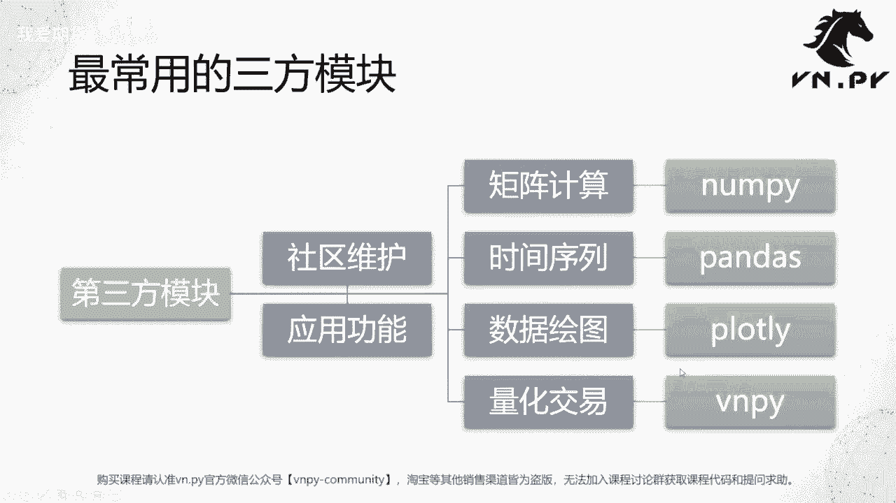
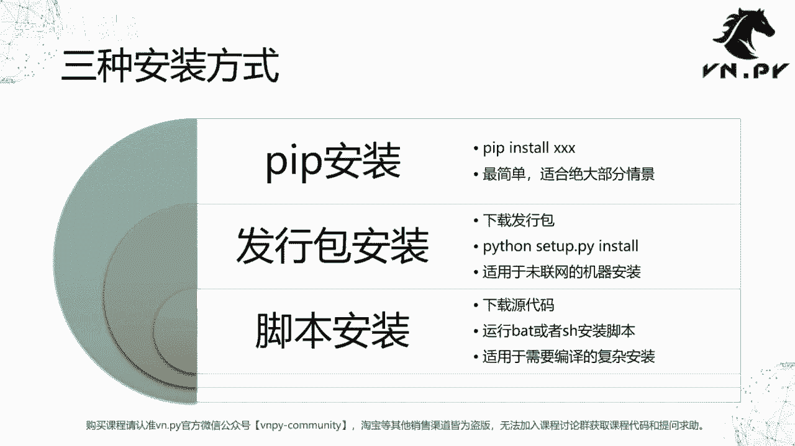
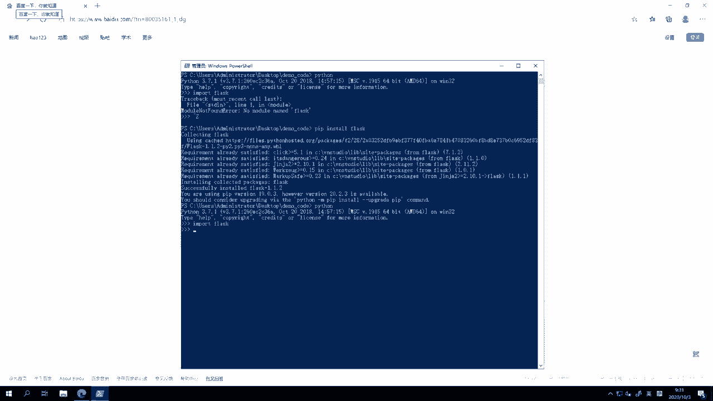
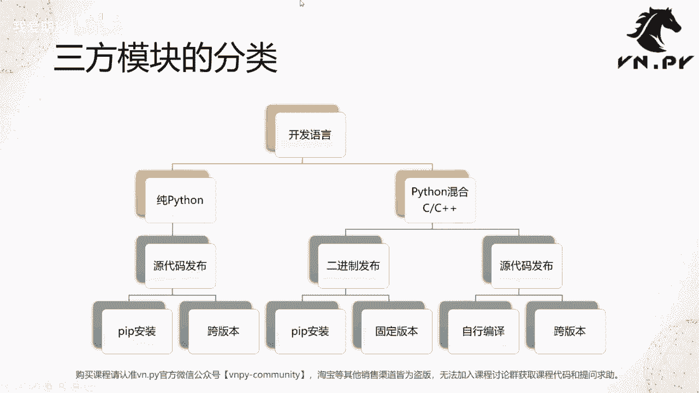

# 47安装第三方模块 - P1 - 我爱期货 - BV1G32gYuEkJ

OK欢迎来到量化交易零基础入门系列，30天解锁Python代化开发课程，那么今天呢是我们的第47节课，在之前我们花了差不多十几节课的时间，学习了这些常用的Python内置模块的用法，那么从这节课开始呢。

我们要来接触Python社区所提供的，这些第三方模块了，那所以第一块的内容，如何来安装这些第三方模块，那么我们先看几个比较常用的第三方模块啊，额这个它也可以缩就简称为三方模块。

或者叫让它全称叫第三方模块，整体上它是由Python社区来维护的，对比的呢，就是我们这些Python内置模块是由Python官方团队来为，一个是他们主要的区别就是发行方不同，第二个就是这些三方模块。

更多针对某种比较具体的应用功能啊，就是它有一个具体应用领域的，不像我们Python，比如举个例子，Python内置的模块daytime啊，这个获取日期时间的，它可能可以用在许许多多方面。

它可以用在量化交易，可以用在你可以写个网站啊，或者说其他访问数据库啊，什么时候都可能要用到这个日期时间，而这些三方模块则不同，它们相对更有针对性一些，那么第一个啊特别常用的三方模块，矩阵计算的囊排。

第二个围绕着时间序列的pandas，第三个啊用来做数据绘图的plot ly啊，当然比较老的版本里面也可以用matt plot lib，现在我们更推荐用plot底一些，最后还有如果你要做量化交易的话。

你可以用VN点派啊，当然我们的这个模块名字叫做VNPY。

那么下面呢我们就来看一看他们，每个模块整体上要安装，它们都会采用这边的三种安装方式，其中的一种啊，有的模块可以同时支持多种IM装方式，但是一般呢会有一个最推荐的，那么最简单的就是这个所谓的pip安装了。

非常简单，在CMD里面啊，或者你就在命令行里面直接去运行pip，install叉叉叉，那就可以装上去了，非常的简单，适合绝大部分的情景，第二种安装方式呢叫做发行包安装。

这种方式呢适合于那种没有联网的机器啊，比如说你可能这个现在拿到一台，券商内部提供的托管服务器啊，让你可以上去部署环境，那么一般我们知道这种所谓的内网服务器，它是不能去连接因特网的。

所以这个时候你没有办法用pip install的命令去接，在网上搜索对应的这个安装包来安装，所以呢你就要这个手动的，先把你要用的模块的发行包啊，或者你管它叫安装包也行，给下载好。

下载下来之后再去把它传到那台机器上，复制粘贴也好，还是你用U盘拷过去也好，最后呢去运行这个叫Python setup，点pi install的命令来执行这么一个安装操作，最后一种安装方式呢叫做脚本安装。

这种安装方式相对来说是最复杂的啊，你需要去下载这个模块的所有源代码，然后你要去运行这个啊，一般源代码里面会自带一个，叫做安装脚本的东西啊，它一般是在windows上就是bat文件处理文件。

在啊LINUX上呢就是SH文件，叫做这个脚本文件去执行这么一个安装，那么这种方式呢，比较适合于需要编译的复杂安装，其中啊，van der派就需要通过这种脚本安装的模式安装，win点派。

因为依赖的库比较多，其中有几个像t lip这样的库，它是需要C加加编译的，所以我们没有办法支持pip，安装这么一个模式啊，然后发型包安装呢，又需要大家自能够手动的去编译，C加加t a lip。

这个相对也非常繁琐，所以我们官方就提供两个方式，一个叫做脚本安装，还有一个呢就是我们在在我们整个课程一开始，就已经装好了这么一个VN studio的完整发行版啊，用它的话你就什么都不用装了。

直接装好vs studio就什么都在里面，那么啊今天呢我们就在这节课里面，我们简单来看一下pip安装这么一个形式，剩下两个安装模式呢，我们会在后面的课里面看到。

好，我们今天先来看这个pip安装的模式，那打开我们的一个power shell啊，此时呢我们可以看到就是呃我们先来启动Python，然后呢我们尝试加载一个模块叫做flask。

flask的是英文里面这个烧瓶啊，化学里面做化学实验的时候用到那个shopping，然后这个flask呢是一个在Python领域，用来做网站开发，或者你管它叫一个任何在浏览器里面。

你能够去啊访问的这种web服务的开发的，这么一个框架啊，非常非常常用，那么啊因为它是web开发相关功能，所以在我们VN studio里面是没有自带的啊，我们主要还是自带了这个针对量化交易的功能。

但如果这个时候你要用到flask的话，你也可以这个非常方便的安装它，我们这边先试着在Python里面import了一次，他报了这个module，Not found error，就告诉我不好意思。

这个模块你现在还没装，我没办法帮你加载到，那此时呢我们就退出Python，直接运行命令pip install flask啊，此时我们就可以看到，他已经自动的去网上下载了一些模块，过来。

帮我们把这个flask很快的给装好了，那我这里呢，因为之前我在我这个准备做演示的时候，已经操作过了一遍，所以它这些模块在我本地都有，已经有一个安装包的，这之前缓存的文件了，所以一下子就给装好了。

如果大家就第一次运行这个命令，装的时候可能会慢一点，取决于你的网络，一般也就30秒的样子就装好了，我这大概三秒都没有啊，最后会有一条信息叫successfully install flask啊。

然后对应的版本杠1。1。2啊，就已经告诉你装好了，此时呢我们再回到Python里面，Out flask，我们可以看到就可以成功的加载了，如果你啊这个掌握了flask开发方法的话。

此时你就可以用flask，很方便的去开发一些这种网站啊，web的应用了。

那么回到我们的PPT，整体上我们在这边啊，对于这个刚刚提到三种这个安装方式，以及我们这个三方模块的分类啊，我们把它做一个这个关系性的匹配吧，就大家回头再如果要装某些模块的时候，不确定要用哪种方法的话。

可以比较方便的帮你去筛选，首先Python的这些三方模块，基于它的开发语言不同，可以分成两大类，第一类是纯Python的模块，第二类是Python混合C或者C加加的模块啊，就是其中既有Python。

但是呢也有很多逻辑代码是用C语，C加加语言写的，对于纯Python模块来说，它的这个包的安装都是非常简单的，因为纯Python的这些模块，它可以直接用源代码的形式发布啊。

我们知道Python只要你给我个点拍文件啊，然后只要下载到本地，放到某个文件夹里面，就像之前那样，我们把环境变量一改，我就可以很方便的去import它，去运行它，所以对于这些纯Python模块。

几乎都提供所谓的源代码发布的方式，你只要用简单的运行pip install这个命令，就很快的就能把它给装上了，同时这些源代码发布的Python的这些包啊，或者Python的这些纯Python的这些模块。

他们一般都能提供一个叫做跨版本的功能啊，就是许多这种包它可能是python3。7能用的，python3。8也能用，python3。9也能用，未来这个4。0等等，都可能他有比较好的兼容性。

那么与之相对的呢，就是其中包含了C或者C加加代码的，这样的版本了，那我们知道C和C加加的代码，它们是属于一种叫做编译型语，他们的这个代码不像我们Python，可以直接通过这个解释器来解释运行。

但是需要通过编译器先编译完之后才能跑的啊，所以它的发布方式呢就比较复杂了，又分两种，第一种叫做二进制，发布这个模块的开发者在自己的电脑上，先把这个C或者C加加的源代码给你编译好了。

编译成二进制的这种链接库啊，然后再放到这个我们的Python的那个PY，PI的网站上，那么此时呢就可以啊，我们在装的时候用pip安装，等于他已经帮我编译过了，把编译好的东西放到网上去。

那我直接下载它编译好的一个文件下来，然后直接来安装就行，但是这种发布方式，因为编译啊，他是和我们这个源代码，和我们解释运行有点不一样，它是要绑定到某一个Python版本上的，所以举个例子。

比如他二进制发布了一个针对python397的版本，那就只能在3。7的Python上去运行，3。8是运行不了的啊，你需要重新编译，那这个是二进制法另外一种啊，如果你要实现跨版本的话。

你就不能去就这个模块的作者，不能帮你去做做编译，相反它只能去提供啊整个C和C加加的源代码，我们作为用户，我们下载的这个包的源代码之后，我们要自行做编译，我们和我们自己机器上的Python环境在一起啊。

不管3。73。8，3。9，用我们本地的Python环境和这个C加加的源代码，把它们结合起来自行做这个编译，那这样的好处呢是它可以跨版本，但是坏处也很显而易见，需要你能掌握编译C加加的能力。

这个对于许多初学者而言是比较困难的，对啊，这个Python整体上的这么一个三方模块，可以分成这三种，那么对于第一种呢很简单，pip安装，第二种二进制发布的版本，一般也是啊用这个pip安装就行了。

然后对于源代码发布的版本，有时你可以通过这个下载源代码，Python setup点patch装，有时呢你要比较复杂的情况下，你就要用它提供的这个安装脚本去装了，甚至有些特别这个特别复杂的模块。

你甚至都不他都没法给你提供安装脚本，需要你自己去手写这个安装脚本去装啊，那种情形呢就相对更加复杂一些了。

OK啊那么这节课的内容呢就先到这啊，更多精华内容，还是请扫码关注我们的社区公众号。