# 48.手动安装vn.py - P1 - 我爱期货 - BV1G32gYuE62

OK欢迎来到量化交易零基础入门系列，30天解锁Python量化开发课程，那么今天呢是我们的第48节课，上节课啊，我们学习了这个第三方模块的安装，这节课呢我们就来做一个挑战，试一试，手动的去安装VN点派。

那么我们这边啊先来看一个方案对比，整体上啊，到目前为止，大家这个在学习我们这个课程的过程中呢，用到的都是第一个方案，叫做集成环境啊，也就是我们的bn studio，那它的好处是包含了V点派。

所有的一个V点派运行，或者做量化交易相关功能的时候，要大家要用到这些依赖库，同时呢VN studio是由我们van der派官方团队维护的，每一个版本，每有一个新的边界派版本发布的时候。

我们都会对应的去更新这个啊，VN studio发布一个新的版本，同时把里面一些依赖库也会升级到，对应比较合适的这么一个新版本啊，所以这样的话呢，你用VN studio的时候相对可以比较的省心一些。

你不用说太去关注这种环境啊，等等相关的问题了，那么另外一种方案呢叫做手动安装，手动安装的话，你这个可能更适合于对Python本身有比较多，使用经验的一些用户，首先第一步你需要准备这个Python环境。

你可以选择Python官方去发布的这么一个，官方Python发行版，你也可以选择那个anaconda公司，他们发布的这么一个叫mini ka的Python发行版啊，都可以，或者还有一些其他的这种。

比如说active Python啊，比如说这个win Python啊等等，可能更加小众的发行版和发行的这样的一个，Python安装包也可以啊，然后准备好之后。

下一步你就要自行安装这个所有的vender pad，依赖库，以最终的VNDER派了，那么啊当然这种方案说起来是比较复杂的，但相应它也有好处，就是你可以自己去管理在整个环境里面，所有的模块。

以它们对应的一些版本，相对来说呢可能更加灵活一些，那么下面我们就啊这个概念讲完了，我们就直接开始实操，我们就来走一遍这个安装流程，整体要三步，准备Python的环境下载VN点PON源代码。

最后执行install点BT做这么一个安装操作。

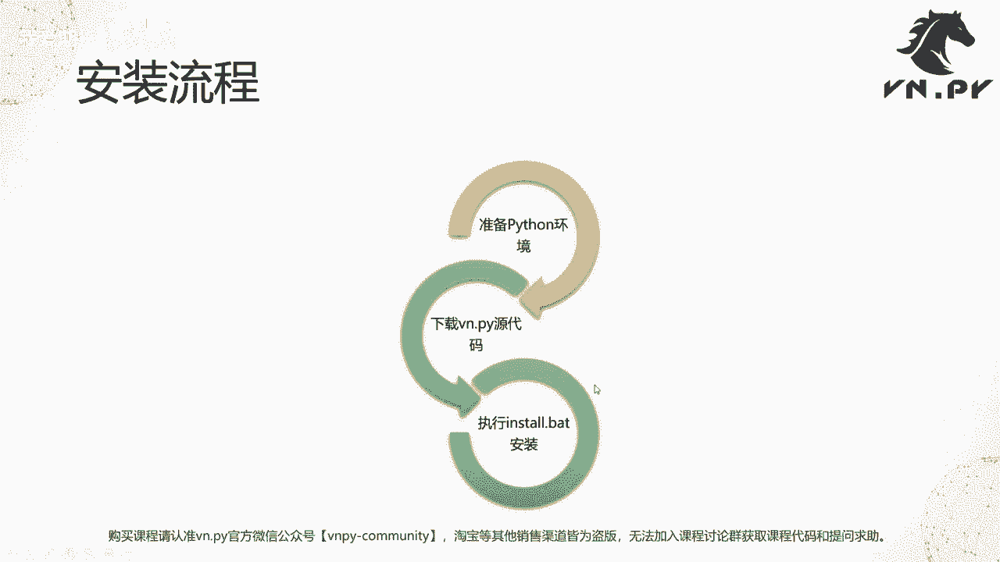

那么这边呢就啊，这个回到我们的这个借环境里面，那因为我之前已经装了VN studio，所以此时第一步，我要把VN studio从我们的环境变量里面给啊，稍微动点手脚，让它加载不到。

这样我们等会自己装完Python之后，才不会跟他起冲突，一般情况下，我们不建议大家在一台电脑上安装多个Python环境，因为他们都是呃，通常标准安装是需要把这个Python环境的一些这个，比如说路径啊。

比如说一些啊配置啊，写到我们的环境变量里的，如果你装了多个Python环境，然后他们都往环境变量里面写了，就有可能造成一个问题，叫做环境变量的冲突，此时有可能出现一些很奇怪的情况。

比如你用pip instag，你以为他是装到别人studio的这个Python里的，即使他装到了那个官方发行版里面去，或者装到mini康纳里面去，你会遭遇各种奇怪的问题。

如果你要与同时装多个Python环境的话，一定要学会一个叫做Python环境管理的，这么一个技术，可以在百度上面搜一搜，如果说你是初学者，我相信学我们这个课程，绝大部分应该都是初学者。

我强烈建议大家不要同时去撞多个啊，装了一个之前一定要把其他的给卸载干净，那我们这边呢因为今天出于演示啊，我就直接修改这个环境变量啊，大家其实之前我们也都讲过，就在这个呃系统级变量pass下面。

然后我们把这个原来VN studio的两个变量，后面加俩123，因为这个目录是不存在的嘛，加了之后就等于让这个环境变量失效了，后面把一三删掉就可以改回来。

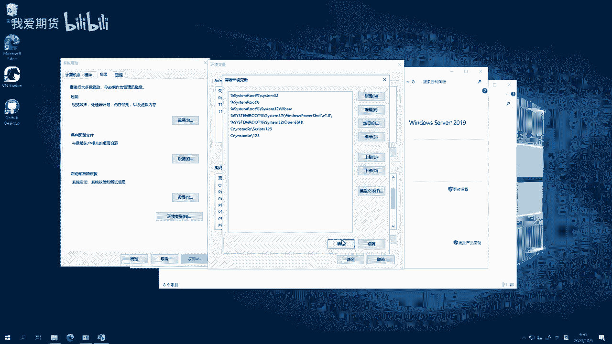

也比较方便点，确定啊，这样呢我们就已经相当于把我官方啊，呃呃不好意思，这个VN studio的Python环境失效，那此时呢我们打开一个power shell，运行一下Python啊。

我们发现它会有一个报错，说找不到，Ok，那这个时候已经让这个我们的VN studio，就相当于离开了我们，暂时性的离开了我们的操作系统。

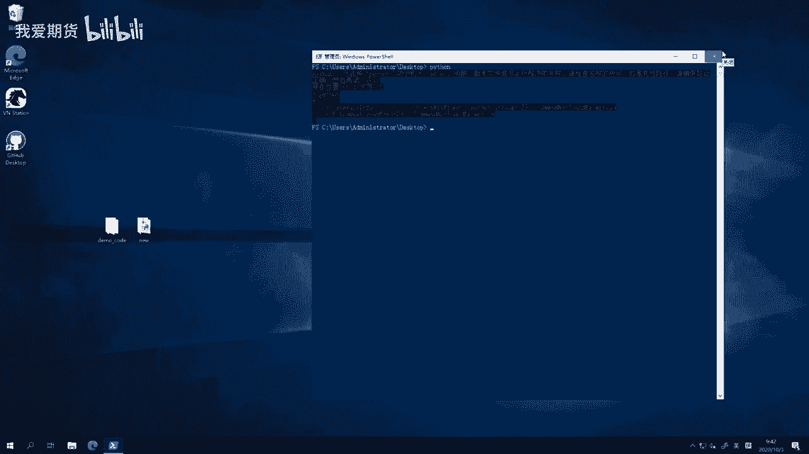

下面我们就可以来装啊，这个是我从啊Python官方网站。

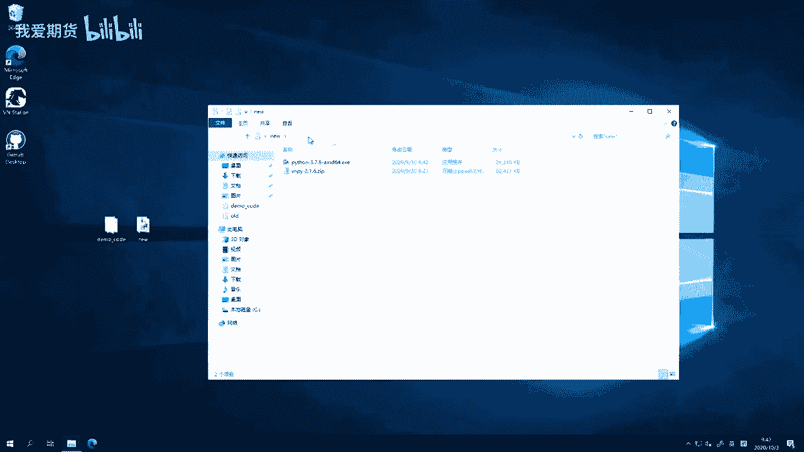

就是打开给大家看一下。

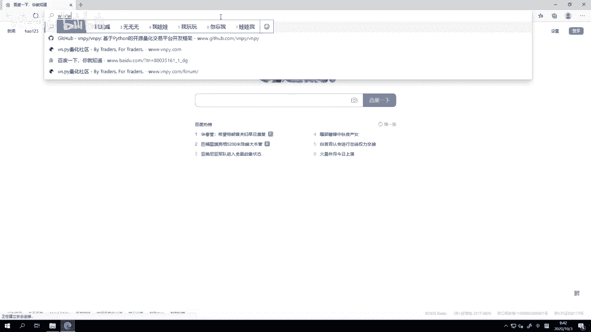

嗯Python的官网这里有一个downloads啊。

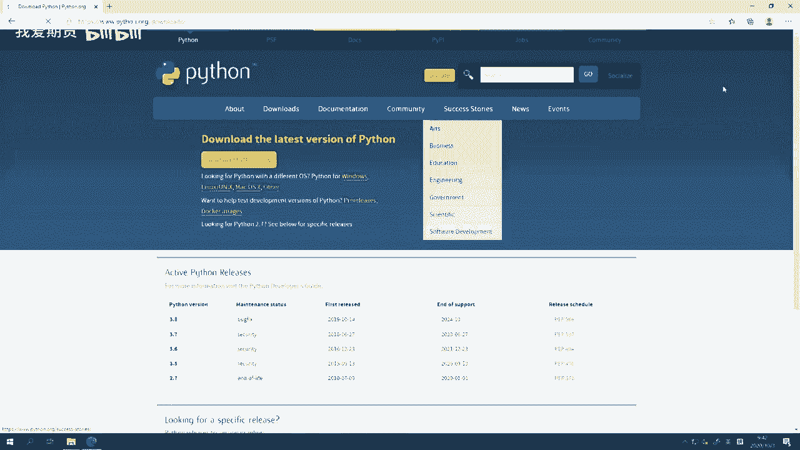

然后在这里下载的Python版本，那么vender pan呢，我们官方是基于3。7版本来维护开发的，如果你用3。8版本的话，要自行编一些底层的呃，这个啊不知道交易接口啊，等等相关的一些那个模块。

所以呢我们在这里推荐大家，还是先用397来学，那就下载这个3。7。9啊，在这个里面你能找到它啊，在这然后download去啊，注意下载的时候一定要选什么。

选这个windows x86x executable，installed windows64位版本的可执行安装包啊，一定选它，不要选，其实你选这三个都行，这个是它这个只是下载的安装包格式不同。

一个是zip，一个是EXE，还有一个是web版的，千万不要选下面X86的，这三个是32位版本的，32位版本的Python运行不了VN a pi啊，我们va pi2。0统一升级。

为了指是64位版本的Python，所以不要下32位的那个装不呃就装，到时候装不了啊，我们就先来双击这个3。7。09开始装，然后呢，首先这有个install now，在点它之前把下面这个框子给勾上。

ADD python3。7to pass啊，我们现在知道什么意思，就是把它添加到windows的环境变量里去，这样我们到时候可以直接通过啊，这个这个在CMD里面直接通过Python命令去启动它。

否则的话我们还要切到那个目录去启动，这个装的过程还是比较快的，大家可以看到一个官方版的这个文件，因为不多啊，所以刷一下很快就装完，然后这边在装着，我们先来看一下VA派的源代码在哪下载。

就这个GITHUB上的VNPY的这么一个网站点，往下翻啊，翻到这里，这里有个release，就是八步板啊，在Python里面，而不是在开源项目里面，或者其实在所有软件里面，他都是每隔一段时间。

会有一个正式的发布版出来，那么在主页WINIPAD主页这里，那最新的发布版往往也是当前我们这个GITHUB上，master分支下的整个代码哈，我们把它打包成了一个单一的zip。

所以你直接用那个发布版就行了，或者呢你也可以选择去，如果你确实要用啊，你可以看各个不同的一些，比如说我们最新的开发版本啊，当然这个开发版本呢是随时都会更新的啊，所以啊并不推荐大家直接。

如果你是初学者的话，不推荐用DV分支啊，如果你有一定经验之后，你会自己管理本地的呃，基于git去管理本地的这个仓库版本的话，OK那你可以用DV分支来，随时跟上最新版的这VN点牌啊。

随时甚至帮我们官方团队做debug也可以，那在这里啊，我们找到2。1。6版本发布，这儿有个source code zip下载，这个点一下之后就可以开始下载了，非常快，我这边因为本地已经下好了。

我不再继续啊，把倒掉，我们回到这里会发现诶，setup已经装好了，这个时候直接close就行啊，把它关了，那此时我们这边好，2。1。6，我已经准备好了，点击右键压缩放到根目录里面，哦V点pad文件。

应该说数量确实还是比较多的，还可以看到有可能可能摆多照的样子，所以要花一点时间，这会儿正在解压，好OK这样就解压完了，然后这个时候呢，我们会它自动会打开这个目录啊，新的变PY2。1。6的目录。

进到这个目录之后啊，我们可以看到这个是VN点派，2。1。6发行版的源代码，其中VNPY目录下包含的就是VA派的源代码，examples目录下包含的是各种各样的一些，我们官方团队提供的。

就这个使用的事例啊，然后dogs目录下提供的是一些文档啊，当然还是markdown格式，然后在这里我们可以看到有三个安装文件，install点BT，install点SH，install杠OSX点SH。

用第一个BT是在windows上用的，就是因windows安装脚本install点SH是在LINUX上用的，这个是我们LINUX上的安装脚本，install os x点SH，这个是在Mac的机器上。

就苹果电脑上用的，对针对不同的电脑，你要用不同的安装脚本，我们这样呢就用install点BT就行了，所以在当前目录右键啊。

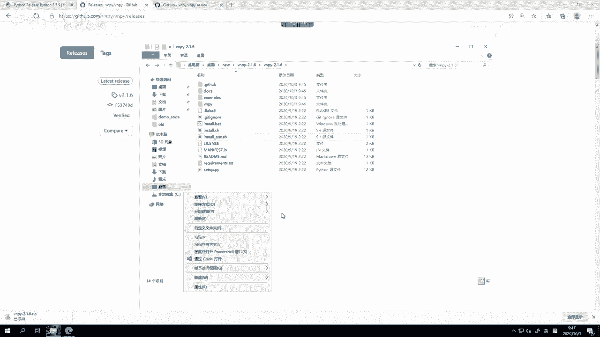

shift右键在此处打开PO效窗口，直接输入install点BT啊，按tab键自动补全回车，它就会开始执行这么一个安装操作啊，此时呢它会帮我诶一路的去下载各种库啊，因为同样啊。

我这台机器之前有做测试的时候有装过一次，所以我本地都有这个缓存包。

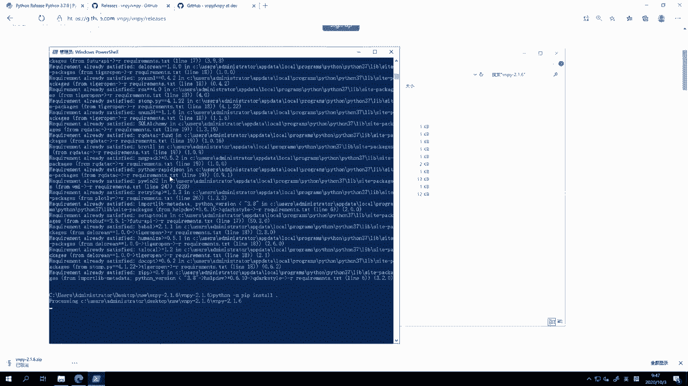

一下子就这个啊已经已经很快的，就已经因为有缓存吗，它不用重复去下载，就读到就确认是下载成功，下面呢就进入这个安装环节，大家可以看这边已经装了，然后如果大家自己第一次用的时候呢。

这个安装的过程相对会长一些啊，因为要一个包一个包的去下，那他这边在装着，我们就先回到PPT，然后呢来看一些这一节课，我们最后安装vi点拍过程中的一些重点，那么注意事项，第一个install点。

BT里面呢我们会去安装二进制发布的依赖库，主要就是ta lip，如果未来版本里面有其他的一些啊，这个依赖库的话呢，那我们也会哦最新版本我们除了ta lib以外，还有个那个quick fix。

quick fix引擎，这也是一个啊，这个用C加加发布的这么一个Python库啊，Python模块，所以呢就只能通过这种方式去安装啊，然后我们会去用pip来批量的安装其他的依赖。

最后安装边界排模块本身好，那么在安装的过程中，pip安装本身是需要去啊连接这个Python官方，在全球各个地方，不同的这个PIPI服务器的这么一个信息，去获取这些安装包的下载地址。

然后呢去去这个一个个下载，所以在此过程中呢，可能哈，因为这个我们国内网络的关系速度有点慢，如果你觉得太慢了，你想快一点，我推荐可以啊，各种各样翻墙样式都可以去开全局代理。

然后呢用这个翻墙梯子来加速安装速度吧，那我之前自己测了一下，差不多可以快啊，十倍左右的加载时间，对于我这台阿里云的测试机的话还是相当快的，原来要一个小时的，可能就6分钟就装完了。

然后第二个啊你也可以选择去替换这个pip啊，对应的后面那个服务器叫py pi啊，这个我们下节课会讲是什么，替换它的安装数据源，就我不用Python官方那个在国外的数据源了，我用国内的数据源。

比如说豆瓣提供的，比如清华提供的，但是呢对应可能有一个啊要注意的点，就这些我们国内提供数据源并不一定啊，他们的这个安装包是最新版本的，它相比较国外可能有一定的，我国外那个官方版可能有一定的延时。

所以有的时候你你要自己做出这么一个权衡。

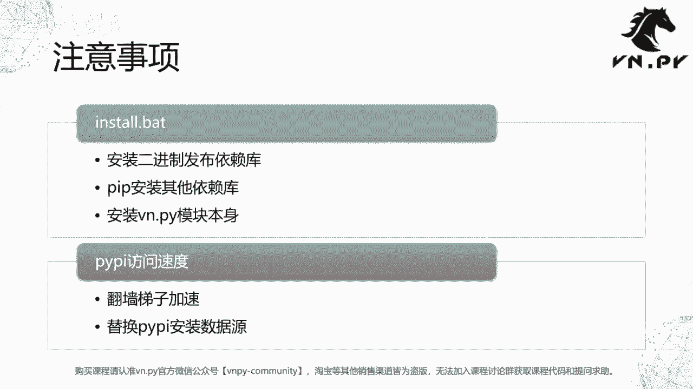

到底要不要去替换，那么替换本身呢还是比较简单的，这边已经装完了，再来看一下它，这个装完之后，我们直接进来之后，Import b n pi，我们可以看到诶可以正常加载，然后退出啊。

CD这个examples啊，这个编曲，然后Python动。

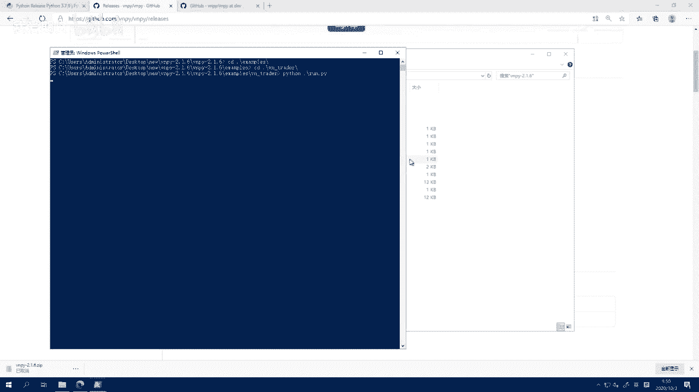

好此时就可以看到我们熟悉的编曲的界面了啊，同时我们注意到这个版本是2。1。6啊，是我们目前最新的版本，不像我们这之前那个VN studio里面2。1。50，在我开始课程的时候。

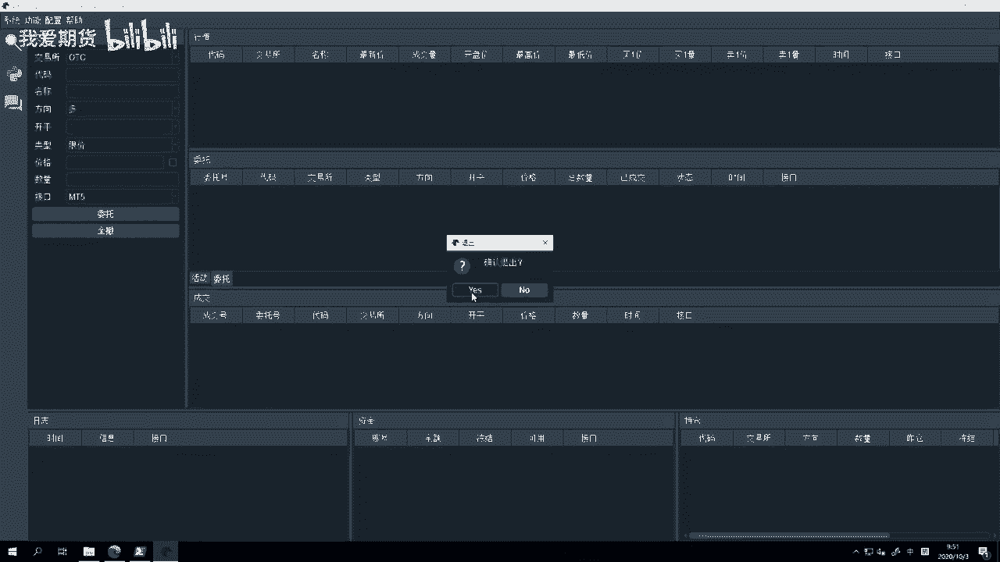

在准备这个环境的时候装的版本，那么但是要注意啊，手动安装的这个我们版本的这个边点派，如果你要去对它这个做任何修改的时候，不要修改你下载解压的这个目录的源代码，这是没用的，这个相当于是安装包里的源代码。

装完了的这些Python程序会他去哪了呢，我们就VNPY，然后按一下VNPY点杠杠pass，你可以加载任何一个模块，然后访问这个模块的这个pass，这么一个魔法变量啊，它就会显示它对应的安装的具体配方。

我们可以看到他装到这个地方去，能直接跳转哈关系，administrator update会隐藏目录，然后local柔管，把它装到这个地方，就是你要去改这个目前运行着的VN点pad。

当前你这个Python环境里面的编解Python源代码，一定要来这儿改，你不要改那个刚下载完的啊，这个就下载完的，这个解压出来的安装包里的源代码，那是没有意义啊。

要去改我们那个装的set packages下的源代码才行，然后同时注意手动安装的版本的话。

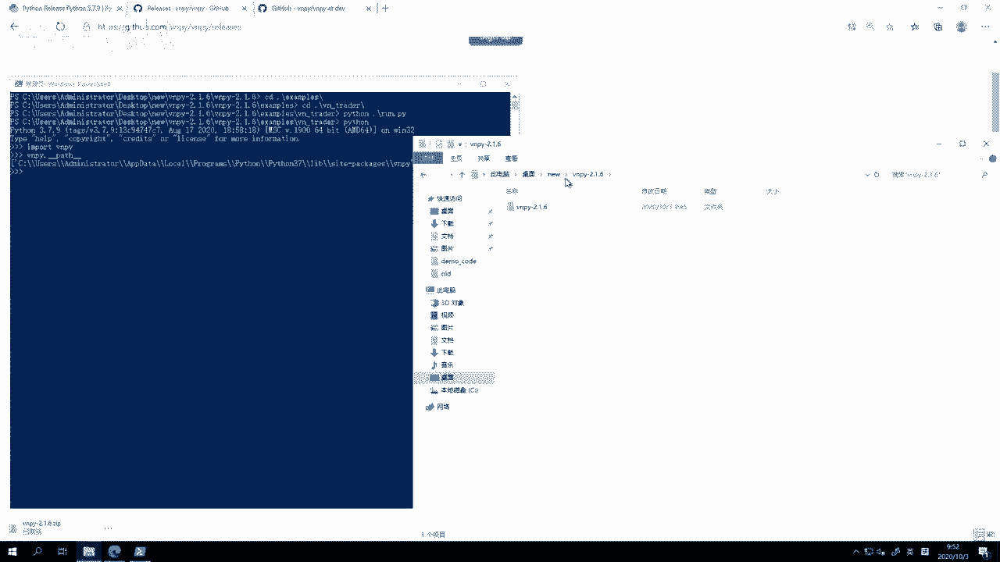

是不包括VN station的，所以桌面上不会有VN，如如果这个我们之前啊没有装VN studio的话，你这种安装方式是不包括VN station模块的，因为这个模块安装过程中。

它依赖到VN studio背后的很多编啊，所以我们目前还没有办法把独立打包出来啊。

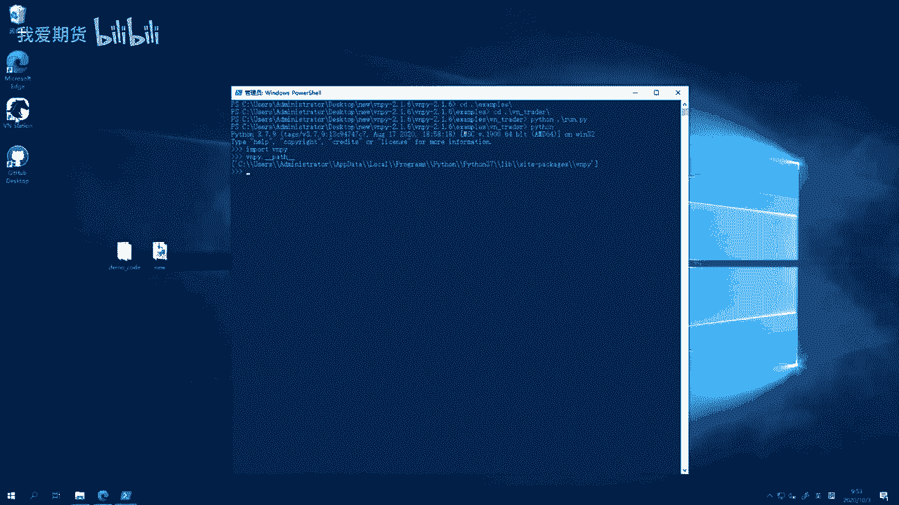

所以你要在这种手动安装情况下去用via pa，就依赖examples目录下的这些啊，一个个的案例了，通过这几脚本的方式来启动好，然后最后提一句，这个PYPI的安装语言的问题啊。

我们打开百度搜索PIPPYPI啊，然后比如说豆瓣，豆瓣圆，啊或者用清华源也行啊，很容易就可以搜到一些说明啊，就怎么样去用它，比如说这个pip install杠，就你在装一个东西。

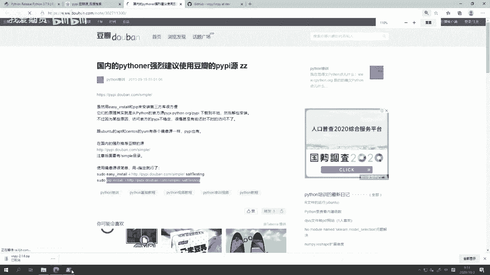

我们同样啊来装一把这个BASSK，我们来试试，Ion import bassk，布拉SK是没有的，那这时候退出来运行pip install GUI啊，I就是指定这个圆，我用什么地方的啊。

我不再用官方的啊，我用这个我先指定点i pi豆瓣啊，点com杠simple啊啊，然后后面是你装的这个模块名字，装个flask。

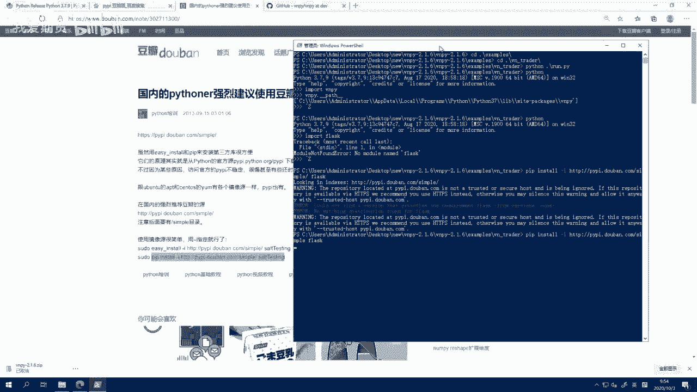

哦他这里会有个提示，我找不到这个版本啊，要另外找，那可能我们得换一个圆，都不行，那可能现在豆瓣园已经不能用了，那我们试试清华园，啊这个就，还是这个命令，里面豆瓣的部分给改了YPI点，放simple。

这个jungle是另外一个啊，也是在Python领域特别有名的，用来写web的，这样运行下样也帮不了，哦他这个前面有个HD，可能可能是这个原因，我们刚刚豆瓣那个可能我再试一下啊，果然这样就可以安装了。

fast啊，注意不要漏到HTT这里的这个S啊，之前我们看的这个例子，可能他已经比较老了，就这里他可能比较老了，这个呃确实2013年的那个时候，HTTPS还没推广开来，现在国内也好，国外也好。

大部分网站都是这种用HTTPS访问的，所以一定前面这个前缀啊，不要漏掉这里啊，不要漏掉S，漏掉S的话就会出现刚刚那情况就找不到，估计豆瓣原因应该是好的，我们试一把，我们转给，豆瓣我们这里也把S加上哈。

哦果然他这个可以找到，其这个时候已经在搜索了，把它下载安装，反正用国内语言嘛，他速度会比用这个官方的PI，PI源要快很多哈，当然这这里啊这样就装好了，那反正大家看根据自己的需求来吧，如果你想要最新版本。

你那个这个怕麻烦，你愿意翻个墙的话，那我个人更推荐翻墙一些，如果你不想去那样折腾，你就翻一下，那用国内的这个好了，同时这里啊这边还有个设，就教你怎么样把它设为默认的啊，就是把PYPI语句的这个原指定到。

只用国内清华站点，这样后面你再运行其他安装命令的时候，就不用每次都手动输入这个杠I的部分了啊，会在运行的时候更加方便一些，OK啊，那么我们这一集如何去手动安装VN点，P的内容呢，也就讲完了啊。

大家可以自己来试一试。

看看能不能啊，完成这个挑战吧，那，OK那么今天内容呢就先到这，更多精华内容，还是请扫码关注我们的社区公众号。

