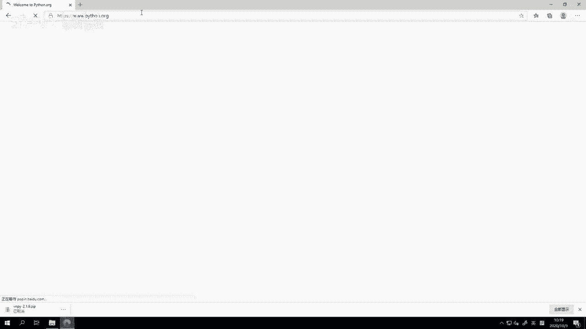
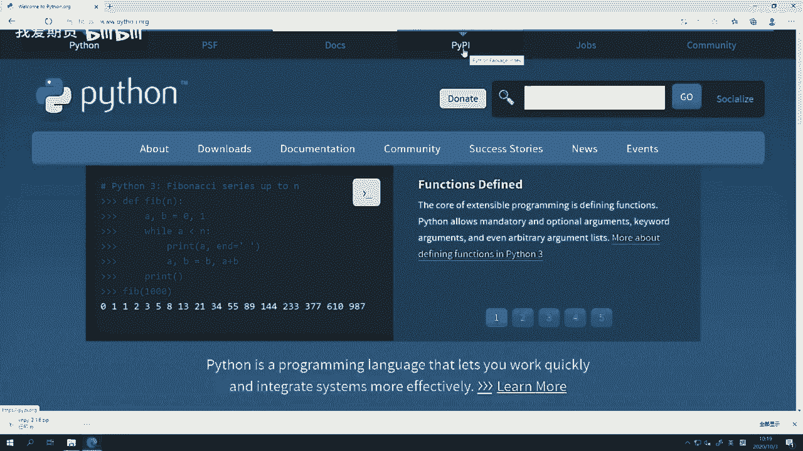
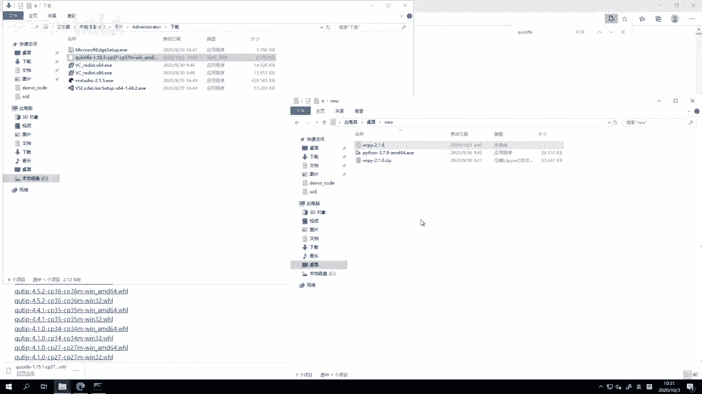
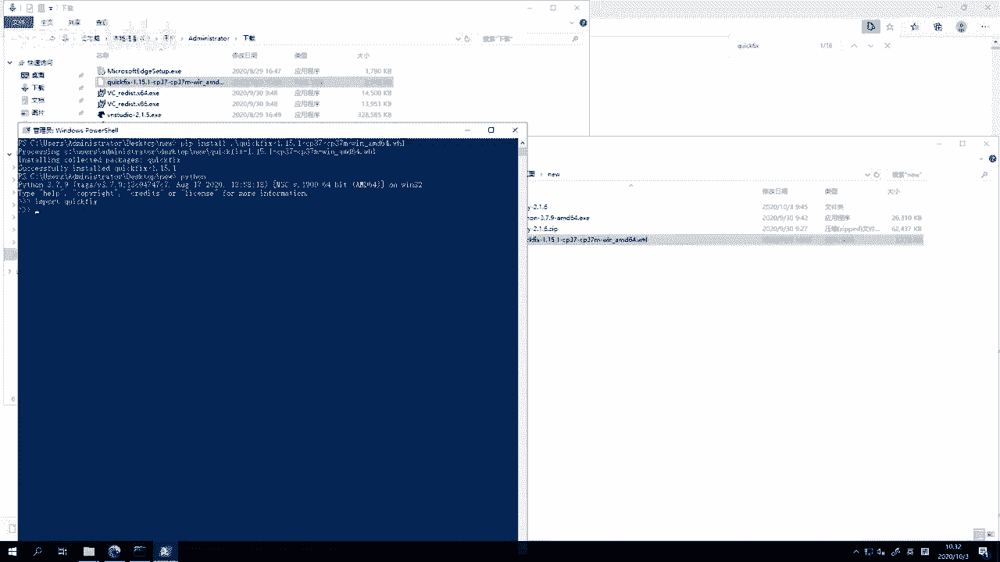
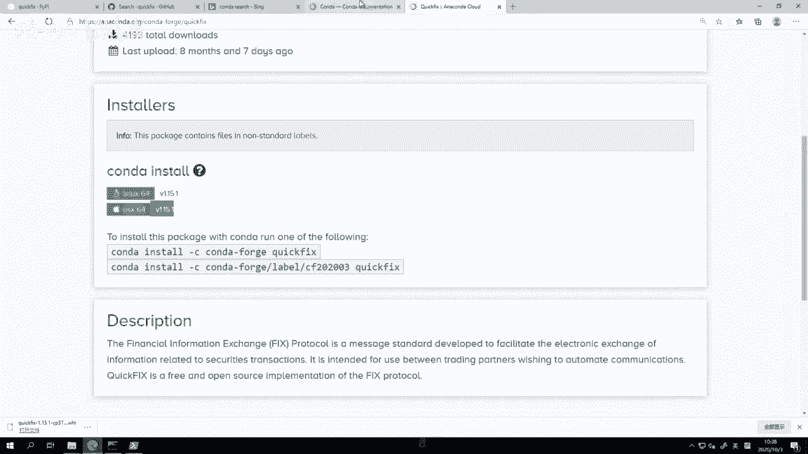
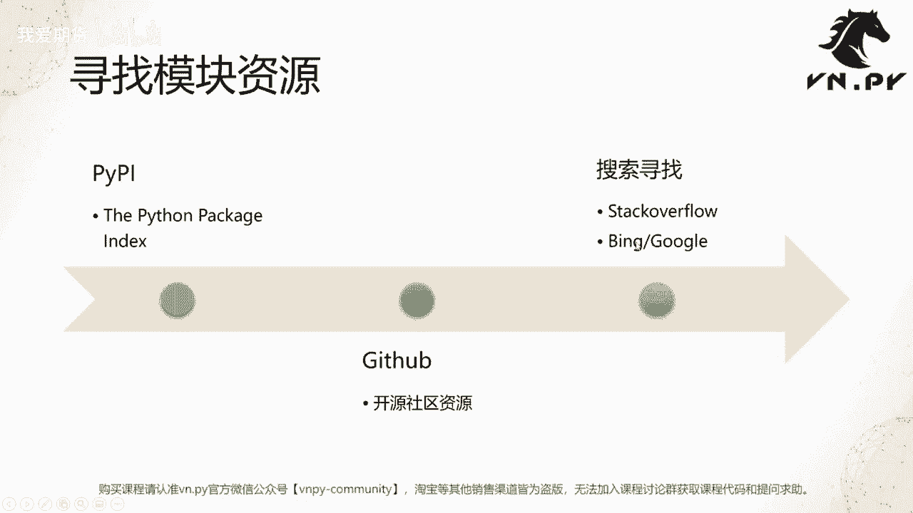

# 49.寻找模块资源 - P1 - 我爱期货 - BV1G32gYuEqg

OK欢迎来到量化交易零基础入门系列，30天解锁Python量化开发课程，那么今天呢是我们的第49节课了，上节课里面我们挑战了一把手动来安装vi p，那么这节课呢我们要来学一学。

如何去寻找我们要用的这些单方模块的资源，那我们来想象一下，很多时候啊，当你需要用Python来解决一个问题的时候，我们的工作流程，首先第一步肯定是我们先遇到了一个问题。

这个问题呢有可能是我们要用我们的Python程序，去对接一个外部的服务，这个服务可能是一个数据库啊，我们要去读它的数据，有可能是一个像CCTP这样的交易柜台，我们要和他通信来收行情和发委托啊。

来做这么一个交易，或者有的时候呢，可能你要去实现一个某种功能的算法，比如呢你要去做一个期权定价，比如你要跑一个策略的回测啊，比如你要去剪的图表，那么这些呢都属于实现一个功能性的算法。

当我们遇到问题之后啊，那如果你本来就能够解决这个问题，那最简单直接把它写出来就行了，但很多时候我们可能遇到的都是新的问题，对于新的问题我们也不是神仙哈，我们没办法未卜先知，所以此时只有去寻找外部的资源。

来帮我们去解决这个问题，最简单的方法啊是绝大部分问题，我们可以直接通过网上搜索的方式，你百度也好，google也好，还是stack overflow也好，都比较大概率就能找到你要的资源了。

如果对于一些比较细节性病的人用，我们还是更推荐大家去看书啊，有一些比较经典的书，比如说Python cookbook，比如fluent Python啊。

流畅的Python Python烹饪指南等等相关的书，这些书里面沉淀了很多很多经典的Python语言，内部的这种杂用法，那么这些书籍里面的内容呢，可能你在网上还不太容易系统化的找到。

因为他确实太专精于某一个领域，不管怎么样，找到资源之后呢，第三步我们就可以来试着去解决这个问题了，那啊取决于你找到这个资源是什么啊，比如说如果你找到的是一个直接就能用的，那针对定价模呃。

这个期权定价可能找到count lip这么一个模块，他直接就可以用来诶，你把你要的参数输进去，他就能把这个定价结果给你返回出来，或者呢你找到了绘图模块，几个plot里。

或者用来绘3D曲面图和拍cut graph等等，你把数据灌进去，他就能把图表给你绘制出来啊，那这种情况你直接用就行了，另外一种情况呢，可能需要你去做一些的扩展开发，比如说我们要去开发一个网站的时候。

我们啊找到了flask这样的一个框架，那么我们需要用flask框架里面的这些组件，这些功能函数来把我们要写的这么一个，web网站给开发出来啊，当然他可以帮我们加速开发，可能只要写很少的代码。

就能把我们要的功能实现出来，那么不管怎么样，这一步就是为了去解决，我们这一开始遇到的那个问题，整体上所有你在用Python去工作的时候，的流程就是这么的三步，那么比较关键的点啊。

其实也就是中间怎么样去寻找，你要用的这个模块资源，那整体上我们推荐在找的时候啊，你按照三步流程去找，第一步运这个叫py pi，上节课其实我们已经讲到它了。

它的全称是the Python package index，也就是由Python官方团队维护的这么一个社区，所有用户都可以把自愿意开源出来的包，发布到这个PYPI上，方便其他人去直接下载使用啊。

这也是Python社区之所以能够这么活跃，发展这么迅猛的原因之一，鼓励大家去分享自啊已有的一些资源，那第一个一般推荐大家去搜索的地方，就是PYPI啊，搜索到东西你可以直接通过pip命令来安装。

如果PIPI上没有的话，你可以选择去GITHUB上找一些呃，其他的更丰富的开源社区的资，最后如果GITHUB上也没有，那可能是你要去实现的这个功能，它就没有一个啊，这个非常啊体系化。

就专门针对性的这么一个功能包了，那你还有个选择，那就去这个搜索引擎里面去搜索寻找，比如说stack overflow这种网站，或者ban或者google上去搜索，诶，有没有哪些模块组合起来。

我写比较少的代码就能去实现我要的功能，一般情况下，即使没有一个完全成熟的包，你也没有必要从零开始写每一块的功能，这个非常浪费时间，我们更多建议还是把你一个大的任务，拆成一个个有机的小部分。

看看是不是每个小部分就有一些工具，可以直接实现了啊，然后对于中间缺失的部分，我们再去写代码，这样呢可以让我们的工作效率高很多，那么这样我们就来来这个我们的网站上，我们来看一看这个PYPI。

百度搜索PYP啊，或者我们直接去官网Python官网吧，Python点ORG。

然后我们就在顶部啊，我们可以看到这里有个py pi的这么一个一个。

菜单导航栏，直接点一下它就可以跳转到PYPI，点ORG啊，此时你要建某个功能的时候，就可以非常方便在这里搜索了，那举个例子，我们先来搜索一个一个，如果我想要这个一个叫啊fix引擎啊。

fix是这个全称叫financial information exchange protocol啊，这个金融数据交换协议，它是一个就是在欧美市场用来做量化交易，用来做这个交易系统对接。

非常通用的这么一个啊这个这个通讯的方法，那么当然在我们中国国内目前不多见啊，用的用户不是很多啊，但是这个现在也有了一些，比如说金纳的算法交易服务啊，比如说呃这个CDP的fixing呃。

呃的那个fix引擎啊，fix网关啊等等啊，都有了，所以假设现在我们就要去用它，我们来看看怎么操作呢，一步我在这里啊搜索fix engine啊，因为这个东西我知道它的名字叫fix引擎。

我就来搜索fix engine，我看看能不能出来什么结果，出来的结果呢，稍微有一点让我觉得这个好像对不上啊，这都是什么，fix好像是修复某种问题的这样的一个东西，那我再试着改一下fix不一定这样搜索呢。

诶好像出来一些和training相关的，但还是不能说完全啊这个这个啊有关系，那我可能这个时候我又想起来哎，我要用一个比较有名的开源的引擎，叫quick fix，它有Python版本啊。

那我可以直接搜quick fix，那此时出来的这个第一个哈，这个明显就比较对了，它是一个你看提到financial information exchange protocol implementation啊。

就是这个模块，然后点进去我们可以看到，OK他是一个这个这个这个quick fix，官方团队开发的，底下有他们官方网站的说明啊，以及对应的这个作者的名字等等，这块都有，那么下面呢我们既然我可以搜索到它了。

那这个时候我就可以去啊，我的Python里面试试看能不能手动安装它啊，那但是啊这个时候我可以给大家先看一下，因为VN点派本身就要依赖这个，现在2。1。6版本，我们依赖quick fix。

所以在那个安装脚本里面，我们已经把quick fix给装上了啊，他已经有了，但那这时候我要给大家演示，所以第一步我要先把这个模块给卸掉，Keep on install。

pip install是安装的意思，pip pip uninstall就是卸载的意思啊，直接运行就可以把它给卸掉，非常方便啊，这样运行完就卸掉，然后再进Python，再去import啊。

这时候就找不到这个模块了，好退出来清空界面，然后既然这里有book fix，那我就直接P平安安装试，好他很快就下载成模块了，然后安装紧接着就报错了，大家可以看到一堆红色的输出内容。

这明显就让人觉得很紧张的样子啊，这个输出内容呢说了个什么很长的一段话啊，这么多command error with啊，error out with exit status的的的这么长一句话啊。

这句话它其实是一个在安装过程中啊，这个我们的安装包执行的命令，那这个反命令执行出错了啊，执行出错的核心原因在哪呢，反而在上面一行叫做MICROSOFTVUEC加14。0。

Or greater is required edit，什么with tools什么意思，那这个quick fix安装包，它就是一个C加加版本的文件，罗C加加版本的这么一个发布包啊，它是源代码发布。

所以在装它的时候，我们要有一个C加加的编译器，我们才能去编译，而在当前这台机器上，我们是没有这个video studio的编译器的，所以它就报错了，需要有这个VOC加加，14。0或者更新版本的编译器。

我们才能给你编译啊，如果没有的话呢，你可以去这个网站去下载啊，它也提供了下载网站，你去那下载安装之后，然后可能再来装就能用了，但是呢也有可能这个安装过程中，又遇到一些其他的各种各样的问题。

那这个时候怎么办啊，既然在PYPI的官网上，我们找不到啊这么一个可用的版本，那此时呢我可以去这个比如说GITHUB上搜一下，我就在这里搜quick fix哎，不是当前文件夹搜索。

好我们quick fix，注意搜索的时候，你要选这个all github啊，quick就是所有GITHUB上一起搜，你不要只搜那个啊，我们出来第一个就是这个quick fix啊。

这个叠加版本的一般呢我们在搜完之后，推荐大家排序，按照most stars排序最多的这个点赞数量啊，因为一般对于开源模块，我们还是希望他这个用户尽可能多一点，这样可以证明我们这个模块相对更加靠谱一些。

点了之后，我们可以看到排第一的是这个quick fix啊，这个应该就是官方的模块，它就是你看这开发者都是quick fix，往下翻的话诶好像都是什么，也有quick fix j，这是给java语言用的。

quick fix这个go哈，这是给go语言用的等等啊，还有什么N给点net用的，但反正没有直接说给Python用的啊，然后那我们就点它这个里面我们搜一下哎，还有没有什么安装方案。

so Python直接这个里面没有提供任何额外Python的信息，然后安装方法上我大概往下翻了一下，e。g。on windows啊，这个装的话好像也有一点麻烦，可以看到他需要我去make dr r。

到现在我还好，我们学过这个命令了啊，我们知道make dr是创建目录，这个命令还要去运行c make啊，这是一个编译器啊，去生成目标的编译文档，然后怎么着再配置环境变量，再去再去编译啊。

这个这个方案也太麻烦了，我我也不想用这个方案，这个方案尽管理论上它是官方提供的，肯定能让我们把东西给哎给最终编译出来，但这个方案太麻烦了啊，然后我还不确定它里面有没有对应的Python版本啊。

当然我我知道quick fix官方是有提供Python版本的，所以去看这个作者OREMILE哈，就是我们刚刚在这看到的结尾作者ORIMIA，所以肯定是有Python版本的，我相信这个方案肯定可以出来。

但太麻烦了，这不适合我们用，那还有一个解决方案是什么，我去ban上面搜索一下，当然你也可以选择google啊，但是因为google在国内目前访问不太方便，所以我们更推荐大家，现在可能用用微软的必应啊。

确确实现在质量也挺好，六搜搜索Python，好看看能不能找到什么其他的选择，一个install好安装Python quick fix安装，然后呢会诶往下搜，我很幸运的看到这里，有一个大家可以看到这个啊。

叫stack overflow点com，这是一个叫做程序员圣地的网站啊，有一个笑话就叫做，如果我没有stack overflow，我可能就不会写代码了，有很多时候你遇到的问题，在这个世界上，99。

9%可能都有别的人遇到过了，那此时最简单的解决方法就是，看别人怎么解决的，直接抄他答案就行，尽管这这不像我们上学的时候，抄答案是一件可耻的事情，这个在工作里面，有的时候如果有现成的东西可以借鉴的话。

抄一下，其实挺好的啊，然后那到这个网站上面啊，这个stack overflow就是专门啊，全世界全球程序员都会在这个网站上去提问，去分享，去讨论，所以这是一个非常有名的网站啊。

然后啊托管代码还可能用GITHUB，但是聊天提问讨论啊，大家都用这个stack overflow，那在这个网站上呢，我们往下翻啊。

这个问题是how do you install quick fix for Python，然后往下一翻，你看他也是用的这么一个命令，Pip install quick fix。

然后遭遇了同样跟我们一样的那个报错，报错是什么，找不到这个什么什么什么编译的东西，反而类似吧，有点区别，它是可能比较老，他是python2。7版本的啊，是python27，但没关系，我们往下翻诶。

很幸运的啊，这有个答案，有个人回答他了，i never could figure out this problem啊，我从来就没搞定这个手动安装，确实手动安装非常麻烦啊，这个人也失败了。

就一直没能搞得定，但是他找到了另外一个方案，跑这儿去下载那个版本啊，然后就能用了，这是哪呢，我们先不管，但是注意到左侧，首先这写了个六，又说明有六个人给这个回答点赞了，就是觉得这个回答是对的。

其次底下还有个绿色的勾啊，说明这个回答被这个提问者认为接受，为的正确的答案啊，有这两个信息，我们可以认为这个回答是靠谱的，所以我可以采纳他的方案，但是这里只有一个回答，如果有多个回答的话。

一般就通过这个方法去选选那个靠谱点，过去点这个here啊，它会自动跳转，只是跳转到一个非常神奇的网站，叫LFD点UCI点EDU，这个呢是啊，这个美国加州大学的香槟分校下面的一个啊，这个就就专门啊。

这应该是什么，laboratory for我我也不知道，这个好像是流体力学的意思啊，可能是流体力学的实验室，反正他们维护了一个非常大的，就是Python这些C加加版本啊，CJ加源代码发布的这些库。

然后呢，他们自己把它打包了许多常用的这个Python，对应的二进制的版本啊，我们在这里直接搜quick fix啊，可以看到这有quick fix啊，然后点一下跳过去啊。

然后这里有个T我们可以看到非常非常丰富啊，这个呃首先quick fix本身啊，然后接版本号，然后接CP37，CP36等等，这个就是他的这个编译的二进制版本啊，我们可以看到啊，C python3。7。

C python3。6，3。4，2。7等等，我们因为装的是3。7啊，我们这里这里还是是呃，上节课我们用的那个Python官方的那个版本啊，我没有把它改回到用VN studio。

所以现在我们就是python3。7，然后呢我们再往后看啊，C配有三七什么的，然后啊，这有win32点WHL和win amd64点WHL，分别对应的是32位和64位，那我们知道我们这里啊用的要是64位的。

边角派2。0只能用64位的，所以我们就点这个文件，我要下它好，这样你就知道你要下载哪个了，你要点一下，在文件夹中显示啊，我已经下好了，把这个东西给我知道用的目录来啊。

然后就来运行它，那我现在的任务啊是要来安装这个WHL文件，最简单的呢我们可以安装这个呃，就是这个一个最简单的命令叫pip install啊，这个quick fix我输头几个字母。

按下tab就能自动补全了，你可以用pip install来安装，也可以用什么easy install等等，有有各种各样很多命令，那现在呢最短的命令就pip inst死了。

以前pip是不支持安装这种WHL文件，它全称叫做view文件，will是什么，英文里面轮子的意思，我们啊这个编程领域啊，对于一些基础组件就提供给别人用的，有个名字叫轮子啊，很多程序员爱好造轮子。

完全重复，找一些比较简单的东西给别人去用啊，这也是一种爱好吧，反正不管怎么样，我们这边要pip安装，直接这个pip install这个独有就行了，好然后回车啊，此时他已经开始装。

然后很快我们看到那个熟悉的输出信息，successfully instal啊，说明已经装好了，那这个时候呢我再进，好我们翻译可以正常加载了，对，Ok，我们到这里就已经，把这个fix模块给再次装好了啊。

尽管之前就有过，但是我把它给卸了，所以重装一下，我又给装回来嗯。

但这个经验不是那么的，就装quick fix本身可能意义不大，因为这个东西啊我们van studio里面已经自带了，但是对于许多其他的这些库哈，有很多的Python库，我们提到是依赖C加加的源代码的。

如果你没有那个C加加编译器的话，你的安装会非常痛苦，所以此时来这里找他们已经编译好的版本，就是一个非常方便的解决方案啊，你没必要就什么就去自己折腾，那个编译的事情非常麻烦啊。

尽管我作为一个还算比较有经验的Python开发者，而且写了这么多年了，我可以花时间解决掉这个就任何的库，我拿到之后，我也要要把它从源代码编译出来，我都可以编译啊，所以可以从那个这个这个嗯。

就是啊我的C加加源代码，先编译成C加加的二进制库，再链接到Python的二进制库，这个我可以搞定，但请相信我这个除非迫不得已，我不愿意干这件事情，因为真的特别麻烦，搞一次。

可能我这个好几天甚至一周的时间就没了，然后我在这里搜索一些资源，装一下，可能才2分钟的时间，所以有的选你，我建议大家都这么做好，OK呃那么再回到我们的PPT，除了对于这。

所以对于这些C1或者C加加语言开发的模块，我们整体了两个方案啊，一个叫先看下面这个方案，就是高效维护的资源啊，其实已经看到，就是在刚刚我们从stack overflow上跳转过来的网站。

那当然这个是stack overflow，直接跳到这个网站，但并不是所有的模块，你都一定在这个网站上能找到的，所以我建议大家的搜索流程还是这么三步，先搜官方的PYPI有没有没有的话去看GITHUB。

有没有再没有去搜stack overflow，如果stack overflow都没有，你就只有bin和google了啊，一般这种情况下，99。999%的问题，都已经给你解决了，剩下你真遇到百分之那种0。

001的问题，那可能只有你自己上了，你得自己尝试着去解决这个问题啊，然后高校维护的资源就是这个啊，加州大学香槟分校，另外呢还有一个可选的就是叫康达包管理器啊，这个是由ANACONA公司维护的。

那么我们也稍微花点时间看一眼啊，这个我可能要在冰里面，要不呃，这个词呃，这个啊DOCS点空大点，那么，算了，我直接跳出来不吧，他一直就是光大点IO，倒过来之后呢，我们可以看到这个这是一个叫做啊。

康达的这么一个模块的网站，在这里呢它它它有写一些信息啊，就是他他们是专门提供一些啊这种模块，或者说安装包管理的，提供很多语言的，Python r ruby lua等等一堆语言的。

但主要它其实是给Python语言提供的，然后我们要去搜索的时候呢，可能就找到这个啊，这个叫rapport，点ANACONA点com，rapper就是这个仓库的意思哈，ANACONA用了一仓库的地址。

然后可能有的时候呢你想要去这个，放到啊我们要去通过CONDA搜索资源的时候，那一定要注意，你要通过康达命令来安装的话，你一定只能通过这个，就是要么是anaconda这么一个Python发行版。

要么是mini onda这么一个Python发行版，你用Python官方提供的这个Python发行版是装不了的，这个是要一个注意的点，就在上节课里面，我们装的是那个官方37python3。7嘛。

在这里你要你如果要用CONDA的话，你要自己装这个mini conda的3。7再去装，编得排进去啊，然后就可以用康达的安装包了，否则你是用不了的，然后在这里你可以点view or packages啊。

然后在这里面，稍等啊，找到这里这个网anna ca点ORG杠，counter forge杠CONA，在这里你就可以去搜你要用的模块了，比如说我们可以搜刚刚那个看看有没有啊，不保证有的啊。

搜出来有一个这个第一个下载量还挺多的，4000多个下载，我们点进去看看能不能装啊，然后在这里呢我们可以先看到，啊它只支持LINUX和苹果这两个机器，它并不支持windows。

所以在我们这个情景下是用不了的，但是如果你有苹果电脑的话，像刚刚我们在那个香槟分校的那个上面，下的那个wheel，它是只有在windows上才能用的，他没有办法在LINUX或者苹果上用。

所以如果你要在苹果或者LINUX然后装的话，那我们推荐就用康达来装了啊，所以这个针对不同的操作系统不同的啊，你的这个Python版本不同的模块，你有的时候真的是要花一些不同的方法，去找这种资源啊。

所以像我们这里就演示一下，对于同样是quick fix windows上，你可以通过诶这个刚刚啊。

那个加州大学资源来装，然后呢如果是Mac的话，那你可能就需要通过这个。

我们康达上的资源来装了啊，这个反正有有许多不同的点吧，但具体你要搜索用那个的时候，建议就是通过stack overflow。

这是一个比较好的找正问答资源的地方，OK啊那么啊这节课的内容呢也就到这，相信到这节课讲完，大家应该对于遇到一个问题的时候，怎么样去找这个三方包就比较熟了，呃，当然具体有一些单方模块的怎么用啊等等。

相关内容，可能不是我们这个啊这个30天快速啊，入门的这么一个课程的重点吧，我们会在接下来再推出一个针对比较长，就围围绕这个量化交易里面，量化研究里面比较常用这些包，比如说npi pandas。

Matt polyp，SEPAD等等啊，不是mattapo plot，TEI啊，SEI等等这些库啊，怎么样用他们去实现你要去做的，比如说数据分析啊，策略回测等等相关功能的这么一个课程里面。

我们会更详细的去讲解他们好，那么还是更多精华内容，请扫码关注我们的社区公众号。