# 5.5 for循环语句-ctrader软件量化交易编程教程 - P1 - 瓜皮猫量化社区 - BV1Vx4y1H76B

Hello，大家好，我是阿龙，那这节课呢我们来学习一下for循环语句，那for循环语句的话，它是一个可以自动闭环的一个这样循环语句，那可以在内部呢进行额定义，循环条件和退出条件。

那它的好处就是说我们的where的话，你可能用的时候稍微不注意对吧，如果为true了，它就会进行死循环对吧，那for循环的话，它就有一个闭环的这样一个额设置，这样的话我们来看这流量图啊。

什么样是闭环的一个设置呢，比如说我们在这里，这是定义一个for循环的一个循环体对吧，我们可以看它有三个参数，然后每个参数呢它是用分号相隔的啊，然后呃一般的话我们叫循环器。

然后你可以看一下第一个参数的时候，他写的是int i等于零，这什么意思呢，就定义一个循环器对吧，然后呢有一个呃I这样的一个整数从零开始，然后它的条件，这个循环器呢就是I如果小于十了。

那就退出这个循环对吧，就这样意思，当然你这个I1定要自增对吧，你不自增的话，他不可能有这个条件，那也会形成一个死循环，所以呢第三个条件你要写I加加，就表示是一个升序的循环对吧。

我们I减减呢就是一个降序的循环，就这样非常方便咳，然后for循环的运行规则就是这样的，首先我们定义一个初始化的一个变量，整数整型变量只能是整形啊，然后int一个I等于零对吧，从零开始。

然后他就会进入第二个条件，第二个条件I小于十，那I第一次为零，所以就可以进来，进来之后它就会执行代码块，执行完了以后呢，哎好到这个括号它就会回去对吧，好重复这个动作，然后他要进行这个I加加。

加完了以后他再来判断I是不是小于十，第一遍是零，然后加加以后是一一小于十了，继续循环啊，循环到第九的时候，就最后一个循环也可以循环对吧，但是再加加的话是十了，十不可能是小于十，它相等的。

所以呢这时候诶循环器就结束了，看到没，如果说I大于或等于十的时候，A就弹出来了对吧，就执行以下程序了，就这样一个过程啊啊他跟这个你可以看他的话，就是你要自己设定这个条件对吧。

你自己设定条件才可以循环执行，然后你这个条件也要自己去诶，给它断开对吧，你才可能出来，而这个for循环的话就比较好了对吧，它自成一体，然后你只要按照它的规则来设置，基本上就不会出现就是死循环。

就是你这个这个循环出不来对吧，就这样一错误好，那我们现在只是了解一下啊，最后我们再来哎走一遍这个程序啊，首先我们打开这个，我们的这个那wiz studio啊，然后这个项目我已经创建好了啊，5。

5for循环对吧，好，那首先呢我们先写一个这个while循环出来啊，对比一下就知道哪个好用，那么你写while循环的话，我们是不是要先定义一个，比如说定义一个数字为零对吧。

然后呢再启动一个while循环，然后这个number呢必须小于十对吧，好让让它小于十的话运行十次对吧，好接下来我们就是number加加对吧，这样的话加了以后呢，最后他才可能传出这个呃退出这个循环体对吧。

是这样写的啊，然后我们看一下这个for的循环语句，是怎么写的对吧，首先写一个for，然后我们可以用什么呢，可以去手动写，也可以用这个tab键for写完以后用tab键对吧，或者点击这个啊，也可以看到没。

我们这里来一遍啊，比如说for按tab键好，按两下tab键，接下来你再来看它自动帮你写好了对吧，按照你一个要求好，所以不用我们去手动去写啊，按两下tab键把for写出来，按两下tab键就行了对吧。

这时候定义那个I哎整数I，然后从零开始，然后呢循环过循环的过程呢，自动就挨加加了，循环一次I就加一次，最后循环十次就会退出是吧，然后这样写你会发现我们这个就比较简洁对吧。

那这个的话你需要额外定义一个变量，然后呢你还要干嘛呢，还要自己去写个条件在这里面，然后这就比较麻烦，你看对吧，所以呢用for循环的话就比较简单了对吧，然后闭环也写好了，这样不会出现。

就是说哎呀出现死循环，就是你不退出去了，他就一直会循环这个问题对吧，接下来我们就可以来打印一下啊，PREPRINT下来看一下啊，这时候我们也叫这个程序叫做升序啊，升序嗯，循环程序好吧好。

然后最后我们把这个数字给他I放上去，看一下I是怎么样运行过程啊，好这个是给我们参考啊，你看这样写的话，我们就比较舒服了对吧，直接来写循环体面的语句就行了对吧，这个循环什么意思呢。

就是可以便利到每一个一个元素对吧，就把每个元素都给便利下，比如说我们查到订单中的，比如说统计一下它的总盈利，这些对吧，都可以用这个循环语句哈，OK以后呢，我这里的话我们就右键给它生成一下啊。

好生成好了以后呢。

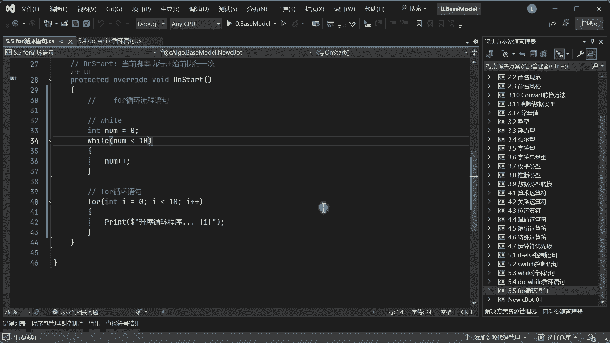

我们来打开这个CH的软件，然后给他加一个品种好。

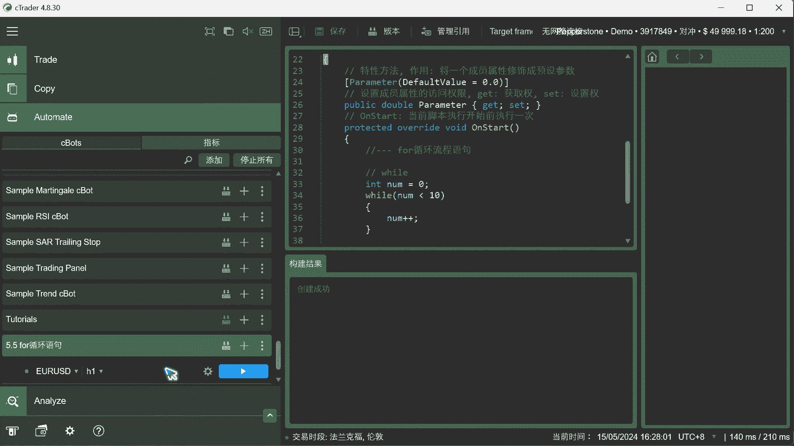

然后把这边关一下啊，好等待一下，你看升序程序开始运行，从零开始啊，0123456789啊，然后这里为什么是小于十呢。

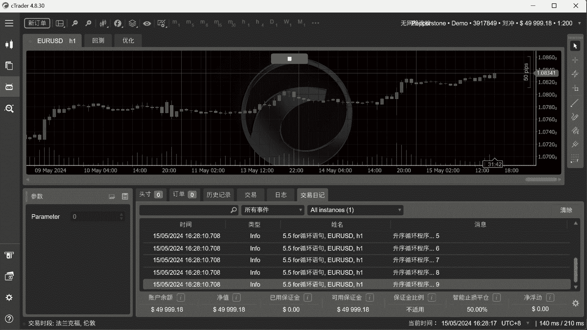

这是为什么小于十呢，因为我们循环的时候，这个这个计算机啊，它是从零开始下标，从零开始计算的啊，所以呢我们这边要去呃，就是说小于十的话，就刚好是十次，因为0~9是十次，假如说你想从1~10对吧。

也可以对吧，1~10，那你就是小于等于十，那这样的话它就会循环1~10啊，好所以说这个这个框架不一定是固定的。

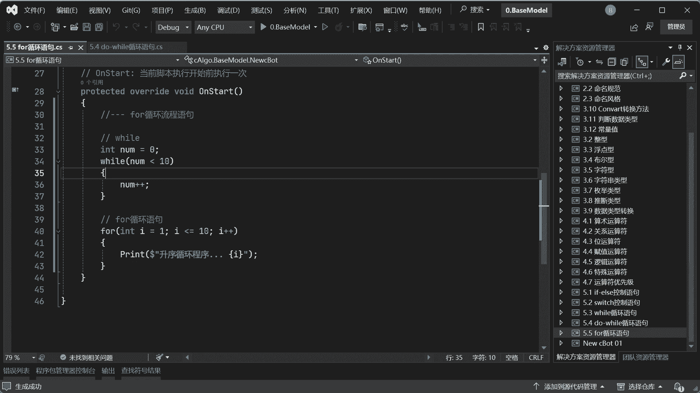

根据你需求可以改啊，好啊，比如说你想要便利1~10啊，那你看123456789十没有问题吧对吧。

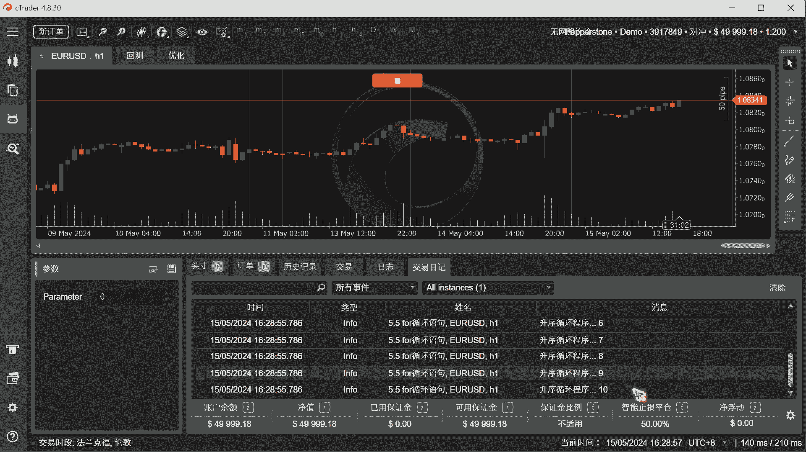

所以所以你不要禁锢了自己的思维啊，就只能说是0~10，只是因为我们后面要学到数组，那常用的话框架我们都是不用改的，直接一个数组长度，然后前面用零的跑，这样不会越界啊，好给他还原一下啊。

然后这个就是一个for循环对吧，可以看到for循环啊，比这个where话稍微简单一点对吧，当然至于你要怎么用，都是你自己的一个啊，自己的一个根据实际环境来啊，反正will能能够实现的。

for它就可以实现啊，两者都一样的，但我个人喜欢用for循环啊，然后我们再来一个倒序循环对吧，for的这个倒序循环语句啊，然后呢这里的话我们写一个for对吧好，这时候我们就要自己写了，这时候怎么写呢。

meter i要等于什么10-1对吧，减去一，因为啊等一下再来说啊，I呢必须得大于等于零对吧，最后I减减对吧，好你看接下来我们这边来再搞一个中断啊，给他这样搞一下对吧，因为这个这两个的话挨太近了对吧。

我们给它间隔一下啊，好然后这里的话我们还是使用这个，然后现在的话是个倒序循环对吧，降序对吧，降序循环程序啊，也是个I，你会发现诶，所以说你这个I它是在这个for循环体里面的，相当于在他的空间里面。

所以并不妨碍我在其他空间里面，使用这个I变量，懂了吗，如果说你要这种，你要写两个where的话，你这个还要给他重置一下对吧，这个就比较简单了好，然后接下来我们来看一下啊，好跑一下之后。

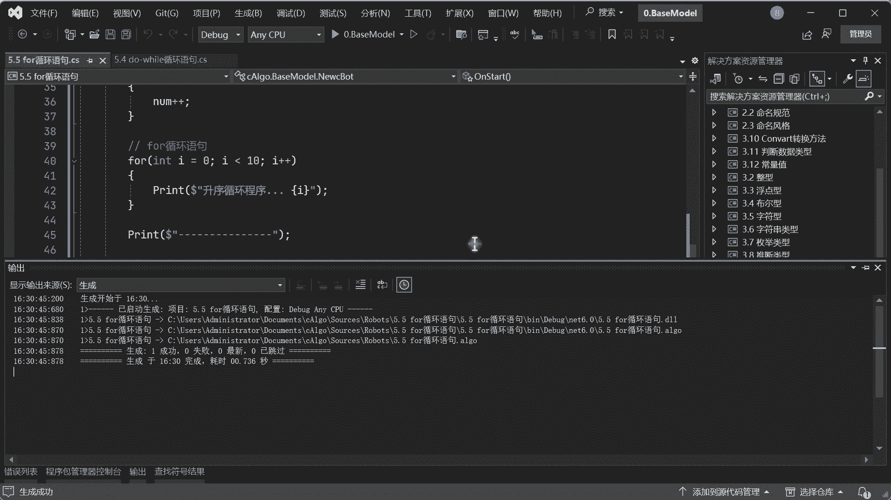

我们来看一下这个结果，好升序是0~9结束对吧，好做了一个啊间隔线，然后你看再从9~0，你看没降序循环，这样的话我们就可以实现。

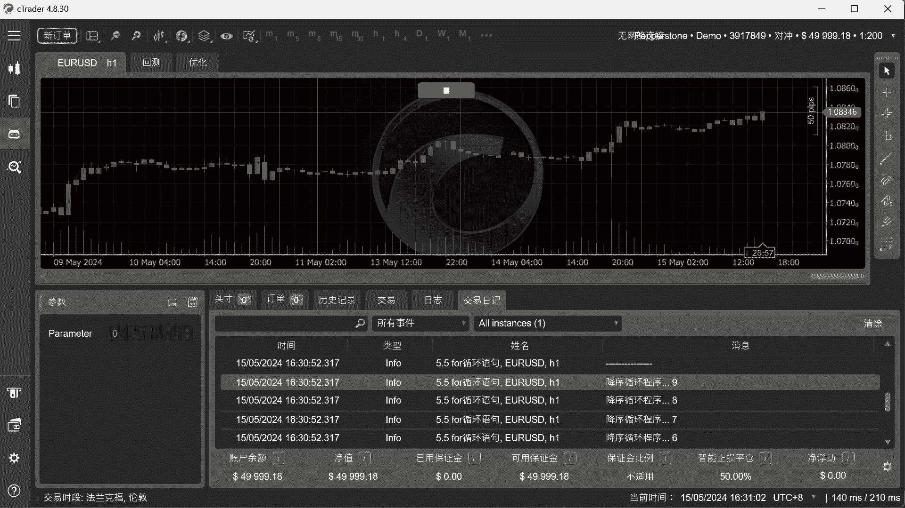

就是说啊一个升序，一个降序对吧，然后至于这个条件都是可以改的啊，当然你这里其实可以干嘛呢，就是I等于I加二，I加一啊，I等于I加二，它也是可以的啊，也是没有任何问题的，这样的话它是偶数的进行泵。

这个偶数的进行跳动对吧，好这里就我这里的话，我就不去这样搞了啊，一般的你你就那个也就看看而已，一般也用不到，一般都是按照每个顺序来进行循环对吧，但是这个will跟for的话还是有一点区别啊。

for的话就是用在什么地方呢，就不确定长度是吧，不确定长度是吧，可以直着，直到嗯什么呢，直到找到指定条件就退出对吧啊，然后这个的话就是他确定了长度对吧，然后进行循环，这个也是确定长度进行循环对吧。

就这个意思啊，好这里的话我就不去搞一些什么骚操作了啊，因为按照初学者的话，一般就这样写就行了啊，没有必要搞一些诶很奇怪的一些写法，你就认识这两个就行了，一个for循环的正序，一个是倒序循环对吧。

就可以了啊。

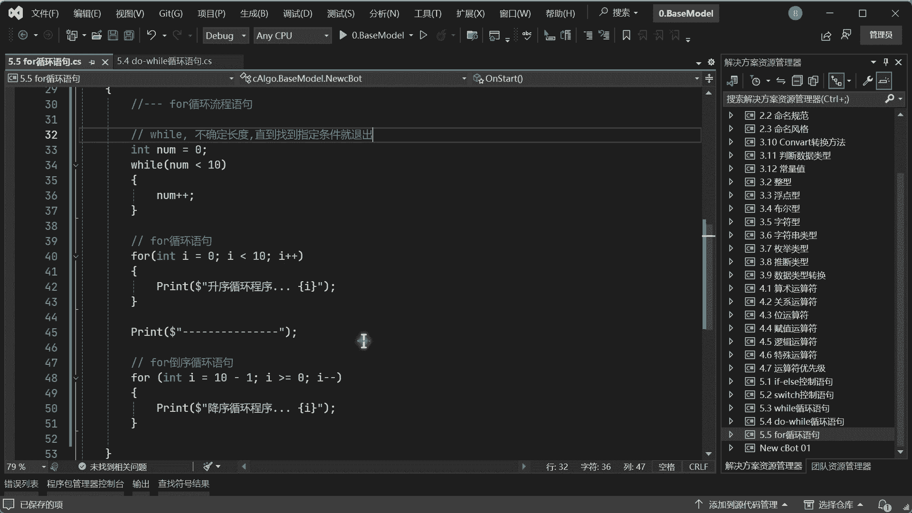

好然后接下来我们可以刚才来总结一下啊，首先第一个循环的时候它是从零对吧，然后零进行一次循环来执行里面的程序，然后呢他就会完事以后再加一下对吧，把那个I加一下，一直加到九九，小于十也就退出了。

那降序也一样，这个降序呢为什么是这样子的啊。

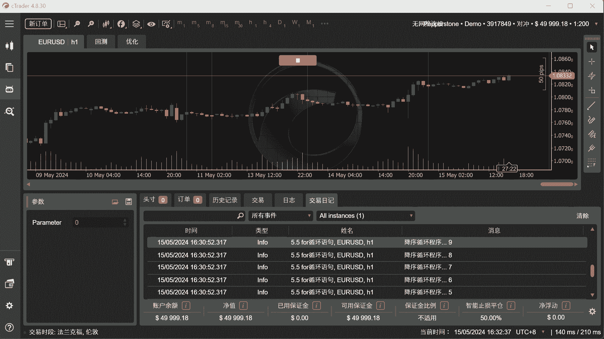

我看一下为什么要去10-1呢，因为你前面看升序的时候啊。

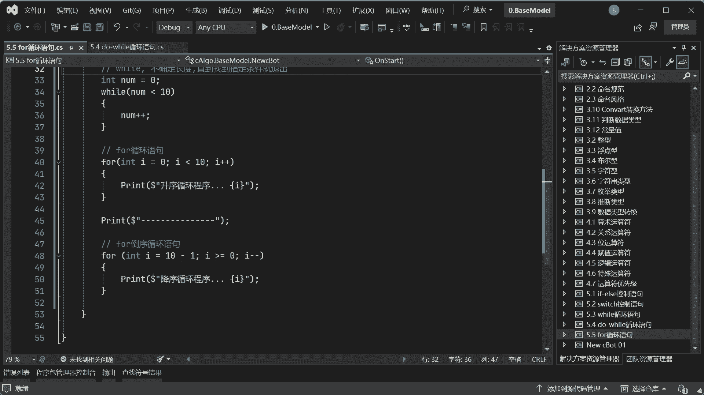

我们是0~9对吧，是不是0~9啊。

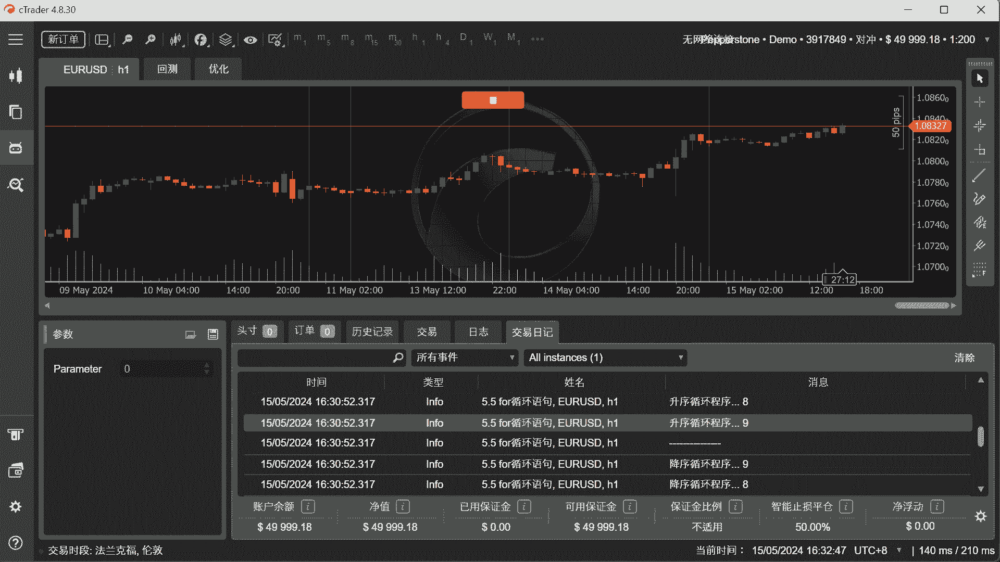

好是0~9对吧，那如果你倒序的话，你看你如果说直接等于这个十哎，可不可以呢，可以运行，但是呢你会发现它第一次等于十，它不会进来，那么肯定就是10~0了，那就是运行了11个数对吧。

所以我们一般用的时候是减一个一，这样的话就跟这个就是一样的啊，就这样意思啊，大于等于零，好理解吧，因为我们最后大于如果小于零成负数。

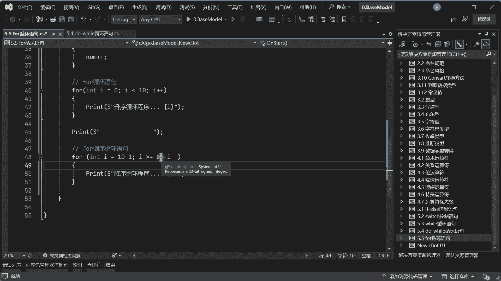

那就跳出循环了对吧，就这个意思啊，好然后这时候我们再回到这张图已经明白了，首先第一次的时候，我们初始化一个变量，来记住这个循环的次数对吧，然后呢，然后如果说刚开始为零，那进来对吧，满足条件执行代码。

完事以后呢，哎我们把这个临时的变量I呢，哎计数器给它加一下是吧，加个一好，加一的话，哎就再判断对吧，加了一共加了十次以后呢，发现哎十十和十它是相等的，这时候诶条件都达到了，哎退出去了。

就这样意思应该好理解吧对吧，就相当于开了一个计数器诶，第一次进来计数器满足执行代码啊，回去再去判断又满足，再判断再循环循环判断，到最后一次发现诶不满足了，OK哎退出执行其他代码，就这样一个过程啊。

然后这个就是一个for循环啊。