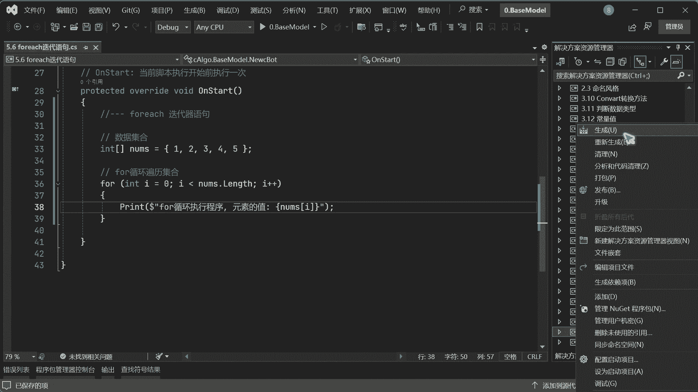
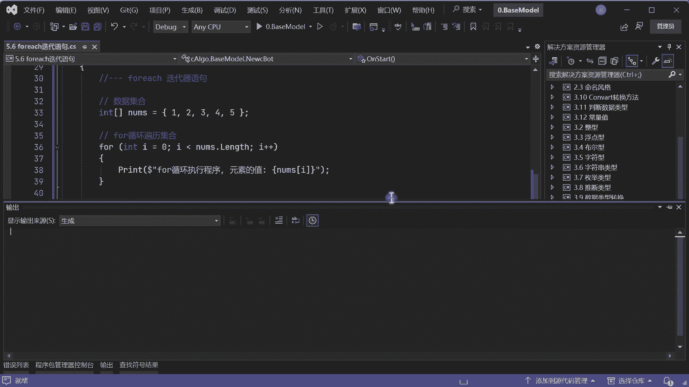
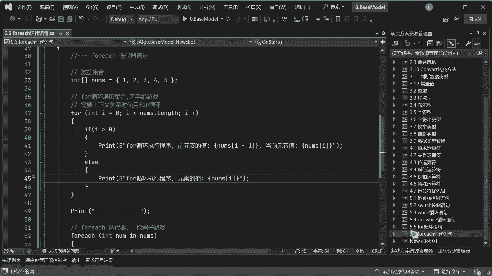
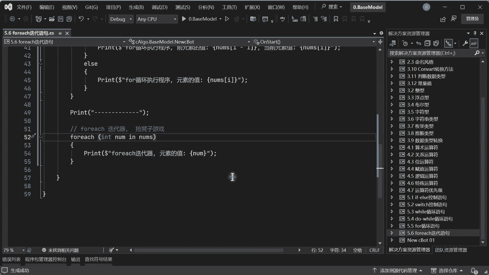

# 5.6 foreach迭代语句-ctrader软件量化交易编程教程 - P1 - 瓜皮猫量化社区 - BV1sH4y1u7Yr

嗨大家好，我是阿龙，那这节课呢我们来讲一下for一起迭代器啊，这个迭代器的话跟这个for循环是不一样的，for循环的话，它是需要定义一个这个计数器才可以进行循环，那迭代器的话它是这样运行的。

它是一种呃链式调用，就是链式什么，就像锁链一样，有头有锁链，有头有尾对吧，然后像链条在一起的，然后它的运行规则呢，就是相当于一个抢板凳的游戏，不知道你们以小幼儿园的时候，有没有玩过这个游戏对吧。

那十个人围着那个板凳进行转对吧，转的时候呢唉老是说停，然后那有人去抢这个板凳，那这个原理是差不多的，但是他这里是有序排队的，什么叫有序排队啊，假如说我们要去面试对吧，那面试的时候是不是在排号。

比如一号谁谁谁，2号谁谁谁3号，然后这时候有五个人排对吧，排了以后呢，你会发现诶第一个人是不是要先进取对吧，确实存在，比如像一号某某张三哎进面试完了，这个执行代码就是一个面试程序对吧，面试完了以后呢。

哎张三面试完，然后这时候这个呃比如说hr就会喊哎，第二个是吧，李四在不在在的来面试，OK李四存在，OK在他再进来坐到这个位置上面，然后再进行面试，啪啦啪啦对吧，完事以后再下来叫号，叫到3号。

3号在不在在继续对吧，最后叫到5号，5号以后完事以后他会叫6号，在不在啊，6号没有了没有了怎么办，不存在退出啊，这个迭代器就结束了，就这样个意思，应该好理解吧对吧，然后它跟它是有区别的。

他是要一个计数器对吧，然后你自己定义一个计数器，然后让它进行循环，而他的话他就像是一个排号系统，我也不知道后面排多少个人，但是我叫到后面没有人了，OK就退出，就这个意思啊好好。

然后啊我们打开我们这VIDUO啊，这里的话我创建好了个for each起对吧，迭代器，首先呢，我这里要准备一个一个数据的一个集合啊，现在叫它数据集合，定义一个int类型，这是一个数组啊。

我们下一章会学啊，你就暂时就跟着我写就行了啊，这时候我们里面存了一号对吧，2号三号四号五号对吧，存五个数就够了对吧，好，我们先打印，先用这个for循环看是怎么做到的，不好for循环遍历集合对吧。

好通过for，然后table table按两下再按一下两下，再按两下tab键，再按回车键，OK自动生成一个循环对吧，或者你也可以手动去写，没问题啊，呃这个集合的话，我们它因为啊一切皆对象的话。

那只要你声明了，它就会变成一个对象的一这样一个东西啊，然后我们可以通过点来得到，这个集合的一个长度，length的话就是它的一个集合长度对吧，然后这时候我们就可以来便利里面集合的数据，那怎么便利呢。

好嘶那这里的话我们用dollar福啊，然后我们现在是额啊，for循环程序执行程序对吧好，然后我们想看一下里面的值啊，然后我们写上这个远嗯，for循环执行程序，然后元素的值对吧，我们叫它元素啊。

单个的话我们在集合里面是叫元素啊，然后这里的话我们把这个放什么值呢，啊我们可以通过这个啊集合变量的名，然后通过一个像这样的中括号放入I对吧啊，这个集合的下标啊，他是从零开始的，而不是从一开始的。

我们下节课再学啊，我们现在只是看这个例子啊，下一章再学好，现在的话啊我们来看一下啊。

生成好，生成以后呢，额这里的话我已经加载过一次啊。

好然后这边给它关掉，跑一下，好你看这时候可以便利出原数12345，没有任何问题对吧，这是通过for循环。

然后通过他的一个下标号，来找集合里面的数据对吧，然后接下来我们再来看一下啊，我们print一下，然后给他加一个分割线对吧，这样的话我们就循环体就分的清楚啊，接下来我们用这个for一起啊。

for each起迭代器啊，我们叫它迭代器不叫循环了啊，好for each起对吧，然后我们按两下tab键，按一下好，这个只要按一下就够了啊，然后再回车，OK自动形成了一个迭代器对吧。

然后自动呢把你前面的集合名呢放在这里好，这时候我们把它名字改一下，改成N是吧，好这时候这个代码怎么理解呢，那首先我要迭代什么东西，是不是一个集合数据集合排队的数字对吧，现在五个人要面试对吧。

那in什么意思，从这个集合里面取一个数出来，然后交给这个none对吧，明白了吧，从这个集合里面印，我如果因为老外他是要从右边理解的，所以呢你说我要取一个数对吧，从哪里取in这个集合。

LTH这个集合里面去取一个数出来，然后我现在用临时的一个变量来存到这个数，对吧，就这样意思好，接下来我们就来接收一下，看一下啊，for一起的话是迭代器，好然后原数值是什么，这时候就用不到这个了，对吧好。

我们就可以用这个none，好看对吧好，然后我们来看一下它有什么区别啊，生成上证以后。

我们来这边给他跑一下，第一个for循环哎是通过下标找，然后迭代器的话它是通过也是12345，看这样没问题，对吧好，这时候你有疑问啊。

那如果那你说你这个for循环可以做到，那我这个迭代器可以做到，那那我为什么要去用迭代器呢，我用这个for循环不是搞定了吗，首先迭代器的话，我说过这个相当于什么，这个就是一个丢手绢的游戏啊。

丢手绢的游戏是什么意思呢，我有集合，但是呢我是不是有有很多人在这个丢手绢游戏，在围圈的在跑对吧，就所有就是所有的每一个都要点到对吧，你转的时候每个人都在转对吧，然后丢到后面。

后面那个人就哎就起来去抓另外一个人对吧，就丢手绢游戏，就是我已经就是拿到你所有人的信息对吧，然后我通过随机的，比如说我转圈啊，然后丢到谁谁就被选中一样的道理对吧，然后迭代器是个什么东西呢。

迭代器相当于是个抢凳子游戏对吧，就只有一个凳子，丢手绢的时候是每个人都有，都可以坐下来，都有凳子坐的，有一个人在丢对吧，所以每个每一个都有坑对吧，然后这个的话就是说抢凳子只有一个凳子。

然后有一个凳子什么意思呢，比如说我这个的话，他如果说占集合集集合是五个数，那五个数假如说是int类型那一个元素的话，占四个字节，那占25个字节，那你这个for循环是不是便利了25个数据啊，对吧。

然后这个for一起的话，诶它就会只有一个凳子的话，相当于我在内存中只占了一个视角的空间，然后是每个人都去坐一个凳子的话，他相当于只占四个空间在在进行来回的坐，来回坐这个凳子，明白了吧。

这样的话就相当于在性能上就有，有就是内存占用上就稍微有点优化，大概就这样子啊，当然也不太严谨，反正反正用处对我们来讲就是这样的，我们什么时候用for循环呢，就是需要上下文，上下文关系时使用for循环啊。

什么意思呢，你看到我如果说我遍历这个I对吧，我可以在这里便利I减一对吧，当然这里还要严谨一点啊，因为我现在写的话，他可能会越界，因为刚开始为00-1是一，那这个这个就直接报错了对吧，所以我可以这样啊。

if f一下，比如说我这个I啊，必须干嘛呢，啊要大于零才可以啊，哎大于零，OK好才可以运行这个程序啊，为什么，因为你如果I是零的话，0-1一的一，它这个下标没有啊，但是我们后面学了速度就会知道啊。

现在你不用管，我现在给你演示一下啊，什么叫上下文关系，你看我当前的这个I呢，当前的值可以拿到前面的值，我恨是可以拿到后面的值对吧，拿到这个，比如说我如果变量这个二下标我达到二，我可以拿它左边的值。

也可以拿到右边值，明白了吧，好看我看我现在变异给你看啊，如果大于零，我可以拿前面的值对吧，额如果大于零，我们这边如果不就这样给他做的完整一点啊，好如果说他是为零对吧，这样写，然后开始的时候前值啊。

前元数值对吧，然后我们再给它来一个当前元数值对吧，那就是这个nth i对吧，好好。

好接下来我们跑着看一下啊，啊你看最最开始的时候只有一个值，它是一对吧，然后你看我前面数是一了，我当前元数是不是二对吧，我可以干嘛呢，什么叫上下文关系，就说我可以获取到前面的值，或者它后面的值都可以对吧。

明白了吧对吧，我有这种需求，我需要前后来获取前后值来进行运算的时候，那你只能用for循环，那迭代器你会发现可以做到吗，做不到，为什么，因为它只能编辑当前值，因为它是一个板凳，它一进来以后。

他就没有前后关系了，就是他自己明白了吧，比如说我进来是一，那只能是当前值了，它没有一个前后值的一个概念对吧，因为你发现我迭代的是每个元素的值，而这个是迭代的是每一个下标值对吧。

相当于我取了一个他的一个位置对吧，11号位是从零开始算是吧，他在0号位啊，0号位取了个值是一，而这个迭代器的话是直接把这个值拿过来了，你看到没有懂了吧，所以需要上下文关系的时候，可以使用for循环。

但是其实不需要上下文关系的时候，大部分都使用for一起啊，回忆起的话哎比较简单了对吧，直接可以运算这个值，就这样个意思啊，好这个就是关于这个呃for一起的循环对吧。

可以看到就是说他每次只拿一个值出来对吧，然后会检查后面的值，运行完以后检查后面的值，后面值没有值了，就退出，有值继续对吧，然后这个一定要去有计数器对吧，然后这个就就可以运行上下文关系。

然后这个如果不需要上下文关系，可以用for一起啊，就这两者的区别。