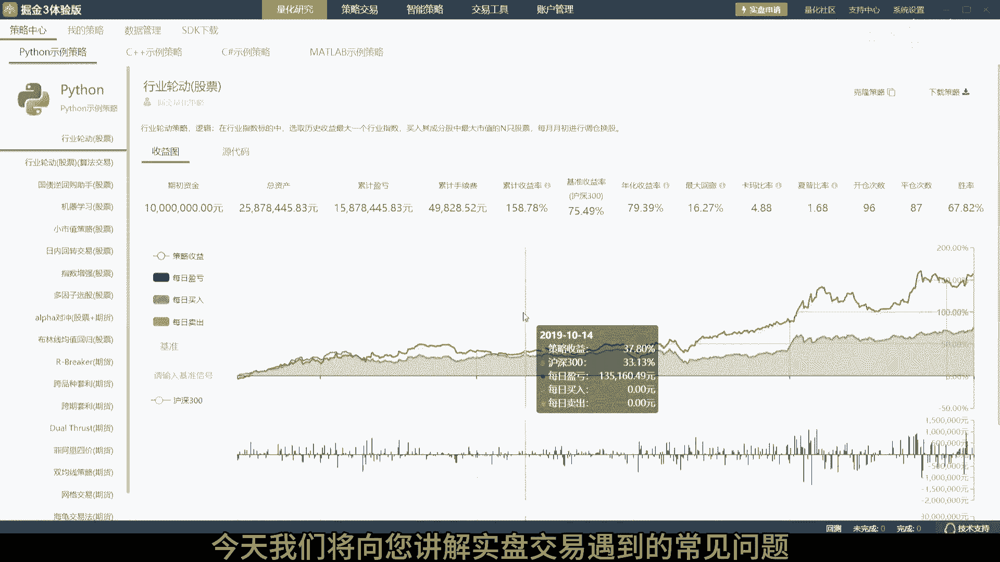
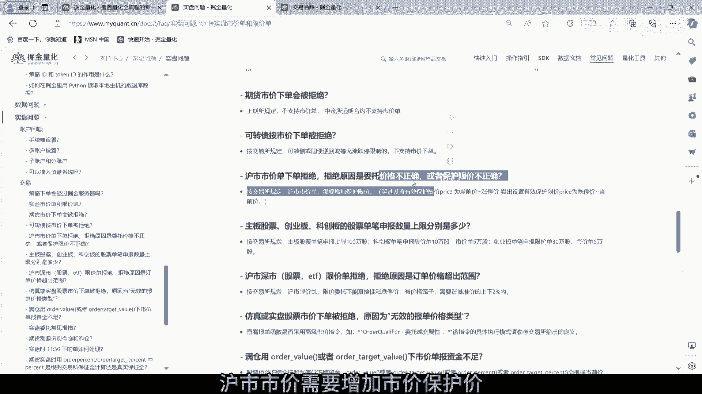
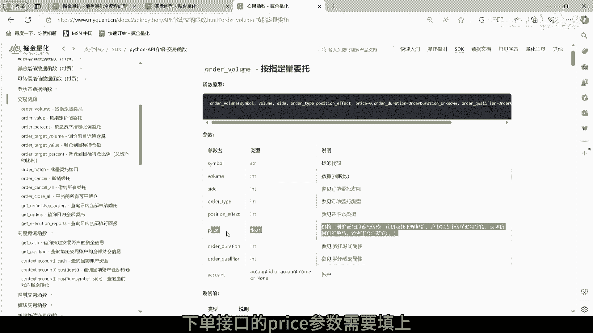
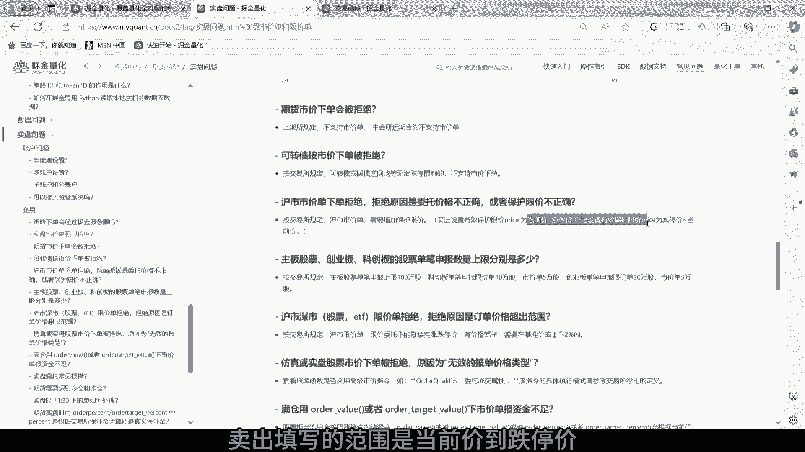
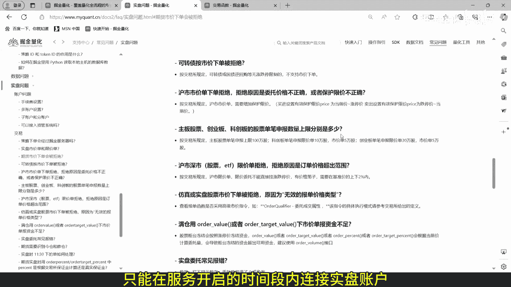
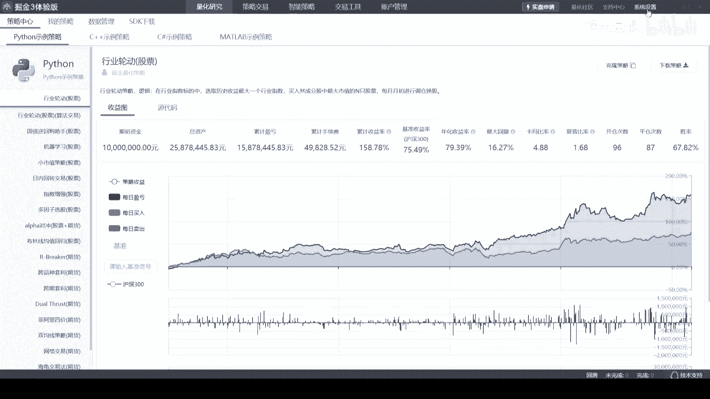
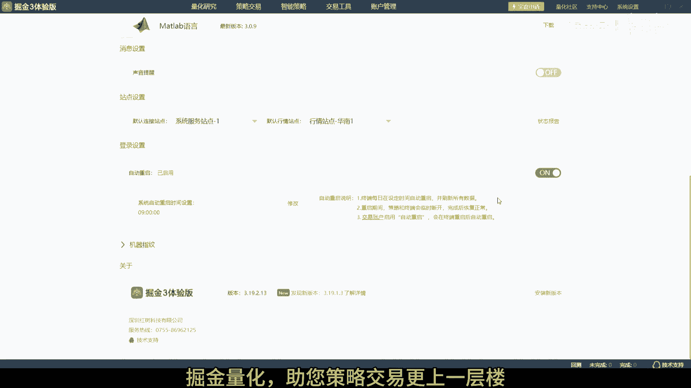

# 5.7 掘金量化终端股票实盘常见问题 - P1 - 掘金量化 - BV1sM4m1r7CQ

欢迎来到股票实盘操作指南，今天我们将向您讲解实盘交易遇到的常见问题。

第一可转债和国债逆回购不支持市价，第二自从注册制新规后，沪市试驾需要增加试驾保护价。

下单接口的price参数需要填上买入。

填写的范围是当前价到涨停价，卖出填写的范围是当前价到跌停价。

第三委托数量限制，主板股票单笔申报上限100万股，科创板单笔申报限价单10万股，市价单5万股，创业板单笔申报现价单30万股，市价单5万股，如果委托量超过上限，需要策略自行拆单或者使用拆单算法。

第四限价委托会有价格笼子，买入申报价格不得高于基准价格的，102%，和买入基准价格，以上十个申报价格最小变动单位的孰高值，卖出申报价格不得低于卖出基准价格的，98%，和卖出基准价格。

以下十个申报价格最小变动单位的孰低值，开通极速柜台后，连接主柜的交易软件会交易不了，资金和持仓都会切换到极速柜台，需要到连极速柜台的软件上交易盘后，极速柜台的数据会同步到主柜，结算，结算后。

连接主柜的交易软件才可查看当天的交易信息，盘后连接极速柜台的服务会关闭，一般开启时间是8。50到16。30，只能在服务开启的时间段内连接实盘账户。

掘金终端可以设置每天自动重启终端。

自动重连实盘账户实现全自动化，感谢您观看本教程，如果您在使用过程中有任何疑问，欢迎随时联系我们的技术支持团队，掘金量化。

