# 5.8 循环跳转语句-ctrader软件量化交易编程教程 - P1 - 瓜皮猫量化社区 - BV1xb421q7Jy

嗨大家好，我是阿龙，那这节课我们来讲一下循环跳转语句，那循环跳转语句用来干什么呢，它可以就是控制我们这个循环中啊，根据某一条件可以选择中断这个循环，或者是呃跳过一些数据的循环。

就比如说呃你比如说我这个找某个订单对吧，那如果说我这个订单找到了是吧，通过他的注释，我标记了某个订单，我就把它标记找到，OK我这个循环是不是要结束了对吧，因为不然的话我早到了，我还要去把这个循环跑完吗。

肯定是不需要的，所以有可能这个订单在这个几个，比如说在这个循环的过程中对吧，所以呢找到了之后怎么办，我们是不是要弹出来啊是吧，我们可以用输这个布莱克这关键字，叫做跳转语句，它可以终止这个当前的循环。

对吧啊，然后还有一个叫做啊是跳过当前循环，那既然可以跳出整个循环，也可以过滤掉一些信息，比如说我找订单的时候是吧，我想找多单对吧，我空单我不想看，我想找下多单里面的一些数据，那我可以空单之后呢。

就直接通过这个continue的话，跳过了这个唉，就当前的这个订单信息对吧，只找这个多单，就是这两种区别啊，一个就是说跳出整个循环，一个就是过滤掉某些哎循环的一些内容对吧，好好到这里的话。

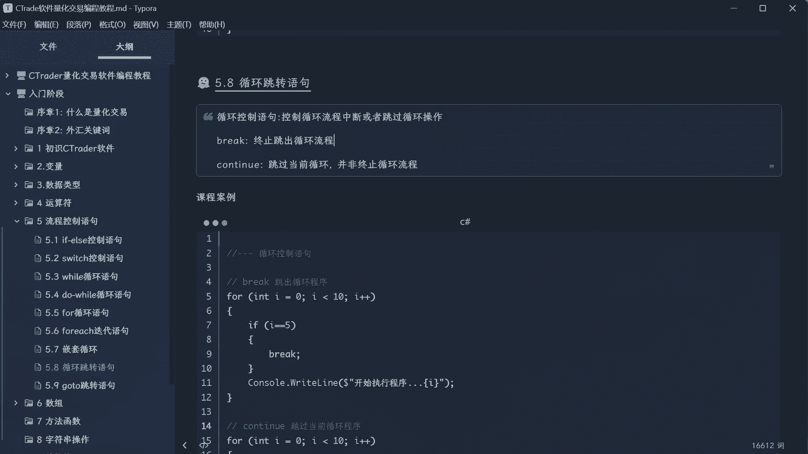

我们打开我们的viz studio哈，首先呢我们来演示的是这个，black对吧好啊，叫做终止，啊终止循环语句啊，就这样吧啊终止循环语句对吧好，首先我们启动一个for循环，我就是随便写一个啊。

然后这里的话我们就给他一个十对吧，从零便利到十对吧，OK好假如说我现在有个需求，比如说哎我我找到这个I，我这个I呢啊，如果说等于五对吧，那我干嘛呢，哎我就跳过对吧，哎black对吧。

然后这里我们给他打一句话哈，写上对吧，假装一下我们这个运行程序对吧，好，已经找到了几呢，把这个放进去是吧，你看如果等于五，这不是找到了五，那我就退出这个循环是吧，好这里写上退出循环好，退出循环流程对吧。

OK好，然后正常的话我们就让这个程序去跑对吧，啊不用cos啊，应该print对吧，然后这个是，啊正常运行正常运行语句啊，OK对吧好啊，这里的话我们给它加一个那个加一个I对吧，好看一下I的变化对吧好。

我什么都不加的时候对吧，他肯定会跑0~9之间对吧，都快跑完，那如果我加了个过滤条件，哎我找到了哎某个信息，那我又通过black来开出这个循环对吧好，现在我们生成好。

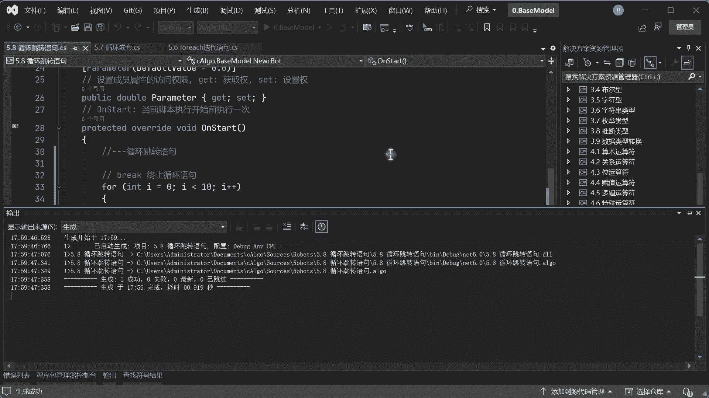

生成以后呢，我们打开这个CH的软件，给它加载一个品种。

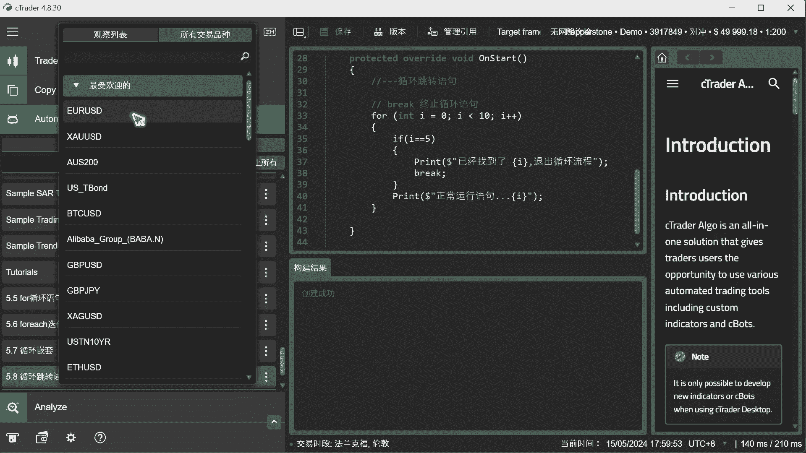

好好现在跑啊好，你看正常运行语句哎这没问题，因为他在找是吧，找找找哎，找到了五哎，找到了五退出哎，看到没有，后面6789是不是没有了。

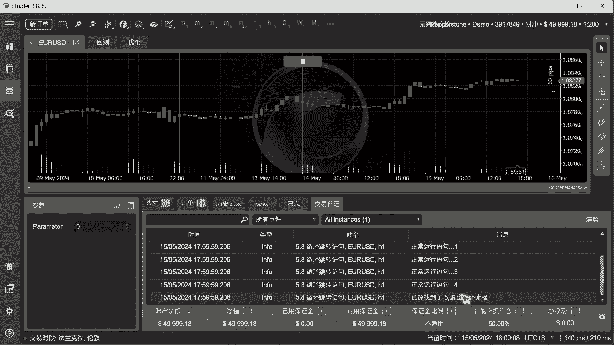

对吧，就是这个作用它会中断我们的这个程序啊，好接下来我们再看continue啊，c o n t i new就是跳过当前循环，程序啊，跳过当前程序啊，什么意思呢，我们还是用个for来表一下啊。

这个的话我们先用这个啊，用一个华丽的，这个叫，华丽分割线对吧，来区分一下，好吧好OK，我们看一下这个是怎么弄啊，首先I呢还是小于额小于十啊，只要让他跑十次就够了对吧，那I呢加加啊。

OK那好了以后这个是怎么做呢，比如说我想找一下这个循环中或者元素中，所有的奇数对吧，那怎么搞呢，我应付一下啊，如果说我这个I对吧，模对吧，百分号二等于一，它就是个奇数了对吧好嗯，如果是奇数啊。

那我们就打印一下，好吧好，比如当前基数啊，四什么对吧，把这个I放进去啊，因为你模二的时候，他的余数为一的，表示是个单数了，但他肯定是个奇数对吧，好正常的话啊，然后那如果说找到这正常是找奇数对吧。

那还有一种情况对吧，else那如果不是，那怎么办呢，那我们就直接continue哎就可以这样看到没是吧，如果你是基数，我就OK了是吧，如果不是，那就control就直接跳过了对吧，就这个意思啊。

好接下来我们来看一下啊，生成。

哎你看就当成13579都没问题对吧，你看0123456都也002468是吧，都没打印，看到没对吧。

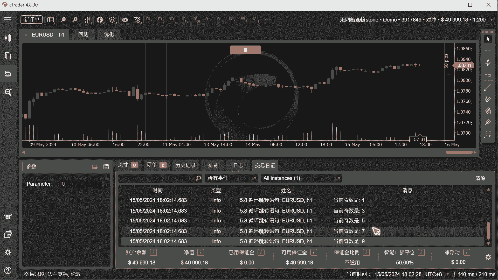

然后呢这个程序它一定会跑完，你看到没有，所以这个布莱克和这个CONVENUE有区别，是是过这个布莱克的话，是整个这个循环都已经终止了对吧，然后这control的话它是过滤掉某一信息。

比如说我只想找基数对吧，或者我将来我找订单的时候，只找拜尔单就做多，订单做空不想找对吧，我可以诶也可以做这样一个事情，判断一下，如果等于多单，OK就运行，如果不等于多单，OK可能有就弹出，就行了对吧。

就这个意思啊，好嗯，然后这个的话我们一般的话control，应该放到上面对吧，放到上面还这样好理解一点啊，因为你这样的话不效率，为什么，因为你这个要判断这个才能再判断。

这个一般我们continue话是放在上面，如果它等于零啊，我们就跳过对吧，这样的话他就哎非常的高效了对吧啊，卡特内容一般是放在这个前面啊，就是把这个非条件的先过滤掉，这样的话就有才会发挥它的最大作用啊。

非条件的过滤掉对吧。

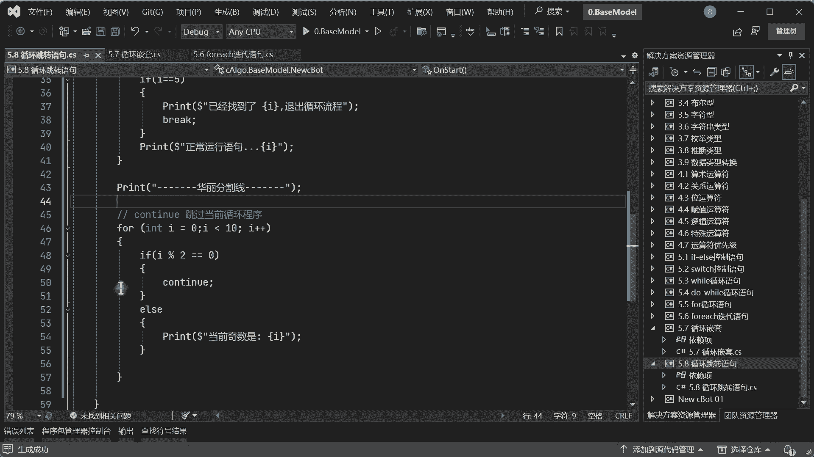

如果是需要条件留下，这样看啊，这样的话的作用才会出来啊，然后我们变这个结果是不会有变化。

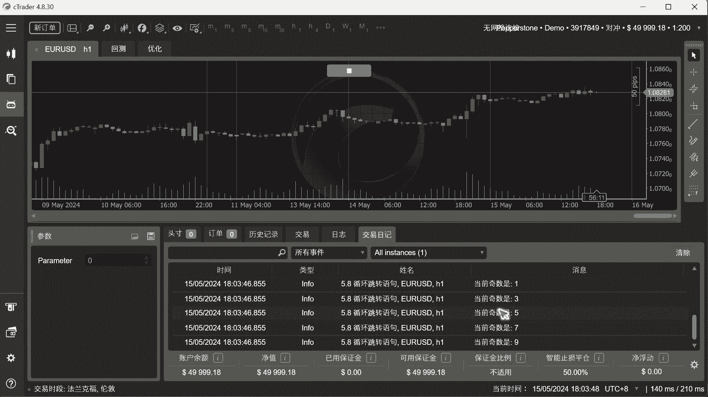

但是从这个优化的效率来说啊，修这样的话可能性一般放到上面就比较好了，对吧，因为直接跳过了，他就不会预计下面的程序了对吧好，优先过滤额非条件的对吧，不满足条件时使用对吧。

后面就说先把这些额不需要条件过滤掉，它就非常高效了啊，但布莱克的话就就要放到后面了，因为你要前面判断一些，然后再确定找到了再退出，对吧啊，就这样子好，然后的话我们再来看一下循环嵌套啊。

这个for这个for一起其实也可以啊，for一起的一个，流程控制啊，啊流程控制，其实他也可以啊，比如说我定义一个int对吧，准备一个数字数，准备一个集合是吧，昂等于这个什么呢啊123456啊。

就搞五个数啊，不搞太多了对吧好，然后我for一起啊，for一起好，然后这里的话我们就给他把取一个名称啊，这个是自定义的对吧好，接下来我们也可以做像那样子啊，比如说if一下啊，很down，如果说等于了解。

等于了三，我们就给他干嘛呢，哎就布莱克一下，对吧也可以啊，好这样也可以对吧，这样就稍微简单一点了啊，就布莱克，然后这里的话我们就这里已经找到了，退出这个迭代器啊，但布莱克你不能把这个话写在后面啊。

你写到后面他就会隐藏看见没有，他告诉你这不会执行的，因为他如果是black的话，后面的不会执行的，所以black一般都放在下面，对吧啊，这个话我们把这个NN放进去对吧，我已经找到了这个值，然后我退出。

那正常情况下我就让你去跑啊对吧，正常运行迭代器是吧好然后这个none放进去好，我们找到三就找到了，就退出是吧，其他情况我们就让它正常运行好吧，接下来我们看一下啊，生成。

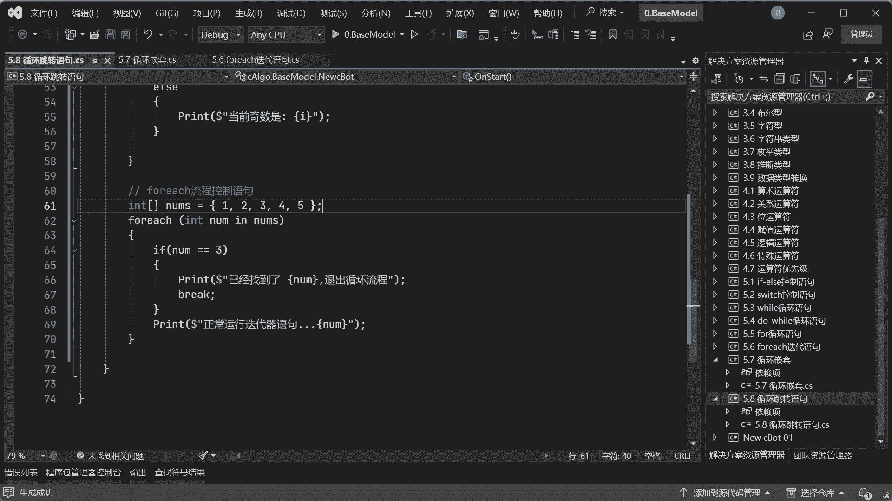

啊你看是吧，正常运行结在器找到三哦，退出对吧，他也可以用到啊。

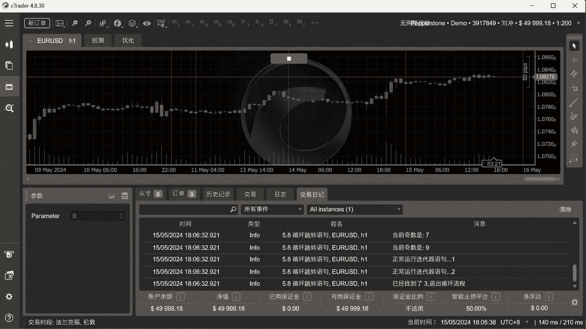

当然了也可以做，像这样的例子对吧，来打印一些奇数偶数对吧，啊这里的话我们就再启动一个for循环，再起一个for一起迭代起啊，还叫迭代器啊，好然后呢怎么办呢，那你这里的话我们就if一下啊。

啊if如果说你这个什么呢，这个值啊，这元素的值如果说模二它是等于零的，那怎么办呢，我们continue对吧，好如果不是呢啊或者else其实else写不写都没事啊，或者你这个我就不写了啊。

因为这个已经判断了对吧，如果说是偶数就跳出了，所以我在这里呢可以直接来打印这个，当前基数啊，好你这里呢其实也可以不写，因为这里已经弹出去了，他也不会执行这个else对吧啊，这个也是一样的对吧好。

接下来我们把这个给他放进去啊，把这两种方式都给留着啊，正常应该规范要这样写对吧，当然有的时候我们也可以直接用这样的方法，直接如果非条件的我们就弹出去就行了，下面也不会执行对吧好，接下来我们来再看一下啊。

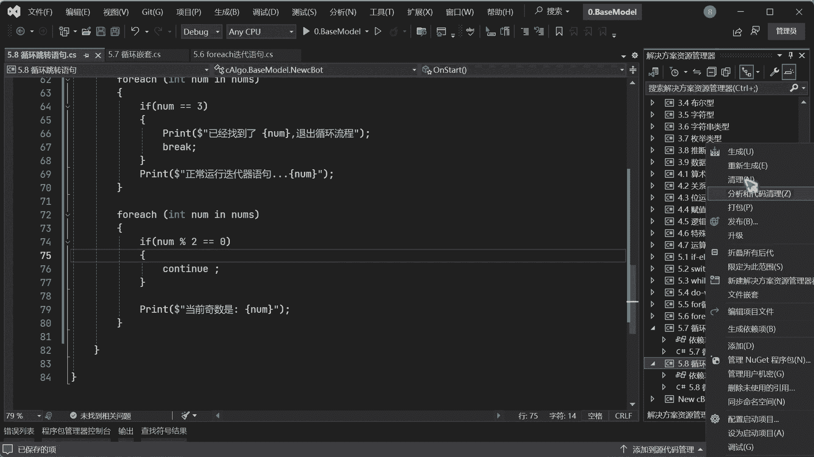

好，你看当前奇数135没有问题吧对吧，也是可以的，发现没有。

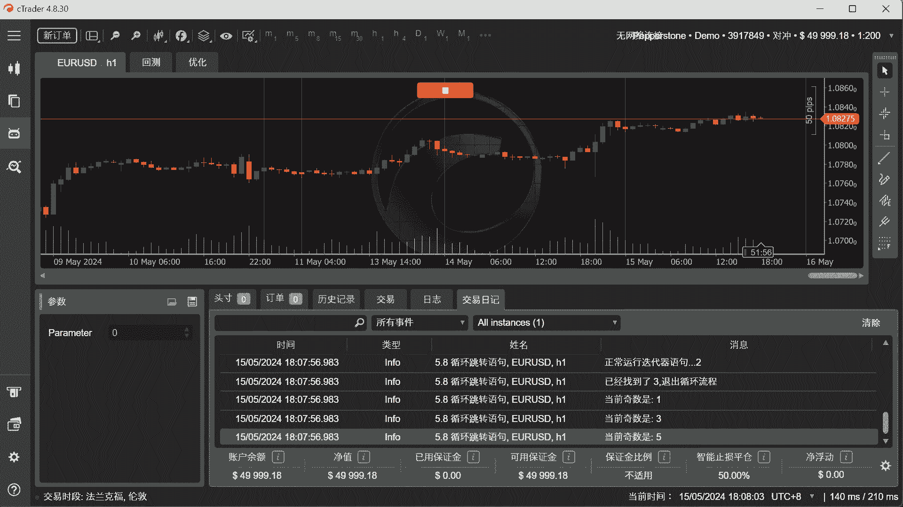

所以它不仅限于说你这个for循环，你可以用while，也是可以用do while也可以用对吧，还包括前面我们的switch也可以用对吧，所以它就是专门用来控制迭代器啊。

或者是这种这种能够循环的流程机制的对吧，都可以用对吧好啊，还有一个关键点就是在于这个，嵌套循环等流程控制啊，好嵌套循环流程控制好，我们通过for，然后这边呢啊用I来小于这个十对吧，I加加好。

接下来我们里面再写一个循环，这时候这个I的必须得给改个J对吧，好，啧那这个运行十次的话太多了啊，这里运成一个五次，然后这个子循环的话啊，也运行一个五次啊，给大家看一下啊，然后我们来这里观察一下啊。

假如说我if一下这个J对吧，子循环如果说它等于了一个三好吧，等于一个三，那我就通过这个black对吧，给它弹出去对吧好，接下来我们来啊，嗯输出一下啊，好，写一下啊，子循环，子循环找到对吧，找到了什么呢。

好然后把这个值给它放进去对吧，呃放这个G不是I啊，看最后用这个分号结尾啊，Ok，好就这样的程序对吧，我让这边来跑，如果找到了这个G他就跳出去对吧好，现在我们来观察一下它个过程啊。

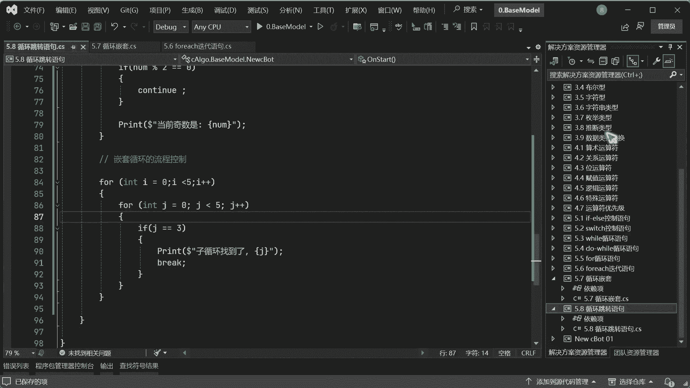

好然后这里的话我们给他跑一下，你会发现只循环找到了几次啊，一个一次两次三次四次五次找到了五次诶。

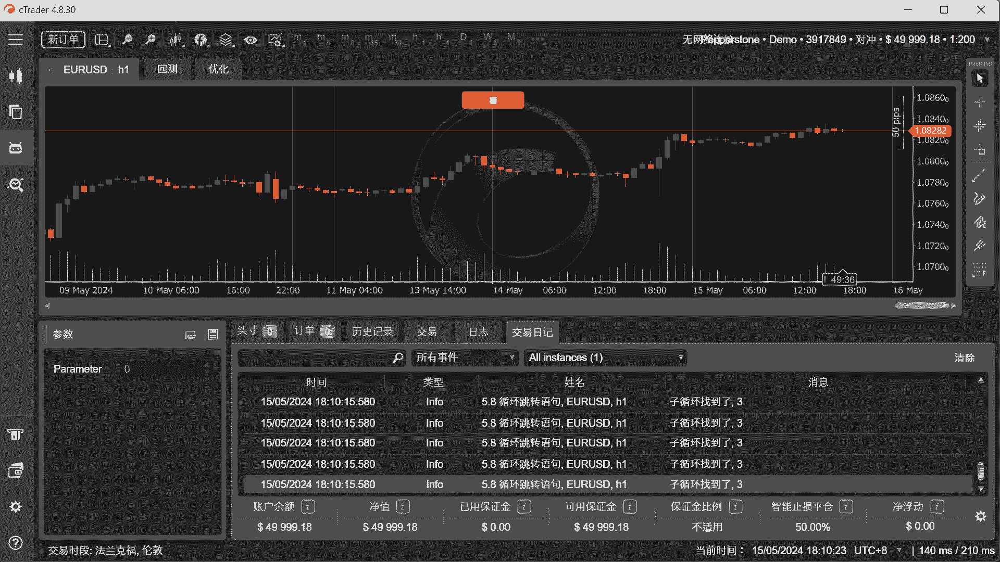

为什么呢对吧，为什么你要按照这个布莱克，你不是说可以跳出这个循环吗，对吧，布莱克的话，他只能跳出这个跳出当前的这个循环体，他不可以去跳出整个循环体，所以要注意啊，对这种这种叫做跳转语句啊，子。

恰等于作用范围只作用于当前循环体对吧，所以他对它是没有任何干扰的，所以他打印了五次对吧，因为按正常理解的话，你没学过理解，哎你说了布莱克他应该跳出循环，那它也是个循环，那到底是跳哪个呢，是全部跳出去吗。

不是的啊，它只能跳过当前的循环对吧，明白了吧啊，所以你如果说你想跳出主循环，那你这里要再去写，再要再写布莱克好，这里我就不搞那么复杂了，就告诉你这个布莱克只能跳出这个子循环，不可以跳出主循环，对吧啊。

然后这一块就是关于两个流程语句啊。

两个这种跳转语句啊，其实跳转语句的还有一个有四个啊，但是呢我为什么把它分开呢，因为这一块这两个主要是用在这个循环体，比如迭代器里面，那还有一个叫做go to跳转语句，我们下节课再讲。

还有一个叫做return，return的话，一般是函数用的比较多，所以我们到时候放到函数里面去讲，就这样的啊。

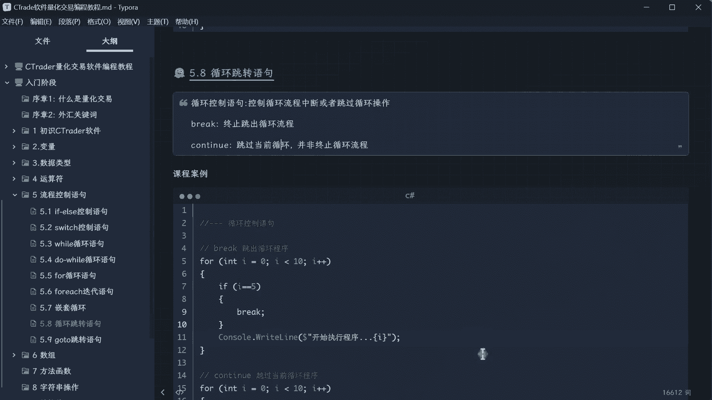