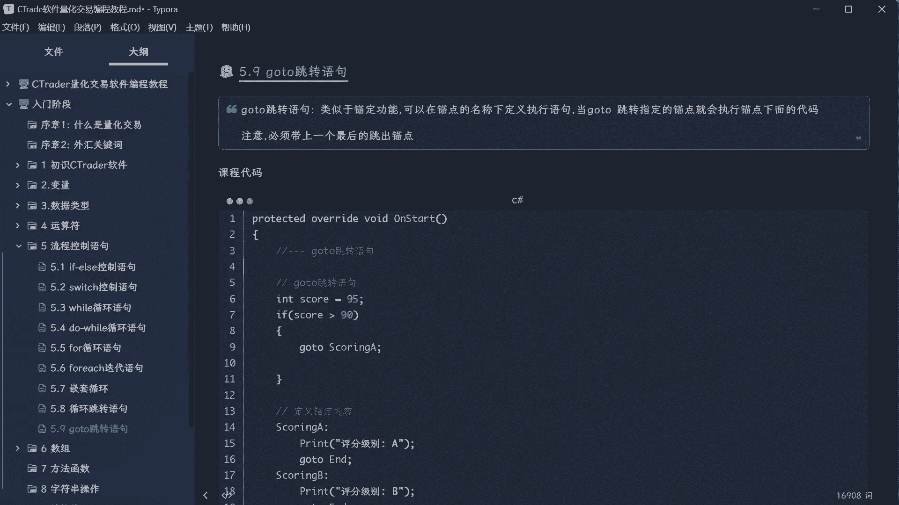
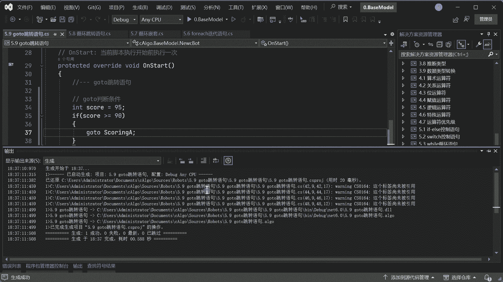
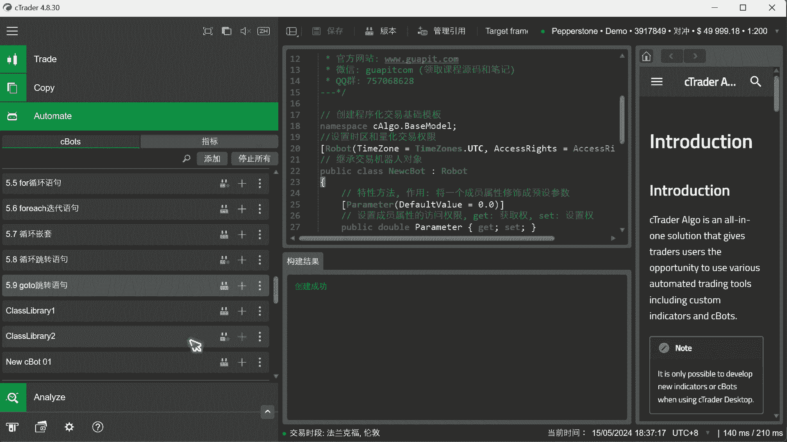
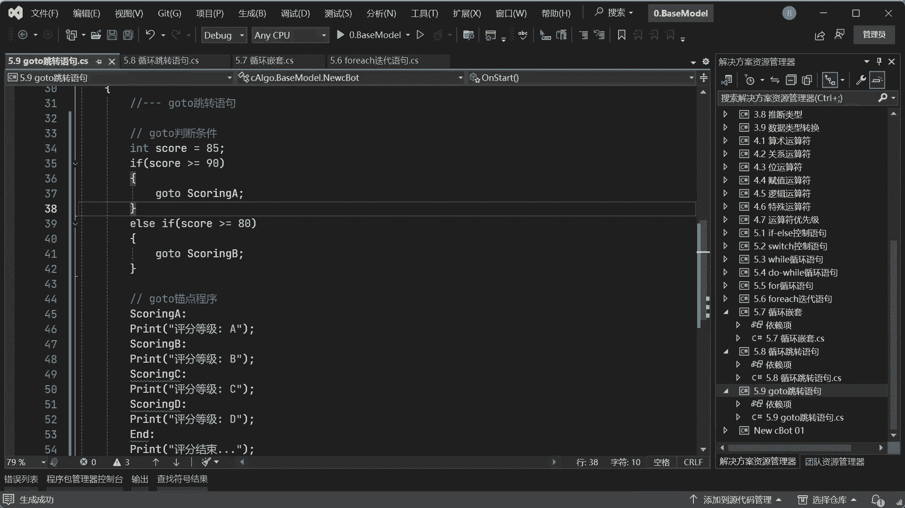
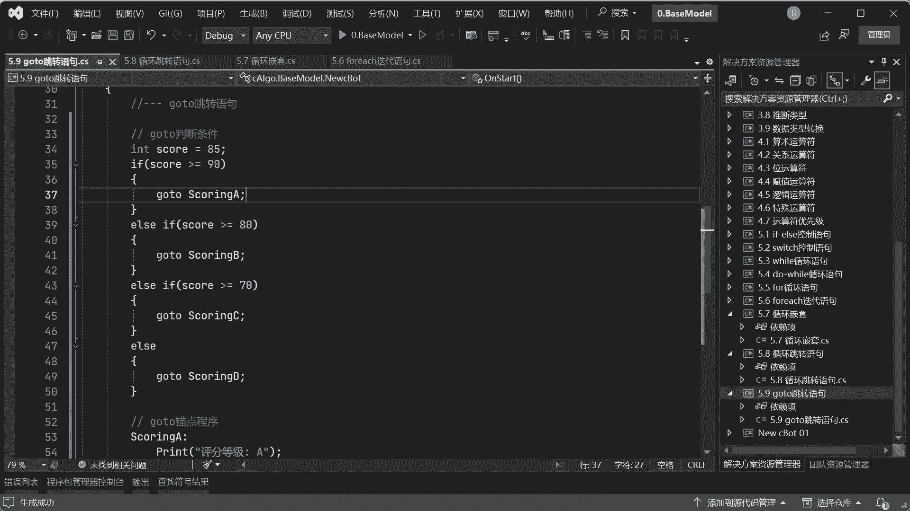
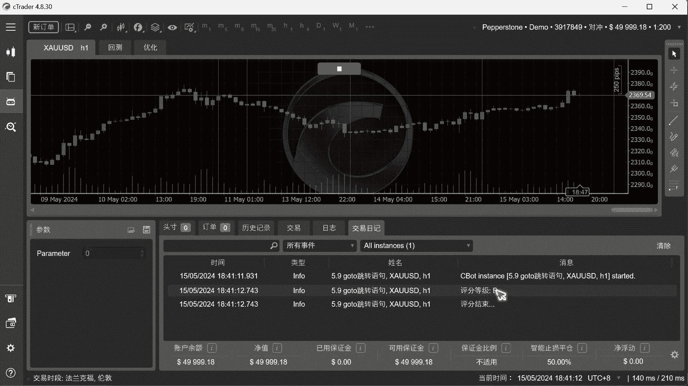
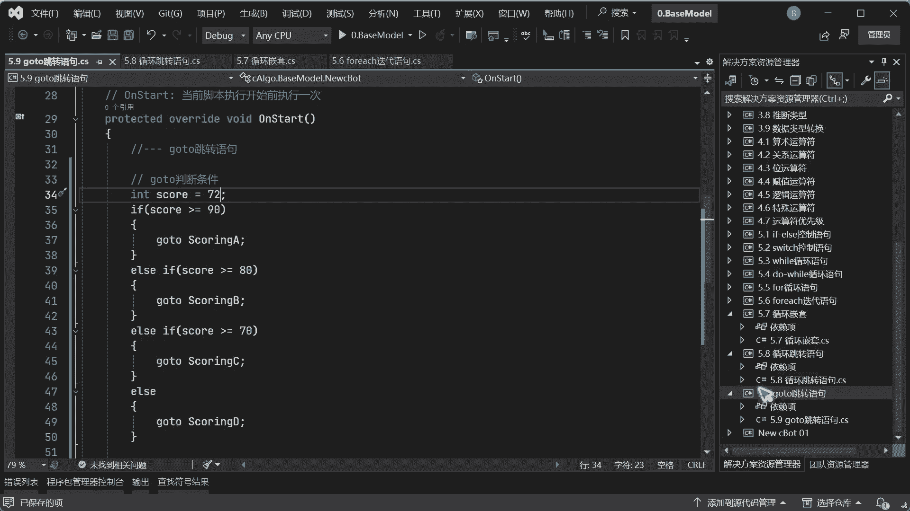
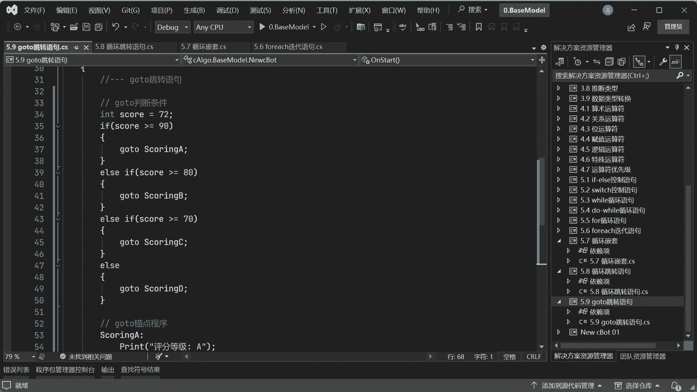
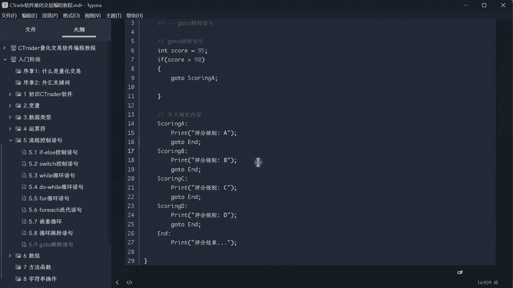

# 5.9 goto跳转语句-ctrader软件量化交易编程教程 - P1 - 瓜皮猫量化社区 - BV1YU411Z7DU

嗨大家好，我是阿龙，那这节课我们来学习下go to跳转语句，什么是go to跳转语句呢，它其实我在这里理解吧，它是一个锚点功能，就说我可以定义一些锚点对吧，然后呢我可以诶在前面呃。

比如说定义好锚点以后呢，唉我通过一些条件让带个代码块可以跳过一些，跳到某些地方进行运行对吧，那什么作用呢，你想想比如说我这里写了一个笔记对吧，我点击一下5。1诶，它可以跳到这里来，那我点击到5。

3A又跳到这里来，那点击一下5。9A又跳回来对吧，但是有点不一样啊，你跳的时候呢它跳到这个地方以后，它就会从这里再来开始跑剩下的代码，所以呢我们一定要在最后呢给他再来沟通一下，得出一个就是跳出去对吧。

不然的话你不加这个go to的话，他会把这三四个都跑完好，我们等一会再来讨论这个问题啊，好首先我们打开这个VCVSCODE对吧。

好嘶嗯好，这里的话我们先嗯写一个嗯，先把这个锚点啊先写出来，锚点程序啊，叫它我可以叫它锚点程序啊，go to锚点程序，啊这里我用一个评分系统对吧，比如说我评分A对吧，一个冒号，然后加上这个打印一下啊。

print就假装是个程序运行对吧啊评分等级是吧，然后选择一个A好吧好，接下来我们再写一个嗯，平分一个B对吧，Print，哎评分等级好，再写个B好吧好好，接下来呢我这里就直接复制了啊，写四个好评分。

四个系统对吧，评分ABCD啊，好然后这里的话我们是CD对吧好，接下来我们还要再加一个结束程序啊，啧有的时候它智能提示太过了啊对吧，我print啊，写一个啊，评分结束对吧，好在三个点好代表评分结束好。

接下来我们来写这个go to的一个判断条件，对吧好，首先我定义一个分数啊，等于一个95分好吧，然后if一下，假如我if一个，这时候大于或者等于90分，那这时候我让你干嘛呢，哎我就平分走这一个锚点对吧。

怎么走锚点呢，就用到go to空格，你看自动就提示了，然后用分号结尾，这样的话他会跳到这个分号，现在就有一个问题了对吧，他如果跳到这个封号这里呢，是不是程序就结束了，它怎么运行呢对吧，我们来看一下啊。

好生成对吧。

好打开c code软件，然后这边选择加载一个品种啊。

接下来看一下啊，哎你看嘶你会发现哎我只想评一个A，为什么BCD都弹印出来，包括评分结束对吧啊。

这时候就有一个问题了，它的运行逻辑的话是一个代码块的一个运行，首先我们在这里为什么要把锚点程序写在后面，如果写在前面，你会发生什么事情，假如说我把这个锚点写在这个前面，它会发生什么事情。

他发现了这个发现了，只要走这里的时候，诶它就又跑到这里来对吧，跑到这里来以后，读完之后又跑到这里来，懂了吧，然后呢跑到这里他发现诶，你你这个是不是要跳到这一句啊，但是你跳到这里以后。

它会执行后面所有的代码，所以他还会把这个跑一遍，跑完以后发现诶下来之后还是这句话，所以进行了一个死循环，明白了吧，这是为什么，这个go to的锚点一般我们放在这个下面啊，为什么放在下面。

你看如果检查到是这句话，他要跳转到某个锚点好，跳到这个锚点以后，它就它就会跑，从这个开始往下跑对吧，往下就跑跑这个程序对吧，就这个意思啊，然后我们再来做一个例子啊，比如说else if我们的这个分数呢。

我比如说大于等于80好吧，如果大于等于80对吧，那我就go to，然后好跑到跑到这个B对吧，好跑到B锚点上去，那现在我搞个85，好吧好，我看一下跑到B锚点上会怎么样。

哎你看跑到B锚点，虽然评分B，但是把CD平分结束都打印出来了。

所以它的原理是什么，它会跳到某一段代码再跑一遍，所以你把它放在前面的话就会死循环了，因为为什么，因为跳上去以后哎，跑完了他又发现诶这个条件又满足，又跑上又又跑回去，又跑回来，等于是就它就死循环了。

所以放在下面就好了，因为跳到B以后我就发现诶从这里开始哎，运行运行运行到这一句话结束，然后他才可以运行后面的程序对吧，所以不要放在前面啊，要注意啊，好然后现在第二个我要解决问题是什么，我明明平分了B。

那为什么还跑到C和D又跑到这里来了，所以会怎么办，因为我们跳到这里以后，他还是会把这个代码跑一遍，那怎么呢，这时候我们再加一个在他的下面go to and的好，你看好再加一个啊。

这时候你会发现他这个智能提示就不太好了，因为什么啊，他这个对怎么说呢，就是说啊我把它空几格啊，给大家看一下，本来我的程序应该是这样的啊，但他这个智能提示这时候就不太好了对吧，好等一下啊，还有这个这个啊。

按照道理来的，它应该是这个样子，看明白了吧，对吧好，他这里隐藏了，是因为我还没有把它额选择出来对吧，没有没有锚的锚点，就是没有连接上啊，我把它锚点全连接上，它就会亮起来啊。

好接下来我们把它全部完善一下啊，Else if，如果分数大于等于70对吧，相当于70~79分，那我就go to给你一个评分C对吧，好没问题对吧好，接下来最后你的评分不足，那我就go to。

然后go to什么呢，D分对吧，OK就行了对吧，现在所有锚点锚点上了，看到没，就这样子啊，最后一个就不需要加了，对吧好，接下来我们再来看啊，然后现在是85不变，他应该评分B并且结束啊，Ok。

唉你看评分B结束好。

这时候就是个正确的办法，那怎么跑的，首先我评分B以后是不是走到这个锚点里面，走到这个锚点以后哎，运行了评分B这个重新用完，那我当然要结束是吧，是不是要跳到N的方向对吧，一定要加上这个end的对吧。

只有跳不出这个in的，这个你后面的程序它就会结束，懂了吧，就这样意思啊，然后这时候比如说我给他一个72分对吧，他应该是平到C并且结束。

哎你看评级C评分结束，OK他就可以继续的运行这个程序。

它这个这个跳转的话，它是在这个代码层的一个跳转，所以我们不要把锚点程序写到前面去了，写到前面的话，他跑的他跑到前面去了对吧，他锚点跳转，比如说评分C了对吧，他就会跳到这个上面的这个C这里对吧。

然后又跑下来，跑下来之后呢，也发现你这里还是这个判断，就会进入一个死循环，那如果把锚点程序都放在下面，那这时候跳到C以后，诶啊跳到这里了，然后它就会哎跳完了以后运行这句话。

然后接下来我们再跳跳到最后结束，OK然后他就可以继续跑后面的代码，所以它是一个代码成块的一个跳动，当然建议前面我们用if else已经完成了，可以直接平分，所以我建议大家不要使用go to。

因为go to do用起来的时候哎，看起来很很很高级对吧，但是这个探马腾的跳转它就不灵活了对吧，比如说我下面这里有些代码这一块，有些代码，那你用go to那就非常不灵活，懂了吗，会影响到其他的程序。

所以我们一尽量不要使用它，但是但是呢如果出现了，我们还是要知道它到底怎么回事啊。

然后这一块就是关于这个go to啊，有两点，第一点呢，我们要先把所有的锚点的这个代码块写出来，以代码块，然后最后必须加上一个退出锚点啊，退出这个循环的锚点，然后加到这个啊锚点的内容里面。

才能够呃完成一个比较好的一个跳转对吧。

就这个意思啊。