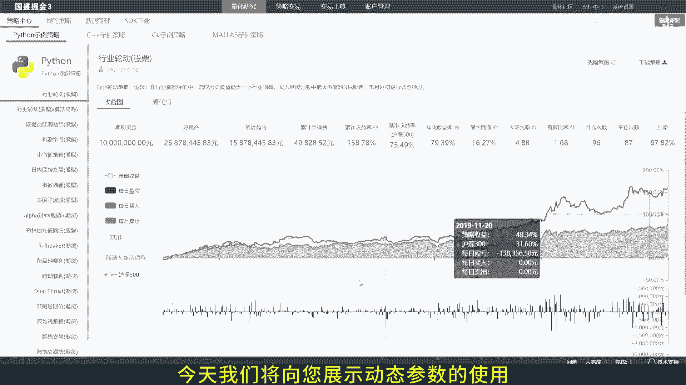
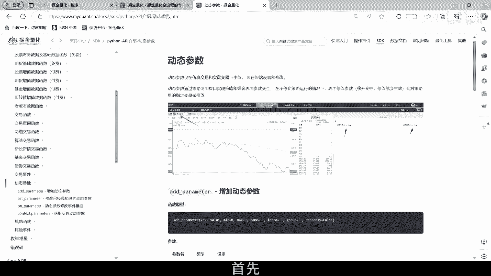
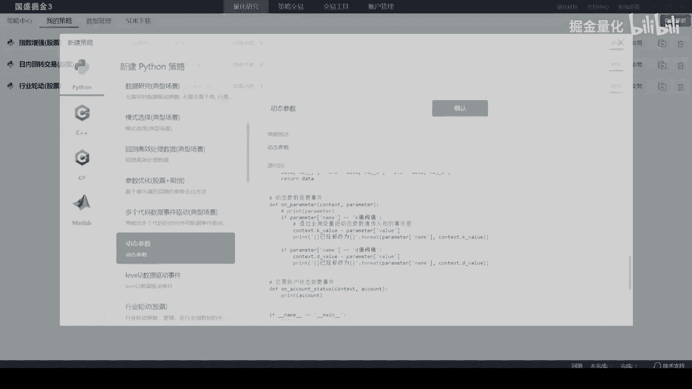
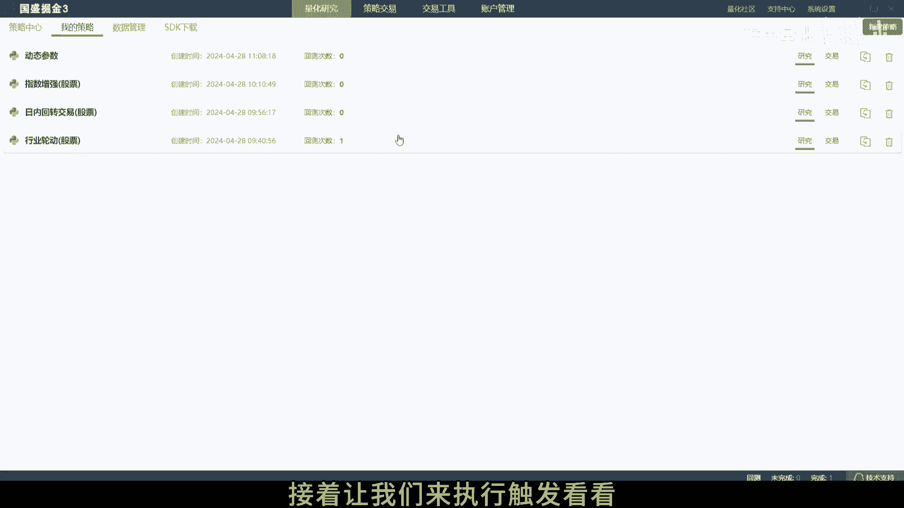
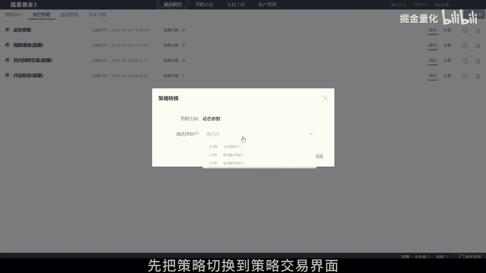
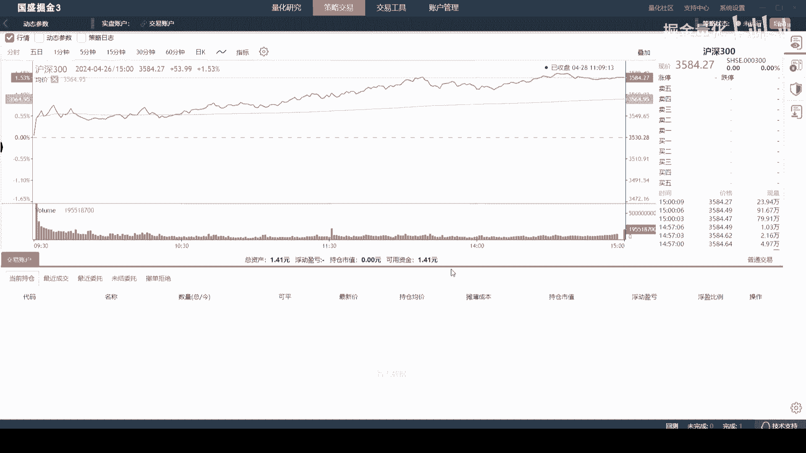
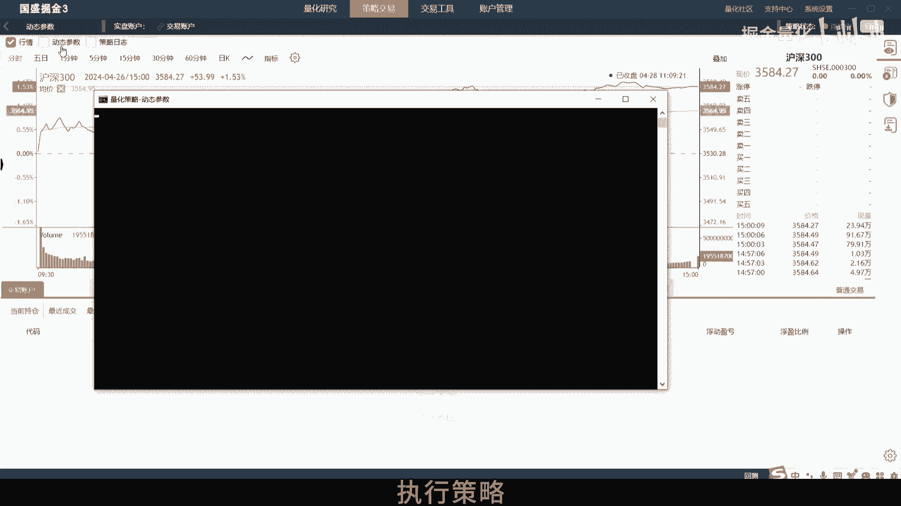
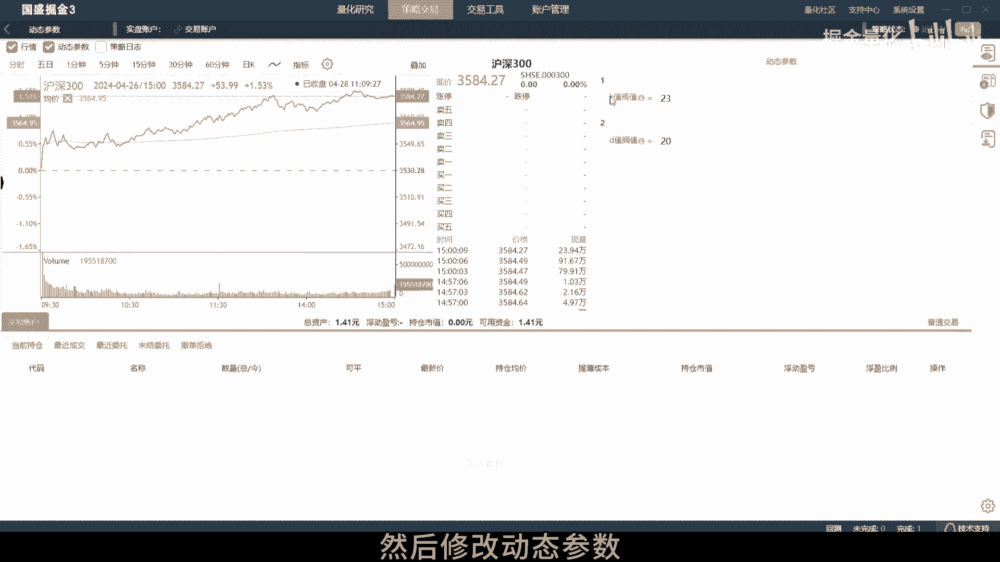
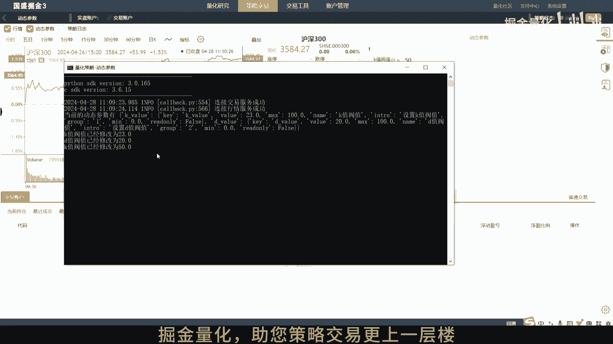

# 5.4 如何在掘金量化终端里调整动态参数 - P1 - 掘金量化 - BV1RU411o7gc

欢迎来到股票实盘操作指南，今天我们将向您展示动态参数的使用。

动态参数是策略，通过调用接口，以实现策略和掘金终端界面参数交互的功能，只在不停止策略运行的情况下，界面修改参数，会对策略里的指定变量做动态修改，首先创建一个动态参数示例策略。

点击策略编辑可进入到策略编辑界面，可以看到动态参数是通过at parameter函数设置的，然后通过EMPERAMETER动态参数变更事件推送，更新终端界面修改的动态参数，接着让我们来执行触发看看。

先把策略切换到策略交易界面。

点击交易选择对应的交易账户，再点击确定。

点击启动执行策略。

勾选动态参数，然后修改动态参数。

可以看到策略控制台输出的动态参数，也会随之对应修改，需要注意下，第一动态参数只支持实时模式，仿真或者实盘可用，第二重启终端后，之前的动态参数缓存会清空，需要重新调用动态参数接口，重新设置。

可每天重启策略，或者设置每日的schedule定时任务，感谢您观看本教程，如果您在使用过程中有任何疑问，欢迎随时联系我们的技术支持团队。

