# 5.7 嵌套循环-ctrader软件量化交易编程教程 - P1 - 瓜皮猫量化社区 - BV1rw4m1D76v

嗨喽大家好，我是阿龙，那这节课我们来讲一下嵌套循环，在前面，我们学习的这些循环语句或者迭代器的话，它都是一个单循环的方式对吧，当然了，我们可以其实可以多循环，比如说嵌套一层的循环，两层对吧。

运会运行两个三个其实都可以的啊，这里我一已运行两个循环为例啊，来给大家讲解，首先我们打开我们的这个CCHR的软件好吧。

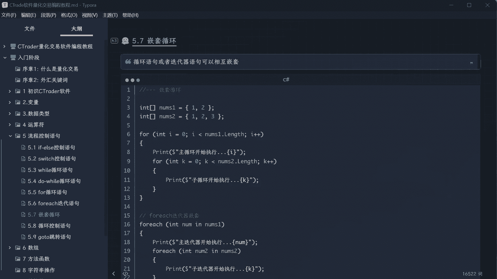

vs code啊，VSCODE软件，然后我这里创建好了一个项目啊，嗯然后啊我先把它加进来，这个应该没加啊。

添加一下现有项目，5。7循环嵌套。

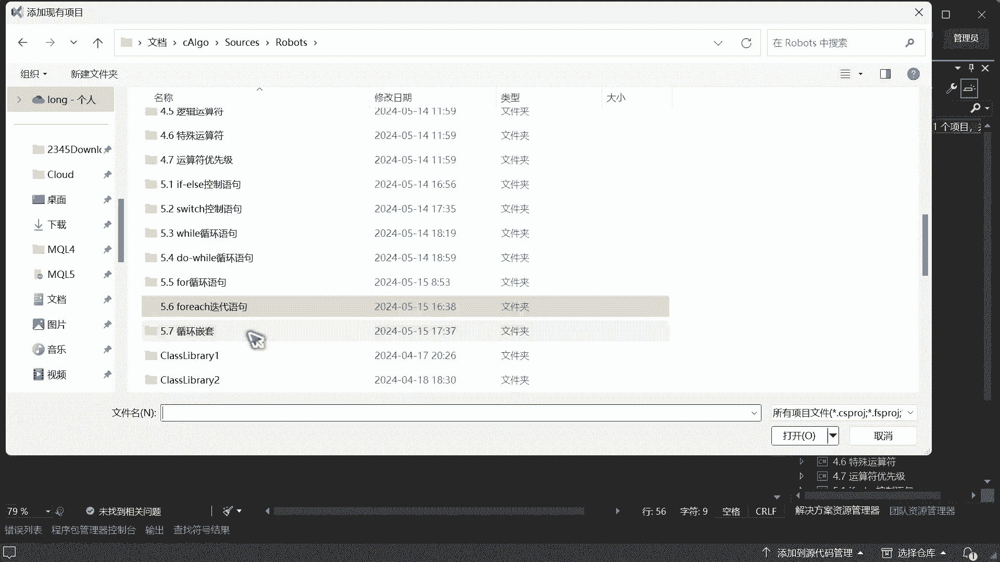

好好这个已经创建好了，对吧好，然后这里的话我们额先要准备几个集合啊，你叫它数组集合对吧，数字的集合int你先照着写啊，不要说诶这个没讲过呀，什么东西啊，因为我们要讲这个循环，它跟这个集合啊是息息相关的。

所以呢我们因为没有讲到数组，所以这个必须得先用一下对吧，用一下它好，int一个二看，所以他这个VSCODE的话，他现在带有AIAI辅助编程是比较智能的啊，所以我为什么没有用CH的那个编辑器。

因为他太那个了，太简单了，没有这么智能啊，然后现在有两个集合对吧，我想同时遍历两个集合里面的内容，诶，怎么做呢对吧，首先我们来第一个啊，for循环嵌套啊，for循环嵌套怎么做for然后按一下tab键。

再按一下tab键好，后面它自动自动给你提示了对吧，按回车两下tab键回车，OK然后接下来我们打印一下啊，print啊，然后，这里我们写上这个美元多乐福对吧，然后这个话我们叫做for主循环执行对吧。

主循环执行，然后呢，我们这里呢哎循环的序就是循环了几次序号，给他写上去对吧，把这个I放进去啊，这样是个主循环，那我现在不跑对吧，跑一下他应该打印一二对吧，OK啊不是打印I啊，搞错了，应该是，I啊。

下标I这样的话打印一二对吧好，这个是主循环开始运行对吧好，那接下来呢啊，如果说我想哎便利下两，两个集合之间有没有关系对吧，那怎么便利呢，我们可以通过这个for再来一个table，你看自动就帮你哎。

帮你去识别了是吧，非常方便好，你看这个是I啊，这个临时变量用I，所以这里不能用I了对吧，因为他在他的循环体如果用I的话，你看如果用I你会发现诶他报错了，为什么，因为你这个局部已经有了。

这里就不能有了对吧，所以我们这边就要换一个G对吧，第二个循环啊，我这里空格一下，这样看的清楚一点对吧好，这个的话我们叫它一个for的子循环体对吧，子循环执行，这时候因为是第二个啊，好我们选择第二个。

这时候不是I了啊，换成J对吧，好看到没有，是J啊，这个子循环的话，我们这个呃计数器的啊，变量名啊一定要不一样，你看到没有，不要用这个I，否则就错了，好这时候我们来生成。

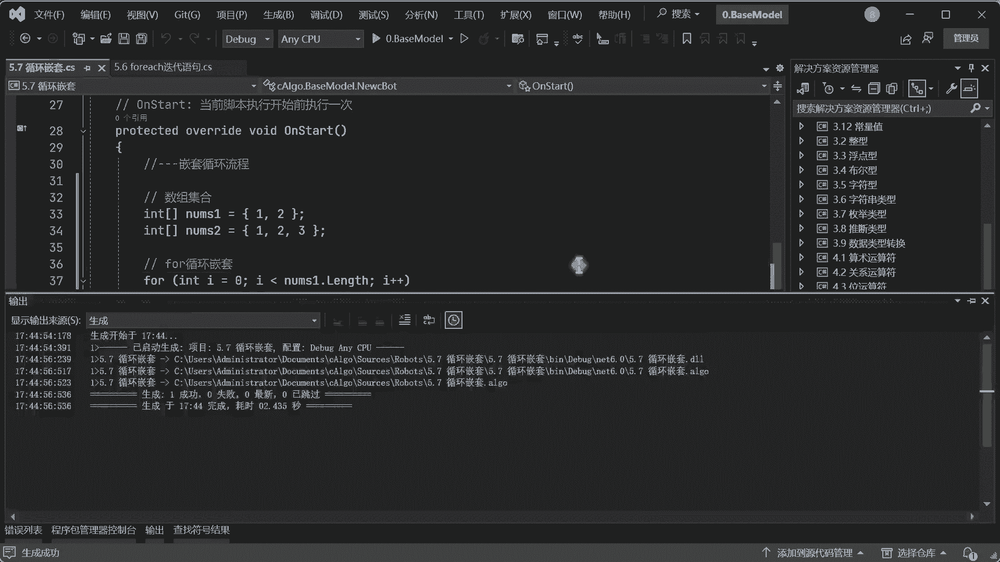

生成好了以后，我们打开这个with studio accord啊，c chat老是容易说错啊。

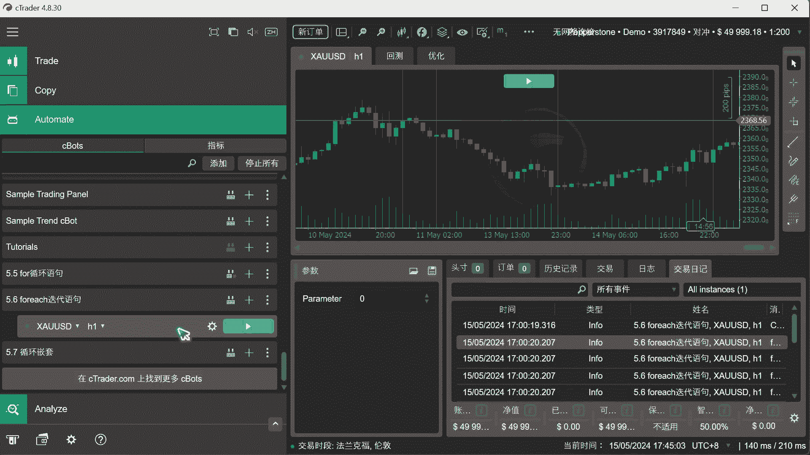

然后这边是嵌套循环，我们打开一个品种好。

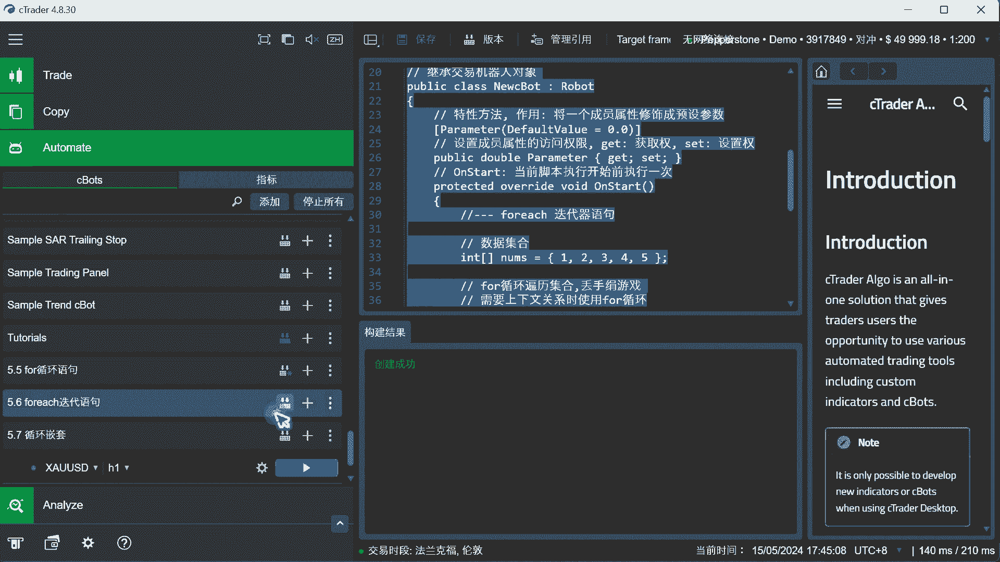

然后把他先关一下，这边跑一下，哎你看它是怎么循环呢，你会发现诶我主循环执行一次，它会把子循环里面所有的啊这个循环里跑完，然后呢你看跑了三次对吧，可以看啊，主循环一次，然后只循环跑了三次。

然后进入下一个主循环看，然后再来跑直循环123对吧，然后结束，所以所以在这里呢。

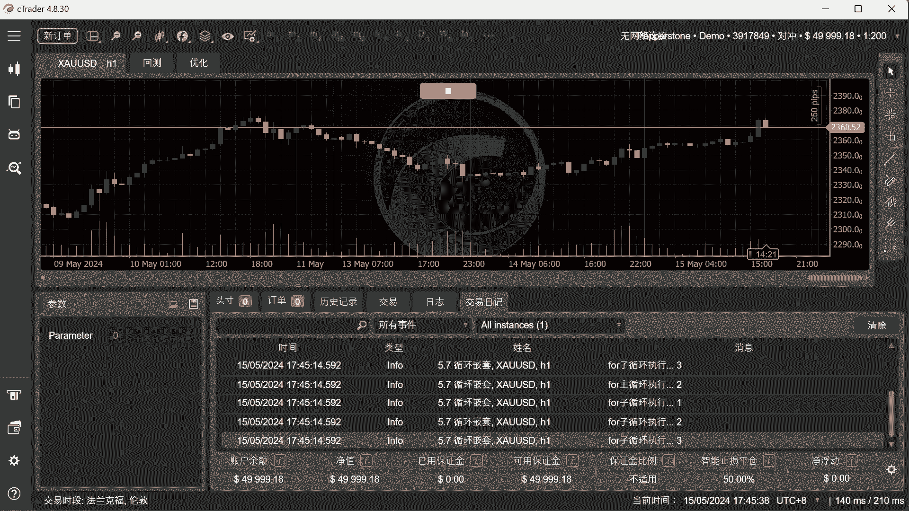

你不要以为就是说啊我有两个循环，那是不是我这个循环跑完一次呢，那他再跑一次呢，不是这样的啊，他是这个主循环啊，组循环运行一次，就会执行全部的子循环啊，只要它运行一次，就执行一次全部的循环。

然后再来一次就这样了啊，所以他不是说我这个跑一下主循环，跑一下，子循环跑一下，而是我这个主循环加进来，发现里面还有一个循环，是把这个循环跑完，然后才会结束，然后再回回到下一次的出循环。

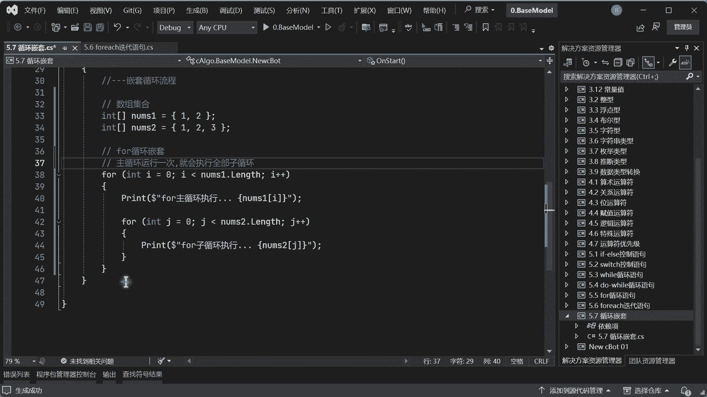

所以这一点非常重要啊，看到没有，主循环运一次，子循环三次，看到没对吧，然后接下来左循环又运行一次，左循环三次，看到没明白了吧，就这样一个意思啊。

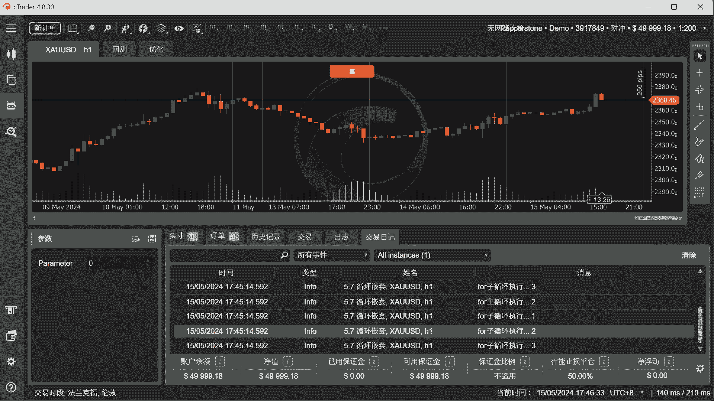

这个是for循环对吧，接下来我们用这个for一起啊，for一起迭代器啊，它不叫循环了，叫迭代器，for e AC h对吧，tab键按一下好，他这里没有智能提示啊，服务器不应该提示int了啊。

我int一个NN，然后INNB1啊，NNNN是一啊，好这时候一样的啊，我们print一下，啊这个叫做主迭代器啊，然后这个主迭代器的话，我们就给他这样啊，主迭代器，运行好吧，然后这边我们给他一个什么数呢。

把我们的long放进去，这个的话就是我们的元素了是吧，上节课已经讲过了，OK好，接下来我们再启动一个循环for一起好，你看自动，就这样的话比较智能了啊，然后这边我们也来输出一个啊。

然后这个是子迭代器了是吧，子迭代器运行给他三个点做一个区分，这里改一下，因为现在是一样的啊，如果说前面一个变量名已经有了，你这个后面就不能一样，所以必须给它嗯写个二对吧，表示一下这第二个循环，OK好。

接下来呢，这里呢我们还是给他做一个间隔啊对吧，做一个间隔。

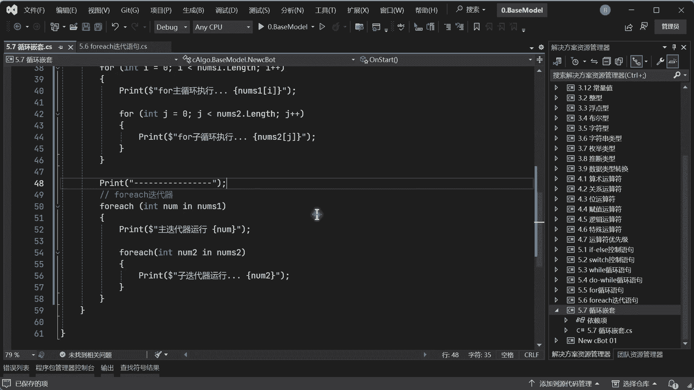

好接下来我们来跑好，跑好了以后我们来看一下结果啊，好第一个迭代器运行完，第一个解循环完成了是吧，然后就看第二个主迭代器运行一次，OK那只迭代器运行三次，看到吗，然后组然后只叠加进去完以后。

这个这个第一循环全部结束了对吧，结束以后哎你看第二次的迭代器又开始运行了，哎这时候运行了又运行了一遍，子迭代器看到没有，所以说它它的运行规则是什么。

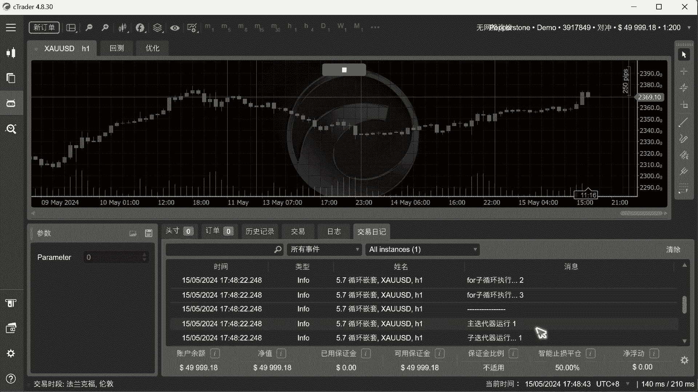

就是如果说有子循环是把子循环全部跑完以后，然后再干嘛再进入下一个主循环，然后再来抛次循环，再下一个就这样来回反复的啊对吧，非常简单啊，好，然后我们可以做一个for或者for一起的混合嵌套，对吧。

也可以做啊，好这里的话我们还是给他间隔一下，好for一起的嵌套嵌套循环好，我for一下，好好让他等一下，让他因为这个AI识别啊，它需要时间，所以我们给他等一下，你看我现在还是来运行这个主循环对吧。

然后我借用一下这个啊，把这三个点给他去掉啊，这样看得清楚一些对吧好，然后接下来我可以用一个一起对吧，哎我给他搞个一起啊，你看好，接下来我们就把这个翻过来对吧，现在就混合了对吧，for一起混合，OK好。

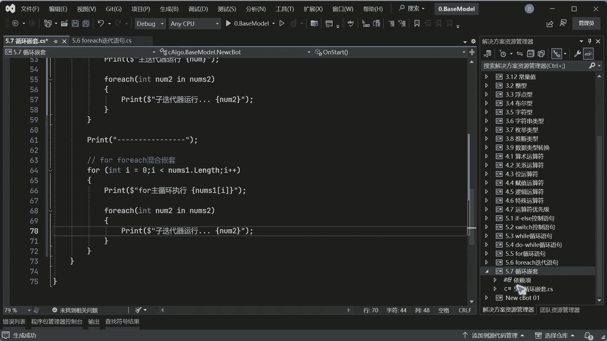

我们相乘，啊你看这个是迭代器的对吧，然后这个是for each起的迭代器，看for一起循环一次，OK迭代器两次for一起循环，第二次迭代器运行三次对吧啊，子循环都是三次啊，刚刚口误了对吧，你看对吧。

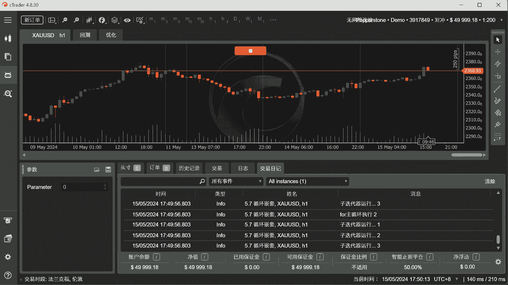

他是就是说你不一定说我一定说啊，我必须得是个for，里面就只能跟个for不一不一定的啊，可以相互嵌套的，或者while嵌套也可以对吧，或者for一起到外面，for在里面也可以啊，都是可以的对吧。

所以这个就是一个嵌套啊，近但是我们主要的关键点在哪里，就是说啊如果说有这种嵌套的时候，他肯定是进来主循环以后，把这个子循环跑完了以后，然后这个循环才会结束，然后又跳到下一个，明白了吧。

好这个就是关于这个循环嵌套啊。

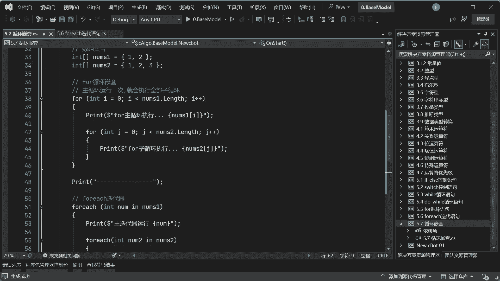