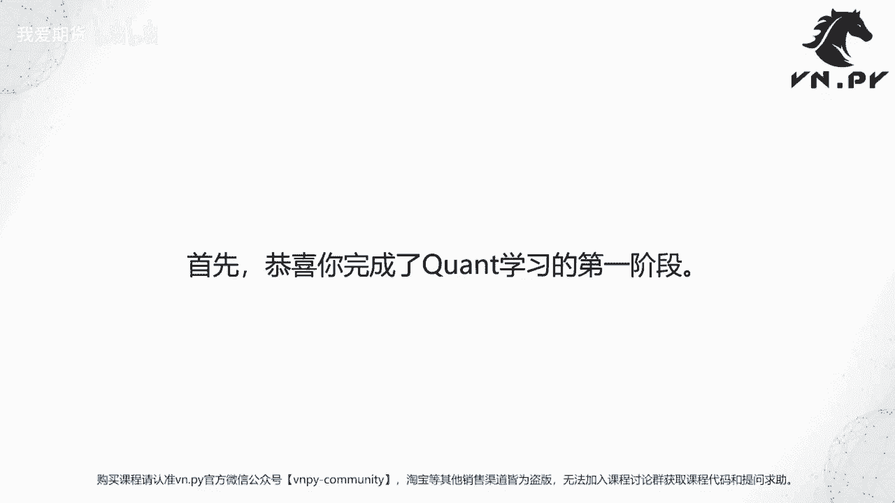
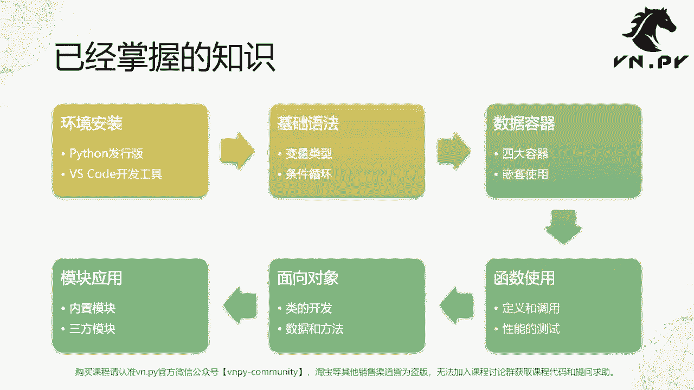
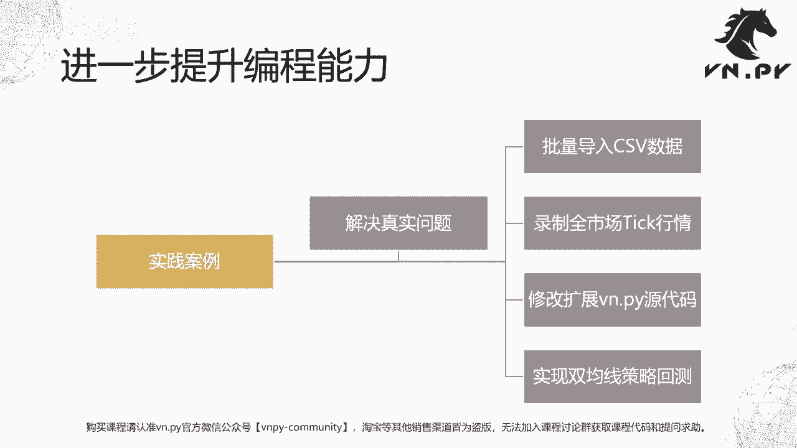

# 50.总结 - P1 - 我爱期货 - BV1Y32gYuEgL

OK欢迎来到量化交易零基础入门系列，30天解锁Python量化开发课程，那么今天呢是我们的第50节课了啊，也是我们这个课程原来既定大纲的最后一节课，所以在这里我们先来做一个阶段性的总结，首先要恭喜你。

已经完成了QUANT学习的第一阶段。

那么在这个过程中啊，我们掌握了许多的知识，现在我们来回顾一下整个课程内容呢，我们大体上分成了这么六大块啊，一块呢就是环境的安装，这个环境包括我们Python本身运行环境。

也包含我们开发Python代码所要用到的这个环境，我们知道什么是Python的发行版对吧，它包括Python解释器本身，Python的这个官方的一些内置模块，以及一些如果诶针对某个功能的话。

你把它打包进去的其他的模块，那最简单的就是Python官方的版本，然后呢有针对科学计算的anaconda，有针对量化交易的，我们打包到VN studio啊，这些都是Python发行版。

反正基于你的需求去选择最合适的就好，第二块，我们学习了，怎么样用vs code来作为我们的这个开发工具啊，一个非常轻量级的，但是是可扩展的这种编辑器，来去开发我们的Python源代码。

我们也知道怎么样啊，可能有一些智能提示的功能啊，怎么样去安放一安装一些扩展包啊，怎么样在vs code里面用一些快捷键来实现，比较快的这种代码跳转啊，折叠等等相关的操作，这个是我们发的内容。

第二块呢我们来学习了Python的基础语法，这个基础语法其实是所有编程语言都有的，甚至于从逻辑上讲，他们是高度类似的，当然与语法的细节不一样，第一块就是变量类型，所有的编程语言里面都有变量。

Python为了方便我们人去理解，把变量这块尽可能的简化啊，最常用的就这么五个整数点数字符串，布尔值和空值，空值就是NN，就这么五个，不像其他的像C加加里面，光是浮点数就有这个单精度，双精度等等啊。

float double等等啊，相当的复杂，但是Python里面就非常简单，它就是一个浮点数float啊，复杂的那些事情，Python帮你在后面做，然后第二块我们学习的这个啊，基本的一个叫做控制语句。

一个是条件判断，就是满足某个条件，我们才做什么事情，不满足我们就不做，另外一个就是多次的循环，我们学了for循环，学了while循环，那么再进一步我们开始学习数据的容哈，在此过程中呢。

我们学习了Python内部的四大容器，分别是用来保存这种有前后顺序关系的list啊，列表用来保存键和值映射的这种字典，dict用来保存这个纯粹去重啊，去除重复数据啊，保存这个啊集合关系的set集合容器。

最后一个用来提供这个top呃，不变的，它本身这个数据内容不可变啊，有的时候又可以指代一些特殊的，比如说参数传递啊等等，相关的这么一个tap的容器叫元组，那么这四大容器我们掌握了之后。

其实在Python里面你写代码，很多时候你的操作有句老话嘛，就是所有的程序都是算法加上数据啊，这个算法就是通过基础语法实现出来，不管是加减乘除也好，还是循环啊，这条件判断等等等也好。

这些就是所谓的算法数据容器，而数据既包含这个变量本身啊，更多它针对的是你用来存放这些，数据关系的容器啊，把他们所以这四大容器本身啊，为了满足更强大的功能，你可以把它们嵌套起来用。

你可以在字典里面嵌字典那里面切列表，列表里面放字典啊，其他更复杂方案都可以，这个所以是数据容器这块的内容，那再往下一步我们开始来学习的函数的使用，函数最主要最主要的作用分两块。

第一块就是把我们重复的代码，我们要重复在各个地方用的代码写一次，它定义成一个函数，这样呢在每个地方你要用的时候，直接调用这个函数就好了，这块的功能，这块的目的是为了节省我们代码的行数。

让我们的代码可维护性变得更好啊，这个是第一点，第二点是在，当我们把某一块逻辑的功能，封装成一个函数之后，每次在用这个函数的时候，对于为我们写程序的程序员来说，我们的思维，我们的脑子在想啊。

我怎么写程序的时候的这个思维负担会被降低，我们可以呢，可能能更集中在诶写高层的这个逻辑上，我不用再去想着底层的一步一步逻辑判断啊，变量控制啊等等，这个是函数的另外一个好处啊。

对函数我们学了怎么样定义一个函数啊，以及怎么样调用这个分别两块，第一块简化代码，第二块呢去释放我们的脑力思维的成本，最后我们也重点去讲了一下，怎么样通过JUPITER里面。

time it魔法方法来测量函数的性能，因为函数的性能是一个非常非常重要的指标啊，你尤其针对我们量化交易的应用来说啊，正常情况下你写出来函数当然问题不是特别大，但如果是做比如期权的比较高频的波动率交易。

你每秒钟需要执行上千次的这种期权定价，期权隐含波动率的计算，期权吸大值的计算，那么此时这种函数，它对于性能的追求就特别特别高，所以一定要在这个必要的时候做性能测试，如果发现诶它性能不够的话。

你要想办法去有一些优化方案，最简单的优化方案就是啊，某一块功能不要自己写，你Python有内置函数的，你就用它内置函数，比如说求和，我们知道有我们试着用for循环求和可以算出来。

但是呢用Python内置的那个sum函数，速度大概快了几十倍，所以能用内置函数，我们就还是用内置函数，第五块呢，就是我们学习的面向对象的开发方法啊，这个面向对象object oriented。

我们学了怎么样去定义一个类啊，怎么样去继承类arch的所谓的类的继承，以及类的多态，以及怎么样在类里面去绑定类级别的成员数据，对象级别的成员数据以及这个啊去定义啊，这个类下面的一个又一个方法。

或者说嵌在类里面的这些函数，怎样通过面向对象的方法，同样也是有点类似于函数，就把更多的逻辑放在一起，减轻我们的思维成本啊，让我们代码可以进一步重用，函数的重用，只是包括啊这个这个这个函数里面的。

计算逻辑对象的一个重用，还包括了对象下面带着的这堆数据，所以让我们代码呢变的行数越来越少，越来越少，越来越精简，最后我们学习了围绕着Python内部，非常重要的模块的应用，直到面向对象。

前面五部的那个代码都还是我们自己来写，但很多时候啊，因为还是那句话叫做，你要站在巨人的肩膀上才能看得更远，所以很多的工作前人都已经做过了啊，甚至他们已经做出非常完美的解决方案。

所以此时我们没有必要自己再去重做一遍啊，重重新去发明一个轮子，或者重新去搭一个梯子，这没有必要啊，我们直接用前人提供的这些模块，来实现我们要的功能，这个速度是最快的啊，所以我们学习了这个。

怎么样去用Python的一些内置模块，以及怎么样安装和寻找，我们要用的这种第三方模块，当然这些模块里面提供的，其实本质上还是这两样东西，一个这函数，一个是功能的类，就这两个东西。

所有的模块内部都只是包含这两者而已，所以到了这一步呢，其实学完了，你也就掌握了整个啊这个Python在使用过程中，需要用到的各种基础知识，那么下面呢你就可以用到这些知识，去解决各种实际的问题啊。

等于编程语言本身，你其实基本上已经学完了Python，就就这么多事情，没有没有什么特别复杂的，一个月的时间，如果你能够专心的学，肯定到现在为止就已经掌握了，下面更关键的一点是。

怎么样把你现实里面要去解决的那个问题，用我们刚刚学，你学完这些Python知识，把它真正给解决出来，就是把你的知识学到知识和现实里面，解决问题后才产生的经验，两两对啊，构建这么联系。

就像我们大脑里面创建神经元，它们之间的联系，然后呢这才能够进一步去提升你的辩证能力，所以尽管我们50节课，既定的课程内容已经讲完了，接下来我们还有这个附加的几节课，在这节课里面呢。

我们要重点讲到就是这么几个实践的案例了，这些实际案例和我们之前在讲课的过程中，陆续哎这个其实每隔几节课，我们就会有一些小案例，和那些案例比起来呢，相对可能会更大一些，它还是案例，但是更大一些。

这些案例啊，可能就更针对解决一个实践中的，比较贴合于我们真实场景的问题了啊，就是所谓解决真实问题，第一个问题，怎么样去批量导入CSV数据，我们已经学过了，怎么样脚本去导入单一的CSV文件。

但是很多时候你的CSV可能不止这么一两个，可能一下子啪这么，比如你在淘宝上买的，可能人家给直接给你个那个压缩包，里面有几千个CSV文件，你不能每一个都写一个啊，这个这个都都写一行命令吧。

那要写几千行类似，所以更好的一个方案，我们也学习了OS模块，下面有个叫work的函数啊，就是便利当前目录下的所有文件，我们会结合这一块，就这个便利以及我们之前学的啊，怎么样去用CSV打开文件。

怎么样插入到变得拍数据库，另外知识结合起来来实现一个批量导入的功能，第二款呢叫做怎么样用VIENIPAD，来录制全市场的tick行情啊，因为tick行情这个东西说实话啊。

虽然我个人觉得对于许多用户来说没有必要啊，但是有的用户呢，他确实要去想去研究一下tick数据级别的回测，或者策略的这种交易效果，那么此时呢你就因为tick数据确实挺贵的，比如说如果通过米矿买的话。

一年一年这个tick服的价格期货是1万啊，如果啊你不想花这个钱，你可以用VOR派自己去录，因为这个数据密度比较高，一般录个两三个月也就够用了啊，所以你也可以选择去录制的这么一个方案，当然就耗着硬盘一些。

我们会教大家怎么样去通过一个脚本，实现全市场的体格的录制啊，第三块呢叫做怎么样去修改和扩展，vue pi的源代码，其实啊原则我们在上上节课里面已经讲过了，就是你不要去改那个下载下来的安装包。

里面的源代码，这是没用的，你要去改装在site packages下的这个源代码，或者还有一个更方更更简单的方案，就是如果你不要你，你不想做这个安装的话怎么样，我们直接通过环境变量。

就是就随时去修改那个我们的啊，放在别处的这么一个编点派运行时的源代码，最后呢我们再基于我们之前已经学过知识啊，我们学过数据容器，到我们学过这个数据怎么导进来，我们来实现一个特别简单的。

双均线的策略回测啊，然后呢我们调用一个诶额外外部的模块，通过绘图的方式，把这个策略回测的结果给画出来，整体上接下来四，我们会再额外给大家补充，这么四个实操的实践的案例啊，然后呢去把我们学的这么多知识啊。

能够整合在一起，进一步变成你东西。

OK额，那么这节课呢，我们是更多做了一个阶段性总结啊，所以阶段性的这个总结内容也就到此告一段落，相信大家对Python本身已经有了一个比较好的理解，接下来呢就可以带着这个你学到的。

或者掌握好的这么一个武器，踏上新的本土去解决现实中的问题了，所以更多精华内容，还是请扫码关注我们的社区公众号。

