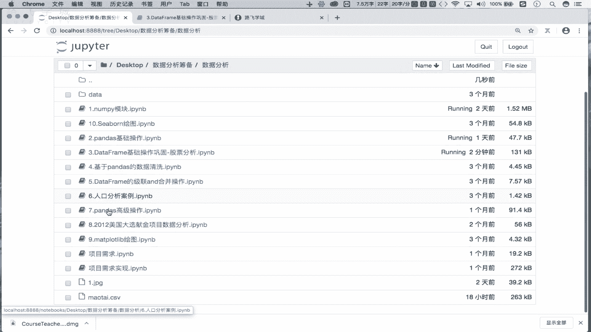
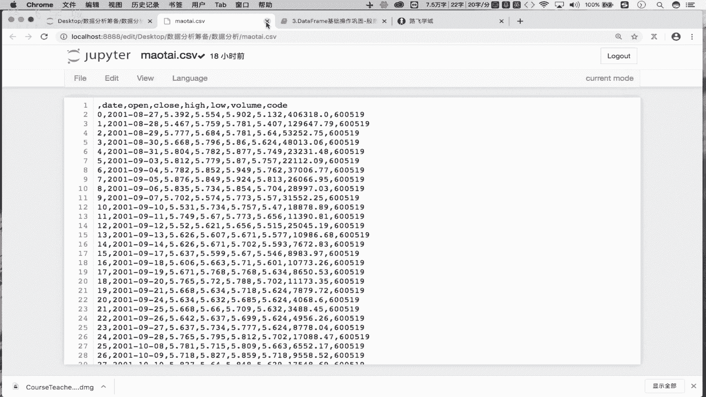
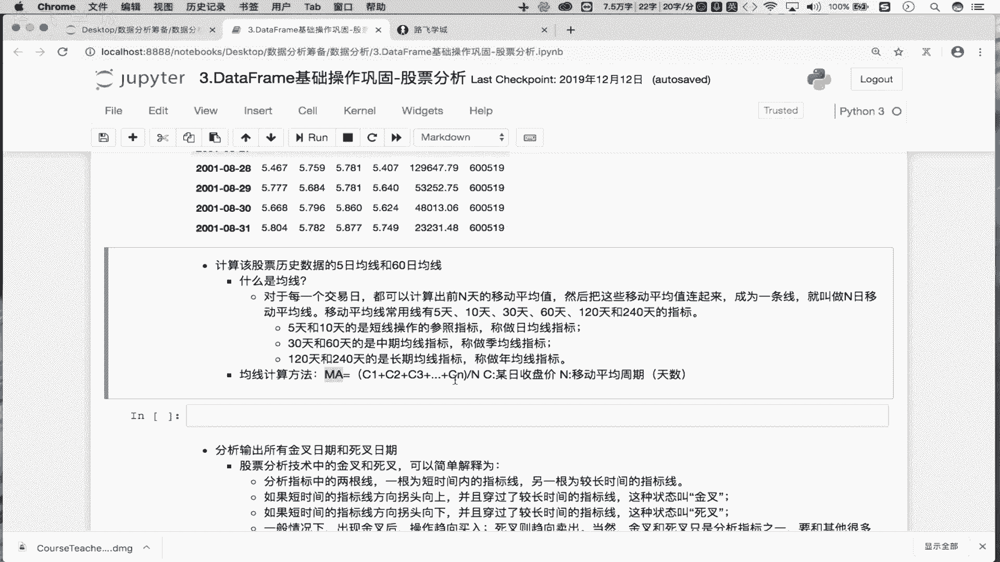
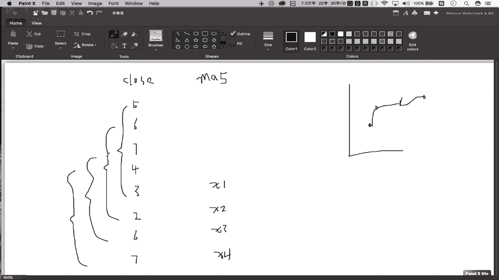
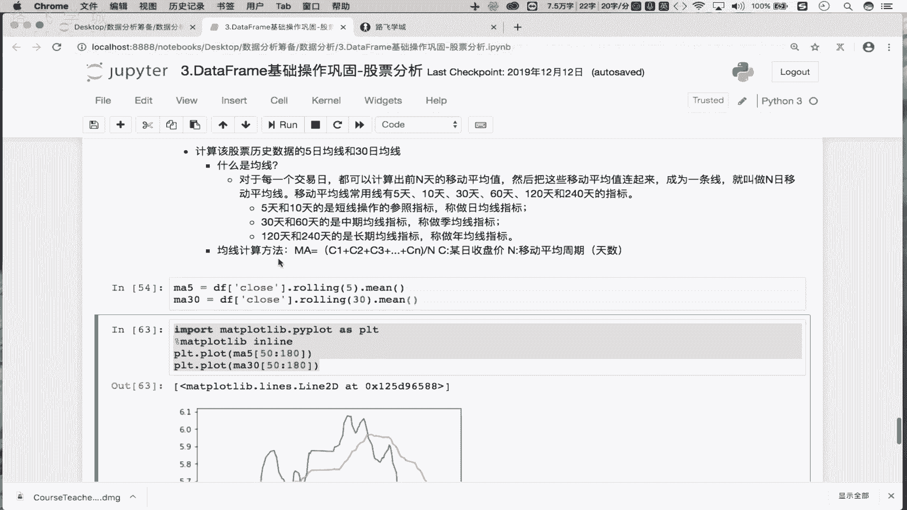

# 5天拿下Python金融量化，股票分析、数据清洗，可视化从入门到实战 - P15：01 双均线策略-均线的计算分析 - 数据分析师大熊 - BV1GxbDeFEEL

去说哈，那么从这一小节开始呢，咱们就来看一下咱们金融量化当中，双均线策略的一个制定的方式，OK吧，那么首先呢这个双均线，我们基于的是股票策略的一个制定啊，那么至于这块什么叫做双均线，什么叫做均线对吧。

稍后会给大家进行一个详细的一个介绍，OK吧，那首先这块的话，我已经将具体的需求呢列出来了，那么接下来咱们就将每一个需求进行一个实现，就可以了，OK吧，那么首先先看一下第一个需求。

我们说想要使用to share包，获取某只股票的历史行情数据，那么昨天咱们已经获取了茅台这支股票，的历史行情数据了吧，并且把它持久化存储到了本地，保存到了一个叫做茅台点CSV，的一个文本文件当中吧。

那么这一步的话，咱们就直接将文本文件当中的数据读取出来，是不是就可以了，对吧好，那这块就是我们的PD点r re杠CSV，然后呢，将当前目录下，茅台点CSV这个文本文件当中的数据读取出来，就可以了吧对吧。

你看这读取出来之后，你看read杠CSV给我返回的是不是一个data frame啊，那么这个data frame当中需要把这一列给它删掉，是不是就可以了，对吧，这是无用的一列吧，怎么删呢。

点d r o p job对吧好，那这块我们的这个levels啊，label就是我们要删除的这样的一个索引吧对吧，删除的这样的索引啊啊这多了一个引号好，这个是我们的labels，好像它那么它是行还是列呢。

xx指令下，我们说在job函数当中，我们的零表示的是行，一表示的是列，是不是好，然后呢是in place，等一个true对吧，那这块的话咱们就让它返回一个新的表吧对吧。

就不写input list intrue了吧，那这样的话，咱们就给他返回了我们的一个什么呢，DF对吧，那这个DF里边我们保存的就是茅台这支股票，所有的历史行情数据吧，OK吧。

那么接下来咱们需要跟上一个案例是一样的啊，把data这一列对吧，把data这一列给它转成时间序列，并且把它作为我们的行索引，OK吧，所以说那么接下来啊，将data列啊转为转为我们的时间序列。

且将其作为原数据的行索引吧，这需要调用两个函数，是不是第一个函数是pd，第二叫做to杠date time，是不是好，我们是将DF当中的DATE这样的一列，转成时间序列吧，再将其赋值给这一列。

是不是就可以了，OK吧，这一步我们已经转好时间类型了，是不是接下来把它作为我们原数据的行索引吧，怎么做呢，DF点set杠index是不是好，那这块的话我们需要将我们的这个什么呢。

DATE作为我们原数据的行索引吧，OK吧好，那然后的话这块我们有一个in place，等于一个true，好走，你这一步执行完了之后，好在这我们再次看一下DF，看下前5号走，那么现在我们原数据啊。

名数据它的这个行索引啊，行索引就变成我们的时间了吧对吧，就变成我们所谓的一个时间了，OK吧，好，那么现在的话，我们的数据呢已经读取出来了对吧，数据读取出来了，我们看一下。

我们读取的是不是这个文本文件当中的数据啊。

OK吧这块数据已经有了。

那么接下来的话我们看第二个需求是吧，看第二个需求啊，那第二个需求需要咱们计算该支股票啊，历史数据的5日均线和60日均线，那这块的话咱们就来介绍一下，什么叫做均线对吧。

那可能有过这个呃股票经历或经验的同学，我们都应该知道什么叫均线吧，或者你不懂的话，我们之前在手机或在某些新闻电视当中，我们应该也看过一些股票的走势图对吧，那么在股票的走势图中，它会有一些这个曲线对吧。

在一个坐标系当中会有几个曲线，那曲线啊它会有一个不同的分布，或者有不同的交叉对吧，那么这是个矩阵曲线，通常来讲的话就是我们的一个什么呢，均线吧，那我们来介绍一下啊，所谓的均线是什么。

我们说对于每一个交易日都可以计算出，前N天的移动平均值，那这个移动平均值连起来形成的一条线，我们就叫做N日的移动平均线，那么这个N日的移动平均线，我们就可以称之为均线，那么常用的均线由5日均线。

10日均线，30日均线，60日均线和一百二二百四十日均线，OK吧，有这么些不同类型的一个均线，那这块的话我们来看一下啊，那这个5日和10日均线我们叫做短期均线，OK吧，后边还有三十六十，一百二二百四。

自己去看就可以了，OK吧，那这块的话，其实大家看一下这个均线的计算公式，我们就能够知道怎么去计算我们均线了，首先这个均线哈我们对应的是什么呢，对应的是我们的这个收盘价啊，均线对应的是我们的收盘价。

那就是说你看这ma就是我们的一个均值，是不是均值那个均值啊，均值有了之后，均值跟均值之间连起来就是我们均线吧对吧，你看这个C1C2C3CN就是我们的第一天，第二天，第三天，第N天它的收盘价对吧。

那让这N天N个连续的天，它的收盘价进行一个相加，然后除以N，那算出来的不就是这N天收盘价的一个均值吗，这个均值指的就是我们的一个啊，均线当中的均值，那么多个均值连起来就是我们所谓的一个均线。

OK吧，那这我们去画一个图啊，画一个图，你比如说哈比如说现在呢我这儿呢这个close啊，它表示的是我们的一个收盘价，可以吧，好那比如说这块呢有哦这样的一些收盘价，比如说有一个五块六块七块四块。

三块两块啊，六块七块好，比如说现在你看这儿有连续的八天，有连续的八天对应的收盘价吧对吧，比如说我们想算起5日均线怎么办，ma5我们就叫做5日均线，是不是，那么5日均线是由多个5日均值连起来的。

这个线叫做五均线吧，因为我们知道啊，你看在坐标系当中，我们的一个点是不能连成一条线的吧，如果要是有多个点的话，是不是对这多个点连起来就是一条线的，这个线就是我们均线，那每个点是我们的均值，对不对。

均值啊，那么我们的5日均值怎么求呢，首先比如说我们求5日均值，就是说首先我们要移动前五天的值吧，你看从这，到这儿是不是第一个前五天这个五天的值，我们可以给它进行相加，求一个和吧，然后再除以五。

是不是得到一个均值，假设是一个X1，可以吧，那么这个X1就是我们的前5日啊，前5日均前5日的收盘价，计算出来这个平指吧对吧，那我们可不可以将第二个前五天也计算出来呢，是吧，你看从6~2。

这是第二个前五天，我们叫做X2吧，X2指的是我们的这个第二个前5日，对应的一个均值吧，以此类推，还会有我们的X3，还会有X4，对不对，OK吧好，那就说第第三个前五天是他，第四个前五天是他，对不对。

那这样的话，我们一共是得到四个前五天所对应的均值吧，OK吧，那最终的话我们将X1X2X3X4连起来，形成的这条线就是我们的一个什么呢，5日均线OK吧，那么30均线就是说求出第一个30天。

对应收盘价对应哪个均值，再求出第二个30天，然后收盘价对应的一个平均值吧。

以此类推，对不对，所以说这个是我们均线啊，的一个计算的一个方法吧，对吧，那现在在这的话，我们需要计算出我们的5日均线，别60了吧，30吧，计算出我们的5日均线和30日均线，那这怎么去计算呢对吧。

那这块公式是不是给我们了对吧，给我们了啊，那这块我们就可以计算，那首先DF看一下原数数据，我们要针对的是不是收盘价，计算我们的这个均线呀对吧，计算我们均线啊，那这一块的话咱们就来算一下子吧。

首先我们先要取出什么呢，close系列对吧，close系列啊，那首先close系列的话，比如说我们要计算5日均线，那原始数据可以计算出多少个5日均值呢，你比如说你看从这儿到这儿。

是不是第一个前五天可以算出一均值吧，然后从这然后呢到这儿，是不是第二个前后天可以算出第二个均值啊，对吧，那我们就将close这一列啊，算出N个均值，把这N个均值连成一条线，就是我们均线吧对吧。

所以说我们的均值有了之后，均线是不是也有了，那这我们怎么去计算第一个前五天的均值，第二个前五天的均值，第三个前五天的均值呢对吧，这块怎么计算呢，其实很简单。

这块我们需要掌握一个函数叫做rolling rolling啊，Rolling5，那就是说我们需要开始什么呢，依次将我们的第一个千五天，第二个千五天，第三个千五天依次取出来对吧，那取出来之后干啥呢。

对其进行一个均值的计算吧，怎么均值点r min一下就可以了，我们看下结果走，你看现在这返回的这个series，你看为什么前四天对应的是none呢，因为前四天是没有均值的吧，是第五天啊。

第五天这个值表示的是不是前五天，就是第一个前五天它的一个收盘价的和，再除以五对应的均值啊，那五块七毛六，是不是第二个前五天对应的这个这个收盘价，对应的一个均值呢，以此类推吧对吧。

那这返回的就是我们的ma5吧，那么这个ma5里边所存放的，是不是我们的这个5日均值呢，那这个点这个点这个点这些点依次给它连起来，绘制成的线，就是我们的5日均线，是不是OK吧，那同理啊。

那我们想求30日均线怎么求呢，DF中括号还是不是还是基于我们的收盘线啊，dr rolling这块应该是30吧，再点2min一下，就算出我们的30日均线了吧对吧，你要知道。

那ma30前29个是不是都是none啊，那第30个才是我们的正真实的值啊，对不对，好这个你需要理解啊，那现在的话我们的这个5日均线跟30均线，对应的均值是不是都有了，那我们如果想把这条线画出来。

怎么画呢，那这块画线的话，其实我们可以基于什么呢，我们的matt plot去画，但是的话matt plot lib这样一个模块咱们没有讲，是不是，那在这我们先暂时的去用一下吧，啊MATTPLATLAB。

点py plot s pll t，我们暂时先用一下PLT点R啊，Plot，我这个plot表示说，我需要基于ma5跟ma30划线了啊，划线你看ma5，这块啊没有显示我们加一个魔法指令啊。

百分号matt plot lib in line，看见了吗，这个是我们的5日均线吧对吧，我们是不是还要画上，我们是不是30日均线，Plot ma30，你看这两条线是不是有交错呀，有相交吧。

这块是因为它的密度太大了，看的这个线几乎是重合的，是不是，那我这的话把密度给它缩小一点啊，缩小一点，那这块的话我们就给它切一下吧，切出这个冒号，30，看一下啊，那这一块我们依次来看一下，从这样吧。

从50ma5是吧，这样我们重新切一下哈，重新切一下，这块是从50切到80吧，这块也是从50切到80，是不是只要50和80中间的这30个值啊，对吧，你看那么这两条线是不是有相，有有有有有相交啊。

180多一点，看见了吗，那这么两条线，一条线表示的是我们的5日均线，一条线表示的是我们的这个30均线吧，这两条线是不是就画出来了对吧，这块的画图你不懂没关系，我们可以先不理解。

重点就是说我在这会告诉大家的一点，就是说我们5日均值跟30日均值有了之后，均值有了，那么就可以基于均值去划线了吧，那么这两条线指的就是我们的5日均线跟三，日均线吧，OK吧好。

那这块的话咱们就实现了我们的第二个需求，已经计算出我们的5日均线跟30日均线了吧。

OK吧好。