# 5天拿下Python金融量化，股票分析、数据清洗，可视化从入门到实战 - P18：01 缺失值的清洗 - 数据分析师大熊 - BV1GxbDeFEEL

那么这一小节呢咱们就来看一下Python当中，我们这个数据分析里边的数据清洗，如何进行相关的操作，OK吧，那么首先数据清洗呢。

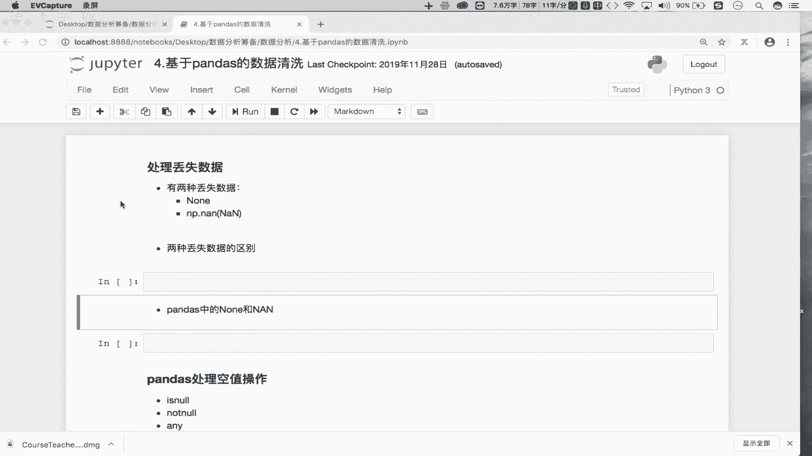

是我们在这个pandas模块当中，常用的一种分析的形式，那就是说在我们进行数据分析啊，数据分析的一个必要的前提条件，我们是需要对咱们原始的数据，进行某种形式的清洗，为什么需要清洗呢。

因为可能哈可能在我们的这个原始啊，原始数据中啊，会存在什么呢，存在缺失值啊，那这块的缺失值指的就是我们的一个空值，OK吧，那你要知道，其实在某些常规的指定条件指定需求下。

那么我们原始数据当中所存在的空值，是没有意义的，并且反而这些空值如果存在之后，会干扰咱们整个的一个分析的一个结果的产生。

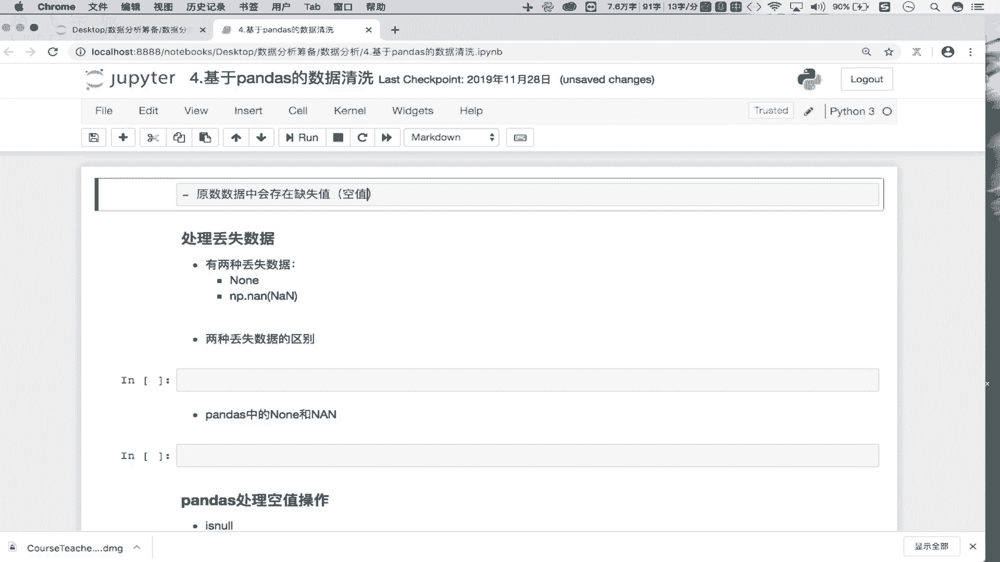

OK吧，所以说咱们需要将原始数据当中的，这些个缺失值，就是这些个控制给它进行某种形式的清洗，清洗就是说我们把它给删除，是不是，那除了删除，还有其他对应的操作，我们逐步往后去看哈，那除了有控制之外。

还有什么呢，还可能会产生相关的什么呢，重复数据重复值啊，那原始数据当中如果产生重复值的话，那么重复值是没有必要给它进行多次分析的吧，多次处理的是不是，那我们可能会需要将相关的重复值，给它进行一个过滤。

给它进行一个清洗。

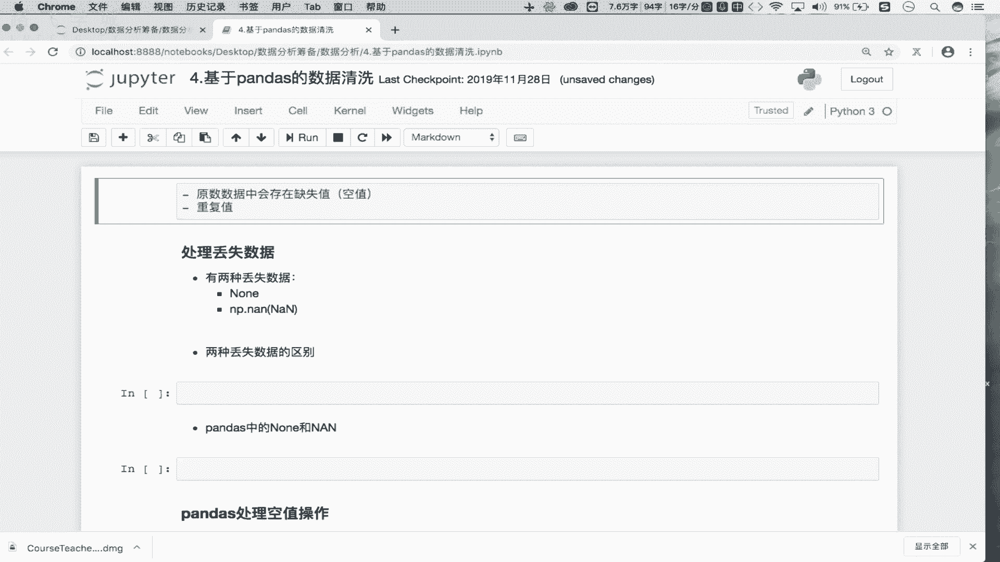

OK吧，最后一种形式就是我们的异常值啊，那么由于相关的这个数据采集的啊，这个手段不同，那么可能采集到的数据，数据当中会产生某种形式的异常值，OK吧，那么异常值它也一定会干扰咱们最终分析的。

一个结论的产生吧，所以说我们也需要把异常值给它进行一个过滤，那么所以说在咱们整个的pandas，数据清洗的过程当中，我们需要清洗如下三种形式的值，第一个就是我们的趋势值，第二个重复值。

第三个就是我们所谓的异常值，OK吧，那么这三种形式的值如何对其进行清洗呢。

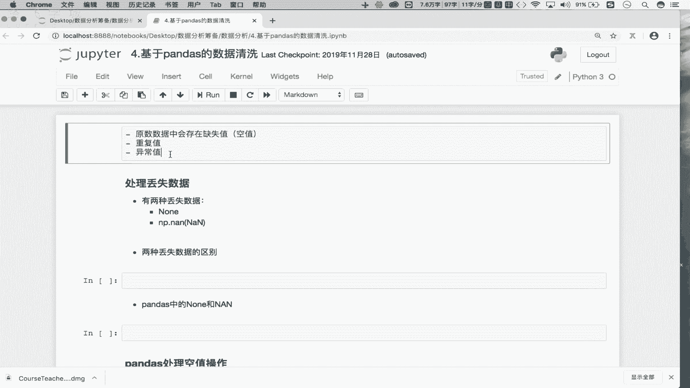

那么接下来咱们首先呢先看一下我们控制，就是我们缺失值的一个处理方式。

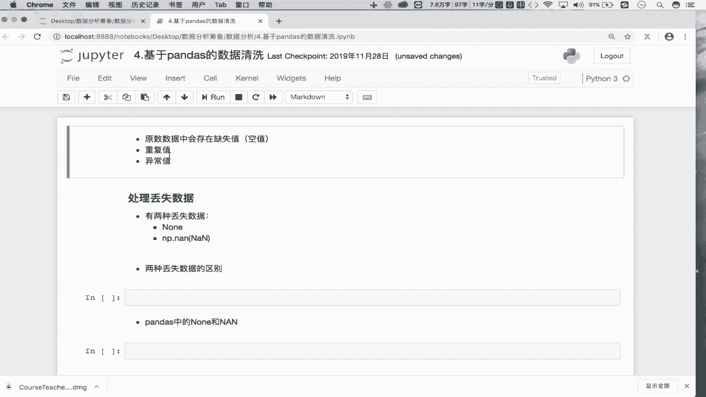

OK吧，那首先如果产生了控制之后，那么我们的空值啊会有两种形式，那其实咱们之前在讲解这个series算数运算的时候，我们说这个series进行算术运算化，只能让索引一致的元素进行算术算法。

否则会给我们补空，那在这我们补的空是NAN的形式的空吧，而不是我们之前所见到的NONE形式的空，是不是啊，那么在咱们整个的数据分析当中，我们所见到的空所使用的空，所产生的空一定是NAN形式的空。

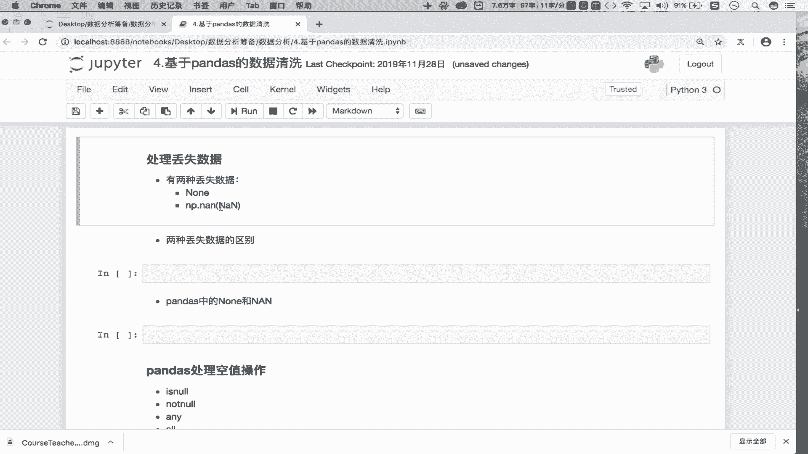

而不会是NONE的空，为什么呢，那么接下来我们就来看一下。

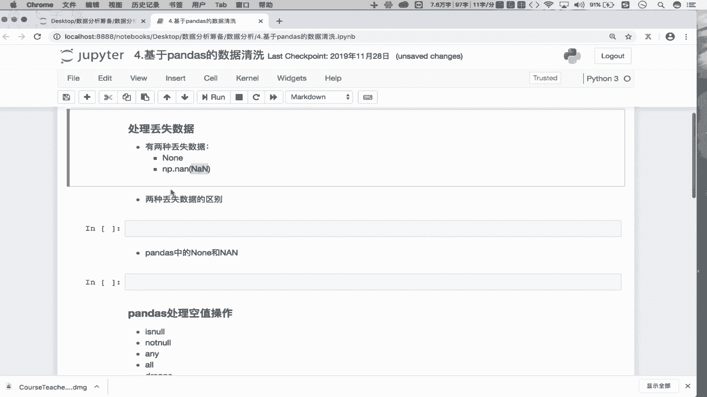

这两种空的区别是什么吧对吧，看一下这两种空的一个区别，它到底有怎样的一个不同。

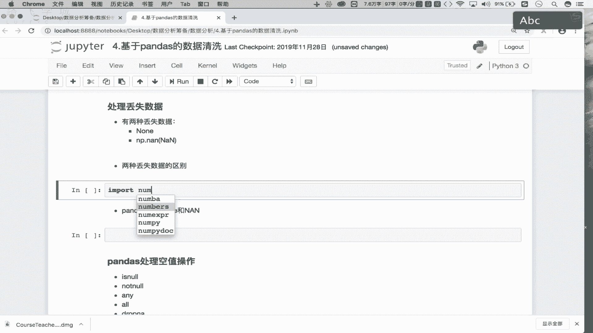

是不是好，那首先啊首先在这的话我们看一下啊，通过type的形式，我们看一下这个NONE对吧，它的类型是什么，是不是个none tap呀，那就意味着我这块的话什么呢，这块的话NONE啊。

它其实是一个什么呢，是一个对象类型。

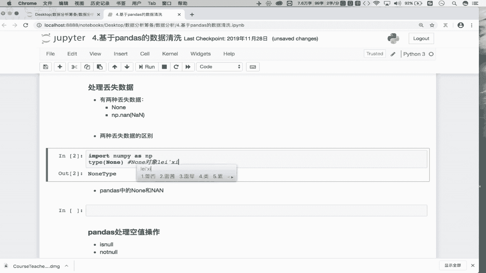

对不对，它的数据类型是一个对象类型啊，而我们在数据分析当中能够用到的，NAN是怎样的类型的，那首先在这我们去看一下NPD2，第2NAN，那么通过nip模块当中的NAN这个属性。

它所返回的就是一个n a an形式的空，OK吧走你看返回的是不是一个NN啊，对不对啊，所以说这个NP点NAN，可以帮我们产生一个这种形式的空吧对吧，那这个空是什么类型呢，好在这我们通过type去看一下。

会发现这个形式的空就n a an形式的空啊，它是什么呢，是不是浮点型啊，是浮点类型，那么从这我们就能够看到这两种形式的空，哪个区别吧对吧，看到这两种形式空哪个区别啊，那么这两种形式空它的区别我们知道了。

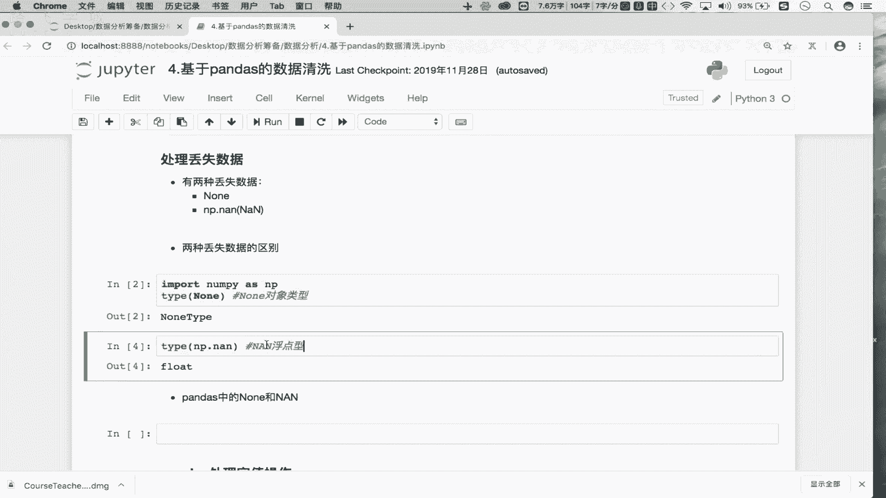

那为什么啊，为什么在咱们的数据分析当中，需要用到这个浮点类型的空呢，对吧为什么呢，那在这的话我们来看一下啊，看一下为什么在数据分析中需要，需要用到的是浮点类型的空，而不是对象类型的对吧，为啥呢。

好那这的话咱们做这样的操作，你比如说我NONE是吧，空我让他加上一个一，可以吧，让我们对象类型的空加上一个一，那这样的一个算数运算执行之后有结果吗。

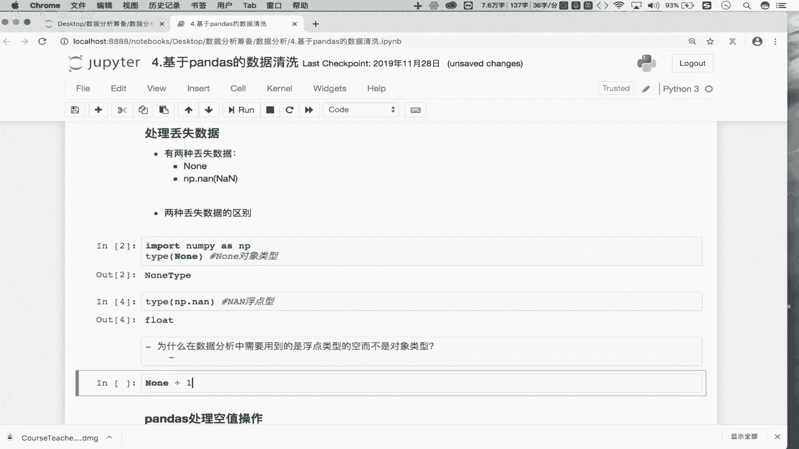

走一定是没有结果的，为什么呀，类型不一样吧，对象类型能加上一个整数类型吗，不行吧，对不对，那我们换一个NP点NAN，那现在我让浮点类型的空加上一个一，能运算，不走能运算吧对吧。

你要知道这个浮点类型的空加上任意的值，返回的都是空，OK吧，这是一个空，而并不是一个零吧，零跟空是不一样的，是不是对吧好，那所以说在这我们会发现啊，也就是说因为哈因为这个在数据分析当中，数据分析中啊。

会常常使用什么呢，会常常使用这个某某些形式的运算来处理，而处理什么的原始数据吧，是吧啊，那么如果啊如果原始数句中的空值啊，空值为NAN的形式啊，则不会干扰，不会不会不会干扰啊，不会干扰干扰或者中断啊。

中断，中段中段是中段整个的一个运算吧对吧，因为我们会知道什么呢，因为我们知道会知道NAN对吧，是可以参与运算的，对吧，而我们的NO n in是不可以参与运算的，OK吧。

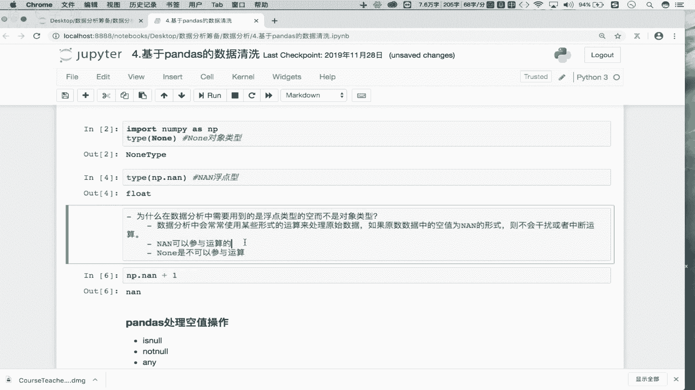

这是这两种空在本质意义上的区别，也就是说在咱们的数据分析当中，如果哈原始数据当中的空是NAN的形式，那么在整个的运算的过程当中，在处理的过程当中不会中断咱们运算吧，假设我不进行控制的清洗对吧。

原始数据里面即使有控制的话，那么我对原始数据进行某种形式的运算，那么也不会中断咱们整个的一个运算的流程，是不是，而如果你的空如果是一个NONE的话，那么在运算的过程当中。

是会中断咱们整个的一个运算流程的。

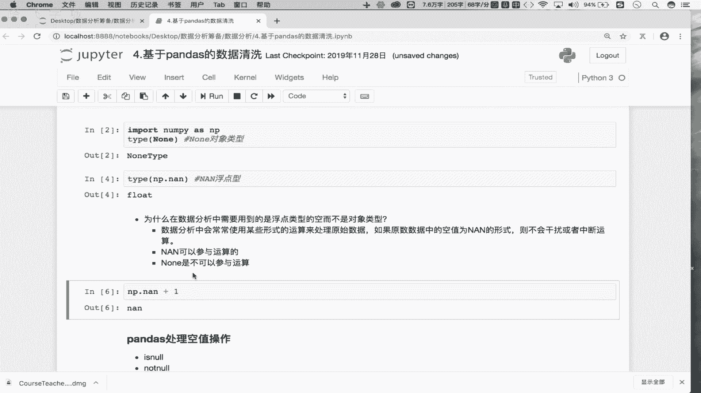

是不是，OK吧，就是这两种控制的一个区别啊。

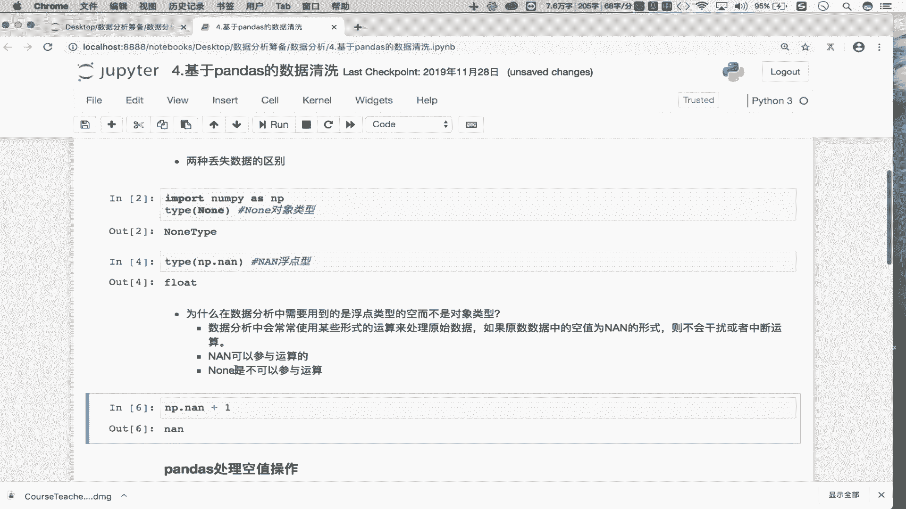

所以说在咱们的数据分析当中，一定要用什么用NAN形式的空。

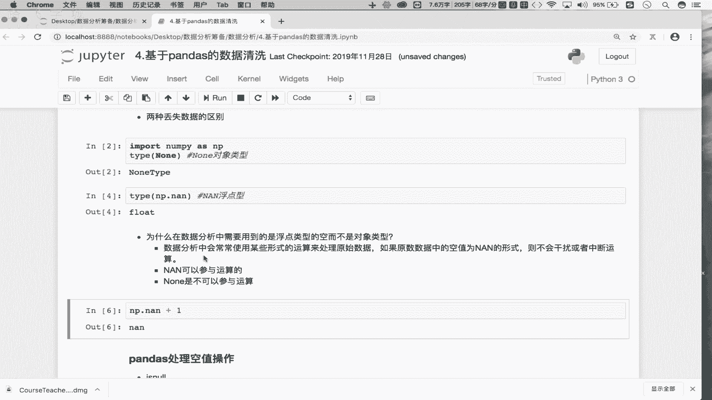

而不要用NON形式的空吧，OK吧好那这的话有一个小的特性你要知道啊，有一个小的特性你要知道啊，那这我都写到这啊，那就是说在pandas啊，pandas中放始终，如果啊遇到了什么呢，NONE形式的空值。

则啊pandas会将其强转乘NAN的形式啊，那就是说如果哈，在咱们的pandas的操作过程当中，遇到了NONE的形式也没关系，为啥呢，因为pandas as会将这种形式的空，强转成NN的形式，OK吧。

它会自动的帮我们做强转。

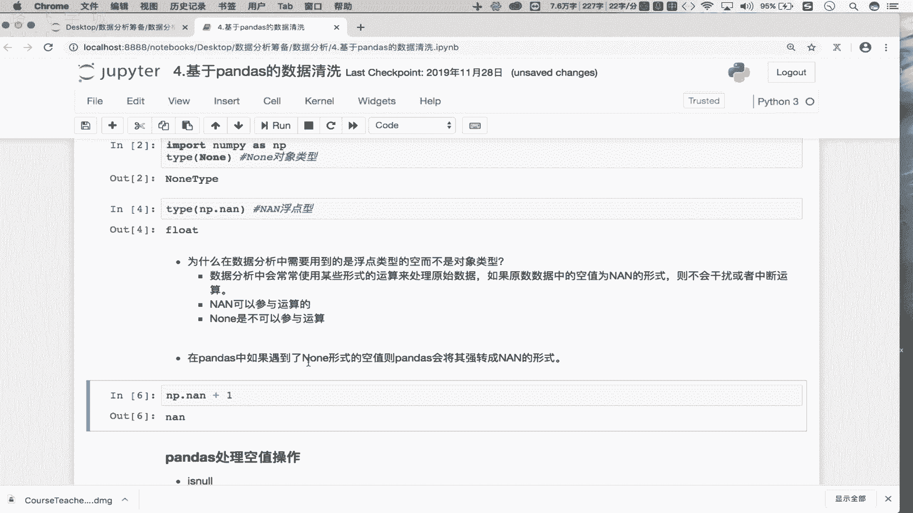

我们就不需要关注了吧，不需要管它了啊，但是这两种空本质意义上的区别。

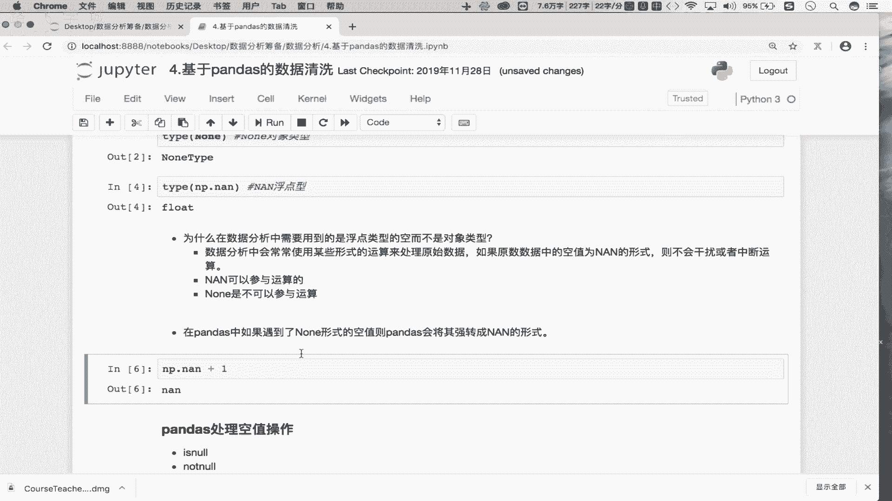

你要知道是怎么回事啊，是怎么回事，OK吧好，那么接下来咱们就来首先看一下。

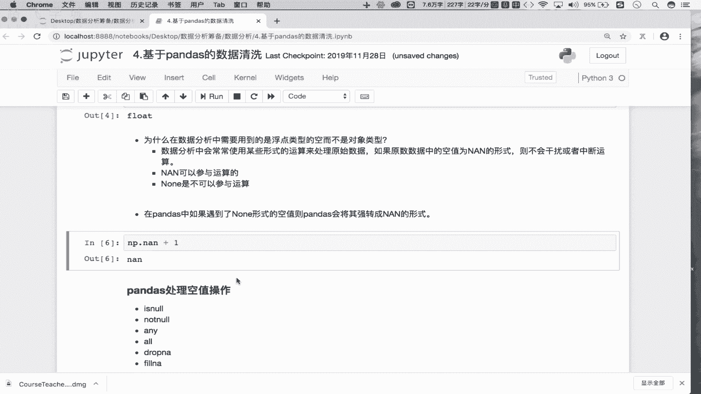

如果我们在这个使用pandas，进行数据分析的过程中产生了空值。

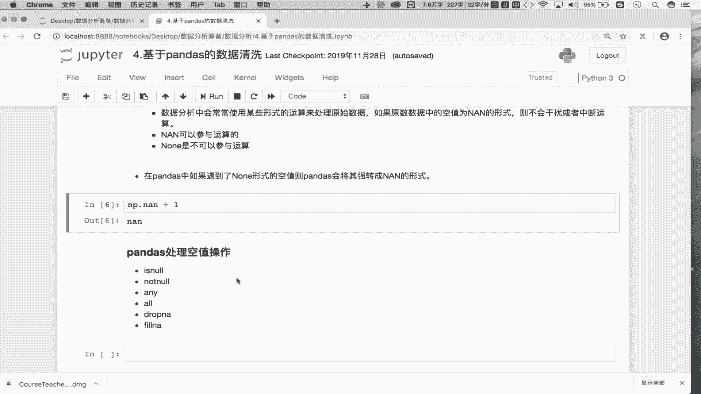

那么这些空值该如何进行清洗呢，是不是好，在这的话我们就来试一下，你比如现在啊我有一组数据源，先把我们对应的模块导一下吧，import我需要找一下pandas，as pd是不是好。

然后呢from从pandas当中，import需要导一下data frame和series吧对吧，nap刚才我们是不是导过了对吧，将对应的模块导一下。

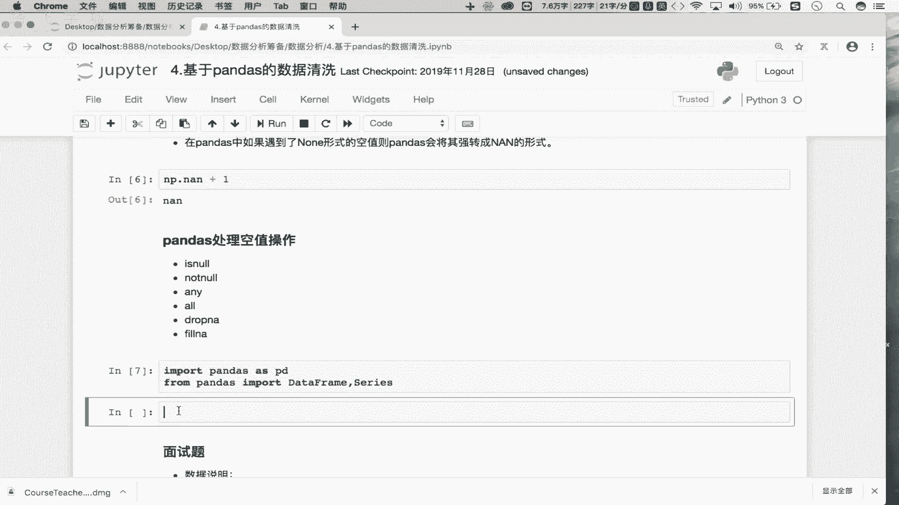

那么接下来我在这干什么呢，我去伪造伪造一组数据啊，那么保证该组数据当中是存在控制的，然后我就需要通过相关的方式把空值给它过滤，给它清洗掉呗，对吧好DF就等于data frame好。

数据源是我们通过IP产生吗，nip点random点random int ok吧，从0~100吧，size形状的话，给它一个，给它一个八行八行六列吧。

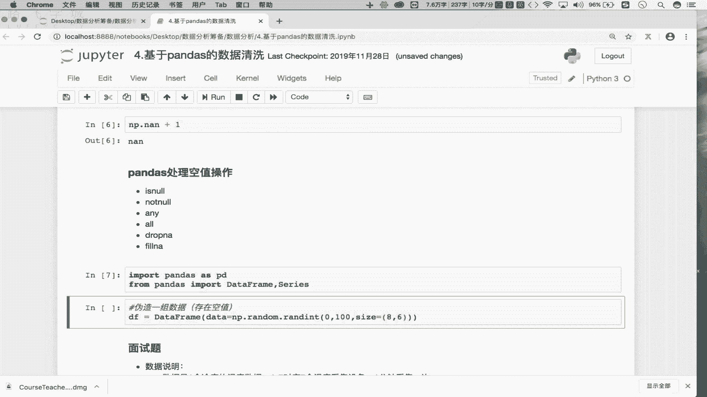

OK吧，八行六列啊，这样的一组数据好，现在这个DF是不是就有了，那这里边没有空值啊，我需要伪造公式怎么办，好，那在这的话，我就将其中的某些元素给它赋成空值，不就行了吗，对吧，第二什么呢。

第2i lock吧，好逗号左边是行对吧，我需要将第二行的第三列给它赋值成什么呢，空值NONE可以吧，那我这赋的值是NE可以吗，可以因为在我们的pandas当中，如果你用了NOE型的空。

它会被强转成NN吧对吧好，再将第四行的第四列啊，好给它赋成一个NP点NAN可以吧，DF点i lock好，再将我们的第五行的第二列好，给它复制成NONE。

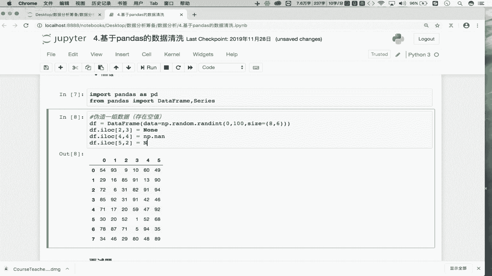

现在我们就产生三个空值，可以吧，走会发现，现在我的原始数据当中是不是有三个空值了，你看这三个空值是不是都是NAN的形式啊，对吧，都是我们所谓NAN的形式啊，诶那个空的在这是吧，这三个控制啊。

好那么现在也就是说我们已经有了一组数据了，这组数据当中有三个估值吧。

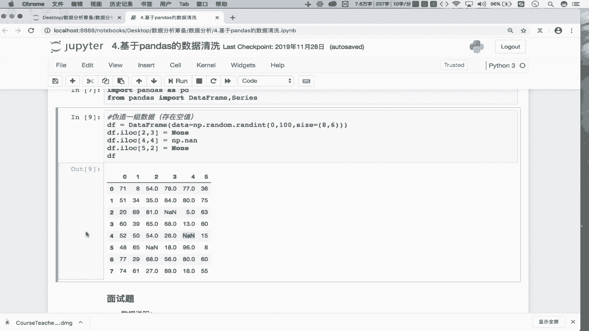

那么接下来我们需要将这三个估值，给它进行一个过滤吧对吧，过滤啊，那怎么过滤呢，好在这的话我们先看第一种形式啊，这个方式一啊，对空值进行什么进行过滤啊，过滤这块的过滤指的是什么呢，这块的过滤指的是说。

我们要删除空所在的行数据，OK吧，你不能把空单独删掉吧，你比如说你个位置空，你单独删掉之后，这剩的是不是还是个空啊，对不对，不能单独删，你也不能删列吧，因为列是我们的结构。

因为我们说你可以把data frame，当成咱们数据库的一个库表，是不是，那库表的话是不是只能删行，不能删列呀是吧，删列的话，整个的库表结构就变了吧，在咱们的data frame当中也是一样的。

只能删行，不能删列，OK吧，除非明确指定了让你删一个无用的列，你可以把列删掉，是不是，那在这啊对空值进行过滤，咱们选择的方式就是说将空锁对应函删掉，这用什么呢，这使用的技术啊，技术是什么。

是is not或者是，not呢，还有什么呢。

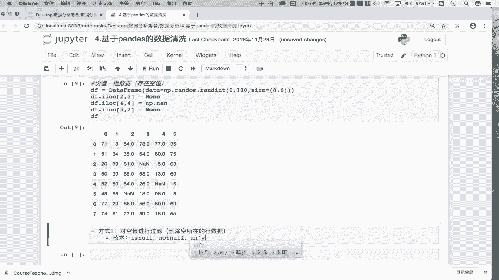

any和all使用这几种形式技术，对我们控制所对应的函数，进行一个过滤就可以了。

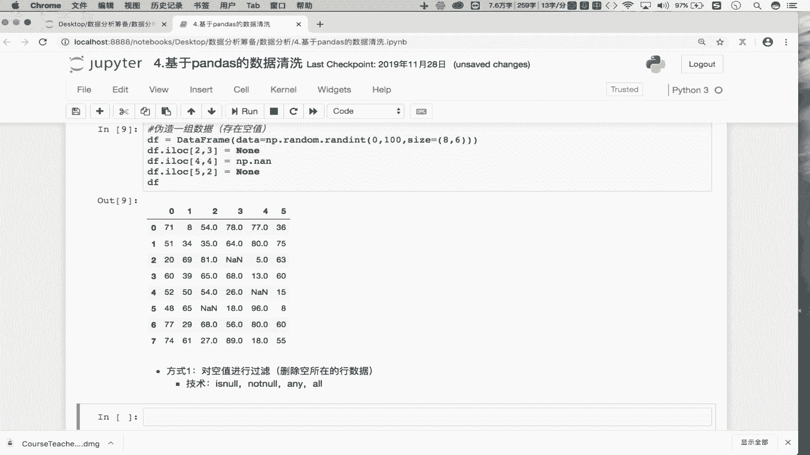

OK吧好，那这怎么玩呢，首先df d r is now我们来看一下吧，那is now返回的是什么，我们说is n是用来监测这个原数据当中的，每一个元素到底是不是空值吧，如果是的话，返回一个true。

否则返回false吧，那not n跟它是不是相反的，之前我们的is now not now只在series当中用过，是不是在date frame当中是不是第一次用啊。

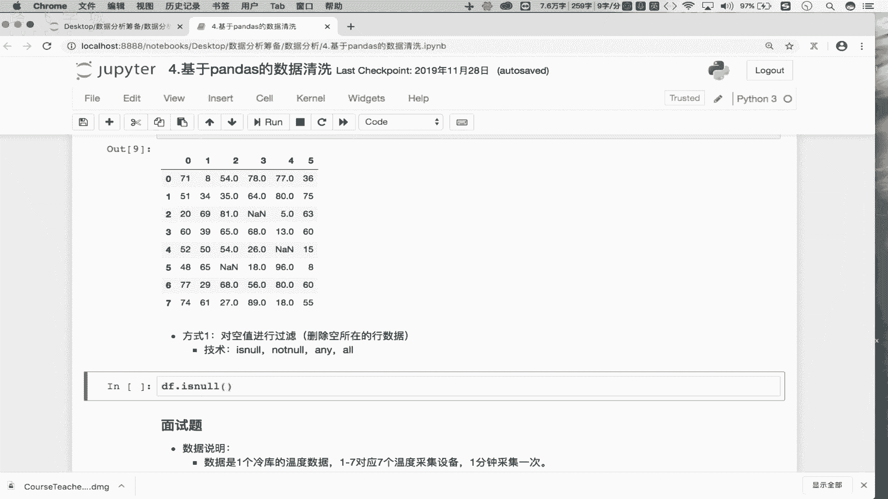

所以说这个is now，not now也可以被作用在我们的data frame当中，那走你会发现现在在这一组返回的数据上，是不是有三个处啊，一个true，两个true，这是不是有三个处对吧。

那么这三个处所表示的含义啊，这三个处所表示的含义，指的就是说这三个处所对应的位置。

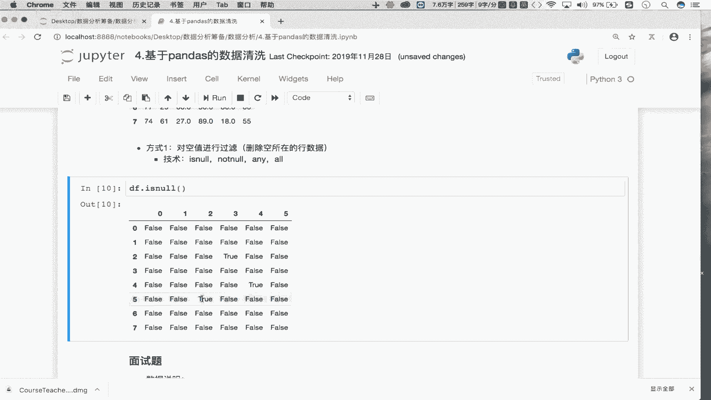

对应的值是不是刚好是空值啊，对不对，杠是控制吧。

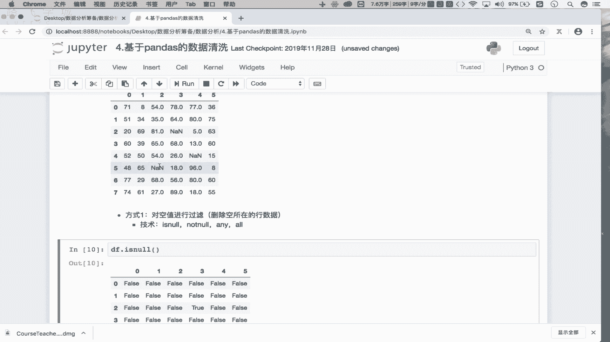

那么现在我们通过is sn就可以知道，处所对应对应的位置。

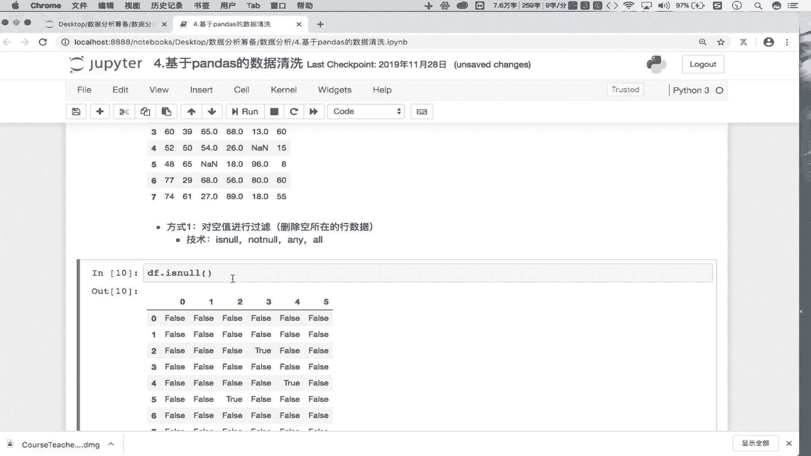

表示的就是我们的一个控制啊，表示的就是我们的控制啊，那这个是is none，那not none是不是刚好相反的。

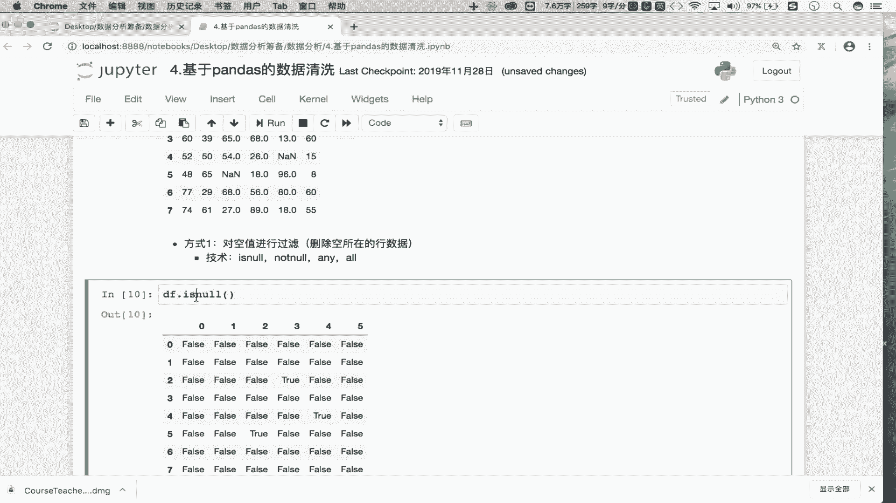

not now走，你返回值大部分都是true，少部分是false啊，false对应的值是不是空值啊，对不对，那你会发现意思呢，not那可以帮我们找到空对吧，那我们最终是想把空所对应的函给他删掉啊。

那这块怎么删呢对吧，我们想删的是行，那就是说我需要知道哪些行当中是不是有TRU，啊对吧，那这个玩意儿怎么玩呢对吧，在这儿我们想知道哪些行中存在什么呢，true吧，这个true是不是我们的这个空值啊对吧。

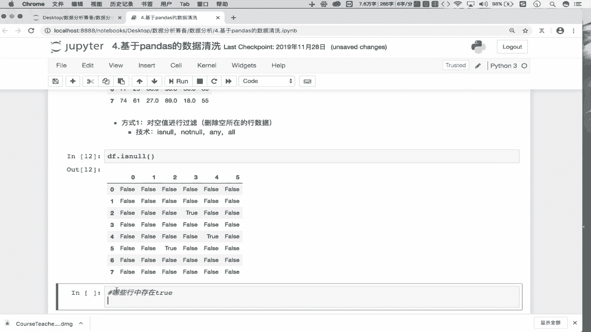

那怎么办呢，好这么去玩啊，DF点r is now，OK吧，然后这调一个什么，调一个any或all，那么这个any和all的作用，就是说用来监测我们原数据的某些行或某些列。

里边是否有true或是否有false对吧，那这我们来试一下any，你看一下any啊，Any，X我们让它等于一吧，OK吧，为啥呢，因为我现在是想让any ding，用来监测我的某些行里边。

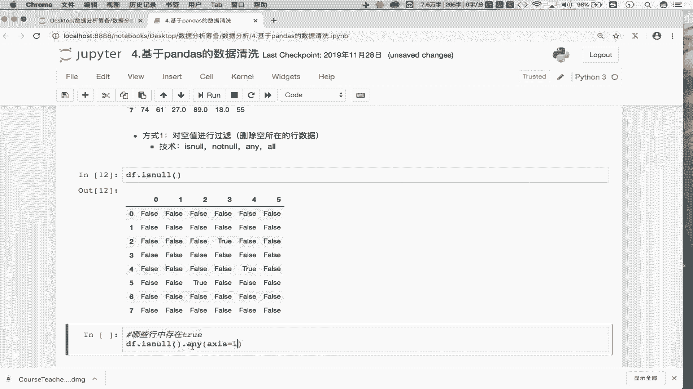

到底是否存在true和false吧，走看一下现在这返回的，你看是一共有八个初跟false啊。

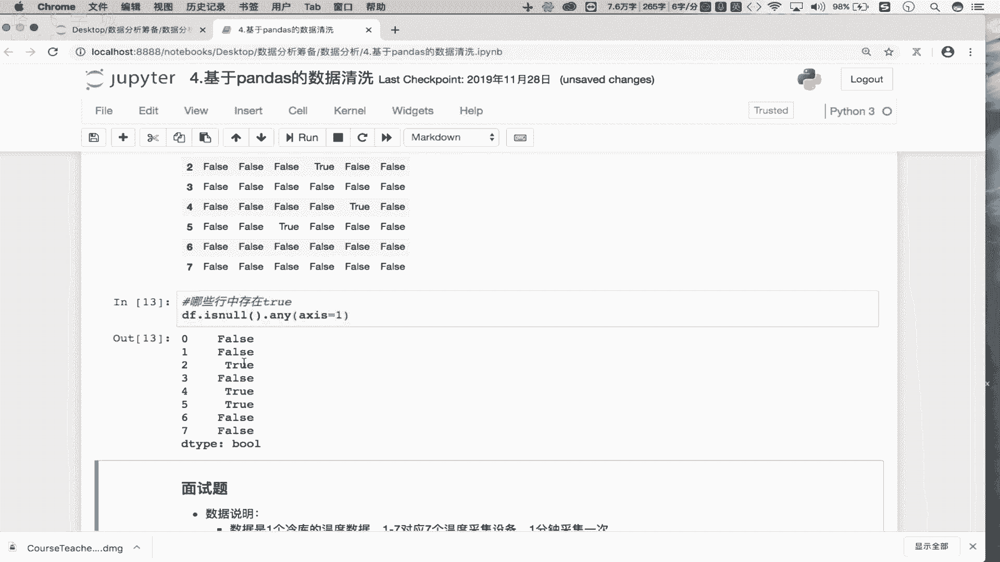

刚好对应的是我们这八行数据吧，对吧，你会发现245是吧，这三行返回的是true，剩下返回的是不是都是false啊对吧，那看一下二行里边是不是有空值啊，四有空值吧，五有空值吧。

那么意味着现在这返回的这组布尔值，对应的true表示的就是说这几行当中存在空值吧，那我们来想一下any的作用是什么呀，any any的作用是什么，any是用来，用来检测上我们的行或列中是否存在什么呢。

是否存在处吧对吧，如果有true就给我返回true，如果没有true，是不是返回false啊，你看那么作用到第一行当中，你看第零行，第零行是不是有true啊，是不返回false啊是吧。

一旦某一行都有true的话，是不是给我返回true啊，对不对，那所以说在这啊，通过我们的is nn结合着any，我们就知道啊，就知道哪些行里边有空值了吧对吧，哪些行里边有空值啊。

那么你看这块的true啊，这块的true跟false有了，我们能不能把这组布尔值作为原数据的行，索引呢对吧，把这组布尔值作为原数据的行索引，可以吧对吧，那接下来啊将。

将上部啊上部的布尔值作为原数距的行索引，对吧，试一下df d r lock吧对吧，lock行，那么将这一组值作为我们原数据的一个行索引，给它扔进来好走。

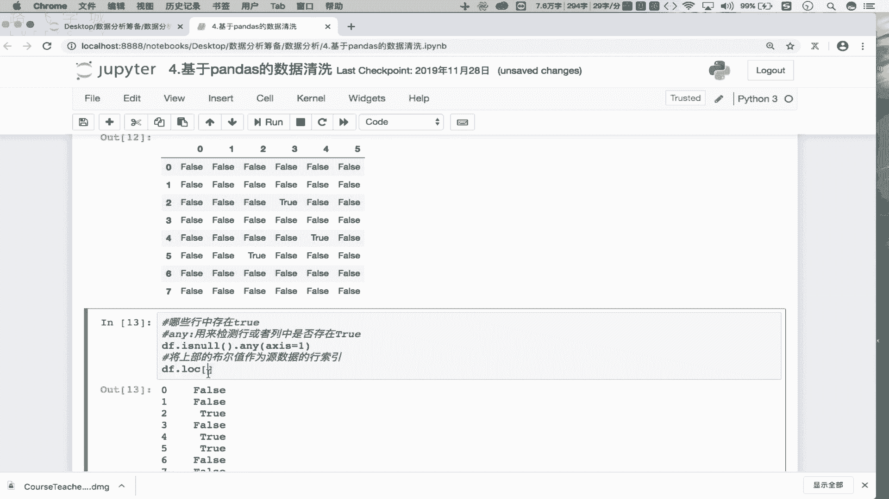

你，那这一步我们是不是得到了处，所对应的行数据啊对吧，那么true啊，对应的行数据就是存在缺失值，就存在空值的行数据吧对吧。

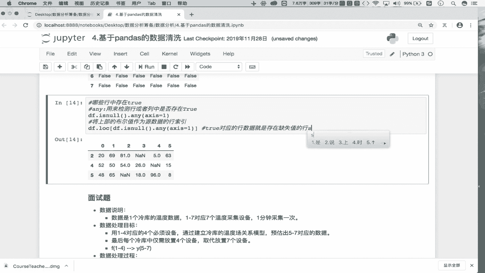

行数据啊，那咱们能不能把这几行的索引拿到呢，OK吧，把这几行的索引拿到，为什么拿索引呢，d r index是不是拿到他的行索引对吧。

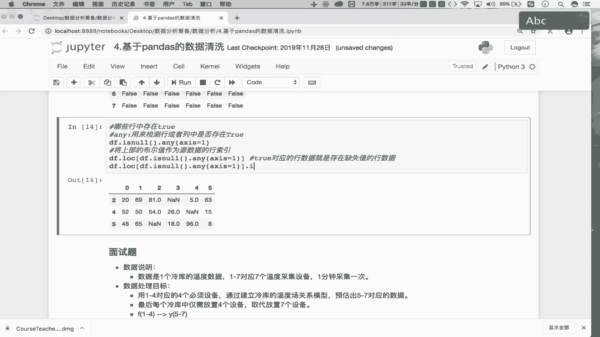

等你行索引是不是245啊，那这245是不是我们要删除的呀对吧，DROP杠index，比如说那么这我们就获取了什么呀，获取了即将要删除的行索引了吧。

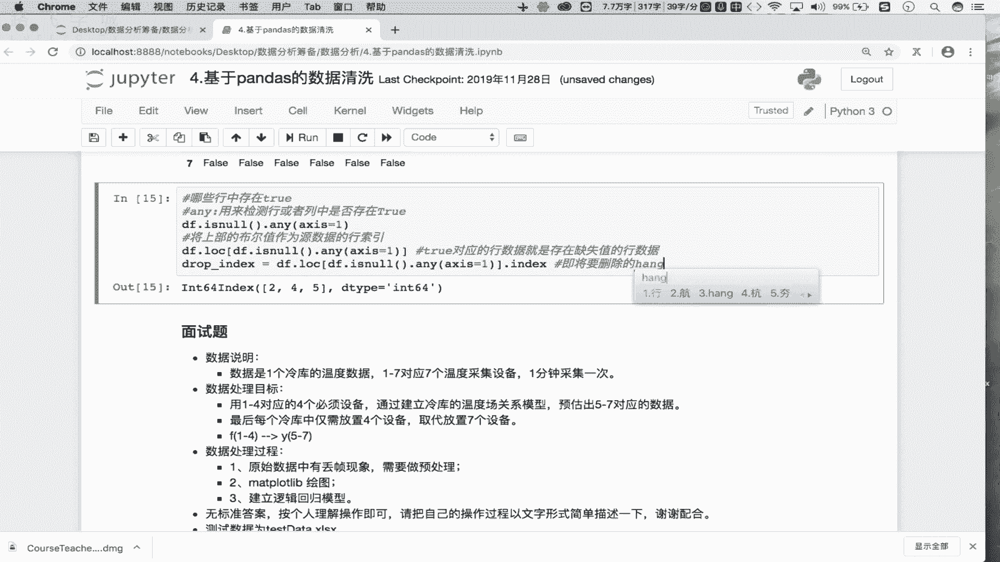

那接下来能不能删掉它呢，可以吧，怎么删呢，df d r d r o p job是不是好，那这块的话labels删除的不就是我们的245吗，245不就是存在job杠index当中吗，对吧好，那这一块的话。

xis删的是不是行啊，行是零对吧好，那这块的话我们看in啊。

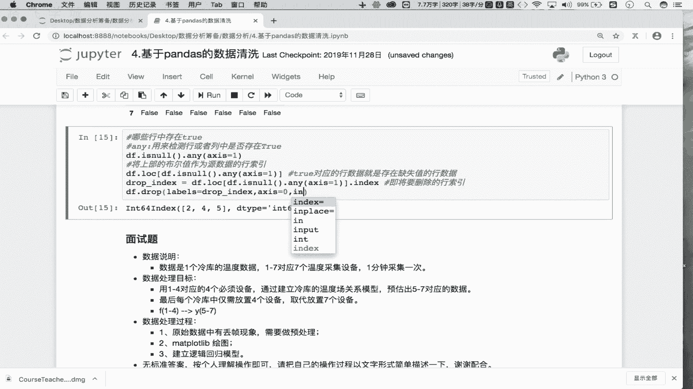

我们就不写IMPLI了啊，Sony，那现在你看一下我们的这个原数据，是不是已经将空锁对应的函给他删掉了，对不对啊，在这的话是说将缺失行进行删除吧对吧，那现在通过我们的什么呢。

EASN结合着any就可以将原数据当中，存在缺失数据的行给它进行删除吧对吧。

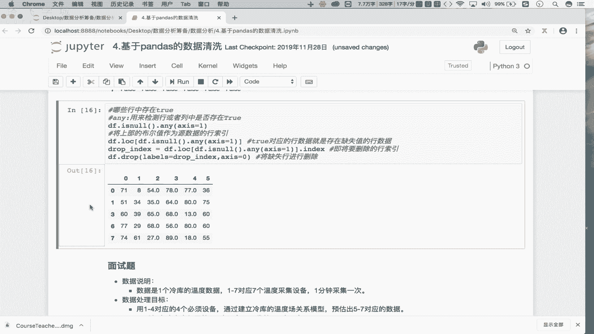

那这如果我不用意思呢，我用not n行不行，DF点r not呢。

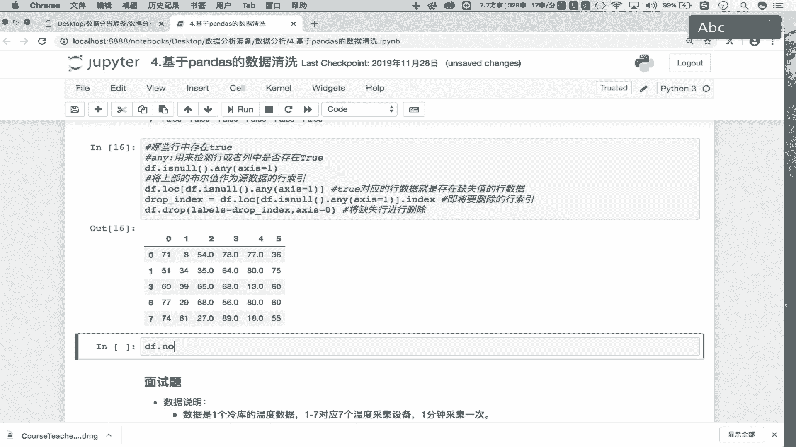

找那not那n u note now是不是大部分都是true。

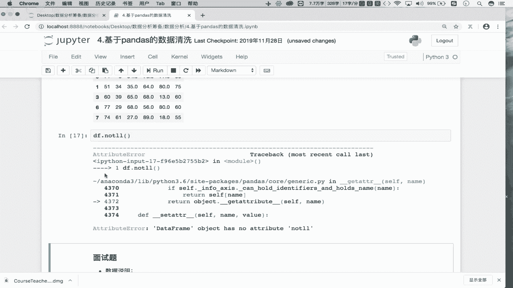

少部分是false啊，对吧，那这我能不能用一下any呢。

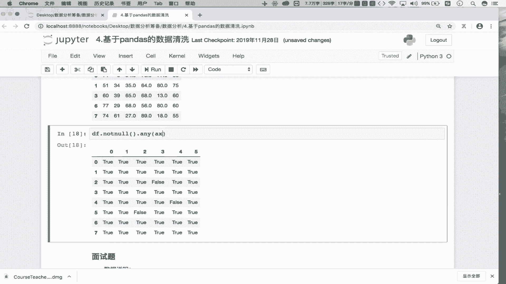

走你看这返回的是不是都是to啊，为啥呢。

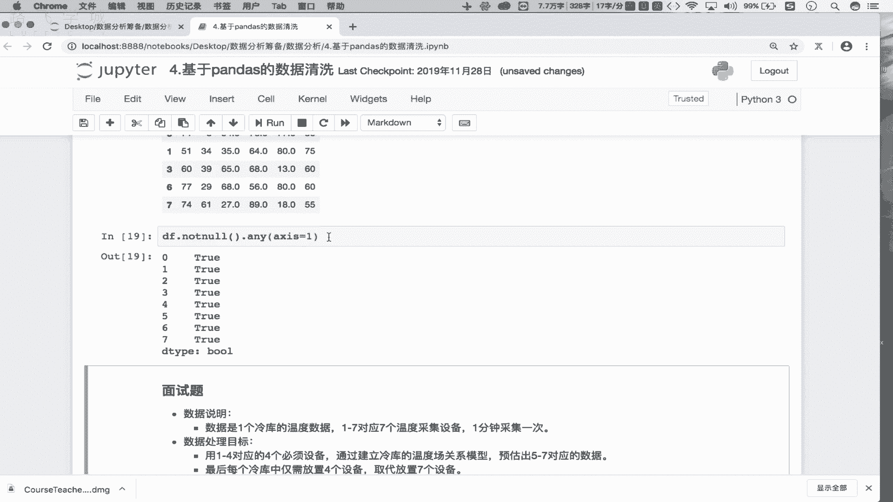

看一下啊，因为我们的not now返回的这组结果当中，大部分都是处，少部分是false啊，我们说any就是说碰到某一行里边有true，就给我返回true，否则返回false吧。

那这样你就不能用any的呀，是不是每一行里边都有出啊，用什么呢，用一下all，哦or什么意思呢，or就是说我需要来看一下每一行啊，如果某一行里边如果都为true，我就给你返回true。

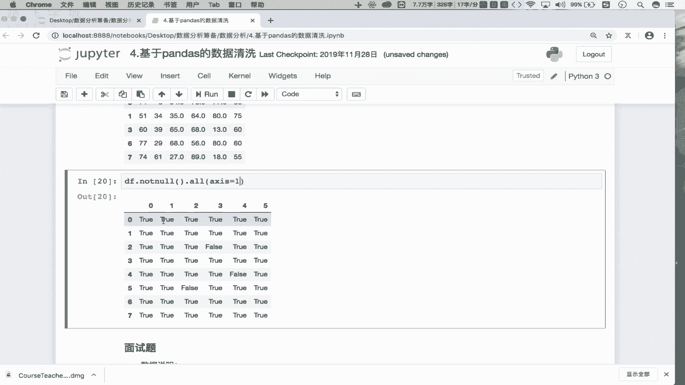

但凡有一个false，我就给你返回一个false吧，你看一下是不是245是false啊，对不对，那所以说那这个any啊，这个or啊是用来监测什么，监测false的吧，有false就给你返回false。

如果一个false都没有，我就返回一个数呗，对吧，那现在这组布尔值，能不能直接作为原数据的行索引，可以吧，不就直接将245这三行给它过滤了。

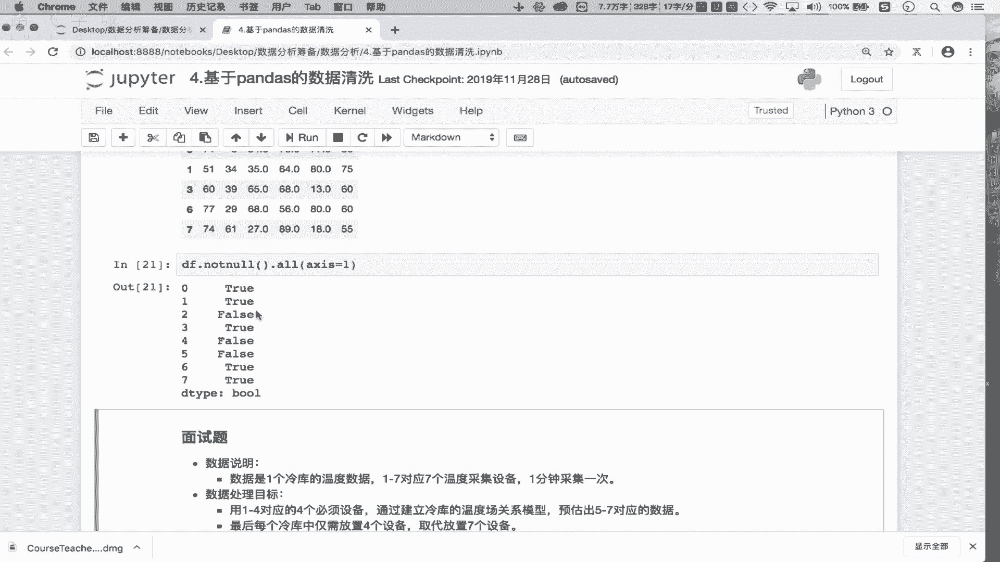

DF点lock好，直接把这组布尔值作为原数据的行索引，是不是直接就把我们空锁定行进行一个删除啊。

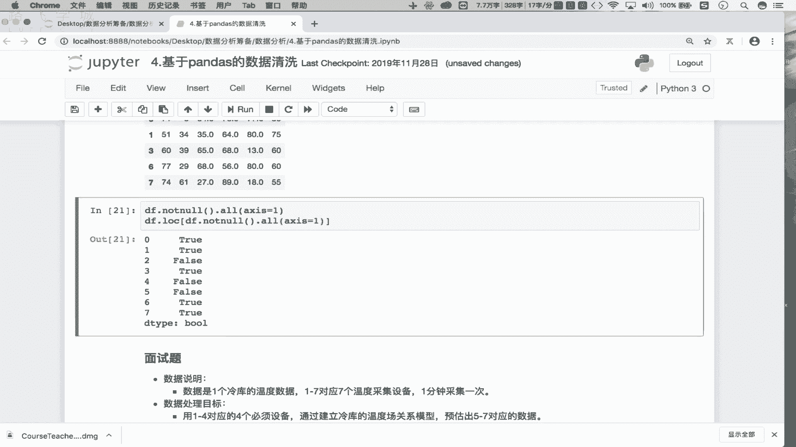

OK吧啊那所以说在这通过意思呢啊。

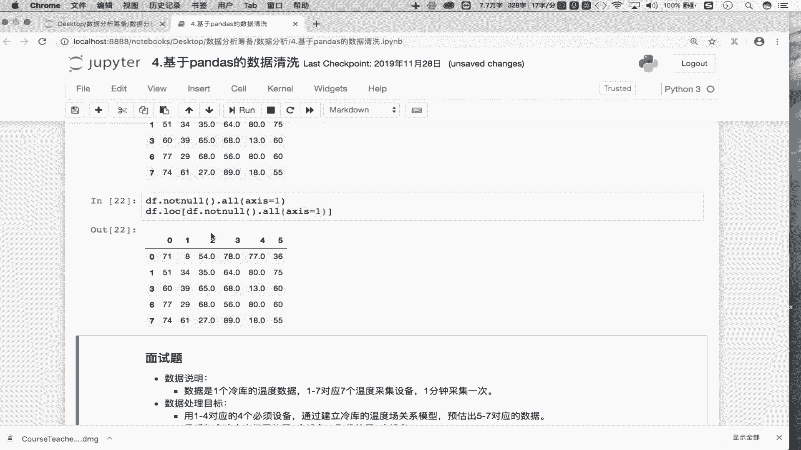

通过我们的any和not呢，通过我们N都可以进行一个删除吧，那这你会发现我们的意思呢，这发现一个规律啊，规律那就是说我们的is呢永远是结合着什么呀，any吧是吧。

not now永远结合的是我们的all对吧，它们是不是固定搭配啊对吧。

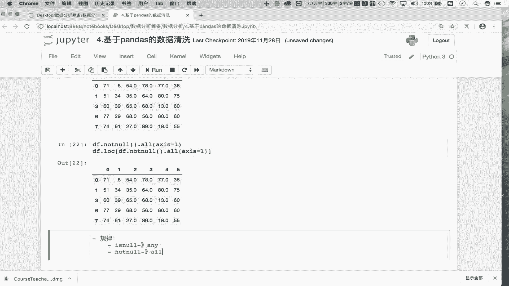

这块是我们的固定搭配，那么通过is not not not any和all。

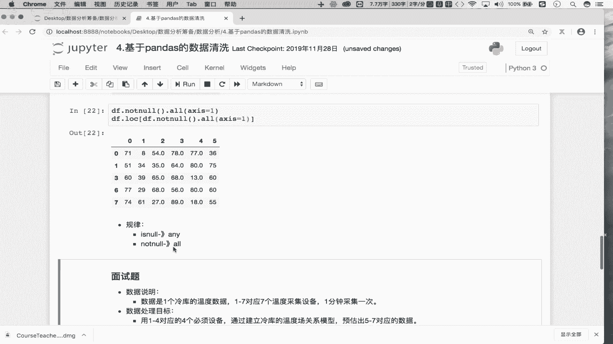

就可以删除咱们空所对应的行数据了吧，OK吧，这个是不是简单对吧。

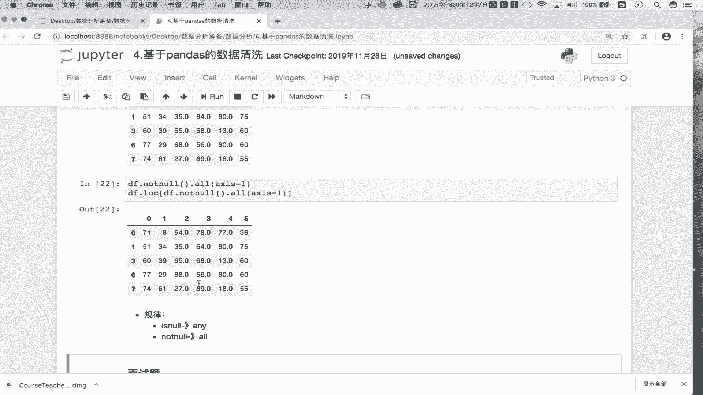

简单啊，那我告诉你一个更简单的一个方式啊，更简单的一个方式，那么其实在咱们的pandas当中，已经给我们集成好了一个函数，叫做d r o p job，那通过中文档就可以可以。

直接将缺失的行或者列进行删除。


OK吧，那这个怎么玩呢。


看一下啊，DF是不是原数据啊，还是有缺失数据吧，d r d r o p job nn是不是好，这里边传什么呢，看一下这块，首先是不需要传一个轴线啊，xis等于什么呢，X等于零，零是不是行。

那就是说X是行，就意味着我们的ROMN想删缺失数据存在的行，X等于一，是不是等于列啊，列就是说我们的dB down想删除区数据所存在的列，是不是tony是一步到位啊。

就不用我们再使用is not not not any和all了吧，OK吧OK吧，好所以说直接删除空所对应的行数据的话。


是直接用JOBNN就行啊，但是前面的is not not not any all。


最好你也需要掌握，OK吧，最好你也需要掌握啊。


好，那么这块的话是对我们的缺失数据，进行的一种形式的清洗吧，是吧，进行的一种形式的分析啊，你想啊。


那么这个空啊除了可以删，还可以干嘛呢。


除了伤害可以干什么呢，好在这我们去看一下啊，刚才我们这写的是方式一对吧啊方式一。


这个就是我们的方式二啊。


方式2OK吧。


直径ROBNK吧，直径ROBN啊，好那么接下来在这啊，接下来在这啊，那么我们的趋势值除了可以删，我们还可以覆盖啊，对缺失值进行覆盖啊，这是另一种处理缺失值的方式。


OK吧啊好对缺失值进行覆盖。


那么将缺失值覆盖完了之后，不就是说将空值给它覆盖了吗。


这个比如说我在这啊，原数据有空值吧，我把空值给它覆盖了，覆盖完了之后是不是就没有空值了对吧。


那这样的话怎么去覆盖呢，那么怎么覆盖，可以更有这个更有更有更有这个合理性呢对吧。


我们可以使用FIA这样的函数。


进行缺失值的覆盖，那咋覆盖呢对吧，那比如这个now，我是用零覆盖它呢，还是用十覆盖它的对吧，首先看一下啊，DF点叫做FIONA，Fiona，首先你看它里面有个参数叫做value value。

我可以等于一个什么666走，也就是说我将六六是不是覆盖所有的空啊，那你这样覆盖的话，其实意义不大，意义不大啊，你比如说哈比如说那这块我们所采集的是呃，比如说我们的这个列吧，列是周一到呃，周六可以吧。

然后行索引是分钟，0分钟，一分钟，2分钟是每隔一分钟所采集的一组温度数据啊，你比如说啊这个八啊，是我们这个第0分钟所采集的一组温度数据吧，对吧，那这个这个这个这个81啊，也是采集的一组文本数据。

OK吧啊，那就是说现在啊我们原始数据里边有空值啊，我们想把空值给它进行合理性的覆盖，怎么覆盖啊，咱们最好啊，最好就是说让什么，让空值周围近邻的值去覆盖它，你比如说啊比如说你看这啊，看这首先这个64。

这个68是不是一分钟和2分钟所呃，一分钟和3分钟所采集的温度数据啊，那么第2分钟啊，第2分钟所采集的温度数据没有，是不是没有的话，咱们就可以用什么呀，前一分钟或后一分钟用近一年的值去填充它。

是不是就可以了，用近邻的值替用它，那么这样的话就可以最大合理范围啊，去覆盖我们那个值叫做费用的对吧，某些特殊情况下，我们是可以对空值进行覆盖的，但是你要知道再怎么合理的覆盖。

那你覆盖的值也不是最合理的吧，所以说一般情况下我们选择的是删，而不是覆盖对吧，啥时候覆盖呢，我们说一下啊，如果你删除的成本太高，就选择覆盖，什么叫删除的成本太高，比如说一共有十行数据空。

所存在的行数据有六行，你删了之后是不是只剩四行了，是不是删除成本太高啊，那怎么办，就覆盖呗对吧，如果删除成本不高，我们尽可能多的选择删除吧，对不对好，那我们看一下这个filter怎么去用啊。

那第2FIONA一般情况下啊，一般情况下参数一这个value我们不用，因为我们不知道，因为value是手动将空赋值成任意的一个值吧对吧，赋成什么呢，我不知道，那最好干什么。

最好在这我们使用一个method啊，method method可以等于什么呢，FU呢啊等于等于这个XFU或者等于BF啊，f fl表示向前填充，BF表示向后填充，你比如说我将这个none啊。

将这个NN我想使用什么，想使用64或使用68去填充这个空值，那怎么办呢，你看64是它前面的数吧，68是他后边的个数吧，我可以选择向前填充或先后填充，是不是指定方向，用64或68去填充空值对吧。

那竖直方向有前后，那水平方向有前后吗，也有吧对吧，所以在这啊除了选择方向之外，还需要选择一种像xx等于一一，就是说我使用行一是不行啊，是不是水平方向的前后填充空值啊，对不对，你看原来你看这啊。

这个值是不是空啊对吧，我现在这个含义就是说啊，额使用使用这个水平方向的向前填充，去填充空值吧，圆圈这是不是空啊，水平方向向前就是说这个81是它的前，我用前面的数填充，它向后填充呢。

是不是把这个数变成五了对吧，看一下BF是不是五了。


是不是向后填充啊对吧，也可以给它改成零吧是吧。


是水平方向上向前和向后填充啊对吧，那么这个是我们的一个填充，OK吧，所以说咱们空值的处理可以填充，也可以删是吧，那什么时候填充，什么时候删呢对吧，那在这块的话我们就知道了啊，就是说如果删除成本比较高。

那么我们就给它删，删除什么不高，我们就填充是不是就可以了。


OK吧好，那这个的话就是对我们的一个这个空值，进行了处理，OK吧。

