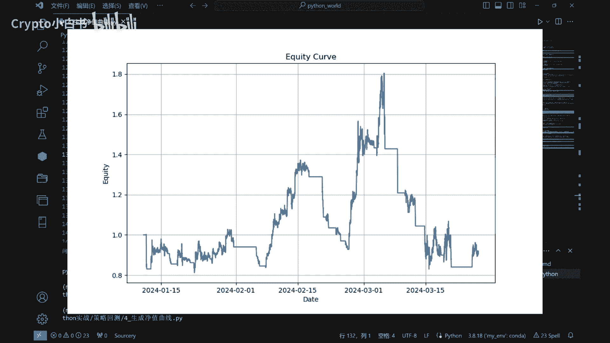
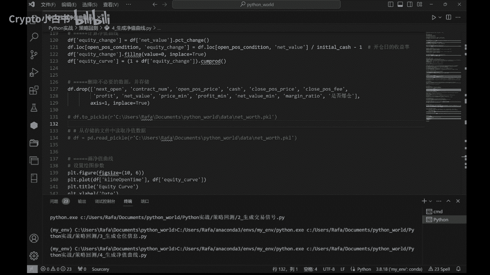

# 6-生成并绘制资金曲线 - P1 - Crypto小白书 - BV1ijxXeAEi3

森林大家好，这里是加密小白书，今天我们给大家介绍一个非常有用的，今天我们给大家介绍一下，如何将策略实际持仓转化为净值曲线，方便我们查看策略的结果，看下代码结构。

这段代码中呢我们首先需要导入Python的pandas库，Non pie，daytime以及METHOLIP，这个库呢主要是用于啊绘制资金曲线使用的。

在Python中我们经常使用map olip来进行绘制啊，各种各样的图形，接下来我们导入数据，同样的是由上一节课产生的position文件，首先读取该文件，并储存在一个名为DF的数据框中。

然后我们对数据进行一些必要的处理，以便筛选出我们需要的数据，我们选择了币种上线十天以后的日期，对于币种上线不到十天的，我们认为不太有参考意义，因为呢币种上线时间太短的话，那数据就有很大的哦不确定性。

比如说对于一个新上的币种，可能会有一波猛涨猛跌这样的情况，所以说前十天的数据呢不太有参考意义，接下来我们找出开仓平仓的K线，也就是说，我们在position中会有很多开仓平仓的动作，我们将其单独找出来。

然后我们对每次交易进行分组，并开始计算净值曲线，这里呢我们需要设置一些基本的参数，比如初始资金，合约价值，手续费率，滑点等等啊，初始资金呢我们一般默认为1万元合约价值，Face value。

通常BTC是0。01，其他币种呢需要进行不同的替换，手续费呢在这里我们默认设置为万分之五，对于不同的交易市场，不同的标的可能也会有一些手续费上面的变化，那么华点呢是一个非常重要的概念。

就是在我们下单交易的时候，很可能并不是按照我们想要交易的价格，去执行的，而是会产生一些上下的波动，这些波动呢和我们预期的价值之间的差，就是交易滑点，杠杆比率呢我们设置为三倍杠杆。

大家可以根据自己的情况去做一个调整，在确定这些数值以后呢，我们根据这些参数计算了开仓时的一些值，并在持仓的时候更新这些值，我们计算平仓价值和手续费，并计算了开仓平仓的利润以及账户的整体净值。

我们还会计算一下账户的爆仓情况，因为当保证金低于最低保证金率的时候，就会发生爆仓，那所有的本金都会消失，最后我们计算一下资金曲线，并将其储存在一个equity curve这一列中。

然后我们使用matplot lib库，绘制了净值的资金曲线，我们运行一下来看一看这个曲线的效果。

我们来看一下这个资金曲线，在2024年1月10号的时候，我们开始运行，当时的账户净值是1。0，那么到2024年3月27号的时候呢，也就是我们策略截止的时候，他的账户净值达到了0。916。

也就是说我们大约亏损了9%，但是呢在账户运行的过程中，我们看到有一个最高点，最高点也是达到了净值1。8%，也就是有一个80%的收益，所以说呢使用我们这个布林策略，在过程中呢进行一个及时的止盈。

及时的平仓，还是能够获得一个可观的收益的，大概有一个30%甚至80%的收益，但是呢如果我们任其运行的话，那么在整个策略结束后，我们大概会遭遇一个8%的损失。

好这就是整个代码的流程和功能，通过这段代码，我们将策略的实际持仓转化为净值曲线，并将其可视化地展示出来。

