# 60%胜率的短线信号!零基础python量化代码详解#量化交易 #python #金融 #代码 #股票 - P1 - 无限超人Infinitman - BV1HB4ReSEkb

如果有人对你说，他发现了你有量化投资的天赋，是百年难得一见的天才，要送你一本秘籍，此时你是信还是不信呢。

大家好，我是专注于量化投资的，行不行，你是否有量化投资的天赋呢，其实我是不知道的，也没有什么量化秘籍，但是本期视频呢可以帮你测试一下，你是否有量化编程的天赋，因为本期视频我会用一个实际的案例。

详细的逐行讲解Python量化的编程代码，并且这次讲解我是特地针对，没有任何编程基础的朋友会讲的非常的细致，保证做到你可以完全的理解，然而如果你在看完之后呢，觉得很容易，一点也不难。

甚至有一点点的热血沸腾，想要学习编程，那么就至少说明你是对方面感兴趣的，并且确实可能还有一点天赋，毕竟兴趣是最好的老师嘛，然后因为本期视频比较长，我这边把它分为了四段。

第一段呢我会讲解我们这次编程要解决的问题，是一个很贴近实际的问题啊，然后第二段呢我们要讲解，如何获取解决这个问题的相关数据，会告诉你解决方案，有了数据之后呢，第三段我们会介绍编程的具体的思路。

这里为了让大家可以完全理解，我会先使用excel来解决我们这个问题，最后呢就是我们本期视频的重头，我会逐行讲解如何通过Python来解决我们这个问题，有20几分钟，说实话我都有点佩服我自己。

因为我感觉这么枯燥的东西，肯定会没有太多人看，但不管怎么样，还是试一下，所以看完之后，如果你觉得有帮助的话，一定要通过弹幕或者评论或者三连。

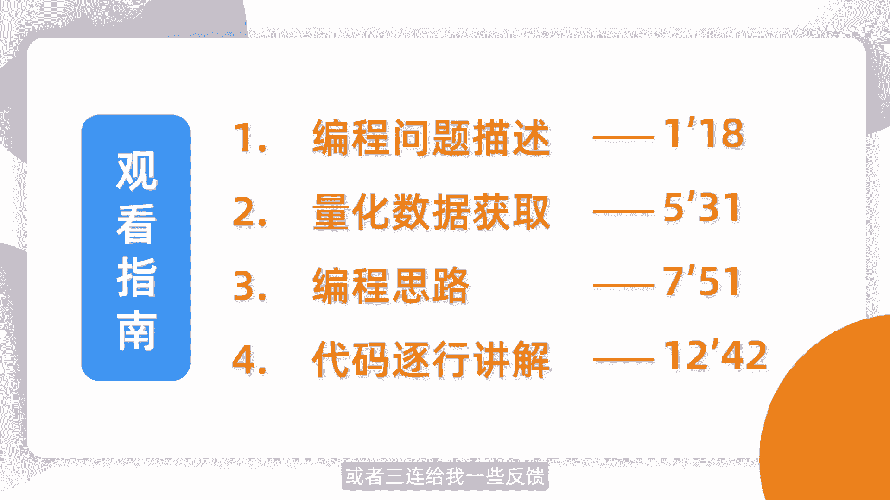

给我一些反馈，这样的话我以后可以多讲代码。

好那么我们接下来就开始正式的内容，我们首先来看这张图啊，这张图呢统计了我们A股上面，从14年年底到现在出现了一些事件，比如呢我这边列了四个事件，分别是事件1234，然后呢统计了这段时间当中。

这些事件出现的次数，比如说事件依旧出现了169次，然后呢我去统计当这些事件出现之后，我们的大盘在未来五五天的一个表现，比如说当事件一出现之后，我们发现它未来五天呢，上涨的次数是105次。

那么相关的概率就是，用105÷169，得到了62。13，在事件一出现的169次当中，它未来五天的一个平均涨跌幅是0。79，这其实是一个很高的涨幅，那么同样的，我们也统计了事件234相应的一个表现。

你可以发现这些事件其实都不错，因为一旦发生这些事件之后，他未来上涨的概率，大部分是大于55%的，甚至还有60%的平均涨跌幅呢也很高，五天平均涨0。7%左右，是很高的一个表现。

那么这个时候我就可以很关注这个事件了，因为大家都知道你在赌场，庄家其实相对于你的胜率也只有50。1，50。2，这样比你多很小的一部分，但哪怕是这样，他都可以赚很多钱，然后我们这边上涨概率是超过50%。

很多的，那么以后在这些事件出现的时候，对我们来说就是很好的一个交易信号，那么这几个事件到底是什么呢，我这边就不卖关子了，其实很简单啊，他就是我们北向资金大幅度净流入，然后只要它大于某个值。

我就认为这个事件发生，比如说我们这边的事件一，就是北向资金单日的净流入大于40亿，然后呢事件二就是单日净流入大于50亿，三和四分别是60亿和70亿，一旦这些事情发生，我们就认为当天发生了一个我们的事件。

这里面有的朋友可能不知道什么叫做北向资金，我们简单讲解一下，在我们中国大陆呢，有上海股票交易所和深圳交易所，他们统称为A，我们国内主要的股票就是在这两个交易所上市。

同样的在香港呢我们有一个香港联合交易所，很多香港的资金以及全世界的资金，都会在香港交易所交易，但是以前的香港交易所和上海深圳是不互通的，是完全隔开的，但是呢从14年之后，我们分别开通了沪股通以及深股通。

这样的话呢，很多香港的或者全世界的投资者，他可以通过香港交易所直接来购买，我们在上海和深圳A股的股票，这个其实就是相当于给全世界的资金一个通道，让他们可以很方便的来投资我们的股市。

因为深圳和上海呢都在香港的北边，所以呢我们把这笔钱也叫做北向资金，然后呢只要我们当天北向资金的数据，它大于一定的值，就出现了我们所谓的事件，这个北向资金的数据到底哪里可以看呢，这个其实很简单啊。

我们很多交易官网大家一定要去看一下，因为上面其实有很多的数据的，比如说我们香港交易所，它就会每天展示北向资金的一个数据，比如说这里面是6月18号，它其实每天都是有的，我们来看这边的数据。

我们可以知道在6月18号这一天，我北向资金总共买入了我们A股291亿，当然它也是有人卖的，他卖出的金额是309亿，我们把这个291亿买入的钱，减去这个309亿卖出的钱就得到了，当天北向资金的净流入。

这一天呢是净流入负的18亿，其实也就是流出，那么反过来，如果某一天他买入的金额远远大于卖出的金额，这天就是净流入，我们把北上资金只要单日净流入是大于零的，这些天数都找出来。

我们发现历史上从14年年底到现在为止，总共有980一次，我们呢就统计一下这980一次出现之后，他在第二天我们大盘的一个表现，使用沪深300指数来代表大盘，我们发现了在这980一次当中。

他总共上涨的次数呢有百四十次，概率呢是55，这其实是一个不错的概率，平均涨跌幅呢也有0。15%，一天平均涨0。15%，其实是很不错了，这个0。15是这边总共980一次的一，个平均值。

担心只看次日表现可能不够，我们还会再看一下，接下来三天以及将来五天的一个表现，统计它的上涨概率以及平均涨跌幅，除了大于零的天数，我们还可以来看一下，北向资金单日净流入大于十，大于20，大于30。

然后依次到大于100，他分别的一个表现情况，当然随着资金量越大，这个出现的次数肯定是越少，当你可以暂停一下，仔细看这张图，你会发现，当北向资金净流入大于零的时候，未来几天股市的表现确实是挺不错的。

上涨概率都是显著的，大于50%，当然这边只是一个大概的统计啊，它并不能够帮助我们形成一个，明确的买点和卖点，根据我们这边的北向资金数据，它明确地形成了一个交易策略，大家也可以看一下我之前的这一期视频。

他会明确的告诉你什么时候买，什么时候卖，你跟着这个策略操作的话，从14年底至今大概可以翻四倍左右，同期大盘还上涨了10%左右，表现还是非常不错的，然后呢我们再回到这张图。

我们本期视频呢主要是想借着这张图来讲解，量化编程的代码，我接下来呢就会教大家，如何从收集最原始的北向资金数据开始，如何通过写代码一步一步的得到我们这张图，让你用程序把这张图自动的算出来。

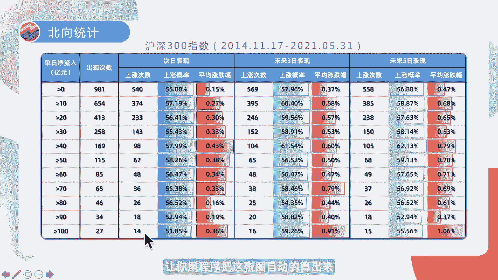

我们呢首先从寻找原始数据开始。

也就是我们基础的北向资金数据，我们刚刚说过，你可以直接去香港交易所官网去下载这个数据，当然它不可能整理好，让你直接下载，一般呢我们是要写Python的爬虫去抓这个数据，如果你是要抓这个数据的话。

我更建议你呢，可以从一些主流的财经网站上面抓这个数据，比如说东方财富网，新浪财经啊之类的，他们会帮你把这个北向资金数据啊，整理到表格里面，比如说你看这里每天的数据都有，然后你就可以直接去抓这个数据。

甚至你可以直接的复制粘贴整理起来很方便，它会比我们从香港交易所官网上面去抓，会好很多啊，然后这个数据啊，你下载下来之后呢，就是两个excel文件里面就是分别整理好的，沪股通和深股通。

每天的一个数据非常的干净啊，我们可以直接使用，里面就包含了我们需要的一个字段，当日成交净买额，也就是我们之前说的这个净流入，这样的话呢我们要做的这张表里面，这个单日净流入大于零，大于十的出现次数。

我们就可以得出来，对不对，那么我们接下来还要看我们沪深300指数，次日以及未来几天的表现，那么这样的话呢，我们就还需要沪深300指数的一个，每天的收盘价的数据，这样我们才能算出来未来涨跌幅吗。

这个数据下载下来呢是这样的一个文件，打开之后呢，他就是HOTM每天的一个开高收低的一个价格。

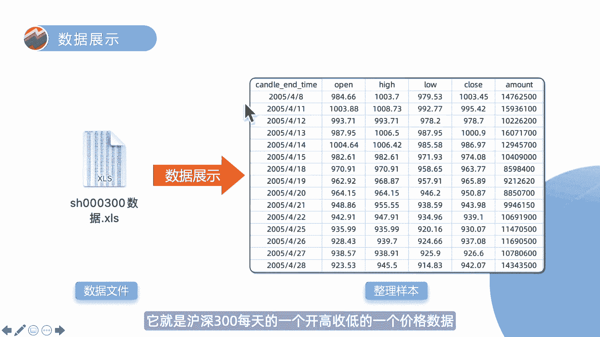

数据，从05年至今实时更新，如果你需要这个数据的话，可以加我抖音的群聊。

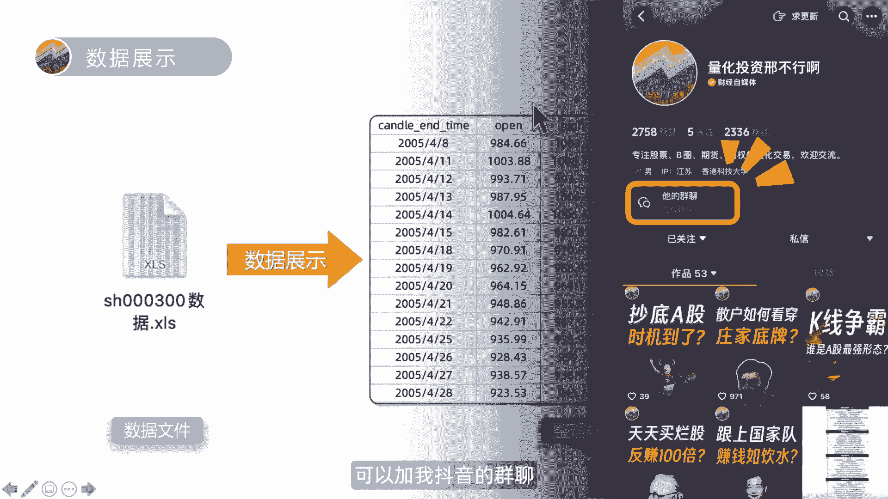

都是可以直接发给你的，好这样的话呢我们就整理好了，我们需要计算这张表的所有的数据，接下来我们就要讲如何去进行编程，计算出来这张表后面的内容会比较硬核啊，不感兴趣的同学呢可以发个弹幕。

然后离开了真正的勇士呢，可以继续来看代码逐行的讲解，以上呢就是我们刚刚讲的我们下载的数据，前面两个呢分别是沪股通及深股通的历史数据，然后这一个呢是沪深300的一个数据，他们数据的后缀啊是CSV格式。

这是我们常见的一个存储数据的一个方式，但这些数据我们都是可以使用excel打开的，那正式讲解编程处理这个数据之前呢，我们首先来演示一下，如何使用excel来处理这些数据，得到我们想要的结果。

那为什么要先使用excel来讲解呢，其实主要是为了给大家展示一下，我们处理这个数据的思路，其实我们编程最重要的并不是所谓的语法呀，什么之类的，而是你做整件事情的思路，思路理顺了，后面都是水到渠成的。

我们首先呢新建一个空的excel文件，当然我这边已经填了部分的东西了，我们可以来看这些数据是怎么填进去的，首先呢我们这里第一列和第二列，它分别是交易日期，以及我们沪深300的一个收盘价。

每一行呢就代表每天的一个数据，从14年11月17号开始，也就是北洋资金开始的那一天开始，那么这个数据呢，其实就来自于我们这个沪深300的一个行情的，数据我们把它打开。

其实就是把我们这个原始数据里面的第一列，也就代表日期以及这边的clothes，就代表收盘价，我们把它相应的把它复制到我们这个文件里面，就可以，所以简单复制粘贴就可以，但是呢这边要注意的是。

我们这边开始时间和我们这边的时间不一样，所以呢我们可能一开始手工呢，得把前面那些数据给删掉，删完之后呢，我们再复制就非常方便，复制完之后你改一下这边的列名就可以了，这样的话我们在这个新表里面。

就等得到了沪深300的收盘价数据，那我们接下来就要再把这个北向资金的数据，再复制进来，首先我们打开这个沪股通，你可以看到他也是每天就是一行的数据，这边的第一行的数据呢我们是不需要的，这个是个数据的说明。

我们直接删掉就可以，那我们需要的列是哪一列呢，我们需要的是这一列F列，也就是当日成交净买额这一列，我们需要把这一列的数据，和我们这一列日期的数据对应的，复制到我们这个新制作的表格当中来，我们复制之前呢。

首先需要对它进行排个序，方便按照日期进行排序，排完序之后呢，我们就直接复制就可以了，然后复制到这个C列，复制完之后呢，我们把这个列名啊，之后再加一个HH就代表上海，然后同样的原理呢。

我们可以把这个深股通的数据也复制过来，放到这里这一类，所以前面都是复制粘贴的事情啊，因为我们的深股东呢，他大约是从16年才开始，所以他前面数据都是零啊，因为一开始政策还没有开始。

他到这个16年12月5号才开始，有第一天的数据，我们是要看的是整体T北向资金的流入，所以呢我们把这个C列和D列加，也就是把绅士和护士加起来，得到了我们整体北向资金的流入数据，有了这个整体的数据之后呢。

我们前面两年就不需要了，我们把它隐藏，然后我们就要来看这个股市，它在次日以及未来3日，或者未来5日的一个表现，那其实就是看看未来几天的涨跌幅，那么就很简单，比如说我们第一天14年11月17号。

他策略表现是怎么算呢，我们直接excel等于他第二天的收盘价，减去他当天的收盘价，然后再除以当天的价格，就能得到次日的涨跌幅是跌了1%，那么未来三天相应的也很好计算，我们是用这一天的价格。

和我当天收盘价进行比较，再除以我当天收盘价，它是跌了1。17，同样的我们可以算出来，未来五天的表现是涨了3。2%，这样的话呢我们就算出了第一天的，未来123天的表现，我们直接下拉。

它就可以一直帮我们算出来，每一天的未来的135天的表现对吧，都已经算完了，这是excel的功能，这个大家应该都会的吧，然后有了这些数据准备之后呢。

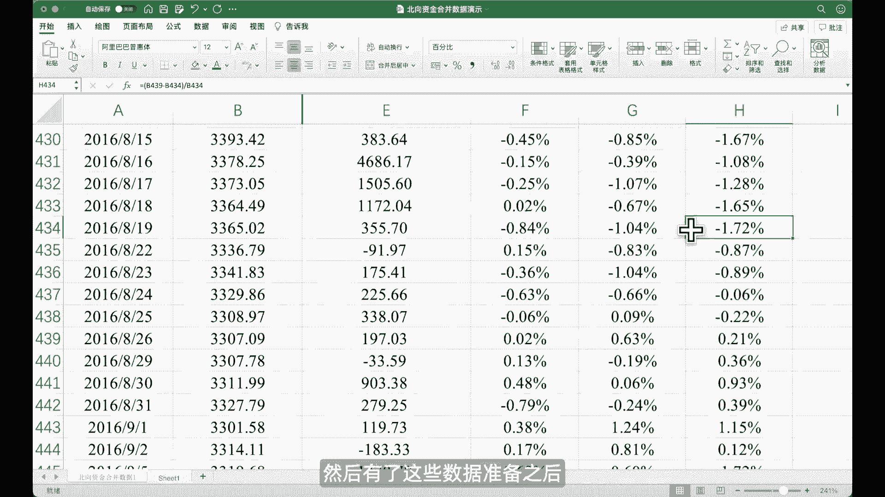

我们想要计算我们这边的值，其实就变得非常容易了，比如说我们想寻找片单日净流入，大于11的出现次数。

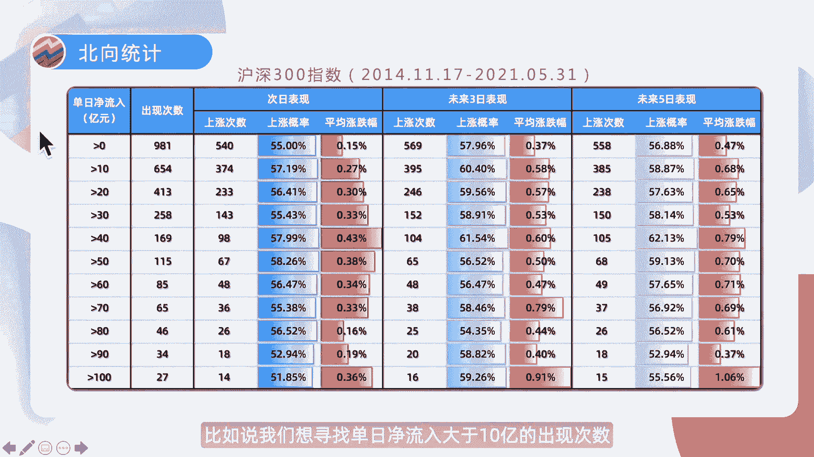

我们只要在这个数据里面进筛选，比如说我们针对这一行数据进行筛选，我们点击右上角的筛选，在这里选择一个大于10亿，然后因为我们这里面的数据，它的单位是百万啊，如果你要大于10亿的话呢，这边要选择1000。

也就乘以100倍，这样呢我们就选择出了大于11的天数，我们可以选中这一列，然后看右下角这边有个计数，这边计数显示总共有655个数字，扣掉第一行的这个标题，所以总共654个数字。

这个和我们这边的数据呢是吻合的上的，所以我们计算没有问题，这样要看次日表现当中的上涨的次数，这个374次怎么算出来，其实也很简单，就是进一步进行筛选，我们针对这个次日表现这一列。

我们同样选择选择大于零就可以，这边就只剩大于零的天数，我们再来看看总共有多少天，然后这边右下角进入显示总共374次，和我们这边数据完全对得上，这里的平均涨跌幅，0。27，计算也很简单啊。

我们只要把这边的筛选去掉，然后呢我们针对这一类求它的平均值是多少，好，这样的话呢，我们就计算完了，这个大于10亿出现的这些次数及次日的表现，我们可以把计算的结果呢按照这个表格的形式。

其实在新建一个excel文件记录在这边，就按照这个表格的格式，依次可以把大于20呀，30呀，以及未来3日以及未来5日的表现都计算出来，按照刚刚的方法，虽然烦了点，但肯定是可以计算的，说实话。

这个通过excel表格来计算这个数据其实并不麻烦，大家肯定也都会自己操作，那我这边为什么还要不厌其烦地去讲一遍呢，其实啊主要是给大家展示一下，我们计算这个数据的思路，你会很神奇的发现。

我们后面编程的这个思路，就和我们这边手工操作excel的思路，完全的一模一样，只不过我们这里呢是用手工来操作，后面就会替换成代码，那么我们接下来就来讲解代码部分。

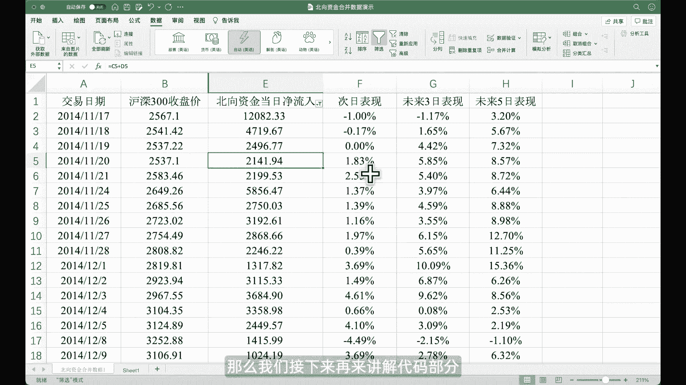

这里你放心啊，哪怕你没有任何的Python编程基础，我保证你都是可以完全看得懂的。

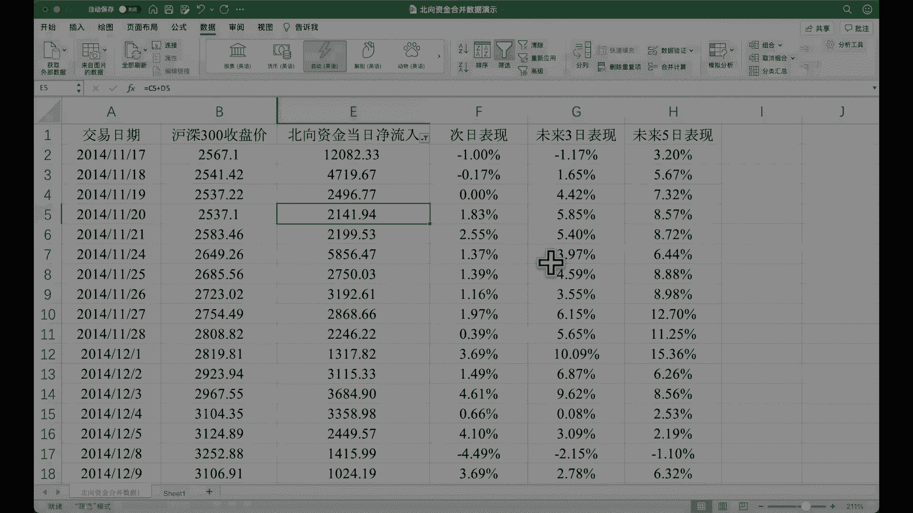

比如说有的同学会说我连Python都不会安装，那我这边给你准备好了，最详细的一个Python安装的教程，是我公众号上的一篇文章啊，我们打开我们安装的这个程序叫做anaconda，打开之后呢。

我们点击这里的spider，至于这个and的康纳。

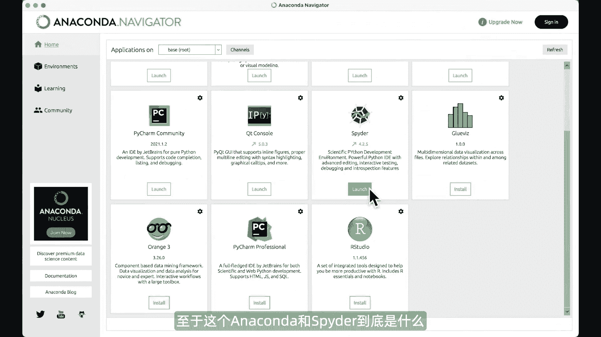

这个spider到底是什么，里面就不讲了，我们刚刚的文档里面都会有详细的解释，好我们打开spider之后呢，就是这样的一个页面，大家看到这个花花绿绿的，千万不要害怕，这其实就是我们写代码的一个页面。

你可以理解成你用来写文字的一个word软件，然后这个页面呢分成三块，左边这个部分呢是我们整个程序的目录，其实也就是一个文件夹，里面有相关的数据和我们的代码，中间这一块呢就是我们主体代码部分。

我们之后会逐行的详细的讲解，其实也没有多长啊，很多都是重复的，所以右边这部分呢是用来查看，我们到时候输出的结果的好，我们就来看逐行的代码讲解，首先前三行啊，我们是引入相关的一些第三方库。

和一些基本的设置，这个大家其实就不用管，我们刚学编程要讲究一点，叫做不求甚解，你不要刨根问底的去问每个东西到底是为什么，我们一开始的目的，只要把我们程序跑通，得到你想要的结果就可以了。

很多细节的东西你放一放到之后，你慢慢的回过头来看就能想通，然后呢我们再来看我们的第六行代码，这个其实是一行代码，只不过它比较长，这行代码的作用呢我这边写了个注释啊，第五行是注释。

就只是帮你理解这个程序的一个文字，它说明我们第六行代码的功能呢，是读取相关的数据，你看我们左边这个是沪深300，这是我们随便取的一个变量名称。

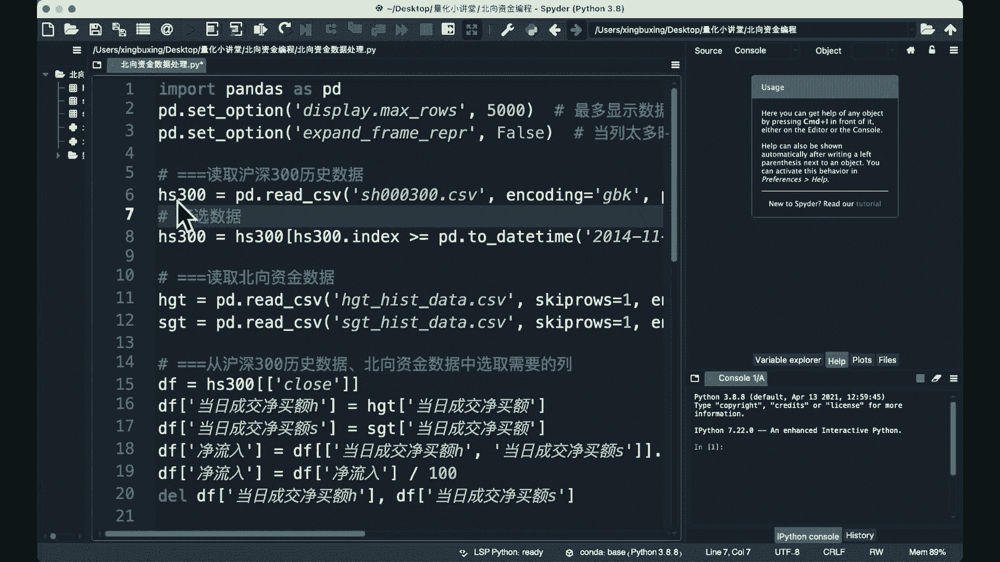

我们要读取的呢，其实就是我们这里面这个沪深300的这些数据，把这个原本在excel里面的数据读取到我们Python里面。

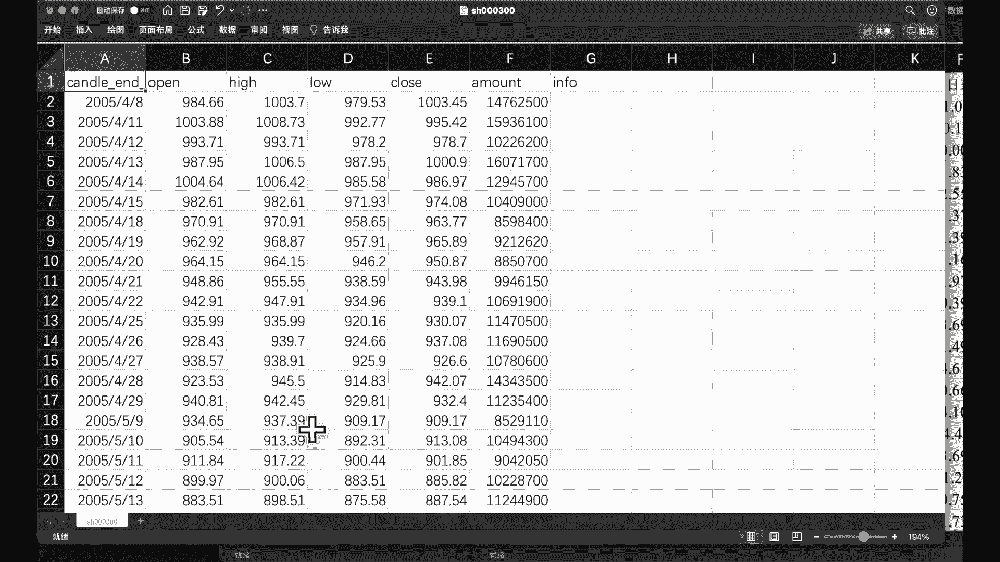

那么怎么读取呢，其实只要一行代码就是使用read csv这个函数，这个函数呢是我们刚刚import pandas这个库，它自带的一个函数，你看read csv其实就是读取CSV文件。

你可以把它理解成一个命令，它和自然语言其实非常接近啊，然后呢我们要给这个命令一些参数，比如说你到底读取哪个文件，那么我们就告诉他，我们要读取的文件的文件名是这一个，然后呢我们还要读取文件的一个中文编码。

因为如果你的文件里面涉及到中文字符，一定要注意处理它的中文编码，有的时候不然会乱码，我们这个中文编码是JBK，然后还有另外两个参数，我这边先不讲，我们把这个程序运行的结果，大家看一下，然后再回过头来讲。

其实运行程序的话呢，点击这上面的这个三角形就可以整体运行，你看我们点击之后，整个右下角是有所变化的，那么为了让我们的运行结果更加的清晰啊，我把这段代码给复制出来，然后新建一个专门的文件。

我只放上这一段代码，然后呢我只运行这一部分，那么我们点击运行好，运行完之后呢，他在这里面是有运行结果的输出，我们可以点击这里这个按钮，它这边呢就有一个沪深300，我们双击这个变量。

你就可以看到这边出来的一个数据。

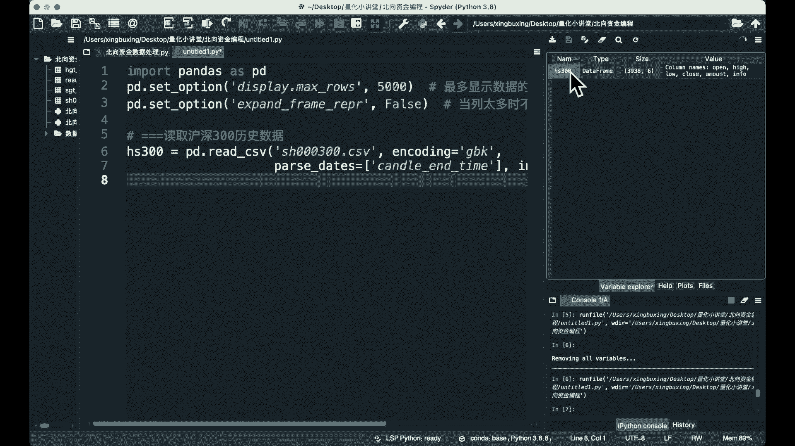

这个数据呢其实就是我们excel里面的数据，跟这里的数据是一样的。

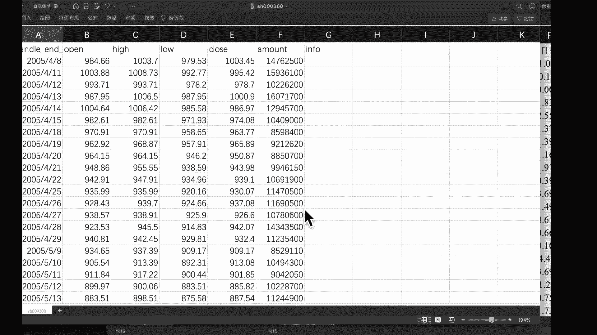

所以呢通过这一行代码，我们就把这个excel里面的数据导入到了，我们Python里面。

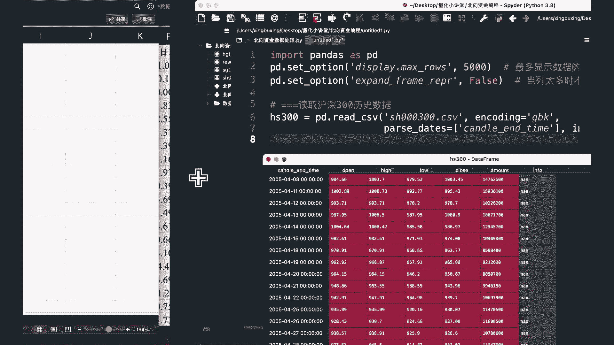

然后呢我们还有没有讲的两个参数，分别是这里面的pass day，Pass data，它的含义是什么呢。

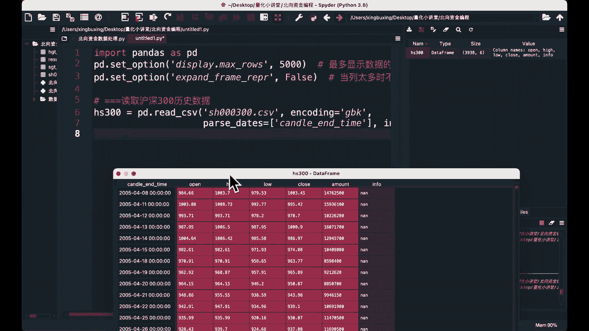

其实就是把我们的这一列名称kindle and time，因为它指的是我们这里面的交易的日期。

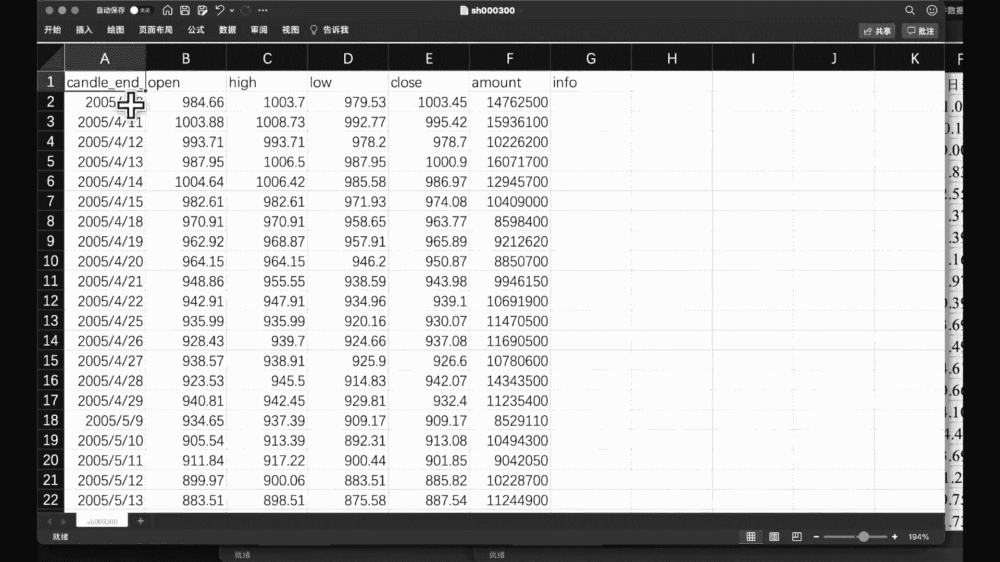

对不对，那么加上这个参数的含义，就是让我们的这一列数据，它变成我们日期型的一个数据，不然它有可能是我们编程里面的概念，一个叫做字符串的类型的数据，当然这个不重要啊，你这不理解什么是日期，什么是字符串。

没有关系，不影响我们整个程序的理解，然后下面这样一个参数，Index column，它指定为我们这一列，这个是比较重要的，这个是什么含义呢，大家看我们导入的数据是一张表格，对不对，表格最重要的是什么。

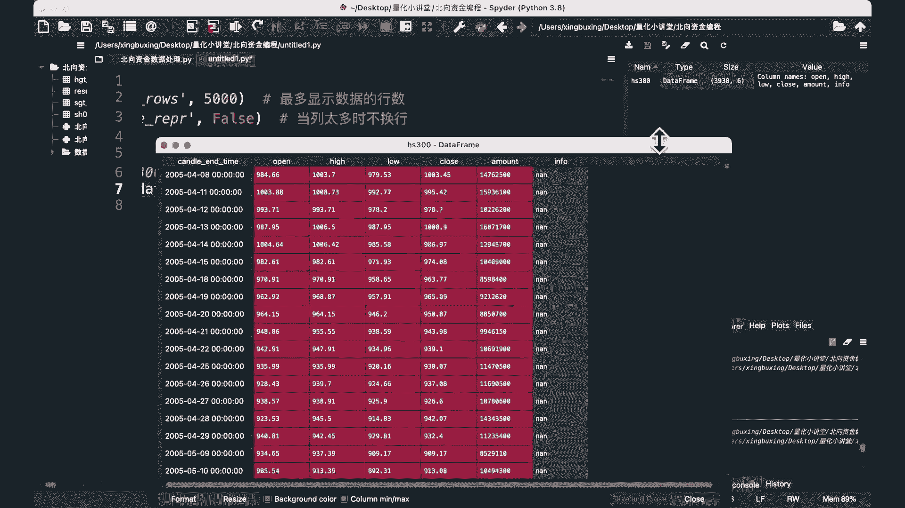

就是它每列的名称，那每列的名称其实很简单，就是我们这里面每一列的名称。

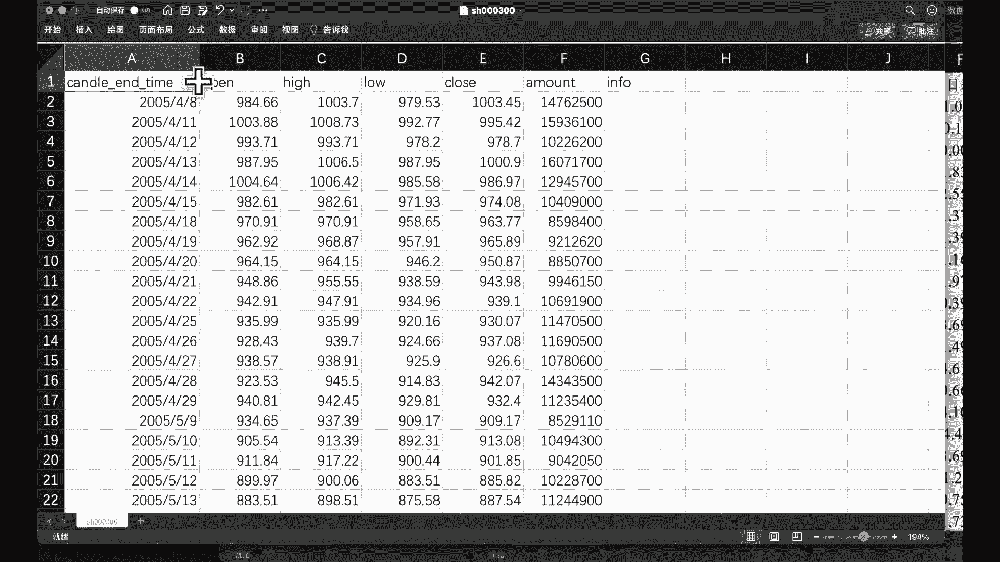

open high low clothes之类的，我们这边也是这样的，那么除了每一列的名称之外，还有重要的就是每一行的名称，我们呢这里面就把我们的这个kindle and time这一类。

也就是日期这一列设置为每一行的名称，所以呢之后我就可以通过每一行的名称，比如说这个2005年4月19号，以及我们这一列的名称，比如说是漏，这样的话呢，我们就可以定位到其中的任意一个数据。

通过列名和行名来定位，所以这就是我们这个参数的作用，它把我们的日期这一列设置为行的名称，我们之后可以用这个名称来定位相关的数据，这样的话呢我们就通过一行代码，真的是一行代码导入了我们的数据。

我们继续回到我们这边来看，导入数据完之后呢，大家想一想，我们之前excel操作的时候。

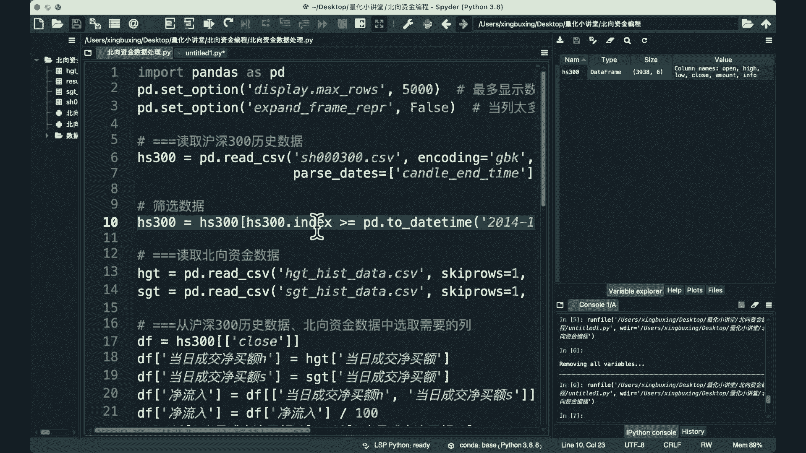

我们下一步是做什么，我们下一步其实是把这里面，05年到14年的数据都删掉，对不对，我们在excel里面可以直接这样就删除，那么我们在我们的Python里面是怎么操作呢。

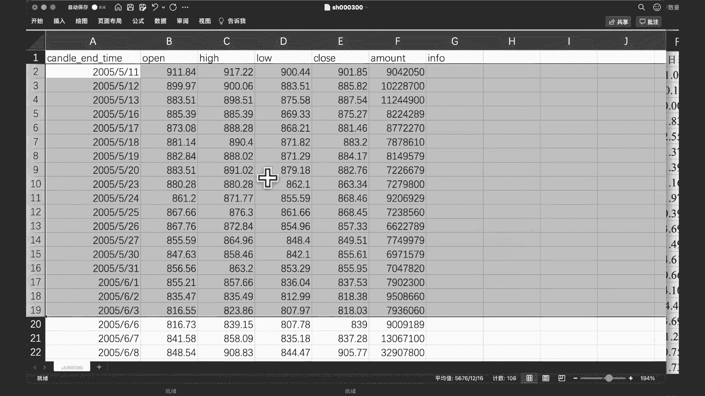

其实也很简单，也是一行代码的事情，就是我们这里面的第九行代码，它呢就是使用我们的日期做了一个筛选，你看我们这里有个筛选条件，这个条件呢其实就是让我们的沪深300的index，也就是他的行的名称。

因为我们刚刚已经把日期设置为INDE，就在这里面，只要我们行的名称代表的那一行，它的日期呢比我们这一个，2014年11月17号要大对吧，这边是大于等于，所以这就是一个条件。

我们把这个条件呢放到我们这边的这个，中括号里面来，这样的话呢我们就完成了这个筛选的动作，我们可以来看一下我们输出的结果，我们把这段代码复制到这边来，然后呢再重新点击运行，运行完之后。

我们再来看我们这个沪深300的这个变量，双击打开，你看我们这个数据，它开始的时间，就是从14年11月17号开始的，前面的数据都被我删掉了对吧，所以到现在大家有感觉，我们写代码其实就是用代码来实现。

我们刚刚手工的针对这个excel进行的操作，只不过你是用代码来自动的完成对吧，那我们继续往下看，刚刚的我们读取了这个沪深300买的一个数据，接下来呢我们要读取我们北向资金的一个数据。

也就是我们这边的十三十四行代码，也就是我们这里面的这一个北向资金的数据，分别是沪股通以及深股通的一个数据，那么同样的，我们也是使用我们这里面的这个read csv，这个方法去读取。

只不过呢我们这边读取的文件名，名称要改成这个沪股通以及深股通的名称，读取之后的变量呢，我分别放到这个HGT以及SGT里面，它分别是沪股通和深股通，然后后面的参数呢其实都是一样的，跟刚刚讲解的唯一的话呢。

我们就是多了一个参数，是这一个叫做skip rose等于一，这个是什么含义呢，你看我们这个数据里面，第一行是不是有个数据说明，这个数据说明是我们不需要的，我们在处理的时候也会把它直接删掉，对不对。

那么我们这个skip ro，其实就是跳过第一行的意思嘛，我们这边等于一就是把第一行直接跳过，当然我这边也可以等于二等三都可以自己设置，但因为我们这个场景下只有一行的多余的数据，所以我们这边就是一。

然后我们把这两行代码呢也复制过来，我们来运行一下，看一下，结果好，你看这边就多了，这个沪股通和深股通的这两个变量对吧，我们可以打开其中的一个看一下。

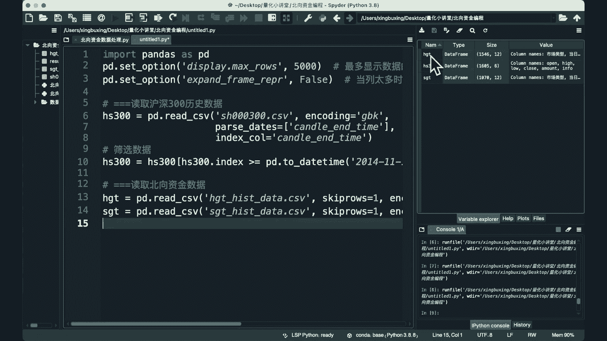

比如说沪股通啊，你看这个就是我们沪股通的一个数据，他完全的就把我们这个excel的东西，完全的给搬了过来，是一模一样的，然后我们继续往下看，我们上面呢已经把所有我们需要的数据。

都读入了我们的Python了，对不对，接下来我们就是要进行数据的处理，数据处理，其实就是我们我们这里面的第三张表格，就是这个我们自己新建的这个表格，对不对，所以大家现在能够理解。

为什么我一开始要用excel来操作一遍了，就是完全帮你理顺思路，我们之后编程的思路，就跟我们excel操作的思路是一样的，那么在这张表格里面，我们刚刚首先是把这个沪深300的数据，给复制过来。

就是把这里的数据复制到这边来，对不对，那么这个复制操作在我们Python里面是怎么操作呢。

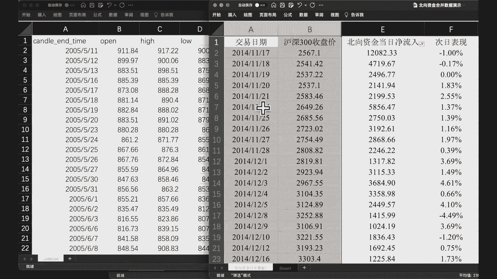

我们来看代码其实很简单，我们首先来看第16行代码，我们想把这里面的这个close这一列，复制到我们刚刚的这个表格当中来，那么其实就是只要通过这一行代码就可以。

我们把货源代码这个变量里面的这个close这一列，复制到新的表格DF里面来，这个DF，你就可以理解成我们这个新的一个表格啊，它是随便取的一个名字，你可以是DF，你也可以是比如说是你的名字行不行。

我们这边呢就约定俗成的使用DF来，然后呢我们可以来看一下它运行的一个效果，我们把它复制过来，然后呢点击运行，运行完之后呢，你就可以看到我们这边多了一个DF的变量，然后我们这些代码和数据啊。

你都可以加屏幕右下角或者置顶评论区，我的微信你是可以问我要的，我强烈建议你不要只看我在这边运行，你自己亲自去试底下，这个感受是完全不一样的啊，我们打开这个DF，你可以看到他这边就是一个excel表。

里面已经有我们的这个clothes，和我们这个kindle end time了，对不对，其实就是完全把这张表的东西复制了过来，所以非常简单啊，一行代码就可以，然后呢，我们接下来就是要复制这个。

北向资金的相关的数据过来，对不对，那么我们怎么复制呢，我们来看代码，我们要把我们的沪股通里面的这一列，当日成交净买额，以及深股通的当日成交净买额，相关的数据复制到我这个DF里面来，对不对。

那么我只要这么操作就可以了，我们取出我们沪股通里面的这一列数据，然后呢把它复制到我们DF的这列数据里面，这列数据呢我们重新取个名字，叫做当日成交净买额，后面加一个H，相应的呢这个是加个F。

所以呢也就是这两行代码，就可以把我们相应的数据，也就是我们这一张excel表格里面的这一列数据，把它复制到我们这个需要的目标的，excel表格里面来，我们可以来看一下运行的结果，然后我们点击运行。

运行完之后，我们就打开这个DF对吧，你看到这里面就新增了两列数据，这两列数据就是我们需要的两列数据，对不对，所以他就完全的复制了过来，并且呢也是从2017年11月17号开始。

然后如果这段时间深股通是没有数据，那就直接是空值对吧，这里面是NNA这个是not a number的意思就是空值，这个如果你之后接触编程的话，经常遇到这个概念啊，好我们继续来看代码。

我们刚刚已经有了这个当日成交净买额，AH及净买额S分别是沪股通和深股通的，对不对，但我们需要的是两者之和对吧，那么我们怎么把这两列数据把它给加起来呢，也就是这两列数据把它左右的给加起来。

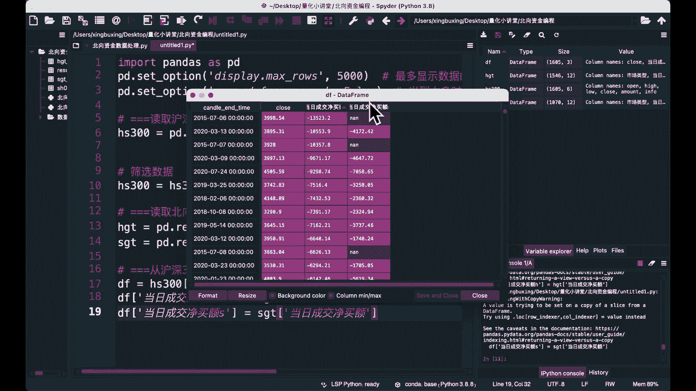

形成一个第三列呢，也就是我们excel里面这一列数据对吧，这一列数据呢它是拿这两列数据相加，得到这个第三列数据，我们在excel里面大家都知道怎么操作。

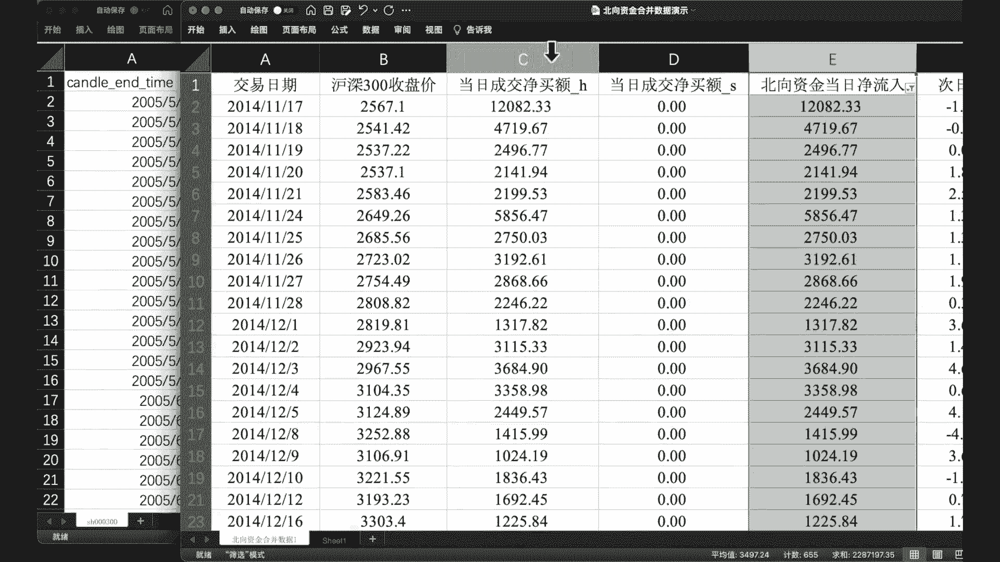

那么在Python里面是怎么操作呢，它就是这样子，也就是我们的第19行代码，我首先呢把这两列数据给找出来，找出来之后呢，我们后面加一个点点，就是说明后面我要执行一些相应的函数了。

你就可以认为理解相应的动作和命令，然后这个动作呢就是some也就是相加的意思嘛，我就把这两列数据相加，然后相加完之后的结果呢，我复制到我这个DF里面新的一列，这个列名呢就叫做净流入。

我们可以把这一列代码复制到这边来运行一下，看一下结果，你看我们这个真的是逐行的讲解，非常非常的细致，这个大家哪怕没有任何基础，我觉得应该都是可以看得懂的，如果这个都看不懂的话。

我觉得就证明你跟编程没有缘分啊，能看懂吗，可以在弹幕里面刷一波啊，好你看这个就是我们运行的一个结果，净流入，你可以看这行的数据，其实就是前面两行数据的一个相加，你可以自己去验证一下。

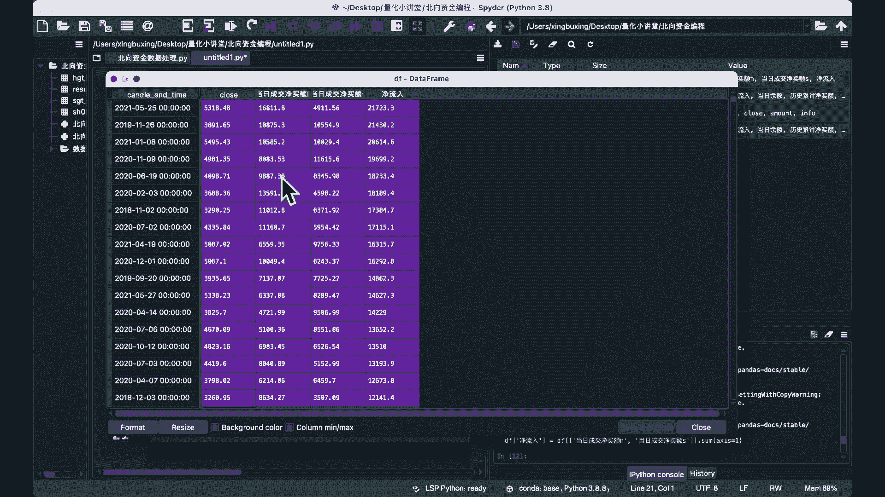

我们接下来刚刚说过啊，我们这边的净流入这个数据，它的单位其实是百万对吧，但是我们最终比较的是零一啊，10亿啊之类的，所以呢我希望把它单位变成E。

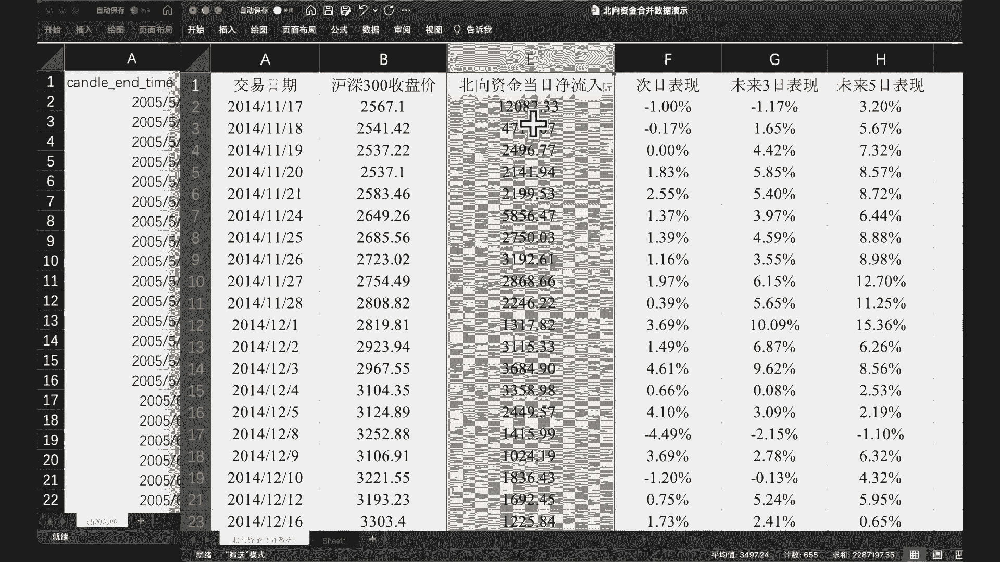

那么想把单位变成E的话呢，我们要做的事情很简单，就是把我们这一列数据整体除以100。

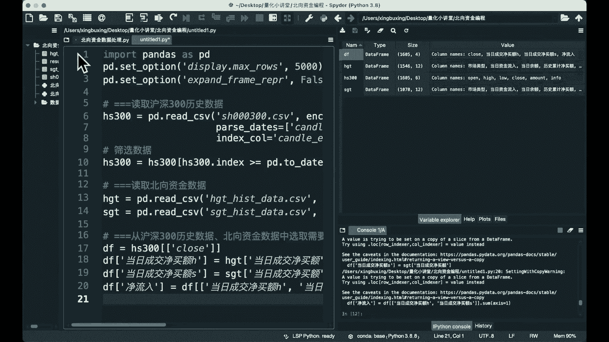

而除以100之后，这边呢显示的就是比如说是27亿啊，31亿这样的一个数据，方便我们之后筛选，那么我怎么把这列数据整体除以100呢。

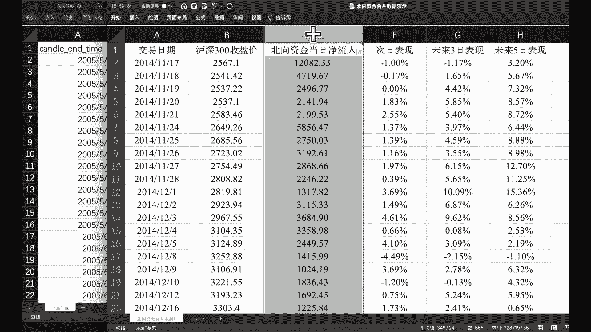

在excel里面大家肯定会算，那么在Python里面怎么操作，其实也非常非常的简单啊，就是我们这边的第十二十行代码，我把这个净流入数据直接整体除以100，这样子就可以了，然后除以的结果呢。

我再赋值到我这个净流入这一列里面去，这边我就不演示相应的结果了。

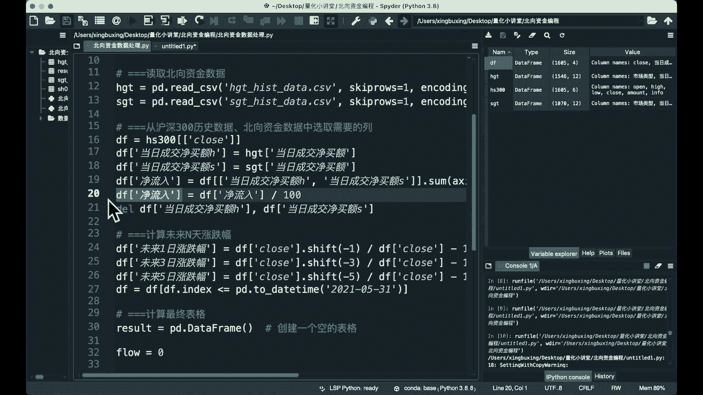

然后大家你看到现在你可能有所感觉啊，我们这个其实就是对我们这个excel进行整列。

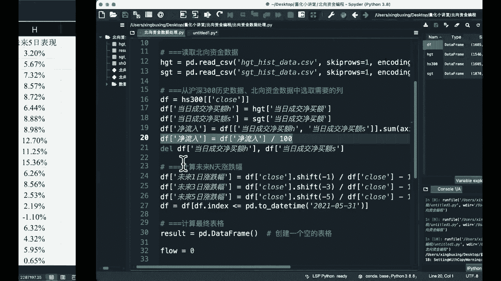

整列的操作，其实非常方便啊，然后呢我们刚刚也看到了，当我们算完这个净流入这个数据之后，我们前前面的这个两个的深股通，以及沪股通的这个数据，单独的数据我就不需要了，对不对。

因为我后面我只需要基于这一列进行计算，那么我就想把这两列删掉，在excel里面删掉，很简单，我这边直接删除就可以，对不对，在Python里面删除的话也非常简单啊。

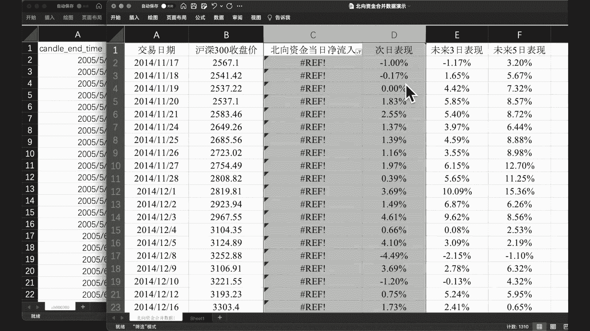

我直接用这个21行的代码叫做DEL，DEL就是delete嘛，删除的意思，我把这两列的列名给放在这边，他就可以把这两列数据给删掉，我们接下来呢可以看一下它运行的一个结果，我们复制过来在最下面啊。

然后呢我们点击运行啊，你可以看我们这个DF现在长什么样子对吧，你看现在只有净流入这一列，并且这一列是除以了100的，这边的120就是120亿的意思，然后呢，我们已经把前面两列的。

深股通以及沪股通的数据都删掉了，这样的话呢我们就做好呃基础的数据处理，因为有了刚刚的这个数据之后，我们需要计算，我们表格的所有的数据都已经准备好了，我们接下来呢就可以进行相应的计算，我们首先计算什么呢。

我们首先计算的就是未来N天的一个涨跌幅。

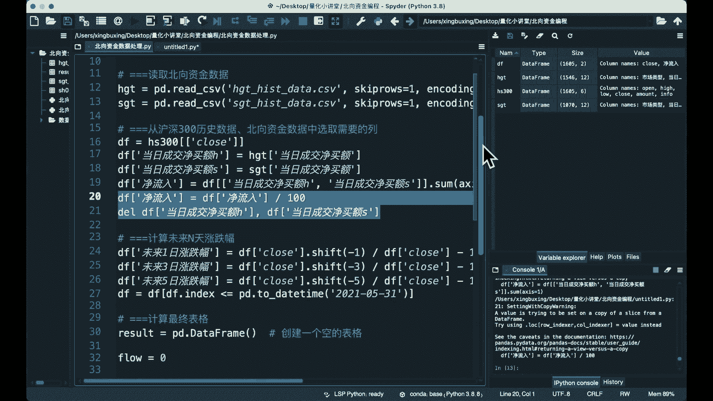

大家还记得我们excel里面是如何计算，这边的次日表现以及未来35日的表现了吗，其实就是拿下一行的数据。

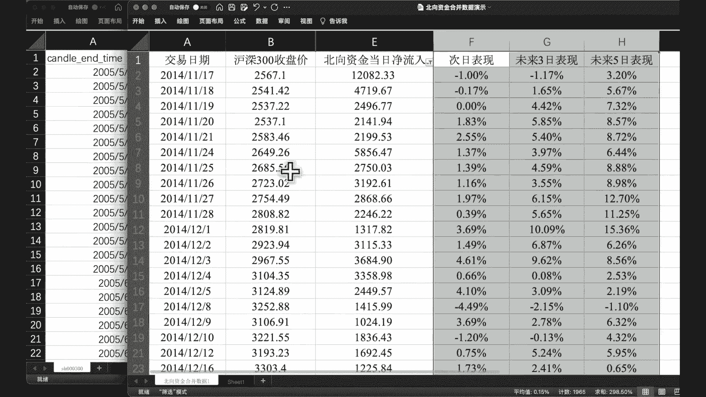

和我们这一行的这个收盘价值进行比较对吧，那我们Python里面其实也是这么做啊，比如说我这边要计算我未来一天的一个涨跌幅，对吧，我们首先在这边新建一列啊，在我们DF里面新建一列未来一天涨跌幅。

然后他等于什么呢，它等于的是我们未来一天的这个收盘价，未来一天的收盘价就是我们这个close这一列。

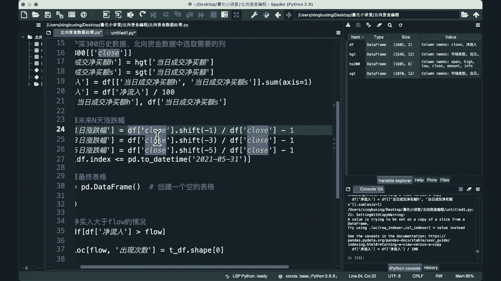

对不对，那么未来一天是什么意思，我们这边用shift-1来代替一的话呢，就是往下偏移一行。

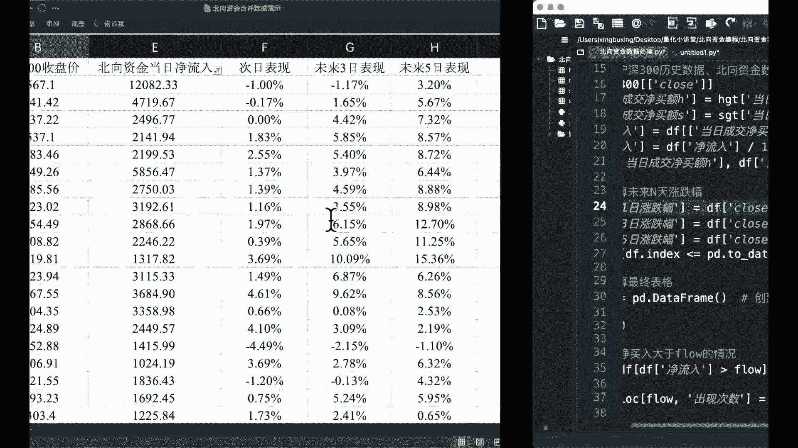

那么往下偏移一行其实就是未来一天的含义，对不对，我们把往下偏移一行的这个close，和我们的当天的clothes进行比较，比较完之后再减去一，就能得到我未来一天的一个涨跌幅，同理啊。

我如果未来三天和未来五天的一个涨跌幅，对不对，那么这边其他部分都是一样的，只有我这边未来这个是三天和五天，它分别代表未来三天的一个数据。

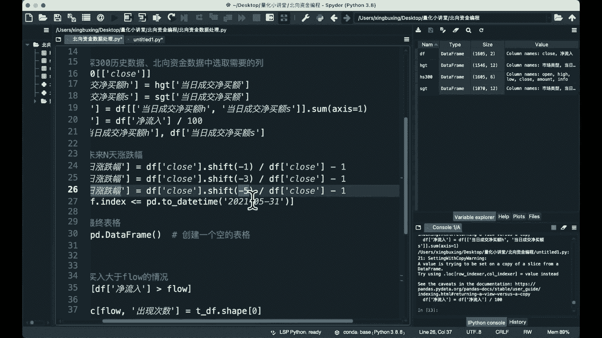

也就是这一天的数据，这个253G就是未来三天的数据。

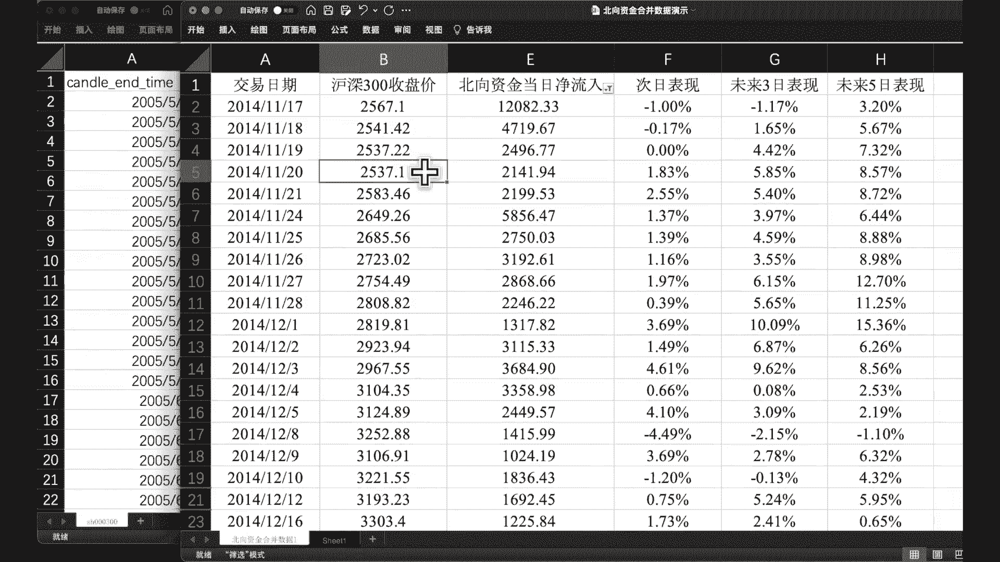

和相比于我这一天的数据对吧，以及我未来五天的一个数据，和我今天的数据进行比较，然后再减去一，大家可能看这个代码不够值，直观啊，我可以给大家展示一下它运行的一个结果，你看到这个结果之后。

你就能够反推知道这个代码到底是什么含义了，好我们来点击运行，我们来打开我们这里的DF运行完的结果好，你可以看到我们这边未来一天，三天五天的涨跌幅对吧，这里的涨跌幅你可以去对比一下。

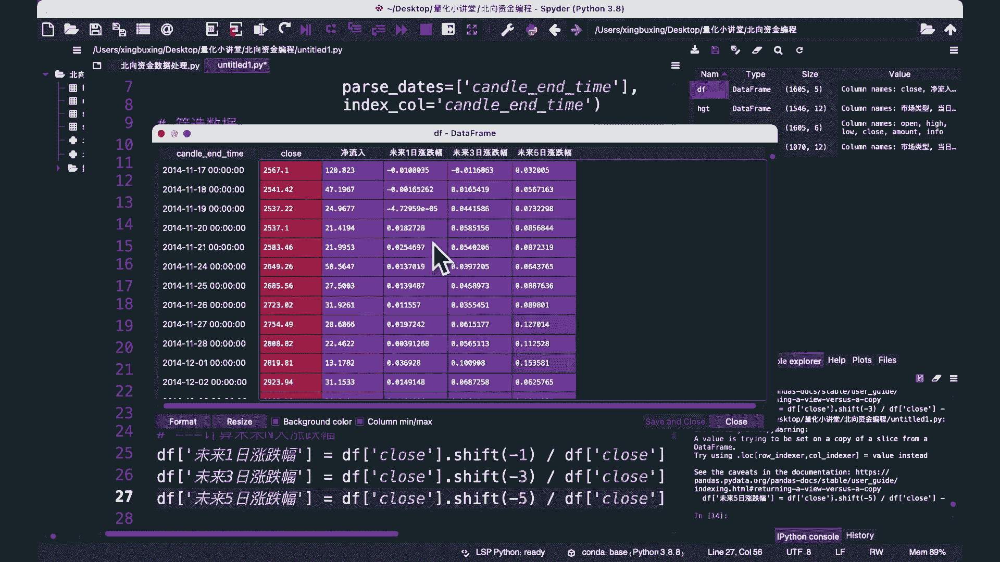

和我们这边的这个涨跌幅是完全的一模一样的，我们这边是怎么计算出来这个涨跌幅。

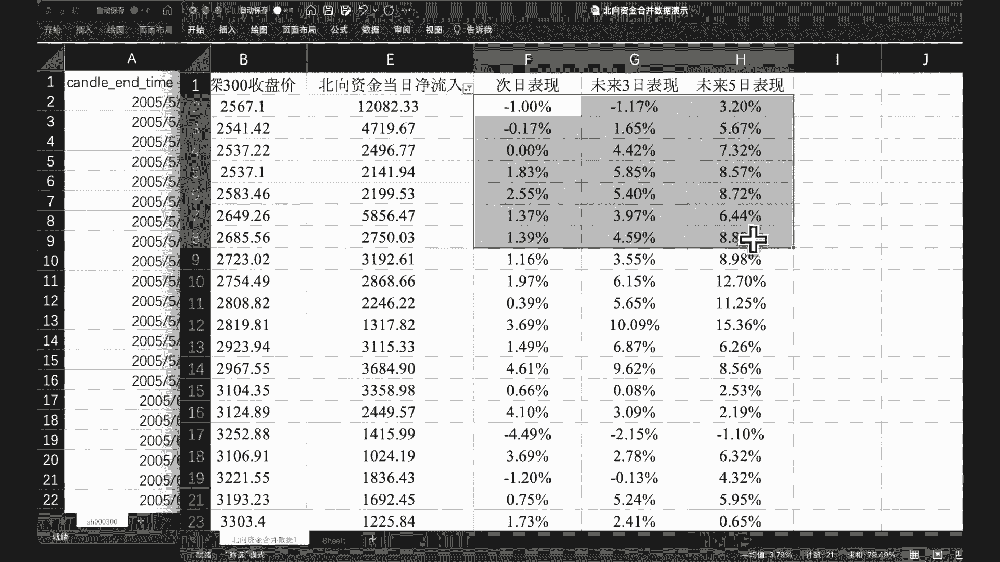

这边就是怎么计算的，只不过这边不是用百分比来结尾啊，它是小数结尾，这就是我们需要的一个结果啊，然后呢我们看最原始的代码，我们这边呢还使用了我们之前同样的一个方法，我们对这个数据的日期进行了筛选。

我们这边呢是小雨21年的5月31号，因为我们计算的最终那张表格，它里面的数据只到5月31号。

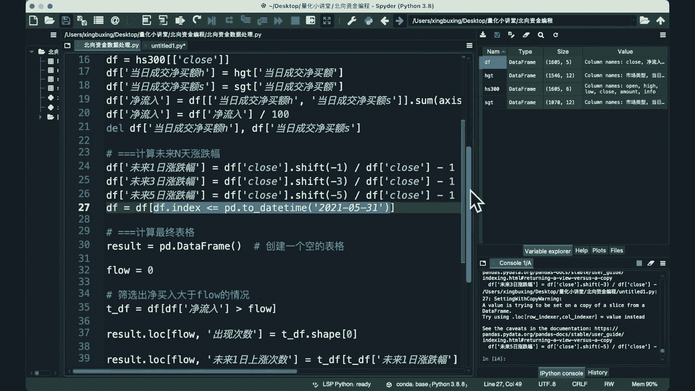

但是我们这个excel的数据呢，它大概是到了7月份左右，看这里是7月份左右啊，所以我们要把多余的数据给删掉啊，直到5月31号就可以计算好涨跌幅之后呢，我们接下来就要计算我们最终的一个表格。

最终的表格就是我们这一张表格，我们接下来就要计算这张表格了，我们首先呢从单位净流入大于0亿开始啊。

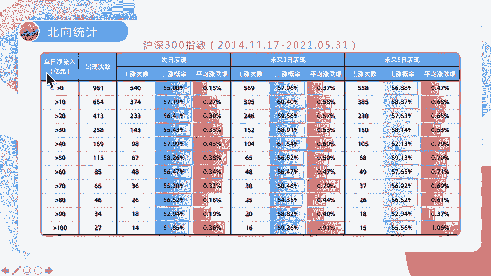

首先呢我们就在代码里面，我们要声明创建一个空的表格，创建空的表格怎么创建呢，用这行代码就可以创建，我们这里面输入这个data frame，就可以创建一个空的表格，在Python里面。

data frame其实就是可以理解为表格的意思，然后呢我们把这个表格命名为result，这个就是随便命名的一个东西哈，我们把它命名为结果，你也可以命名成，比如说你的名字什么都可以啊。

或者就简单的比如说命名成一个A对吧，都是可以的，我们可以来看一下这个空的表格，它长什么样子啊，我们在这边点击运行，然后运行完之后，你看这边就多出来这个result这个变量，你看这个打开。

它就是一个完全是一个空的一个表格，里面什么数据都没有对吧，好然后呢，因为我们是针对大于零的数据进行处理，然后我们这边就命名一个变量flow，它等于零对吧，流入就是等于零。

那我们接下来就是筛选出我们这个表格里面。

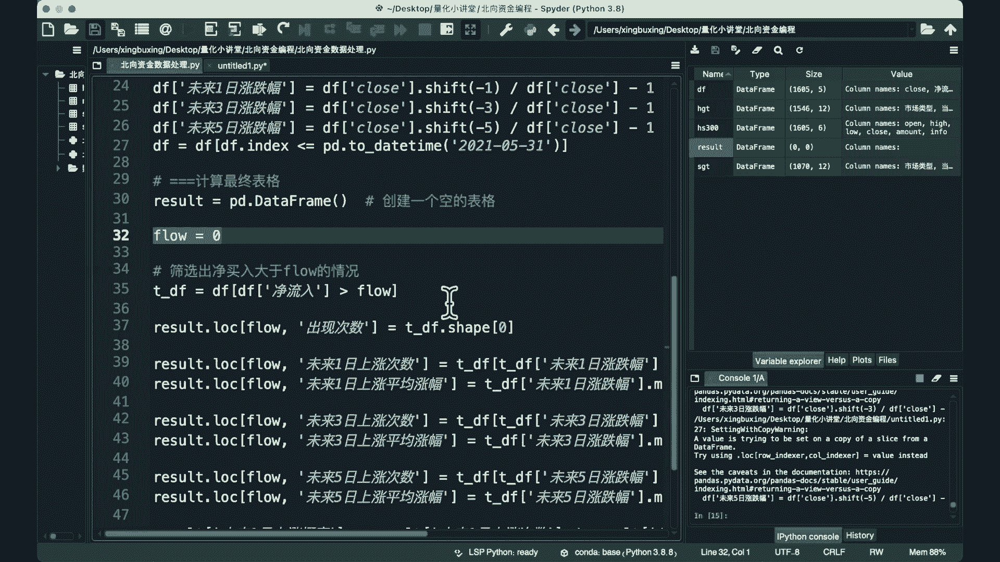

大于零的行数，就像我们在我们的这个excel表格里面，我们首先做的是对这个数据进行筛选，对不对，我们对这一列数据进行筛选，筛选出大于零的一个数据对吧。

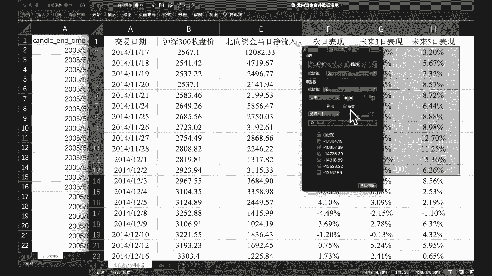

大家是否还记得，那么我们这里面也是进行相应的筛选对吧，筛选就很方便，我们只要把我们这个筛选的条件，放到我们这个刚刚这个中括号里面来，那么条件就是我们这个净流入也大于，我们这个flow flow等于零。

对不对，我们把这个条件放进去，然后筛选的结果呢放到一个新的表格里面来，叫做TDF，这是新的一个表格啊，然后我们可以来看下新的表格的一个情况，我们把它复制过来运行，实际写代码我们并不会这么傻的。

新建一个文件，把它一行一行过来运行啊，这边只是给大家演示的方便而已，我们点击这个运行，然后呢，他这边就出现了这一个TDF这个变量对吧，我们打开来可以看一下这个表格里面的。

就只有这个净流入大于零的那些行数，其他行数都已经不存在了，就相当于我们这个表格里面进行了相应的筛选，我们全是大于零的，然后呢出来之后，我们首先要计算它的出现的一个次数对吧，就是这边980一次。

那么出现的次数怎么算呢，其实很简单，这个出现次数，其实就是我们这个TDF这一个表格，它的一个行数，对不对，那么我怎么看这个TDF它表格的行数呢，它有多少行以及多少列。

我们直接使用我们这边的命令叫做shape，就是它的形状，它返回的就是他的行数和列数，如果我取零的话，就是它的行数，我取一的话呢，就是它的列数，那么因为我这边是需要它的行数，所以我这边呢就是取零。

我们可以把这一行代码放到这边来运行一下，看一下结果，还有同学会问我们这边的result点lock，这个是什么含义啊，大家是否还记得我们刚刚一开始的时候说过。

我们每一个比如说我们这里的data frame，这个的表格，它都有列名以及行名，对不对，我们可以通过一个指定的列名以及行名，来定位到某一个数据，那么这个lock就是我们去定位列名和行名的，这个lock。

它的全称应该就是location的意思，定位的意思，那么我们的行名就是我们这边的flow就是零，我们的列名呢就叫做出现次数，然后它的结果呢就是我们这边的相应的一个，shape的结果。

我们可以直接看运行的结果，好运行完之后我们点击这个result对吧，你就可以看我们这边出现了这个998次，然后呢他的行名是零，它的列名呢是出现次数对吧，那么很简单，如果我这边希望是进行十，是进行筛选啊。

不是进行大于零进行筛选，那么我就要把这边的flow从零改成十，我再重新运行一下，然后你就可以看到我们这边result相应的结果，这边就是十，出现的次数也变成了现在的列日零次，然后这样的话呢我们就算好了。

这个出现的次数出现次数之后呢，我们要算的是在出现这么多次之后，我未来一天的一个涨跌幅，那未来一天的一个涨跌幅，我们其实提前已经算好了，在这里面有未来一天的涨跌幅，那么我们要算它的一个涨跌的次数。

也就是上涨的次数，那么我们只要对我们这个，未来一天的涨跌幅进行筛选，我把它大于零的部分挑出来，挑出来之后呢，我再去看它到底有多少行，也就通过我们这个SHAP0的方法去看它多少行。

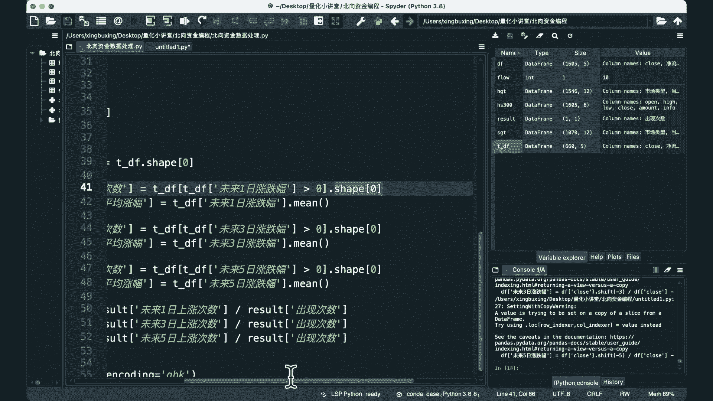

其实操作和我们前面这个出现次数是一样的，其实就是对我们这个excel表格这边进行筛选，也就是次日表现这一部分进行筛选对吧，把他这个大于零的给调研出来，然后我再看一下这个表格有多少行。

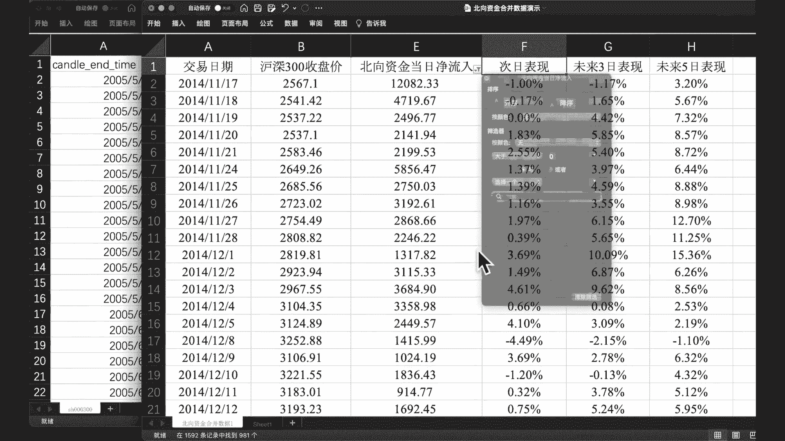

把相应的结果放到我们这个result，对应的这个是零行，未来一日上涨次数这一列里面去，然后同样的方法呢，我们可以计算出未来一日的上涨的平均涨幅。

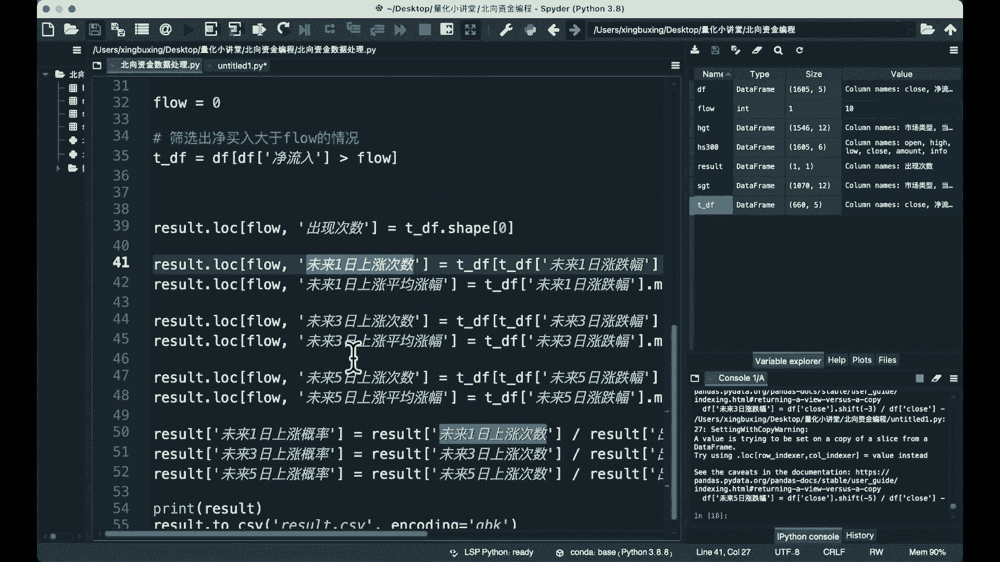

平均涨幅的话呢，其实也就是把我们这边这个筛选出来的结果啊，这边所有的这个涨跌幅包含正的负的涨跌幅，算他的一个平均值。

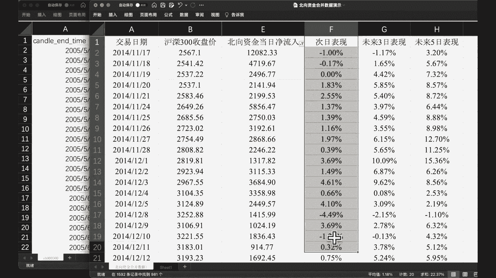

对不对，算这一整列的平均值，那么这个在我们Python里面，也是通过一行代码就可以实现线，我们首先把我们要计算的这一整列找出来，找出来之后呢，使用后面这个点me的方法就可以计算，大家都知道。

我们这个me的方法，其实就是计算平均数的一个意思，我们这边就可以来看一下我们这几行代码，它们相应的一个运行的结果，我们把它复制过来，然后呢点击运行，运行完之后呢。

你只要看我们这个result文件就可以对吧，你可以看到我们这边index是十，以及我们相应的这边的未来一日的上涨次数，以及未来一日的平均涨跌幅，当然我如果把这边的这个flow再改成零的话。

这边就展示的是大于零一的那些天数，它的相应的一个数据，那么我们这边是计算完了未来一天的，同样的，如果我想计算未来三天的，以及未来五天的相关的数据，我只要把代码相关做相应的复制。

跟这边两行代码其实是差不多的，只不过呢我这边原来，但是未来一天我这边都改成了未来三天后天，对不对，这就是完全的是前面代码的一个复制，我们可以把它复制过来，看一下相应的一个结果，这边已经复制过来了。

然后我们点击运行，然后你看我们这个result里面你看就多了很多的列，对不对，他的行数虽然还是只有一行啊，我们之后可以计算其他行的数据，算完这个之后呢，我们接下来可能还需要计算什么呢。

我们还需要计算未来一天的这个上涨概率，这个其实很好计算，我们只要拿未来一天的上涨次数，我们之前已经计算好了，再除以我们这边的出现次数，也就是拿我们这里面，比如说未来一天的上涨次数，对不对。

这一列的数据除以我们这一列的数据出现次数，这一列的数据，他会把这两列数据里面的每行数据，分别一一对应的相除对吧，然后呢我们分别计算一天，三天和五天的数据就可以，我们可以把代码复制过来看一下，结果好。

我们点击运行，运行之后，你再把这个result点开来看一下啊，你可以看到这边就多了很多的列。

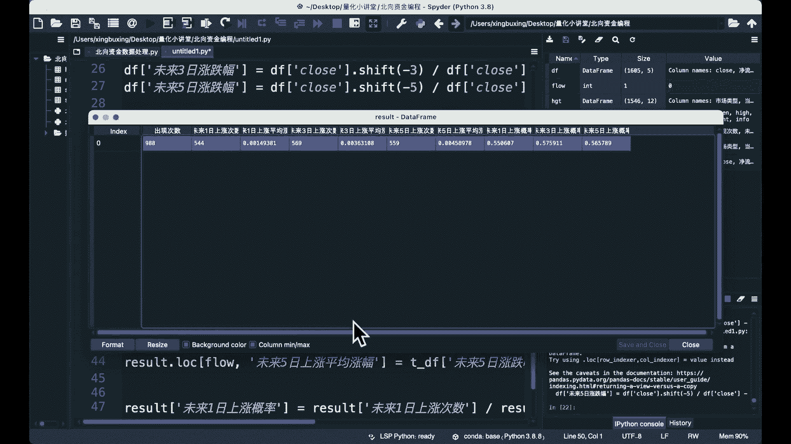

上涨概率就出现了，这样的话呢，你看我们其实就计算完这张表格里面的，第一行就已经计算完了，对不对，那么接下来要计算大于十，是大于20，大于30，就理论上呢。

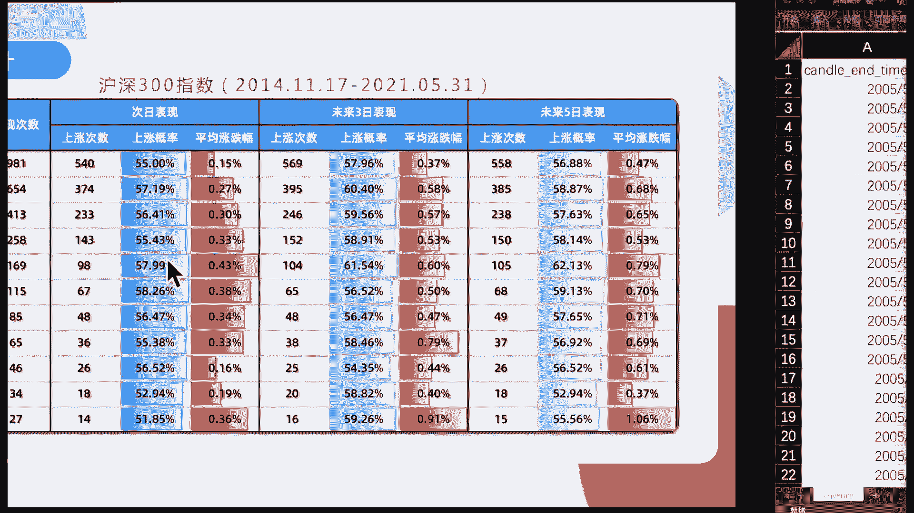

我们只需要把我们这边的flow改成十，改成20，改成30就可以计算相应的结果，对不对，那么我希望他们所有的结果都能够，在一张表格里面出现的话呢，比较傻瓜的操作是我把这段代码完全的复制。

我这边一开始呢flow是零，然后第二段代码我这边flow改成十对吧，我让代码这段完全的去重复的运行，这边flow改成20，然后呢我再改成30对吧，然后再改成40，这边我就不去做了啊。

我们可以直接来看它那个运行的一个结果，你看这边就出现了0123相应的结果，那么我们复制其他的代码，就可以得到相应的行数的结果啊，当然啊其实这样的操作呢是比较傻的，我们真实的情况下呢不会这么操作啊。

我们会去写一个循环来实现这个操作，然后关于循环是什么的话呢，它其实就是重复的帮我们做，刚刚要做的这些事情，我们循环相关的代码我放到这边了，这个循环版代码里面，你点开来之后，你就可以看到这个循环版的代码。

你看这个代码就会简洁很很多啊，他总共也就只有40几行代码。

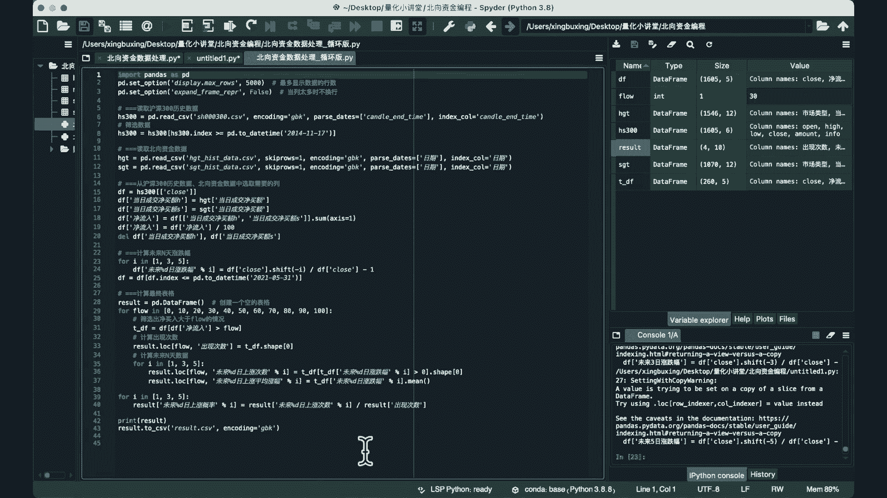

而且还包括我这边的空行呀，以及相应的注释啊，整体的代码量我估计不会超过20行。

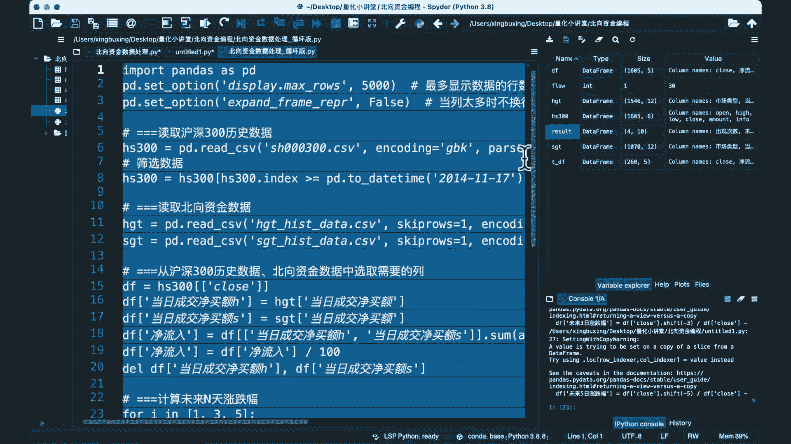

然后你看这边循环的话呢，我就是写了一个for循环，这边你不懂没有关系啊，循环的概念不是我这边讲一句话，两句话就能理解的，但你看这个表达其实非常简单啊，他就直接把我们这边要循环的东西，直接我放在这边对吧。

然后呢我通过这个for循环，它就会依次的帮我去从012030，一直到100去操作一下，并且呢我把前面代码部分当中，比如说未来1355天涨跌幅，这边也用循环来代替了，这样呢就让我们代码整体会更加简洁一点。

对不对，我们点击运行整体的这样一个程序啊，好运行完之后呢，我们点击这里的result对吧。

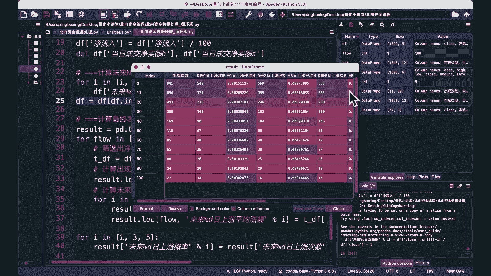

你就可以看到我们这个表格相应的一个结果，就是说我们最终需要的一个表格，这个表格呢就和我们这边的表格是一样的啊。

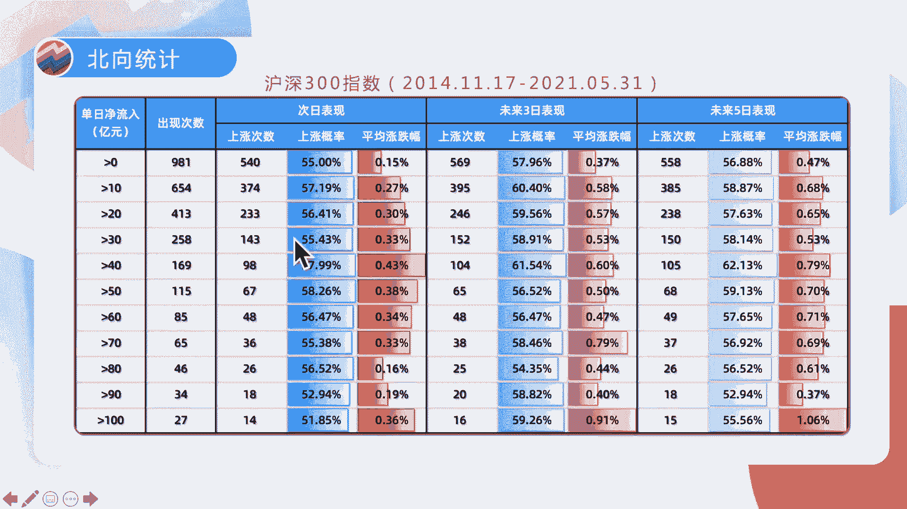

你可以看到是完全一样的啊，这边比如出现次数981，未来一日上涨次数540对吧，你就可以和这边去对比一下，就是我们这个excel表格去对比一下，其实都是一样的，然后有同学说我们现在这个相关的结果。

我是放在这一个Python里面的，对不对，我怎么把它输出出来呢，我怎么把它输出成我们，比如说类似这样的excel文件呢，也很简单啊，我们看我们最后一行代码就是这一行代码，43行代码现在变成42行了。

我要把这个result给输出到本地文件对吧，那么我们刚刚读取我们的文件，大家还记得啊，我们是用的read csv这个方法就是读取CSV文件，我们现在要输出CSV文件的话呢。

我们直接用这边的two csv就可以，就是输出到这个CSV文件的意思，然后呢我们要指定这个文件的文件名称，我们就指定成比，比如说result点CSV，对不对，然后我们指定好它的中文编码是GBK编码。

就可以，只要这一行代码，我就可以把我刚刚的这个result表格给输出出来啊，我们可以看到它的效果，我们来打开我们这个文件夹里面，就是我们现在代码和数据，你可以看到现在我是有result这个文件的。

因为我刚刚运行过程序，它已经输出了，我把这个文件给删掉啊，删掉之后呢，运行这个程序，运行完了之后，我们再回到我们这个文件夹，你看这边这个result文件又出现了，他就是刚刚运行生成的。

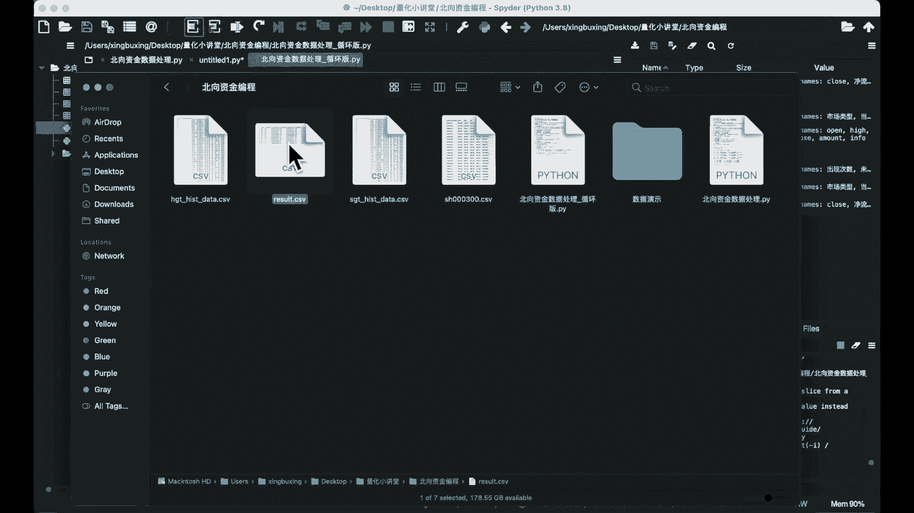

我们可以打开来看一下，你可以看这个数据啊，就是完全是我们需要的最终的一张表格，最多，他的这个列名的顺序跟我们需要的不大一样，其实其他部分都是完全一样的啊。

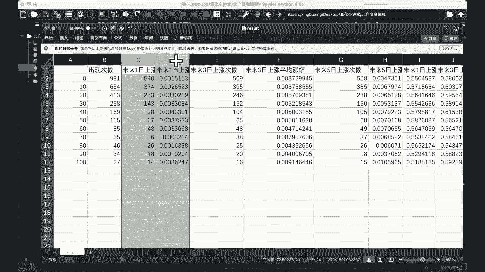

那这样的话呢我们就把这个代码给完全讲完了，如果你也想要这个数据的话，可以在评论区留言，都是可以直接发给你的，我强烈建议你一定要自己去试一下，如果你听我讲完之后非常感兴趣的话，觉得这个很有意思的话。

那你一定要去自己试一下，如果你觉得没有意思的话，那就无所谓，因为本我也觉得所有的学习都是兴趣导向的，没有兴趣的完全可以去学别的东西啊，然后我也不是很清，我们今天这么详细的去讲解这个代码，大家是否喜欢。

如果你喜欢的话呢，可以评论区或者弹幕里面说一下，我们之后就多讲一点类似的视频，并且我们今天讲的代码其实是比较简单的，对于一些有基础的同学来说是很容易的，如果大家这次点赞超过1000的话呢。

我们之后就可以讲一些更复杂的代码和交易，更相关的一些代码好，那么本期视频就到此结束。

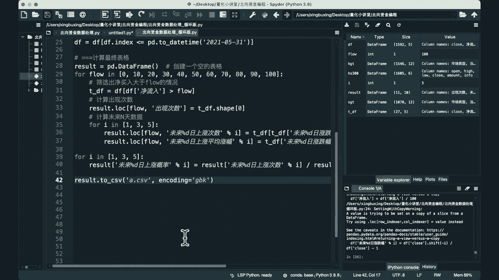

我是专注量化投资的，行不行，关注我科学投资。