# 6_1-第一讲AI工具准备和清理数据 - P1 - 无忧学习之家 - BV1HMSzYyEky

好我们这个时间也到了哈，那个晚上七点嗯，首先呢非常欢迎大家呃，这个进入我们今天的这门课的一个学习啊，然后也很高兴能跟大家在线上来额，针对这个AI啊，模型对于data a量化分析的辅助啊，我们怎么去做啊。

一系列的从呃基础到这个高阶的，这样一个做做量化研究的一个整个过程啊，我们用呃五节课的时间啊来讲一下呃，所以非常高兴跟大家来呃进行交流和学习，那么呃如果大家有任何问题呢，可以在我们的评论区啊。

有问题可以提问呃，我们在呃讲完呃这个这节课之后，我们有一个统一的呃交流答疑的过程啊，交流答疑的一个时间咳，额那我们整个的这门课呢叫做AI啊，模型啊，那个辅助data进行量化研究。

那么这门课呃开设的一个初衷是什么呢，是呃首先这个量化研究是吧，首先是大家对这个研究呢感兴趣啊，因为量化研究呢呃我们说适合于这种啊，相对来说他发表的速度可能快一点是吧。

因为他的这个格式或者说它的比较规范性，比较固定啊，那么再有一个呢你做量化研究，那离不开这个数据和统计方法是吧，比如说数据和统计方法，是进行量化研究的两个主要的部分，当然呃最重要的就是它的一个顶层呢。

是我们说是一个研究主题或研究话题啊，就所谓的idea啊，那么在现在这样一个呃科研卷是吧，这个到处这个各个领域，都在卷卷科研的这样一个背景下，那么应该说呃idea为王啊，就是你怎么提出一个好的研究选题。

可能你比本身去解决这样一个研究研究问题，可能更重要一些啊，但是我们今天呃这这个这门呃五节课的，主要还是围绕我们怎么用这个工具是吧，我们有了这个方法，有了额数据之后怎么去做这个量化研究啊。

在这样一个阶段额，那么从去年啊，2023年啊，这个应该说是开启了这样一个人工智能的啊，尤其是对我们的这个这个交互式的，这种人工智能IAI啊，呃一个新的时代啊，以这个某某某软件工具是吧。

以某某某梗工具为代表的啊，那不管是在国外，国外还是国内啊，就是都在蓬勃发展啊，像呃最近大家呃关注到的呃，一个新的这种视频的这种交互，一个咳AI工具是吧，比如说嗯我们这种创新呢是在不断推进的。

那么在这样一个时代背景下，大家如何去呃，把握住这个时代给我们带给了我们的红利是吧，在在这个人口学讲人口红利，那么我们在这个互联网就有这种AI啊，AI的这种人工智能的红利啊。

人工智能一期其实已经渗入到我们生活的社会，生活方方面面啊，包括我们的做科研啊，就是呃也离不开，或者说他已经完全的啊渗入，渗透到我们的这个科研过程中啊，可能相对来讲咱们在国内咳感受还没那么深，那么相对呃。

但是在国外这个其实用这个工具啊来做科研，已经发展的非常迅速了，对大家已经接受这样一个新的辅助工具是吧，所以我们讲这个辅助我们来进行啊，呃所以呃我觉得这个这个这这这课呢，涉及的主题呢设计的非常好的啊。

在这样一个智能啊，人工智能，AI辅助，这样一个工具的一个，大模型的这样一个一个时代哈，咱们怎么去啊用啊这个这个data软件啊，那么作为量化研究的一个非常主流的，统计分析工具呃。

我们有的学员可能呃对这个稍微有点陌生，或者说稍微掌握的不太熟，当然也有我们的学员可能掌握的相对熟了啊，所以我们呢呃，在是我在设计这这这五节课的时候，也要照顾到大家所有学员的一个基础啊。

因为我们几10号人不可能说呃，所有的人都是非常熟练的是吧，呃我们有很多这种基础，可能刚刚接触到量化研究，一些科研小白是吧啊，所以我们呢尽是呃尽量的涵盖，能够呃帮助大家不同的这种研究基础阶段啊。

都能够用到这个工具，然后来做这个用data来做分析啊，一个是有的同学可能对AI模型不太熟悉，有的同学可能对state不太熟悉啊，也有同学对量化研究可能也不太熟悉，所以这也有可能呃。

就是说有同学对这三个方面都不太熟悉，那其实呢呃都没事啊，都都都都没关系，那我们这节这五节课呢，是从呃相对来说，可能基础慢慢进阶的这样一个啊阶段，所以嗯我觉得大家如果觉得自己可能没接触过，也没有关系哈。

我们来一块接受新的事物啊，老师其实我自己也是，本身也是在这个过程中不断学习的，因为我从去年啊这个出现这个这个人工智能的，就是尤其是在我们的一个那那个工具哈，工具有具体名字，咱咱们都知道就不说了。

那么这个背景下，我其实我一直在我们也一直在用啊，就是所以我呃，我也是呃上了一些这样的一些课啊，但是呢呃怎么说也是嗯，因为这是一个新事物是吧，老师呃，或者说嗯每个人都在不断的进行学习和交流啊。

所以呢我们的讲的内容呢也是从基础到一般啊，到到到到这个近身啊，所以有有有任何这个大家有任何的问题想法啊，都欢迎来啊交流啊，其实老师也是一个跟大家不断来呃，学习的一个过程啊，那么我们整呃这这五节课。

或整呃整个这个课程内容呢，我呃大概分这五个方面，其实大家可能都知道了哈，因为做量化研究嘛，呃你有工具是吧，你有数据，那么就要从接触处理数据来开始啊，所以我们怎么用这个AI工具，来准备和清理数据啊。

这是做量化研究的一个基础啊，就是我们做量化研究，其实呃我们说量化研究简单呃，它简单在哪呢，它简单的是我们现在有很多的，你不像原来那个啊没有计算机是吧，你你要很多很多这种这个公式啊，计算呐是吧。

他要进行人工的是吧，现在我们有这么多的工具了，包括我们的统计软件呃，所以大大降低了这个门槛难度啊，但是呢，也不要大家不能就是说简单说量化就等于额，量化，它不等于啊玩数据啊。

这个大家一定要有一个清晰的认识，而且呃你大家给别人呢在这个这个传导啊，或者说或者说介绍量化研究呢，呃一定要注意我们的量化研究呢，绝对不是玩数据哈，玩数据，当然这个数据的处理是一个过程，但不是我们的目的。

是我们是带着问题来的是吧，我们研究这个是遵循我们量化研究，一个实证演啊，实证的一个一个一个认识啊，事物的一个过程啊，所以嗯嗯这个定量和定性之间为什么老打架，就是我们这个这个不同的研究范式之间。

其实他认识问题，认识社会是吧，他的一个逻辑呃，这个这个过程是不一样的哈，所以呢，我们不要这个把这个量化研究或者定量研究哈，简单的呃就认为是只要有数据我就能做出来，完全不是一不是这样的哈。

嗯就说你一篇好的精彩的量化研究呃，我们后边也会有相关的案例啊，我们来共同来说一下，就是或者解读，也剖析一下这个好的量化研究到底精彩在哪哈，他肯定是思思呃，丝丝怎么说，环环相扣啊，环环相扣的。

这是第一个啊，就是我们在做量化研究，第一步就是要清理数据，清理什么呢，清理这个极端值是吧，缺失值，尤其是这个缺失值啊，嗯然后第二个我们把数据准备清理好之后呢，呃作为量化研究的一个重要部分。

就是要进行描述统计是吧，那么你要向读者告诉读者这个数据的一些，你使用数据的一些基本的情况，比如说每个变量的一个基本的分布是吧，它那个连续变量啊，呃还是分类变量是吧，连续变量的这个均值标准差是多少啊。

那么分类变量每个这个这个所谓的category是吧，每个分类呃他的百分比是多少啊是吧，这些呢是在呃我们所有的量化研究中，是非常基础和重要的啊，因为很多嗯嗯审稿人呐。

或者说我们的读者都要通过你的这个描述统计，包括我们的可视化这个画图来了解你的这个，比如说你这个因变量的一个分布，是是是偏态分布呢，还是正态分布是吧，那因为这儿呢决定着你要用什么样的啊，统计方法是吧。

你的数据决定着你的统计方法，这是第二啊，第二节课哈，这是第二节课，第三节课我们就进入到这个假设检验，那为什么要做假设检验呢，是呃它其实也属于描述统计的一个嗯，一个当然它不它它属于推断是吧，它属于推断。

但是呢他的目的呢是服务于描述统计啊，当然里边有些方法有一些文章呢也直接用了啊，直接用一个，比如说用方差分析，当然这个属于比较简单的啊，简单的方法，咳咳所以这个假设检验呢，各类的假设检验它属于额这个呃。

呃这个这个推断统计的一部分，就是通过额这个样本来推断，总体的一个分布情况，但是他的目的呢我觉得还是为了服务于咱们的，对于整体的一个数据变量的一个描述啊，一个一个一个一个白描是吧，那么比如说比如说嗯。

不同的变量在因变量上有没有显著差异啊是吧，这个就为我们后边呃说他们之间有没有关系啊，就像那个呃很多文章刚开始做一个表是吧，那个不不同变量之间，有这个这个相关性有多大是吧，这些东西哈这是我们第三节课。

那么第四节课呢，呃是这个呃进行回归分析和建模预测啊，那也就是说我们做了前部分啊，量化研究的基础之后呢，就要做一些复杂的回归，因为呃作为量化研究，现在发表来说，其实嗯，在这个卷科研的时代下啊。

其实难度都在加大哈，不管是定性研究还是定量研究，这个发表难度大家都知道啊，比如说中文呃，可能你你发表嗯就是中文，其实嗯它不仅仅是你这个文章质量啊，它还有很多的要素啊。

这决定你这个这个这个文章能不能发表啊，就是有当然有一些因素，我们作为我们这个这个卑微的个体是吧，这个卑微的个体他是没法控制的啊，所以我们只能把我们自己的文章写好，所以回归分析和建模预测啊。

尤其是回归分析呃，这个是比较重要的啊，因为它是作为一个我们一个主体了，主体的部分了哈，嗯最后一个呢就是我们呃回归出来，或者分析出来，要进行结果的解释和讨论，结果的解释和讨论。

当然这个回归分析呢有多种方法啊，有线性的，有非线性的啊，包括我们有不同的数据类型，比如有呃CORSECTION啊，就是有截面的，有有追踪的是吧，我们到时候都会啊简单的去介绍给大家，介绍给大家。

嗯最后呢就是分析结果讨论啊，那么这些呢，其实是贯穿了我们做整个做，量化研究的一个过程，就从数据开始整理清理啊，描述假设检验回归啊，结果的讨论解释是吧，所以这个呢呃很明显是一个量化研究的一个。

一个一个过程，但是大家注意呢，其实我们最重要的还是怎么去用AI辅助啊，因为很多同学呢很多学生啊，很多这个学员呃，可能呃对这些有一些不太熟悉啊，嗯其实我们说这个AI呢，它其实也是一个呃实时的一个工具啊。

或者说实时的一个一个一个呃，你的一个一个学习呃，呃怎么说呢，是一个呃你可以把他当为当成一个老师啊，当然这个老师呢，嗯嗯有时候他提供内容可能不完全正确啊，也会出错，但是大部分情况下呢。

他能解答大家的一些疑问啊，所以我们就重点去怎么问是吧，怎么用AI工具怎么去问他，才能够呃得到咱们想要的那些啊答案啊是吧，你怎么去问他有哪些关键词要要体现啊，因为AI呢嗯他不是说是以。

虽然说它是一种交互式的哈，它能跟跟人类来交流，但是它毕竟不是人的大脑啊，你嗯有些问题你问的如果说比较宽的话，我不太具体的话，他有时候不太能get到啊，get到你的你想到的那个东西啊，所以他有时候回答呢。

嗯离咱们想要的那个那个那个答案，可能差强人意，或者说距离比较远，所以你需要具体的就是说一步一步的缩小的，这个这个范围哈，好，这个是我们整个课程的一个，总体的设计和内容啊，嗯嗯希望也希望通过这五节课呢。

呃不管是从哪个侧面，是从AI上还是从state上，还是从我们的量化研究的分析的过程上哈，都能给大家一些啊，新的这个这个启发新的知识点啊，帮助大家来提高啊，我们量化研究写作的一个水平和能力。

我觉得这个是我们啊课程的一个，最重要的一个目的啊，啊当然我们之前也说过，我们因为我们的学员呢呃人数比较多，基础不一，所以呢我们呃该讲基础的还是要讲啊，我们不呃这个，然后我们再进阶到这个怎么去用AI。

所以呃，呃就是说我我们还是要照顾到所有不同学员的，这个基础啊，这是我我们这个我一贯上这个这这一系列课程，的一个总体的一个原则啊，好那么我们就不啰嗦了哈，我就不啰嗦，进入到我们进入了第一节。

就是AI工具准备和清理的数据啊，清理数据，那么主要有这么几部分内容吧，第一个就是简单介绍一下这个AI工具，有的同学可能第一次接触呃，目前可能还不知道啊，它的一个发展啊。

它的一个一个一个大概的一个一个一个逻辑哈，我们简单说一下，第二个呢就是呃既然要处理数据嘛，你你首先要呃，首先要对data进行呃一个一个简单的熟悉，然后嗯重要的是你怎么把这个数据导进去是吧。

导进读取这个啊这个这个数据啊，然后就是呃那个AI工具怎么去清理，清理这个数据，主要有两个方面啊，也是影响我们啊分析的，一个就是这个呃呃这个呃叫叫叫异常值啊，Outlier。

呃一个就是这个Missing啊，呃我我在这个讲课过程中，可能呃可能有的时候会用英语啊，因为有的时候用英语呢，会嗯更能准确表达它的一个原先的意思啊，不是我来的，不是我卖弄我的英语啊，我英语也没那么好。

但是呢有一些个别的呃词汇啊，包括我们嗯尤其在统计学里边，有一些英文的单词呢，嗯在翻译过来的时候，可能就呃就没那么形象表达它原有的意思哈，所以我有时候呃用中文，有的时候会用英文啊。

像这个outlier是吧，它非常形象的就说明他是一个离群的是吧，离离离群的一个一个东西哈，好那么我们进入到的第一部分哈，这个AI工具的简要介绍，我就简单说一下吧，那么其实从去年啊。

也就是去年的这个时候吧，我记得大概就是2月底，3月初，好像就是那个呃国外的那个那个那个工具是吧，横空出世，嗯当然这是人国外创新的一个一个一个结果啊，呃我们也赶上一个这样一个时代是吧，生成式AI。

那么去年呢他出来之后呃，我当时还没有太对这个工具太敏感哈，我我一一向来说我我我我是比较谨慎啊，也就是对于一个新生事物，还是相对来说比较保守和谨慎的啊，所以呃出现之后其实嗯在我们社会上啊。

包括媒体上有特别大的一个讨论啊，包括有很多人用啊，但是当时呢因为嗯有的同学，有的我们嗯很多亲很多人他没法接触到，因为需要这个这个网络啊，需要外网嗯，但是呢就是随着这个时间的推进，呃。

越来越多的人去讨论及一运用它啊，所以我也去去用了，这个确实呢这个呃工具是非常非常强大的啊，非常强大的嗯，他的核心理念就是包括我们现在国内的我，我呃讲这门课的一个呃主要的用的这个AI工具。

是咱们国内的文心一言啊，就是百度的文心一言啊，它相对来说呢，还是对于呃中文的这个处理还是可以的啊，他尤其是搜我们的这个中文的材料啊，呃有的时候我发现你同样的问题，可能呃他的回答可能比那个国外的还要嗯。

似乎还要好一点，嗯所以他也是有自己的优势的啊，所以我们在如果没法这种呃，呃比较容易的，那个那个接触到那个国外的AI的话，呃用这个文心语言呢也能呃，就是满足我们的一个基本的需求啊，所以呃为了降低难度呢。

降低这个这个所谓的access哈，所谓的这个接受接接接受程度呃，接近的这个这个可得性哈，所以我我这五节课的呃，用的AI工具是文心一言啊，这个需要大家来给给大家说一下，呃，这个是大家去百度。

直接百度那个文心一言就行了，其实它嗯是呃它有免费版的啊，也有这个额收费版的啊，我们用直接用那个呃是免费版的，就免费版就可以啊，呃它的一个核心理念就是用大量的文本数据，来训练深度学习模型啊。

这个deep learning啊，deep learning呢我相信大家都熟悉，就是它是元年，这个大数据实际上是很多年了啊，呃那个他训练的是一个深度模型，就是说它能实现对我们自然语言的一个理解啊。

同时呢它还有一个呃重要的功能，就是推理，一定的推理和交流能力，他能结合自身所学的知识啊，针对咱们这个问他的问题呢，生成一些有意义的啊，生成一些相关并且啊有意义的这些回答答案，这是他的逻辑啊，你那么在呃。

那么这这个生成式的AI呢，已经出现一年一年了哈，基本上一年的时间他为我们做什么呢，其实他我们前面讲过，他已经渗透到咱们社会生活方方面面啊，包括咱们的科研和学习，嗯现在很多都在开发AI工具是吧。

嗯我觉得第一个与人思考有关的东西，你都可以问他啊，所有的问题呃，不管是你是哲学，人生哲理呀还是什么问题啊，呃当然他的回答呢可能呃有不同的答案是吧，那么就需要你可以跟他来交流啊交流，然后你就跟他呃。

你把他当做一个你可以把他当做一个朋友，一位老师是吧，或者一位同学呃，或者一位这个这个这个闺蜜是吧，或或者什么是哥们儿啊什么的，呃其实你怎么跟人类交流，你又可以怎么跟它来交流啊，这个大家呢如果没有接触过。

可以呃百度那个注册一下啊，注册一下那个文心语言来试一试啊，啊文心一言，它还有它的优势，就是它有一些免费的，比如说你可以上传附件啊，上传这个这个PDF啊，满图画等等。

这些就嗯在如果是国外的那个就就需要花钱啊，需要花钱的，再一个如与我们啊紧密相关的这个科研呢，比如说呃科研思路与选题是吧，怎么去选题，怎么去找这个科研思路，怎么做文献综述，怎么做研究设计。

怎么写这个讨论分析是吧，咱们啊在最后呢也会讲怎么凝练一个概念啊，因为他如果是它是大数据嘛啊对，所以说他呢呃可以帮你嗯，你可以比如说你描述一个社会现象，你让他帮帮你凝练一个一个一个哎。

比比较合适的概念是吧，他也会能做到啊，啊，当然说这个里边呢，还需要大家自己去思考和提炼啊，不是说他说的就就OK了啊，其实他他有时候也会出现一些错误啊，我们在后面讲课中就会发现嗯。

他说的命令在实际的运行过程中，出现各种各样的错误，这个所以他所以说他不是人脑哈，他他只能说是一种呃这个文本的训练，深度学习的一个模型，嗯还有一个数据分析的啊，这个可视化呀，机器学习模型优化等等哈。

嗯所以我觉得嗯，大家呢就是我们前面这些讲科研相关的，其实如果大家感兴趣，也可以在我们平台上搜索啊，其实有很多呃我们也自己也可以来呃练习，说比如说你嗯一些一些基本的选题的一个思路。

也可以用用AI来啊来来帮助大家，那除了这个AI工具呢，有的同学可能呃原来可能习惯用SPSS是吧，那么我觉得呢在现代这个社会啊，如果大家跟呃别人交流比较多的话说，或者说你你自己学术上有一些一定的这个呃。

追求和要求的话，还是要去主动学一下这个state啊啊data软件啊，有的叫start软件啊，嗯这个呢其实已经很好几十年的时间了啊，因为他是从国外传进来的啊，那么呃它和SSPSS啊。

还包括我们的SARS啊，包括我们的Python r啊，R语言等等，嗯都是一种统计的分析软件啊，但是我觉得它相对来说哈，呃SP可能更多是菜单式的，那么STA呢也有菜单在最上面，菜单菜单操作。

但是最方便的最便捷的还是他的命令的书写啊，嗯它呢可以处理各种各样的数据啊，比如说横截面的面板的时间序列的啊，当然它有有各种各样，包括画图是吧，各种各样的呃统计分析包啊，统计分析的这个这个模块啊特别多。

他现在已经更新到嗯17了吧，哈17版本，所以它包括了这个统计分析方面软件啊，这个这个模块是特别多的，我觉得它比SPSS呃要更方便一点啊，就写命令嘛，嗯其实它这个命令呢也没有多么复杂。

呃大家如果会英语对你就会下的命令，因为它很多命令都是根据英语的单词，某个单词的原始的意思来的啊，原始的意思你比如说呃简简单例子，replace是吧，replace replace呢是替代是吧。

我们说替换，那在这英语中啊，那代STA的，他的这个这个命令就也是替换的意思啊，嗯其实嗯其实非常简单的一些常用的一些词，词汇让大家记住就可以，所以我觉得呢啊这个是完全没有问题的啊。

当然它的一个优点就是呃就是门槛比较低，我们说它相对比如说R我觉得就非常复杂是吧，嗯包括我们的Python更复杂啊，所以当然那两个处理大数据有它的优势，那么STA呢，它在处理大数据上。

可能会受到一个速度上的限制，但是如果我们平时的科研是吧，大家处理一个呃，比如说这个几十个嗯变量，或者是那个嗯1万甚至1万12万个，这个呃个案都没有问题啊，他都可以处理的很快。

那么这个是一个我简单截了一个图，这是15。1哈，DA15的给给大家发的16啊，这两个没有太大的差异，然后这个地方就是大家写这个命令的一个窗口，那就用写英文啊，ABC是吧，然后这个是显示结果。

这边是你输入的这个数据的变量啊，然后这边是一个你写的命令都会在这，然后呢，这个呃他的最上面就是我们所说的SPS，S那个菜单操作啊，一点击它就是呃这个出来了啊，待会呢咱们uh oh。

待会儿咱们再这个简单的去嗯去演示一下啊，好这个是对它的一个简介哈，一个简介，然后呃对大家也可以去下载，然后慢慢的熟悉，那我在上课的过程呢也会简单的说一下，那额进入的第一个内容就是读取这个数据。

用这个AI啊，因为咱们如果说想求助于AI来帮助咱们的话，那么一个非常重要的一个呃过程，就是你要把这个数据告诉AI，我正在用这个数据，然后我要用这个数据呢去呃，做什么什么的分析了是吧。

因为呃我们说巧妇难为无米之炊哈，如果说AI不知道你要用哪些数据的话，他也当然他也能做，但是呢我们说嗯他知道这个数据变量的话，会更加的嗯具体是吧，会更加的具体，他能告诉你呃。

呃这个这个变量啊怎么怎么去弄啊，所以呢我们第一个第一步呢，就是呃学怎么把这个data数据呢，呃这个给它导入到AI里啊，等于其实它是一个一个一个导入的一个过程哈，但是这个导入呢并不复杂啊。

就是我们也不需要，把这个所有的数据都给它导进来啊，这是不需要的啊，我先把这个视频关掉啊，这个网速受影响呃，所以怎么去读取C大数据，我们这里我在这里写的是读取部分数据是吧。

因为咱们知道AI呢它不能代替咱们呃，他不是像说呃，他是我们的一个呃，他不是我们的一个一个一个助手是吧，呃呃实操啊，会实操哈，他不是我们的助手呃，所以你不能说我说你帮我做什么什么，他就给你做出来了是吧。

他只能给你提供一些呃提示，然后最终其实还是需要我们自己去操作哈，所以这里边儿呢咱们只要告诉他，我要呃呃有一部分数据啊就行了哈，我们copy部分数据，就是比如说你要你要分析这四个变量。

那么把这四个变量的一些部分前几些呃，前一点这个数据给它copy，然后粘贴到AI窗口呢就OK了啊，咱们来呃具体的操作一下，那么首先呢我打开这个文心一言哈，稍等一下，稍等我先，我得先登录一下。

嘶这个文心语言打开有点慢，咱们稍等，那我们先看一下这个state啊，大家如果安装之后呢。

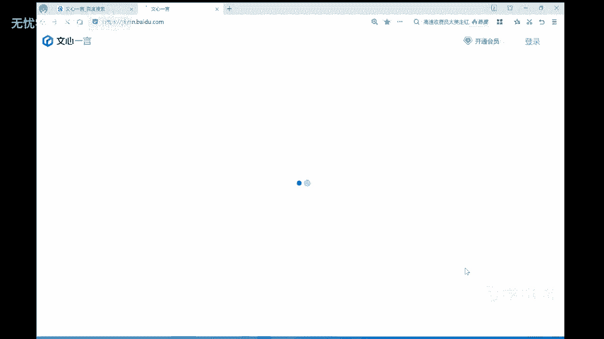

是是是这样的是吧，这样的嗯，然后嗯我们把这个数据啊，数据也发给大家了，这个数据额怎么进来呢，点击左上角这个打开啊，这个打开，然后给他选中这个数据啊，直接打开就行了，打开之后呢，呃你会发现这个右边是吧。

右边我们说是它的变量窗口嗯啊一共四个，我为了举例呢，这只只选了四个变量是吧，呃性别收入年龄，受教育程，受教育程度，现在呢我要告诉AI啊，我要对这四个变量进行相关的分析是吧，那么呢咱们就打开这个查看啊。

查看这个数据。

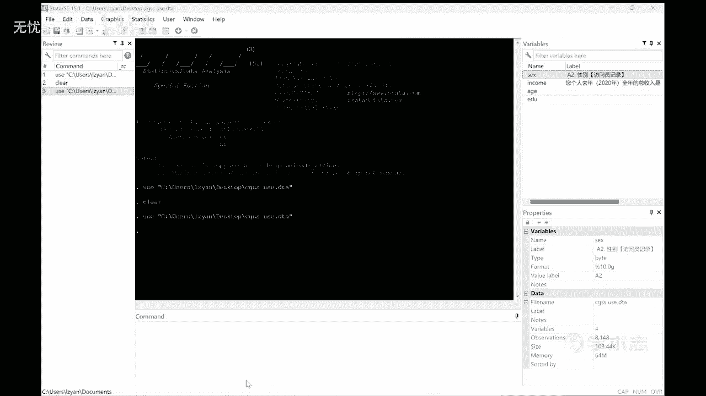

好打开这个数据哈，呃我们说过，这个AI呢不能直接帮助咱们啊进行实操，进行操作，但是它可以给我们一些命令提示是吧，这个我们重点是要他的命令啊，所以呢咱们先最好啊，最好我建议是大家把你的数据呢。

比如说你有十个八个也好啊，这个变量都没关系，呃咱也不用全复制给它，只要让他知道，我正在分析这几几个变量就OK了啊，所以呢我们先额因为这四个变量嘛举例子哈，我们就先复制，比如说前边这几个啊。

前面这呃18个吧是吧，选中左键，选中之后，右键点击复制，复制啊，然后呢咱们就回到这个AI这个窗口，啊这个啊这这这个是他的窗口啊，然后点击右键粘贴啊，不要纯文本剪上面这个粘贴，看它自动是这样的哈。

然后呢回车啊，就是这这这右下角哈，那么它就会自动识别这个额表格的内容，这个咱不用管啊，你甚至可以停止生成啊，因为这不是咱们的额，不是咱们的目的啊，就是你或者让他呃成生成完也没关系，OK那这样的话呃。

我们就把这个数据呢，就是导入到这个AI工具了啊，其实就告诉他呃我要用这个数据了哈，然后他自己有一个反应啊，所以这是第一步啊，其实呃还是比较简单的，因为毕竟呢呃如果更复杂的，其实用用那个别的工具。

因为咱们这个这个呃学员考虑咱们学员基础哈。

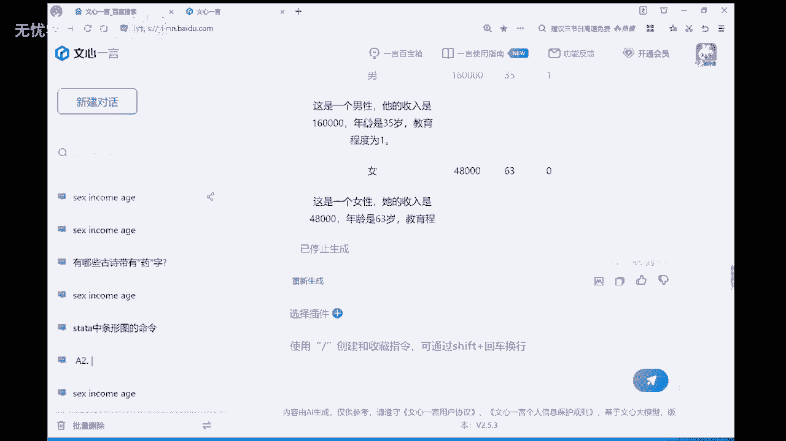

就是就没有必要了啊。

就只要是吧只要我们能掌握这个呃呃就行了，就是你只要把包含主要变量的这个数据给它呃，部分copy过来就就OK了，啊当然了，如果大家对Python这个编程熟悉的话，也用这个pandas这个数据库，呃。

那个那个那个导入啊，在这儿呢咱就不演示了，呃其实他也这这个也是我会我问的那个啊，AI就是嗯你就直接问用AI读取这个数据，怎么怎么读啊，呃这个他就会给你这样一个一呃。

他就直接给你的是用Python语言的一个编程啊，因为咱们这个不是咱们的主要的目的啊，咱们是用data，所以咱们主要还是先打开sta copy呃，复制你想要的这几个变量啊，部分数据就行啊。

然后给它粘贴它就识别进来了，识别进来之后呢，咱们就要对这个数据呢进行一个分析了哈，因为呃刚才咱们在复制的时候，就看到有些数据它是有缺失的是吧，有一些是系统缺失点啊，你像嗯这个。

我这这个这个没有复制刚才实际操作中的，比如第18个是吧，或者第19个它就有缺失啊，所以我们就进入到嗯，就是咱们在做量化研究的第一步，就应该是这个data cleaning是吧，就清理数据。

而不是说我不管372 11是吧，351 15是吧，就就拿过来把这个数据吭吭吭，就就来来来做回归了是吧，做做分析了，这个是完全要大家一定要避免哈，就是这个数据的准确度如果达不到保证的话。

你的分析结果也是有偏误的哈，嗯所以我们在呃任何一个量化研究做之前，都应该首先是要对这个数据的一个基本的情况，有一个了解，再一个呢重点要关注这个主要变量，就是你参与运算啊。

参与分析的这些变量的一个极端值和啊，缺失值的一个情况，呃没看到数据，是是没看到STA数据还是还是哪啊，这个数据应该是额之前有有有有没有发给大家，应该是发给大家了，额没看到数据应该用那个那个导进来。

就是你把打开那个data啊，然后呃打开啊open啊，open数据，哦咱们那咱们请辅导员把那个额数据啊，放到网盘上好吧，所以这个数据的清理的第一步呢，是查看和分析变量啊，因为我们数据的一个主体组成部分。

就是变量嘛是吧，data and这个variables啊，所以我们第一步，我们说你要对一个整个的变量有一个基本的呃，这个这个描述性的呃，或者说你要你要了然于胸是吧，了然于胸啊。

然后再进行这个啊它的一个极端值啊，啊确实值得处理啊，所以第一步怎么查看啊，所以这个AI提问呢就是这样来啊，大概来问一下啊，其实也也非常的直接啊，那么在上面，咱们其实刚才呢我们说已经导入了一个部分的。

一个呃，主要是我们的变量啊，主要是我们的变量，然后数据也导入了，所以呢我就我可以问他，第一个啊，我需要对age和ENA啊，就是年龄和收入两个变量进行描述性统计分析，请生成相应的state的代码啊。

就是说如果大家呃不知道是吧，我我我这个这个有这个数据，但是我不知道这个，那啥，就是说呃到底到底怎么去分析，分析一个数据是吧，嗯这个时候呢大家需要去呃，可以哈，可以问一下啊，AI啊。

他是呃怎么怎么去查看一个一个数据的哈，所以第一个呢就是你要界定你要对谁是吧，不要对，哪两个变量进行描述性统计分析，然后让它生成相应的data代码，有的时候呢这样你还可以具体再具体呀。

比如说你要根据你的版本，比如你用的16版本是吧，比如说你你15。0啊，版本以上啊，因为怎么说呢，因为这个呃那个STA它的不同的版本啊，尤其是在13之前，他的变化还挺大的，就是43跟之前跟之后有一些命令。

它的变化特别大啊，所以呃我们呃当然这些简单的还问题不大，尤其是后边那些回归呀，清理啊，这些呃可能呃高阶的版本它的命令已经变了哈，所以大家呢嗯呃可以给他界定上，比如说啊，多少版本以上，这样的话呢。

诶他就能够相对来说就知道你，你想要哪些哪些命令嗯，所以咱们，咱们来试试啊，啊所以第一步查看啊，查看分析变量，啊你可以界定一下在以上数据中是吧，呃我需要对它啊，请生成data代码啊。

因为这个是最简单的描述统计分析，所以我们不界定它的版本，应该也也问题不大，那么下面呢就给了一也，非常非常丰富的这个提示是吧，包括命令，好了，我们看一下他的这个答案。

第一个呢他说可以使用summarize，呃这个英文大家都知道是吧，summarize总结啊，然后或者用describe啊，describe也是描述的意思，所以所以我们说只要大家记住一些呃。

常用的这个这个英文的词啊，包括它的命令，你就知道他这个命令的表达的是什么含义啊，啊，所以说他也会给你解释，这两个命令会提供什么样的信息是吧，然后Q1Q2代表什么意思啊，然后如果还有继续是吧。

还有可以这个啊summarize age income，逗号啊，detail detail啊，detail就是呃更加的详细的细节，比如说偏度啊，风度啊，还有你还可以输出这个让他呃这个这个统计值。

这个缺失值在内的统计量啊，所以我们都试一下哈，比如说第一个summarize age income啊，就是你可以看到它的一个命令的形式呢，是命令加变量是吧，因为你要分析age和income。

所以把它放在后边啊，你可以在这儿复制代码是吧，右上角这个的话，他就会把这些嗯呃如果你复制这个代码的话，右上角直接复制代，我建议大家用那个呃那个do啊，就是do file啊。

如果是大家是用这个也可以单独的来复制啊，单独复制一个，然后这个时候应该怎么办，应该回到你的data窗口啊，就一定是在呃data里操作，而不是让这个呃因为AI没办法，现在没办法帮咱们来操作啊。

所以我们只能是回到嗯，嘶我这个这个软件又是又是要要要死机哈，嗯这样我我可能要退出啊，然后重新进来啊，大家稍等一下。

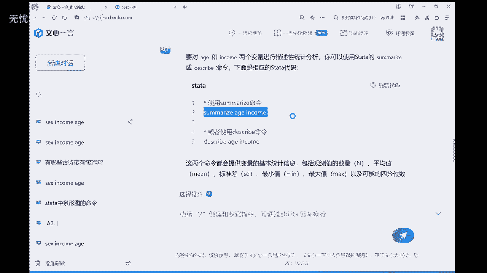

好咱们复制这个命令啊，复制这个命令之后呢，再回到data的窗口。

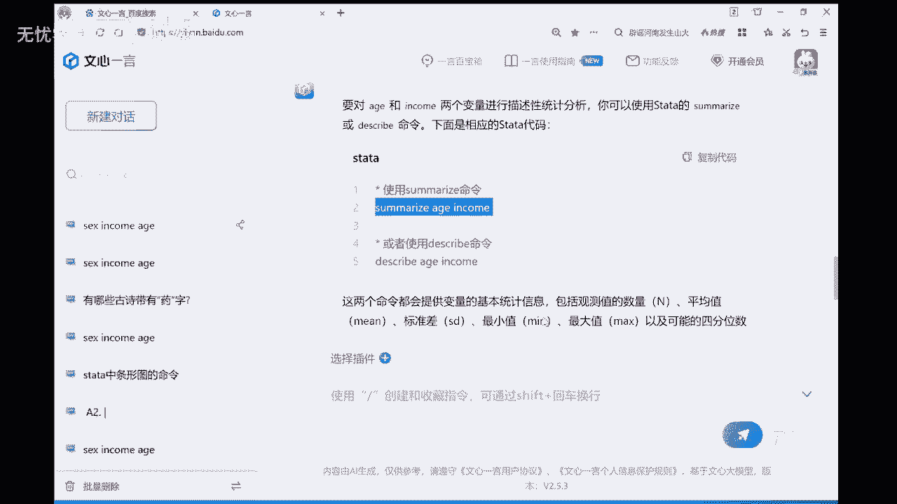

看到没有粘贴是吧，粘贴这个到命令窗口，然后回车，那么在这个输出的这个结果中，如果大家对这个呃比较熟悉的话，就你就能知道是吧，这个年龄有8000多个观测值啊，平均年龄呢是51。64啊，标准差17。57。

最大值最小值是吧，还有包括收入7334个啊，平均值那是5万2597啊，你看这两个变量的观测值是不一样的啊，说明他们有不同的这个不同程度的缺失是吧，不同程度的缺失啊，呃如果说大家对这个内容呢也不太熟知。

我不知道这个什么意思啊，你可以把这个命令接加结果给他复制啊，就是全选啊，你就点击鼠标点击往下拖，然后右键啊复制，那我们说这个呃AI呢，它是一个你可以把它当成一个一个一个助教啊，或者老师嗯。

所以你你不懂的话，你就问他对吧，你可以把上面的内容复制。

然后再回到AI窗口。

然后我们粘贴，粘贴之后呢，你就可以问了哈，以上结果啊如何解释啊，或者说以上接口什么意思啊，都都可以都可以自由来写啊，然后回车你问他，那么他呢对这个变量，包括我们输出的这些所有的英文。

包括它的缩写都进行了解释啊，这样的话呢大家就非常熟悉了啊，就这个这个代表什么意思哈，具体呢咱们前面说过了就不再不再说了，这是第一个啊，这个STA反返回的结果如下，请问怎么解释啊，跟刚才咱们说呃。

如果大家不懂不懂他的那个返回啊，你可以直接copy到他的窗口问他就可以了，还有一个就是说你不知道如果怎么去写，描述这个东西，你也可以用这个词这这句问他，比如说你要写一篇学术论文啊。

你给他界定你的用用途是吧，要要写是是表达学术性学术论文，那么根据上述结果来撰写论文中的啊，描述啊，这个描述性统计分析段落啊，要求语言啊，有学术用词严谨啊，这些东西嗯。

所以你可以把这些东西呢来copy过来是吧，呃当然我这里的这个刚才的那个那个描述呢，非常简单哈非常简单，所以我们也诶哦哦切换一下窗口，所以我们可以让他来嗯。

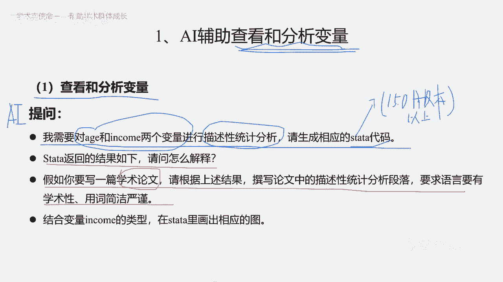

给咱们来描写描写。

啊，这个你看比如说在年龄样本中，有多少个观测值啊，这个当然非常详细了，咱们摘取是吧，摘取其中一些有价值的，比如平均年龄标准差啊，说明年龄分布集中啊等等等等这些啊，额所以我们这个呃命令额。

或者说这个这个投喂哈，这个提问的额目的呢是帮助大家额，就是迁移到其他的那些问题上，这是查看分析这个相应作图，咱们在下面讲的，后边讲那个可视化的时候再详细去讲啊，所以第一步呢查看和分析变量。

那呃我们还没有完全弄完，就是第一个summarize是吧，嗯还有一个就是describe啊，他也提供了这个命令，所以咱们也还是复制到这个窗口中。

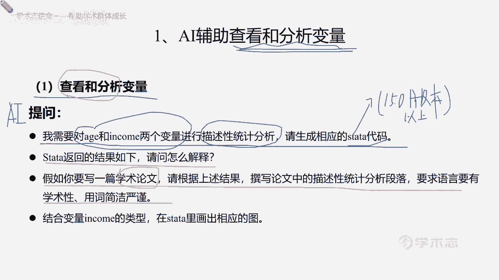

像刚才我复制了他的命令，describe a age income啊，然后他呃有变量名储存类型展示呃，展示的形式啊，标标签啊是吧，这些啊，所以这个呢就不太详细啊，当然你也可以用detail啊。

Summarize detail，好这个就非常详细了啊，然后如果大家还是不懂的话，也可以copy过来问他啊，就就就就可以了。

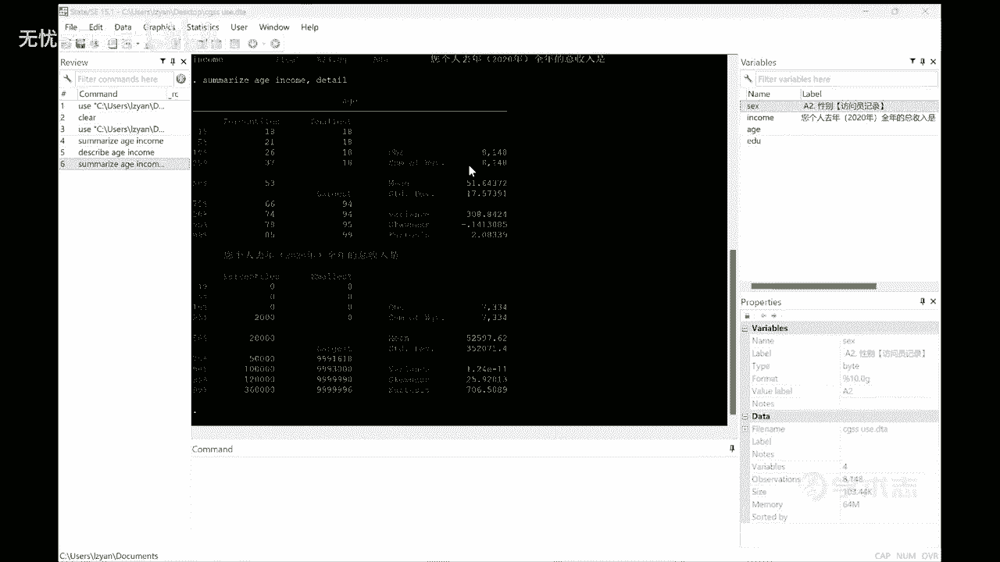

接下来再往下走。

那么嗯呃第一个查看之后啊，呃呃这个对于啊这个东西呢，有一个嗯这个这个基本的分析了啊，基本的分析让它生成相应的代码，像刚才我们说比如说可还可以，这个这个是我用那个那国外那个啊。

因为为什么为什么不用那个呃那个工具，因为我们现在上课呢，呃不让说啊，不让说这些这些词，所以我没办法啊，嗯好在微信语言其实呃它的它还是比较好的，我觉得我我在在我备课过程中，我觉得还不错啊。

现甚至有时候比他比那国外的还好一点，所以国外提供了两个，一个就是tabular set tabulate，一个是summarize哈，但他还给你说了，这个怎么把你的数据来导入的啊。

但是这个我们也不需要啊，因为我们直接打开就行了，嗯第二个啊，熟悉了之后呢，就是要进行数据的处理啊，这里边其中最重要的一个，就是识别和处理缺失值啊，这个缺失值呢，嗯嗯我相信大家在做做定量研究里边儿。

一定会遇到的啊，而且大家如果以后读了博士，读了研究生，甚至你你当了老师，你就知道在量化研究里边，对于缺失值的重视和处理呢，国内外是不一样的啊，国内其实现在呃慢慢的开始重视了。

原来其实大家都可能都删掉了啊，其实但是这个里边一删的话，可能有有有有各种各样的问题啊，国外的对，尤其是发英文的时候，大家注意啊，一定要重视这个缺失值的处理，因为很多审稿专家呢会很重视啊。

很重视你对这个缺失值的处理，因为如果你的缺失值不是系统缺失的，那么你如果简单的删除啊，替换啊，就有可能产生很大的呃偏误啊，clear是清掉啊，就是把所有的前面的这些呃记忆都删掉啊，重新开始啊。

clear是这个意思，所以缺失值是什么呢，就是数据的一些变量的观测缺失啊，它形成原因有很多，比如说在数据采集中的出现的错误啊，设备呀，或者说拒绝回答啊，都呃都这这些都能导致的哈，都会导致啊。

所以额我们这个缺失值的重视和处理啊，是一个非常重要啊，嗯但是我们说这个他也是不可避免的，几乎几乎在所有的这个分支学科中呢，都是普遍存在的哈，嗯所以任何一项统计调查，想要得到这个有效百分之百的有效答卷啊。

他也是不可能的啊，也是非常困难啊，那么怎么去呃处理这个识别和处理确实值，有很多学员呢可能啊没有听说过啊，或者说没有重视过这个问题啊，所以呃我我我我建议大家还是要呃，一定要重视这个出缺失值的问题啊。

就是这个Missing的问题，因为它会带来很多严重的后果啊，第一个就是他肯定是影响咱们数据的完整性的，是吧，如果说嗯你的数据是不完整的，你比如说你这个变量上缺了10%，那个变量缺了20%，这样的话呢。

你其实整个样本量一下就缩减了非常多，非常多啊，所以在多元分析的时候呢，因为他要多元分析要加入很多的变量是吧，那么你这个变量缺一点，那个变量缺一点，你比如可能一共有有我有1万个样本。

可能最终只剩下6000个是吧，因为你不同的变量呢，它缺失的分布是不一样的啊，所以它严重影响我们的统计的效能，第二个呢会造成选择性的偏误啊，就是这个bias，如果说数据缺失可能与一些属性啊状态有关。

比如说与一些X啊，与一些Y，尤其是与Y相关，那就会造成非常大的问题啊，第三个就是数据整体质量降低，难以使用啊，难以使用这个模型啊，第四个就是出现系统下的偏差，比如说方差过大，就会导致这个精度下降啊。

你你的那个估计的结果都会出现严重的偏误，严重偏误啊，所以呃他的带来的后果呢，是是是是非常严重的哈，但是我们现在很多人呢都呃，发文章的时候都不太重视啊，有一是怎么说呢，是整体来说呃，国内额就是我们学术啊。

学术界对这个问题呢，还没有引起特别大的重视啊，所以审稿专家呢也不太呃重视，但是我觉得如果大家能重视一下，处理一下，可能能能增加你的这种文章的啊吸引性，所以对于缺失值常用的一些处理方法。

第一个最简单粗暴就是删除啊，就刚刚我说的，比如这个变量缺失了5%，那个缺失了10%是吧，呃只要你这个嗯比如说参与分析的有八个变量，每个变量都有缺失的话，那那，那变量上只要有缺失哈，他就这个呃只要有缺失。

他就给删掉，这个观测值就没有了啊，所以嗯就会造成一个一个样本比较，一个一个丢失吧，或者说缺少啊，所以这种方法比较适用的，一些缺失比例非常小哈，对结果影响比较小，比如说只可能缺失了0%点几是吧。

你1万个案例可能只有十个八个的啊，这个可能影响就非常小了，好第二个呢呃插补啊，通过某种方式来推测缺失值的取值嗯，比如说常用的比如说均值替代是吧，均值差补中位值，重值差补啊，回归差补等等啊。

这个咱们有很多这个人呢在用，但是他也会造成一些问题啊，就是也不是说均值差补他就没有问题啊，他也有很多问题，还有使用特殊值的，还有这个模型预测的是吧，还有一个多重插补，那所以最后一个这个多重插补呢。

应该是近年来啊，近应该说是几十年来吧，十几年20年的这个在统计学界啊，一个非常主流的，也非常啊，相对来说大家都能接受的这样一个呃，对于缺失值的处理方式啊，多重插补，多重插补呢他额是用多次模拟缺失值啊。

每一次模拟呢，比如说你模拟了五次，每一次的模拟都会生成一整套完整的数据啊，也就是说它是一个随机分布值，它生成这一套数据啊，这个变量生成一个值，第二套数据对这个变量缺失的，生成一个值与预测值哈。

所以它是一个随机的呃，呃是呃这个这个数值生成的这个预测值啊，那么大家在分析的时候，多重插补一定是要对整个完整的数据集，比如说你插补了五次呃，形成五个数，五套数据，那你要对这五套数据呢来进行分析汇总啊。

这个在咱们呃这个统计软件上，比如STA是非常容易实现的哈，也非常简单的，但是它背后的这个原理呢，大家了解就行了啊，它是呃生成多个啊，就是比如你模拟五次十次，那它就相乘生成。

相应生成五套十套这个完整的数据集啊，生成五套十套完整的数据集，额那么如果我们不清楚是吧，对这个缺失值怎么清理，可以你可以问嘛是吧，第一个你非常简单，如何在data里面处理处理缺失值呢啊它有识别的。

有删除的，有替换的啊，然后每一步呢，比如说嗯比如说怎么去识别缺失值呢，啊他也会给你这个相应的提示，比如用miss table summarise啊，这个命令来啊，看啊来看你这个数据的一个缺失情况。

还有删除的是吧，用drop啊，drop啊，替换的replace，咱们说过是吧，还有差值的啊，还有这个这个这个这个多重插补的等等啊，所以如果大家不知道也可以去问嗯，如果你对某一个还不太懂。

你可以把它copy过来是吧，这一段copy过来，你让他具体解释一下怎么来啊，识别呀，或者怎么来删除是吧，这个我们说过嗯，你把它当成一个一个一个助理是吧，所以他刚才说识别缺失值啊，如果要进行均值差补啊。

可以用这个命令，啊用以下这个命令啊，这是我根据AAR的提示来进行的，你比如说嗯你不是用均值嘛是吧，假如说这个收入，因为我们知道我们看一下啊，给大家演示一下。

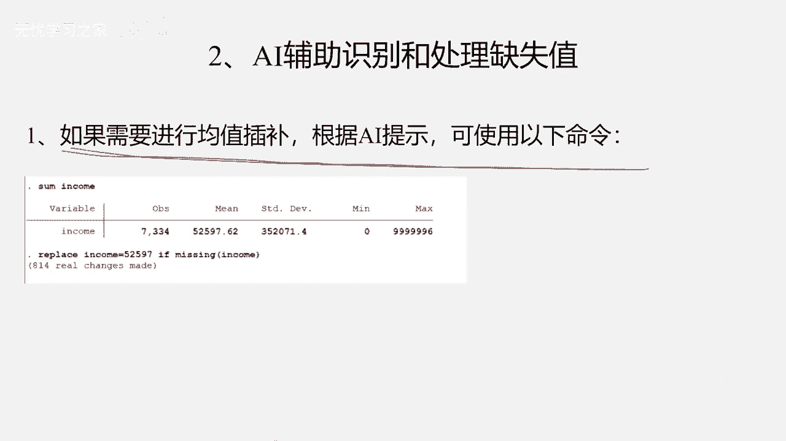

查看这个数据啊，Tabulate income，这个am am就是Missing啊，让它也输出它的缺失值的情况，啊那在最后边咱们就可以看到这个小圆点，这个小圆点呢是在data里边一个系统缺失。

然后他有多少个呢，有814个将近10%了是吧，在所有的样本里面啊，8000多个样本里边有800多个，将近10%的这个额缺失了，那么这个比例还是非常高的，所以我们不能说是简单的哈。

简单的来这个呃呃那个那个得给它删掉，因为你这10%实在是太多了哈，所以如果说大家用均值查补的话，比如说我用收入的这个均值来替代，所有的这个814个缺失啊，那所以我就问了，那个怎么怎么用那个额均值差补啊。

那么他就给我提供了刚才的那个答案，就是你需要先查看一下，是吧，你要先知道均收入的均值是多少啊，就刚才咱们说的summarize啊，summarize呃，这个里边可以简缩写啊，呃就前三个字母就可以了。

就是所有的这个theta命令前面，基本上用前面三个字母都可以缩写啊，所以SUM啊，空一格，那我们就可以看到收入的均值，那是5500万，2597。62啊，也就是说你如果用这整个变量的一个平均值。

来代替这个变量的缺失值的话，那么你可以用这个，所以呢我们就用刚才那个命令是吧，用替代replace income，等于五，啊这有一个替代条件，if啊，你就直接把他提供的这个嗯。

命令给他copy过来就行了，我这是给他写一下，啊就是说用这个把这个变量的这个替换成他，如果说他是缺失的，有缺失的啊，那下面就会显示814个改变，然后咱们再重新看一下，啧，那么现在你看他就没有了。

是不是啊，他就没有缺失，他的所有的百分之百都是有值的啊，8148个，然后咱们刚才是用的5万2597，咱们看看这儿能不能看得到啊，往上拉，因为它比较多，在这呢是吧，你像刚才替代的814个，就在这了。

5万2597点六二啊，找到它了啊，所以他的命令这个命令是没有问题的，所以这个呢是一个简单的替代哈，同理如果说嗯嗯像刚才咱们说的这个嗯，Miss table summarise。

啊因为你看刚才那个里边不是提示了吗，如果说你要查看这个缺失的额，这一个一个特征的话，你用mistable summarize是吧，所以我用了mistable summarize。

然后它显示的这个结果就能知道，这里边有缺失的是还有缺失的，就是受教育程度education是吧，有多少个呢，它等于点的有20一个啊，20一个，所以这个就提示我们这个受教育程度存在，系统缺失的。

还有20一个呢啊，然后你可以用呃什么样的方法都行，比如你用最简单的均值替代啊，或者是删除也可以啊，这是第一个啊，识别或者说描述缺失值的一个特征。

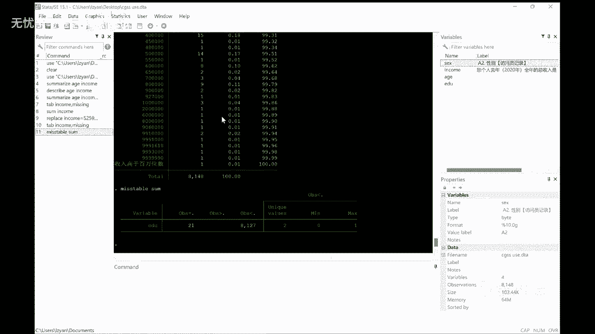

以及啊，那么呃用其中一个比如说均值替代法来处理。

第二个我们刚才说了如何进行多重插补啊，在这个data里边进行多重插补啊，可能相对来说这个呢知识呢可能是超出大家的，一个一个一个一个范围哈，就是因为很多我们的这个这个小白哈。

科研小白可能平时没有没有接触过这个东西啊，但是我觉得还是要呃了解啊，甚至你最好能未来在嗯，在那个进行量化研究的时候，嗯最好能使用，因为如果这样的话，其实对你的文章是啊，包括你的审稿是有。

我觉得是有很大好处，因为呃如果你碰到一些比较认真的呃，审稿专家是吧，那么呃他就会会很在意你，对这个一个是你缺失的比例，每个每个变量嗯缺失多少啊，如果说很少，比如1%啊，或者0%点几，OK那不进行插补。

有问题还不大，如果说有一些变量就是说10%，十二十%是吧，789%这些呢就比较高了，如果说不处理啊，甚至说你直接用那个呃回归删除，那那可能就就很容易受到质疑哈，对，所以呢我建议大家呢对这个呃。

插补法有一个了解，甚至是例实用啊，所以如果对大家呃这个多重差我不了解，那你可以问哈，比如说我问如何在data啊，注意我这儿有标注是15。0版本，因为呃这些版本啊多重插补，他的命令的变化特别大啊。

嗯有些比较复杂，有些比较简单，所以我这儿呢界定了一下是15。0版本以上，对于缺失值啊，怎么进行多重插补，那么下面呢他就啊给你呃，这个是那个国外的那个呃呃工具给出的哈，给出的嗯。

他其实这个呃这一步其实他给出的这个步骤，其实还少一步，其实还少一步，就是你在运行的时候可能就会各种出错呃，这个其实也提示我们说嗯，AI工具呢，它给出的它其实它的页面就会说AI工具，AI的那个那个呃。

他给出的就就有可能会错误的哈，有有可能会错嗯，需要你自己对于一些重要信息要有一个识别啊，有个识别啊，所以我们呢也不能说是完全的，这个这个相信他就是说的对的哈，所以大家一定要自己也有一个啊识别。

或者说有一个一个基础的认知吧，啊就是别盲目的跟着他，所以如果大家运行它这个命令呢，就会发现在第二个命令上就会容易对，有错误提示啊，你赶快试一下哈，第一个m i si am long。

第一步呢大概是都觉得没啥问题啊。

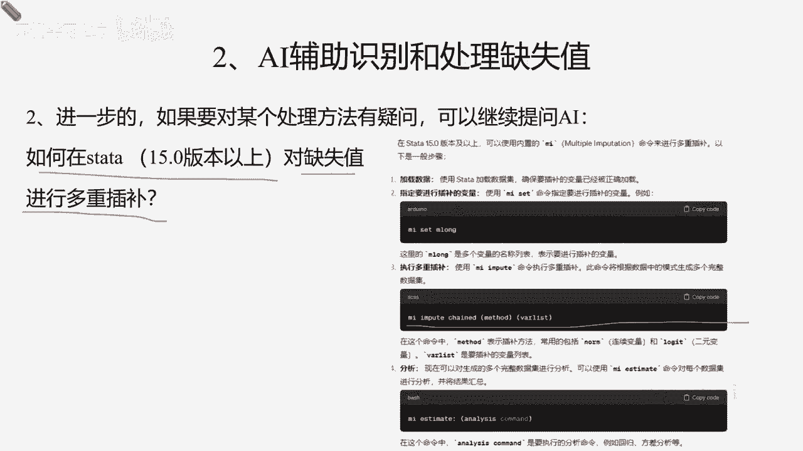

好第一步没问题啊，其实我们用m i set之后，你看右边呃，这生成了三个是吧，三个小的变量啊，咱们不用管它，然后它的第二条命令呢是，直接用MINPUCHIN啊，因为我们这个呃我没有指定哪些变量哈。

所以他就没有说是用哪一，所以他这里边用的VALIST啊，VARIALIST就是让你用变量呃，呃这这个的这一步的话就会出错，因为为什么呢，因为呃我们其实如果看官方的命令的话，它其实少了一步啊。

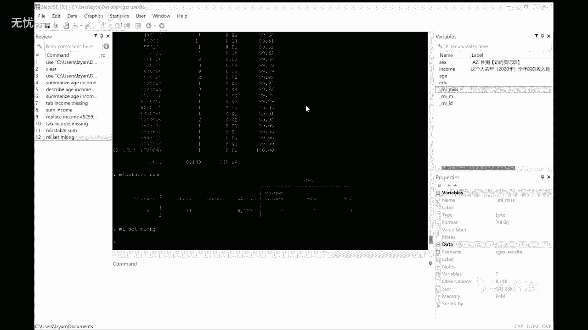

就是m i register这一步，那再回到课件哈，在这一步之前，m i impute impude是插补，在插补之前呢是是少一步的，因为我们看一下呃，你这个时候呢如果说出现错误了。

你当然你可以呃复制再给AI问，他有的时候也也也也我我实验过，有的时候也没法得到一个呃特别完整的答案啊，完全所以我们这时候呢可以借助官方的额选，官方的这个帮助文件就是help啊，M i。

help mi之后呢，他会提供官方的这个mi命令的，一个一个一个一个东西哈啊所以你看有m i set，有i impute啊，嗯最终啊，如果说呃你的这个数据多重插补之后呢。

还有一个m i estimate呃，就是多重多重插补之后的一个回归啊，但是呢这个里边m i set之后，你看最下边啊m i si set之后呢，还有一个m m i register啊。

就是你就是你需要告诉data，哪一些是需要呃这个呃插补的，或者说哪些是那个是有缺失的啊，当然用MIANDROGISTER呢就就给它解除掉啊，解除掉啊，或者m i unset。

还有就是解除它的多重插补状态啊，所以在这个m i set之后呢，要你要告诉data哪些是需要插补的，你告诉他他才知道哈，要不然他不知道啊，所以呢呃我在这个把那个那个命令啊。

我把命令输入到这个额呃AI的窗口之后呢，我就我就这样更具体的给他说了，老是这样说的啊，就是大家在啊投喂的时候呢，也可以来啊接借鉴哈，就是说在以上输入的数据中啊，你直接告诉他哪个变量存在缺失值啊。

收入和呃这个受教育程度是存在缺失的啊，年龄和性别不存在缺失啊，是为什么这样告诉他，因为有的时候他也比较傻瓜哈，他也不知道，就是没有那么呃智能化，嗯这样的话我告诉他哪些缺失，哪些不缺失。

因为它的缺失值是要基于那些没有缺失的，这个变量来进行预测回归的啊，是这样的一个一个一个关系啊，所以我们嗯告诉他哪些缺失，哪些不缺失嗯，然后呢我要告诉他我想干什么，我想对收入进行多重插补是吧啊，我的是多。

我我让你干什么，我让你进行这个收入的多重插补啊，请提供具体详细的STA操作步骤啊，比如说m i sm i register还是i impute等啊，基本上就这三步哈，先set再register。

再impute，然后呢他就给出了这样一个步骤啊，首先am i si long，然后register啊，这个给的很很正确哈，然后呃接下来呢咱们又我又用用这个文心一言，文心言，这个还是同样的呃。

那个额这个这个额头位哈，同样的头位，然后他也给出了你，比如说我们在这个这个我就不再运行了哈，大家直接看这个我们重点是运行那个命令哈，你看呃首先呢加载数据使用多重差m i sm long啊。

然后呢m i register and imputed啊，Income，所以这个呃文夕爷给的答案，我觉得比刚才那个国外的其实还更好，就是更加细致，就是呃首先其实他这这一步就没出错。

那个国外给的那个呢反而出错了哈，然后安and my impute，这个时候呢就开始使用规格放进行多重插补啊，呃然后使用age sex作为预测变量，就是呃想要预呃，这个这个差补的收入等于age sex啊。

逗号AD括号ADD呢是让你插补多少次，咱们之前说过，你插补五次就产生五套新的差次，插补十次呢就产生十次啊，然后他也给你解释哈这个命令有什么作用，然后完成插补之后呢，哎你还可以进行描述。

比如用m i describe income，然后进行回归，比如回归分析m i imate regress啊，然后关闭多重插补啊，所以说其实他的这个文心爷给出的这个答案呢，其实我觉得还是比较好的啊。

比较好，就是说嗯相对来说，他比那个国外的给出的会更加的精准，就是额错误错误的概率呢会更加小一些啊，然后咱们来额具体试一下哈，额，那么因为刚才呢，我对这个收入进行了一个均值差五，所以呢呃我就给他那个啥。

我就给他数据全清掉啊清掉，然后嗯刚才有人有有，咱们有学友问这个clear什么意思，clear呢就是把所有的前面的东西都。

你看我我在这儿是吧，我除了输入一个clear回车之后，那么你右边的这个等于说把把现在这个数据啊，在记忆中就是你的记忆空间中，虚拟存储存储空间中清除了啊，什么都没有了。

这个时候呢咱们再导入刚才咱们用的这个数据，打开啊打开这个数据，那还是按照刚才的咱们呢锦星呃，给他给他把这个额这个主要的变量啊，给他那个啥，给它给它粘贴过去哈，复制粘贴，那么目的呢是让它更加的具体。

那就是我告诉他之后呢，我就可以在这个数据上哎更加的得具体了，哦对了，刚才AI已经告诉我了，咱就不不那个了，我就直接操作了哈，那么按照他的说的命令，第一步呢是m i set是吧，I am long。

嗯这个基本上所有的多重插补的第一步都是am，I said，i'm long哈，这个是呃固定的啊，我们大家写上写上就行了，嗯第二步呢叫我们说了，叫m i register是吧。

呃呃这里边我我觉得有一个问题哈，嗯这样我我看一下试试，OK还行哈，你看我们说了，刚才我们这个通过AI知道，如果说你想对这个这个数据里边，所有的一个缺失情况进行一个了解，特征的一个一个识别了解的话。

他说用M用miss table是吧，miss miss啊，缺失的表，miss table summarize啊，我用这个，那这个结果就能知道，首先收入缺失值814个啊，education20一个啊。

所以我在这个基础上，我知道哦这两个变量是有缺失的，那么我要进行一个多重的插补，那我先进行收入的多重插补啊，然后我才就在这个基础上，我是问了AI怎么来哈，所以刚才我呃进行多重插补。

第一步m i set em long，然后第二步呢是注册，就是你要告诉他嗯，am i register imputed啊，就这前三个单词是固定的啊，前三个命令是固定的嗯，后边呢是你要告诉他。

因为你要对收入进行插补，就是缺失值，你告诉他我要我要要进行插补的，这个是呢是ink，是收入这个变量，额这样的话呢呃这个这个STA就知道噢，我要对它哈，对他，然后进行差，第三步呢就是就是进行插补了啊。

嗯那如果我们采用刚才的m i impute，我们试一下这个，这个是啊，他这应该是，我看是不是应该，regress啊，PUELSE用regret，regret呢，就是因为我们的收入呢是连续性变量是吧。

连续性变量这个括号啊，呃MIIMPULCHANGE啊，这个括号后边这个括号呢是要界定，你要根据你你要嗯那个插补的呃，这个这个这个变量的性质是吧，来决定你是用普通的线性回归regrets。

还是用用LOGI，用OLOGIT是用am logi是吧，如果你比如说受教育程度，它可能是嗯嗯那个那个呃续次的是吧，ordered的，所以你在插播education的时候呢。

就可能要用到这个前面括号里边可能要用到，比如说OLOGIT是吧，等号啊，其实就相当于因为它是一个回归嘛，所以其实它就等于Y等于什么X是吧，呃它它它后边等号后边呢是非缺失的啊。

就是完整的这个变量其实用它来预测嗯，就是前面缺失的逗号ADD啊，我让他缺失了，我让他弄了五次啊，所以你看这个绿色的就成功了是吧，嗯这个这个插补了呃五次，这个时候呢还可以啊，Am i describe。

嗯看哦不对，MARY的这在这个地方也能看得到，你看嗯，他这个给的啊，就是那你也给的M，i describe income去是不对的啊，没有这个命令，所以你看他也会出错，但是我们在上边儿呃。

这个这个呃绿色的这个文件里边，其实也可以看出嗯，imputed814个啊，就是每一个插补他都插补了814个，所以最终呢形成五套呃，如果你不放心呢，你可以回到数据视图，啊或者你看嗯，这个。

其实这些后边8000多，后边它就是一些差五，你看他还有负数对吧啊，这倒没关系，因为它是它是随机的一个一个分布哈，所以他是插播的，然后接着你可以如果说你要做分析的话，在前面用m i estimate。

如regress，啊做线性回归h sex，好这样的话呢呃你看他是不是用的，你看其实呃我们在这就能看得到imputations，就是说差不了五次，但是实际上它的实际观测值是8000，184个是吧。

8148个啊，额因为这五次差补的，他那个数呢是一个随机的随机分布，啧，这样呢就额因为这个收入他不是缺失800多的，如果说你那个不插补，直接删除，你最终你最终那个那个你比如说呃这个，这个变量可以查看。

就这个下划线mi下划线M，这个变量可以查看差补的次数是吧啊，这个零次就是原始的数啊，12345啊，很明显我们知道他已经插入成功了，那么同理啊，这个呃education我们也需要register。

Register，Imputed，嗯嗯是这样，因为呃额我们这已经差不完了哈，其实最好呢就是呃还是用那个原始数据，就我们用clear，然后呃因为我怕造成一些额差错啊，所以我们在原始数据上进行插。

Am i said i m long，然后empty a register，education嗯嗯然后这个时候呢，因为education它是一个你可以把它看成一个序次是吧，所以这个时候你给他括号里边。

这个界定应该可能选OLOGY的比较好一点，好了，然后弄完了哈，然后你再进行回归啊就行了，所以这个呢是嗯插补，就是说对于那个有缺失啊，比较严重的，尤其是额达到5%以上的这样一个比例。

最好是额进行嗯这个插补哈。

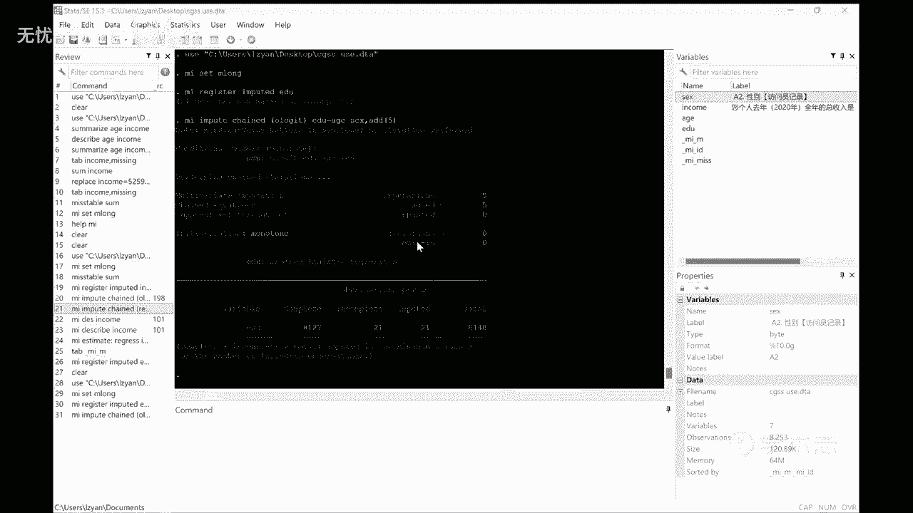

那么接下来是异极端值啊，就是所谓的outlier啊或者异常值，这个呢也是呃，就是也是对我们的结果产生非常不利的影响，尤其是如果说你的极端值特别多的话，啊那么什么是极端值呢。

是指数据集中于大多数的观测值相比，有异常高或异常低啊，就是要么高要么特别低，要么特别高啊，就是也就是他跟一些集中的这种趋势，距离比较远的好，那么它对于我们的这个这个方差标准差，产生一个极大的影响。

尤其是在回归里边是吧，我们这回归是一个一个这个最小二乘法啊，就找到一个额最近的，但是就像我们说的被平均是吧，你一个特别大的或一个特别小的诶，一下子就把这个均值给拉高或拉低了啊。

所以说它对我们的回归结果呢，也是非常不利的啊，那极端值的处理呢，其实跟啊前面那个缺失值呢有一定的类似，最简单一个是呃识别完之后呢给他删除，这是最简单的，但是如果说嗯比较多的话。

它也会影响这个结果的准确性，第二个也是替换，比如说你用均值替换是吧，这个其实也是嗯，跟那个呃叫缺失值的，处理方法也比较类似了是吧，就是你用均值替换或其他的替换给它换一换啊，呃第三个你可以转换一下。

就是比如说你取对数啊，平方根是吧，一般来说这个呃那个比如经济学里边，他们如果因为一般来说这个收入啊，他的一个分布还是偏态比较严重的啊，就是有极大的极小的特别多的呃。

他们就是经济学或者是这个这种量化里边嗯，对收入取对数比较多啊，因为它也比较好解释，取对数数之后它也是一个比例呀，或者一个百分比的一个变化啊，它还是比较好解释的啊，所以呃对收入取对数啊。

或者说其他的这个比较好解释的一些东西哈，你可以对它进行一个转换，对数啊，平方根还有就是稳健标准误啊，就是呃robust这个这个这个分析啊也行，就是比如说你在回归regrets，后边加一个robust。

它会调整啊，对这个标准物它会有一个调整，那么如何用AI来辅助我们，识别和处理这个极端值呢，啊，额第一个就是我们还是把这个刚才这个数据哈，嗯再进行重新的导入，这个时候呢我就问AI是吧。

嗯因为我们知道了这个收入里边是有极端值的，你比如说我们查看一下，有特别大的是吧，就呃这是多少9900多万啊，就是呃它的分布，你可以我们我们把它转过。

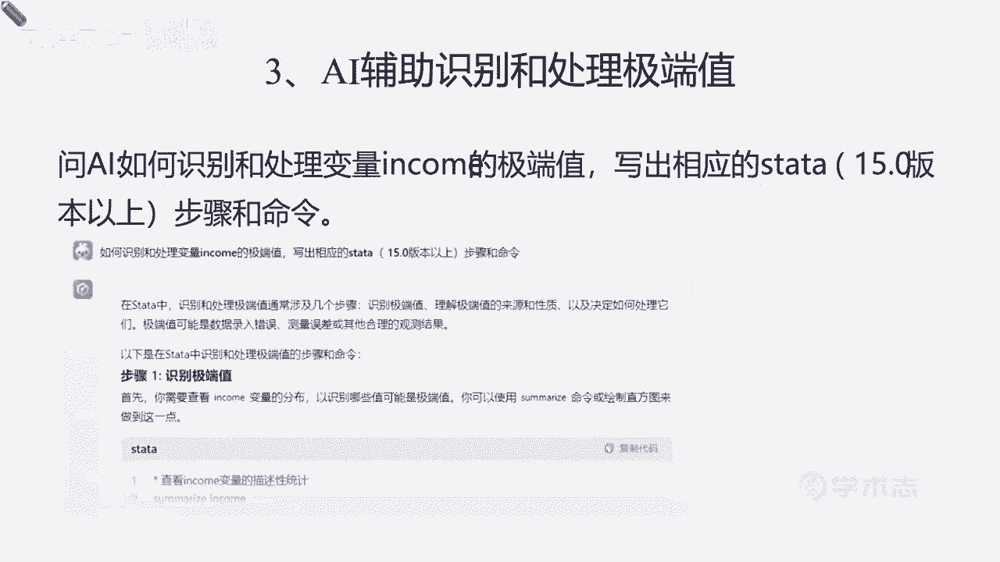

那么我们通过额看这个summarize，对收入进行一个额总结哈，你看他的最大值达到了9900多万，是吧，然后或者说你画一个他的一个他的图也非常的，它的分布是偏态非常严重的，he能看到吗。

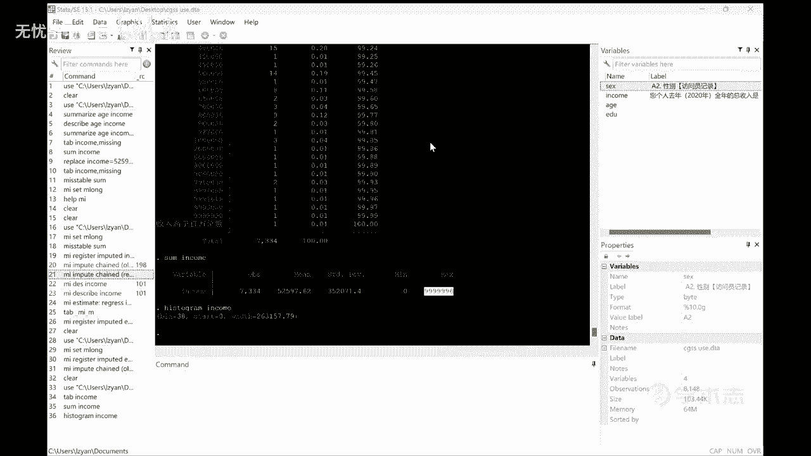

你看他的这个直方图啊，大部分都就是他是一个极端的向右右，右右偏态的是尾拖长长的尾部，所以你看从嗯这应该是200万吧，200万以上，其实一个呃当然是有啊，肯定是有的。

但是他这个这个极端值的情况还是比较多的。

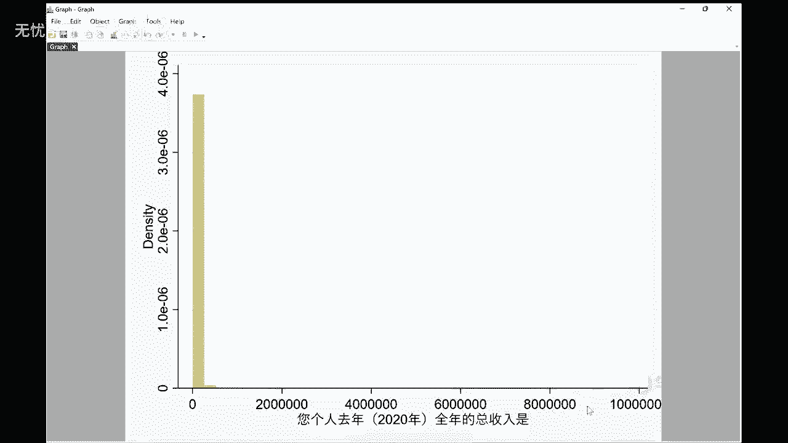

那么这时候如果说呃，我们想识别并且处理一下它的一个极端值啊，然后让它AI写出相应的步骤和命令，然后咱们，因为我这个截图不全啊，我就得重新运行一下，他这儿提供了非常多的方法。

就是每一个这个方法呢他都都都给你一些命令，当然我们也说要注意哈，嗯这个这个内容呢不一不一定完全是正确的哈，大家需要自己去运行一下，然后我们可以看一看，看一看他是怎么说的啊。

他说第一步呢要进行描述性的统计分析啊，用summarize describe啊，呃看一下咱们这刚才第一步看了是吧，有很多的这个缺失值，第二步啊，基于这个描述性统计结果啊，你可以设定一些规则。

就是你要确定哪些是极端的是吧，超出额1。5倍的是吧，这个或者说额小于1。5倍的啊，这个命令我之前啊试过它，我试一试哈，这个这个好像不不一定完全正确，我们也不一定完全按照他的这个哈。

我们其实知道他的那个哦，这个没问题，他这个命令是这个是没问题，然后呢我们在呃list if啊，就让他把这个极端值呢，你看他是怎么定义的啊，它定义的这个极端值呢，是那个首先定义这个间距是吧。

就是第一第三四分位减去第一四分位，就是说这个呃，然后给他啊，小于这个1。5倍和大于1。5倍的是他的，就是认定就是一个极端值，啊有这么写就这么写，那么怎么处理呢，首先你识别了并且标注了这些极端值了。

是吧啊，不管你是用什么样的啊，他是用通过生成一个新的变量，就generate啊，JEN就generate缩写生成呃新的变量啊，extreme income啊等于什么呢，这样一个公式啊，大家甭管它。

就就给他copy过来就行了，然后呢嗯要么就删除drop是吧，drop是删除呃，第一步要么删除，你可以选择嗯，嗯要么就是中位值替代，用中位值或者用均值替代replace income，等于它。

如果它啊咱们用假设说哈，用均值替代一下，看这个就就就不对了，这个函数啊，他这个是不对的，没问题啊，这个时候我们知道刚才收入的均值是多少，收入的就是52597是吧，579哈，假设我没记错的话。

好我们把它这个均值给他替换掉就行，替换成一个数字啊，因为你看这这啊，因为报错了对吧，红色的就是诶没看到啊，Sorry，把这个嗯。

这一步是刚才我用的list啊，就是把它的所有的极端值它识别，就咱们自己定义的啊，即超出或小于1。5倍的这个间距的啊，这个这个极差的这个这个东西嗯，然后呢它我用的如果是均值替代，你看我用了他的命令之后呢。

他是输出一个啊红色的，大家注意，红色的就是错误了啊，这个这个命令是错的嗯，那我知道我就知道了，他不是有均值替代吗，那我就收入的均值，我们之前我记得之前是52579啊，就假设是这样的，咱们给他替换掉哈。

这样的话就就就OK了，还有差值法啊，差值法替代这个，你们呃如果感兴趣可以自己去再去那个用一下，还有比如说你还可以直接删除掉是吧，drop啊，drop是删除的意思啊，删除如果啊它嗯看怎么写。

其实我们这个你看他7000多个删除了嗯，我们看看还剩了多少，那没有了哈，那为什么呢，是因为我们这个界定这个极端值，它这个标准还是比较严苛的啊，所以可能说很多都落入了这个，极端值的范畴之内。

这时候你就要自己来调整，比如说你界定说啊900万以上，或者说是嗯嗯收入低于呃，低于十或者怎么样的啊，为呃这个这个呃极端值啊，这样的话你再删除也好啊，或者用替代啊也好，就呃也也是OK的啊。

总之呢就是说呃你你不太懂的或者说什么的，你可以去问那个啊AI哈，一般来说都会嗯能够给出一个比较正确的嗯，或者说我们你如果可以接触到多个AI工具。

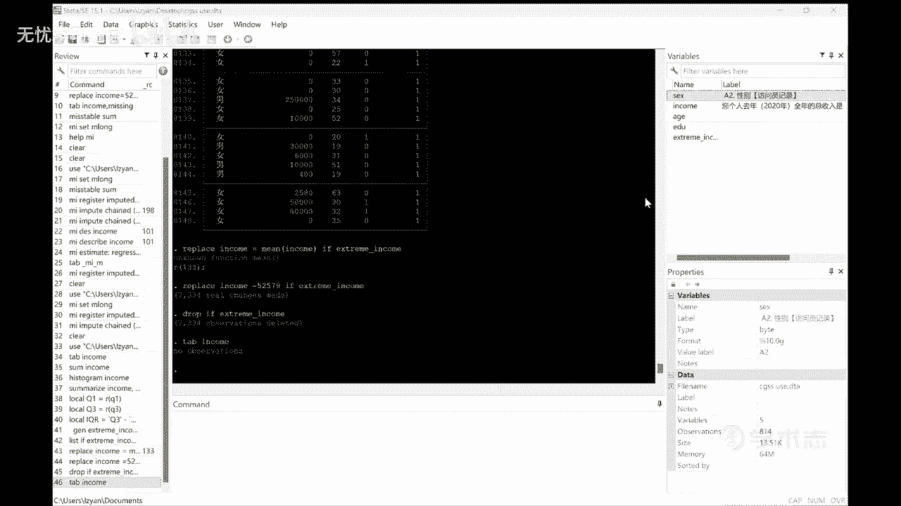

可以多个来都来实验啊，最终得到一个呃比较呃符合的一个一个答案哈，呃然后呃历练习案例展示，咱们之前已经做过了啊，那么呃其实今天的课程内容呢，呃有的同学可能觉得简单一点，但实际上它以最背后的一个思路是一个。

首先是我们对一个呃数据的一个呃整体的认知，然后怎么去描述分析，怎么去处理这些清理啊，尤其是这个缺失值和呃极端值，恐怕可能还没有那么呃特别特别大影响啊，除非那种特别极端的啊。

但是缺失值呢它的影响相对就会大一些，所以重点呢咱们再去呃研究研究这个缺失值啊，怎么用AI哦，给大家那个那个工具啊，那个那个呃这个一步一步骤也给给大家了，然也也怎么去问啊，问这个A呀。

嗯然后今天的课程的主要内容咱们就讲完了，然后我们休息2分钟，我去弄点水，然后呃大家如果呃我们在线的啊，在线的学友如果有问题，我们可以额来交流，好啊，没有卡啊，没有卡，那个呃是因为我们课程上完了。

然后大家有有问题的哈，我看我看也有人群里问了，等一下，额删除了一些变量或删除一些值clear之后，额没法还原哈，所以我我我大家在那个用的时候，我建议呃，如果要对某个变量进行进行这个呃操作啊。

比如说你要你要替换或者怎么样呃，不建议大家在原原始变量上嗯，你可以先生成一个新的变量，等于这个变量，然后在这个新的变量上进行修改，这样的话呢，如果你的新的变量有任何的问题，你还可以嗯。

比如你把新的变量删除，你再生成一个新的是吧，新的等于原始变量，就是它它有无限的可能性，但是如果说你在原始变量上进行各种各样的操，作修改的话，一旦出错，那你这个原始变量就已经变了是吧。

那那么这时候你只能是把呃，把把这个所有的数据要清掉，clear掉，然后导入啊，再导入这个数据再再弄啊，就比较麻烦，嗯多重插补五次是会得到五个估计值，嗯对是五个估计值，但其实他是五套啊，比如说原始数据。

它有1万个样本，然后第一呃生成一套，又生成1万个样本呃，然后第二套1万个样本，第三套1万个样本啊，他说成是多套呃，后续统计呢用m i estimate啊，那个前缀这个在咱们的课件里面都有啊。

可以去看一下，啊最初呃复制数据到微信呃，不用啊，不用把所有的变量数据都复制啊，因为我们呃我们呃因为那样你如果你的变量，比如说有有有有有几百个哈，这个有1万个数据，那那太大了，没有必要。

因为呃咱们的呃AI呢，不能帮助咱们来进行操作啊，它只能给你提示给你这个，所以我们只要把比如说我我我的分析中，可能要八个变量，我把这八个变量的，比如说前十个甚至是呃前两个和前五个。

这个呃这个这个样本给它复制粘贴到AI窗口，其实就够了啊，因为我就是为了呃让告诉，因为AI呢它是不断的训练的一个过程，说所谓的这个这个不断的调教的过程，就是嗯嗯你你只有有前因才有后果是吧。

你告诉他前面的东西他才能反映出哦，我要沿沿着这个思路来进行是吧，所以我告诉他我要用这个数据，然后我在这个数据基础上，我我还可以，比如说我要对哪个变量是吧，因为如果没有这个数据输入的话。

你说这个变量A变量B他不知道呀，他他他他的记忆中没有存储这些变量是吧，所以他的目我们的目的呢就是越具体，我们答得到的答案就会越越越接近啊，所以最好第一步是把咱们把这个呃，要分析的变量和部分啊。

就前几个嗯给他复制啊，进去就就OK了，告诉他我要在这个基础上进行啊分析啊，怎么怎么样，这样了，啧对额，确实哈呃不光是嗯我相信每不管哪一个AI，它都不可能做到完全正确呃因为怎么说呢。

因为它是一个文本训练啊，文本搜集呃，包括他自己的一个处理，所以有的时候他的处理呢不是咱们人类哈，嗯有的时候他确实处理不到位，嗯我呃对于呃这个不熟悉的同学，如何辨别第一点呃，很好方法。

最直接的方法就是你把那个他给的呃，这个命令给它输入到theta里边，如果报红色，绿色就对了，红色就是错了，红色错了之后呢，你可以把这个出错的这一部分啊，就包括命令加出错的提示，你再给它到AI啊。

告诉他这个出错了，让他修正啊修正，然后他就会诶抱歉我的命令是错误的，然后应该是这样的哈，然后再这样的一个一个啊一个循环啊，这样一个一个呃问问呃，交流吧，算是还有一个呢，就是咱们呢也可以多准备几个AI啊。

你看这个国内文心语言啊，如果是有有有条件的，可以用国外的是吧，也多问一问啊，因为不同的AI给出的答案呢不尽一致啊，MI过程中一定适用不缺失变量啊，对啊一定是用不缺失的额，你缺失的是不能呃。

不能用来插补那些缺失的哈，一般选取哪些变量去估计需要插补的变量呃，一般来说就是那些嗯也像性性别年龄，一般来说可能不缺失，还有其他的，就只要你的这个变量中有，你觉得呃这些跟啊。

你要插入的这个变量关系特别大的，而且没有缺失的都可以用啊，但是也不是越多越好啊，可能五六个是吧，五六个以内就就挺好的，因为越多的话，它涉及到这个预测嗯，也不要太多，我们说过犹不及是吧，过犹不及。

安装outrack to提示java installation of f嘶，哎我还真没碰到过这种信息，这种问题，是java的问题吗，嗯你要不要重新安装java，呃，我还真没碰到java的这个这个问题呢。

一般情况下是，反正我之前安装的是没问题的，alright to嗯，还有一个就是方法，就是你用那个find it or react to试一下，当然你这个你这个问题主要是java的问题。

所以可能不见得有效，但是你可以试试反这次再有的还不行的话，可能就是你电你电脑的java嘶不行吗，你用这个呢find it，I'll react to，然后呢嗯你找到那个他的。

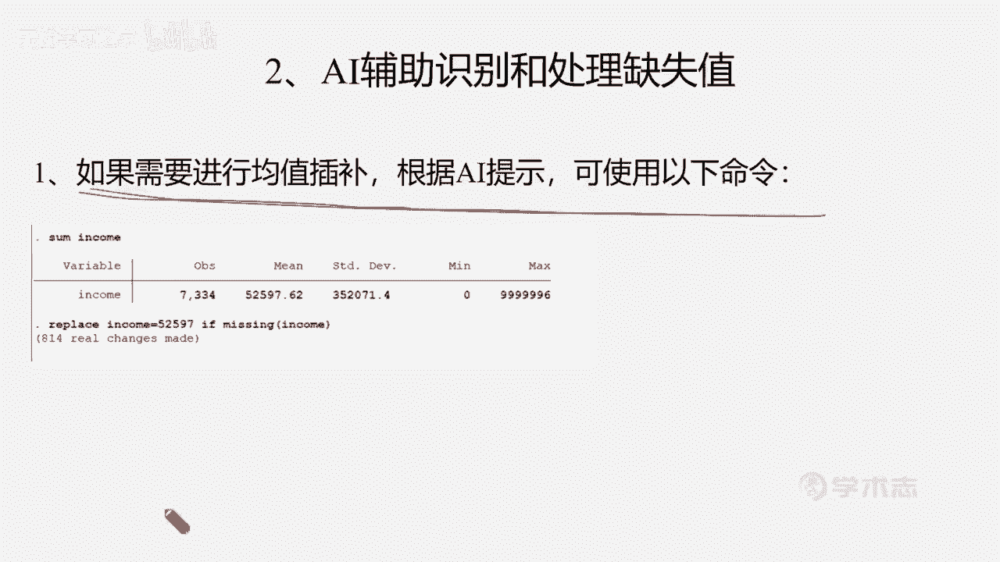

是这个find it，因为我这个里边已经已经安装了哈，你看我刚才输入了find it，就是查找out react to这个，然后呢他就会输出，只输出这个能看得到吗。

输入这样一些链接，然后你在这个链接里边呢，它其实安装链接哈，找到这个，I'll react to，你看在这呢点击这个链接，然后在它下边有一个一个click here啊，点击这儿来安装，然后他就查找哈。

你这个有没有安装过，你就稍稍等等一下啊，因为我这玩呃，原先安装过了，所以说嗯他说alright all files就是所以已经存在了。

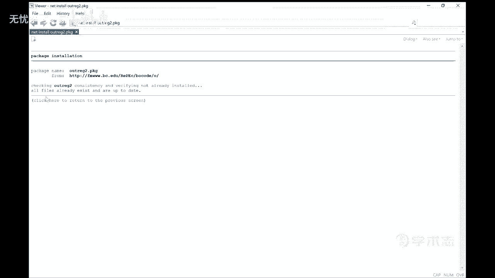

那个你可以试试，这个如果还是不行的话，我我还真不知道是怎么是怎么个回事。

因为我确实没碰到过这个问题，或者你去问一下AI问一下，安装out right to的时候，电脑的提示，你看我在我我给你演示一下，我在A2上问了一下，他还真提出了一些解决方案哈。

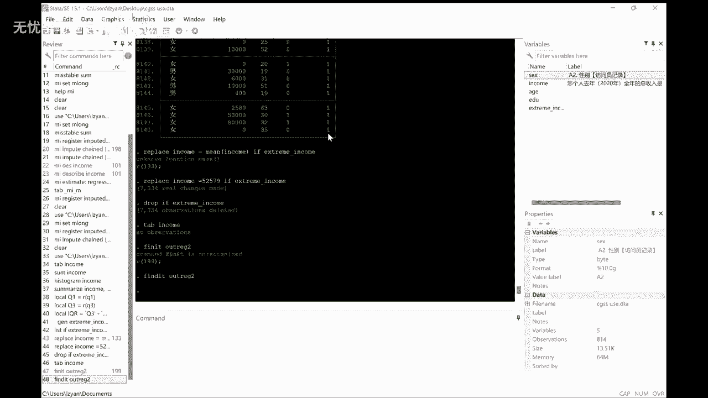

他说我是这样问的，就是说呃我在安装on direct to的时候呢，电脑提示是java is doinno found啊，你看他的，他知道i rec就是一个state中常用数程序。

怎么第一个就是嗯确保已经安装了啊，第二个呢更新它的版本，第三个检查它的设置呃，用这个java set来指定java的安装路径，你可以试一试哈，重启state等等，一般情况下是安装是没问题的。

我估计是你的电脑应该是有点问题，然后呃我我姓杨哈，不是陈老师杨哈，使用AI提问的方法，是学习STA最快最有效的途径吗，刚才有人提到命令手册，呃我觉得这两个是不是相悖的哈。

命令手册首先你要知道这个命令是什么是吧，比如说我要说那个重新编码是什么命令，也就是说如果我们不熟悉data的话，可能你就不知道是record这个命令是吧，所以我觉得使用命令手册。

当然是可以非常快地学习它的详细的规则命令，但是前提是你要知道你执行的这个命令啊，执行的这个命令啊是是什么是吧，这个就显示出AI了，你要嗯AI可以帮助你说诶，我要实现一个什么操作，然后他的命令是什么是吧。

我觉得这两个是相互呃叫什么相得益彰的啊，相互补充，你首先要知道这个命令，然后才能help咳，help这个命令来看他的，手册对吧啊，所以他两个是呃可以相互补充的啊，所以使用AI提问，大家就要学习额。

你额就是说你要你要让他干什么啊，当然是越具体越具体越好，AI手册嗯，我觉得你倒不用下载，就是说嗯，他有一个应该网上可以可以搜得到的哈。

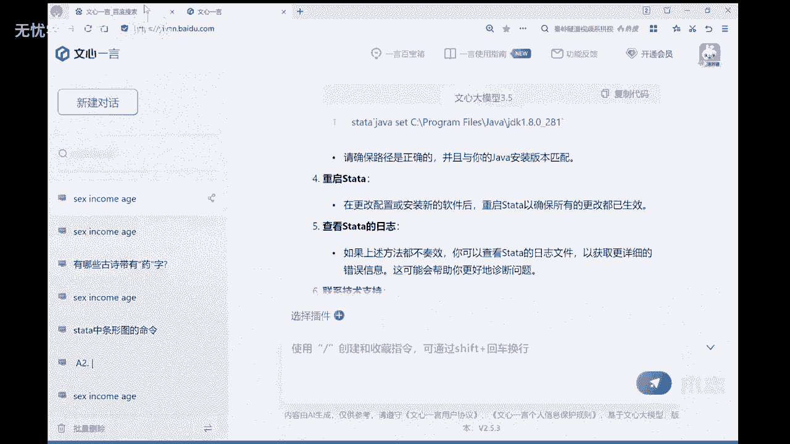

在你安装的那个data的那个help，在这它有一个Pdf documentation，我不知道英我不知道中文版的怎么怎么那个哈，就这。

这个音呃，盖彤同学哈，在这哈，这个这个帮助就是帮助help这第一个PDFPDF文件，这就是说基本上所有的嗯，我共享一下啊，基本上所有共所有的那个那个命令啊。

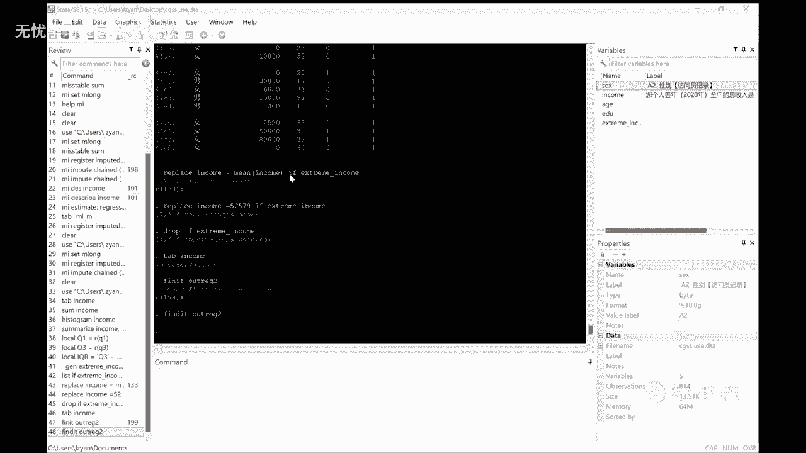

都都都在这个PDF上，但是我我倒是觉得你没嗯。

你可以简单的看一下，比如说嗯data management是吧，数据管理，因为它呃这个PDF它没有中文版的可能啊，像一些这个命令你都可以在这看，还可以搜索什么的，好这个是他的那个手册的PDF版。

好大家还有时还有那个问题吗，我们还有嗯一分钟的时间哈。

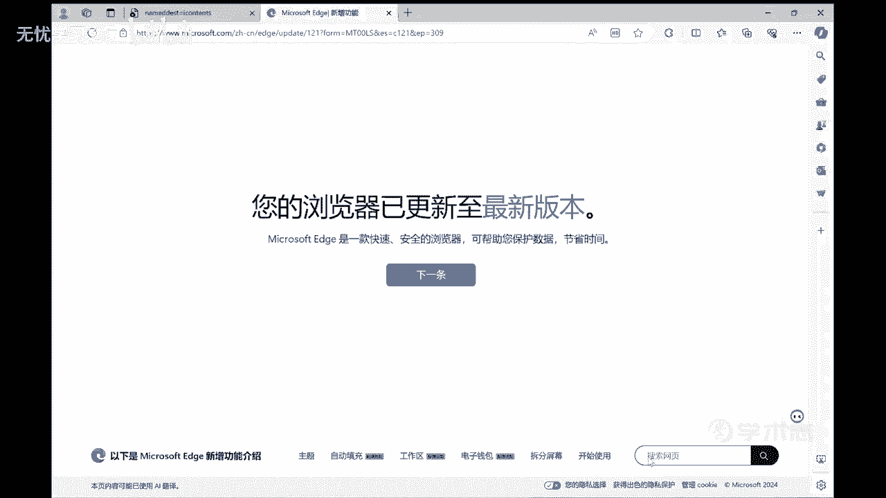

让我看看群里还有没有没有问题，啊那个do file，我后我后边下课整理一下，然后呃争取明天发给大家哈，就是发给辅导员，同那个咱们老师，行，如果大家没有问题，我们时间也到了啊，九点钟呃。

非常感谢大家的这个交流啊，这个陪伴，然后我们今天的课就先上到这儿嗯，也祝大家那个晚安好，那我们就结束哈。

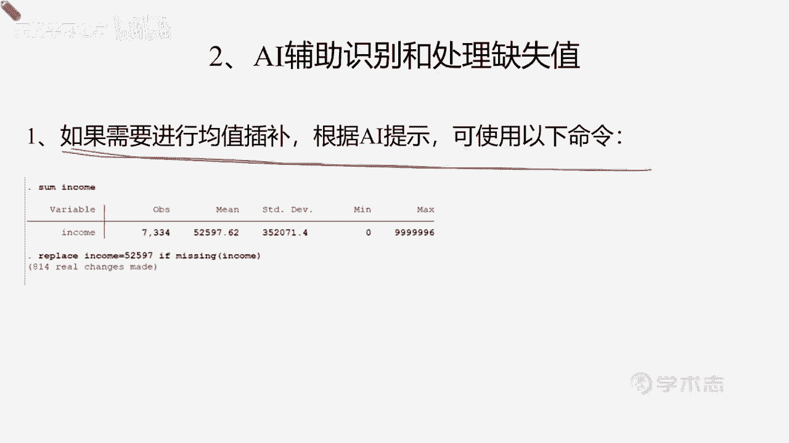