# 6分钟学会，用Python量化所有技术指标 #量化投资 #Python #技术指标 #炒股 #交易 - P1 - 无限超人Infinitman - BV1HB4ReSErY

大家好，我是专注于量化投资的行不行，经常有人在微信上问我，某某技术指标的量化效果到底如何。

我呢之前也出过几期视频进行讲解，这期视频都是讲了一个技术指标。

然后展示他的回测效果，并且呢关于技术指标整体是否有效，是否值得投入研究。

我在之前这期视频结尾讲过，我的看法，强烈建议看一下，然后我发现这样讲解的话呢。

只能治标不能治本，很多人想了解某个指标的效果，只能等我进行讲解，并不会自己写代码得出答案，那我干脆就送佛送到西，本期视频呢我为大家整理了一个，史上最全的技术指标测试大礼包。

根据我准备的这个资料以及本期视频的讲解，你可以零基础的学会如何计算所有的技术指标。

并且测试它的效果，看看哪个更有效，话不多说。

我们直接来看这份礼包，首先呢是这一份数据，我们要判断一个技术指标是否有效，那么就得在所有股票数据上面计算它的效果，首先我们来看看这里面的股票数据，里面有所有的A股，5000多只股票，从他们上市至今。

每一天的交易数据，包括那些已经退市的股票。

有了这些完整的历史数据，我们才能验证这个指标是否有效，并且呢随便打开其中一个文件，你会发现我们已已经帮大家准备好了，这个股票的复权价，我们关于进入指标的所有计算，都要基于复权价来进行。

不然计算就会有错误，当然这里的父权可以是前复权，也可以是后复权，没有差别，懂行的朋友看到这里就知道，光这个数据就很有价值。

Nice，那么这个数据和其他资料组成的大礼包呢，也都是可以直接发给大家的。

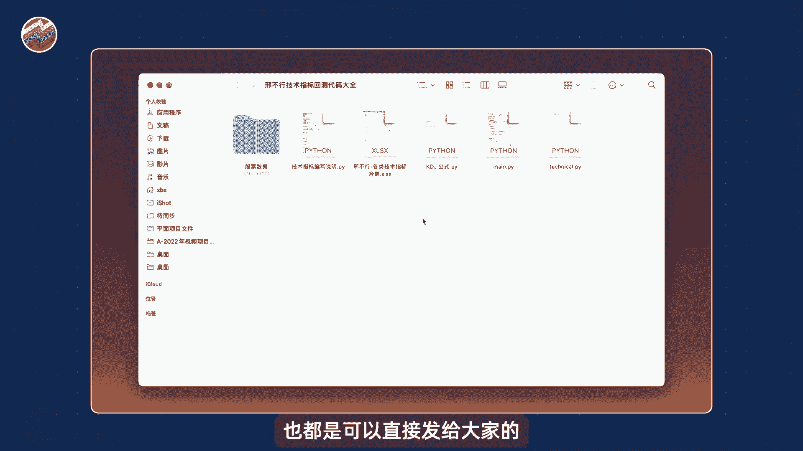

大家可以在评论区留言，看完了数据，我们再来看这个excel文件里面，总共记载了125个技术指标，有它们的名称，详细的计算公式以及他们的中文描述，更觉得是关于这个指标到底如何使用。

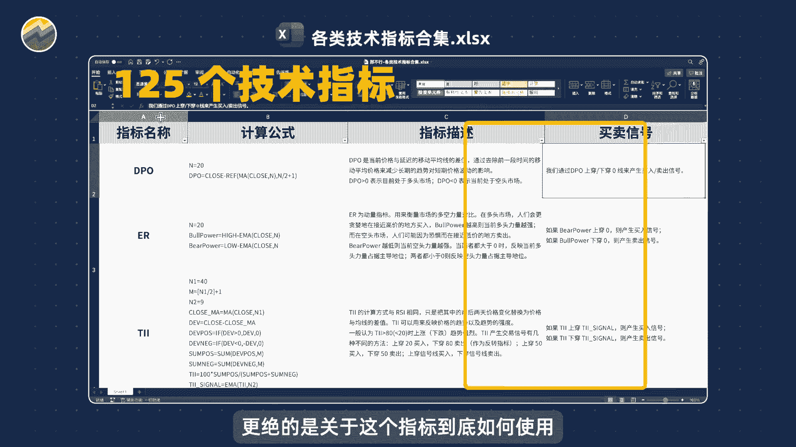

如何产生买卖信号，这里面也帮大家整理好了，真的是非常的全面，最后呢就是我们用来计算技术指标，和验证它效果的Python代码，大家不要听到代码就害怕。

不用担心啊，这个代码是傻瓜式的教程，哪怕你没有任何编程基础，参照我们之后的流程，也一定是可以搞，我们首先使用Python编程工具spider，打开这些代码。

当然关于Python语言和这个编程工具如何安装。

如果你不会的话，可以看我之前写过的这个详细教程。

这个教程也是可以直接发给你的，在评论区留言即可，我们首先打开这个技术指标编写说明文档。

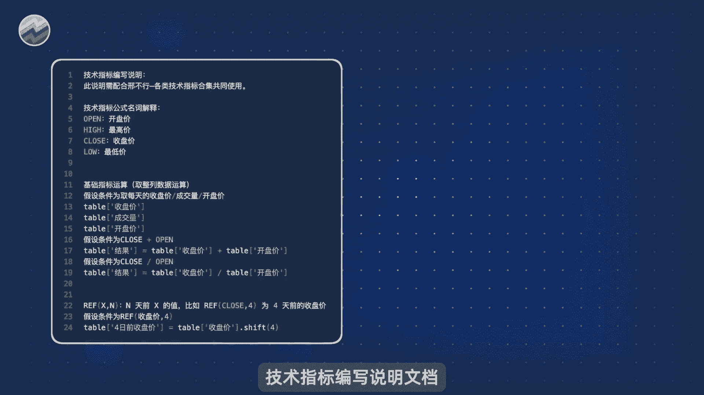

这里面呢是对我们之前讲的技术指标，计算公式进行说明，按照我们这里的说明，就可以完全看懂这里面的计算公式是什么含义，并且可以编程实现，我们来简单看一下这个说明，比如首先他介绍我们文档里面常见的open。

high low clothes分别代表了什么含义，其实也就是我们计算技术指标常用的开盘价，最高价，最低价以及收盘价。

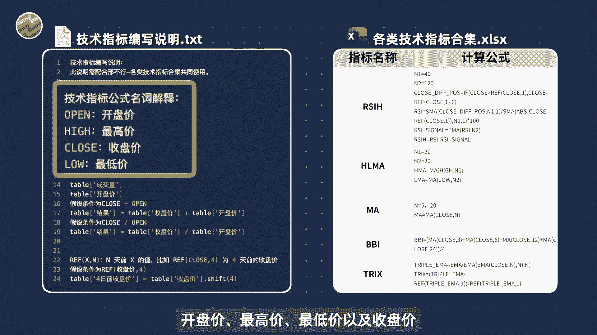

然后呢，假设我想取某个股票每天的收盘价，我在Python编程里面，只要用这样的方式就可以实现table中括号。

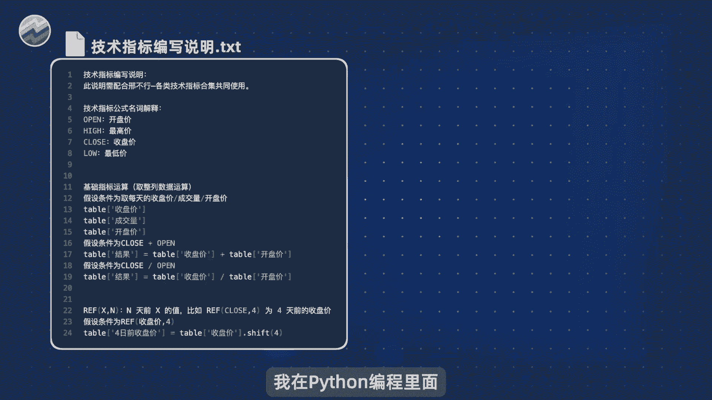

然后里面加上收盘价三个字，table呢就代表我们这个股票数据的整张表格，然后后面的收盘价就代表我们取收盘价这一列，当然如果你把这个收盘价改成成交量，我们就会取成交量这一列数据。

开盘价我们就会取开盘价这列数据。

那么当我们在计算某些技术指标的时候，他可能会要求我们其计算某个股票，它每天的开盘价和收盘价之和，那么我们Python编程实现其实很简单，只要这样操作就可以，我们取出这个股票的收盘价。

然后再加上这个股票的开盘价，把他们的计算结果复制到一个新的一列里面去，你可以给这个新的一列数据取个名字，叫做结果或者其他的具体效果呢，就如图所示，当然如果我们计算指标的时候，他希望两列相除。

比如说用收盘价处于开盘价，那么我们编程实现的时候，也只需要把两年相除就可以，然后另外呢在这个指标计算公式里面，可能会出现REF这个操作，比如说你会看到REF，然后close逗号四。

它的含义就是取我收盘价之前四天的价格，那么其实也就是四天之前的收盘价，那么这个Python编程里面如何实现呢。

其实也非常简单，我们首先呢取出这个收盘价这一列数据，然后后面加一个点shift4，它就可以帮我们算前四天的收盘价的价格，当然如果你把这里的四改成五或者改成六，它也就会相应的计算前五天和前六天的价格。

我们再把计算好的价格，放到新的一列数据里面去，这样就能保存计算结果，那么这个技术指标编写，说明你下面的内容我就不再讲解了，其实它就是详细说明了我们这个技术指标，计算公式里面，你可能会看不懂的一些地方。

以及告诉你如何把这些东西使用Python编程处理。

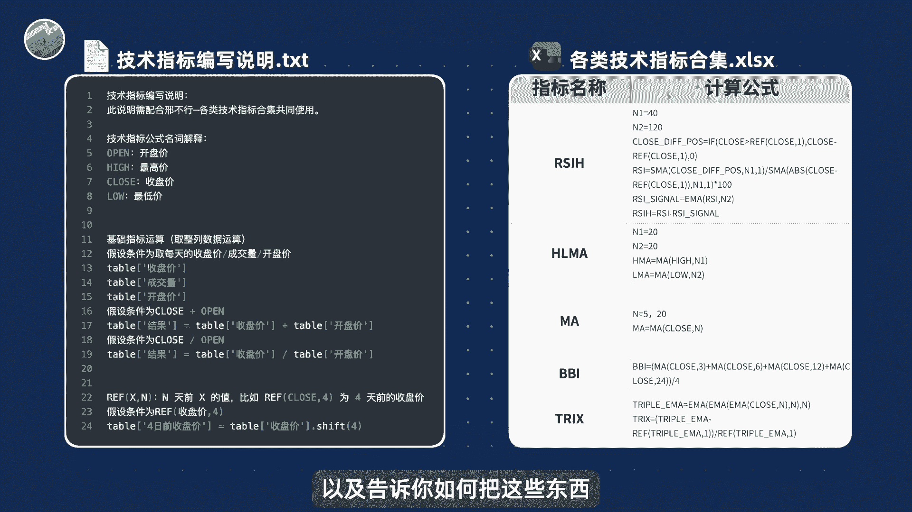

来实现，你完全理解之后，以后计算技术指标只要复制粘贴就可以了。

会非常的方便，下面呢我就以KDJ这个指标为案例，教大家如何使用我们这样的一个编写说明文档，我们首先来看一下KDJ这个指标的计算公式，首先呢第一行它出现了minimal这个计算符号。

那么我们就可以在这个指标编写说明里面找到，minimal这个符号，我们通过阅读就可以理解，这里面这个公式的含义，是计算过去N天最低价的一个最小值，并且呢我们知道代码是这么写。

所以呢我们只要把这行代码复制过来，做相应的修改就可以了，同样的我们看KDJ指标下一行的定义，这里面出现了max这个符号，那么我们就在文档里面找到max相关的说明，通过阅读这个说明，我们就能知道。

这里面它是是需要计算过去N天的最高价，里面的最大值，那么文档里面也有，我们准备好了这么计算的Python代码，我们只要复制出来做相应的修改就可以，那么同样的下面几行指标的计算公式。

我们都可以在我们这个说明文档里面，找到相应的可以复制的内容，我们呢依次复制过来，最终就可以形成我们KDJ指标的计算公式，这样的我们就可以计算这个指标的结果，然后呢关于KDJ这个指标。

我们还可以看到他的买卖信号，具体呢就是KDJ指标当中的K线上传D线，我们产生买入信号，K线下穿D线，我们产生卖出信号，那么这里相关的Python操作代码就是这两行。

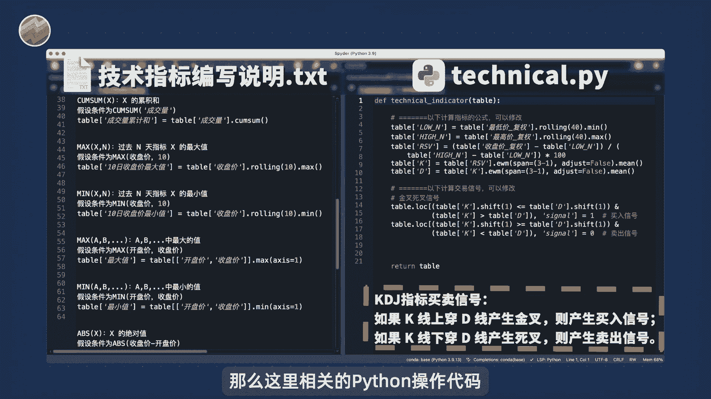

你不用做任何修改，将来如果你计算其他指标的金叉和死叉，那么只需要把里面的K和D。

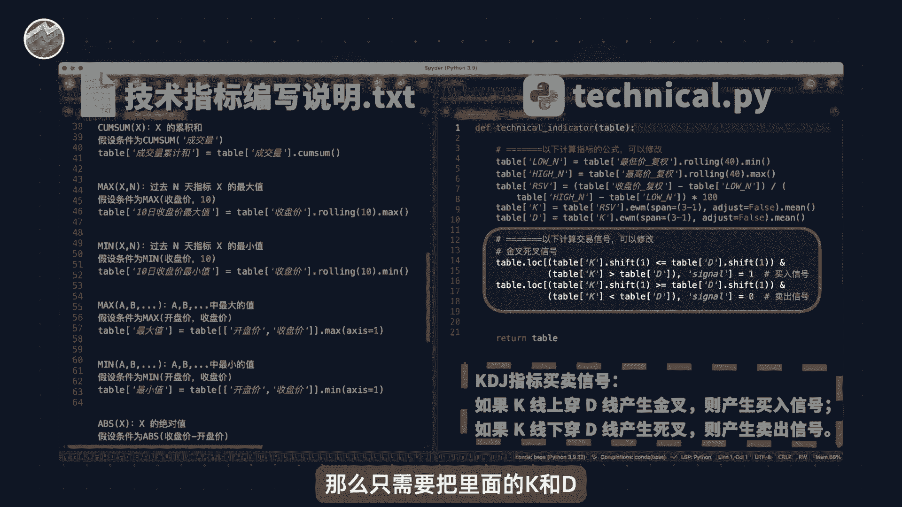

改成你其他的指标名称即可，那么这样的话呢，我们就把KDJ这个指标以及他的买卖点。

都用Python代码编写完成了，接下来呢我们就要打开这个ma点PY程序。

里面的所有内容，你都不用理解，也不用管，直接运行即可，我们这里点击运行，大家可以看到它正在便利每个股票进行计算，不会消耗太多的时间，然后呢这里就展示了计算结果，你可以自行查看，非常的方便好。

最后呢我再帮大家总结结一下。

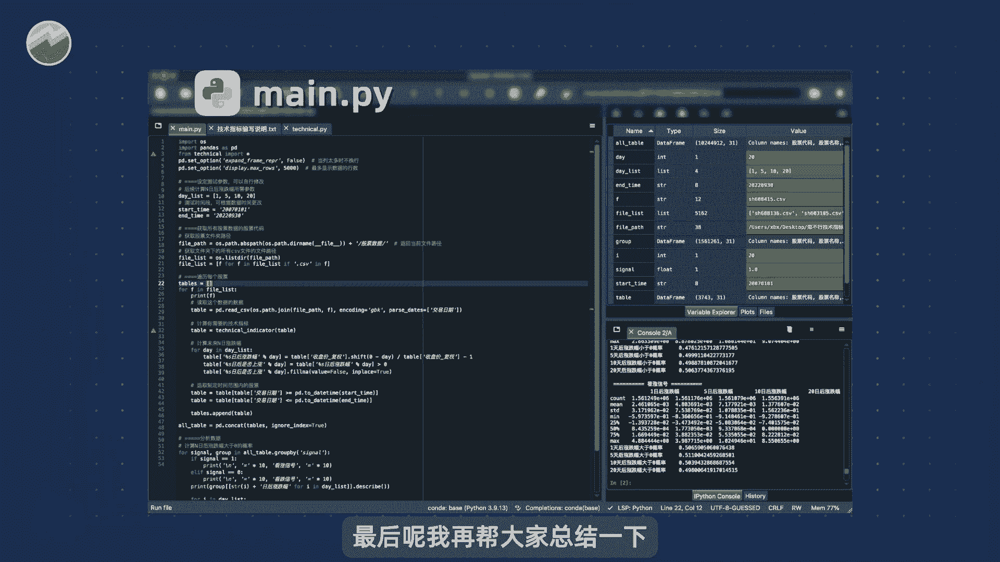

你想计算我们这个技术指标合集里面的，任何指标，只要根据它的指标计算公式。

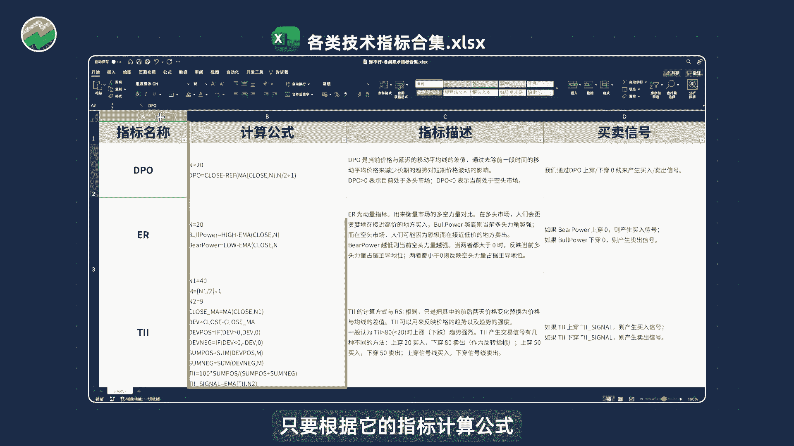

在我们这个编写说明里面去寻找相应的Python代码，把相应的Python代码复制到这个technical。

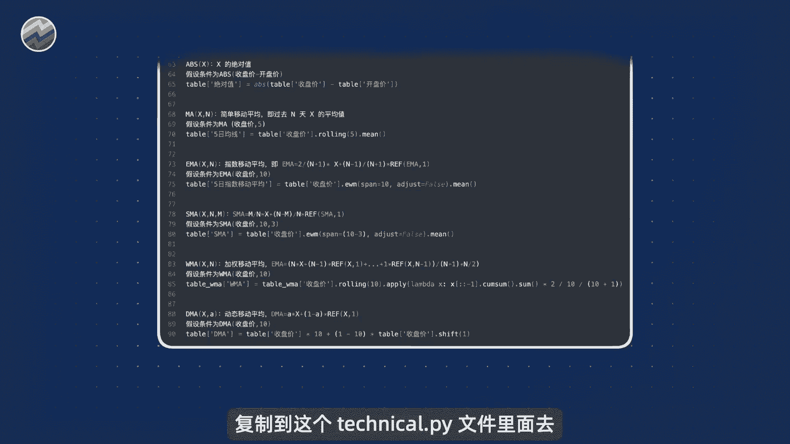

点PY文件里面去，也就是在这里放上你计算这个指标的代码，以及在这里放上你产生买卖信号的代码。

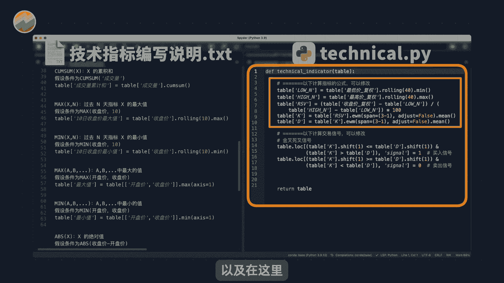

然后点击保存就可以，然后呢我们就运行这个main程序，就能得出完整的结果，强烈建议大家大家可以自己去尝试一下，在整个过程当中，如果你有任何问题都可以来问我。

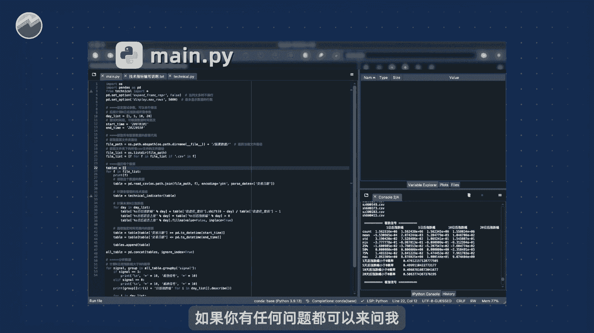

也可以在评论区留言，成功写出了自己指标的同学，可以在评论区多多留言哦。

好那么本期视频就到此结束，我是专注量化投资的，行不行，关注我科学投资。

