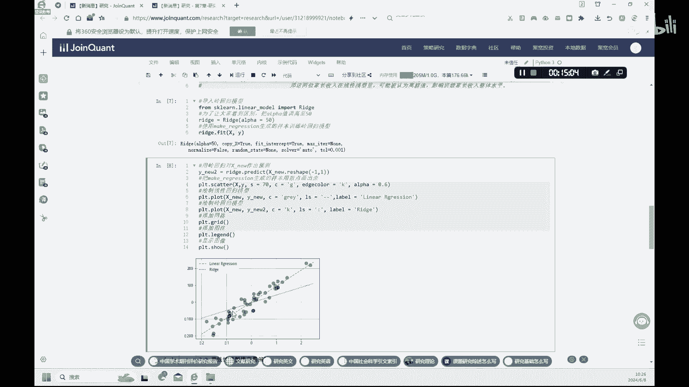

# 7.1【金融科技】机器学习-线性模型 - P1 - 隋UP主 - BV1GADYYmEeF

我们继续来学习第七章，当因子遇上线性模型好，我们首先呢7。1部分呢，我们先介绍一下这个什么是线性模型，这个呢我们在统计课，还有这种计量经济学里面都会学到，我们这里呢只是给大家回顾一下。

用Python代码怎么样来做一下，这种简单的线性回归好，我们首先呢要导入这个线性回归的，这个这个库啊，这个从这个SKYLAR呢这个啊linear这个model里面，这个总的这个大的库里面导入啊。

这个linear regression这个函数好，第二个呢是还是从从这个SKLEARN呢，这个selection里，model selection里面导入这个这个拆分工具啊，这个我们之前用过。

然后呢我们再导入啊make regression这个函数好，Pandas a mattbo lab，还有SBURN这个这些画图工具好，我们呢首先呢用这个make regression呢。

来生成一个随机数啊，随机数呢就是一个X和Y这样的一个，这个这个随机数，因为我们要做一个这个线性的一个方程嘛，它会有X和Y好，这个X和Y呢就是用make regression。

然后呢我们设置这个sample数量呢为50个，生成50个样本，然后呢我们呢设置特征值X呢是吧，这个futures等于一好好，这里呢我们这种噪音呢设定为啊，40就是他的err term是40。

然后呢我们再设定一个这个随机的一个状态，这个随机的状态呢，我们这里就是随便输入一个数字啊，88或者多少，你也可以108啊，或者99都行，这样只要是这个数字是这个样，我们这个随机数呢就不会发生改变。

如果不设定这个数值的话，每一次我们生成这个随机数呢，它可能都会发生一一点变化，好这就是固定这个随机数的一个状态，好我们下面呢就用这个散点图，matplood lab呢来画出啊，我们刚才生成的这样的一个。

X和Y的一个随机数，好大家可以看一下，我们这里呢设置一个散点图的，这个尺寸的S等于70，然后设定这个散点的颜色为绿色，然后呢边缘的颜色呢，这个框子这个框呢为黑色啊啊，然后再设定一些其他的简单的一些。

美观度的一些特征，好，我们下面再设置一下这个横纵坐标的这种名称，横坐标呢X呢我们呢是特征值，然后呢纵坐标呢Y呢它是一个目标值，然后呢我们就可以把这个图形画成这个样子了，好吧。

这个就是我们呢用make regression的，来生成了这样的50个随机数的一个散点图，好，然后呢，我们就可以查看一下，第一个样本值的特征值和目标值，X和Y，第一个因为索引呢是吧。

我们生成的数据索引是从零开始，所以是零呢就是第一个数据啊，XYX0和Y0是吧，我们就可以print这两个数值，我们就可以知道X和Y的值在这里好吧，这第一个你还可以变成X1Y1X1Y2啊，都可以啊。

XXXX2Y二啊，这样都可以啊，好这样，我们可以找到这样的，对应的这种目标值和特征值啊，好，我们下面呢，就是来创建一个线性回归的一个实例，好，虽然我们第一部分呢创建了一个这个，这个50个的这样的样板啊。

我们在这个部分呢先不使用，我们先另外一个，然后第三部分我们再使用一下前面的这个X，刚才生成的这个X和Y这个样本呢，我们第三部分啊来做这个，用刚才生成这个这个数据样本啊，是吧。

我们第一步呢就是生成了一个数据样本，X和Y我们这里呢下面做一个回归啊，我们先先不用啊，先不用上面这个数据，我们重新再来生生成一个数据，好，这个X呢，我们首先呢是模拟这个这个线性回归的话。

我们首先呢先要有数据，没有数据的话，我们先生成一个数据是吧，生成数据的话，我们可以按照上面啊这个方式来生成数据，我们也可以按照这个方式是吧，因为我们有X和YX呢，我们呢可以定义X。

它是在什么样的一个区间是吧，数值在零和十之间，然后数量呢为100个啊，就是啊数量为50个，好就是这样的一个X，然后诺伊斯我们还可以这样定义是吧，它是-2~2。

它的这个error term就是它的这个残差值啊，-2~2，然后50这样的一个设置，然后Y呢我们可以设置成这样哈，五乘以X加六啊，加这个noise说这个就是我们这个先模拟啊，生成一个数据啊。

你用这种方式可以，我们也可以就是把它这种单列出来，XY分别来做也可以啊，这个就是看你自己喜欢，我这里就是给大家介绍了两种方法好，然后呢我们可以创建模型，创建模型呢。

我们还是用这个linear regression线性模型，然后呢再磨这个拟合，这个拟合用这个linear regression来拟合这个模型，拟合就用这个fit啊。

这个fit函数我们把这个这个模型啊拟合出来，然后再进行预测，预测什么预测一个YY的预测值，就是我们这里要生成一个预测，一个one head，就是啊样本目标的一个预测值啊，我们要达到的一个这种线性回归啊。

要找到一条这个y head，这条线就是这里这条虚线，大家看见没有这条虚线是吧，要找到这样的一个虚线，满足什么样的条件呢，他这种这个是y head，与真实的这种目标Y之间的差距是最小的。

我们要找到这样的一个y head是吧，好大家学过统计的话，应该都能够了解啊，我们这里简单带过好，找到了这样的一个y head之后呢，我们呢就开始来画图啊，画图先是画这个这个X和Y这个绿色的这个点。

这个线啊，这个这个绿色的这个点啊，Scatter，然后在plot画这个X和y head这条线是吧，这个y new我们这里名字叫y new是吧，就是这条虚线，我们画出这条虚线是吧。

这里呢就我们就做出了这样的一个回归啊，啊，这里呢我们可以来查看一下，他的这种斜率和截距项啊，Coefficient，还有个intercept，大家可以看一下，我们这里可以计算出它的这个斜率。

还有这种有了斜率和截距项，我们是不是就可以做出一个Y等于啊，14。9X减去6。519，这样的一个这个这样的一个方程了是吧，好，我们呢还可以来预测一下，它的一个这种这个目标值。

我们呢设定啊它的一个特征值为三的话，我们可以预测它的一个目标值是多少，这里也可以啊做啊，这就是一个简单的一个这种，线性回归的一个模型，然后呢我们再看一下，课本上还提到了一个正则化的一个线性模型啊。

好这里呢首先说了一下这个线性模型呢，它有一定的局限性，对于样本较少且噪声较大的数据来说呢，比较容易出现过拟合的现象，所以说呢我们可能会选择其他的这种线性模型，比如说这个正规模型LIL2的一个领回归啊。

领回归是什么意思呢，会对样本特征进行约束，但不会让系数变为零，也就是不会丢失任何一个特征值，等一会我们可会看，为什么他不想丢失这种特征值啊，好第二种正则化的一个模型呢叫做锁套回归啊，这个套套索回归啊。

说错了，套索回归，然后可能呢它是会让系数约数为零啊，也就是会丢弃一部分某些特征的这种样本啊，如果这些样本没有用处的话，我们可以丢弃这样的样本啊，可以考虑啊这种索套回归好，这是什么意思呢。

我们就举个例子来说啊，为什么要使用这种正则化的回归啊，好比如说老师呢在班里统计啊，家长的一个收入水平啊，大多数家长的年收入呢在10万到30万之间，但是呢啊有两位富豪家长说他年薪过亿是吧。

所以说呢这两位家长，如果我们使用普通的这种线性模型的话，这两位家长呢可能啊会认为是什么离群值啊，是吧，他他比较特殊啊，过亿了，其他都都在30%，所以这种离群值呢在线性模型里面啊。

你可能会要剔除这种离离心值啊，因为它会影响家长的一个整体水平，但是如果我们就是要保证是吧，又有富豪，又有普通家庭，这这样的话，我们用线性模型啧，就会出现这种过拟合的现象是吧。

所以说呢我们就会选择这种L2的领回归，这种是吧，但不会丢失任何的一个特征值，所以说呢我们这里啊，就是针对这样的一个特征的情境啊，这样的一个例子，我们选用了领回归好，领回归模型好。

领回归的模型呢就是这个用的导入这个函数啊，润润好，range r i d g e好，我们可以看一下，导入了这个波形之后呢，然后我们设定一个阿尔法值，在这里面设定一个阿尔法值，然后呢。

我们呢就用这种前面第一部分make regression，生成的这种50个随机数是吧，来训练，来训练模型，好好训练完了之后，我们呢就可以啊画出这种这个预测，y head也就是y new2。

因为我们是在上一个例子里面用了y new是吧，我们这里就标成y new2啊，这个WI害我们重新可以来预测一下，预测完了这y head之后呢，我们就可以来画出这样的一个图形是吧，大家可以看一下啊。

比较一下第一幅图还第一幅图和第三幅图是吧，我们用的是同一个数据，所以说这个大家可以看一下，第一幅图和第三幅图是吧，他的一个差别啊，好我们呢画了两个regression，第一个呢是这个长虚线啊。

这个这个这个虚线，这个第二个是点状的这种线，这个这个线性是吧，第一个是长条形的这种代表这种linear regression，就是我们用普通的线性回归画出的一个仲斜线。

是吧一个这个模型的一个y hi的这种这种线，然后这个点状的是我们这种领回归做出来的，大家可以看一下领回归啊，它的一个特征呢，它的一个就是领回归啊，它的斜率是不是要比上面这种线性回归的斜率，要小一些啊。

啊就是也就是说领回归的特征值，前面的这种权重呢要小一些啊，也就是正则化带来的一个结果是吧，大家看一下这个斜率小一些，它是因为正则化带来的效果，什么意思呢，使样本特征中的噪声对模型预测的影响更小。

从而避免呢模型出现过拟合的现象，所以说呢我们呢如果为了防止这种离群值啊，是吧，这里大家可以看一下，这里有两个比较高的这种离群值，这种啊他对模型的影响，我们呢就用这种正则化来降低一下。

这种离群值对整个模型的这种影响，我们就选择啊这种领回归模型的这种结果。

