# 8.1文件的建立写入读取 - P1 - 李一邨 - BV1h7SMYMEYc

那么首先文本文件的建立。

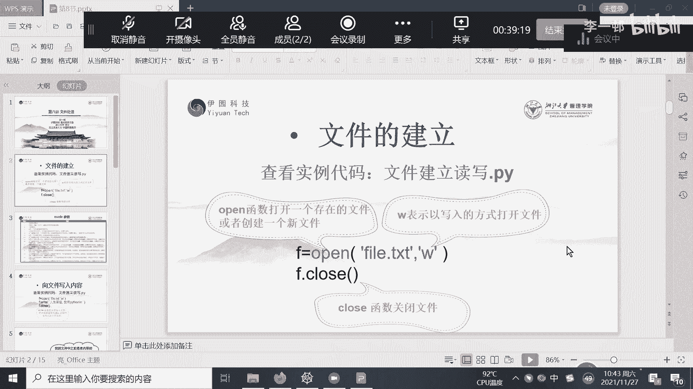

我们直接看实例，首先我们在这个我们要一个open file点TXT，然后用A加这样的一个形式mod来进行执行，那么我们会干一件事情，就在本地，就是当前你所在的路径的文件路径下面。

然后建立一个file点TXT的文件，可以看一下。

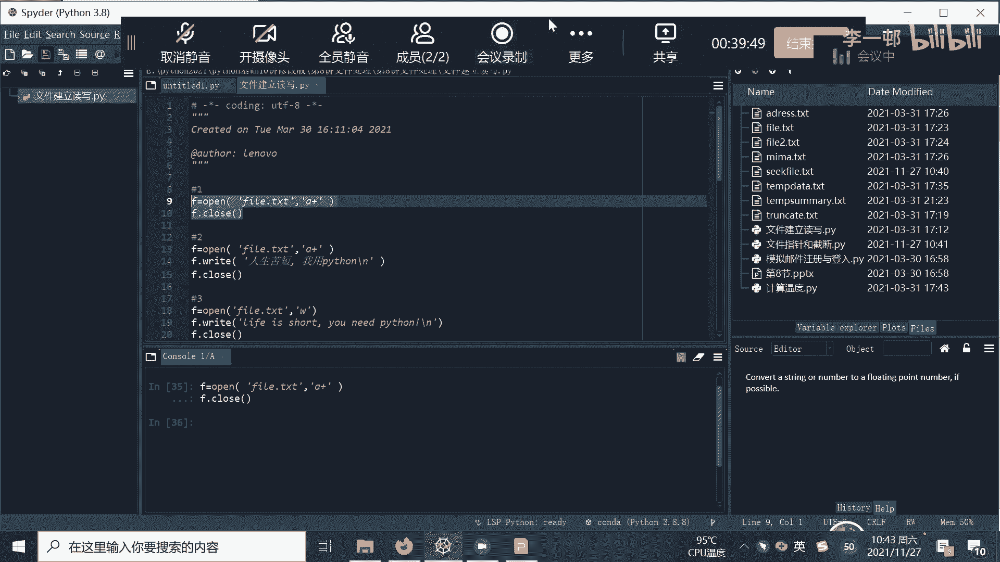

就在这个文件夹下面，bile点TXT，那么我们可以把它删掉，看一下，但是没有了。

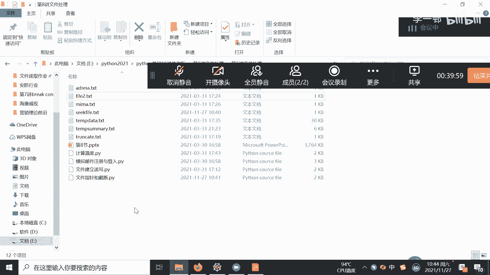

bile点TXT，没有了啊，再看一下好，我们再去看是不是他建立了一样一个TXT文件，这样我们就建立了一个TXT文件，那么我们建好之后，我们干什么事情，我们要进行写，那么我们写入open打开了啊，打开关。

打开之后要关闭，那么我们打开，然后我们要写入write，人生苦短，我用Python，然后回车，这个时候再把它文件关掉好。

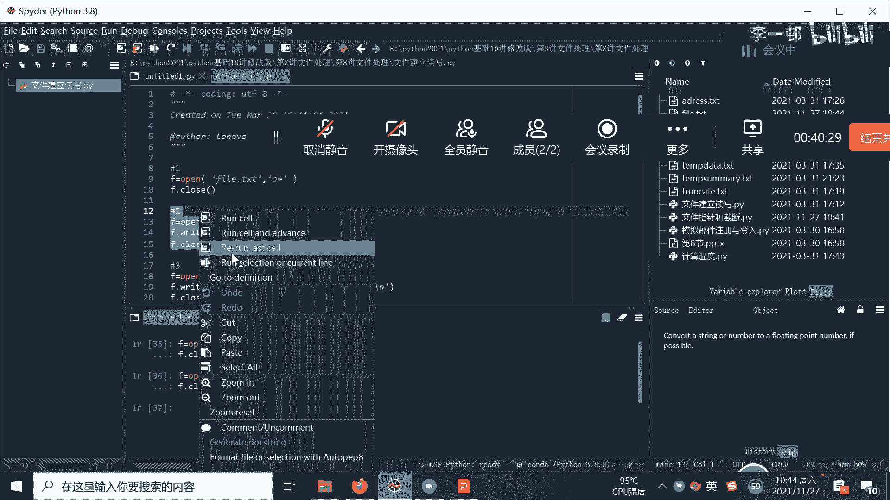

我们这个时候看这个file txt，就我们把这一句话写进去了。

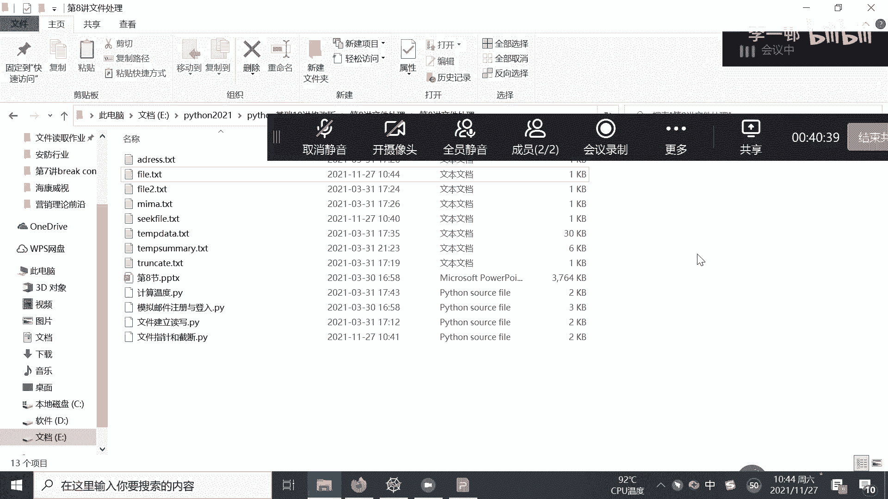

那么我们继续写啊，继续写啊，我们看这个mod跟这个mod是不一样的，我们再看一下它的区别就知道了。

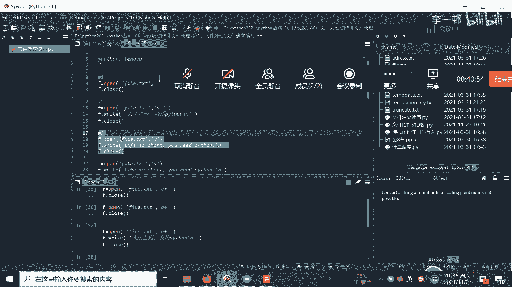

然后我们再看一下，哎好像我们原来写着写的人生苦短。

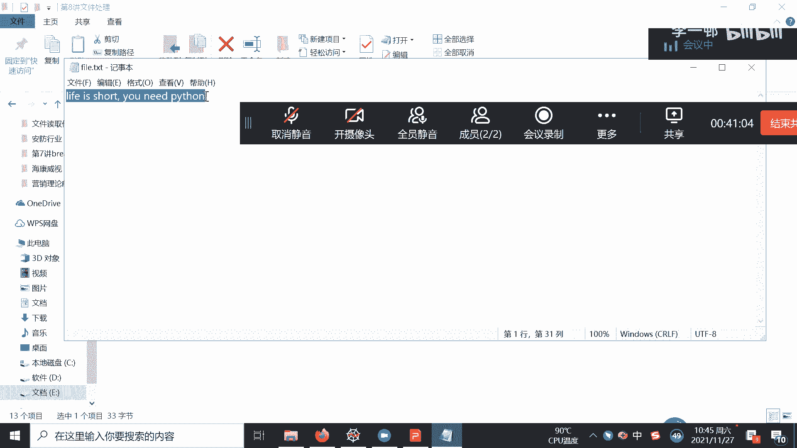

我用Python这个没有了，那么为什么没有了，因为两个A加是追加的形式，这个是直接写，会把原来的覆盖掉，那么我们再来一遍来看一下。

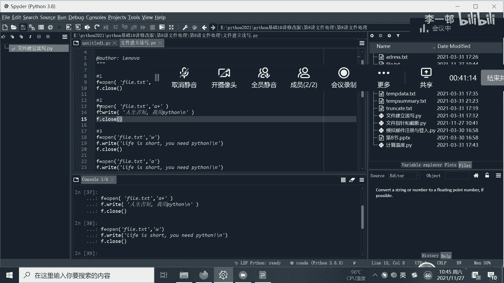

诶看一下他是怎样的，他是追加了一句追加的形式，所以用A加的mod叫做追加。

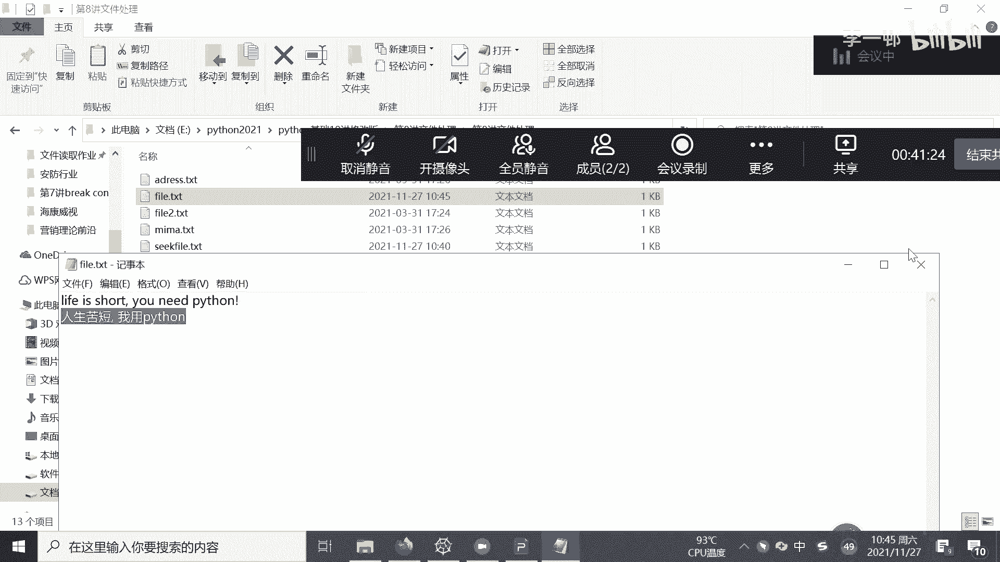

然后用直接用W，那么它就是覆盖掉原来的覆盖掉，从头开始，那么我们再看A。

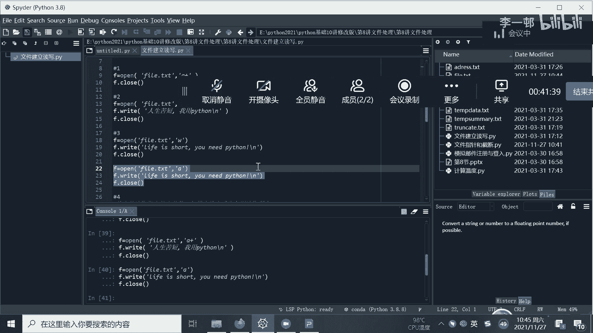

A也是往后加往后加啊，再往后加好，又加了一句。

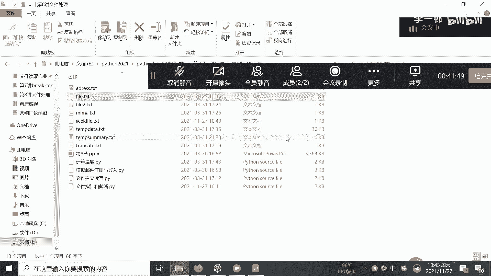

那么我们如果啊我们如果前面写了想了，我们要写，那么如果我们要读取呢，我们看我们现在是read10，我们把这个文件打开，看一下我们的life is s h，那么它是什么，010123456789百一。

工人读取了十个，读取了十个啊，就是读取了十个字节，如果没有给定呢，就是这样子，那他就会读取所有啊，就去读取所有，所以所以我们什么建立文件在文件中写入，然后呢从文件中读取，读取相应的字节。

读取十个字节或者读取所有啊。

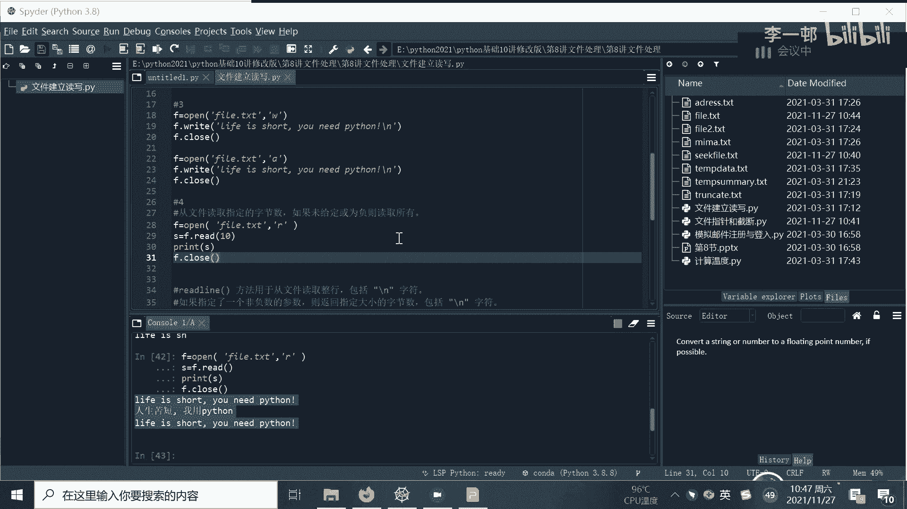