# 【2024年Python】8小时学会Excel数据分析、挖掘、清洗、可视化从入门到项目实战（完整版）学会可做项目 - P27：08 京牌摇号小程序代码实现 - Python金角大王Alex1 - BV1gE421V7HF

OK同学们，那这一小节呢咱们正式来去写这个程序，在写这个程序之前，在你接下来看我接下来的视频之前呢，我希望你至少自己先憋个半小时，看看能不能把它写出来，因为我已经把咱们最里面最难的这个点对吧。

随机输出啊，这个数字和字符串这个已经交给你了，那所以呢，你你你该自己接下来想思路去去写了对吧，然后你自己先憋个30分钟，如果还是憋不出来或者憋出来了，你再接下来看，我现在正要接下来讲的视频好不好。

OK那我就你你你你就暂停吧，OK那30分钟过去了，好吧，30分钟过去了之后呢。

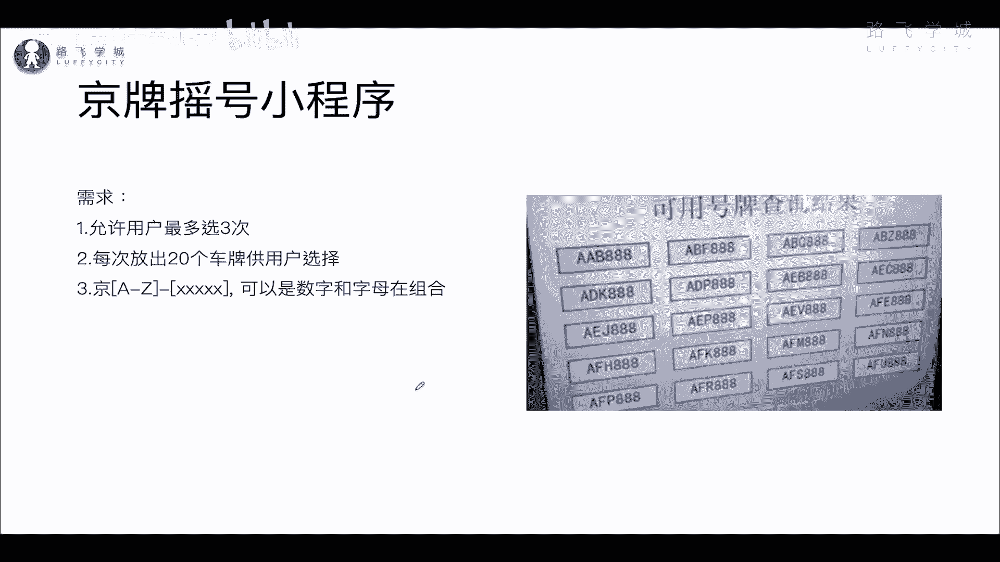

咱们就开始写开始写啊，这个嗯创建一个创建一个叫什么呀，金牌也好啊，我自己听我的视频发现一个问题，就是我说话老有口头禅，总是喜欢说啊，对吧是吧是吧，这个anyway是不是特别是对吧对吧。

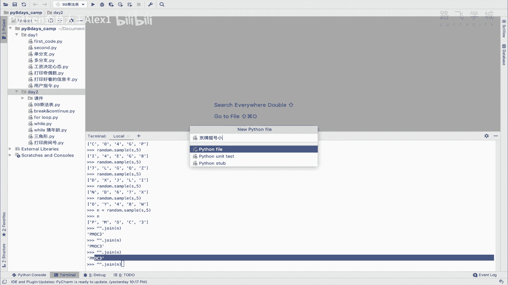

这是这是在线下讲课养成的毛病啊，你要不断的跟学生交互说啊，这个对不对啊，这个是不是习惯了啊，你们包包包含一下anyway，那咱们首先肯定要用到两个工具，是不是一个是random。

再导入一个叫string对吧，先给它导入进来，然后呢咱们嗯先把这个数据源给它生成好，数据源，就是S等于一个就是什么呀，嗯那个数字和大写数字和字母的组合，先给它搞出来，对不对。

就是as string di算了，不用不用不用给它存变量，到时候直接调用就行了。

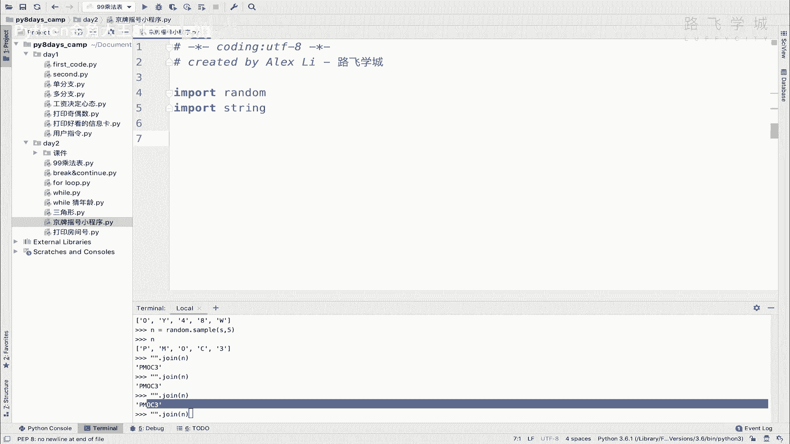

那看看一下这个需求允许最多输三次是不是。

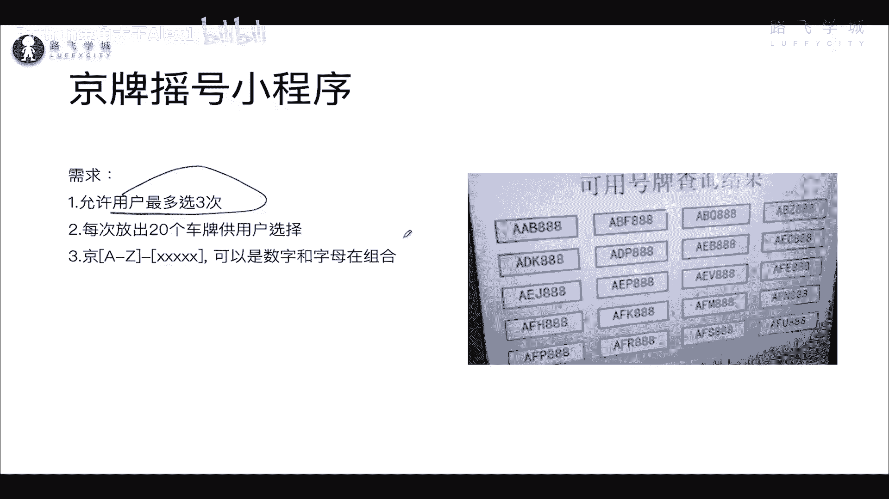

所以呢他肯定有一个有一个循环是吧，咱用for循环，while循环都可以，咱们先挖个循环吧，刚学的咱们给他来个计数是吧，y count小于一个三，对不对，他就是最多输三次。

然后呢咱们就啊这个让用户去啊啊对啊，再循环利，咱们就直接先给先给他什么呀，先给他先给他一个二十二十组号码的选择，20组号码的选择对不对。

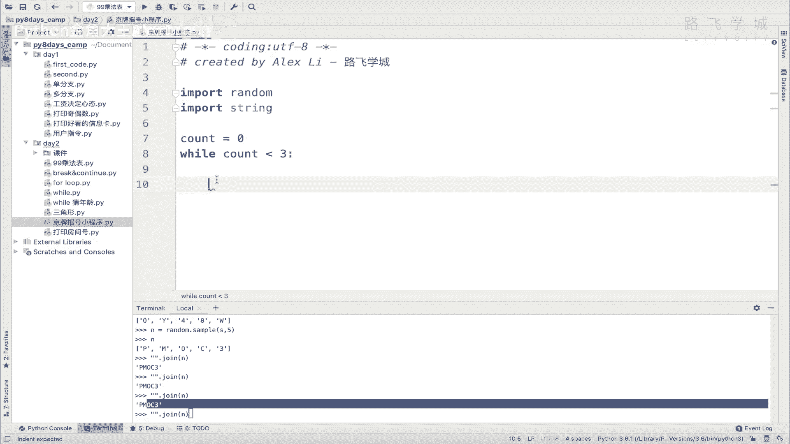

那注意了，你在这里既然是生成20个啊，车牌号对不对，20个车牌号，所以呢那你肯定是，因为因为咱咱调用一次random这个方法对吧，咱们上节课学的调用一次random，它会生成一个随机数。

那你既然生成20个。

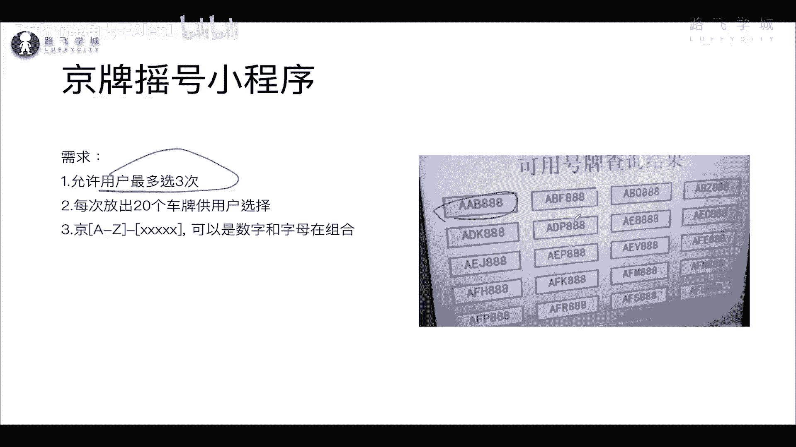

所以那你肯定也涉及到循环，所以呢我们应该是在这个里面还有一个循环啊。

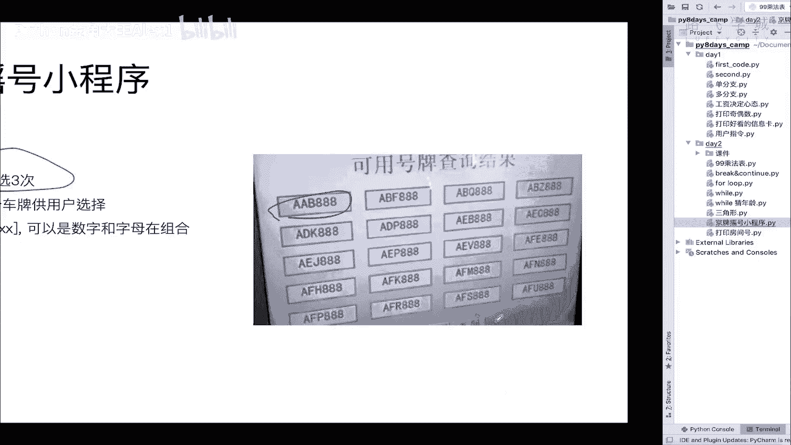

就是for循环，对不对，for循环，For i in range，20，对不对，每一次给它生成20组吗，20，然后呢这里咱们就要开始做这个随机数了是吧，做这随机数了，他是它是呃它那个规则还是对吧。

前边前边这个前边这个，前面那个是一个单独的一组，对不对，他只能是大写的，后面这个是数字和字母的组合，对不对，数字和字母的组合，那我们呃这样先给它生成一个，所以所以所以你要把这两个拼起来是吧。

生成了之后两个拼起来，因为他俩的这个规则不一样，这个是不能有数字的，那现在我们想想怎么给他，那就单独生成了，那就得分分开生成，分开生成因进行两个random，对不对，调两次random是吧。

然后我们先生成第一个啊，第一个就是他的啊，就N1吧行吧，叫N1，然后就是random choice，对不对，然后是string uppercase对吧，这个是生成啊，第一个生成手手字母号，生成第一个啊。

这个这个字母吧就叫字母吧，对不对啊，车牌的第一个字母，OK然后接下来N2就是他后面的那些字符了，是不是后面那些字符呢，相当于是它首先是要啊要有五个组，相当于是这是几个五个，对不对，那五个数字的一个组合。

五个数字的组合就是random点啊，random点咱要用到sample，这个语法是不是sample，然后呢往里边先传输，sample里面有两个值，一个是先传输数据源source。

另外一个是说你写好要输出几个，对不对，那这个source就是什么呢，source就是string点对吧，大写字母加上string点什么呀，小写字母或者这个数字，对不对，哎这是数据源，然后生成五个。

生成完五这五个之后，它只是一个什么呀，它只是一个叫啊列表的形式，对不对，咱们上节课已经学了，它是你看在这里它是一个列表的形式是吧，我们要给它拼成这个什么呀，啊字符串字符串对吧。

哎咱们其实都是都不用涉及到，说把里面的数字像像之前那个报错的时候，把里面的数字给他啊，在哪里，在这里咱不报错了嘛对吧，因为里面这个数字还有字字符串，这样拼接它会报错，用john的话。

但是我们用了这个string的话，用了string的话，它虽然string的这个一个情况就是string点DGES，看到没有返回的这个数字格数字，但是它是字符串的形式返回的数字。

所以就说这样拼的话就直接进行，你看这像数字也是一个字符串对吧，直接拼接是没有问题的对吧，就不用说了，再把里面数字找出来去转了，那个还挺麻烦啊，那我们就不用讲那个了啊对吧。

以后再讲真正讲列表的详细用法的时候再讲啊，这里有跳过anyway，那咱们就直接给它拼接起来，是不是就可以了，哎join，对不对，哎，john那现在相当于你就出现了两个值，一个是N，一个是N2。

大家看是不是分N1N2，然后呢，你在这里让用户去输入，是不是choice对用户的选择，然后input是吧，这个啊输入你喜欢的号是吧，哎strip strip我讲过没有思也没讲过是吧，其实也没讲过。

那没关系，我就在这里给大家讲了，你不就是这样，你呃你直接输入的话，我在嗯一会儿讲吧，一会儿讲吧，现在一会儿在实验的时候再讲吧，好吧，那同志们，咱们这还没写完呢，啊，咱们只是试一下，走到这一步。

咱们先试一下效果，你就直接用单机执行看看效果，好朋友们，大家来看你是不是已经生成了，看到没有，是不是已经生成了，对不对，是不是已经生成了啊，那没问题，已经生成了之后。

我们接下来要做的是不是给它拼起来就可以了，对不对，那嗯咱们就直接F然后经对吧，后面输入一个这个N1，对不对啊，一般一般选的话可能有个点对吧，经N或者是这样吧，这样对这样吧，N2是吧，这不就输完了吗。

对不对，用户想用户喜欢什么，用户喜欢什么的话，你只需要让用户输入这些值就可以了哦，但是用户输入之后，你要判断是不是在这里面，他比如说你输出的是20个，但是你输出的一个，他妈的输入了一个随机输的一个。

你也你也你也认为他选择了那是不对的对吧，所以你这里还要做一个什么呀，你还做一个，就是说你要检测用户输的值，用户在这里输入的这个号码，跟你这里的号码是不是一致，明白这意思吗，你要检测，那你要检测的话。

那怎么办，怎么去检测他输的这个值。

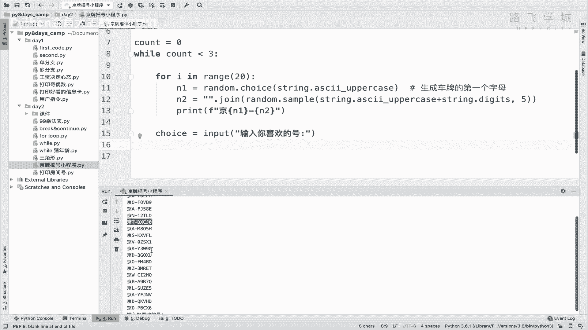

用户随机在这里输的这个值，在这里面，在这里面对吧，怎么检测呀，同志们，加一下能加一下。

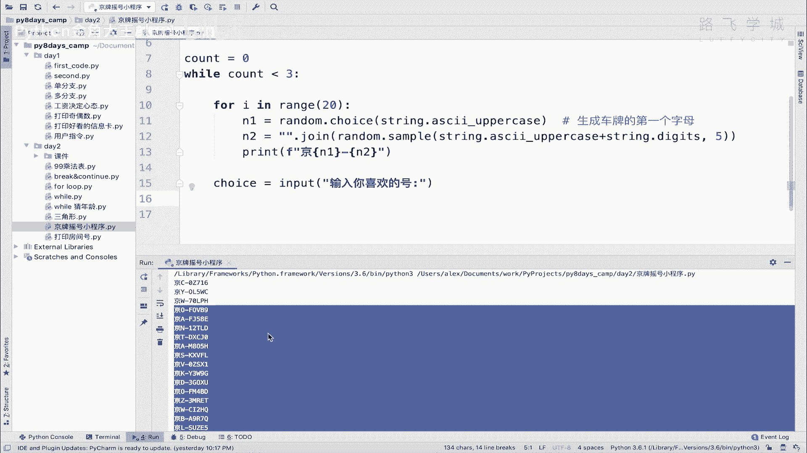

那你要输入这个值判断在这里面，咱们是不是学了列表了，学了列表之后，我们是不是并且学了列表里面，是不是有一个可以判断一个值，有没有在那表里啊对吧，什么什么这个东西in这个列表是不是in列表。

是不是就可以了对吧。

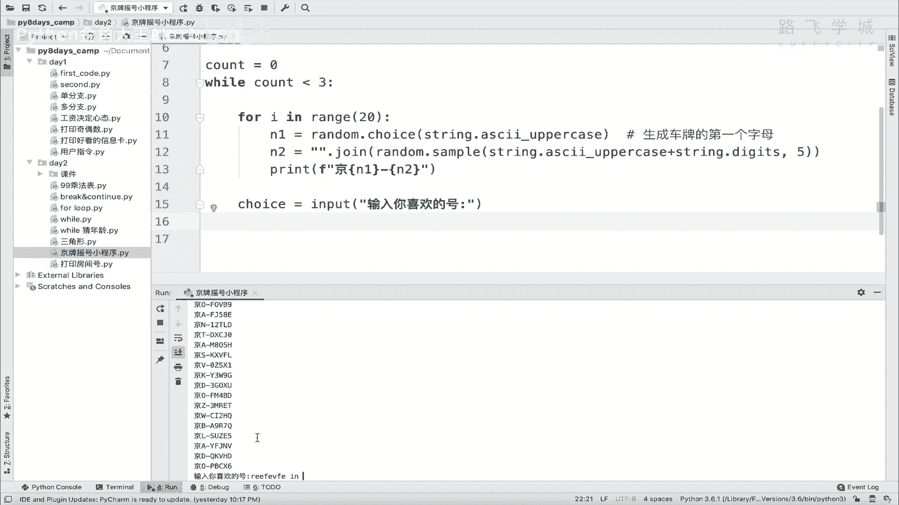

所以呢那我们把这些值加到列表里，当做一个个元素，然后再去啊。

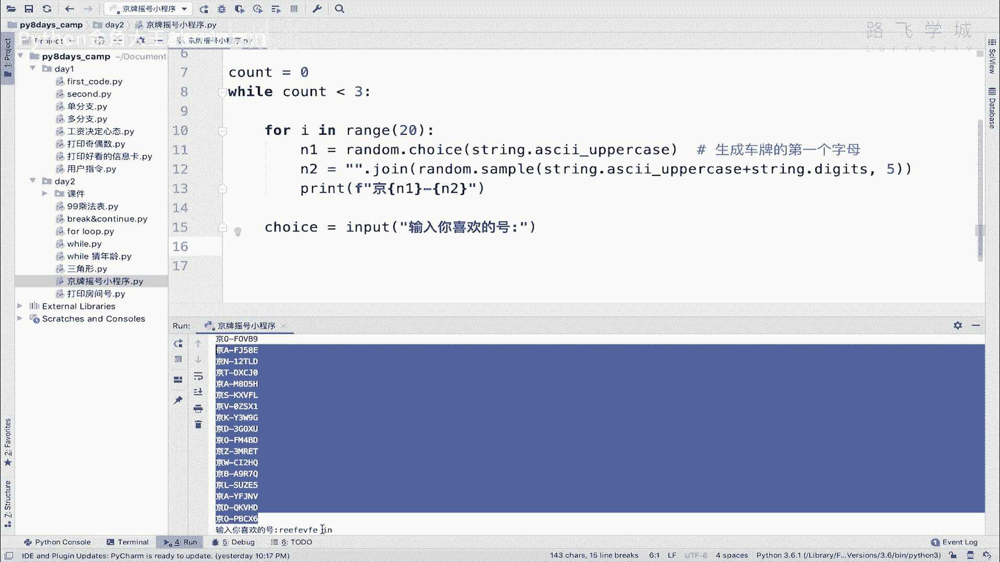

这拿这个去判断是不是就OK了，所以呢我们每生成一个值都把它加到列表里，好不好啊，哎咱们生成一个临时列表啊，叫car number，看numbers默认是一个空列表，看到没有，这里是啊。

存放存储这个公用户选择的啊号码，对不对啊，那我们在这里生成这个，生成这个之后，除了打印之外，我们先要把它加进去，看四点append是不是是不是就是追加呀对吧，大生成的号码对吧，这个添加添加到列表。

对不对，添加列表是为了从这里去选择，判断是不是马光线的判断，然后我们测试当然在这里打印这个x number好吗，那这个时候用户输入完了之后，你就判断很简单，if toys in这个car number。

对不对，看numbers啊，看numbers，这里看看啊啊这个这个这个这个这个这样吧，区分一下c number吧，行不行，省得你看混了，打印car numbers or打印这个c number对吧。

你这样不会混吗，OK这个时候如果在里面对不对，代表是不是代表这个用户选择的是合法的，对吧，那就打印呀，恭喜你，对不对，啊恭喜你选择了啊，恭喜你就选这个选择了啊，新车牌号，对吧，然后是多少呢。

直接把那个啊你的创业加进来就行，这是你输入的嘛，你输入的就是你选的嘛，对不对，那这个时候你就选完了，你就退出就可以了呀，对吧啊，good luck是吧，促进好运好，这个就就是选完了，看到没有。

是不是就选完了，就这么简单呀，对吧啊，那一会儿就说他选三次，就是他选的不对，那就重新来嘛，对不对，咱们先来看一下这个好不好使啊，我在这里输入一个这个吧，是不是恭喜我选完了，对不对，那同志们。

如果我在这里输入一个不合法的，比如说我输入一个，再加一个这个对不对，他就干嘛呢，他就直接也没提示，就进入了下一步又重新输入一遍，我觉得这不合适，你至少给人提示一下，对不对，所以你要判断对吧。

如果说的不对，else那那就不对嘛对吧，print这个什么呀，啊这个嗯哦这是不合法的选择对吧，哎这个时候呢我们就那就再去让他，就说白了再再给他输入一组新的，那这个就至少看上去友好一点对吧，我随便输。

他是不是说不合法的选择呀，看到没有，然后又又给我输入一遍啊，再说又不合法，再输是吧，哎怎么结束不了了哦，我没有计数，是不是我还要加一个计数，看到没，你count没加零吗，没加一嘛对吧。

总之我在这里count加一啊对吧，它最终可以执行三次，OK就是这个，然后呢我想想还有哪里有问题啊，哪里哪里可以优化，同志们，哪里可以优化呀，啊呃我想一想，刚才再说就要在哪哦，哦这个看着啊。

我们把把把用户的选择也输出一点，不用再来一个看看啊，我在这里先输入一个不对的，然后呢我输入一个对的，看着我输入一个对的，看到没有，但是呢我在这里打了一个回车，看到没有，就是我这个数字其实是在这里面。

对不对，然后输入一回车，我卡死了，都给卡死了啊，这个这个这个这个是你拍charm的问题啊，这个不是Python程序的问题，他有的时候他就会响应慢，这是咱们程序的bug，还在这里，大家看。

你看是不是它依然显示我是不合法的选择没，但是不对呀，我在这里说的是呃，这个这个这个这个对的呀对吧，什么6S是重置copy的，只不过我后面输了一个打了一个空格，看到没有，打了一个空格，那他就会说白了。

拿着你这个值和这个加上这个空格，去到这里面列表里去做啊，去去去到你这个car number里去做判断，但是你这个cut里，这个这个列表里的每个元素是不带空格的，所以它和这个就是他和这个不带空格的。

这个这个这个这个什么cs，这个值比的话是不相等的对吧，他肯定不相等啊对吧，大家来看一下，你比如说呃这个试一下吧对吧，你这样是否等于一个，这个是不是肯定不相等啊对吧，所以空格它也是一个值啊对吧。

所以呢我们要想办法把这，因为有的时候用户可能不小心就多了一个空格，或在前面出了一个空格对吧，所以我们要想办法把这些空格给它去掉，对不对啊，等于一个看着啊，怎么去掉呢，哎，大家看啊，我前面有空格啊。

后面也有空格，对不对，这个时候我A点strike一下，看到就会把空格都去掉，包括我我可能这里不光有空格，我还这里有个斜杠N也没问题，他会把空格斜杠N都去掉，看到没有啊，这个是strip方法。

就把这里面前面那中间如果有空格，他不会管啊，中间有空格不会管，它只会管两边的，可以吗，rip是拖的意思吗，脱掉啊，把这些空格什么的给脱掉，所以呢我们在这个地方要加一个strip，对不对，它就是固定的。

就会把你这个一些不小心多出的空格给你去掉，这样判断就没问题了，OK吗好这是这个，然后呢，同志们走到这之后，我再想写一个，说一个输一个什么呢，就是你看你现在这个选择是没问题的，但是我在前面想加上编号啊。

加上编号，比如123456，对不对，那加上编号怎么办呢，同志们，再加上编号怎么办啊，同志们，90123456789分，咱们说你这个列表，同志们，你这个啊哎我看一下啊，哦那那那很简单啊。

不用不用交那个新知识，在这里直接就行，I看着不想加编号的话，是不是可以把这个I可以给他打出来，I就是那个咱for循环嘛，是不是直接打出来就可以了，对不对啊，只不过是从零开始的，这没问题，你加一个一。

他不就从一开始的，对吧啊，从一开始吧，OK那你当然我们还是可以做到，我告诉你，我们甚至还可以做到，让他不用输那么一堆复杂的，我们让他选编号都可以，但是这个呢就会稍微麻烦一点啊，我们在这一小节先不交了。

先不交了，省得你这个程序太过复杂，总之到这个时候，其实你这个程序已经实现了，看到没有，已经实现了，就可以，最多对吧，输三次啊，选三次，如果不对对吧，那你选三次都没选上，那你就退出了。

然后呢你这个啊对选对了就就就供就打印成功，哎，所以咱们这个小程序主要是教，主要是这个什么呀，是呀考验你这个锻炼，你这个叫什么呀，把咱们前面学的知识的一个组合，对不对，while循环for循环呀。

if判断呀，组合起来做那么一个东西，OK你理解了这个思路之后，还是那老规矩，你自己啊默写一遍，完全默写一遍，不靠不看我的，因为你理解了思路了嘛，你看你就完全写一遍，总结一下，无非就是干嘛呀。

这个啊一个大循环里面对不对，套一个小循环循，每次生成20个随机数是吧，然后公用不全，选对了就打印，选错了就让他回来，就这么简单好，这个摇号小摇号小程序的这个这个这个练习题。

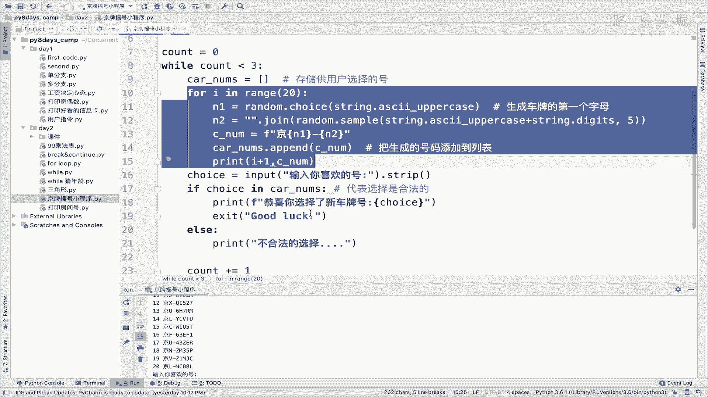