# 【2024年Python】8小时学会Excel数据分析、挖掘、清洗、可视化从入门到项目实战（完整版）学会可做项目 - P45：04 字节类型是个什么东东？ - Python金角大王Alex1 - BV1gE421V7HF

OK同学们，那这个就是咱们GBK啊，转成咱们UTF8的那么一个过程。

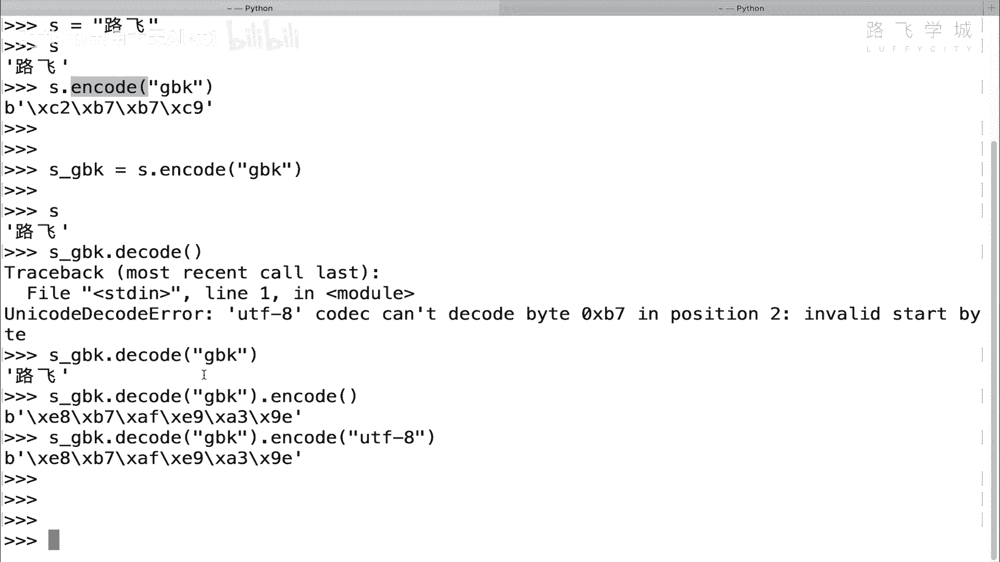

好吧，有点Y的过程，看到没有啊，先从UNICODE对吧，在Python里面的演示嘛，先转成j pk，再转成再反解，再转成UT吧，OK那咱们在讲这个转换的过程中。

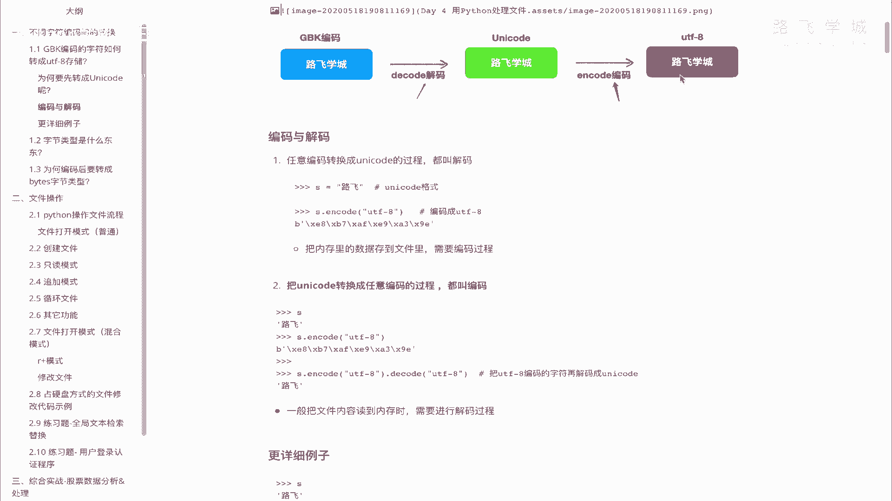

牵扯一个新东西出来啊，就是这个什么呀，这个这个B开头的这个叫什么呀。

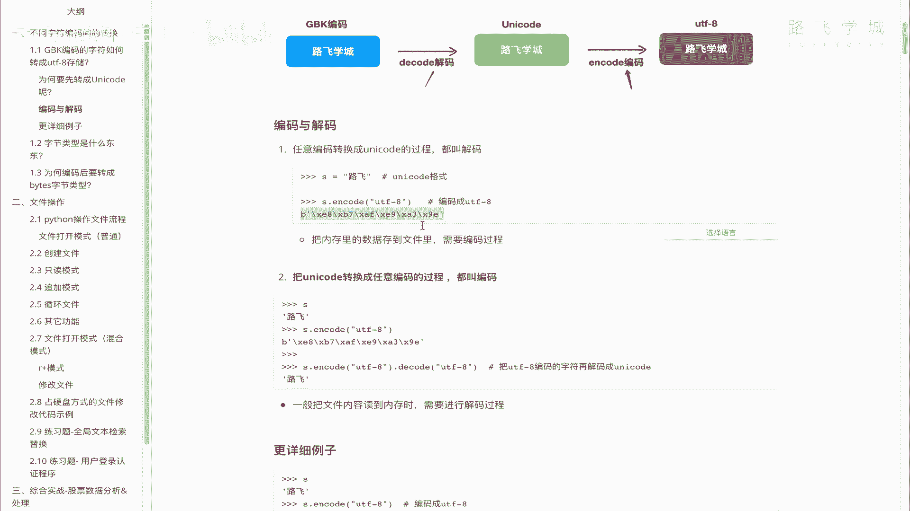

字节类型是吧，刚才没太细讲啊，接下来咱们聊聊它到底是个什么东西啊，为什么说这个编码编码转换其实很难讲啊，因为它它这里面牵扯到，就是有交叉的一些知识点，这个交叉的知识点还是新东西啊。

你要来回讲就很很容易懵逼啊，很容易懵逼，我已经尝试给大家啊，各种简化了，各种简化了啊，正是咱们那个我们那个这个大课题的话，这个讲的爱好是anyway，那呃这个什么呀，这个字节类型到底是什么东西。

我跟你讲，它其实就是一个二进制，它就是二进制，只不过呢那说二进制为什么要用这样显示。

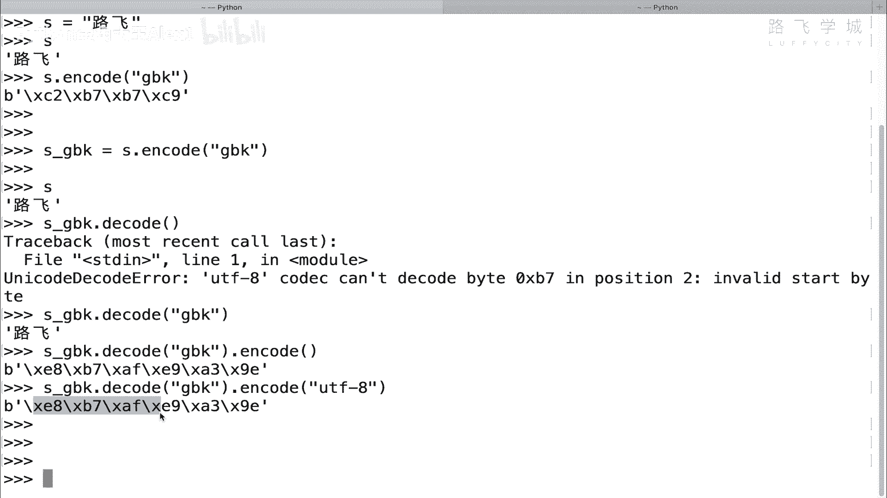

刚才其实说过了，就是说为了让你看起来方便，我告诉你啊。

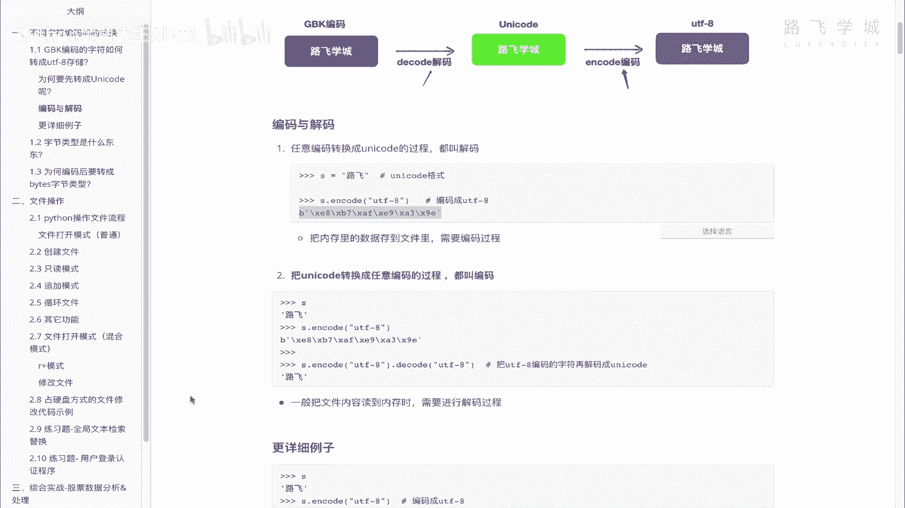

这个什么呀，我在这里大家来看一下啊。

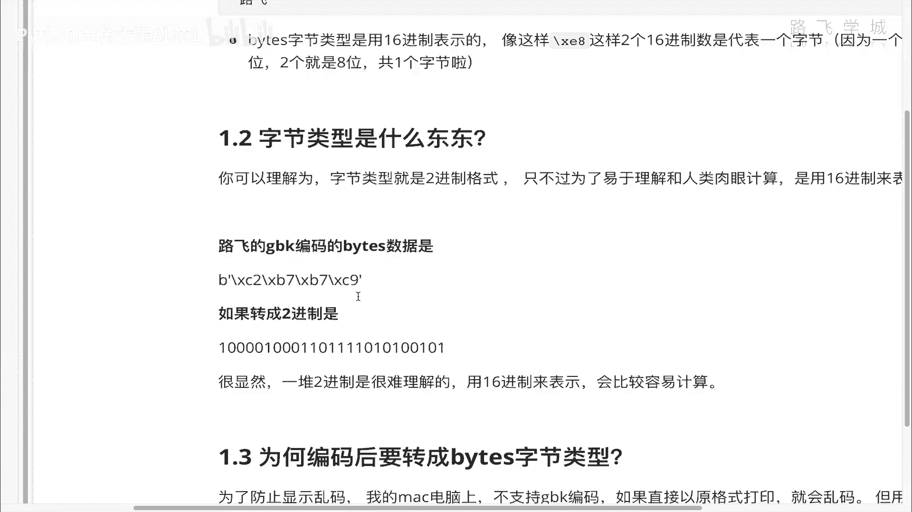

大家来看一下这一段二进制啊，这一段二进制相当于是四个字节，我直接把路飞copy过来了啊，这个路飞的16进制啊，在GPK里的随机进制显示形式，然后呢它转成二进制，是这样的，看到没有啊，四个字节。

你这样看的话，其实对你来讲就没有任何意义，没有任何意义，因为你你你你根本就不知道它代表啥对吧，你要看这个的话还能看出来点什么啊，知道他是四个字节，你这里还要一个个去数，太费劲了。

所以一堆二进制看上去很难理解的，用16进制来表示会写，显得比较容易计算，但它其实就是二进制，你看到B开头的，你就知道它是二进制的格式就可以了，好吧啊，只不过为了易于理解和人类肉眼计算啊。

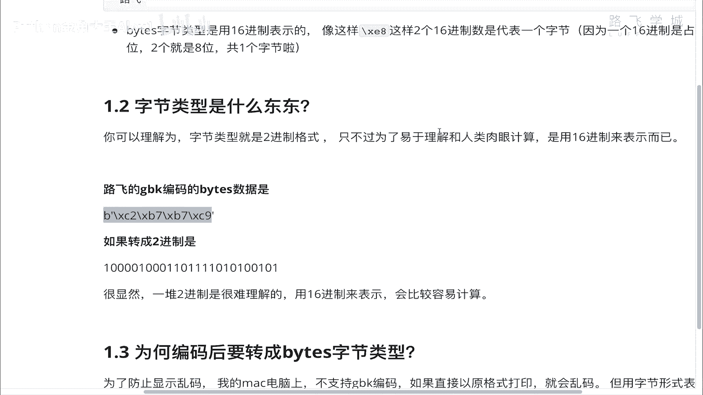

那我们现在讲说为什么这里是两个二进制数，一个C1个二，C是16进制数，C是一个16进制，20一个16进制是吧，我们说为什么C2会占一个字节。

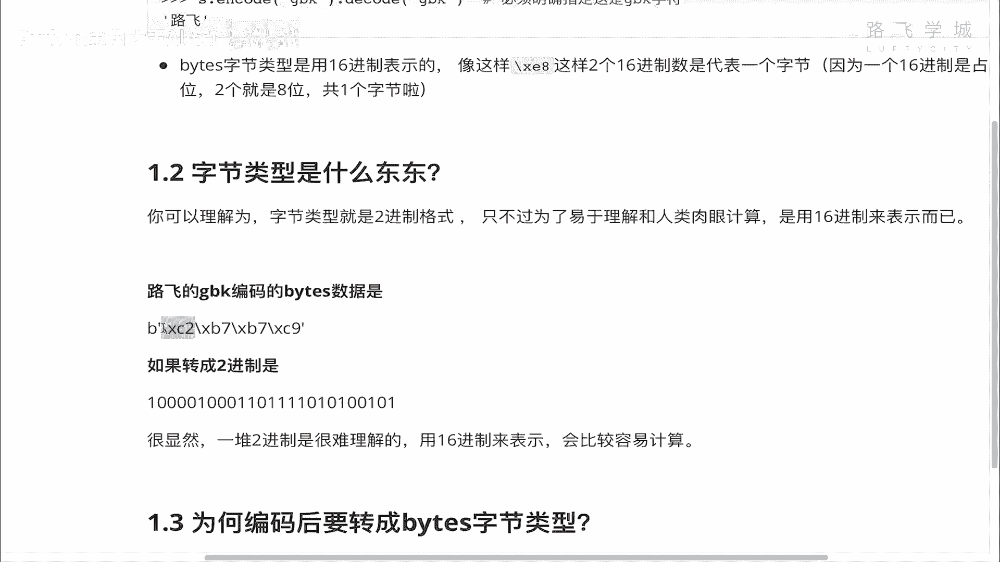

C就是这两个啊，16进制是占一个字节，是因为什么呢，是因为注意了啊，一个16进制是占四位，为什么，因为它的表示形式是0~15嘛对吧。

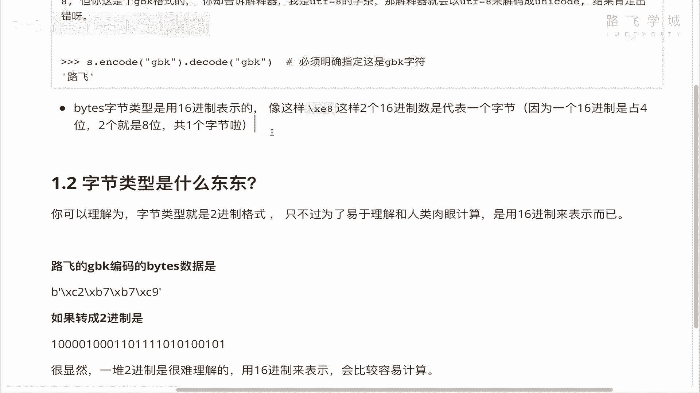

它能表示的数字，那0~15的话，咱们学二进制的时候还记得吗，是不是就是二的四次方，二的四次方就是四位，是不是啊，所以所以一个16进制就是至少要占四位，明白吧，四位两个16进制就是要占多少啊。

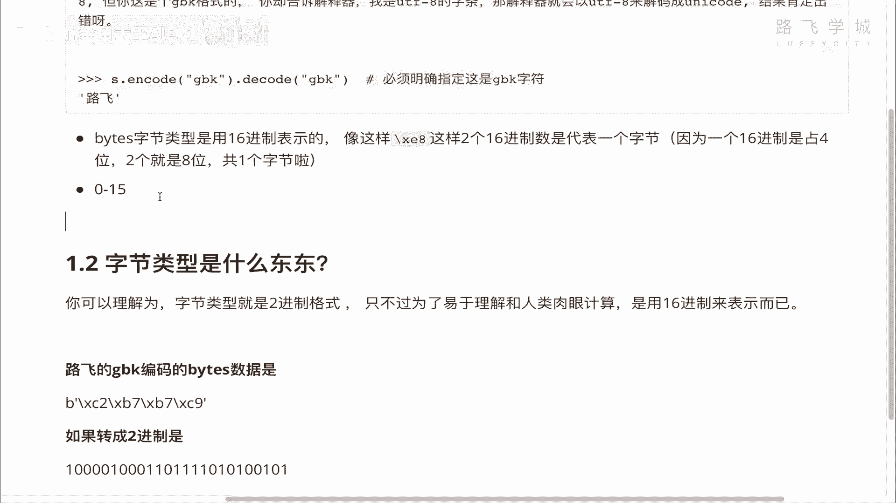

啊八位加起来就是一个字节，明白意思吗，所以这是这就是一个字节。

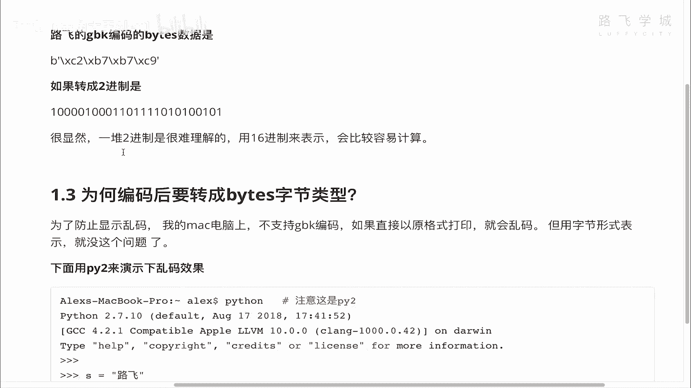

这就是一个字节，一个字节好吗，OK那这就是啊这个东西。

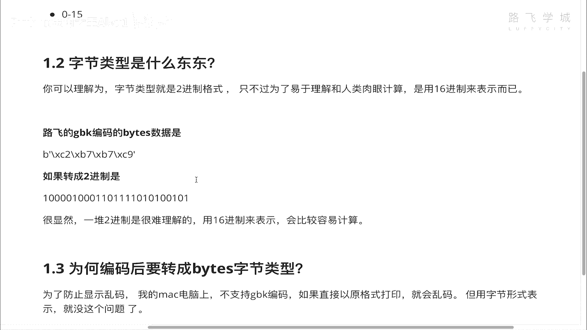

那接下来再问一个问题，说为什么编码之后要转成字节类型啊。

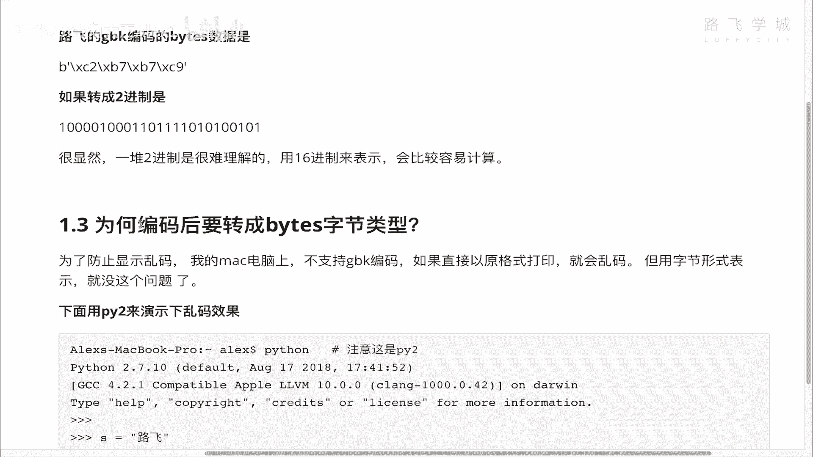

我们知道字节这是个字节类型了对吧。

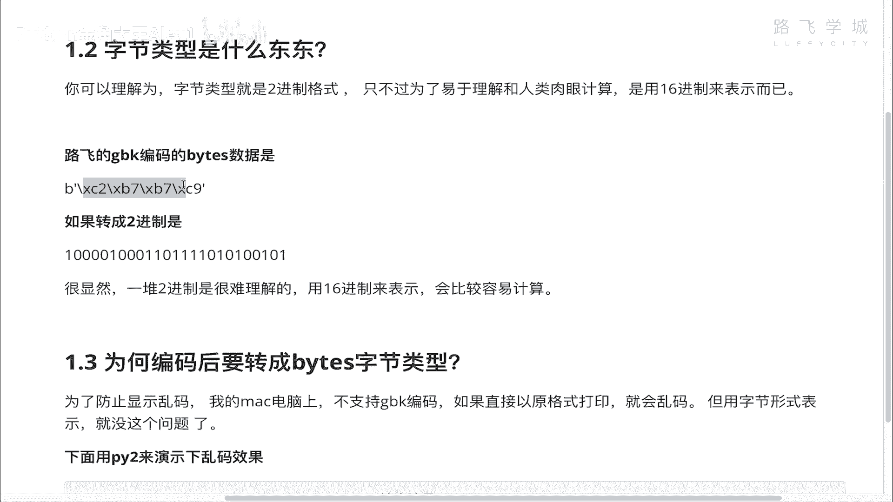

那为什么要转成字节类型对吧啊，你编码完了之后，你转成你他这个GBK也好，转成UT8也好，为什么还要以编码的，就以这个字节的类型啊，这个这个类型来去表示这个啊，编码后的这个数据呢直接原格式打印不行吗，啊。

可以在python2上，它就是原格式打印，Python元歌是打印带来一个什么结果，就是乱码呀，就是乱了呀，你完全不知道它是什么东西，所以一旦出现乱码，它对你来讲没有意义，对用户来讲没有。

对程序员来讲没有意义，因为它乱了，这不因为你Mac上展示不了GPK，就会出现这个乱码的格式，但是所以乱码对你没用，但是如果你要是用字节码的形式来表示的话啊，他第一不会显示乱码。

第二还会你看它显示的这个是什么呀，直接是这个编码，直接是这个编，相当于直接是这个路飞这个字，这个文字在这个GBK编码表里的位置，你可以直接拿着这几个值去查，你就能查出来哦，原来它是代表这个什么呀。

代表路飞对吧，代表路飞两个汉字，你到那个GVK编码表里明白吗，如果一堆乱码，你拿着乱码去找，你找不到任何东西啊，这是一个东西，明白这就是一个它的效果吧，就是一个效果吧对吧。

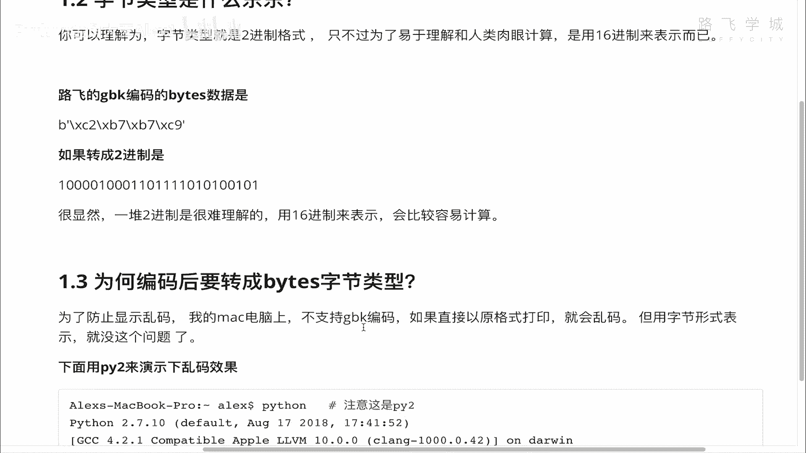

就可以呃，不显不显示乱码，明白意思吧，这是这是为什么要用啊，字节字节类型的展示，其实字节类型还有一种，就是说它传输这种什么图片啊，传输视频啊，因为是图片视频，它就是一个二进制流，二进制的。

全都是01010101对吧，它不像这种文字对吧，它这个还有这种对吧，几个字节拼起来是像图片似的，它能打印，但是这个在命令行里你怎么去打印一张图片，没办法打印图片，那你打印又是乱码。

所以就是说像展示图片就直接是字节格式对吧，就是可以的啊，图片和视频都是可以，字节格式它就不会乱码这种OK好吗。

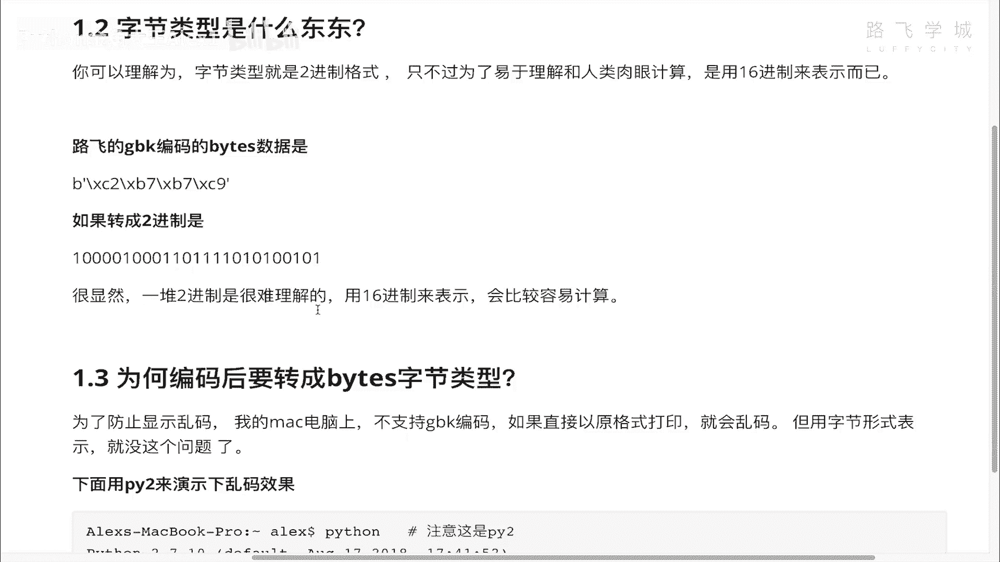

那这个就是为什么也要转成字节类型啊。

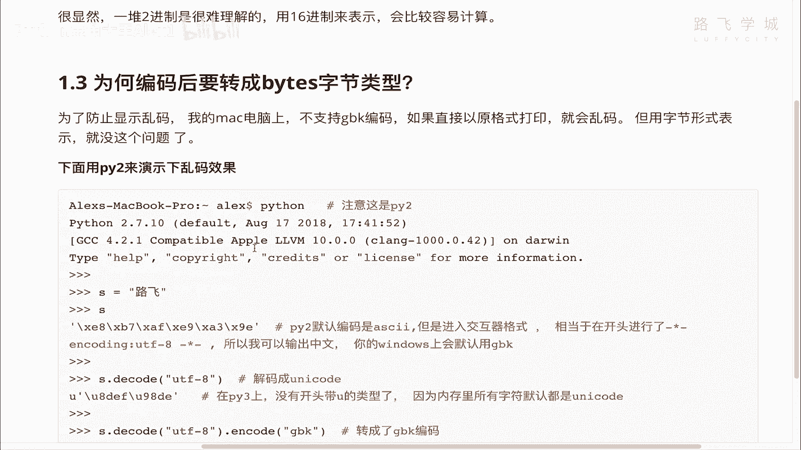

显示成字节类型其实都是二进制好吧，给大家解释到这里啊，OK那到此为止啊。

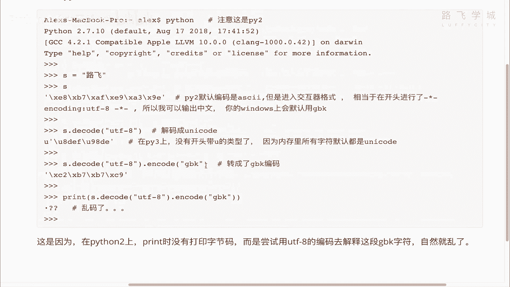

咱们这个啊在Python，就sorry这个字节就是字符编码的转换啊，我们就给他学完了啊，如果有蒙的同学，还有什么你想深入了解的，你可以跟我去要一个。

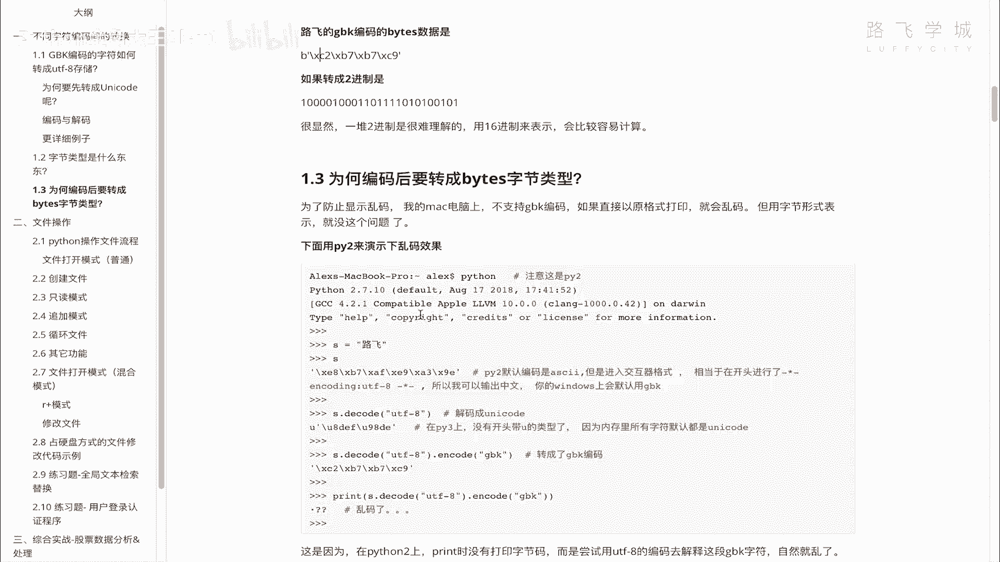

我有一个讲了两个小时的字节编，最后编码的一个课件，那个讲的比较详细。

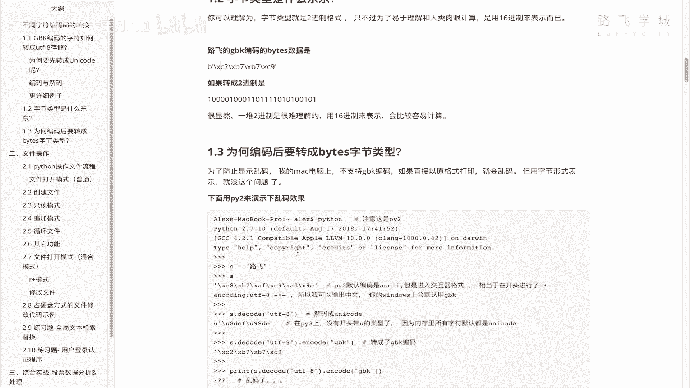