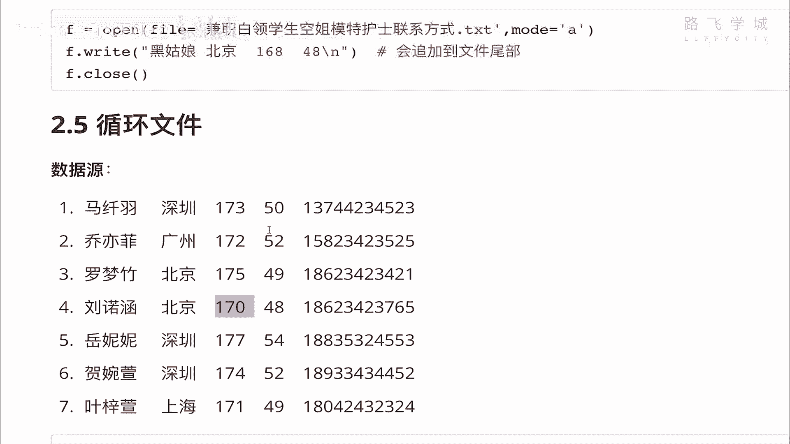
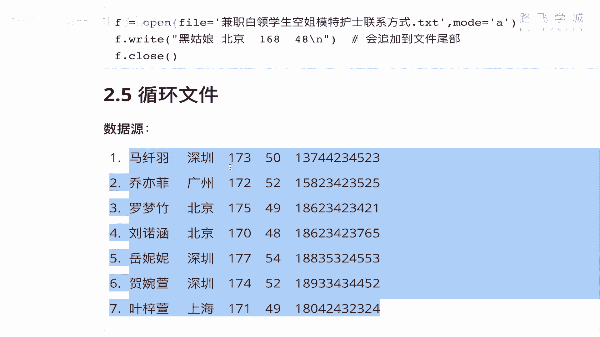
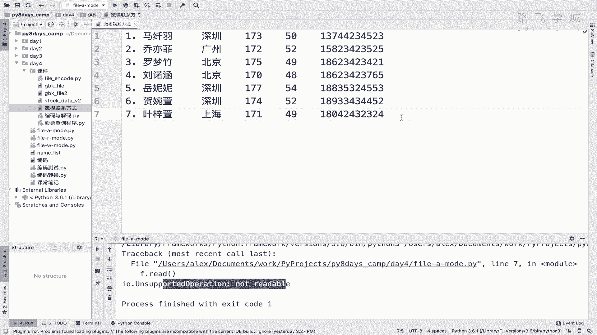
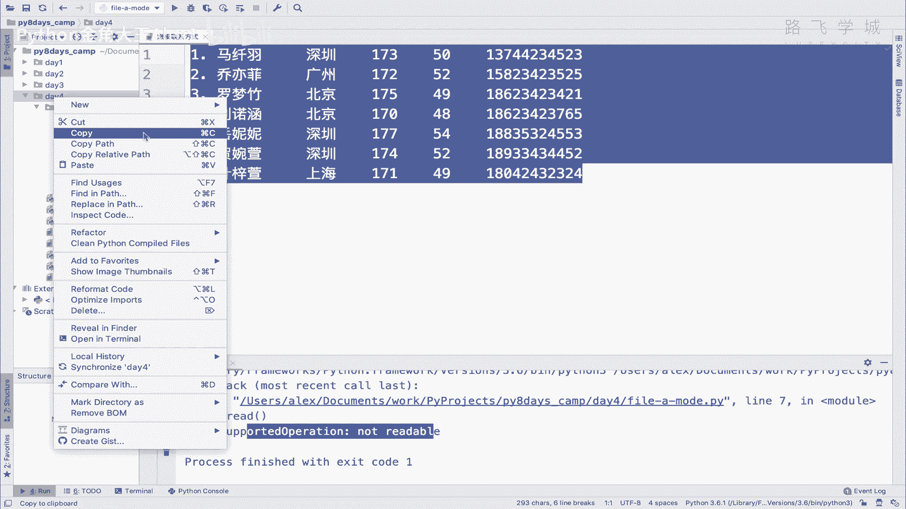
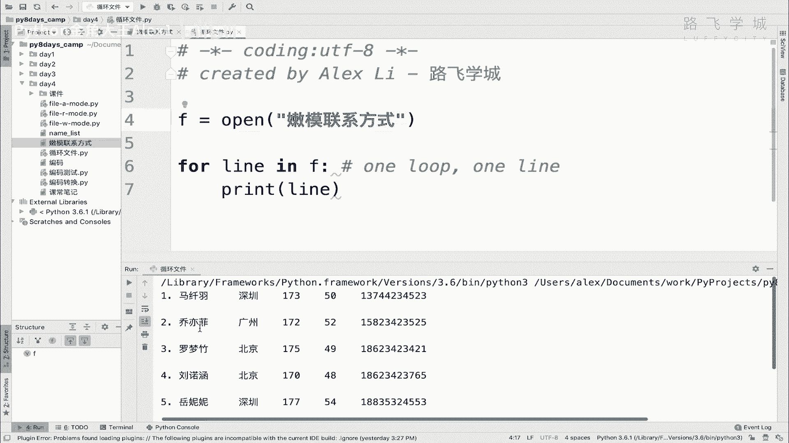
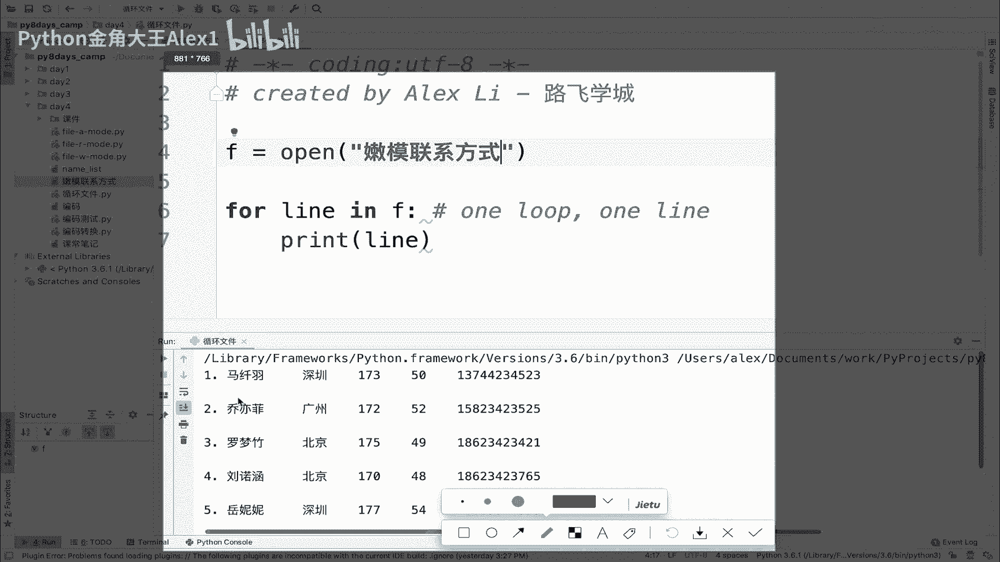
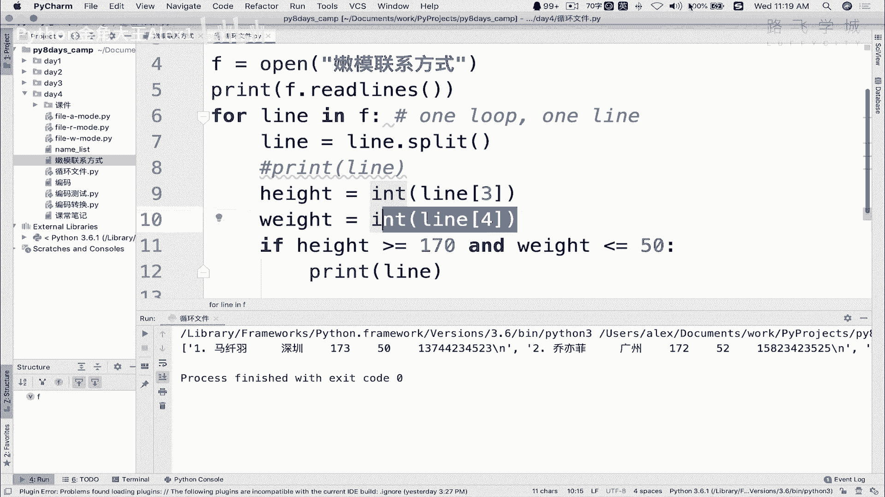

# 【2024年Python】8小时学会Excel数据分析、挖掘、清洗、可视化从入门到项目实战（完整版）学会可做项目 - P47：06 遍历文件-嫩模联系方式 - Python金角大王Alex1 - BV1gE421V7HF

OK同学们掌握了文件的创建，只读和追加之后，我们这节课学文件的便利，也就是说我有对一个现有的文件，我进行一个循环呀，去取出来，我直接里面的内容好吧，大家看我这里有一个啊这个嫩模联系方式啊，兼职白领啊。

加这个空姐嫩模联系方式啊，这这个电话你们可以打着试一下，我现在需要的是说你给我循环循环的，并且有要求让你因为我也我想查找嘛，说把这个高于170，并且呢体重在50kg以下的人给我找出来，注意了身高。

这是身高，这是体重啊，高于170，体重在50kg以下的话。

卧槽那这个就特别瘦啊，我喜欢瘦的啊。

我不知道你们这个反正我是喜欢瘦的哈哈，OK想着就开心来，咱们就把嫩模联系方式啊，嫩嫩模啊，嫩模联系，当时这个比他比特币特别火的时候对吧，我当时还这个叫什么呀，带着钞票或跑步入场，结果亏了个是吧，特别惨。

打好几10万都亏没了，然后呢这个当时有一句话叫什么，赢了会所嫩模输了，下地干活，下海干活是吧，OK我先把这个文件存下来。

存下来之后呢，我们来去循环它啊。

循环文件，然后他的腰咱们循环，并且要求是对里面的有几列进行判断，这个身高和年龄是不是啊，还是和其中咱们循环文件怎么循环，先打开它也要先打开它啊，打开呃，open叫叫什么呀，嫩模联系方式，Copy。

这是默认就是读的模式，然后我们循环呢就是就跟循环列表是一样的，for line in f就可以了，for line in f就行了啊，咱们for循环是for for什么什么i in range对吧。

这个循环文件就是for line，应该说这个line当然是临时变量，也可以for和for什么，我只晓得叫拉，就是因为你每循环一次就是读一行，OK吧，每循环一次就是独一行啊，Each line。

each leaf应该叫什么呀啊弯路是吧，online是同一个世界，同一个梦想啊，OK啊直接print line就可以了，大家来看一下就行，诶，诶没有这个文件，那么联系方式加TXTTXT吗，执行一下哦。

哦没有，这个文件啊我知道了，我大概知道了，他这个他这个我写我写，我写错地儿了，我写错地儿了啊，写到课件里面去了，应该把这个拿出来啊，拿到第四下面，应该放在这，不用TXT把它放回路径好执行。

大家看是不是就打印出来了，对不对啊。

有的同学讲说，你看哎是打印出来了，没有错，但是你这里怎么有好多空行。

看到没有空行回对吧，你看我这个原文件是这样的呀，你这有空行是个什么意思啊对吧，你这有空行是是是什么意思啊，是因为同志们，你这个美就是注意了你这个地方啊，你这个地方他自己是有一个换行符的。

只是你看不到而已，只是你看不到而已啊，它是一个换行符的，我在这里给你演示一下也行，给你看看，执行一个语法叫print f点，Read lines，Read lines。

Thirty a reliance，看到没有，realize是干嘛呢，你执行一下就知道了，大家看他是把整个的一个一个一个文件里面的，每一行就是整个变成一个大列表，对不对，大列表里面的每一行。

文件里的每一行会变成一个元素，元素后面看到没有，是不是有个斜杠N啊，每一个没有一个斜杠N是吧，所以这个地方是有一个换行符的，有一个换行符，我的print自己1print它自己就会对吧。

就会有一个换行结尾，是不是print本来就有一个换行结尾嘛对吧，咱们讲那个print语法的时候，所以导致它会打印出来空行，明白这意思吗，你不想让他，你不想让它通行的话，那你只能是。

那你只能是在print的时候进行一个end end，等一个等一个这个吧对吧，他就会把那个空行去掉了，他就只打印，那就print里面自己自带的那个换行符去掉了，只打印这个里面的，对不对，那你就可以了。

明白吗，没问题吧，好那这个就是啊循环循环，好故事到这儿可没完，我们要做的是对这两个数据进行判断是吧，判断年龄和不是判断体重和身高，体重身高你想判断怎么办呢，你因为他现在是呃每一行它是一串文字，一串字符。

是不是你要从字符里面想取出这个内容来看，就有点困难哦，取出这个内容有点困难对吧，你你你得你通过切片，然后自己去数0123456789啊，到这所以怎么办怎么办，把这每一行给它分成一个小列表。

当然把每一行分成一个小列表，就直接在这里啊，再重新附一个是line的一个line split，明白吗，这样的话同志们，你就相当于把这个字符串分成了一个什么呀，分成了列表，然后按空格来区分对吧。

默认按空格来区分每个元素，看到没有，是不是直接就把这个姓啊，身高和体重拿出来了，身高是身高是多少啊，身高是第几个列0123，体重是四对吧，所以你就可以直接你的heat是heat，等一个叫line3对吧。

然后你的体重等于一个狼人4weight，Sorry，哦对DT等于LN4是吧，所以你就做判断，if hit hat大于一个啊，大于等于一个170对吧，必须得170，我这个要求。

然后按这个什么y weight小于等于一个啊，50对吧，唉你说这我就可以让你去啊，就选就选中了对吧，就选中这个模特了对吧，我就print它这一行，对不对，打印把这个去掉就可以了就可以了，就这么简单。

你看看是不是啊，然后呢我们执行一下，哦这里出错了，说什么呀，说你这个大于等于啊或者什么的，它不支持这个什么呢，Between between instance，就是这个这个对象，你可以理解为对象啊。

你你不用管这意思的，不能在STR和int之间做判断，诶，什么意思什么意思，注意了，我刚才打印这个什么的时候打印，这个时候你有没有看到这个是一个字符，这是一个字符是吧，加上引号了嘛，它其实不是数字。

所以呢你要干嘛，你要先把它转成一个数字，对不对对吧，转成一个数字二一对吧，然后呢我们再来执行，再来执行，OK看一下诶，这个时候这个时候咱们来判断一下啊，判断一下他哦，哦我得把这个打印出来看一下啊。

是不是出现了，大家看我选出来四个嫩模啊，四个四个嫩模，然后是不是都是身高高于1米7，然后体重也在范围之内，看到没有，是不是都符合这个条件，very good啊，都符合这四个内膜我就包了好吧，唉同志们。

这个就是循环文件，并且对文件里面的内容进行操作啊，啊最后你别真给人打电话啊，就说这个嫩模，我想起来我之前第一个女朋友，还真是一个模特车模啊，北京的卧槽，老牛逼了，1米71，我那身材唉唉往事不堪回首啊。

少年不知这个什么什么珍贵啊是吧，老来只能空叹息，很好，那个这个就是文件循环，你们自己来试一下，哦对了，我在这里给你给你给你出现一个小bug吧，因为有同学问过小bug是什么呢，大家来看啊。

我就哗哗哗神一对111顿鬼操作啊对吧，这个时候一对吧，一顿鬼操作，你就也不知道我干嘛，我就继续再重新执行一遍，看着就报错了，诶没有报错吗，呃我看下诶竟然没有报错，诶，没有报错，没有报错，没有报错啊。

没有保存，大家看大家看是不是报错了，哎你看说一个什么呢，说这个什么int list index out of range，有同学就会报这个错啊是吧，说老师我考的这个文件跟你这个一样啊，怎么就报错了呢。

大家看啊，这个在第九行，他去取这个行的这个值的时候就报错了，是不是取这个行的这个值的时候报错了，那呃这个现在是取到D嗯，取到第七，看到没有，第七都打印完了，这个这个这个是哪里报错了呀，诶我告诉你吧。

因为这个不好解释，你看我刚才在这里悄悄地敲了两个回车对吧，你只要在这一敲回车，它其实是代表这里是有内容的，明白吗，它是有内容的，亲们啊，在这里给你看一下print，你的你看一下，看这后面是不是有内容的。

有一个空行，看到没有光光有一个换行符，然后呢，那你循环到这里，它就会循环循环到这的时候，它就会尝试去取第三个值，去取第四个值，但是是没有的对吧，所以他就报错了啊，所以同学们啊，你们copy的时候注意了。

一定要在这里对吧，确保你的最后一行是在这儿，怎么怎么确保它是最后一行的，你你按你键盘上那个下下箭头，他已经往下走不了了对吧，你要是在这的话，他那个下箭头，他在这里的话肯定是可以往下走的，对不对。

你一定要确保这是最后一行，他就不会报这个错了，明白意思吧，OK这是同学犯过这个问题，我就说一下，好。

