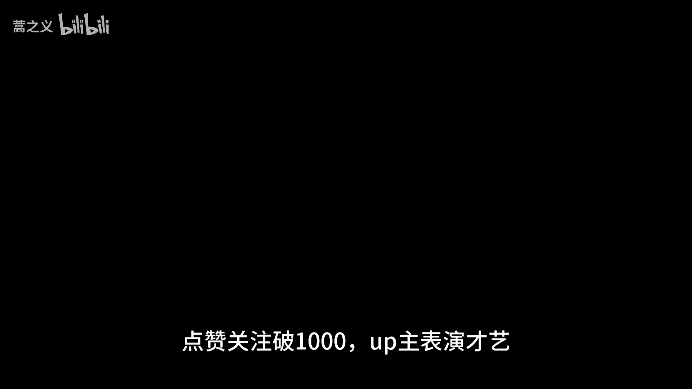
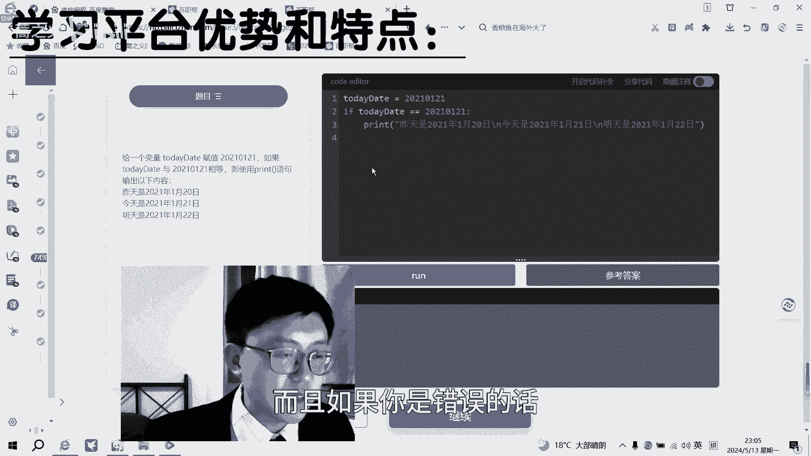
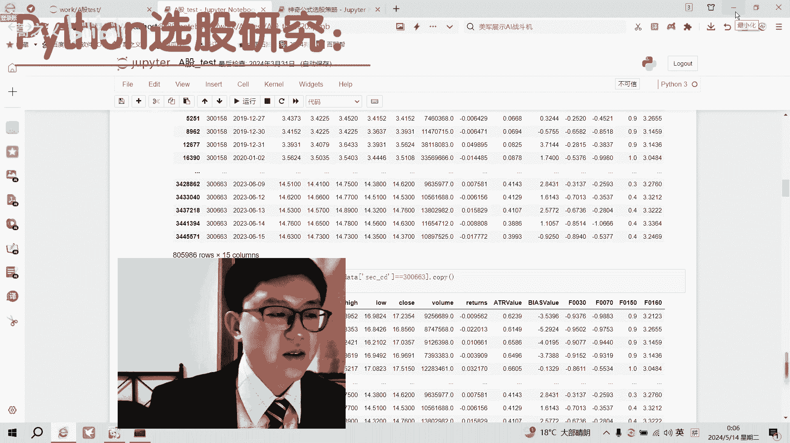
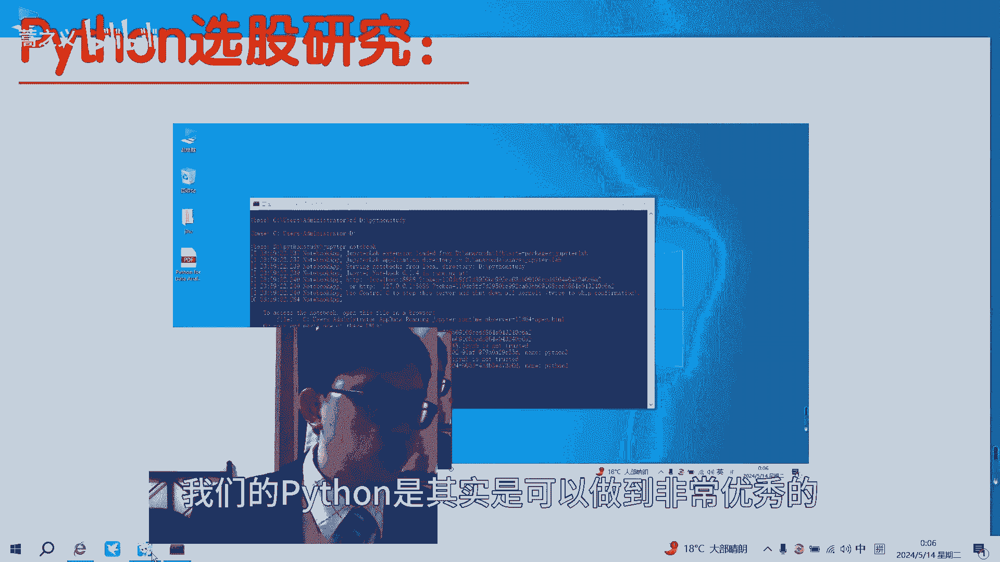

# 985金融硕士失业，沦落为外卖员，还在想进步 - P1：我以前啥也不是，现在是量化研究员 - 蒿之义 - BV1xf421173i

哈喽大家好，好久不见，甚是想念，点赞关注破1000up主表演才艺呃。

熟悉看过我之前视频的网友应该都知道，我之前的话是在深圳那边，有一家做量化研究的机构，我是在做这个量化研究员这样一个岗位啊，其实我硕士的话也是学的一些偏传统的金融。

那么我之所以能够找到这样一些量化的岗位呢，最重要的原因就是我在研究生期间，我自学了很多编程类的课程，然后对于这样一些机器学习，深度学习，以及呢这样一个统计数据统计时下了很多功夫。

真的当年我自己在自学Python，自学编程的时候，还是在自己摸索，因为也没有人带，没有人来引路，所以说呢也走了很多弯路，你看我给大家看一下我当年自学的教材，当然我就是用的这本教材。

这是这是一本纯英文的教材，然后主要是他的重点，就是说用Python来进行数据分析啊，但是实际上的话他还是有很多不是那么的，就是深入浅出，没有那么的对于初学者来说没有那么友好。

所以说当年我真的学得痛苦死了，那么现在呢现在可太好了，比如说我现在，就是非常优秀的，不管是对于初学者来说，还是说你想从初级到高级来进阶的同学来说，都是非常优秀的，来我们一起来看这是什么呢。

这是一个针对初学者，或者说是对于一些啊本科生或者研究生，以前没有接触过编程的同学，或者说是一些在社会工作中啊，想要接触编程课程的同学，这个夜曲编程我们可以直接通过百度来进来啊，百度夜曲编程啊。

我的课程啊，我们点开看一下，可以看到我们这个课程呢，它的知识点还是非常全面的，从最简单的数据和运算，然后到我们低阶的条件，判断在了中高阶的数据结构，循环语句，到最后的函数和类，以及这样一个编程的实践。

可以说是一个非常完整一套从从浅到深，从简单到复杂，从基础到实践的这样一整套学习课程，就是能够还有内置的这样一个，Python code的这样一个运行界面，它能够能够实时的操作，这左边的是这样一些题目。

然后这边是这个code的这个编译编译界面啊，这边是这个输出结果以及参考答案，还有参考答案，而且如果你是说错误的话。

它会有这个错误提示，你看在这个最后的时候，我们在每一章节学完以后，它会有这样一个思维导图，对于你的学你的知识点进行总结回顾，这样也是更更加方便我们记忆和掌握，就不需要自己去总结。

我觉得这是一个非常好的一点，能够省下我们很多学习的这样一个时间啊，这个是非常好的，我们来看一下用Python来选股是怎么做的，好吧，这地方以后我们再打开JUP，Notebook，Ok。

这是一个神奇公司的选股，嗯那么这个神奇公式是个啥呢，神奇公司是由美国的乔尔格林布拉特提出来的，他这个选股公司在美国的那个股那个股市上面，在20多年的实践中，获得了年回报率高达40%的收益。

可以说非常的优秀，那么在这个这个我在做这个案例分析的时候呢，我将所有的过程都简化了，我主要针对的两个指标，第一个是市盈率P1，第二个是资本回报率，两个指标先进行排序，排序以后进行加总，加准以后呢。

选出前30位的股票，那么这就是一个选股的，这个很粗略，也是很简单的，这样一个演示的，这样一个选股策略的这个展示啊，那么在选股的时候，一般在股票市场上把这个后10%的，后10%和前10%的这样一些股票。

一般会把它剔除，为什么呢，因为他有时候还会有一些那种，垃圾股的存在哈等等，或者或者说一些泡沫股的存在啊，所以说我们一般会剔除后10%，这样也是为了让选股策略更加的有效，那么第一步呢先导入这样一些。

import mate pro lib点，Python propot啊啊包括一些基础设置设置，显示30行啊，设置小数位，浮点数的小数位，然后显示中文等等，这样一些好吧，第一步导入数据，PD点。

read啊啊，这个这个这个这个数据是我之前就下好了的，然后呢嗯我们把它简单的进行一些这个跳过了，跳过一些行，然后把名字的都选择一下啊，啊这是A股的一个数据，有3513条记录，23列。

这个是日期股票代码正确名称啊，这个P这个这个ROC，然后industry，然后前一年前两年是吧，然后股市市值对不对，OK在我们之前说了啊，选这个第一个是市盈率，第二个是资本回报率。

首先我们在选的时候肯定是要市盈率，资本回报率都肯定会正，是吧，好，那前一年前两年内，必须为正简单做一个数据筛选，那么筛选以后呢，我们就可以进行来进行排序了，对不对，我们先P对P进行排序。

排序是使用的方法，rank rank使用的方法是这个平均平均值，然后第二呢对于这个资本回报率再来进行排序，排序呢使用这个降序啊，也是用平均值的方法啊，最后我们将它这个排序呢进行加总啊。

rank p和rank r o c加重，以后形成一个整这个综合的排序，我们最后呢把这个综合排序打包，形成一个data frame，这样一个文件格式是为了好看，为了容易展示啊，我们这里选出了3513条。

记录了这样一个排序，对排序号，你看这个就是排序号，嗯啊好，我们再把这个，排序号呢这个把这个排序把这个排序啊，然后再把它加到这个我们原加了这个原始表，这个是原始表吗，我们把不是建立一个序号。

把它加序号最最右列，那就形成这样，那每一只股票就形成这样一个排序的序号，那么我们最后还可以再对它进行排序一下，再通过这个序号进行排序，那么就可以送小张的排序，就把这所有的股票都排出来了。

所有的股票排序排出来以后呢，我们就把这个股票代码拎出来呗，是吧，这个wind代码把它拎出来，因为我是通过那个万达万达上下的啊，零出来就可以了，然后选出前30只股票，这就是一个很基础。

很基础的审计公司的选股策略，这个肯定是不能用了，得亏的裤衩子都不剩了，我只是说作为这样一个Python的这样一个演示啊，其实最后再选择30只股票，你如果你真的回插那个来测，来测试他那个年收益率的话。

觉得是比A股那个上证指数是高很多很多的，这也是基础的选股策略，我们也可以看一下这个其他的是吧，我们看有什么东西，还有比如说我可以做一个这个桌上，这个的话是这个就有点复杂了，这个可能要真的要讲的话。

要花很多时间讲，他这个是对每只股票，每天的这个市场反应做一个预测，就是说这个股票当天当天，这个股票的走势是利好的，还是说利就是逆差的，就是说它上涨的可能性，下跌的可能性做这样一个信号的一个标记啊。

这个是通过一个hmm模型来做的，这个，稍微复杂一点点，以后有机会再讲吧，这个好吧。

所以说呢我们的Python是。

