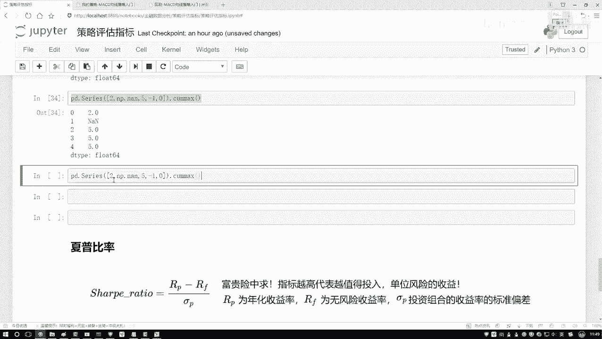
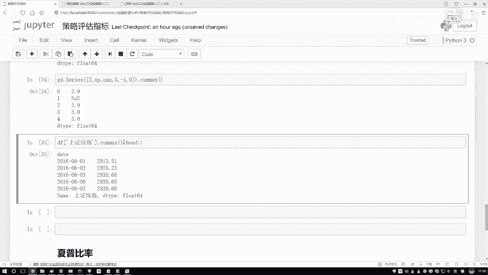

# 9个小时搞定【Python金融量化分析】人工智能数据挖掘实战，看完就能跑通！ - P18：18-最大回撤区间 - 用头敲代码 - BV1r72mYfEC7

接下来啊咱们来说这个最大回撤啊，先给大家看一下，就是在我们的策略分析当中啊。

最大回撤表示的是什么东西啊，你看这里它是有什么是有一这样的一个区间吧，这个区间什么意思啊，好像说哎呀从哪儿到哪儿，是持续了这样一个最大回撤，还有这个意思，其实啊这个最大回撤啊。

呃它不能从这个字面意义上来解释啊，他其实描述的什么啊，大家记住也行了，它描述的就是你炒股票啊，这个惨劲儿啊，什么叫这个惨劲啊，他说这样一件事，就是当我们在炒股的过程当中啊，那肯定会有一些跌的时候吧。

那最大的时候不是最大的时候，最跌的最惨的时候，持续的那个区间，我们就叫做什么最大的回撤区间。

在这里我再给大家解释一下，通过公式，咱们再来看一下什么叫做这个惨劲儿啊，他是这个意思，这个pi啊表示的是呃你某一天的一个股价吧，可以吧，然后呢PJ表示就是反正J啊，就是都是I后面的，比如说I是第十天。

那J就是第十天之后的啊，某一天，当然这个某一天，那你说怎么样找这个某一天啊，它叫做一个最大回撤吧，哎呀就是这样一件事，这个股票在下降的过程当中，还有这一块可能有一个区间，那是连着五天。

比如说从这个十块钱跌了五块钱啊，这是有这样一个五天，然后呢后面还有一个更大的更狠的，从这个比如说这块它又涨上去了怎么样的，然后这里它还有一个比如说从这个15块钱吧，跌到了一块钱，有这样一个更大的区间。

相当于啊就是我们整个呀要遍历一下，便利什么呢，便利在咱们的数据当中啊，哪两点之间是下降最惨的，并且我们还要把这个天数给计算出来，比如说我说我现在连着30天啊，反正可能中间中可能中间这块有一点长的。

这也没关系，有点长的，但整体还是往下去走的，反正我说连着30天，我是经历了最惨的一次，从多少钱跌到多少钱，但是这个描述的不是一个多少钱，因为你看下面有什么，别忘了还要比上什么。

比上一下这个pi相当于啊就是你缩水了多少吧，啊大概是这样一个感觉，这个呀我们叫做一个最大回撤哦，它并不是一个评估啊，你的策略好不好的，而是评估什么，因为当我们在评估的过程当中啊。

其实不光我们要看这个策略好不好，还要看什么，你的一个风险吧，这是一个风险，什么叫风险，哎呦你说你炒一个股啊，然后你把全部家当都放里了，然后之后有一天你发现了哎呀，这个最大回撤区间连这十天呀，要我命了。

从这个15块钱一直跌到多少了，是不是挺吓人一件事啊，当然可能啊它后面还涨起来，是不是只是说哎它最大的一个啊，这样一个跌幅，或者最大的这样一个回撤区间是多大的，这个以及就是你的一个缩水成了多少，哎。

这个是我们要去描述的一个指标，在这段时间当中，你的一个惨劲儿啊，是有多惨的，所以说啊这样回撤啊，大家以后看到了，你就想这个是一个风险指标描述的，就是你做这个策略啊，可能整体上来说还是赚了。

但是中间会有那么一段时间让你非常惨啊，这个时间就是你最惨那段时间，我们就叫做是一个最大回撤，那你说股票当中啊，风险重不重要重要吧，08年的时候，多少人都跳楼了，是不是不是多少不是多少人跳楼。

个别案例有些人就跳楼了吧，08年的时候，那股市，当时我记得好像从6000多点，直接的跌到了1000多点，基本上就当时我我我爸也炒股啊，当时08年的时候，然后那时候我们全家还去那个海南玩呢。

然后当时可能就是哎呦，也是电脑没有那么普及，然后也没实时的去看这些信息，然后在外面玩的时候压根就没管股票，然后走前走前，我记着都是股票啊，我爸那股他是16块钱的，然后回来的时候跌到多少了，剩四块多。

然后赶紧都卖了，因为实在是挺不住了，这就是当年08年这个股市，大盘直接就是我记着我可能记拜青啊，记得好像是6000多点，直接跌到了1600多点还是多少点啊，基本上所有人都是亏了吧，而且都亏的差不多啊。

人均当时说是人均亏10万，但是我觉着可能10万是不止了，大部分人都是几10万，几10万的一个亏，这个最大回撤区间就描述的是啊。

在某一段时间，你的一个惨劲儿是有多少，那你看在我们这个汇率策略当中啊。

怎么样，这一块他是不是会帮你做统计啊，统计出来哎你的一个回测区间里边哪一块啊。

它是什么，是有这样一个最大的吧啊，这是我们的一个最大回撤区间，然后呢咱们来写一下吧。

就是呃我们的一个啊计算该怎么样去算，首先我们来想一想，这里边需要我们算什么，那算指标其实蛮多的，你得算最大的一个区间吧，哎呦那你怎么知道一个区间，它是一个大还是小啊，是不是我们都得一个一个去做计算。

然后选择出来什么其中那个最大的吧，好了，现在大家看啊，就是有这样一个函数pandas点啊，Serious，我先给大家举个例子啊，在这个server当中啊，随便传一些值啊，就拿那个官网例来说吧。

然后填上一个空值得了，空值不会参与到计算当中，然后再填几个值，先给大家介绍一个函数。

然后我们给大家讲怎么去写行，我说我现在就创建，就创建一些数啊，然后我对这些数做一些操作，做这样一个操作。

就是一个啊不是com sum，是com max，什么叫com max呢。

相当于啊就是嘶呃，对于第一个数来说啊，你前面所有的最大是多少，那对于前两个数来说最大多少，对于前三个来说最大多少，对于前四个前五个来说最大的是多少，数这样一件事啊，第一个就是自己。

然后这个AN值是是这个东西是会影响我们，这就是不考虑的，然后接下来前三个都多少，然后这个多少这个多少啊，这就是一个call max操作。

咱之前是不是说过一个com sum操作啊，啊跟那个操作是类似的，只不过这里咱算的是一个max嘶，那这要算什么呢，我们不是要算从哪儿到哪儿最惨吗，那好了，我们先找个制高点吧，在这里比如不是找最高点。

找这样一个累加的一个就是max和吧。

对我们数据来说呃，先拿到咱们数据，对于我的data frame来说，选择其中一个吧。

我看看选哪个啊，随便选个得了，复制一个呃，咱们来举个例子，选一个数据，选完数据来说呢，然后我说我对他啊做一这样一个COMMIX操作。

然后我去点head一下好了，就是啊你看上面数据当中最开始的数据呢。

最小数据当中这是2913。

这是2925，2938是吧，然后注意看这个是2934吧，好了。

6月6号是2934，然后呢你看这里这里6月6号他是2934吗，不是吧，因为前面有比它更大的吧，所以到这块就是还是2938，这始终啊会去帮他选，他的一个那个那个最大的一个值啊，是等于多少的。

然后我们来计算怎么算呢，我把这个结果拿过来啊，就是还是对它做了这样一个COMMIX操作。

要算什么，你看这公式当中它是不是一个减法呀，相当于我这块我要再减去某一天吧。

好了，那我说哎呀减去某一天，那减去哪一天啊，那我不知道，那我就是现在有这样一个指标，这指标什么意思呢，哎呦从6月2号之前最大值，然后这个指标6月7号之前最大值，那我用每一个值减去我当天这个值行不行。

咱现在算一下，这块可能稍微有点绕啊，大家简单看一下我写的这个过程就行了啊，其实不用太注重咱们的一个具体的公式啊，因为后续咱们所有的计算方法都是是通过那个。

就是这里直接帮助咱们计算出来的。

这块只是帮大家先去熟悉一下啊，我们该怎么样去做这样一个操作，然后行这块先给大家看看结果，中间结果，然后我说我点head得一下。

那你看这是什么意思啊，用前几天最大A值，然后减去当天它实际每一天的一个结果值吧，哎这为什么是这为什么是零了，因为当前就是你看第一天最大值是第一天，第二天最大值，第二天，第三天最大值是第三天。

恰好是跟他当天是相等的吧，啊是有，所以说会出现一些零，然后呢你说我们现在啊算完这个值之后，那你得到了一些咱计算的结果，这些计算结果是我想要的吗，这是每一个回撤区间吧，哎是不是啊，是不是每一个区间啊。

那我要算的是什么，是不是一个最大的呀，所以说在这里接下来我们要算什么，我还要去点上一个max吧。

哦还没点max这块还有这样一件事，还有什么，别忘了，在做max之前。

你还要比上一个pi是吧好了，然后我说再比上这个东西，咱写一写，现在我们把这个诶减法我们已经做了，减法做完之后呢，然后接下来我说呃在这里，然后做完减法之后再去做一个除法。

除法就是比上当前这个结果值是不是就行了，比上我们当前结果值哎，但是注意点你比上那个结尾值要比上什么，这步别忘了也要做一个COMMIX操作，然后我把之前结果我说我全括号起来。

在这些我得到了这么多序列做完的一个结果，我找谁啊，咱是不是找最大的呀，所以此时你别忘了你还要干什么，再点max一下是不是就行了，来执行一下吧，看一下我们的结果得多少，30。7是吧。

这算什么最大的一个回撤区间啊，然后你想把每一个小区间算也行，但是我们现在算什么，是最大的一个回车区间，等于一个3%，就是最大的一个回车区间，这个区间使得你的一个结果，然后变成了就是你的一个怎么说呢。

就是一个跌幅吧，是有大概多少啊，大概这个意思。

这个是我们的一个回撤区间啊，咱们该怎么样哎去计算。

其实说白了就是这个图当中啊，这块阴影部分，黄色淡黄色阴影部分当中啊。

给你指定出来的，哎我们当前的这一部分的结果，这个就是一个回测区间。

说白了就是你那个惨劲儿啊。